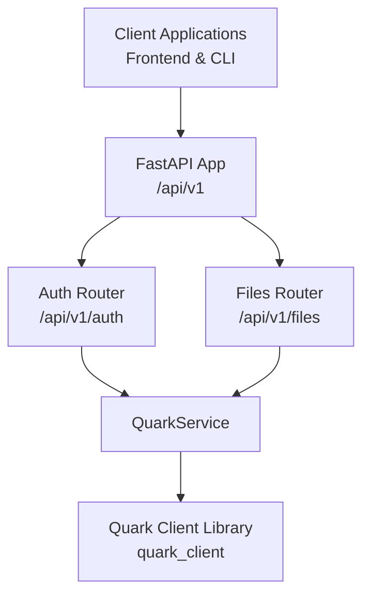
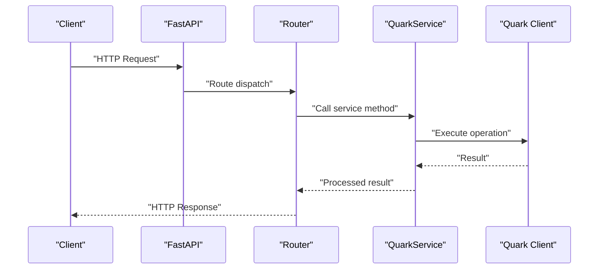
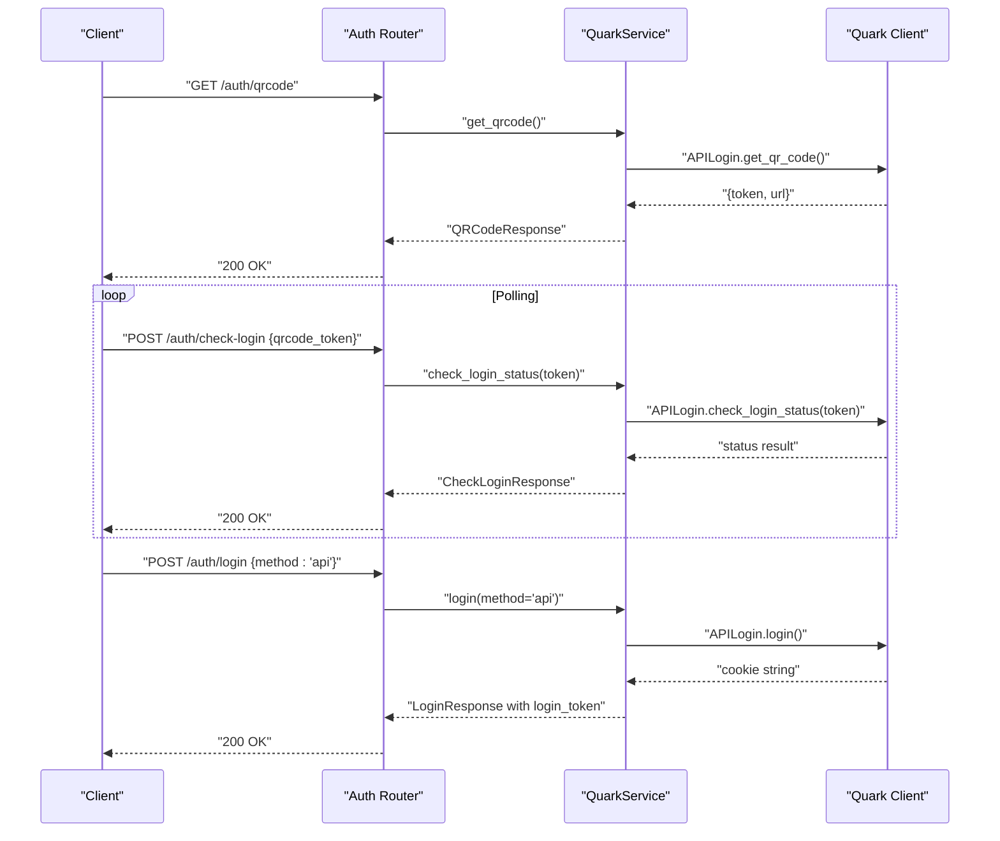
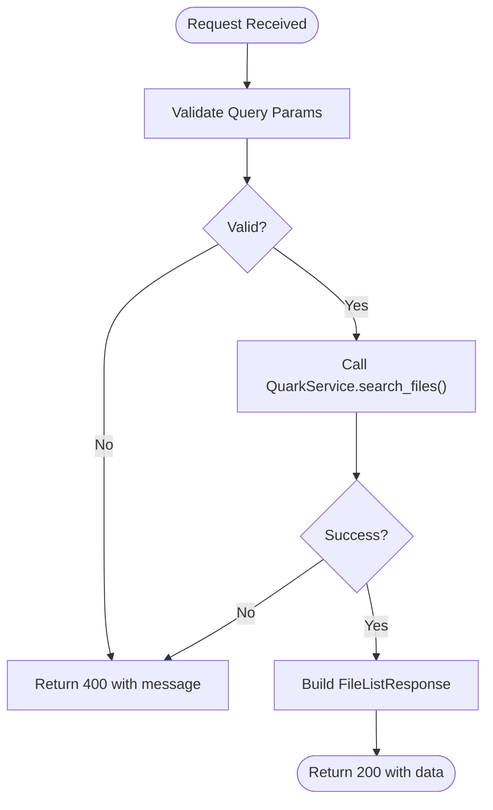
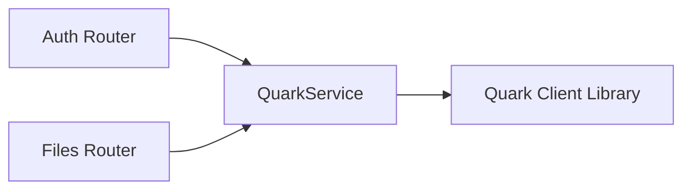

# API Reference

<cite>
**Referenced Files in This Document**
- [backend/app/main.py](file://backend/app/main.py)
- [backend/app/api/v1/router.py](file://backend/app/api/v1/router.py)
- [backend/app/api/v1/auth.py](file://backend/app/api/v1/auth.py)
- [backend/app/api/v1/files.py](file://backend/app/api/v1/files.py)
- [backend/app/schemas/auth.py](file://backend/app/schemas/auth.py)
- [backend/app/schemas/files.py](file://backend/app/schemas/files.py)
- [backend/app/services/quark_service.py](file://backend/app/services/quark_service.py)
- [quark_client/auth/api_login.py](file://quark_client/auth/api_login.py)
- [quark_client/auth/login.py](file://quark_client/auth/login.py)
- [quark_client/config.py](file://quark_client/config.py)
- [frontend/src/api/quark.ts](file://frontend/src/api/quark.ts)
- [quark_client/cli/commands/auth.py](file://quark_client/cli/commands/auth.py)
- [quark_client/cli/commands/basic_fileops.py](file://quark_client/cli/commands/basic_fileops.py)
</cite>

## Table of Contents
1. [Introduction](#introduction)
2. [Project Structure](#project-structure)
3. [Core Components](#core-components)
4. [Architecture Overview](#architecture-overview)
5. [Detailed Component Analysis](#detailed-component-analysis)
6. [Dependency Analysis](#dependency-analysis)
7. [Performance Considerations](#performance-considerations)
8. [Troubleshooting Guide](#troubleshooting-guide)
9. [Conclusion](#conclusion)
10. [Appendices](#appendices)

## Introduction
This document provides a comprehensive API reference for the REST endpoints exposed by the backend server. It covers authentication and file management endpoints, including HTTP methods, URL patterns, request/response schemas, authentication flows (QR code and cookie-based), and operational guidance for frontend and CLI clients. It also documents error handling, rate limiting considerations, and integration patterns.

## Project Structure
The API surface is organized under a versioned route prefix. The main application registers a versioned router that includes sub-routers for authentication and file management. The backend integrates with a client library that encapsulates the underlying Quark Cloud Drive APIs.

**Diagram sources**
- [backend/app/main.py:28](file://backend/app/main.py#L28)
- [backend/app/api/v1/router.py:22](file://backend/app/api/v1/router.py#L22)
- [backend/app/api/v1/auth.py:15](file://backend/app/api/v1/auth.py#L15)
- [backend/app/api/v1/files.py:16](file://backend/app/api/v1/files.py#L16)
- [backend/app/services/quark_service.py:22](file://backend/app/services/quark_service.py#L22)

**Section sources**
- [backend/app/main.py:12-28](file://backend/app/main.py#L12-L28)
- [backend/app/api/v1/router.py:15-24](file://backend/app/api/v1/router.py#L15-L24)

## Core Components
- Versioning: All routes are prefixed with /api/v1.
- CORS: Enabled for configured origins.
- Authentication: Implemented via a service layer that supports QR code login and cookie-based login. Responses include success flags and messages; some endpoints return tokens or cookies upon successful authentication.
- File Management: CRUD-like operations on files and folders, search, pagination, and storage info retrieval.

**Section sources**
- [backend/app/main.py:12-28](file://backend/app/main.py#L12-L28)
- [backend/app/api/v1/auth.py:15](file://backend/app/api/v1/auth.py#L15)
- [backend/app/api/v1/files.py:16](file://backend/app/api/v1/files.py#L16)
- [backend/app/services/quark_service.py:22](file://backend/app/services/quark_service.py#L22)

## Architecture Overview
The API is implemented with FastAPI and exposes two primary routers: auth and files. Requests are handled by route handlers that delegate to a service layer. The service layer interacts with the Quark client library to perform real operations against the Quark Cloud Drive service.

**Diagram sources**
- [backend/app/api/v1/auth.py:55](file://backend/app/api/v1/auth.py#L55)
- [backend/app/api/v1/files.py:19](file://backend/app/api/v1/files.py#L19)
- [backend/app/services/quark_service.py:138](file://backend/app/services/quark_service.py#L138)

## Detailed Component Analysis

### Authentication Endpoints
- Base path: /api/v1/auth
- Tags: Authentication

Endpoints:
- GET /api/v1/auth/qrcode
  - Purpose: Obtain a QR code URL and token for QR login.
  - Response model: QRCodeResponse
  - Typical fields: success, message, qrcode_url, qrcode_token
  - Notes: Frontend should poll the check-login endpoint with the returned token.

- POST /api/v1/auth/check-login
  - Purpose: Poll for login completion using the QR token.
  - Request body: CheckLoginRequest (qrcode_token)
  - Response model: CheckLoginResponse
  - Typical fields: success, message, is_logged_in, login_token

- POST /api/v1/auth/login
  - Purpose: Perform login using either QR flow or cookie-based method.
  - Request body: LoginRequest (method, cookies)
  - Response model: LoginResponse
  - Typical fields: success, message, qrcode_url, login_token
  - Notes: method accepts "api" (QR) and "simple" (cookie); cookies required for simple method.

- GET /api/v1/auth/status
  - Purpose: Get current authentication status and optional user info.
  - Response model: AuthStatusResponse
  - Typical fields: is_logged_in, user_info

- POST /api/v1/auth/logout
  - Purpose: Log out the current session.
  - Response model: LogoutResponse
  - Typical fields: success, message

Request/Response Schemas (selected):
- LoginRequest: method, cookies (optional)
- LoginResponse: success, message, qrcode_url (optional), login_token (optional)
- QRCodeResponse: success, message, qrcode_url (optional), qrcode_token (optional)
- CheckLoginRequest: qrcode_token
- CheckLoginResponse: success, message, is_logged_in, login_token (optional)
- AuthStatusResponse: is_logged_in, user_info (optional)
- LogoutResponse: success, message

Authentication Methods:
- QR Code Flow:
  - Step 1: GET /auth/qrcode to receive qrcode_url and qrcode_token.
  - Step 2: Poll POST /auth/check-login with qrcode_token until is_logged_in is true.
  - Step 3: On success, use the returned login_token (cookie string) for subsequent requests.
- Cookie-Based Flow:
  - Provide cookies in LoginRequest.cookies to authenticate immediately.

Common Use Cases:
- Initial login with QR code and polling.
- Re-authentication using stored cookies.
- Checking current login status before protected operations.

Integration Notes:
- Frontend clients should persist the returned cookie string and send it with subsequent authenticated requests.
- CLI clients can leverage the underlying login utilities to obtain and manage cookies.

**Section sources**
- [backend/app/api/v1/auth.py:18](file://backend/app/api/v1/auth.py#L18)
- [backend/app/api/v1/auth.py:38](file://backend/app/api/v1/auth.py#L38)
- [backend/app/api/v1/auth.py:55](file://backend/app/api/v1/auth.py#L55)
- [backend/app/api/v1/auth.py:78](file://backend/app/api/v1/auth.py#L78)
- [backend/app/api/v1/auth.py:98](file://backend/app/api/v1/auth.py#L98)
- [backend/app/schemas/auth.py:5](file://backend/app/schemas/auth.py#L5)
- [backend/app/schemas/auth.py:19](file://backend/app/schemas/auth.py#L19)
- [backend/app/schemas/auth.py:27](file://backend/app/schemas/auth.py#L27)
- [backend/app/schemas/auth.py:32](file://backend/app/schemas/auth.py#L32)
- [backend/app/schemas/auth.py:40](file://backend/app/schemas/auth.py#L40)
- [backend/app/schemas/auth.py:46](file://backend/app/schemas/auth.py#L46)
- [backend/app/services/quark_service.py:46](file://backend/app/services/quark_service.py#L46)
- [backend/app/services/quark_service.py:77](file://backend/app/services/quark_service.py#L77)
- [backend/app/services/quark_service.py:138](file://backend/app/services/quark_service.py#L138)
- [backend/app/services/quark_service.py:176](file://backend/app/services/quark_service.py#L176)
- [backend/app/services/quark_service.py:185](file://backend/app/services/quark_service.py#L185)
- [quark_client/auth/api_login.py:94](file://quark_client/auth/api_login.py#L94)
- [quark_client/auth/api_login.py:255](file://quark_client/auth/api_login.py#L255)
- [quark_client/auth/api_login.py:467](file://quark_client/auth/api_login.py#L467)
- [quark_client/auth/login.py:107](file://quark_client/auth/login.py#L107)
- [quark_client/auth/login.py:231](file://quark_client/auth/login.py#L231)
- [quark_client/auth/login.py:261](file://quark_client/auth/login.py#L261)
- [frontend/src/api/quark.ts:55](file://frontend/src/api/quark.ts#L55)
- [quark_client/cli/commands/auth.py:13](file://quark_client/cli/commands/auth.py#L13)
- [quark_client/cli/commands/auth.py:94](file://quark_client/cli/commands/auth.py#L94)
- [quark_client/cli/commands/auth.py:112](file://quark_client/cli/commands/auth.py#L112)

#### Authentication Flow (QR Code)

**Diagram sources**
- [backend/app/api/v1/auth.py:18](file://backend/app/api/v1/auth.py#L18)
- [backend/app/api/v1/auth.py:38](file://backend/app/api/v1/auth.py#L38)
- [backend/app/api/v1/auth.py:55](file://backend/app/api/v1/auth.py#L55)
- [backend/app/services/quark_service.py:46](file://backend/app/services/quark_service.py#L46)
- [backend/app/services/quark_service.py:77](file://backend/app/services/quark_service.py#L77)
- [backend/app/services/quark_service.py:138](file://backend/app/services/quark_service.py#L138)
- [quark_client/auth/api_login.py:94](file://quark_client/auth/api_login.py#L94)
- [quark_client/auth/api_login.py:255](file://quark_client/auth/api_login.py#L255)
- [quark_client/auth/api_login.py:467](file://quark_client/auth/api_login.py#L467)

### File Management Endpoints
- Base path: /api/v1/files
- Tags: File Management

Endpoints:
- GET /api/v1/files/list
  - Purpose: List files in a folder with pagination.
  - Query parameters: folder_id (default "0"), page (default 1), size (default 50, range 1..200).
  - Response model: FileListResponse
  - Typical fields: success, data, message

- POST /api/v1/files/folder
  - Purpose: Create a new folder.
  - Request body: CreateFolderRequest (folder_name, parent_id)
  - Response model: FileListResponse

- DELETE /api/v1/files/delete
  - Purpose: Delete one or more files/folders.
  - Request body: DeleteFilesRequest (file_ids: array)
  - Response model: FileListResponse

- PUT /api/v1/files/rename
  - Purpose: Rename a file or folder.
  - Request body: RenameFileRequest (file_id, new_name)
  - Response model: FileListResponse

- POST /api/v1/files/move
  - Purpose: Move one or more files/folders to a target folder.
  - Request body: MoveFilesRequest (file_ids: array, target_folder_id)
  - Response model: FileListResponse

- GET /api/v1/files/search
  - Purpose: Search files by keyword with pagination.
  - Query parameters: keyword (required), page (default 1), size (default 50, range 1..200).
  - Response model: FileListResponse

- GET /api/v1/files/storage
  - Purpose: Retrieve storage usage information.
  - Response model: StorageInfoResponse
  - Typical fields: success, data, message

- GET /api/v1/files/download/{file_id}
  - Purpose: Obtain a download URL for a file.
  - Path parameter: file_id
  - Response: JSON with success flag and data.download_url

Request/Response Schemas (selected):
- FileListRequest: folder_id, page, size
- FileListResponse: success, data (optional), message (optional)
- CreateFolderRequest: folder_name, parent_id
- DeleteFilesRequest: file_ids (array)
- RenameFileRequest: file_id, new_name
- MoveFilesRequest: file_ids (array), target_folder_id
- SearchFilesRequest: keyword, page, size
- StorageInfoResponse: success, data (optional), message (optional)

Common Use Cases:
- Listing root folder contents with pagination.
- Creating nested folder structures.
- Bulk deletion and moving operations.
- Searching across files with controlled page sizes.
- Retrieving storage capacity and usage.

Integration Notes:
- Frontend should handle pagination parameters and render lists accordingly.
- CLI can accept arrays of IDs for bulk operations.

**Section sources**
- [backend/app/api/v1/files.py:19](file://backend/app/api/v1/files.py#L19)
- [backend/app/api/v1/files.py:38](file://backend/app/api/v1/files.py#L38)
- [backend/app/api/v1/files.py:56](file://backend/app/api/v1/files.py#L56)
- [backend/app/api/v1/files.py:71](file://backend/app/api/v1/files.py#L71)
- [backend/app/api/v1/files.py:89](file://backend/app/api/v1/files.py#L89)
- [backend/app/api/v1/files.py:107](file://backend/app/api/v1/files.py#L107)
- [backend/app/api/v1/files.py:126](file://backend/app/api/v1/files.py#L126)
- [backend/app/api/v1/files.py:141](file://backend/app/api/v1/files.py#L141)
- [backend/app/schemas/files.py:5](file://backend/app/schemas/files.py#L5)
- [backend/app/schemas/files.py:12](file://backend/app/schemas/files.py#L12)
- [backend/app/schemas/files.py:19](file://backend/app/schemas/files.py#L19)
- [backend/app/schemas/files.py:25](file://backend/app/schemas/files.py#L25)
- [backend/app/schemas/files.py:30](file://backend/app/schemas/files.py#L30)
- [backend/app/schemas/files.py:36](file://backend/app/schemas/files.py#L36)
- [backend/app/schemas/files.py:42](file://backend/app/schemas/files.py#L42)
- [backend/app/schemas/files.py:49](file://backend/app/schemas/files.py#L49)
- [backend/app/services/quark_service.py:202](file://backend/app/services/quark_service.py#L202)
- [backend/app/services/quark_service.py:228](file://backend/app/services/quark_service.py#L228)
- [backend/app/services/quark_service.py:244](file://backend/app/services/quark_service.py#L244)
- [backend/app/services/quark_service.py:260](file://backend/app/services/quark_service.py#L260)
- [backend/app/services/quark_service.py:276](file://backend/app/services/quark_service.py#L276)
- [backend/app/services/quark_service.py:292](file://backend/app/services/quark_service.py#L292)
- [backend/app/services/quark_service.py:315](file://backend/app/services/quark_service.py#L315)
- [backend/app/services/quark_service.py:337](file://backend/app/services/quark_service.py#L337)
- [frontend/src/api/quark.ts:77](file://frontend/src/api/quark.ts#L77)
- [quark_client/cli/commands/basic_fileops.py:14](file://quark_client/cli/commands/basic_fileops.py#L14)
- [quark_client/cli/commands/basic_fileops.py:45](file://quark_client/cli/commands/basic_fileops.py#L45)
- [quark_client/cli/commands/basic_fileops.py:111](file://quark_client/cli/commands/basic_fileops.py#L111)
- [quark_client/cli/commands/basic_fileops.py:216](file://quark_client/cli/commands/basic_fileops.py#L216)

#### File Operation Flow (Search)

**Diagram sources**
- [backend/app/api/v1/files.py:107](file://backend/app/api/v1/files.py#L107)
- [backend/app/services/quark_service.py:292](file://backend/app/services/quark_service.py#L292)

## Dependency Analysis
The backend routes depend on service-layer methods that encapsulate interactions with the Quark client library. The service layer centralizes error handling and response shaping.

**Diagram sources**
- [backend/app/api/v1/auth.py:13](file://backend/app/api/v1/auth.py#L13)
- [backend/app/api/v1/files.py:14](file://backend/app/api/v1/files.py#L14)
- [backend/app/services/quark_service.py:10](file://backend/app/services/quark_service.py#L10)

**Section sources**
- [backend/app/api/v1/auth.py:13](file://backend/app/api/v1/auth.py#L13)
- [backend/app/api/v1/files.py:14](file://backend/app/api/v1/files.py#L14)
- [backend/app/services/quark_service.py:10](file://backend/app/services/quark_service.py#L10)

## Performance Considerations
- Pagination: Use page and size parameters to limit payload sizes. The backend enforces minimum and maximum page sizes for list and search endpoints.
- Batch operations: Prefer bulk endpoints (delete, move) to reduce round trips.
- Cookies: Once authenticated, reuse the cookie string to avoid repeated login attempts.
- Rate limits: No explicit rate limiting is implemented in the backend; apply client-side throttling if interacting with external services.

[No sources needed since this section provides general guidance]

## Troubleshooting Guide
Common errors and handling strategies:
- Unauthenticated requests: Many endpoints require a valid login. Use the authentication endpoints to obtain credentials.
- Invalid parameters: Ensure page and size fall within accepted ranges for list/search endpoints.
- Service failures: The service layer wraps external calls and returns structured messages. Inspect the message field for actionable details.
- QR login timeouts: If QR login fails or times out, retry by obtaining a new QR token and check-login again.

**Section sources**
- [backend/app/api/v1/files.py:20](file://backend/app/api/v1/files.py#L20)
- [backend/app/api/v1/files.py:107](file://backend/app/api/v1/files.py#L107)
- [backend/app/services/quark_service.py:202](file://backend/app/services/quark_service.py#L202)
- [backend/app/services/quark_service.py:292](file://backend/app/services/quark_service.py#L292)

## Conclusion
The API provides a clear set of endpoints for authentication and file management, with robust request/response schemas and practical flows for both QR code and cookie-based authentication. Clients should adhere to pagination parameters, maintain authentication state, and handle error messages returned by the service layer.

[No sources needed since this section summarizes without analyzing specific files]

## Appendices

### Endpoint Catalog
- Authentication
  - GET /api/v1/auth/qrcode
  - POST /api/v1/auth/check-login
  - POST /api/v1/auth/login
  - GET /api/v1/auth/status
  - POST /api/v1/auth/logout
- File Management
  - GET /api/v1/files/list
  - POST /api/v1/files/folder
  - DELETE /api/v1/files/delete
  - PUT /api/v1/files/rename
  - POST /api/v1/files/move
  - GET /api/v1/files/search
  - GET /api/v1/files/storage
  - GET /api/v1/files/download/{file_id}

### Versioning and Base URL
- Base URL: /api/v1
- Version: 1.0.0

**Section sources**
- [backend/app/main.py:12](file://backend/app/main.py#L12)

### Client Implementation Guidelines
- Frontend
  - Persist the login_token (cookie string) received after successful authentication.
  - Use the provided TS client wrappers for type-safe calls.
- CLI
  - Use the built-in commands for login, logout, and status checks.
  - For file operations, leverage the command utilities that internally call the service layer.

**Section sources**
- [frontend/src/api/quark.ts:55](file://frontend/src/api/quark.ts#L55)
- [quark_client/cli/commands/auth.py](file://quark_client/cli/commands/auth.py)
- [quark_client/cli/commands/basic_fileops.py](file://quark_client/cli/commands/basic_fileops.py)

### Configuration References
- Backend CORS origins and other settings are managed via environment-backed settings.
- Quark client configuration includes base URLs, timeouts, retries, and default parameters.

**Section sources**
- [backend/app/core/config.py](file://backend/app/core/config.py)
- [quark_client/config.py](file://quark_client/config.py)