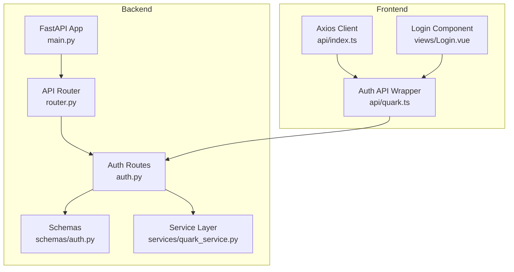
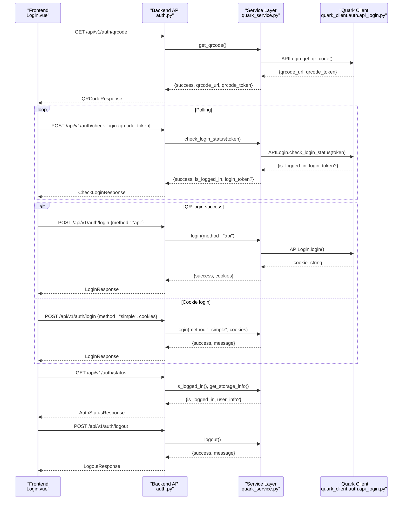
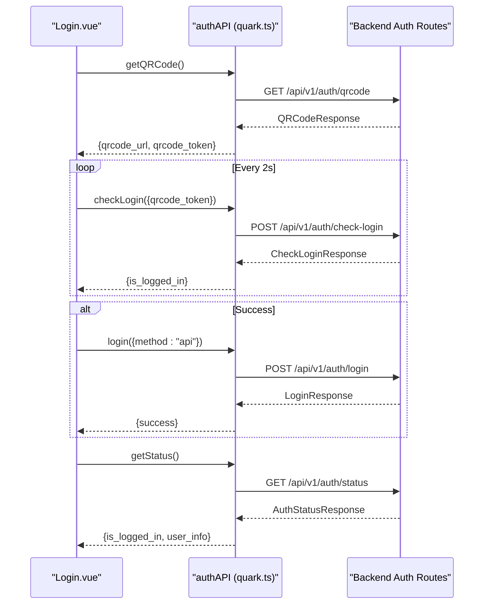
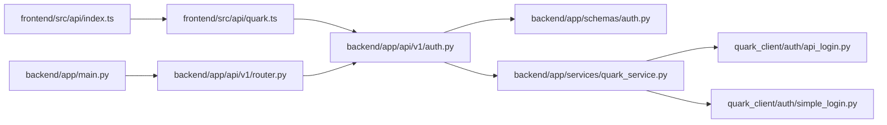

# Authentication Endpoints

<cite>
**Referenced Files in This Document**
- [auth.py](file://backend/app/api/v1/auth.py)
- [auth.py](file://backend/app/schemas/auth.py)
- [quark_service.py](file://backend/app/services/quark_service.py)
- [router.py](file://backend/app/api/v1/router.py)
- [main.py](file://backend/app/main.py)
- [config.py](file://backend/app/core/config.py)
- [quark.ts](file://frontend/src/api/quark.ts)
- [index.ts](file://frontend/src/api/index.ts)
- [Login.vue](file://frontend/src/views/Login.vue)
- [api_login.py](file://quark_client/auth/api_login.py)
- [simple_login.py](file://quark_client/auth/simple_login.py)
- [qr_code.py](file://quark_client/utils/qr_code.py)
</cite>

## Table of Contents
1. [Introduction](#introduction)
2. [Project Structure](#project-structure)
3. [Core Components](#core-components)
4. [Architecture Overview](#architecture-overview)
5. [Detailed Component Analysis](#detailed-component-analysis)
6. [Dependency Analysis](#dependency-analysis)
7. [Performance Considerations](#performance-considerations)
8. [Troubleshooting Guide](#troubleshooting-guide)
9. [Conclusion](#conclusion)

## Introduction
This document provides comprehensive API documentation for the authentication endpoints that enable users to log in to the Quark Pan service. It covers:
- QR code login flow with GET /api/v1/auth/qrcode and POST /api/v1/auth/check-login
- Direct login via cookie-based authentication with POST /api/v1/auth/login
- Status and logout endpoints GET /api/v1/auth/status and POST /api/v1/auth/logout
- Request/response schemas, error handling, and integration patterns with the frontend

## Project Structure
The authentication system spans backend FastAPI routes, Pydantic schemas, a service layer, and frontend integration:
- Backend API routes define the authentication endpoints
- Schemas validate request/response payloads
- Service layer orchestrates login flows and interacts with the Quark client
- Frontend integrates with the backend via Axios and Vue components

**Diagram sources**
- [main.py:12-28](file://backend/app/main.py#L12-L28)
- [router.py:21-23](file://backend/app/api/v1/router.py#L21-L23)
- [auth.py:15-107](file://backend/app/api/v1/auth.py#L15-L107)
- [auth.py:4-12](file://backend/app/api/v1/auth.py#L4-L12)
- [quark_service.py:23-377](file://backend/app/services/quark_service.py#L23-L377)
- [index.ts:3-9](file://frontend/src/api/index.ts#L3-L9)
- [quark.ts:55-75](file://frontend/src/api/quark.ts#L55-L75)
- [Login.vue:62-216](file://frontend/src/views/Login.vue#L62-L216)

**Section sources**
- [main.py:12-28](file://backend/app/main.py#L12-L28)
- [router.py:21-23](file://backend/app/api/v1/router.py#L21-L23)
- [auth.py:15-107](file://backend/app/api/v1/auth.py#L15-L107)
- [quark_service.py:23-377](file://backend/app/services/quark_service.py#L23-L377)
- [index.ts:3-9](file://frontend/src/api/index.ts#L3-L9)
- [quark.ts:55-75](file://frontend/src/api/quark.ts#L55-L75)
- [Login.vue:62-216](file://frontend/src/views/Login.vue#L62-L216)

## Core Components
- Authentication routes: GET /api/v1/auth/qrcode, POST /api/v1/auth/check-login, POST /api/v1/auth/login, GET /api/v1/auth/status, POST /api/v1/auth/logout
- Pydantic schemas for request/response validation
- Service layer managing login flows and client initialization
- Frontend API wrapper and Vue component handling user interactions

Key responsibilities:
- QR code generation and polling for login completion
- Cookie-based login for manual sessions
- Session status reporting and logout
- Frontend integration for seamless UX

**Section sources**
- [auth.py:18-107](file://backend/app/api/v1/auth.py#L18-L107)
- [auth.py:5-49](file://backend/app/schemas/auth.py#L5-L49)
- [quark_service.py:54-216](file://backend/app/services/quark_service.py#L54-L216)
- [quark.ts:55-75](file://frontend/src/api/quark.ts#L55-L75)
- [Login.vue:84-207](file://frontend/src/views/Login.vue#L84-L207)

## Architecture Overview
The authentication flow consists of:
- Frontend requests QR code, renders it, and polls for login completion
- Backend generates QR code and token, checks login status against Quark APIs
- Successful login returns either a cookie string or redirect URL depending on method
- Status endpoint reports logged-in state and user storage info
- Logout terminates the session

**Diagram sources**
- [auth.py:18-107](file://backend/app/api/v1/auth.py#L18-L107)
- [quark_service.py:54-216](file://backend/app/services/quark_service.py#L54-L216)
- [api_login.py:94-521](file://quark_client/auth/api_login.py#L94-L521)
- [Login.vue:84-207](file://frontend/src/views/Login.vue#L84-L207)
- [quark.ts:55-75](file://frontend/src/api/quark.ts#L55-L75)

## Detailed Component Analysis

### Endpoint: GET /api/v1/auth/qrcode
- Purpose: Non-blocking QR code generation for QR login flow
- Response model: QRCodeResponse with success, message, qrcode_url, qrcode_token
- Behavior:
  - Calls service to obtain QR code and token
  - Raises HTTP 400 on failure with detailed message
- Frontend usage:
  - Renders QR code and starts polling with qrcode_token

Example request:
- Method: GET
- URL: /api/v1/auth/qrcode
- Headers: Content-Type: application/json

Example response (success):
- Status: 200 OK
- Body: { "success": true, "message": "...", "qrcode_url": "...", "qrcode_token": "..." }

Example response (error):
- Status: 400 Bad Request
- Body: { "success": false, "message": "..." }

Security considerations:
- QR code token is short-lived; frontend must poll promptly and handle expiration

**Section sources**
- [auth.py:18-35](file://backend/app/api/v1/auth.py#L18-L35)
- [auth.py:19-24](file://backend/app/schemas/auth.py#L19-L24)
- [quark_service.py:54-83](file://backend/app/services/quark_service.py#L54-L83)
- [api_login.py:94-171](file://quark_client/auth/api_login.py#L94-L171)
- [Login.vue:84-140](file://frontend/src/views/Login.vue#L84-L140)

### Endpoint: POST /api/v1/auth/check-login
- Purpose: Polling endpoint to check QR login completion
- Request model: CheckLoginRequest with qrcode_token
- Response model: CheckLoginResponse with success, message, is_logged_in, login_token?
- Behavior:
  - Checks login status against Quark APIs
  - Returns is_logged_in true with login_token on success
  - Returns waiting state until completion or failure
- Frontend usage:
  - Polls every 2 seconds until success or timeout

Example request:
- Method: POST
- URL: /api/v1/auth/check-login
- Headers: Content-Type: application/json
- Body: { "qrcode_token": "..." }

Example response (pending):
- Status: 200 OK
- Body: { "success": true, "message": "waiting...", "is_logged_in": false }

Example response (success):
- Status: 200 OK
- Body: { "success": true, "message": "success", "is_logged_in": true, "login_token": "..." }

Example response (failure/expired):
- Status: 200 OK
- Body: { "success": false, "message": "...", "is_logged_in": false }

Rate limiting:
- Frontend polls every 2 seconds; backend does not implement server-side rate limiting for this endpoint

**Section sources**
- [auth.py:38-52](file://backend/app/api/v1/auth.py#L38-L52)
- [auth.py:27-37](file://backend/app/schemas/auth.py#L27-L37)
- [quark_service.py:85-152](file://backend/app/services/quark_service.py#L85-L152)
- [api_login.py:255-307](file://quark_client/auth/api_login.py#L255-L307)
- [Login.vue:142-176](file://frontend/src/views/Login.vue#L142-L176)

### Endpoint: POST /api/v1/auth/login
- Purpose: Direct login endpoint supporting two methods
- Request model: LoginRequest with method ("api" or "simple") and optional cookies
- Response model: LoginResponse with success, message, qrcode_url?, login_token?
- Behavior:
  - method="api": triggers QR login flow and returns cookies upon success
  - method="simple": expects cookies string for cookie-based login
  - Raises HTTP 400 on failure with detailed message
- Frontend usage:
  - QR login: call GET /auth/qrcode then POST /auth/check-login, then POST /auth/login with method="api"
  - Cookie login: call with method="simple" and cookies string

Example request (QR login):
- Method: POST
- URL: /api/v1/auth/login
- Body: { "method": "api" }

Example response (QR login success):
- Status: 200 OK
- Body: { "success": true, "message": "...", "login_token": "..." }

Example request (Cookie login):
- Method: POST
- URL: /api/v1/auth/login
- Body: { "method": "simple", "cookies": "..." }

Example response (Cookie login success):
- Status: 200 OK
- Body: { "success": true, "message": "..." }

Security considerations:
- Cookies contain sensitive session data; ensure secure transmission and storage
- Cookie login bypasses QR flow; validate cookie format and origin

**Section sources**
- [auth.py:55-75](file://backend/app/api/v1/auth.py#L55-L75)
- [auth.py:5-16](file://backend/app/schemas/auth.py#L5-L16)
- [quark_service.py:154-190](file://backend/app/services/quark_service.py#L154-L190)
- [simple_login.py:205-223](file://quark_client/auth/simple_login.py#L205-L223)
- [Login.vue:186-207](file://frontend/src/views/Login.vue#L186-L207)

### Endpoint: GET /api/v1/auth/status
- Purpose: Report current authentication status and user storage info
- Response model: AuthStatusResponse with is_logged_in and optional user_info
- Behavior:
  - Checks service is_logged_in flag
  - Attempts to fetch storage info when logged in
  - Returns user_info only if available and successful
- Frontend usage:
  - Used to hydrate UI state and show user details

Example response (logged in):
- Status: 200 OK
- Body: { "is_logged_in": true, "user_info": { "total": "...", "used": "..." } }

Example response (not logged in):
- Status: 200 OK
- Body: { "is_logged_in": false, "user_info": null }

**Section sources**
- [auth.py:78-95](file://backend/app/api/v1/auth.py#L78-L95)
- [auth.py:40-43](file://backend/app/schemas/auth.py#L40-L43)
- [quark_service.py:192-199](file://backend/app/services/quark_service.py#L192-L199)
- [quark_service.py:331-351](file://backend/app/services/quark_service.py#L331-L351)

### Endpoint: POST /api/v1/auth/logout
- Purpose: Terminate current session
- Response model: LogoutResponse with success and message
- Behavior:
  - Calls service logout which clears client and sets logged-out state
- Frontend usage:
  - Clears local state and redirects to login

Example request:
- Method: POST
- URL: /api/v1/auth/logout

Example response:
- Status: 200 OK
- Body: { "success": true, "message": "..." }

**Section sources**
- [auth.py:98-106](file://backend/app/api/v1/auth.py#L98-L106)
- [auth.py:46-49](file://backend/app/schemas/auth.py#L46-L49)
- [quark_service.py:201-216](file://backend/app/services/quark_service.py#L201-L216)

### Frontend Integration Patterns
- Axios client configured with base URL "/api/v1"
- Auth API wrapper exposes typed functions for each endpoint
- Login component:
  - Generates QR code and renders canvas
  - Polls check-login endpoint every 2 seconds
  - Handles success and error states
  - Supports cookie login mode

**Diagram sources**
- [Login.vue:84-207](file://frontend/src/views/Login.vue#L84-L207)
- [quark.ts:55-75](file://frontend/src/api/quark.ts#L55-L75)
- [auth.py:18-107](file://backend/app/api/v1/auth.py#L18-L107)

**Section sources**
- [index.ts:3-9](file://frontend/src/api/index.ts#L3-L9)
- [quark.ts:55-75](file://frontend/src/api/quark.ts#L55-L75)
- [Login.vue:84-207](file://frontend/src/views/Login.vue#L84-L207)

## Dependency Analysis
- Backend FastAPI app registers v1 router under "/api/v1"
- Auth routes depend on service layer for business logic
- Service layer depends on quark_client for external API interactions
- Frontend Axios client targets "/api/v1" and wraps auth endpoints

**Diagram sources**
- [index.ts:3-9](file://frontend/src/api/index.ts#L3-L9)
- [quark.ts:55-75](file://frontend/src/api/quark.ts#L55-L75)
- [auth.py:4-12](file://backend/app/api/v1/auth.py#L4-L12)
- [quark_service.py:11-20](file://backend/app/services/quark_service.py#L11-L20)
- [api_login.py:20-52](file://quark_client/auth/api_login.py#L20-L52)
- [simple_login.py:16-26](file://quark_client/auth/simple_login.py#L16-L26)
- [main.py:27-28](file://backend/app/main.py#L27-L28)
- [router.py:21-23](file://backend/app/api/v1/router.py#L21-L23)

**Section sources**
- [main.py:27-28](file://backend/app/main.py#L27-L28)
- [router.py:21-23](file://backend/app/api/v1/router.py#L21-L23)
- [auth.py:4-12](file://backend/app/api/v1/auth.py#L4-L12)
- [quark_service.py:11-20](file://backend/app/services/quark_service.py#L11-L20)
- [index.ts:3-9](file://frontend/src/api/index.ts#L3-L9)
- [quark.ts:55-75](file://frontend/src/api/quark.ts#L55-L75)

## Performance Considerations
- QR polling interval: 2 seconds balances responsiveness with server load
- Timeout: 5-minute automatic stop prevents long-running polling
- Service layer caches client and QR token to minimize repeated network calls
- Frontend clears timers on unmount to prevent memory leaks

[No sources needed since this section provides general guidance]

## Troubleshooting Guide
Common issues and resolutions:
- QR code expired: Stop polling, show error, prompt to refresh
  - Symptom: 400 response from check-login or repeated pending states
  - Action: Call GET /api/v1/auth/qrcode again and restart polling
- Network errors: Retry with exponential backoff in production
  - Symptom: Axios errors or timeouts
  - Action: Show retry prompt and log error details
- Cookie invalid: Clear stored cookies and re-authenticate
  - Symptom: Login fails immediately with cookie login
  - Action: Prompt user to re-enter cookies or switch to QR login
- Rate limiting: Not implemented server-side; avoid excessive polling
  - Symptom: Throttled responses (if added later)
  - Action: Respect polling intervals and implement client-side limits

**Section sources**
- [Login.vue:142-176](file://frontend/src/views/Login.vue#L142-L176)
- [auth.py:27-28](file://backend/app/api/v1/auth.py#L27-L28)
- [quark_service.py:134-146](file://backend/app/services/quark_service.py#L134-L146)

## Conclusion
The authentication system provides a robust, user-friendly login experience with both QR and cookie-based methods. The backend enforces validation via Pydantic schemas, the service layer manages external API interactions, and the frontend delivers a responsive UI with polling and error handling. Security is addressed through careful handling of cookies and QR tokens, with clear separation between QR and cookie login flows.