# File Management Endpoints

<cite>
**Referenced Files in This Document**
- [backend/app/main.py](file://backend/app/main.py)
- [backend/app/api/v1/router.py](file://backend/app/api/v1/router.py)
- [backend/app/api/v1/files.py](file://backend/app/api/v1/files.py)
- [backend/app/schemas/files.py](file://backend/app/schemas/files.py)
- [frontend/src/api/quark.ts](file://frontend/src/api/quark.ts)
- [frontend/src/views/Files.vue](file://frontend/src/views/Files.vue)
- [quark_client/services/file_service.py](file://quark_client/services/file_service.py)
- [quark_client/core/api_client.py](file://quark_client/core/api_client.py)
- [quark_client/config.py](file://quark_client/config.py)
</cite>

## Table of Contents
1. [Introduction](#introduction)
2. [Project Structure](#project-structure)
3. [Core Components](#core-components)
4. [Architecture Overview](#architecture-overview)
5. [Detailed Component Analysis](#detailed-component-analysis)
6. [Dependency Analysis](#dependency-analysis)
7. [Performance Considerations](#performance-considerations)
8. [Troubleshooting Guide](#troubleshooting-guide)
9. [Conclusion](#conclusion)
10. [Appendices](#appendices)

## Introduction
This document provides comprehensive API documentation for file management endpoints. It covers all file operations and queries, including listing, creating, deleting, renaming, moving, searching, and downloading files. It also documents storage quota retrieval and integrates frontend usage patterns for a file browser component. The documentation includes endpoint definitions, request/response schemas, error handling, pagination, and practical examples.

## Project Structure
The file management API is implemented in a FastAPI backend with a dedicated router for file operations under the v1 API. Frontend integration is provided via a typed API module and a Vue-based file browser view. The backend delegates actual cloud operations to a service layer that communicates with the Quark Cloud Drive API.

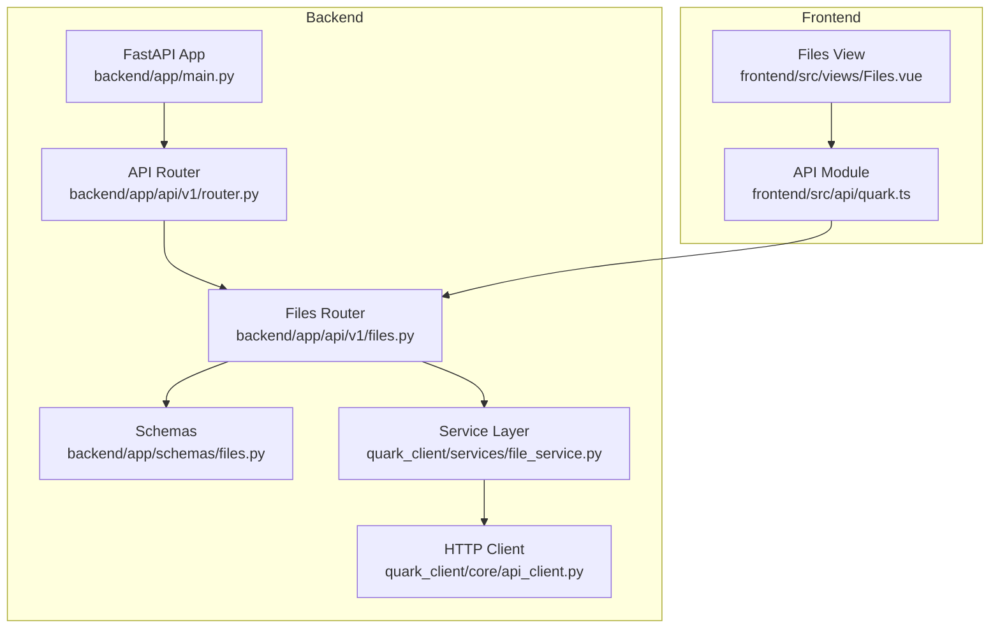

**Diagram sources**
- [backend/app/main.py:12-28](file://backend/app/main.py#L12-L28)
- [backend/app/api/v1/router.py:21-24](file://backend/app/api/v1/router.py#L21-L24)
- [backend/app/api/v1/files.py:16](file://backend/app/api/v1/files.py#L16)
- [backend/app/schemas/files.py:1-54](file://backend/app/schemas/files.py#L1-L54)
- [quark_client/services/file_service.py:13-24](file://quark_client/services/file_service.py#L13-L24)
- [quark_client/core/api_client.py:16-38](file://quark_client/core/api_client.py#L16-L38)
- [frontend/src/api/quark.ts:77-124](file://frontend/src/api/quark.ts#L77-L124)
- [frontend/src/views/Files.vue:69-214](file://frontend/src/views/Files.vue#L69-L214)

**Section sources**
- [backend/app/main.py:12-28](file://backend/app/main.py#L12-L28)
- [backend/app/api/v1/router.py:21-24](file://backend/app/api/v1/router.py#L21-L24)
- [frontend/src/api/quark.ts:77-124](file://frontend/src/api/quark.ts#L77-L124)
- [frontend/src/views/Files.vue:69-214](file://frontend/src/views/Files.vue#L69-L214)

## Core Components
- Backend API: Exposes file management endpoints under /api/v1/files with FastAPI routers and Pydantic schemas.
- Service Layer: Implements file operations by calling the Quark Cloud Drive API via an HTTP client.
- Frontend API Module: Provides strongly-typed wrappers for file operations used by the Vue file browser.
- Frontend View: Integrates the API module to render file lists, support navigation, and trigger actions.

Key responsibilities:
- Endpoint orchestration and request validation
- Delegation to service layer for cloud operations
- Response modeling and error propagation
- Frontend integration for UI interactions

**Section sources**
- [backend/app/api/v1/files.py:19-149](file://backend/app/api/v1/files.py#L19-L149)
- [backend/app/schemas/files.py:5-54](file://backend/app/schemas/files.py#L5-L54)
- [quark_client/services/file_service.py:25-800](file://quark_client/services/file_service.py#L25-L800)
- [frontend/src/api/quark.ts:77-124](file://frontend/src/api/quark.ts#L77-L124)

## Architecture Overview
The file management API follows a layered architecture:
- Presentation Layer: FastAPI routes define endpoints and validate requests.
- Application Layer: Routers delegate to service functions.
- Domain Layer: Service functions call the Quark Cloud Drive API client.
- Infrastructure Layer: HTTP client handles network requests, authentication, and error mapping.

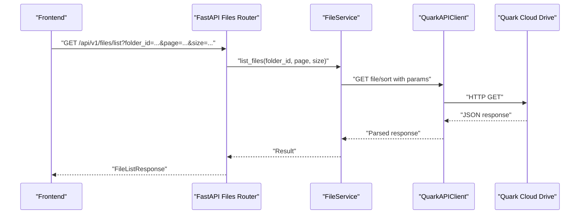

**Diagram sources**
- [backend/app/api/v1/files.py:19-35](file://backend/app/api/v1/files.py#L19-L35)
- [quark_client/services/file_service.py:25-60](file://quark_client/services/file_service.py#L25-L60)
- [quark_client/core/api_client.py:184-190](file://quark_client/core/api_client.py#L184-L190)

**Section sources**
- [backend/app/api/v1/files.py:19-149](file://backend/app/api/v1/files.py#L19-L149)
- [quark_client/services/file_service.py:25-248](file://quark_client/services/file_service.py#L25-L248)
- [quark_client/core/api_client.py:80-177](file://quark_client/core/api_client.py#L80-L177)

## Detailed Component Analysis

### Endpoint Catalog
All endpoints are exposed under /api/v1/files with the following methods and parameters.

- GET /api/v1/files/list
  - Purpose: List files and folders in a directory with pagination.
  - Query parameters:
    - folder_id: string (default "0" for root)
    - page: integer (>= 1)
    - size: integer (between 1 and 200)
  - Response: FileListResponse with success flag, data payload, and message.

- POST /api/v1/files/folder
  - Purpose: Create a new directory.
  - Request body: CreateFolderRequest
    - folder_name: string (required)
    - parent_id: string (default "0")
  - Response: FileListResponse.

- DELETE /api/v1/files/delete
  - Purpose: Remove files or folders.
  - Request body: DeleteFilesRequest
    - file_ids: array of strings (required)
  - Response: FileListResponse.

- PUT /api/v1/files/rename
  - Purpose: Rename a file or folder.
  - Request body: RenameFileRequest
    - file_id: string (required)
    - new_name: string (required)
  - Response: FileListResponse.

- POST /api/v1/files/move
  - Purpose: Move files to another directory.
  - Request body: MoveFilesRequest
    - file_ids: array of strings (required)
    - target_folder_id: string (required)
  - Response: FileListResponse.

- GET /api/v1/files/search
  - Purpose: Search files by keyword with pagination.
  - Query parameters:
    - keyword: string (required)
    - page: integer (>= 1)
    - size: integer (between 1 and 200)
  - Response: FileListResponse.

- GET /api/v1/files/storage
  - Purpose: Retrieve storage quota information (total, used, free).
  - Response: StorageInfoResponse.

- GET /api/v1/files/download/{file_id}
  - Purpose: Obtain a download URL for a file.
  - Path parameter: file_id (string)
  - Response: Generic result containing download URL and metadata.

Notes:
- The backend validates query/body parameters and raises HTTP 400 on validation failures.
- On operation failure, endpoints return HTTP 400 with a message and set success=false.

**Section sources**
- [backend/app/api/v1/files.py:19-149](file://backend/app/api/v1/files.py#L19-L149)
- [backend/app/schemas/files.py:5-54](file://backend/app/schemas/files.py#L5-L54)

### Request/Response Schemas
- FileListRequest: folder_id, page, size
- FileListResponse: success, data, message
- CreateFolderRequest: folder_name, parent_id
- DeleteFilesRequest: file_ids
- RenameFileRequest: file_id, new_name
- MoveFilesRequest: file_ids, target_folder_id
- SearchFilesRequest: keyword, page, size
- StorageInfoResponse: success, data, message

These schemas define the shape of requests and responses for file operations.

**Section sources**
- [backend/app/schemas/files.py:5-54](file://backend/app/schemas/files.py#L5-L54)

### Frontend Integration Patterns
- API module (frontend/src/api/quark.ts):
  - Provides typed functions for each endpoint.
  - Uses axios-like client to call backend endpoints.
  - Returns promises resolving to response models.

- Files view (frontend/src/views/Files.vue):
  - Loads files via filesAPI.listFiles().
  - Navigates directories by updating currentFolderId and pathList.
  - Triggers actions like createFolder, deleteFiles, getDownloadUrl.
  - Displays file list with icons, sizes, and timestamps.

Integration highlights:
- Pagination is controlled by page and size parameters.
- Download URLs are opened in a new tab.
- Error messages are surfaced via Element Plus notifications.

**Section sources**
- [frontend/src/api/quark.ts:77-124](file://frontend/src/api/quark.ts#L77-L124)
- [frontend/src/views/Files.vue:69-214](file://frontend/src/views/Files.vue#L69-L214)

### Service Layer and Cloud API Calls
The service layer encapsulates cloud operations:
- list_files: Calls file/sort with pagination and sorting parameters.
- create_folder: Posts to file endpoint with required fields.
- delete_files: Posts to file/delete with action_type=2.
- rename_file: Posts to file/rename with new name.
- search_files: Calls file/search with keyword and pagination.
- get_storage_info: Calls capacity endpoint.
- get_download_url: Posts to file/download with file IDs.

The HTTP client handles authentication, timeouts, and error mapping to APIError/AuthenticationError.

**Section sources**
- [quark_client/services/file_service.py:25-248](file://quark_client/services/file_service.py#L25-L248)
- [quark_client/core/api_client.py:80-177](file://quark_client/core/api_client.py#L80-L177)
- [quark_client/config.py:34-63](file://quark_client/config.py#L34-L63)

## Architecture Overview

```mermaid
classDiagram
class FilesRouter {
+GET /list
+POST /folder
+DELETE /delete
+PUT /rename
+POST /move
+GET /search
+GET /storage
+GET /download/{file_id}
}
class FileService {
+list_files(...)
+create_folder(...)
+delete_files(...)
+rename_file(...)
+search_files(...)
+get_storage_info()
+get_download_url(...)
}
class QuarkAPIClient {
+get(url, params)
+post(url, json_data, params)
-_make_request(...)
}
FilesRouter --> FileService : "delegates"
FileService --> QuarkAPIClient : "calls"
```

**Diagram sources**
- [backend/app/api/v1/files.py:19-149](file://backend/app/api/v1/files.py#L19-L149)
- [quark_client/services/file_service.py:13-24](file://quark_client/services/file_service.py#L13-L24)
- [quark_client/core/api_client.py:16-38](file://quark_client/core/api_client.py#L16-L38)

## Detailed Component Analysis

### GET /api/v1/files/list
- Purpose: Retrieve paginated file/folder entries for a given directory.
- Query parameters:
  - folder_id: Directory identifier; "0" indicates root.
  - page: Page number (>= 1).
  - size: Items per page (1..200).
- Response: FileListResponse with success flag and data payload.
- Typical data fields returned by the service include:
  - name, size, type, modified timestamp, and identifiers.
- Pagination: Controlled by page and size; service enforces bounds.

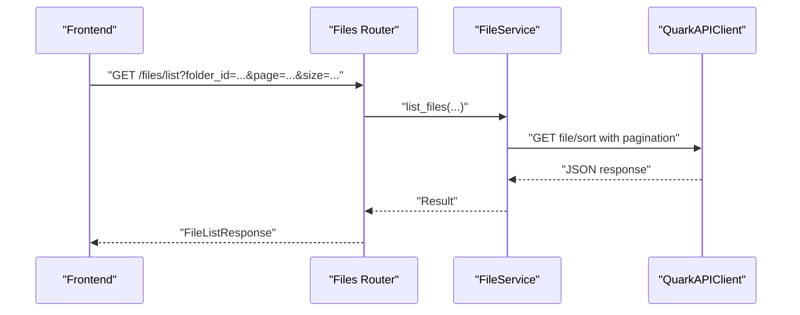

**Diagram sources**
- [backend/app/api/v1/files.py:19-35](file://backend/app/api/v1/files.py#L19-L35)
- [quark_client/services/file_service.py:25-60](file://quark_client/services/file_service.py#L25-L60)

**Section sources**
- [backend/app/api/v1/files.py:19-35](file://backend/app/api/v1/files.py#L19-L35)
- [quark_client/services/file_service.py:25-60](file://quark_client/services/file_service.py#L25-L60)

### POST /api/v1/files/folder
- Purpose: Create a new directory.
- Request body: CreateFolderRequest with folder_name and parent_id.
- Behavior: Delegates to service layer which posts to the cloud API.

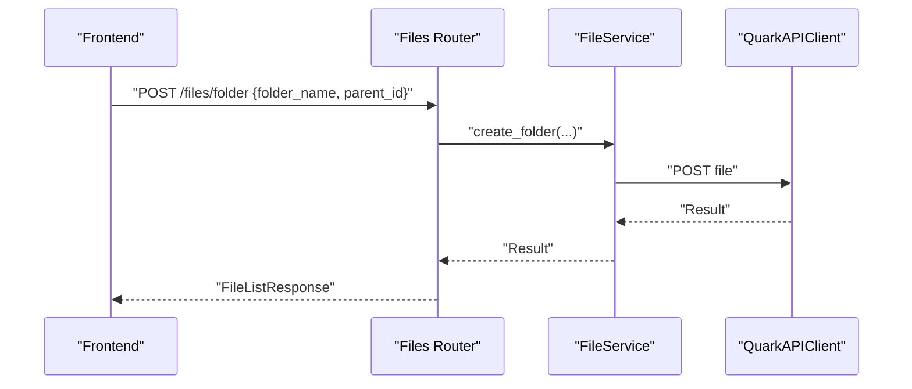

**Diagram sources**
- [backend/app/api/v1/files.py:38-53](file://backend/app/api/v1/files.py#L38-L53)
- [quark_client/services/file_service.py:103-129](file://quark_client/services/file_service.py#L103-L129)

**Section sources**
- [backend/app/api/v1/files.py:38-53](file://backend/app/api/v1/files.py#L38-L53)
- [quark_client/services/file_service.py:103-129](file://quark_client/services/file_service.py#L103-L129)

### DELETE /api/v1/files/delete
- Purpose: Remove one or more files or folders.
- Request body: DeleteFilesRequest with file_ids array.
- Behavior: Delegates to service layer which posts to the cloud delete endpoint.

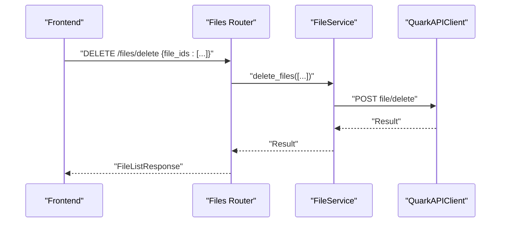

**Diagram sources**
- [backend/app/api/v1/files.py:56-68](file://backend/app/api/v1/files.py#L56-L68)
- [quark_client/services/file_service.py:131-155](file://quark_client/services/file_service.py#L131-L155)

**Section sources**
- [backend/app/api/v1/files.py:56-68](file://backend/app/api/v1/files.py#L56-L68)
- [quark_client/services/file_service.py:131-155](file://quark_client/services/file_service.py#L131-L155)

### PUT /api/v1/files/rename
- Purpose: Change the name of a file or folder.
- Request body: RenameFileRequest with file_id and new_name.
- Behavior: Delegates to service layer which posts to the rename endpoint.

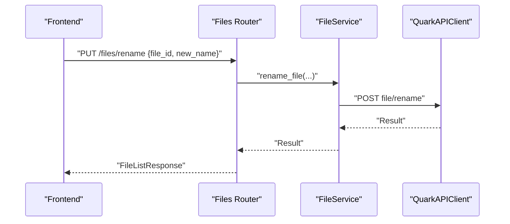

**Diagram sources**
- [backend/app/api/v1/files.py:71-86](file://backend/app/api/v1/files.py#L71-L86)
- [quark_client/services/file_service.py:157-181](file://quark_client/services/file_service.py#L157-L181)

**Section sources**
- [backend/app/api/v1/files.py:71-86](file://backend/app/api/v1/files.py#L71-L86)
- [quark_client/services/file_service.py:157-181](file://quark_client/services/file_service.py#L157-L181)

### POST /api/v1/files/move
- Purpose: Move files to a target directory.
- Request body: MoveFilesRequest with file_ids and target_folder_id.
- Behavior: Delegates to service layer which posts to the move endpoint. The service may handle asynchronous tasks and poll completion.

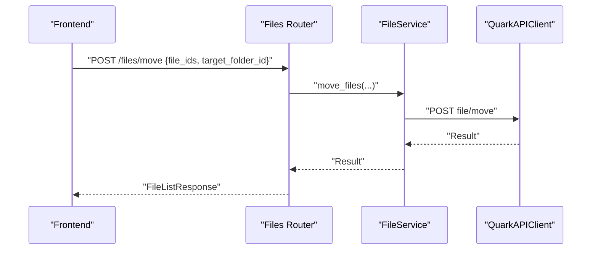

**Diagram sources**
- [backend/app/api/v1/files.py:89-104](file://backend/app/api/v1/files.py#L89-L104)
- [quark_client/services/file_service.py:386-427](file://quark_client/services/file_service.py#L386-L427)

**Section sources**
- [backend/app/api/v1/files.py:89-104](file://backend/app/api/v1/files.py#L89-L104)
- [quark_client/services/file_service.py:386-427](file://quark_client/services/file_service.py#L386-L427)

### GET /api/v1/files/search
- Purpose: Search files by keyword with pagination.
- Query parameters:
  - keyword: string (required)
  - page: integer (>= 1)
  - size: integer (1..200)
- Behavior: Delegates to service layer which calls the cloud search endpoint. Note: The service currently ignores the folder_id parameter for search scope.

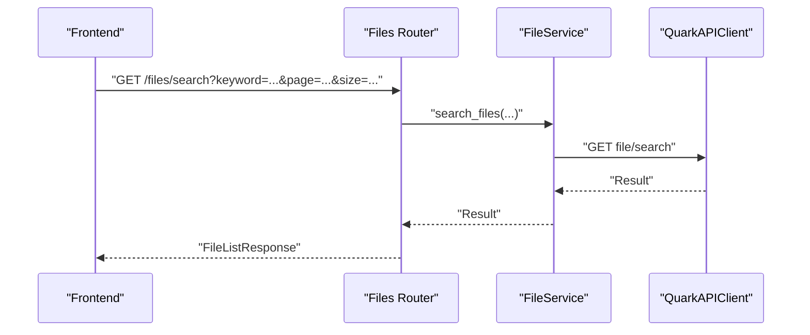

**Diagram sources**
- [backend/app/api/v1/files.py:107-123](file://backend/app/api/v1/files.py#L107-L123)
- [quark_client/services/file_service.py:183-219](file://quark_client/services/file_service.py#L183-L219)

**Section sources**
- [backend/app/api/v1/files.py:107-123](file://backend/app/api/v1/files.py#L107-L123)
- [quark_client/services/file_service.py:183-219](file://quark_client/services/file_service.py#L183-L219)

### GET /api/v1/files/storage
- Purpose: Retrieve storage quota information (total, used, free).
- Response: StorageInfoResponse with success flag and data payload.

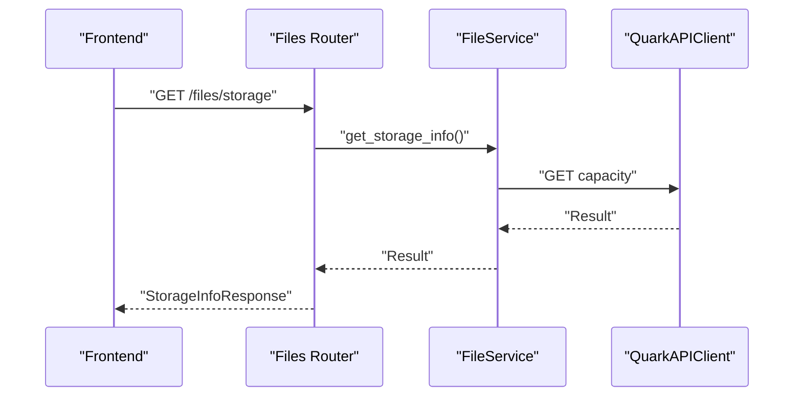

**Diagram sources**
- [backend/app/api/v1/files.py:126-138](file://backend/app/api/v1/files.py#L126-L138)
- [quark_client/services/file_service.py:240-248](file://quark_client/services/file_service.py#L240-L248)

**Section sources**
- [backend/app/api/v1/files.py:126-138](file://backend/app/api/v1/files.py#L126-L138)
- [quark_client/services/file_service.py:240-248](file://quark_client/services/file_service.py#L240-L248)

### GET /api/v1/files/download/{file_id}
- Purpose: Obtain a download URL for a file.
- Path parameter: file_id.
- Response: Generic result containing download URL and metadata.

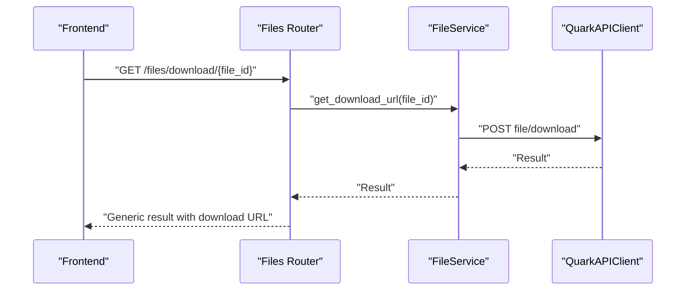

**Diagram sources**
- [backend/app/api/v1/files.py:141-149](file://backend/app/api/v1/files.py#L141-L149)
- [quark_client/services/file_service.py:580-608](file://quark_client/services/file_service.py#L580-L608)

**Section sources**
- [backend/app/api/v1/files.py:141-149](file://backend/app/api/v1/files.py#L141-L149)
- [quark_client/services/file_service.py:580-608](file://quark_client/services/file_service.py#L580-L608)

## Dependency Analysis

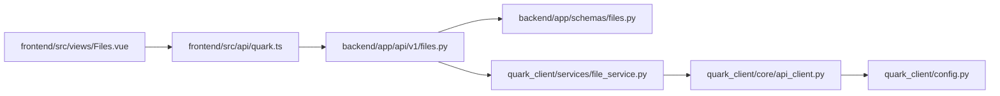

**Diagram sources**
- [frontend/src/api/quark.ts:77-124](file://frontend/src/api/quark.ts#L77-L124)
- [frontend/src/views/Files.vue:69-214](file://frontend/src/views/Files.vue#L69-L214)
- [backend/app/api/v1/files.py:19-149](file://backend/app/api/v1/files.py#L19-L149)
- [backend/app/schemas/files.py:5-54](file://backend/app/schemas/files.py#L5-L54)
- [quark_client/services/file_service.py:13-24](file://quark_client/services/file_service.py#L13-L24)
- [quark_client/core/api_client.py:16-38](file://quark_client/core/api_client.py#L16-L38)
- [quark_client/config.py:34-63](file://quark_client/config.py#L34-L63)

**Section sources**
- [frontend/src/api/quark.ts:77-124](file://frontend/src/api/quark.ts#L77-L124)
- [frontend/src/views/Files.vue:69-214](file://frontend/src/views/Files.vue#L69-L214)
- [backend/app/api/v1/files.py:19-149](file://backend/app/api/v1/files.py#L19-L149)
- [quark_client/services/file_service.py:13-24](file://quark_client/services/file_service.py#L13-L24)
- [quark_client/core/api_client.py:16-38](file://quark_client/core/api_client.py#L16-L38)

## Performance Considerations
- Pagination limits: size is bounded (1..200) to prevent excessive payloads.
- Sorting: Listing supports sorting parameters; ensure appropriate sort fields to minimize client-side filtering.
- Asynchronous operations: Move operations may be asynchronous; the service polls task completion with a configurable interval.
- Network timeouts: HTTP client sets a request timeout; consider retry policies for transient failures.
- Frontend rendering: Large lists should leverage virtualization and lazy loading to improve responsiveness.

[No sources needed since this section provides general guidance]

## Troubleshooting Guide
Common issues and resolutions:
- Authentication errors:
  - Symptoms: HTTP 401 or 403 responses.
  - Causes: Expired or missing credentials.
  - Resolution: Re-authenticate using the auth endpoints and ensure cookies are valid.
- Invalid paths or IDs:
  - Symptoms: Not found errors when listing or navigating.
  - Causes: Non-existent folder_id or incorrect path resolution.
  - Resolution: Verify folder_id and ensure it exists; use the service’s path resolution helpers if needed.
- Permission issues:
  - Symptoms: Operation denied or forbidden responses.
  - Causes: Insufficient permissions for the target resource.
  - Resolution: Check account permissions and target directory ownership.
- Validation errors:
  - Symptoms: HTTP 422 or 400 responses due to invalid parameters.
  - Causes: Out-of-range page/size or missing required fields.
  - Resolution: Adjust page and size within allowed bounds; ensure all required fields are present.
- Network failures:
  - Symptoms: Timeouts or connection errors.
  - Causes: Network instability or server overload.
  - Resolution: Retry with exponential backoff; verify base URL and headers.

**Section sources**
- [quark_client/core/api_client.py:146-177](file://quark_client/core/api_client.py#L146-L177)
- [quark_client/services/file_service.py:53-60](file://quark_client/services/file_service.py#L53-L60)

## Conclusion
The file management API provides a robust set of endpoints for directory listing, creation, deletion, renaming, moving, searching, and downloading. The backend enforces parameter validation and error propagation, while the service layer abstracts cloud interactions. Frontend integration is straightforward via typed API wrappers and a Vue-based file browser. Proper pagination, error handling, and authentication are essential for reliable operation.

[No sources needed since this section summarizes without analyzing specific files]

## Appendices

### Endpoint Reference Summary
- GET /api/v1/files/list
  - Query: folder_id, page, size
  - Response: FileListResponse
- POST /api/v1/files/folder
  - Body: folder_name, parent_id
  - Response: FileListResponse
- DELETE /api/v1/files/delete
  - Body: file_ids
  - Response: FileListResponse
- PUT /api/v1/files/rename
  - Body: file_id, new_name
  - Response: FileListResponse
- POST /api/v1/files/move
  - Body: file_ids, target_folder_id
  - Response: FileListResponse
- GET /api/v1/files/search
  - Query: keyword, page, size
  - Response: FileListResponse
- GET /api/v1/files/storage
  - Response: StorageInfoResponse
- GET /api/v1/files/download/{file_id}
  - Path: file_id
  - Response: Generic result with download URL

**Section sources**
- [backend/app/api/v1/files.py:19-149](file://backend/app/api/v1/files.py#L19-L149)
- [backend/app/schemas/files.py:5-54](file://backend/app/schemas/files.py#L5-L54)
- [frontend/src/api/quark.ts:77-124](file://frontend/src/api/quark.ts#L77-L124)