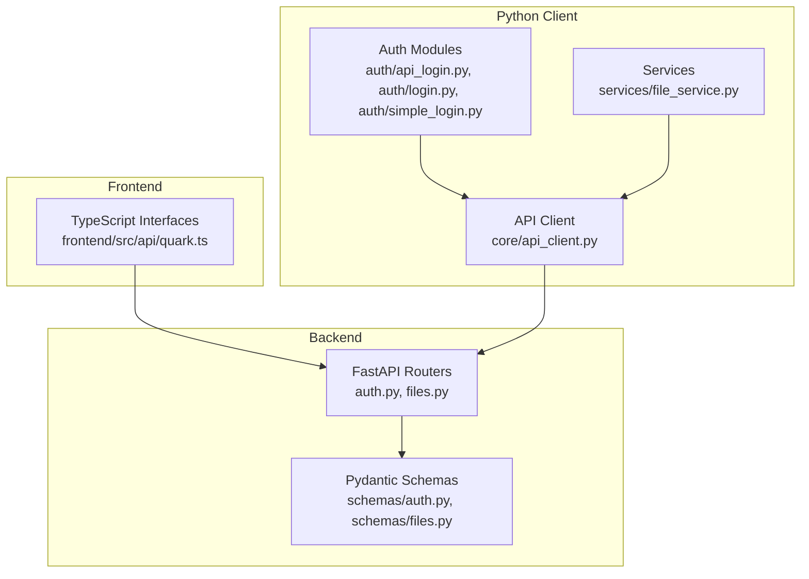
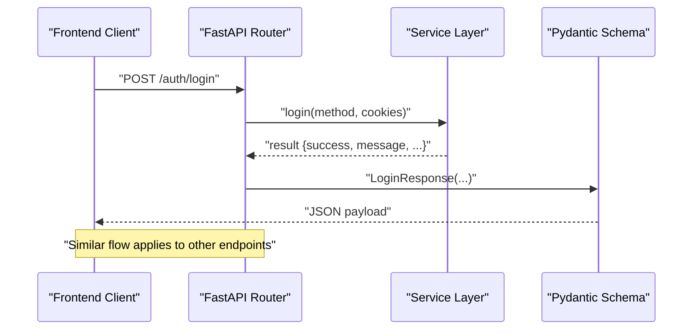
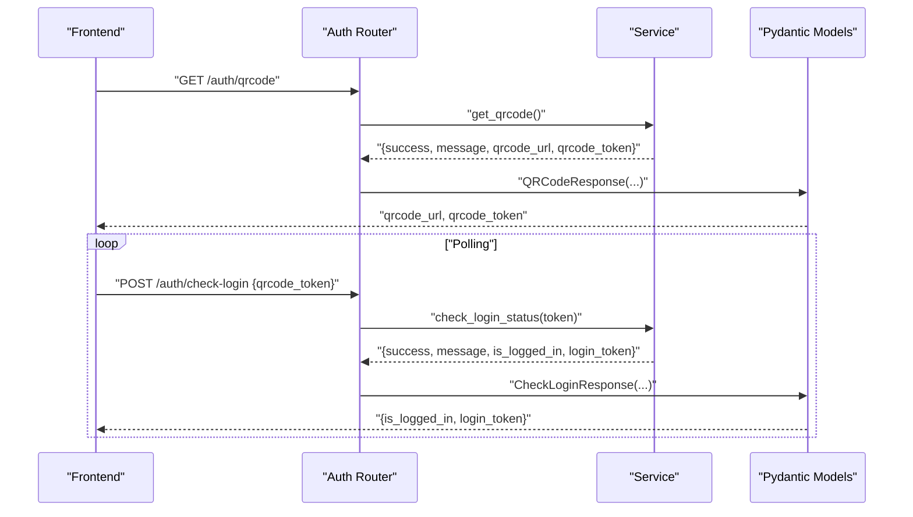
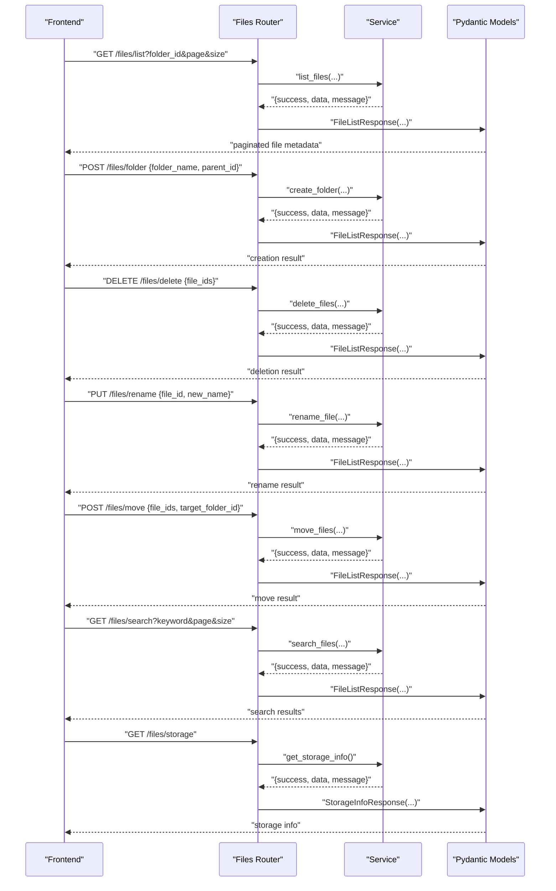
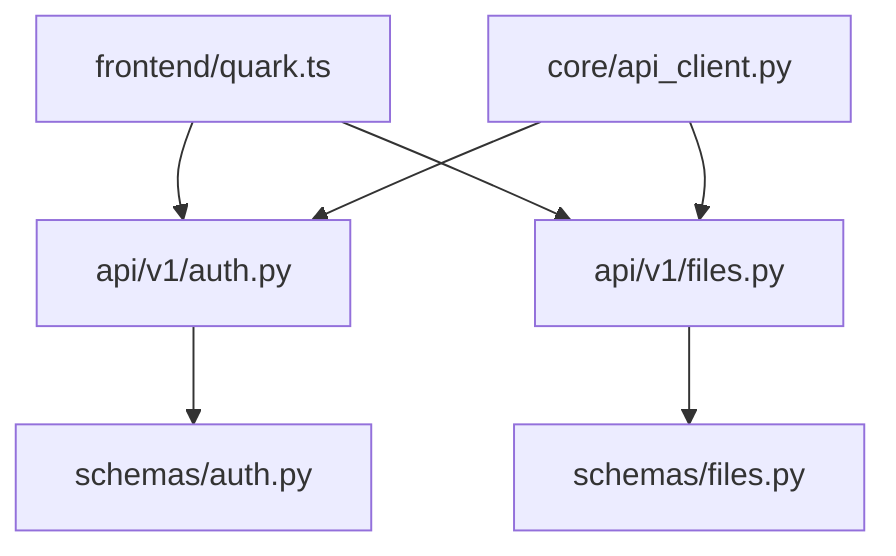

# Request/Response Schemas

<cite>
**Referenced Files in This Document**
- [backend/app/schemas/auth.py](file://backend/app/schemas/auth.py)
- [backend/app/schemas/files.py](file://backend/app/schemas/files.py)
- [backend/app/api/v1/auth.py](file://backend/app/api/v1/auth.py)
- [backend/app/api/v1/files.py](file://backend/app/api/v1/files.py)
- [frontend/src/api/quark.ts](file://frontend/src/api/quark.ts)
- [quark_client/core/api_client.py](file://quark_client/core/api_client.py)
- [quark_client/auth/api_login.py](file://quark_client/auth/api_login.py)
- [quark_client/auth/login.py](file://quark_client/auth/login.py)
- [quark_client/auth/simple_login.py](file://quark_client/auth/simple_login.py)
- [quark_client/services/file_service.py](file://quark_client/services/file_service.py)
- [quark_client/exceptions.py](file://quark_client/exceptions.py)
</cite>

## Table of Contents
1. [Introduction](#introduction)
2. [Project Structure](#project-structure)
3. [Core Components](#core-components)
4. [Architecture Overview](#architecture-overview)
5. [Detailed Component Analysis](#detailed-component-analysis)
6. [Dependency Analysis](#dependency-analysis)
7. [Performance Considerations](#performance-considerations)
8. [Troubleshooting Guide](#troubleshooting-guide)
9. [Conclusion](#conclusion)
10. [Appendices](#appendices)

## Introduction
This document provides comprehensive data model documentation for all API request and response schemas used by the application. It covers authentication schemas, file management schemas, error response formats, and client-side validation patterns. The goal is to enable consistent client development, robust error handling, and safe schema evolution across the backend FastAPI server, the frontend TypeScript client, and the Python CLI client.

## Project Structure
The schema definitions are centralized in the backend Pydantic models and mirrored in the frontend TypeScript interfaces. The backend FastAPI routers expose endpoints that return these schemas. The Python client libraries consume the backend APIs and also define their own internal request/response structures for login and file operations.

**Diagram sources**
- [backend/app/api/v1/auth.py:1-107](file://backend/app/api/v1/auth.py#L1-L107)
- [backend/app/api/v1/files.py:1-150](file://backend/app/api/v1/files.py#L1-L150)
- [backend/app/schemas/auth.py:1-50](file://backend/app/schemas/auth.py#L1-L50)
- [backend/app/schemas/files.py:1-54](file://backend/app/schemas/files.py#L1-L54)
- [frontend/src/api/quark.ts:1-125](file://frontend/src/api/quark.ts#L1-L125)
- [quark_client/core/api_client.py:1-209](file://quark_client/core/api_client.py#L1-L209)
- [quark_client/auth/api_login.py:1-521](file://quark_client/auth/api_login.py#L1-L521)
- [quark_client/auth/login.py:1-301](file://quark_client/auth/login.py#L1-L301)
- [quark_client/auth/simple_login.py:1-249](file://quark_client/auth/simple_login.py#L1-L249)
- [quark_client/services/file_service.py:1-893](file://quark_client/services/file_service.py#L1-L893)

**Section sources**
- [backend/app/schemas/auth.py:1-50](file://backend/app/schemas/auth.py#L1-L50)
- [backend/app/schemas/files.py:1-54](file://backend/app/schemas/files.py#L1-L54)
- [backend/app/api/v1/auth.py:1-107](file://backend/app/api/v1/auth.py#L1-L107)
- [backend/app/api/v1/files.py:1-150](file://backend/app/api/v1/files.py#L1-L150)
- [frontend/src/api/quark.ts:1-125](file://frontend/src/api/quark.ts#L1-L125)
- [quark_client/core/api_client.py:1-209](file://quark_client/core/api_client.py#L1-L209)

## Core Components
This section documents the primary request and response schemas used across the application.

### Authentication Schemas

- LoginRequest
  - Purpose: Initiate login via supported methods.
  - Fields:
    - method: string, enum ["api", "simple"], default "api"
    - cookies: string, optional, required when method is "simple"
  - Validation rules:
    - method must be one of the allowed values
    - cookies must be present when method is "simple"
  - Example payload:
    - {"method": "api"}
    - {"method": "simple", "cookies": "cookie_string"}

- LoginResponse
  - Purpose: Standardized login response.
  - Fields:
    - success: boolean
    - message: string
    - qrcode_url: string, optional
    - login_token: string, optional
  - Example payload:
    - {"success": true, "message": "OK", "qrcode_url": "https://...", "login_token": "..."}

- QRCodeResponse
  - Purpose: Return QR code URL and token for login initiation.
  - Fields:
    - success: boolean
    - message: string
    - qrcode_url: string, optional
    - qrcode_token: string, optional
  - Example payload:
    - {"success": true, "message": "OK", "qrcode_url": "https://...", "qrcode_token": "..."}

- CheckLoginRequest
  - Purpose: Poll for login completion using QR token.
  - Fields:
    - qrcode_token: string, required
  - Example payload:
    - {"qrcode_token": "token_string"}

- CheckLoginResponse
  - Purpose: Indicate whether login is complete and provide token if available.
  - Fields:
    - success: boolean
    - message: string
    - is_logged_in: boolean, default false
    - login_token: string, optional
  - Example payload:
    - {"success": true, "message": "OK", "is_logged_in": true, "login_token": "..."}

- AuthStatusResponse
  - Purpose: Report current authentication status and user info (when logged in).
  - Fields:
    - is_logged_in: boolean
    - user_info: object, optional
  - Example payload:
    - {"is_logged_in": true, "user_info": {"used": "...", "total": "..."}}

- LogoutResponse
  - Purpose: Confirm logout action.
  - Fields:
    - success: boolean
    - message: string
  - Example payload:
    - {"success": true, "message": "OK"}

**Section sources**
- [backend/app/schemas/auth.py:5-49](file://backend/app/schemas/auth.py#L5-L49)
- [backend/app/api/v1/auth.py:18-106](file://backend/app/api/v1/auth.py#L18-L106)
- [frontend/src/api/quark.ts:3-41](file://frontend/src/api/quark.ts#L3-L41)

### File Management Schemas

- FileListRequest
  - Purpose: Paginate and filter file listings.
  - Fields:
    - folder_id: string, default "0"
    - page: integer, minimum 1
    - size: integer, minimum 1, maximum 200
  - Example payload:
    - {"folder_id": "0", "page": 1, "size": 50}

- FileListResponse
  - Purpose: Standardized file listing response.
  - Fields:
    - success: boolean
    - data: object, optional
    - message: string, optional
  - Example payload:
    - {"success": true, "data": {...}, "message": null}

- CreateFolderRequest
  - Purpose: Create a new folder.
  - Fields:
    - folder_name: string, required
    - parent_id: string, default "0"
  - Example payload:
    - {"folder_name": "New Folder", "parent_id": "0"}

- DeleteFilesRequest
  - Purpose: Delete one or more files/folders.
  - Fields:
    - file_ids: array of string, required
  - Example payload:
    - {"file_ids": ["id1", "id2"]}

- RenameFileRequest
  - Purpose: Rename a file or folder.
  - Fields:
    - file_id: string, required
    - new_name: string, required
  - Example payload:
    - {"file_id": "id", "new_name": "Renamed"}

- MoveFilesRequest
  - Purpose: Move files to a target folder.
  - Fields:
    - file_ids: array of string, required
    - target_folder_id: string, required
  - Example payload:
    - {"file_ids": ["id1"], "target_folder_id": "target_id"}

- SearchFilesRequest
  - Purpose: Search files by keyword with pagination.
  - Fields:
    - keyword: string, required
    - page: integer, minimum 1
    - size: integer, minimum 1, maximum 200
  - Example payload:
    - {"keyword": "report", "page": 1, "size": 50}

- StorageInfoResponse
  - Purpose: Return storage capacity information.
  - Fields:
    - success: boolean
    - data: object, optional
    - message: string, optional
  - Example payload:
    - {"success": true, "data": {"used": "...", "total": "..."}, "message": null}

**Section sources**
- [backend/app/schemas/files.py:5-53](file://backend/app/schemas/files.py#L5-L53)
- [backend/app/api/v1/files.py:19-138](file://backend/app/api/v1/files.py#L19-L138)
- [frontend/src/api/quark.ts:43-53](file://frontend/src/api/quark.ts#L43-L53)

### Error Response Schemas and Status Codes
- Backend error mapping:
  - HTTP 400: Returned when service-layer result indicates failure; the response body follows the standard success/message/data pattern used by most endpoints.
  - HTTP 401: Authentication errors; raised when cookies are invalid/expired.
  - HTTP 403: Access denied; often indicates expired cookies.
  - HTTP >= 400: General API errors; response body parsed for status/code/message.
- Frontend behavior:
  - Axios interceptor returns response.data for successful requests.
  - Errors propagate as-is for downstream handling.

**Section sources**
- [backend/app/api/v1/auth.py:27-28](file://backend/app/api/v1/auth.py#L27-L28)
- [backend/app/api/v1/auth.py:67-68](file://backend/app/api/v1/auth.py#L67-L68)
- [backend/app/api/v1/files.py:28-29](file://backend/app/api/v1/files.py#L28-L29)
- [backend/app/api/v1/files.py:59-62](file://backend/app/api/v1/files.py#L59-L62)
- [backend/app/api/v1/files.py:78-80](file://backend/app/api/v1/files.py#L78-L80)
- [backend/app/api/v1/files.py:116-118](file://backend/app/api/v1/files.py#L116-L118)
- [quark_client/core/api_client.py:145-177](file://quark_client/core/api_client.py#L145-L177)
- [frontend/src/api/index.ts:20-27](file://frontend/src/api/index.ts#L20-L27)

## Architecture Overview
The backend FastAPI routers define endpoint contracts that return Pydantic models. The frontend consumes these endpoints using TypeScript interfaces. The Python client libraries encapsulate authentication flows and file operations, interacting with the backend APIs.

**Diagram sources**
- [backend/app/api/v1/auth.py:55-75](file://backend/app/api/v1/auth.py#L55-L75)
- [backend/app/schemas/auth.py:11-16](file://backend/app/schemas/auth.py#L11-L16)
- [frontend/src/api/quark.ts:64-66](file://frontend/src/api/quark.ts#L64-L66)

## Detailed Component Analysis

### Authentication Flow: QR-Based Login
This sequence illustrates the recommended QR-based login flow, aligning with backend endpoints and client-side expectations.

**Diagram sources**
- [backend/app/api/v1/auth.py:18-52](file://backend/app/api/v1/auth.py#L18-L52)
- [backend/app/schemas/auth.py:19-37](file://backend/app/schemas/auth.py#L19-L37)
- [frontend/src/api/quark.ts:56-74](file://frontend/src/api/quark.ts#L56-L74)

**Section sources**
- [backend/app/api/v1/auth.py:18-52](file://backend/app/api/v1/auth.py#L18-L52)
- [backend/app/schemas/auth.py:19-37](file://backend/app/schemas/auth.py#L19-L37)
- [frontend/src/api/quark.ts:56-74](file://frontend/src/api/quark.ts#L56-L74)

### File Operations Flow
The file operations flow demonstrates listing, creating, renaming, moving, deleting, searching, and retrieving storage info.

**Diagram sources**
- [backend/app/api/v1/files.py:19-138](file://backend/app/api/v1/files.py#L19-L138)
- [backend/app/schemas/files.py:12-53](file://backend/app/schemas/files.py#L12-L53)
- [frontend/src/api/quark.ts:77-124](file://frontend/src/api/quark.ts#L77-L124)

**Section sources**
- [backend/app/api/v1/files.py:19-138](file://backend/app/api/v1/files.py#L19-L138)
- [backend/app/schemas/files.py:5-53](file://backend/app/schemas/files.py#L5-L53)
- [frontend/src/api/quark.ts:77-124](file://frontend/src/api/quark.ts#L77-L124)

### Client-Side Validation Patterns
- Required vs optional fields:
  - Prefer explicit checks for optional fields (e.g., qrcode_url, login_token) before rendering or using.
  - Validate numeric ranges for pagination (page ≥ 1, size ∈ [1..200]).
- Enum constraints:
  - Enforce method values ["api", "simple"] for LoginRequest.
- Error handling:
  - Treat HTTP 400 as business error; inspect message and success flag.
  - Treat HTTP 401/403 as authentication/session errors; trigger re-authentication flow.
- Frontend-specific:
  - Use strongly typed interfaces to prevent runtime mismatches.
  - Normalize responses to a unified shape across endpoints.

**Section sources**
- [frontend/src/api/quark.ts:3-41](file://frontend/src/api/quark.ts#L3-L41)
- [frontend/src/api/quark.ts:43-53](file://frontend/src/api/quark.ts#L43-L53)
- [quark_client/core/api_client.py:145-177](file://quark_client/core/api_client.py#L145-L177)

## Dependency Analysis
The following diagram shows how schemas, routers, and clients depend on each other.

**Diagram sources**
- [backend/app/schemas/auth.py:1-50](file://backend/app/schemas/auth.py#L1-L50)
- [backend/app/schemas/files.py:1-54](file://backend/app/schemas/files.py#L1-L54)
- [backend/app/api/v1/auth.py:1-107](file://backend/app/api/v1/auth.py#L1-L107)
- [backend/app/api/v1/files.py:1-150](file://backend/app/api/v1/files.py#L1-L150)
- [frontend/src/api/quark.ts:1-125](file://frontend/src/api/quark.ts#L1-L125)
- [quark_client/core/api_client.py:1-209](file://quark_client/core/api_client.py#L1-L209)

**Section sources**
- [backend/app/schemas/auth.py:1-50](file://backend/app/schemas/auth.py#L1-L50)
- [backend/app/schemas/files.py:1-54](file://backend/app/schemas/files.py#L1-L54)
- [backend/app/api/v1/auth.py:1-107](file://backend/app/api/v1/auth.py#L1-L107)
- [backend/app/api/v1/files.py:1-150](file://backend/app/api/v1/files.py#L1-L150)
- [frontend/src/api/quark.ts:1-125](file://frontend/src/api/quark.ts#L1-L125)
- [quark_client/core/api_client.py:1-209](file://quark_client/core/api_client.py#L1-L209)

## Performance Considerations
- Pagination:
  - Use reasonable page sizes (e.g., 50–200) to balance latency and bandwidth.
  - Respect backend constraints (minimum 1, maximum 200).
- Batch operations:
  - Group IDs in bulk actions (delete, move) to reduce round-trips.
- Client caching:
  - Cache file lists per folder_id and page to avoid redundant requests.
- Authentication polling:
  - Use exponential backoff when polling check-login to minimize load.

## Troubleshooting Guide
- Authentication failures:
  - 401 Unauthorized: Re-authenticate; refresh or reissue cookies.
  - 403 Forbidden: Cookies likely expired; trigger re-login.
- Business errors:
  - HTTP 400 with success=false: Inspect message for actionable details.
- Network errors:
  - Timeouts or connection issues: Retry with backoff; verify base URL and connectivity.
- Frontend:
  - Axios interceptors unwrap response.data; ensure handlers catch and surface errors.

**Section sources**
- [quark_client/core/api_client.py:145-177](file://quark_client/core/api_client.py#L145-L177)
- [frontend/src/api/index.ts:20-27](file://frontend/src/api/index.ts#L20-L27)

## Conclusion
The application’s schemas are consistently defined in the backend and mirrored in the frontend and Python client. Following the documented field definitions, validation rules, and error handling patterns ensures reliable integrations. Adopting the recommended client-side validation and performance practices will improve stability and user experience.

## Appendices

### Appendix A: Example Payloads Summary
- Authentication
  - LoginRequest: {"method": "api"} or {"method": "simple", "cookies": "..."}
  - LoginResponse: {"success": true, "message": "OK", "qrcode_url": "...", "login_token": "..."}
  - QRCodeResponse: {"success": true, "message": "OK", "qrcode_url": "...", "qrcode_token": "..."}
  - CheckLoginRequest: {"qrcode_token": "token"}
  - CheckLoginResponse: {"success": true, "message": "OK", "is_logged_in": true, "login_token": "..."}
  - AuthStatusResponse: {"is_logged_in": true, "user_info": {"used": "...", "total": "..."}}
  - LogoutResponse: {"success": true, "message": "OK"}
- File Management
  - FileListRequest: {"folder_id": "0", "page": 1, "size": 50}
  - FileListResponse: {"success": true, "data": {...}, "message": null}
  - CreateFolderRequest: {"folder_name": "New Folder", "parent_id": "0"}
  - DeleteFilesRequest: {"file_ids": ["id1", "id2"]}
  - RenameFileRequest: {"file_id": "id", "new_name": "Renamed"}
  - MoveFilesRequest: {"file_ids": ["id1"], "target_folder_id": "target_id"}
  - SearchFilesRequest: {"keyword": "report", "page": 1, "size": 50}
  - StorageInfoResponse: {"success": true, "data": {"used": "...", "total": "..."}, "message": null}

### Appendix B: Schema Evolution Guidelines
- Backward compatibility:
  - Never remove or rename existing fields.
  - Add new fields as optional to preserve existing clients.
- Validation updates:
  - Increase size bounds cautiously; document breaking changes.
  - Introduce enums deliberately; maintain allowed-value lists.
- Client-side:
  - Always check optional fields before use.
  - Normalize unknown fields to defaults or ignore to avoid crashes.
- Versioning:
  - Consider incremental API versioning if breaking changes are unavoidable.