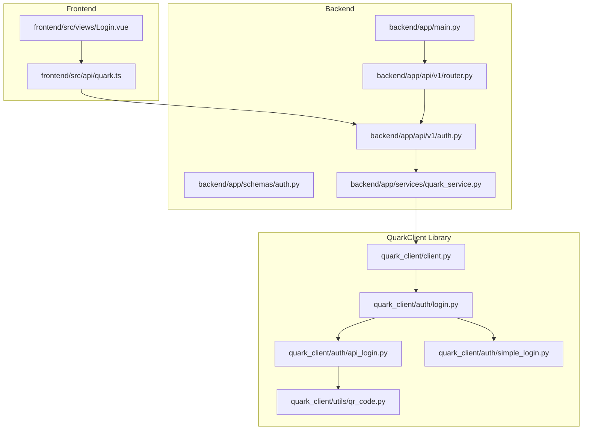
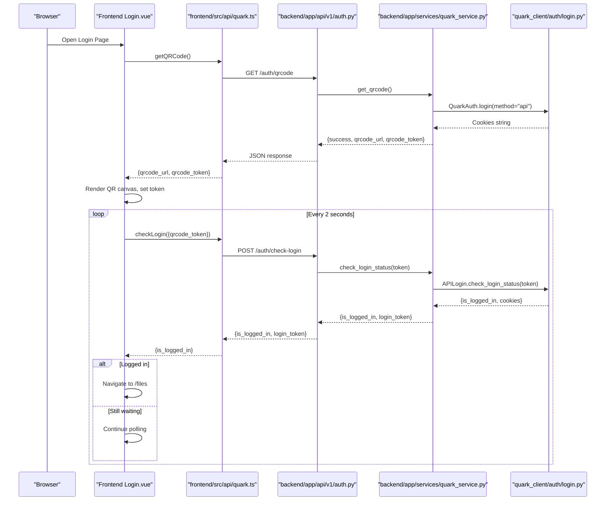
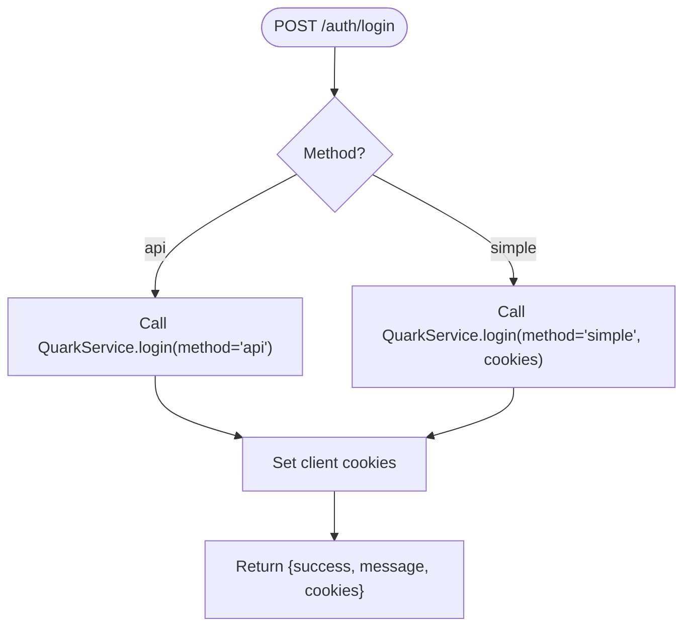
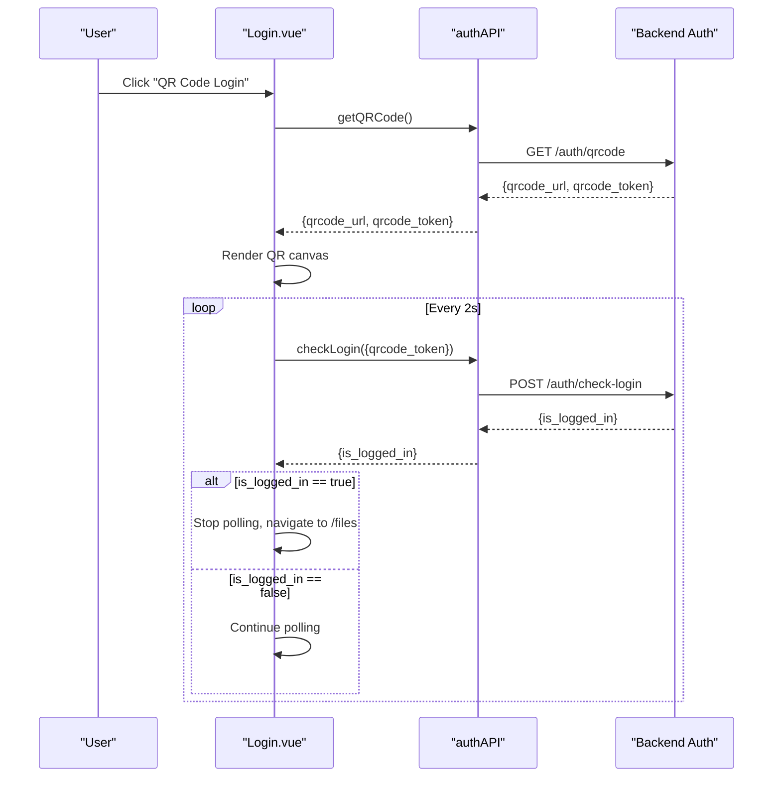
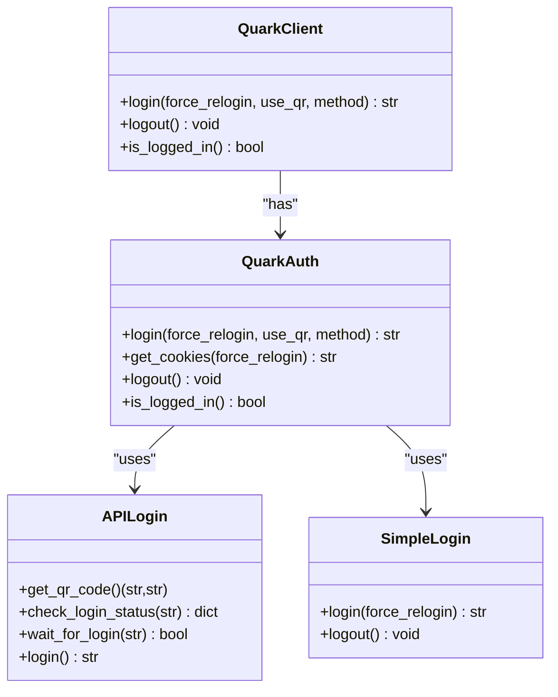
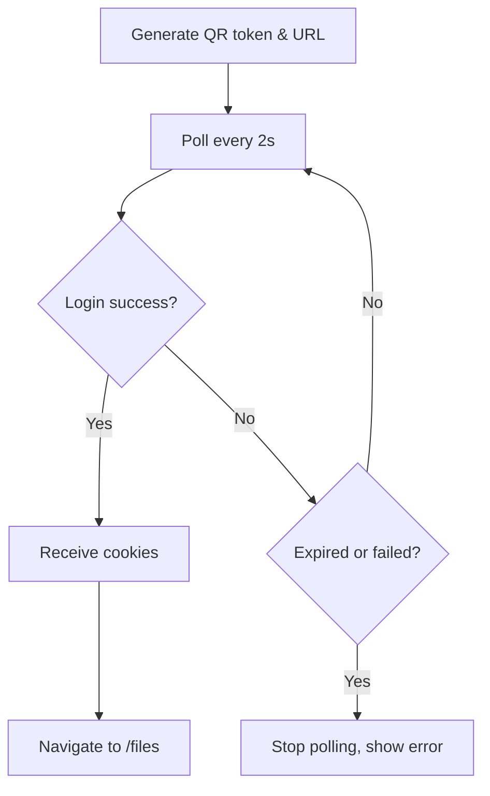
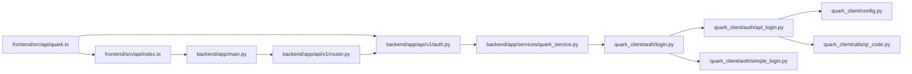

# Authentication System

<cite>
**Referenced Files in This Document**
- [backend/app/main.py](file://backend/app/main.py)
- [backend/app/api/v1/router.py](file://backend/app/api/v1/router.py)
- [backend/app/api/v1/auth.py](file://backend/app/api/v1/auth.py)
- [backend/app/schemas/auth.py](file://backend/app/schemas/auth.py)
- [backend/app/services/quark_service.py](file://backend/app/services/quark_service.py)
- [frontend/src/api/index.ts](file://frontend/src/api/index.ts)
- [frontend/src/api/quark.ts](file://frontend/src/api/quark.ts)
- [frontend/src/views/Login.vue](file://frontend/src/views/Login.vue)
- [quark_client/auth/api_login.py](file://quark_client/auth/api_login.py)
- [quark_client/auth/login.py](file://quark_client/auth/login.py)
- [quark_client/auth/simple_login.py](file://quark_client/auth/simple_login.py)
- [quark_client/client.py](file://quark_client/client.py)
- [quark_client/utils/qr_code.py](file://quark_client/utils/qr_code.py)
- [backend/app/core/config.py](file://backend/app/core/config.py)
</cite>

## Table of Contents
1. [Introduction](#introduction)
2. [Project Structure](#project-structure)
3. [Core Components](#core-components)
4. [Architecture Overview](#architecture-overview)
5. [Detailed Component Analysis](#detailed-component-analysis)
6. [Dependency Analysis](#dependency-analysis)
7. [Performance Considerations](#performance-considerations)
8. [Troubleshooting Guide](#troubleshooting-guide)
9. [Conclusion](#conclusion)

## Introduction
This document explains the complete authentication system for QuarkManager, covering both dual authentication methods: QR code login with real-time polling and cookie-based login. It documents the backend API endpoints, frontend login interface, and the integration with the QuarkClient authentication service. The focus is on the QR code generation process, polling mechanism for status checking, token management, session persistence, practical API usage examples, error handling strategies, and security considerations.

## Project Structure
The authentication system spans three layers:
- Backend API: FastAPI routes under /api/v1/auth implementing QR code and cookie login flows.
- Frontend UI: Vue 3 login component with two tabs (QR code and Cookie) and polling logic.
- QuarkClient: Python library providing authentication services, including QR login and cookie-based login.

**Diagram sources**
- [backend/app/main.py:12-29](file://backend/app/main.py#L12-L29)
- [backend/app/api/v1/router.py:1-24](file://backend/app/api/v1/router.py#L1-L24)
- [backend/app/api/v1/auth.py:15-107](file://backend/app/api/v1/auth.py#L15-L107)
- [backend/app/services/quark_service.py:22-345](file://backend/app/services/quark_service.py#L22-L345)
- [frontend/src/api/quark.ts:55-75](file://frontend/src/api/quark.ts#L55-L75)
- [frontend/src/views/Login.vue:84-216](file://frontend/src/views/Login.vue#L84-L216)
- [quark_client/auth/login.py:15-301](file://quark_client/auth/login.py#L15-L301)
- [quark_client/auth/api_login.py:20-521](file://quark_client/auth/api_login.py#L20-L521)
- [quark_client/auth/simple_login.py:16-249](file://quark_client/auth/simple_login.py#L16-L249)
- [quark_client/client.py:18-405](file://quark_client/client.py#L18-L405)
- [quark_client/utils/qr_code.py:1-46](file://quark_client/utils/qr_code.py#L1-L46)

**Section sources**
- [backend/app/main.py:12-29](file://backend/app/main.py#L12-L29)
- [backend/app/api/v1/router.py:1-24](file://backend/app/api/v1/router.py#L1-L24)
- [frontend/src/api/index.ts:1-30](file://frontend/src/api/index.ts#L1-L30)

## Core Components
- Backend authentication endpoints:
  - GET /api/v1/auth/qrcode: Non-blocking QR code retrieval with token.
  - POST /api/v1/auth/check-login: Polling endpoint to check login status using token.
  - POST /api/v1/auth/login: General login endpoint supporting method selection and cookie input.
  - GET /api/v1/auth/status: Current login status and user info.
  - POST /api/v1/auth/logout: Logout and clear session.
- Frontend login interface:
  - Two tabs: QR code login and Cookie login.
  - QR code tab generates QR code, renders canvas, starts polling, and navigates on success.
  - Cookie tab submits a cookie string to the backend for validation.
- QuarkClient authentication service:
  - QuarkAuth orchestrates login methods (auto, API, simple).
  - APILogin handles QR code generation, polling, and cookie extraction.
  - SimpleLogin supports manual cookie input and persistence.
  - Client integrates cookies into API requests.

**Section sources**
- [backend/app/api/v1/auth.py:18-107](file://backend/app/api/v1/auth.py#L18-L107)
- [frontend/src/views/Login.vue:84-216](file://frontend/src/views/Login.vue#L84-L216)
- [quark_client/auth/login.py:107-260](file://quark_client/auth/login.py#L107-L260)
- [quark_client/auth/api_login.py:94-507](file://quark_client/auth/api_login.py#L94-L507)
- [quark_client/auth/simple_login.py:205-235](file://quark_client/auth/simple_login.py#L205-L235)

## Architecture Overview
The authentication flow is orchestrated by the backend service layer, which delegates to QuarkClient for actual authentication operations. The frontend interacts with the backend via typed API wrappers.

**Diagram sources**
- [frontend/src/views/Login.vue:84-184](file://frontend/src/views/Login.vue#L84-L184)
- [frontend/src/api/quark.ts:55-75](file://frontend/src/api/quark.ts#L55-L75)
- [backend/app/api/v1/auth.py:18-52](file://backend/app/api/v1/auth.py#L18-L52)
- [backend/app/services/quark_service.py:46-121](file://backend/app/services/quark_service.py#L46-L121)
- [quark_client/auth/login.py:107-186](file://quark_client/auth/login.py#L107-L186)
- [quark_client/auth/api_login.py:255-406](file://quark_client/auth/api_login.py#L255-L406)

## Detailed Component Analysis

### Backend Authentication Endpoints
- GET /api/v1/auth/qrcode
  - Returns QR code URL and token for frontend rendering and polling.
  - Delegates to QuarkService.get_qrcode(), which uses APILogin to fetch a token and construct a QR URL.
- POST /api/v1/auth/check-login
  - Polling endpoint receiving qrcode_token and returning is_logged_in and optional login_token.
  - Delegates to QuarkService.check_login_status(), which uses APILogin to poll the service ticket API.
- POST /api/v1/auth/login
  - Supports method selection ("api" or "simple") and optional cookies for simple login.
  - Delegates to QuarkService.login(), which initializes QuarkClient and performs the chosen login method.
- GET /api/v1/auth/status
  - Returns current login state and user info by checking QuarkClient.is_logged_in() and fetching storage info.
- POST /api/v1/auth/logout
  - Clears session by calling QuarkClient.logout() and resets internal state.

**Diagram sources**
- [backend/app/api/v1/auth.py:55-75](file://backend/app/api/v1/auth.py#L55-L75)
- [backend/app/services/quark_service.py:122-158](file://backend/app/services/quark_service.py#L122-L158)

**Section sources**
- [backend/app/api/v1/auth.py:18-107](file://backend/app/api/v1/auth.py#L18-L107)
- [backend/app/schemas/auth.py:5-50](file://backend/app/schemas/auth.py#L5-L50)
- [backend/app/services/quark_service.py:46-184](file://backend/app/services/quark_service.py#L46-L184)

### Frontend Login Interface
- QR Code Tab:
  - Calls authAPI.getQRCode() to retrieve qrcode_url and qrcode_token.
  - Renders a QR canvas using the URL.
  - Starts a 2-second polling interval to authAPI.checkLogin().
  - On success, navigates to /files.
  - Stops polling and shows warnings on expiration or errors.
- Cookie Tab:
  - Submits method=simple with the provided cookie string to authAPI.login().
  - Navigates on success.

**Diagram sources**
- [frontend/src/views/Login.vue:84-184](file://frontend/src/views/Login.vue#L84-L184)
- [frontend/src/api/quark.ts:55-75](file://frontend/src/api/quark.ts#L55-L75)
- [backend/app/api/v1/auth.py:38-52](file://backend/app/api/v1/auth.py#L38-L52)

**Section sources**
- [frontend/src/views/Login.vue:84-216](file://frontend/src/views/Login.vue#L84-L216)
- [frontend/src/api/quark.ts:55-75](file://frontend/src/api/quark.ts#L55-L75)

### QuarkClient Authentication Service Integration
- QuarkAuth:
  - Provides multi-tiered login: attempts API login first, then simple login, with automatic cookie persistence and validation.
  - Exposes get_cookies(), login(), logout(), and is_logged_in().
- APILogin:
  - Generates QR token and URL, displays QR, polls for login completion, extracts cookies, and persists results.
- SimpleLogin:
  - Guides manual cookie acquisition and saves to disk for reuse.
- Client Integration:
  - QuarkClient.auth.login() sets cookies on QuarkAPIClient, enabling downstream file operations.

**Diagram sources**
- [quark_client/auth/login.py:15-301](file://quark_client/auth/login.py#L15-L301)
- [quark_client/auth/api_login.py:20-521](file://quark_client/auth/api_login.py#L20-L521)
- [quark_client/auth/simple_login.py:16-249](file://quark_client/auth/simple_login.py#L16-L249)
- [quark_client/client.py:18-74](file://quark_client/client.py#L18-L74)

**Section sources**
- [quark_client/auth/login.py:107-260](file://quark_client/auth/login.py#L107-L260)
- [quark_client/auth/api_login.py:94-507](file://quark_client/auth/api_login.py#L94-L507)
- [quark_client/auth/simple_login.py:205-235](file://quark_client/auth/simple_login.py#L205-L235)
- [quark_client/client.py:50-74](file://quark_client/client.py#L50-L74)

### QR Code Generation and Polling Mechanism
- QR Generation:
  - Backend calls QuarkService.get_qrcode(), which uses APILogin.get_qr_code() to fetch a token and build a QR URL.
  - Frontend receives qrcode_url and qrcode_token, renders QR canvas, and starts polling.
- Polling:
  - Frontend polls every 2 seconds with authAPI.checkLogin({qrcode_token}).
  - Backend checks APILogin.check_login_status(token) until success or failure.
  - On success, cookies are returned and the frontend navigates to /files.
- Token Management:
  - qrcode_token is stored in frontend state and passed to the backend for each check.
  - Backend maintains current_qr_token in QuarkService for polling.
- Session Persistence:
  - QuarkAuth persists cookies to disk and validates expiry.
  - Frontend relies on backend to manage session state; tokens are short-lived.

**Diagram sources**
- [quark_client/auth/api_login.py:255-406](file://quark_client/auth/api_login.py#L255-L406)
- [frontend/src/views/Login.vue:142-184](file://frontend/src/views/Login.vue#L142-L184)
- [backend/app/api/v1/auth.py:38-52](file://backend/app/api/v1/auth.py#L38-L52)

**Section sources**
- [quark_client/auth/api_login.py:94-171](file://quark_client/auth/api_login.py#L94-L171)
- [quark_client/auth/api_login.py:255-406](file://quark_client/auth/api_login.py#L255-L406)
- [frontend/src/views/Login.vue:84-184](file://frontend/src/views/Login.vue#L84-L184)

### Cookie-Based Login
- Frontend:
  - Cookie tab collects cookie string and posts method=simple with cookies to /auth/login.
- Backend:
  - QuarkService.login(method="simple", cookies) assigns cookies to QuarkClient and returns success.
- Persistence:
  - QuarkAuth.get_cookies() loads saved cookies if valid; otherwise triggers login.

**Section sources**
- [frontend/src/views/Login.vue:186-207](file://frontend/src/views/Login.vue#L186-L207)
- [backend/app/api/v1/auth.py:55-75](file://backend/app/api/v1/auth.py#L55-L75)
- [backend/app/services/quark_service.py:122-158](file://backend/app/services/quark_service.py#L122-L158)
- [quark_client/auth/login.py:231-260](file://quark_client/auth/login.py#L231-L260)

## Dependency Analysis
- Frontend depends on:
  - axios base configuration for baseURL "/api/v1".
  - Typed API wrappers for auth endpoints.
- Backend depends on:
  - FastAPI routing and CORS configuration.
  - Pydantic schemas for request/response validation.
  - QuarkClient for authentication operations.
- QuarkClient depends on:
  - HTTP client for API calls.
  - Local config directory for cookie persistence.
  - QR utilities for terminal display.

**Diagram sources**
- [frontend/src/api/quark.ts:55-75](file://frontend/src/api/quark.ts#L55-L75)
- [frontend/src/api/index.ts:3-9](file://frontend/src/api/index.ts#L3-L9)
- [backend/app/main.py:12-29](file://backend/app/main.py#L12-L29)
- [backend/app/api/v1/router.py:22-23](file://backend/app/api/v1/router.py#L22-L23)
- [backend/app/api/v1/auth.py:13-15](file://backend/app/api/v1/auth.py#L13-L15)
- [backend/app/services/quark_service.py:10-20](file://backend/app/services/quark_service.py#L10-L20)
- [quark_client/auth/login.py:10-28](file://quark_client/auth/login.py#L10-L28)
- [quark_client/auth/api_login.py:14-56](file://quark_client/auth/api_login.py#L14-L56)
- [quark_client/auth/simple_login.py:11-26](file://quark_client/auth/simple_login.py#L11-L26)
- [quark_client/config.py:10-63](file://quark_client/config.py#L10-L63)
- [quark_client/utils/qr_code.py:7-46](file://quark_client/utils/qr_code.py#L7-L46)

**Section sources**
- [backend/app/core/config.py:22-25](file://backend/app/core/config.py#L22-L25)
- [quark_client/config.py:10-63](file://quark_client/config.py#L10-L63)

## Performance Considerations
- Polling Interval: 2 seconds strikes a balance between responsiveness and server load. Consider exponential backoff for idle periods.
- Timeout Handling: QR code tokens typically expire after 5 minutes; frontend stops polling accordingly.
- Cookie Validation: QuarkAuth validates presence of essential cookies before considering a session valid.
- Caching: Reuse saved cookies to avoid repeated QR scans; persist expiry timestamps to minimize unnecessary logins.

[No sources needed since this section provides general guidance]

## Troubleshooting Guide
Common issues and resolutions:
- QR Code Expiration:
  - Symptom: Polling returns 400 or stops with "expired".
  - Resolution: Trigger a new QR generation and restart polling.
- Network/API Failures:
  - Symptom: getQRCode or checkLogin throws network errors.
  - Resolution: Verify backend availability, CORS origins, and retry with backoff.
- Missing Required Cookies:
  - Symptom: is_logged_in returns false despite saved cookies.
  - Resolution: Ensure cookies contain required keys (__pus, __kps, __uid); regenerate if missing.
- Rate Limiting:
  - Symptom: Frequent polling or repeated login attempts cause throttling.
  - Resolution: Increase polling intervals slightly, implement client-side rate limits, and avoid concurrent polling sessions.
- Security:
  - Symptom: Cookies exposed or misconfigured.
  - Resolution: Store cookies securely, restrict access to config directory, and avoid logging sensitive data.

**Section sources**
- [frontend/src/views/Login.vue:142-184](file://frontend/src/views/Login.vue#L142-L184)
- [quark_client/auth/login.py:231-294](file://quark_client/auth/login.py#L231-L294)
- [quark_client/auth/api_login.py:347-406](file://quark_client/auth/api_login.py#L347-L406)

## Conclusion
QuarkManager’s authentication system combines a robust backend API with a user-friendly frontend and a powerful QuarkClient library. The dual authentication methods—QR code login with real-time polling and cookie-based login—provide flexibility and resilience. Proper token management, session persistence, and error handling ensure a smooth user experience, while security considerations protect sensitive credentials.