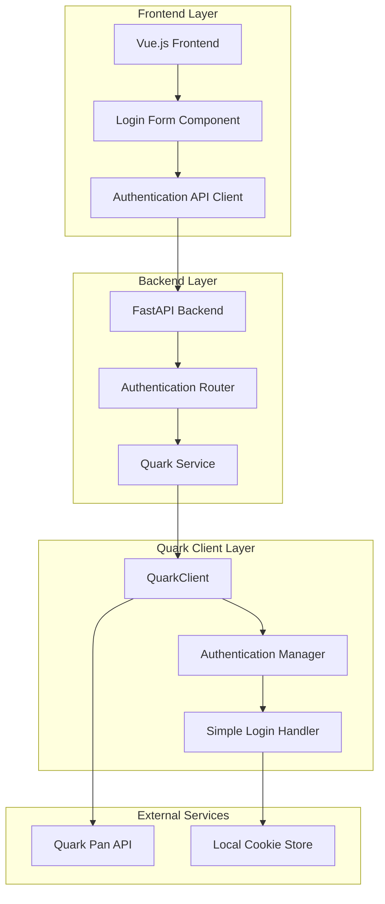
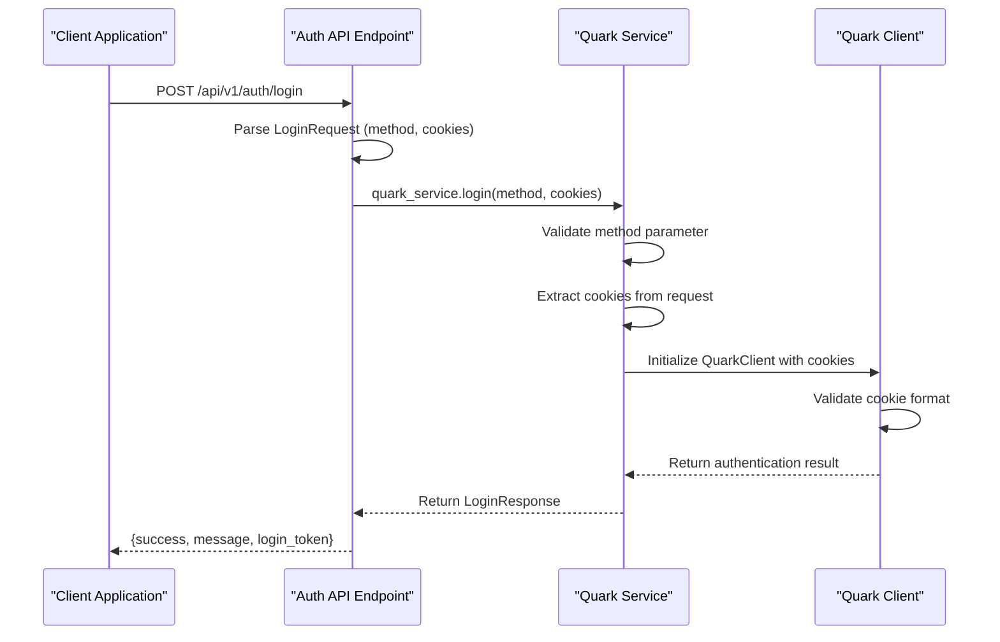
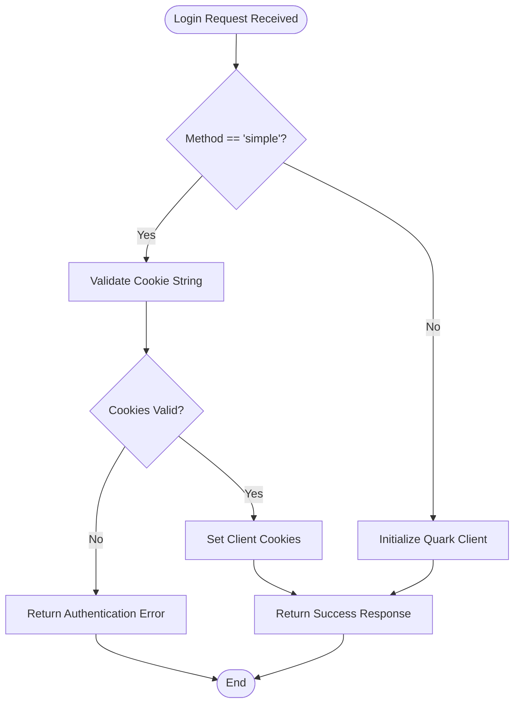
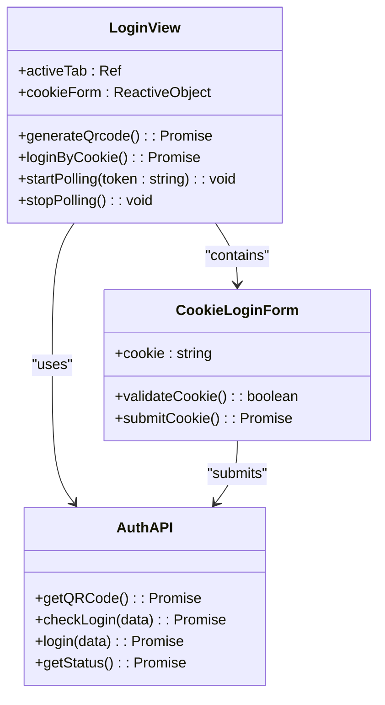
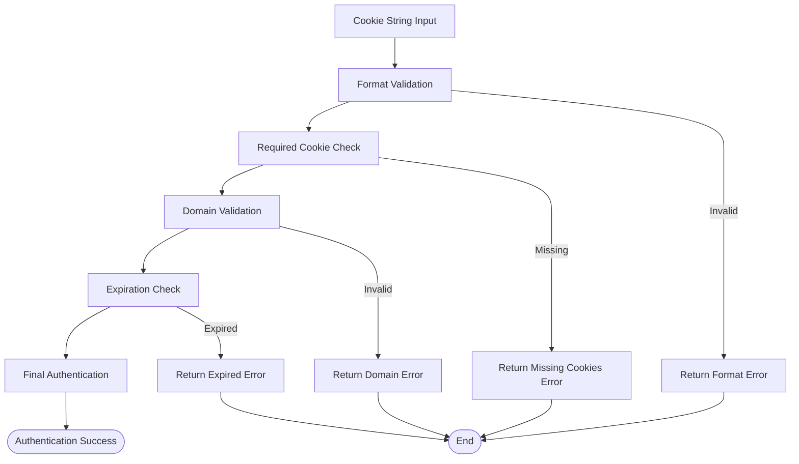
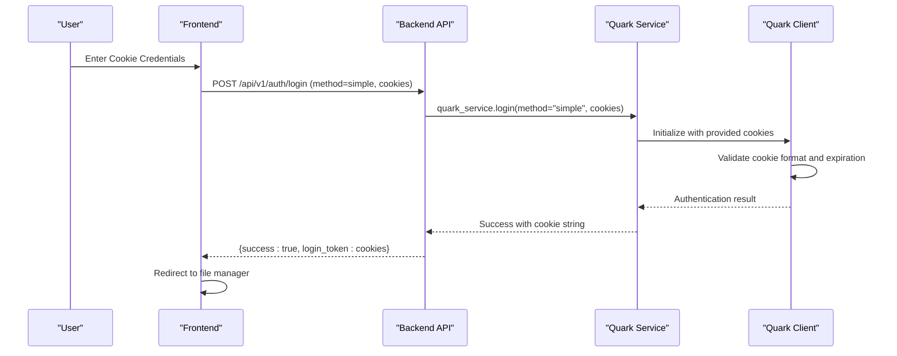

# Cookie Login Method

<cite>
**Referenced Files in This Document**
- [auth.py](file://backend/app/api/v1/auth.py)
- [auth.py](file://backend/app/schemas/auth.py)
- [quark_service.py](file://backend/app/services/quark_service.py)
- [Login.vue](file://frontend/src/views/Login.vue)
- [quark.ts](file://frontend/src/api/quark.ts)
- [simple_login.py](file://quark_client/auth/simple_login.py)
- [login.py](file://quark_client/auth/login.py)
- [client.py](file://quark_client/client.py)
- [api_client.py](file://quark_client/core/api_client.py)
</cite>

## Table of Contents
1. [Introduction](#introduction)
2. [System Architecture](#system-architecture)
3. [Backend Implementation](#backend-implementation)
4. [Frontend Implementation](#frontend-implementation)
5. [Cookie Validation Process](#cookie-validation-process)
6. [Authentication Flow](#authentication-flow)
7. [Cookie Extraction Methods](#cookie-extraction-methods)
8. [Security Considerations](#security-considerations)
9. [Troubleshooting Guide](#troubleshooting-guide)
10. [Best Practices](#best-practices)
11. [Conclusion](#conclusion)

## Introduction

The cookie login method provides a direct authentication approach for Quark Pan without requiring QR code scanning. This method allows users to authenticate by manually providing their existing Quark Pan cookies, which contain valid authentication credentials. The implementation consists of three main components: a backend API endpoint that validates and processes cookie submissions, a frontend login interface for cookie input and submission, and a QuarkClient integration that handles cookie validation and session management.

## System Architecture

The cookie login system follows a client-server architecture with clear separation of concerns:



**Diagram sources**
- [auth.py:55-75](file://backend/app/api/v1/auth.py#L55-L75)
- [quark_service.py:154-190](file://backend/app/services/quark_service.py#L154-L190)
- [Login.vue:186-207](file://frontend/src/views/Login.vue#L186-L207)

## Backend Implementation

### API Endpoint Design

The backend implements a dedicated `/api/v1/auth/login` endpoint that accepts cookie-based authentication requests. The endpoint supports two login methods: QR code scanning (`method="api"`) and cookie-based authentication (`method="simple"`).



**Diagram sources**
- [auth.py:55-75](file://backend/app/api/v1/auth.py#L55-L75)
- [quark_service.py:154-190](file://backend/app/services/quark_service.py#L154-L190)

### Request and Response Schema

The backend defines strict schemas for cookie login requests and responses:

**Login Request Schema:**
- `method`: String, required, must be "simple" for cookie login
- `cookies`: String, optional, contains the cookie string for authentication

**Login Response Schema:**
- `success`: Boolean, indicates authentication outcome
- `message`: String, describes the operation result
- `login_token`: String, contains the validated cookie string
- `qrcode_url`: String, optional, only for QR code login method

**Section sources**
- [auth.py:5-16](file://backend/app/schemas/auth.py#L5-L16)

### Service Layer Implementation

The Quark Service handles the core authentication logic:



**Diagram sources**
- [quark_service.py:154-190](file://backend/app/services/quark_service.py#L154-L190)

**Section sources**
- [quark_service.py:154-190](file://backend/app/services/quark_service.py#L154-L190)

## Frontend Implementation

### Login Form Component

The frontend provides a dual-mode login interface with separate tabs for QR code and cookie authentication:



**Diagram sources**
- [Login.vue:62-216](file://frontend/src/views/Login.vue#L62-L216)
- [quark.ts:55-75](file://frontend/src/api/quark.ts#L55-L75)

### Cookie Input Validation

The frontend implements client-side validation before submitting cookie credentials:

**Validation Rules:**
- Cookie field cannot be empty
- Must contain valid cookie format (semicolon-separated key-value pairs)
- Should include required Quark Pan cookies (`__kps`, `__uid`)
- Proper formatting with spaces around semicolons

**Section sources**
- [Login.vue:186-207](file://frontend/src/views/Login.vue#L186-L207)

### API Integration

The frontend communicates with the backend through typed API interfaces:

**Authentication API Methods:**
- `authAPI.login({ method: 'simple', cookies })` - Submits cookie credentials
- Returns `Promise<LoginResponse>` with authentication result
- Handles success/error states with user feedback

**Section sources**
- [quark.ts:64-66](file://frontend/src/api/quark.ts#L64-L66)

## Cookie Validation Process

### Backend Cookie Validation

The backend performs comprehensive cookie validation during the authentication process:



**Diagram sources**
- [simple_login.py:133-150](file://quark_client/auth/simple_login.py#L133-L150)
- [login.py:225-229](file://quark_client/auth/login.py#L225-L229)

### Cookie Format Requirements

The system requires cookies in a specific format:

**Required Cookie Fields:**
- `__kps`: Primary authentication token
- `__uid`: User identifier
- `__pus`: Session token

**Format Specifications:**
- Semicolon-separated pairs: `key=value; key=value`
- No spaces around equals sign: `__kps=xxx`
- Proper spacing around semicolons: `key=value; key=value`
- All cookies from `quark.cn` domain

**Section sources**
- [simple_login.py:133-150](file://quark_client/auth/simple_login.py#L133-L150)
- [login.py:248-249](file://quark_client/auth/login.py#L248-L249)

## Authentication Flow

### Complete Cookie Login Workflow

The cookie authentication process follows a structured flow:



**Diagram sources**
- [auth.py:55-75](file://backend/app/api/v1/auth.py#L55-L75)
- [quark_service.py:167-173](file://backend/app/services/quark_service.py#L167-L173)

### Step-by-Step Process

1. **Frontend Validation**: Client-side validation ensures cookie format is correct
2. **Backend Processing**: Server extracts and validates cookie parameters
3. **Client Initialization**: Quark Client is initialized with provided cookies
4. **Cookie Verification**: System checks cookie validity and expiration
5. **Authentication Result**: Successful authentication returns cookie string
6. **Session Establishment**: User gains access to Quark Pan services

**Section sources**
- [auth.py:55-75](file://backend/app/api/v1/auth.py#L55-L75)
- [quark_service.py:167-173](file://backend/app/services/quark_service.py#L167-L173)

## Cookie Extraction Methods

### Browser Developer Tools Method

The most reliable method for extracting cookies from browser developer tools:

**Steps:**
1. Open browser developer tools (F12)
2. Navigate to Application tab
3. Expand Storage → Cookies
4. Click on `https://pan.quark.cn`
5. Select and copy all cookie entries
6. Format: `name1=value1; name2=value2; name3=value3`

**Alternative Method (Network Tab):**
1. Go to Network tab
2. Refresh page (F5)
3. Find any request to quark.cn
4. Right-click → Copy → Copy as cURL
5. Extract cookie header from cURL command

**Section sources**
- [simple_login.py:101-121](file://quark_client/auth/simple_login.py#L101-L121)

### Manual Cookie Collection

For advanced users, cookies can be collected manually:

**Required Information:**
- `__kps`: Authentication token
- `__uid`: User ID
- `__pus`: Session token
- Domain: `.quark.cn`
- Path: `/`

**Format Example:**
```
__kps=ABC123XYZ; __uid=USER456; __pus=SESSION789
```

## Security Considerations

### Cookie Handling Security

**Data Protection Measures:**
- **Transmission Security**: All authentication occurs over HTTPS connections
- **Storage Security**: Cookies are stored locally in encrypted format
- **Memory Management**: Cookie strings are handled securely in memory
- **Validation**: Comprehensive format and content validation prevents injection attacks

**Security Best Practices:**
- Never share cookie strings with third parties
- Regularly update cookies as they expire
- Use secure browsers with up-to-date security patches
- Monitor for suspicious activity on your account

### Authentication Security

**Backend Security Features:**
- Input sanitization and validation
- Rate limiting for authentication attempts
- Secure cookie parsing and validation
- Error handling without exposing sensitive information

**Section sources**
- [api_client.py:145-156](file://quark_client/core/api_client.py#L145-L156)
- [simple_login.py:126-129](file://quark_client/auth/simple_login.py#L126-L129)

## Troubleshooting Guide

### Common Cookie Issues

**Expired Cookies:**
- **Symptoms**: Authentication errors, 401 responses
- **Solution**: Obtain fresh cookies from browser developer tools
- **Prevention**: Regular cookie refresh cycle

**Invalid Format Errors:**
- **Symptoms**: "Cookie format incorrect" messages
- **Common Causes**: Missing semicolons, spaces around equals signs
- **Fix**: Ensure proper format: `key=value; key=value`

**Missing Required Cookies:**
- **Symptoms**: Authentication fails despite valid format
- **Cause**: Missing `__kps`, `__uid`, or `__pus` cookies
- **Solution**: Verify all required cookies are present

**Domain Mismatch:**
- **Symptoms**: Authentication works locally but fails remotely
- **Cause**: Cookies from wrong domain
- **Fix**: Ensure cookies are from `pan.quark.cn` domain

### Browser Compatibility Issues

**Supported Browsers:**
- Chrome, Firefox, Safari, Edge
- Modern browser versions with JavaScript enabled
- Developer tools must be available

**Common Browser Issues:**
- **JavaScript Disabled**: Prevents cookie extraction
- **Developer Tools Not Available**: Alternative extraction methods needed
- **Browser Extensions**: May interfere with cookie access

**Section sources**
- [simple_login.py:126-129](file://quark_client/auth/simple_login.py#L126-L129)
- [api_client.py:145-156](file://quark_client/core/api_client.py#L145-L156)

## Best Practices

### Secure Cookie Management

**Storage Best Practices:**
- Store cookies in encrypted local storage
- Implement automatic expiration detection
- Regular cleanup of expired sessions
- Secure deletion when logging out

**Usage Guidelines:**
- Never log cookie strings
- Use HTTPS-only transmission
- Implement proper error handling
- Validate cookie integrity before use

**Session Persistence:**
- Automatic cookie refresh when near expiration
- Graceful degradation when cookies expire
- User notification for authentication failures
- Secure session termination

### Development Guidelines

**Code Quality:**
- Comprehensive input validation
- Proper error handling and user feedback
- Secure cookie parsing and validation
- Logging with sensitive data protection

**Testing Strategies:**
- Unit tests for cookie format validation
- Integration tests for authentication flow
- Security testing for input sanitization
- Browser compatibility testing

## Conclusion

The cookie login method provides a streamlined authentication approach for Quark Pan users who prefer direct cookie-based authentication over QR code scanning. The implementation balances security with usability through comprehensive validation, secure handling, and clear user feedback. By following the established protocols for cookie extraction, validation, and management, users can achieve reliable and secure access to Quark Pan services.

The system's modular architecture ensures maintainability and extensibility, while the clear separation of frontend, backend, and client-layer responsibilities provides robust error handling and user experience. Regular updates to cookie validation logic and security measures will ensure continued reliability and protection against emerging threats.