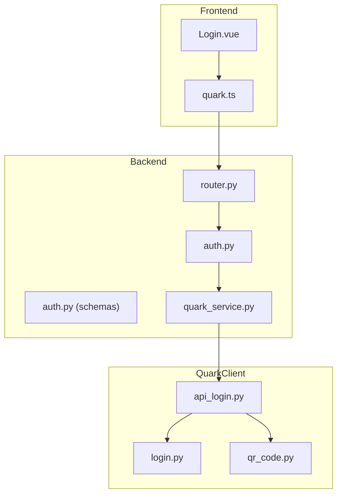
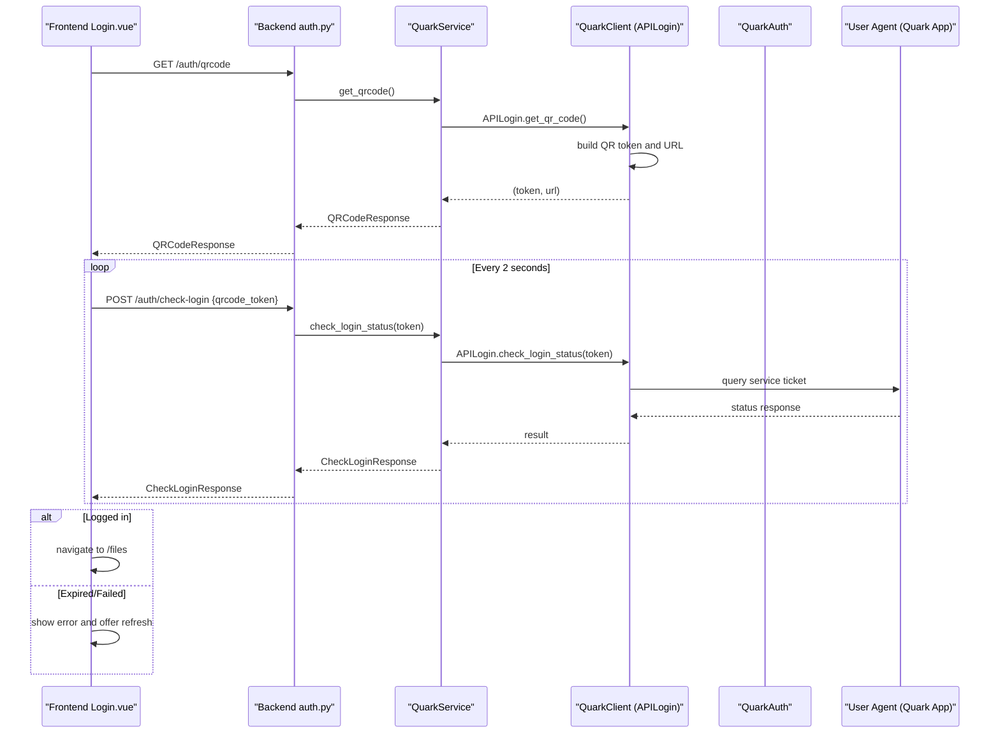
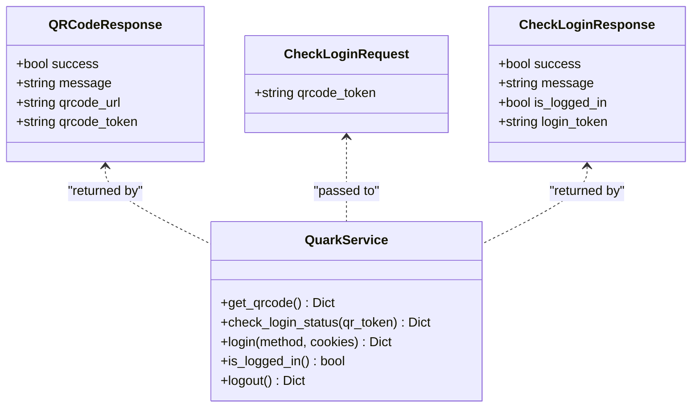
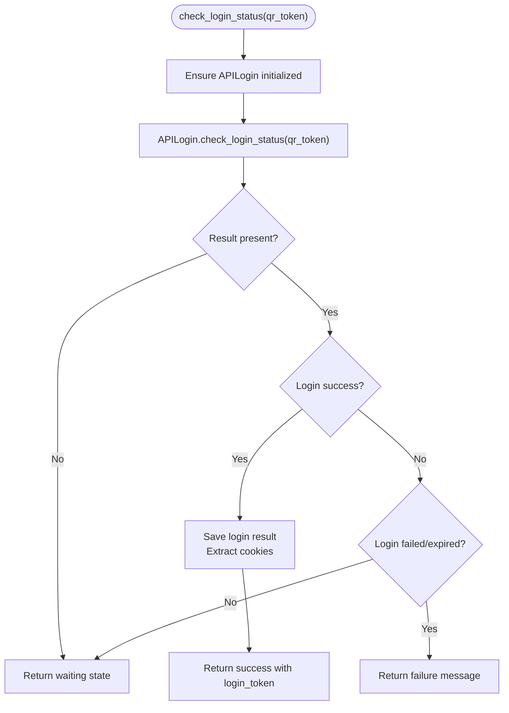
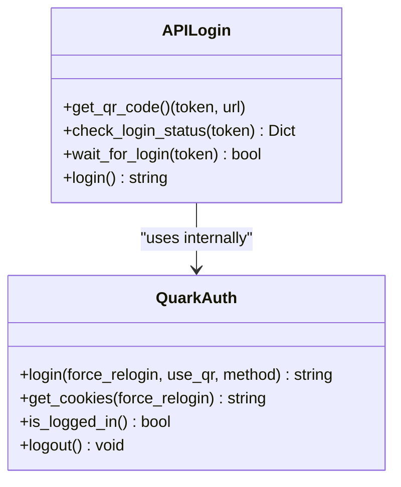
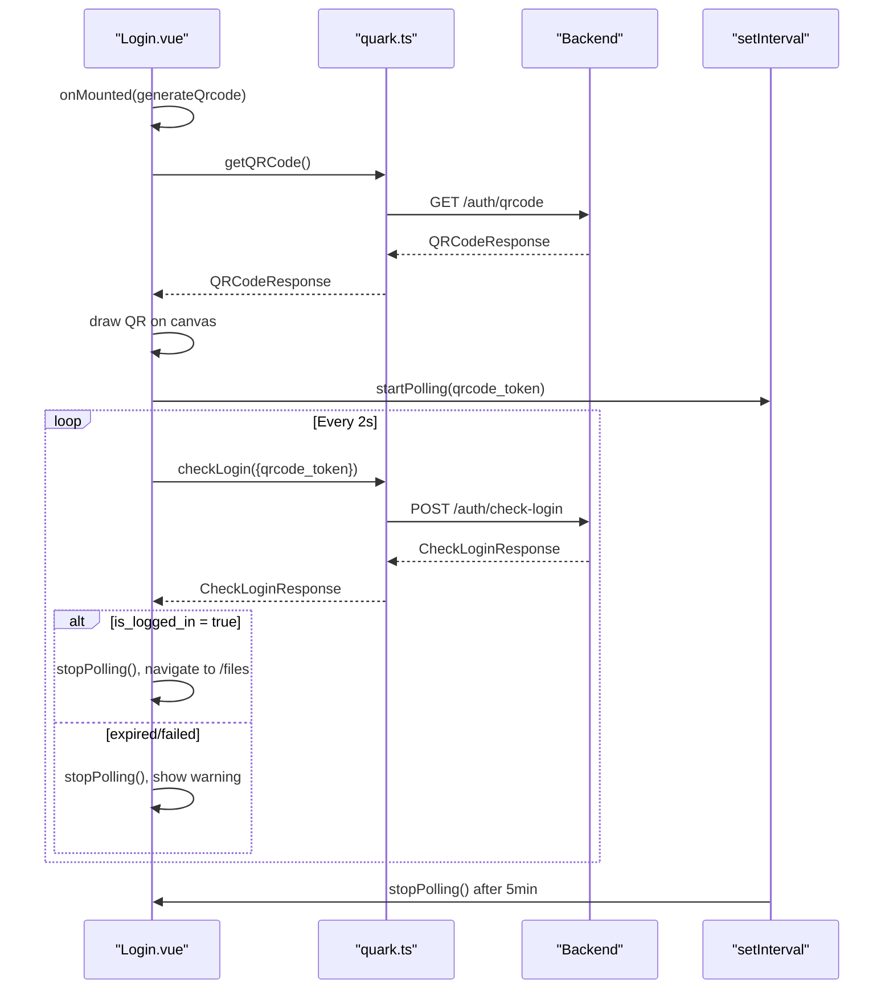
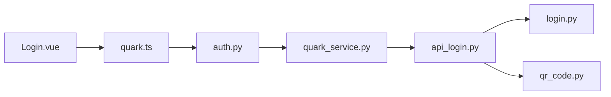

# QR Code Login Flow

<cite>
**Referenced Files in This Document**
- [auth.py](file://backend/app/api/v1/auth.py)
- [router.py](file://backend/app/api/v1/router.py)
- [main.py](file://backend/app/main.py)
- [auth.py](file://backend/app/schemas/auth.py)
- [quark_service.py](file://backend/app/services/quark_service.py)
- [api_login.py](file://quark_client/auth/api_login.py)
- [login.py](file://quark_client/auth/login.py)
- [qr_code.py](file://quark_client/utils/qr_code.py)
- [Login.vue](file://frontend/src/views/Login.vue)
- [quark.ts](file://frontend/src/api/quark.ts)
</cite>

## Table of Contents
1. [Introduction](#introduction)
2. [Project Structure](#project-structure)
3. [Core Components](#core-components)
4. [Architecture Overview](#architecture-overview)
5. [Detailed Component Analysis](#detailed-component-analysis)
6. [Dependency Analysis](#dependency-analysis)
7. [Performance Considerations](#performance-considerations)
8. [Troubleshooting Guide](#troubleshooting-guide)
9. [Conclusion](#conclusion)

## Introduction
This document provides comprehensive coverage of the QR code login flow in the QuarkManager project. It explains the complete authentication workflow from QR code generation to successful authentication, including backend endpoints, frontend implementation, and the underlying QuarkClient integration. It also documents request/response schemas, real-time polling mechanism, token management, error handling strategies, security considerations, and troubleshooting guidance.

## Project Structure
The QR code login flow spans three layers:
- Backend API: exposes endpoints for QR code generation and login status checking
- Service layer: orchestrates QuarkClient operations and manages tokens
- Frontend: renders QR code, polls for login status, and handles user feedback

**Diagram sources**
- [router.py:1-24](file://backend/app/api/v1/router.py#L1-L24)
- [auth.py:1-107](file://backend/app/api/v1/auth.py#L1-L107)
- [auth.py:5-50](file://backend/app/schemas/auth.py#L5-L50)
- [quark_service.py:23-377](file://backend/app/services/quark_service.py#L23-L377)
- [api_login.py:20-521](file://quark_client/auth/api_login.py#L20-L521)
- [login.py:15-301](file://quark_client/auth/login.py#L15-L301)
- [qr_code.py:1-46](file://quark_client/utils/qr_code.py#L1-L46)
- [Login.vue:1-290](file://frontend/src/views/Login.vue#L1-L290)
- [quark.ts:55-75](file://frontend/src/api/quark.ts#L55-L75)

**Section sources**
- [router.py:1-24](file://backend/app/api/v1/router.py#L1-L24)
- [main.py:12-29](file://backend/app/main.py#L12-L29)

## Core Components
- Backend endpoints:
  - GET /api/v1/auth/qrcode: generates a QR code and returns a token and URL
  - POST /api/v1/auth/check-login: checks login status using the QR token
- Service layer:
  - QuarkService: wraps QuarkClient operations, manages QR tokens, and returns structured results
- Frontend:
  - Login.vue: displays QR code, starts polling, and navigates on success
  - quark.ts: typed API wrappers for backend endpoints

Key responsibilities:
- QR generation: returns qrcode_url and qrcode_token
- Status polling: returns is_logged_in and login_token upon success
- Token lifecycle: QR token validity and cleanup
- Error handling: user-friendly messages and graceful degradation

**Section sources**
- [auth.py:18-52](file://backend/app/api/v1/auth.py#L18-L52)
- [auth.py:5-50](file://backend/app/schemas/auth.py#L5-L50)
- [quark_service.py:54-152](file://backend/app/services/quark_service.py#L54-L152)
- [Login.vue:84-176](file://frontend/src/views/Login.vue#L84-L176)
- [quark.ts:55-75](file://frontend/src/api/quark.ts#L55-L75)

## Architecture Overview
The QR code login follows a non-blocking, event-driven pattern:
- Frontend requests QR code from backend
- Backend delegates to QuarkClient to obtain QR token and URL
- Frontend renders QR code and starts periodic polling
- Backend checks login status using the QR token
- On success, backend returns login_token (cookies) and sets up authenticated client

**Diagram sources**
- [auth.py:18-52](file://backend/app/api/v1/auth.py#L18-L52)
- [quark_service.py:54-152](file://backend/app/services/quark_service.py#L54-L152)
- [api_login.py:94-171](file://quark_client/auth/api_login.py#L94-L171)
- [api_login.py:255-307](file://quark_client/auth/api_login.py#L255-L307)
- [Login.vue:142-176](file://frontend/src/views/Login.vue#L142-L176)

## Detailed Component Analysis

### Backend Endpoints and Schemas
- GET /api/v1/auth/qrcode
  - Purpose: Non-blocking QR code generation
  - Response model: QRCodeResponse with success, message, qrcode_url, qrcode_token
  - Implementation: Delegates to QuarkService.get_qrcode()
- POST /api/v1/auth/check-login
  - Purpose: Polling endpoint to check login status
  - Request model: CheckLoginRequest with qrcode_token
  - Response model: CheckLoginResponse with success, message, is_logged_in, login_token
  - Implementation: Delegates to QuarkService.check_login_status()

**Diagram sources**
- [auth.py:19-38](file://backend/app/schemas/auth.py#L19-L38)
- [quark_service.py:54-152](file://backend/app/services/quark_service.py#L54-L152)

**Section sources**
- [auth.py:18-52](file://backend/app/api/v1/auth.py#L18-L52)
- [auth.py:19-38](file://backend/app/schemas/auth.py#L19-L38)

### Service Layer: QuarkService
- Responsibilities:
  - Initialize QuarkClient and APILogin
  - Generate QR code and store current QR token
  - Check login status and extract cookies upon success
  - Manage login state and provide logout capability
- Key behaviors:
  - get_qrcode(): returns qrcode_url and qrcode_token
  - check_login_status(): returns is_logged_in and login_token when successful
  - login(): supports both API and simple login modes
  - is_logged_in(): checks client login state
  - logout(): clears client and state

**Diagram sources**
- [quark_service.py:85-152](file://backend/app/services/quark_service.py#L85-L152)
- [api_login.py:255-307](file://quark_client/auth/api_login.py#L255-L307)

**Section sources**
- [quark_service.py:54-152](file://backend/app/services/quark_service.py#L54-L152)

### QuarkClient Integration: APILogin and QuarkAuth
- APILogin:
  - Generates QR token and constructs QR URL
  - Checks login status via service ticket API
  - Manages countdown display and timeout
  - Extracts cookies upon success
- QuarkAuth:
  - Handles cookie persistence and validation
  - Provides convenience functions for login and status checks

**Diagram sources**
- [api_login.py:20-521](file://quark_client/auth/api_login.py#L20-L521)
- [login.py:15-301](file://quark_client/auth/login.py#L15-L301)

**Section sources**
- [api_login.py:94-171](file://quark_client/auth/api_login.py#L94-L171)
- [api_login.py:255-307](file://quark_client/auth/api_login.py#L255-L307)
- [login.py:107-260](file://quark_client/auth/login.py#L107-L260)

### Frontend Login Interface
- Features:
  - QR code rendering via qrcode library on a canvas
  - Polling timer set to 2 seconds
  - Automatic timeout after 5 minutes
  - User feedback via Element Plus messages
  - Navigation to /files on success
- Flow:
  - On mount, calls generateQrcode()
  - Renders QR code and starts polling
  - Stops polling on success or when QR expires
  - Shows error state and offers refresh

**Diagram sources**
- [Login.vue:84-176](file://frontend/src/views/Login.vue#L84-L176)
- [quark.ts:55-75](file://frontend/src/api/quark.ts#L55-L75)
- [auth.py:38-52](file://backend/app/api/v1/auth.py#L38-L52)

**Section sources**
- [Login.vue:84-176](file://frontend/src/views/Login.vue#L84-L176)
- [quark.ts:55-75](file://frontend/src/api/quark.ts#L55-L75)

### Complete Login Flow Example
- Step 1: Frontend calls GET /auth/qrcode
  - Backend returns QRCodeResponse with qrcode_url and qrcode_token
- Step 2: Frontend renders QR code and starts polling
- Step 3: Frontend periodically calls POST /auth/check-login with qrcode_token
  - Backend checks status via APILogin
  - If success, returns CheckLoginResponse with is_logged_in = true and login_token
- Step 4: Frontend stops polling, shows success, and navigates to /files

Concrete example paths:
- [auth.py:18-35](file://backend/app/api/v1/auth.py#L18-L35)
- [auth.py:38-52](file://backend/app/api/v1/auth.py#L38-L52)
- [quark_service.py:54-78](file://backend/app/services/quark_service.py#L54-L78)
- [quark_service.py:85-152](file://backend/app/services/quark_service.py#L85-L152)
- [Login.vue:84-176](file://frontend/src/views/Login.vue#L84-L176)

**Section sources**
- [auth.py:18-52](file://backend/app/api/v1/auth.py#L18-L52)
- [quark_service.py:54-152](file://backend/app/services/quark_service.py#L54-L152)
- [Login.vue:84-176](file://frontend/src/views/Login.vue#L84-L176)

## Dependency Analysis
- Backend depends on:
  - FastAPI router and schemas for endpoint definitions
  - QuarkService for business logic
  - QuarkClient (APILogin) for external API interactions
- Frontend depends on:
  - Typed API wrappers for backend endpoints
  - QR code rendering library for canvas generation
  - Element Plus for UI feedback

**Diagram sources**
- [Login.vue:68](file://frontend/src/views/Login.vue#L68)
- [quark.ts:55-75](file://frontend/src/api/quark.ts#L55-L75)
- [auth.py:13](file://backend/app/api/v1/auth.py#L13)
- [quark_service.py:12-20](file://backend/app/services/quark_service.py#L12-L20)
- [api_login.py:20](file://quark_client/auth/api_login.py#L20)
- [login.py:15](file://quark_client/auth/login.py#L15)
- [qr_code.py:1](file://quark_client/utils/qr_code.py#L1)

**Section sources**
- [auth.py:13](file://backend/app/api/v1/auth.py#L13)
- [quark_service.py:12-20](file://backend/app/services/quark_service.py#L12-L20)
- [api_login.py:20](file://quark_client/auth/api_login.py#L20)

## Performance Considerations
- Polling interval: 2 seconds strikes a balance between responsiveness and server load
- Timeout: 5-minute automatic stop prevents long-lived timers
- Frontend cleanup: timers are cleared on unmount and on success/failure
- Backend efficiency: APILogin uses short sleep intervals and minimal retries
- Network optimization: QR URL is constructed client-side; polling uses lightweight JSON responses

Recommendations:
- Consider exponential backoff for failed polling attempts
- Add jitter to polling intervals to avoid synchronized spikes
- Cache QR URLs locally to reduce repeated generation calls
- Monitor backend health endpoints to detect outages early

[No sources needed since this section provides general guidance]

## Troubleshooting Guide
Common issues and resolutions:
- QR code not generated
  - Verify backend health endpoint and CORS configuration
  - Check QuarkClient availability and network connectivity
  - Frontend shows error and offers refresh
- QR code expired
  - Frontend automatically stops polling and shows warning
  - User can refresh QR code manually
- Frequent polling failures
  - Reduce polling interval temporarily
  - Ensure backend is reachable and not rate-limited
- Login stuck in waiting state
  - Confirm user scanned QR code in Quark app
  - Check backend logs for APILogin status checks
- Session management
  - Cookies are extracted and stored by QuarkAuth
  - Use logout endpoint to clear session state

Error handling strategies:
- Backend raises HTTPException on QR generation failures
- Frontend catches 400 responses during polling and stops gracefully
- Service layer returns structured success/message fields for robust UI handling

Security considerations:
- Token expiration: QR token validity enforced by backend and frontend timeouts
- Rate limiting: APILogin uses controlled polling intervals; consider adding server-side limits
- Session management: QuarkAuth validates and persists cookies securely
- Token scope: QR token is short-lived and bound to a single login attempt

**Section sources**
- [auth.py:27-28](file://backend/app/api/v1/auth.py#L27-L28)
- [Login.vue:157-165](file://frontend/src/views/Login.vue#L157-L165)
- [quark_service.py:147-152](file://backend/app/services/quark_service.py#L147-L152)
- [login.py:79-93](file://quark_client/auth/login.py#L79-L93)

## Conclusion
The QR code login flow integrates a clean separation of concerns across frontend, backend, and QuarkClient layers. The non-blocking design ensures responsive UX while maintaining reliability. By following the documented endpoints, schemas, and implementation patterns, developers can extend or troubleshoot the flow effectively. The included error handling, security considerations, and performance tips provide a solid foundation for production deployment.