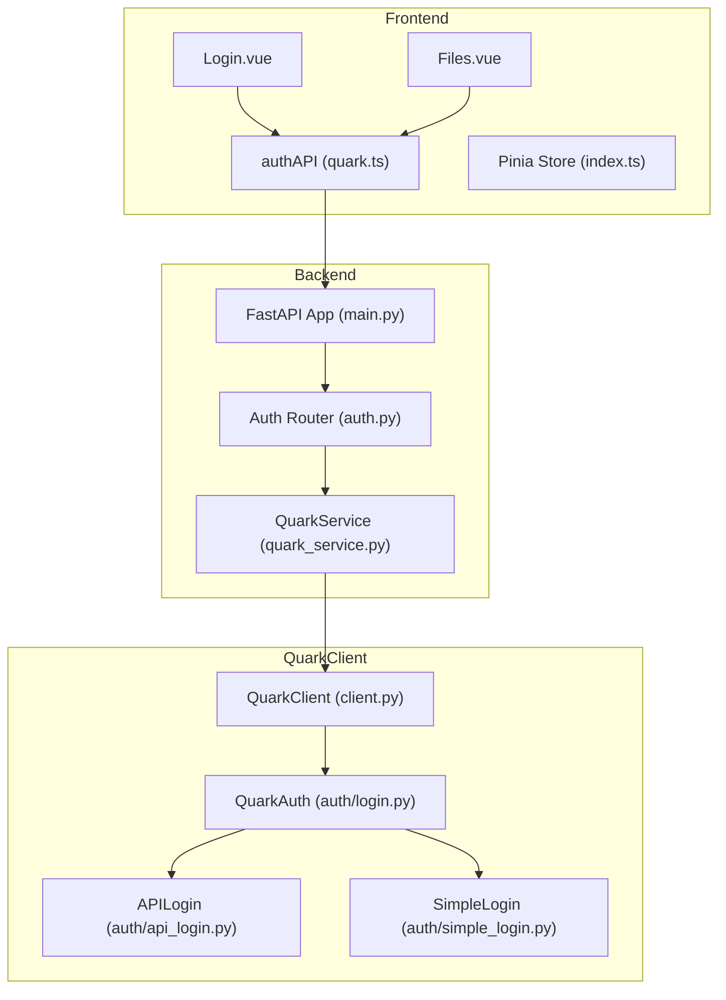
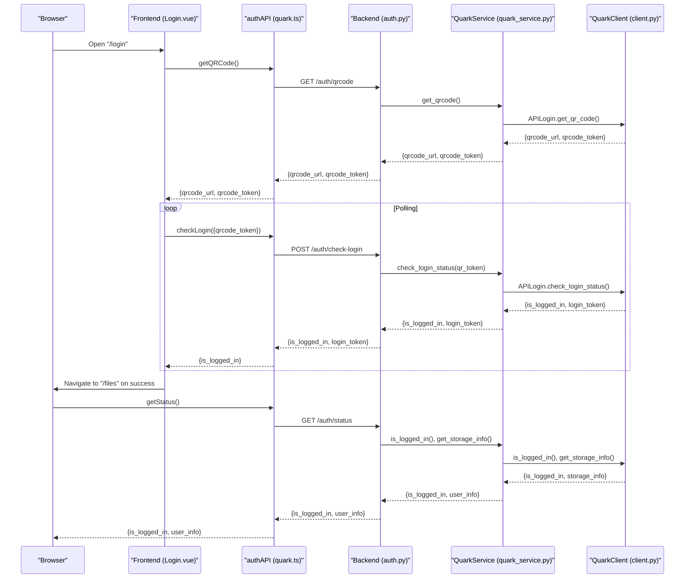
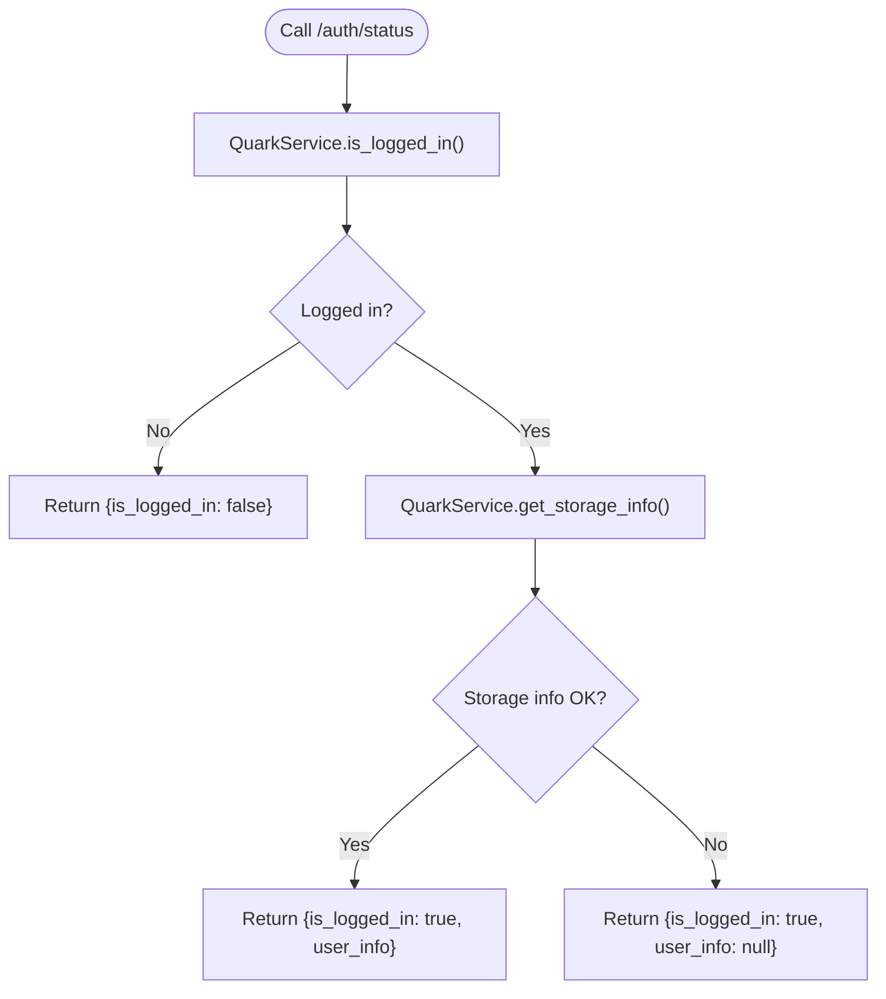
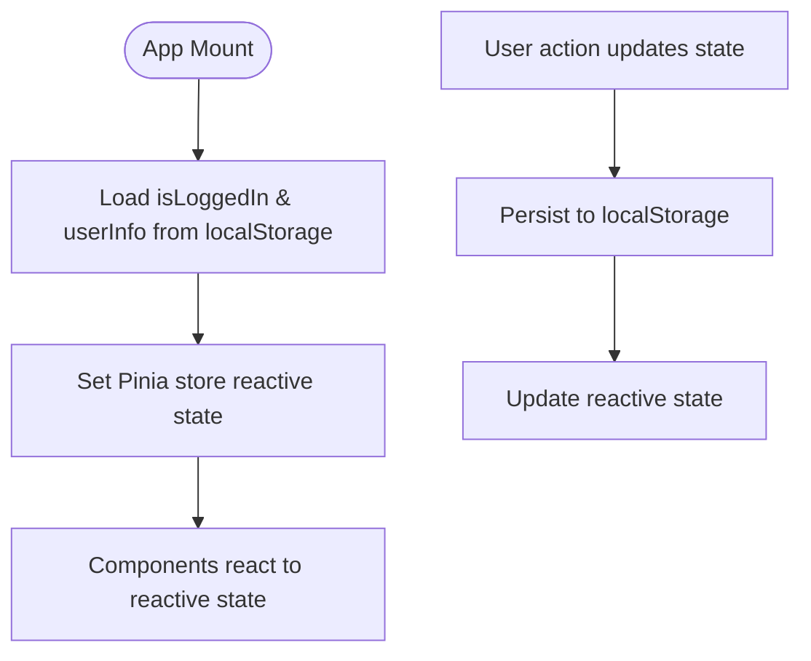
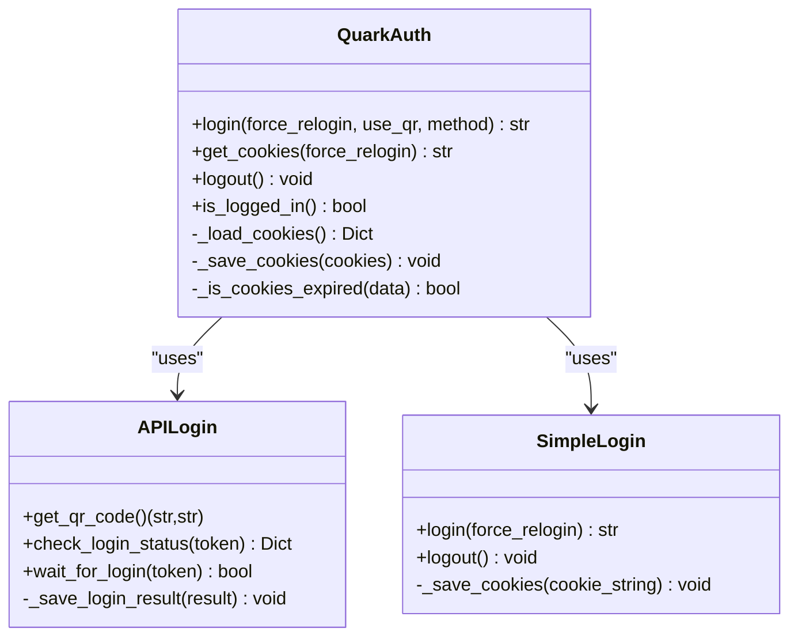
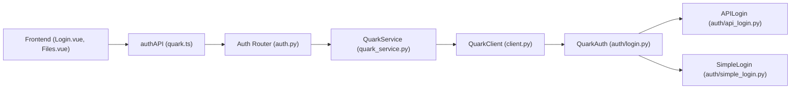

# Session Management

<cite>
**Referenced Files in This Document**
- [backend/app/api/v1/auth.py](file://backend/app/api/v1/auth.py)
- [backend/app/schemas/auth.py](file://backend/app/schemas/auth.py)
- [backend/app/services/quark_service.py](file://backend/app/services/quark_service.py)
- [backend/app/main.py](file://backend/app/main.py)
- [frontend/src/api/quark.ts](file://frontend/src/api/quark.ts)
- [frontend/src/views/Login.vue](file://frontend/src/views/Login.vue)
- [frontend/src/views/Files.vue](file://frontend/src/views/Files.vue)
- [frontend/src/stores/index.ts](file://frontend/src/stores/index.ts)
- [frontend/src/router/index.ts](file://frontend/src/router/index.ts)
- [quark_client/auth/api_login.py](file://quark_client/auth/api_login.py)
- [quark_client/auth/login.py](file://quark_client/auth/login.py)
- [quark_client/auth/simple_login.py](file://quark_client/auth/simple_login.py)
- [quark_client/client.py](file://quark_client/client.py)
</cite>

## Table of Contents
1. [Introduction](#introduction)
2. [Project Structure](#project-structure)
3. [Core Components](#core-components)
4. [Architecture Overview](#architecture-overview)
5. [Detailed Component Analysis](#detailed-component-analysis)
6. [Dependency Analysis](#dependency-analysis)
7. [Performance Considerations](#performance-considerations)
8. [Troubleshooting Guide](#troubleshooting-guide)
9. [Conclusion](#conclusion)
10. [Appendices](#appendices)

## Introduction
This document explains the complete session lifecycle for the QuarkManager application, covering token generation, storage, validation, and cleanup. It documents the backend authentication status endpoint (/api/v1/auth/status) and its role in maintaining active sessions. It also details frontend session state management using Vue reactive properties and Pinia stores, along with local storage persistence considerations. The QuarkClient session handling mechanisms and automatic token refresh capabilities are described, including practical examples of session validation, renewal processes, and logout procedures. Finally, it addresses the relationship between authentication tokens, user sessions, and storage quota information retrieval, and outlines security considerations, troubleshooting guidance, best practices, and performance optimizations.

## Project Structure
The session management spans three layers:
- Backend API: exposes authentication endpoints and integrates with the QuarkClient service.
- Frontend: manages UI flows for QR code login, cookie login, polling, and logout; persists minimal reactive state.
- QuarkClient: encapsulates authentication, token storage, and session validation logic.

**Diagram sources**
- [frontend/src/views/Login.vue](file://frontend/src/views/Login.vue)
- [frontend/src/views/Files.vue](file://frontend/src/views/Files.vue)
- [frontend/src/api/quark.ts](file://frontend/src/api/quark.ts)
- [frontend/src/stores/index.ts](file://frontend/src/stores/index.ts)
- [backend/app/main.py](file://backend/app/main.py)
- [backend/app/api/v1/auth.py](file://backend/app/api/v1/auth.py)
- [backend/app/services/quark_service.py](file://backend/app/services/quark_service.py)
- [quark_client/client.py](file://quark_client/client.py)
- [quark_client/auth/login.py](file://quark_client/auth/login.py)
- [quark_client/auth/api_login.py](file://quark_client/auth/api_login.py)
- [quark_client/auth/simple_login.py](file://quark_client/auth/simple_login.py)

**Section sources**
- [backend/app/main.py](file://backend/app/main.py)
- [frontend/src/router/index.ts](file://frontend/src/router/index.ts)

## Core Components
- Backend authentication endpoints:
  - GET /auth/qrcode: generates a QR code and returns a token for polling.
  - POST /auth/check-login: polls login status using the QR token.
  - POST /auth/login: performs login via API or Cookie method.
  - GET /auth/status: checks current login status and optionally returns user storage info.
  - POST /auth/logout: logs out and clears session state.
- Frontend authentication API module:
  - Provides typed wrappers for the above endpoints.
- QuarkClient authentication:
  - Manages cookie storage, expiration, and validation.
  - Supports QR-based and simple Cookie-based login flows.
- Frontend session state:
  - Reactive properties track login status and user info.
  - Minimal persistence via browser storage is recommended for UX continuity.

**Section sources**
- [backend/app/api/v1/auth.py](file://backend/app/api/v1/auth.py)
- [backend/app/schemas/auth.py](file://backend/app/schemas/auth.py)
- [frontend/src/api/quark.ts](file://frontend/src/api/quark.ts)
- [quark_client/auth/login.py](file://quark_client/auth/login.py)
- [quark_client/auth/api_login.py](file://quark_client/auth/api_login.py)
- [quark_client/auth/simple_login.py](file://quark_client/auth/simple_login.py)
- [frontend/src/stores/index.ts](file://frontend/src/stores/index.ts)

## Architecture Overview
The session lifecycle is orchestrated by coordinated flows across the frontend and backend, with the QuarkClient managing persistent credentials.

**Diagram sources**
- [frontend/src/views/Login.vue](file://frontend/src/views/Login.vue)
- [frontend/src/api/quark.ts](file://frontend/src/api/quark.ts)
- [backend/app/api/v1/auth.py](file://backend/app/api/v1/auth.py)
- [backend/app/services/quark_service.py](file://backend/app/services/quark_service.py)
- [quark_client/auth/api_login.py](file://quark_client/auth/api_login.py)
- [quark_client/client.py](file://quark_client/client.py)

## Detailed Component Analysis

### Backend Authentication Endpoints
- GET /auth/qrcode: returns a QR code URL and token for QR-based login.
- POST /auth/check-login: polls the login status using the QR token; returns whether the user is logged in and the login token if successful.
- POST /auth/login: supports two methods:
  - api: triggers QR-based login flow.
  - simple: accepts a Cookie string and sets it for subsequent requests.
- GET /auth/status: checks if the user is logged in and, if so, fetches user storage info via the QuarkClient.
- POST /auth/logout: clears session state and logs out.

**Diagram sources**
- [backend/app/api/v1/auth.py](file://backend/app/api/v1/auth.py)
- [backend/app/services/quark_service.py](file://backend/app/services/quark_service.py)

**Section sources**
- [backend/app/api/v1/auth.py](file://backend/app/api/v1/auth.py)
- [backend/app/schemas/auth.py](file://backend/app/schemas/auth.py)
- [backend/app/services/quark_service.py](file://backend/app/services/quark_service.py)

### Frontend Session State Management
- Reactive state:
  - isLoggedIn and userInfo are managed via a Pinia store for global state.
- Local storage persistence:
  - Recommended to persist the login state and user info to localStorage for continuity across page reloads.
- Router integration:
  - Navigation guards can leverage the store to enforce authentication policies.

**Diagram sources**
- [frontend/src/stores/index.ts](file://frontend/src/stores/index.ts)
- [frontend/src/router/index.ts](file://frontend/src/router/index.ts)

**Section sources**
- [frontend/src/stores/index.ts](file://frontend/src/stores/index.ts)
- [frontend/src/router/index.ts](file://frontend/src/router/index.ts)

### QuarkClient Session Handling and Token Persistence
- Cookie storage:
  - Cookies are persisted locally with timestamps and expiration metadata.
  - Expiration detection ensures stale sessions are not reused.
- Login methods:
  - QR-based login via APILogin: obtains QR token, displays QR, polls for login completion, extracts cookies, and saves them.
  - Simple Cookie login: parses and validates Cookie string, saves to disk.
- Validation:
  - Checks for required Cookie keys (__pus, __kps, __uid) to ensure a valid session.
- Logout:
  - Clears stored cookies and resets client state.

**Diagram sources**
- [quark_client/auth/login.py](file://quark_client/auth/login.py)
- [quark_client/auth/api_login.py](file://quark_client/auth/api_login.py)
- [quark_client/auth/simple_login.py](file://quark_client/auth/simple_login.py)

**Section sources**
- [quark_client/auth/login.py](file://quark_client/auth/login.py)
- [quark_client/auth/api_login.py](file://quark_client/auth/api_login.py)
- [quark_client/auth/simple_login.py](file://quark_client/auth/simple_login.py)
- [quark_client/client.py](file://quark_client/client.py)

### Practical Examples

#### Session Validation and Renewal
- Frontend:
  - On login success, navigate to /files and call authAPI.getStatus() to populate user info.
  - Periodically call authAPI.getStatus() to keep the session alive and update storage info.
- Backend:
  - /auth/status checks QuarkService.is_logged_in() and retrieves storage info if logged in.

**Section sources**
- [frontend/src/views/Login.vue](file://frontend/src/views/Login.vue)
- [frontend/src/api/quark.ts](file://frontend/src/api/quark.ts)
- [backend/app/api/v1/auth.py](file://backend/app/api/v1/auth.py)
- [backend/app/services/quark_service.py](file://backend/app/services/quark_service.py)

#### Logout Procedure
- Frontend:
  - Call authAPI.logout(), show success message, and redirect to /login.
- Backend:
  - QuarkService.logout() clears client state and returns success.
- QuarkClient:
  - QuarkAuth.logout() removes stored cookies.

**Section sources**
- [frontend/src/views/Files.vue](file://frontend/src/views/Files.vue)
- [frontend/src/api/quark.ts](file://frontend/src/api/quark.ts)
- [backend/app/api/v1/auth.py](file://backend/app/api/v1/auth.py)
- [backend/app/services/quark_service.py](file://backend/app/services/quark_service.py)
- [quark_client/auth/login.py](file://quark_client/auth/login.py)

#### Relationship Between Tokens, Sessions, and Storage Info
- Tokens:
  - QR token for QR-based login; login_token returned upon successful QR login.
  - Cookies represent the session token for API requests.
- Sessions:
  - Maintained server-side via QuarkService and client-side via QuarkAuth.
- Storage info:
  - Returned by /auth/status when logged in; QuarkService.get_storage_info() delegates to QuarkClient.

**Section sources**
- [backend/app/api/v1/auth.py](file://backend/app/api/v1/auth.py)
- [backend/app/services/quark_service.py](file://backend/app/services/quark_service.py)
- [quark_client/client.py](file://quark_client/client.py)

## Dependency Analysis
The frontend depends on the backend for authentication and file operations. The backend depends on QuarkClient for session management and token handling.

**Diagram sources**
- [frontend/src/views/Login.vue](file://frontend/src/views/Login.vue)
- [frontend/src/views/Files.vue](file://frontend/src/views/Files.vue)
- [frontend/src/api/quark.ts](file://frontend/src/api/quark.ts)
- [backend/app/api/v1/auth.py](file://backend/app/api/v1/auth.py)
- [backend/app/services/quark_service.py](file://backend/app/services/quark_service.py)
- [quark_client/client.py](file://quark_client/client.py)
- [quark_client/auth/login.py](file://quark_client/auth/login.py)
- [quark_client/auth/api_login.py](file://quark_client/auth/api_login.py)
- [quark_client/auth/simple_login.py](file://quark_client/auth/simple_login.py)

**Section sources**
- [backend/app/api/v1/auth.py](file://backend/app/api/v1/auth.py)
- [backend/app/services/quark_service.py](file://backend/app/services/quark_service.py)
- [frontend/src/api/quark.ts](file://frontend/src/api/quark.ts)

## Performance Considerations
- Polling intervals:
  - Use conservative intervals (e.g., every 2 seconds) for QR login polling to balance responsiveness and backend load.
- Status checks:
  - Cache /auth/status responses per session to reduce redundant calls.
- Cookie validation:
  - Validate required Cookie keys before sending requests to avoid unnecessary backend calls.
- Frontend rendering:
  - Debounce frequent UI updates when polling to minimize re-renders.

[No sources needed since this section provides general guidance]

## Troubleshooting Guide
Common issues and resolutions:
- Expired sessions:
  - Symptom: Requests fail with authentication errors.
  - Resolution: Trigger re-login via QR or Cookie method; ensure cookies are saved and validated.
- Concurrent login problems:
  - Symptom: Conflicts when multiple devices use the same account.
  - Resolution: Encourage single-device usage or implement session invalidation on new login.
- Session persistence failures:
  - Symptom: Login state lost after refresh.
  - Resolution: Persist isLoggedIn and userInfo to localStorage; restore on app mount.
- QR code timeouts:
  - Symptom: Polling stops with “QR expired”.
  - Resolution: Regenerate QR and restart polling; enforce a 5-minute timeout.
- Storage info retrieval failures:
  - Symptom: user_info missing in /auth/status.
  - Resolution: Retry after confirming successful login; handle transient network errors gracefully.

**Section sources**
- [frontend/src/views/Login.vue](file://frontend/src/views/Login.vue)
- [frontend/src/api/quark.ts](file://frontend/src/api/quark.ts)
- [backend/app/api/v1/auth.py](file://backend/app/api/v1/auth.py)
- [quark_client/auth/login.py](file://quark_client/auth/login.py)

## Conclusion
The session management system integrates a robust backend authentication flow with a resilient frontend state model. The /auth/status endpoint plays a central role in validating sessions and surfacing user storage information. QuarkClient handles credential persistence and validation, while the frontend maintains reactive state and optional local storage persistence. By following the outlined best practices and troubleshooting steps, teams can deliver a secure, reliable, and user-friendly session experience.

[No sources needed since this section summarizes without analyzing specific files]

## Appendices

### Security Considerations
- Session timeout handling:
  - Enforce QR timeouts and prompt re-authentication.
  - Validate cookie expiration and refresh as needed.
- Token encryption and secure storage:
  - Prefer encrypted storage for sensitive tokens.
  - Avoid storing tokens in plain text; use secure browser storage APIs.
- Secure transport:
  - Ensure HTTPS in production to protect tokens in transit.
- CSRF/XSS protections:
  - Implement appropriate headers and sanitization in API responses.

[No sources needed since this section provides general guidance]

### Best Practices
- Frontend:
  - Persist only essential session flags to localStorage; keep secrets in memory.
  - Use reactive stores for centralized state and avoid prop drilling.
- Backend:
  - Centralize authentication logic in QuarkService; keep endpoints thin.
  - Return structured responses with explicit success flags and messages.
- QuarkClient:
  - Validate cookies rigorously; handle missing or expired tokens gracefully.
  - Provide clear error messages for failed login attempts.

[No sources needed since this section provides general guidance]