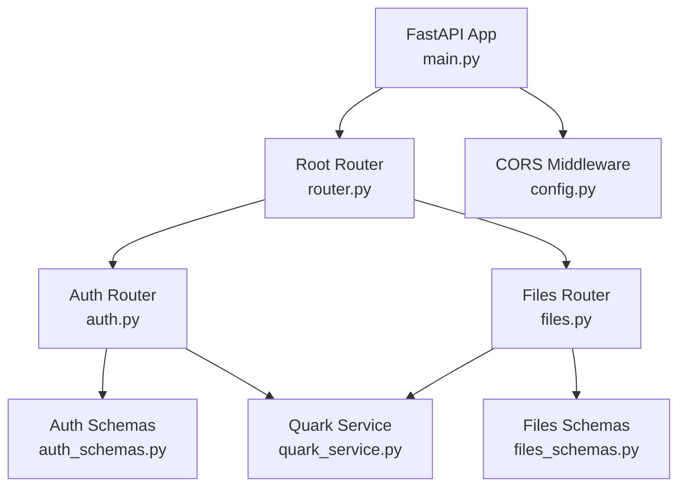
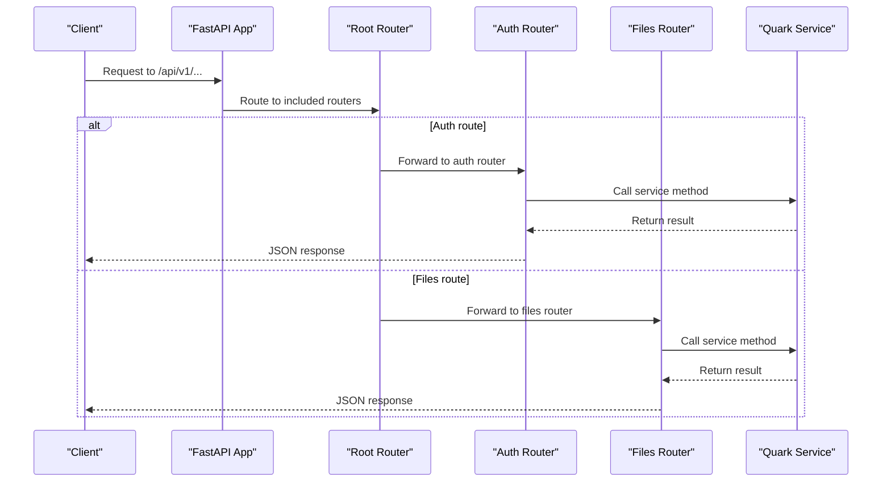
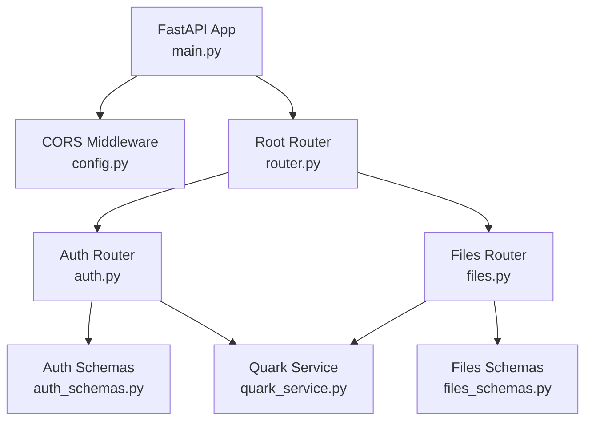

# API Endpoint Organization

<cite>
**Referenced Files in This Document**
- [router.py](file://backend/app/api/v1/router.py)
- [auth.py](file://backend/app/api/v1/auth.py)
- [files.py](file://backend/app/api/v1/files.py)
- [main.py](file://backend/app/main.py)
- [auth_schemas.py](file://backend/app/schemas/auth.py)
- [files_schemas.py](file://backend/app/schemas/files.py)
- [quark_service.py](file://backend/app/services/quark_service.py)
- [config.py](file://backend/app/core/config.py)
- [index.ts](file://frontend/src/api/index.ts)
- [quark.ts](file://frontend/src/api/quark.ts)
- [pyproject.toml](file://backend/pyproject.toml)
- [PROJECT_SUMMARY.md](file://PROJECT_SUMMARY.md)
</cite>

## Table of Contents
1. [Introduction](#introduction)
2. [Project Structure](#project-structure)
3. [Core Components](#core-components)
4. [Architecture Overview](#architecture-overview)
5. [Detailed Component Analysis](#detailed-component-analysis)
6. [Dependency Analysis](#dependency-analysis)
7. [Performance Considerations](#performance-considerations)
8. [Troubleshooting Guide](#troubleshooting-guide)
9. [Conclusion](#conclusion)
10. [Appendices](#appendices)

## Introduction
This document provides comprehensive API documentation for the REST API endpoint organization built with FastAPI. It focuses on the modular router structure, endpoint categorization by functionality (authentication, file management), URL routing patterns, request/response handling patterns, and operational characteristics. The API follows a versioned structure under `/api/v1`, with clear separation of concerns between authentication and file management endpoints. The document also covers authentication requirements, parameter validation, error response formats, practical usage examples, and testing strategies.

## Project Structure
The backend API is organized around a versioned router that groups endpoints by functional domains:
- Root router registers health checks and includes sub-routers for authentication and file management.
- Authentication router handles login, logout, QR code generation, and status checks.
- File management router manages listing, creation, deletion, renaming, moving, searching, storage info, and download URL retrieval.

**Diagram sources**
- [main.py:12-28](file://backend/app/main.py#L12-L28)
- [router.py:1-24](file://backend/app/api/v1/router.py#L1-L24)
- [auth.py:15](file://backend/app/api/v1/auth.py#L15)
- [files.py:16](file://backend/app/api/v1/files.py#L16)
- [auth_schemas.py:1-50](file://backend/app/schemas/auth.py#L1-L50)
- [files_schemas.py:1-54](file://backend/app/schemas/files.py#L1-L54)
- [quark_service.py:23-377](file://backend/app/services/quark_service.py#L23-L377)
- [config.py:16-25](file://backend/app/core/config.py#L16-L25)

**Section sources**
- [main.py:12-28](file://backend/app/main.py#L12-L28)
- [router.py:1-24](file://backend/app/api/v1/router.py#L1-L24)

## Core Components
- Root Router: Provides global endpoints and includes sub-routers for authentication and file management.
- Auth Router: Implements QR code generation, login status checking, login, status retrieval, and logout.
- Files Router: Implements file listing, folder creation, file deletion, renaming, moving, searching, storage info retrieval, and download URL generation.
- Schemas: Define request/response models for type safety and validation.
- Service Layer: Encapsulates business logic and integrates with the Quark client library.

Key characteristics:
- Versioning: All endpoints are prefixed with `/api/v1`.
- Tagging: Endpoints are tagged for grouping in documentation.
- Validation: Pydantic models enforce request parameter validation.
- Error Handling: HTTP exceptions are raised for invalid requests or service failures.

**Section sources**
- [router.py:1-24](file://backend/app/api/v1/router.py#L1-L24)
- [auth.py:15-107](file://backend/app/api/v1/auth.py#L15-L107)
- [files.py:16-150](file://backend/app/api/v1/files.py#L16-L150)
- [auth_schemas.py:1-50](file://backend/app/schemas/auth.py#L1-L50)
- [files_schemas.py:1-54](file://backend/app/schemas/files.py#L1-L54)

## Architecture Overview
The API architecture follows a layered design:
- Application Layer: FastAPI app with middleware and router registration.
- Router Layer: Modular routers for authentication and file management.
- Service Layer: Business logic encapsulated in a service class.
- Client Integration: Optional integration with a third-party Quark client library.

**Diagram sources**
- [main.py:27-28](file://backend/app/main.py#L27-L28)
- [router.py:21-23](file://backend/app/api/v1/router.py#L21-L23)
- [auth.py:18-106](file://backend/app/api/v1/auth.py#L18-L106)
- [files.py:19-149](file://backend/app/api/v1/files.py#L19-L149)
- [quark_service.py:54-372](file://backend/app/services/quark_service.py#L54-L372)

## Detailed Component Analysis

### Authentication Endpoints
Authentication endpoints handle QR code generation, login status checking, login, status retrieval, and logout. They use Pydantic models for request/response validation and integrate with the service layer.

Endpoints:
- GET /api/v1/auth/qrcode: Generates a QR code and returns a token for subsequent login checks.
- POST /api/v1/auth/check-login: Checks login status using the QR code token.
- POST /api/v1/auth/login: Performs login using either QR code or cookie-based methods.
- GET /api/v1/auth/status: Retrieves current authentication status and user info.
- POST /api/v1/auth/logout: Logs out the current session.

Request/Response Models:
- LoginRequest/LoginResponse: Define login method and optional cookie parameters.
- QRCodeResponse: Contains QR code URL and token.
- CheckLoginRequest/CheckLoginResponse: Handles QR code token and login result.
- AuthStatusResponse: Indicates login status and optional user info.
- LogoutResponse: Standardized logout response.

Validation and Error Handling:
- Query parameters are validated using Pydantic field constraints.
- HTTP exceptions are raised for service failures or invalid requests.

Example Usage:
- Obtain QR code: GET /api/v1/auth/qrcode
- Poll login status: POST /api/v1/auth/check-login with qrcode_token
- Perform login: POST /api/v1/auth/login with method and optional cookies
- Check status: GET /api/v1/auth/status
- Logout: POST /api/v1/auth/logout

**Section sources**
- [auth.py:18-106](file://backend/app/api/v1/auth.py#L18-L106)
- [auth_schemas.py:5-49](file://backend/app/schemas/auth.py#L5-L49)
- [quark_service.py:54-216](file://backend/app/services/quark_service.py#L54-L216)

### File Management Endpoints
File management endpoints support listing files, creating folders, deleting files, renaming files, moving files, searching, retrieving storage info, and obtaining download URLs. All endpoints leverage Pydantic models for validation and service layer integration.

Endpoints:
- GET /api/v1/files/list: Lists files in a folder with pagination.
- POST /api/v1/files/folder: Creates a new folder.
- DELETE /api/v1/files/delete: Deletes files by IDs.
- PUT /api/v1/files/rename: Renames a file.
- POST /api/v1/files/move: Moves files to a target folder.
- GET /api/v1/files/search: Searches files by keyword with pagination.
- GET /api/v1/files/storage: Retrieves storage information.
- GET /api/v1/files/download/{file_id}: Returns a download URL for a file.

Request/Response Models:
- FileListRequest/FileListResponse: Pagination and list data.
- CreateFolderRequest: Folder creation parameters.
- DeleteFilesRequest: File deletion parameters.
- RenameFileRequest: File rename parameters.
- MoveFilesRequest: File move parameters.
- SearchFilesRequest: Search parameters.
- StorageInfoResponse: Storage information response.

Validation and Error Handling:
- Query parameters enforce bounds and presence.
- HTTP exceptions are raised for invalid requests or service failures.

Example Usage:
- List files: GET /api/v1/files/list?folder_id=0&page=1&size=50
- Create folder: POST /api/v1/files/folder with folder_name and parent_id
- Delete files: DELETE /api/v1/files/delete with file_ids array
- Rename file: PUT /api/v1/files/rename with file_id and new_name
- Move files: POST /api/v1/files/move with file_ids and target_folder_id
- Search files: GET /api/v1/files/search?keyword=photo&page=1&size=50
- Get storage info: GET /api/v1/files/storage
- Get download URL: GET /api/v1/files/download/{file_id}

**Section sources**
- [files.py:19-149](file://backend/app/api/v1/files.py#L19-L149)
- [files_schemas.py:5-53](file://backend/app/schemas/files.py#L5-L53)
- [quark_service.py:218-372](file://backend/app/services/quark_service.py#L218-L372)

### Global Endpoints
Global endpoints provide health checks and a simple test endpoint at the root router level.

Endpoints:
- GET /api/v1/test: Returns a simple success message.
- GET /api/v1/health: Returns API health status.

These endpoints are useful for deployment verification and monitoring.

**Section sources**
- [router.py:9-18](file://backend/app/api/v1/router.py#L9-L18)

## Dependency Analysis
The API depends on several core components:
- FastAPI App: Hosts the application and registers routers.
- CORS Middleware: Configured via settings for cross-origin requests.
- Router Composition: Root router includes auth and files sub-routers.
- Service Layer: Centralized business logic with a singleton service instance.
- Schemas: Shared request/response models for validation.

**Diagram sources**
- [main.py:12-28](file://backend/app/main.py#L12-L28)
- [config.py:16-25](file://backend/app/core/config.py#L16-L25)
- [router.py:21-23](file://backend/app/api/v1/router.py#L21-L23)
- [auth.py:15](file://backend/app/api/v1/auth.py#L15)
- [files.py:16](file://backend/app/api/v1/files.py#L16)
- [auth_schemas.py:1-50](file://backend/app/schemas/auth.py#L1-L50)
- [files_schemas.py:1-54](file://backend/app/schemas/files.py#L1-L54)
- [quark_service.py:23-377](file://backend/app/services/quark_service.py#L23-L377)

**Section sources**
- [main.py:12-28](file://backend/app/main.py#L12-L28)
- [config.py:16-25](file://backend/app/core/config.py#L16-L25)
- [router.py:21-23](file://backend/app/api/v1/router.py#L21-L23)

## Performance Considerations
- Pagination: File listing and search endpoints support pagination to limit response sizes.
- Parameter Bounds: Size limits and page constraints prevent excessive resource usage.
- Service Layer: Centralized logic reduces duplication and improves maintainability.
- CORS Configuration: Flexible CORS settings enable frontend integration while maintaining security.

[No sources needed since this section provides general guidance]

## Troubleshooting Guide
Common issues and resolutions:
- Authentication Failures: Verify QR code token validity and ensure the QR code flow is followed correctly.
- Service Initialization: Confirm the Quark client is available and properly initialized.
- Parameter Validation: Ensure query parameters meet constraints (e.g., page >= 1, size between 1 and 200).
- CORS Issues: Check backend CORS origins configuration if frontend requests fail.

**Section sources**
- [quark_service.py:54-216](file://backend/app/services/quark_service.py#L54-L216)
- [files.py:20-23](file://backend/app/api/v1/files.py#L20-L23)
- [files.py:108-112](file://backend/app/api/v1/files.py#L108-L112)
- [config.py:22-25](file://backend/app/core/config.py#L22-L25)

## Conclusion
The API is structured around a clear modular router design with versioning, tagging, and robust request/response validation. Authentication and file management are cleanly separated, enabling maintainable development and testing. The service layer centralizes business logic, and the frontend consumes endpoints through a typed API client. The architecture supports scalability and future enhancements such as database integration and expanded functionality.

[No sources needed since this section summarizes without analyzing specific files]

## Appendices

### API Versioning Strategy
- All endpoints are prefixed with `/api/v1`.
- Versioning allows for backward-compatible changes and controlled evolution of the API surface.

**Section sources**
- [main.py:27-28](file://backend/app/main.py#L27-L28)
- [PROJECT_SUMMARY.md:67](file://PROJECT_SUMMARY.md#L67)

### Endpoint Naming Conventions and HTTP Methods
- Naming: Nouns for resources (files, auth), verbs for actions (list, create, delete, rename, move, search, status, logout).
- HTTP Methods: GET for retrieval, POST for creation and actions, PUT for updates, DELETE for removal.

**Section sources**
- [auth.py:18-106](file://backend/app/api/v1/auth.py#L18-L106)
- [files.py:19-149](file://backend/app/api/v1/files.py#L19-L149)

### Authentication Requirements
- Authentication is required for file management operations when the service is not in simulation mode.
- The service simulates authentication during development and requires real integration for production.

**Section sources**
- [quark_service.py:218-372](file://backend/app/services/quark_service.py#L218-L372)

### Parameter Validation
- Query parameters enforce constraints (e.g., page >= 1, size between 1 and 200).
- Pydantic models validate request bodies and enforce field presence and types.

**Section sources**
- [files.py:20-23](file://backend/app/api/v1/files.py#L20-L23)
- [files.py:108-112](file://backend/app/api/v1/files.py#L108-L112)
- [files_schemas.py:5-46](file://backend/app/schemas/files.py#L5-L46)
- [auth_schemas.py:5-8](file://backend/app/schemas/auth.py#L5-L8)

### Error Response Formats
- Consistent structure: success flag, message, and optional data.
- HTTP exceptions are raised for invalid requests or service errors.

**Section sources**
- [auth.py:27-28](file://backend/app/api/v1/auth.py#L27-L28)
- [files.py:28-29](file://backend/app/api/v1/files.py#L28-L29)
- [auth_schemas.py:11-17](file://backend/app/schemas/auth.py#L11-L17)
- [files_schemas.py:12-17](file://backend/app/schemas/files.py#L12-L17)

### Practical Examples and Usage
- Health Check: GET /api/v1/health
- Test Endpoint: GET /api/v1/test
- Authentication Flow:
  - GET /api/v1/auth/qrcode
  - POST /api/v1/auth/check-login with qrcode_token
  - POST /api/v1/auth/login with method and optional cookies
  - GET /api/v1/auth/status
  - POST /api/v1/auth/logout
- File Operations:
  - GET /api/v1/files/list?folder_id=0&page=1&size=50
  - POST /api/v1/files/folder with folder_name and parent_id
  - DELETE /api/v1/files/delete with file_ids array
  - PUT /api/v1/files/rename with file_id and new_name
  - POST /api/v1/files/move with file_ids and target_folder_id
  - GET /api/v1/files/search?keyword=photo&page=1&size=50
  - GET /api/v1/files/storage
  - GET /api/v1/files/download/{file_id}

**Section sources**
- [router.py:9-18](file://backend/app/api/v1/router.py#L9-L18)
- [auth.py:18-106](file://backend/app/api/v1/auth.py#L18-L106)
- [files.py:19-149](file://backend/app/api/v1/files.py#L19-L149)
- [PROJECT_SUMMARY.md:108-120](file://PROJECT_SUMMARY.md#L108-L120)

### Frontend Integration Patterns
- Axios client configured with base URL set to /api/v1.
- Interceptors handle request/response transformations.
- TypeScript interfaces mirror backend schemas for type safety.

**Section sources**
- [index.ts:3-29](file://frontend/src/api/index.ts#L3-L29)
- [quark.ts:55-124](file://frontend/src/api/quark.ts#L55-L124)

### Testing Strategies and Documentation Generation
- FastAPI automatically generates OpenAPI documentation at /docs.
- Example curl commands demonstrate endpoint usage for manual testing.
- Frontend API module provides a typed interface for integration testing.

**Section sources**
- [PROJECT_SUMMARY.md:67](file://PROJECT_SUMMARY.md#L67)
- [PROJECT_SUMMARY.md:108-120](file://PROJECT_SUMMARY.md#L108-L120)
- [index.ts:3-29](file://frontend/src/api/index.ts#L3-L29)

### Version Management Approaches
- Project version defined in pyproject.toml.
- API versioning via URL prefix (/api/v1) enables independent evolution of API and application versions.

**Section sources**
- [pyproject.toml:7](file://backend/pyproject.toml#L7)
- [main.py:15](file://backend/app/main.py#L15)