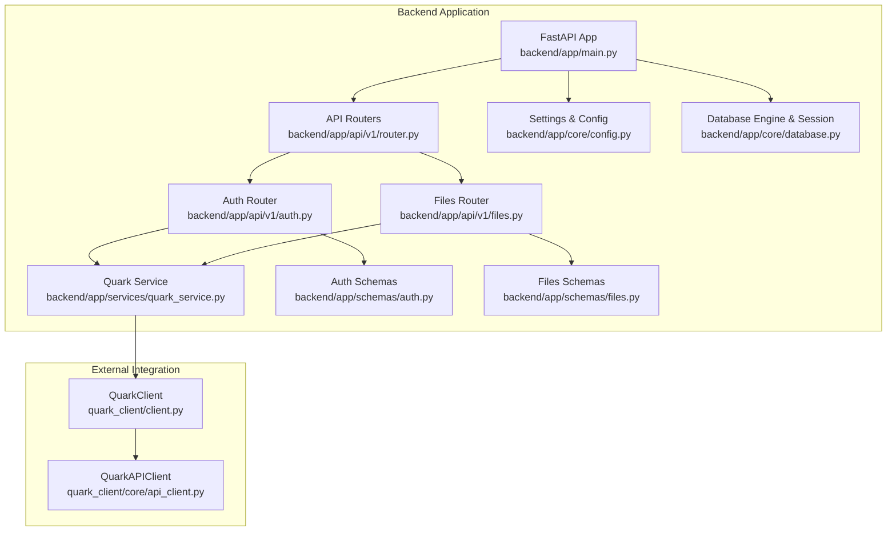
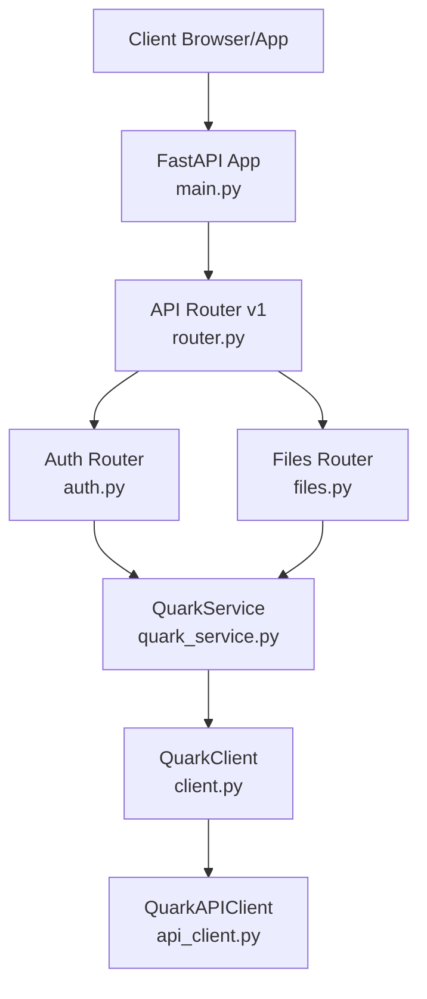
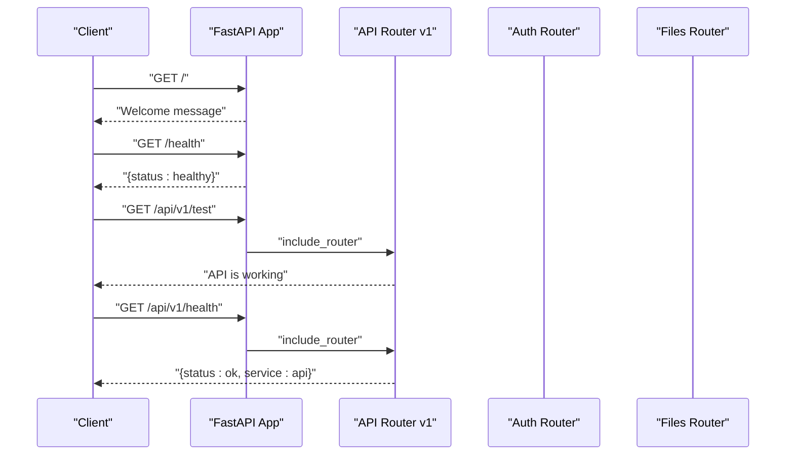
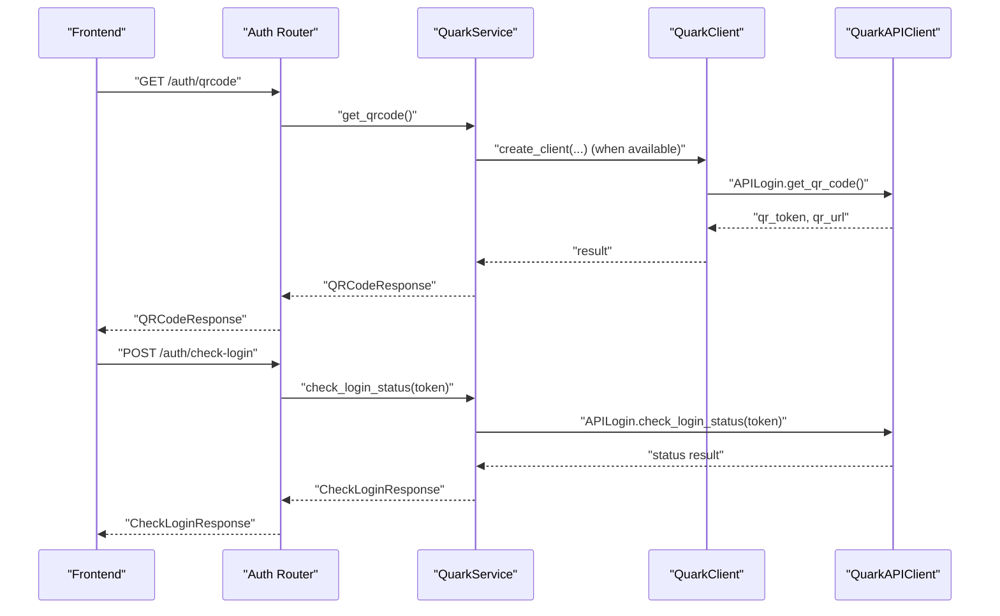
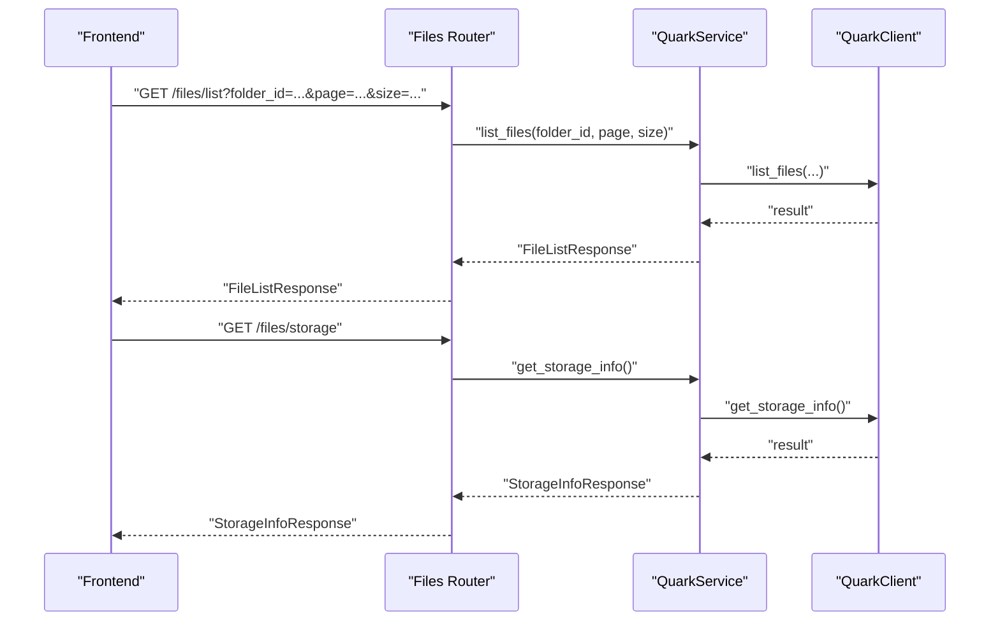
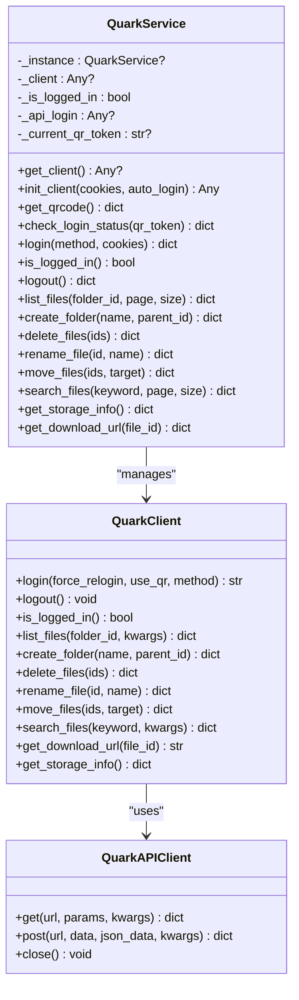
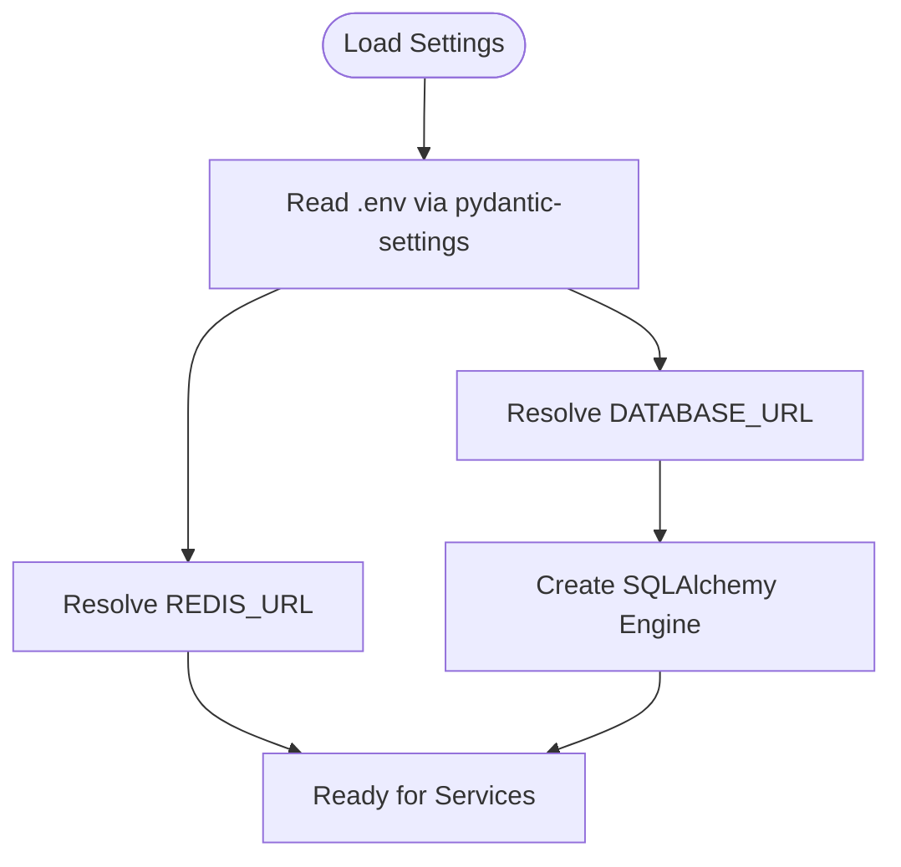
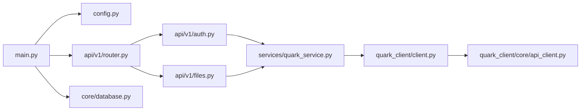
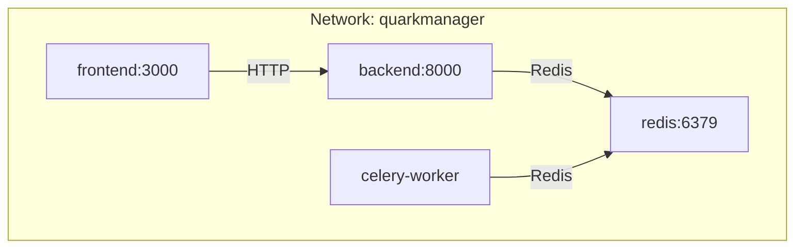
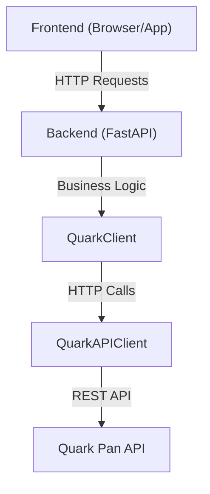

# Backend Architecture

<cite>
**Referenced Files in This Document**
- [backend/app/main.py](file://backend/app/main.py)
- [backend/app/api/v1/router.py](file://backend/app/api/v1/router.py)
- [backend/app/api/v1/auth.py](file://backend/app/api/v1/auth.py)
- [backend/app/api/v1/files.py](file://backend/app/api/v1/files.py)
- [backend/app/core/config.py](file://backend/app/core/config.py)
- [backend/app/core/database.py](file://backend/app/core/database.py)
- [backend/app/schemas/auth.py](file://backend/app/schemas/auth.py)
- [backend/app/schemas/files.py](file://backend/app/schemas/files.py)
- [backend/app/services/quark_service.py](file://backend/app/services/quark_service.py)
- [backend/pyproject.toml](file://backend/pyproject.toml)
- [backend/Dockerfile](file://backend/Dockerfile)
- [docker-compose.yml](file://docker-compose.yml)
- [quark_client/client.py](file://quark_client/client.py)
- [quark_client/core/api_client.py](file://quark_client/core/api_client.py)
</cite>

## Table of Contents
1. [Introduction](#introduction)
2. [Project Structure](#project-structure)
3. [Core Components](#core-components)
4. [Architecture Overview](#architecture-overview)
5. [Detailed Component Analysis](#detailed-component-analysis)
6. [Dependency Analysis](#dependency-analysis)
7. [Performance Considerations](#performance-considerations)
8. [Troubleshooting Guide](#troubleshooting-guide)
9. [Conclusion](#conclusion)
10. [Appendices](#appendices)

## Introduction
This document describes the backend architecture of a FastAPI-based server that integrates with the Quark Pan API via a dedicated Python client library. The system follows a layered architecture with clear separation between presentation (FastAPI routers), business logic (service layer), and data access (SQLAlchemy). It also documents asynchronous programming patterns, dependency injection, middleware configuration, error handling strategies, infrastructure requirements, scalability considerations, and deployment topology. Cross-cutting concerns such as authentication, logging, monitoring, and security are addressed alongside the technology stack and version compatibility.

## Project Structure
The backend is organized into distinct layers:
- Presentation layer: FastAPI application and API routers under app/api/v1
- Business logic layer: Service layer under app/services
- Data access layer: SQLAlchemy engine/session factory under app/core/database.py
- Configuration: Environment-driven settings under app/core/config.py
- Schemas: Pydantic models for request/response validation under app/schemas
- Client integration: QuarkClient and QuarkAPIClient under quark_client

**Diagram sources**
- [backend/app/main.py:12-28](file://backend/app/main.py#L12-L28)
- [backend/app/api/v1/router.py:1-24](file://backend/app/api/v1/router.py#L1-L24)
- [backend/app/api/v1/auth.py:15-107](file://backend/app/api/v1/auth.py#L15-L107)
- [backend/app/api/v1/files.py:16-150](file://backend/app/api/v1/files.py#L16-L150)
- [backend/app/core/config.py:5-35](file://backend/app/core/config.py#L5-L35)
- [backend/app/core/database.py:10-29](file://backend/app/core/database.py#L10-L29)
- [backend/app/services/quark_service.py:22-361](file://backend/app/services/quark_service.py#L22-L361)
- [backend/app/schemas/auth.py:5-50](file://backend/app/schemas/auth.py#L5-L50)
- [backend/app/schemas/files.py:5-54](file://backend/app/schemas/files.py#L5-L54)
- [quark_client/client.py:18-405](file://quark_client/client.py#L18-L405)
- [quark_client/core/api_client.py:16-209](file://quark_client/core/api_client.py#L16-L209)

**Section sources**
- [backend/app/main.py:12-28](file://backend/app/main.py#L12-L28)
- [backend/app/api/v1/router.py:1-24](file://backend/app/api/v1/router.py#L1-L24)
- [backend/app/core/config.py:5-35](file://backend/app/core/config.py#L5-L35)
- [backend/app/core/database.py:10-29](file://backend/app/core/database.py#L10-L29)
- [backend/app/services/quark_service.py:22-361](file://backend/app/services/quark_service.py#L22-L361)
- [quark_client/client.py:18-405](file://quark_client/client.py#L18-L405)
- [quark_client/core/api_client.py:16-209](file://quark_client/core/api_client.py#L16-L209)

## Core Components
- FastAPI application: Initializes middleware, registers routers, and exposes health checks.
- API routers: Modularized under v1 with separate routers for authentication and files.
- Service layer: Encapsulates business logic and integrates with QuarkClient.
- Configuration: Centralized settings via pydantic-settings with environment file support.
- Data access: SQLAlchemy engine and session factory for persistence.
- Schemas: Pydantic models for request/response validation and serialization.
- Client integration: QuarkClient and QuarkAPIClient handle authentication, HTTP requests, and API interactions.

Key implementation patterns:
- Asynchronous programming: All route handlers are async-compatible with FastAPI.
- Dependency injection: Settings and database sessions are provided via dependency functions.
- Error handling: Route handlers raise HTTPException on failures; service layer returns structured result dictionaries.
- Middleware: CORS configured centrally for cross-origin requests.

**Section sources**
- [backend/app/main.py:12-40](file://backend/app/main.py#L12-L40)
- [backend/app/api/v1/router.py:1-24](file://backend/app/api/v1/router.py#L1-L24)
- [backend/app/api/v1/auth.py:15-107](file://backend/app/api/v1/auth.py#L15-L107)
- [backend/app/api/v1/files.py:16-150](file://backend/app/api/v1/files.py#L16-L150)
- [backend/app/core/config.py:5-35](file://backend/app/core/config.py#L5-L35)
- [backend/app/core/database.py:22-29](file://backend/app/core/database.py#L22-L29)
- [backend/app/schemas/auth.py:5-50](file://backend/app/schemas/auth.py#L5-L50)
- [backend/app/schemas/files.py:5-54](file://backend/app/schemas/files.py#L5-L54)
- [backend/app/services/quark_service.py:22-361](file://backend/app/services/quark_service.py#L22-L361)

## Architecture Overview
The system follows a layered architecture:
- Presentation: FastAPI app and routers expose REST endpoints.
- Business logic: Service layer orchestrates operations and interacts with the QuarkClient.
- Data access: SQLAlchemy manages persistence (configured but not actively used in code).
- External integration: QuarkClient encapsulates Quark Pan API interactions via QuarkAPIClient.

**Diagram sources**
- [backend/app/main.py:12-28](file://backend/app/main.py#L12-L28)
- [backend/app/api/v1/router.py:1-24](file://backend/app/api/v1/router.py#L1-L24)
- [backend/app/api/v1/auth.py:15-107](file://backend/app/api/v1/auth.py#L15-L107)
- [backend/app/api/v1/files.py:16-150](file://backend/app/api/v1/files.py#L16-L150)
- [backend/app/services/quark_service.py:22-361](file://backend/app/services/quark_service.py#L22-L361)
- [quark_client/client.py:18-405](file://quark_client/client.py#L18-L405)
- [quark_client/core/api_client.py:16-209](file://quark_client/core/api_client.py#L16-L209)

## Detailed Component Analysis

### FastAPI Application and Middleware
- Initializes FastAPI with metadata and registers CORS middleware using settings.
- Includes v1 API router under /api/v1 and exposes root and health endpoints.
- Uses Uvicorn for development runtime.

**Diagram sources**
- [backend/app/main.py:12-40](file://backend/app/main.py#L12-L40)
- [backend/app/api/v1/router.py:9-18](file://backend/app/api/v1/router.py#L9-L18)

**Section sources**
- [backend/app/main.py:12-40](file://backend/app/main.py#L12-L40)
- [backend/app/api/v1/router.py:1-24](file://backend/app/api/v1/router.py#L1-L24)

### Authentication Router and Service Integration
- Provides endpoints for QR code generation, login status polling, explicit login, status check, and logout.
- Delegates to QuarkService for all operations, returning structured results and raising HTTPException on failure.

**Diagram sources**
- [backend/app/api/v1/auth.py:18-52](file://backend/app/api/v1/auth.py#L18-L52)
- [backend/app/services/quark_service.py:46-136](file://backend/app/services/quark_service.py#L46-L136)
- [quark_client/client.py:402-405](file://quark_client/client.py#L402-L405)
- [quark_client/core/api_client.py:18-209](file://quark_client/core/api_client.py#L18-L209)

**Section sources**
- [backend/app/api/v1/auth.py:15-107](file://backend/app/api/v1/auth.py#L15-L107)
- [backend/app/services/quark_service.py:22-361](file://backend/app/services/quark_service.py#L22-L361)
- [quark_client/client.py:18-405](file://quark_client/client.py#L18-L405)
- [quark_client/core/api_client.py:16-209](file://quark_client/core/api_client.py#L16-L209)

### Files Router and Service Integration
- Provides endpoints for listing files, creating folders, deleting files, renaming files, moving files, searching, retrieving storage info, and obtaining download URLs.
- Delegates to QuarkService and raises HTTPException on failure.

**Diagram sources**
- [backend/app/api/v1/files.py:19-138](file://backend/app/api/v1/files.py#L19-L138)
- [backend/app/services/quark_service.py:202-335](file://backend/app/services/quark_service.py#L202-L335)
- [quark_client/client.py:261-273](file://quark_client/client.py#L261-L273)

**Section sources**
- [backend/app/api/v1/files.py:16-150](file://backend/app/api/v1/files.py#L16-L150)
- [backend/app/services/quark_service.py:202-335](file://backend/app/services/quark_service.py#L202-L335)
- [quark_client/client.py:261-273](file://quark_client/client.py#L261-L273)

### QuarkService Singleton and Client Integration
- Implements a thread-safe singleton pattern to manage a single QuarkClient instance.
- Provides methods for QR code retrieval, login status checking, explicit login, logout, file operations, storage info, and download URL retrieval.
- Integrates with QuarkClient and QuarkAPIClient for all Quark Pan API interactions.

**Diagram sources**
- [backend/app/services/quark_service.py:22-361](file://backend/app/services/quark_service.py#L22-L361)
- [quark_client/client.py:18-405](file://quark_client/client.py#L18-L405)
- [quark_client/core/api_client.py:16-209](file://quark_client/core/api_client.py#L16-L209)

**Section sources**
- [backend/app/services/quark_service.py:22-361](file://backend/app/services/quark_service.py#L22-L361)
- [quark_client/client.py:18-405](file://quark_client/client.py#L18-L405)
- [quark_client/core/api_client.py:16-209](file://quark_client/core/api_client.py#L16-L209)

### Configuration and Database Layer
- Settings loaded via pydantic-settings with environment file support.
- Database engine and session factory configured; dependency function provided for DI.
- Redis URL configured for potential background task integration.

**Diagram sources**
- [backend/app/core/config.py:5-35](file://backend/app/core/config.py#L5-L35)
- [backend/app/core/database.py:10-29](file://backend/app/core/database.py#L10-L29)

**Section sources**
- [backend/app/core/config.py:5-35](file://backend/app/core/config.py#L5-L35)
- [backend/app/core/database.py:10-29](file://backend/app/core/database.py#L10-L29)

## Dependency Analysis
- FastAPI application depends on configuration and registers v1 routers.
- Routers depend on schemas for request/response validation and on the service layer.
- Service layer depends on QuarkClient and QuarkAPIClient for external API interactions.
- Database layer provides dependency functions for session management.

**Diagram sources**
- [backend/app/main.py:4-28](file://backend/app/main.py#L4-L28)
- [backend/app/api/v1/router.py:3-23](file://backend/app/api/v1/router.py#L3-L23)
- [backend/app/api/v1/auth.py:4-13](file://backend/app/api/v1/auth.py#L4-L13)
- [backend/app/api/v1/files.py:4-14](file://backend/app/api/v1/files.py#L4-L14)
- [backend/app/services/quark_service.py:10-19](file://backend/app/services/quark_service.py#L10-L19)
- [quark_client/client.py:8-16](file://quark_client/client.py#L8-L16)
- [quark_client/core/api_client.py:8-13](file://quark_client/core/api_client.py#L8-L13)
- [backend/app/core/database.py:5-6](file://backend/app/core/database.py#L5-L6)

**Section sources**
- [backend/app/main.py:4-28](file://backend/app/main.py#L4-L28)
- [backend/app/api/v1/router.py:3-23](file://backend/app/api/v1/router.py#L3-L23)
- [backend/app/api/v1/auth.py:4-13](file://backend/app/api/v1/auth.py#L4-L13)
- [backend/app/api/v1/files.py:4-14](file://backend/app/api/v1/files.py#L4-L14)
- [backend/app/services/quark_service.py:10-19](file://backend/app/services/quark_service.py#L10-L19)
- [quark_client/client.py:8-16](file://quark_client/client.py#L8-L16)
- [quark_client/core/api_client.py:8-13](file://quark_client/core/api_client.py#L8-L13)
- [backend/app/core/database.py:5-6](file://backend/app/core/database.py#L5-L6)

## Performance Considerations
- Asynchronous design: Route handlers are async-compatible; consider using async-aware clients for I/O-bound operations to improve concurrency.
- Database usage: SQLAlchemy engine/session factory is present; ensure proper connection pooling and avoid long transactions.
- External API latency: Quark Pan API calls introduce network latency; implement caching for frequently accessed metadata and consider pagination limits.
- Background tasks: Redis and Celery are available; offload long-running operations (e.g., batch downloads, conversions) to workers.
- Resource limits: Configure container resource limits and readiness/liveness probes in production deployments.

## Troubleshooting Guide
Common issues and resolutions:
- Authentication failures: Verify cookie validity and re-login if necessary; check QuarkAPIClient error handling for 401/403 responses.
- CORS errors: Ensure backend_cors_origins matches frontend origin; confirm middleware registration order.
- Health checks: Use / and /health endpoints to validate service availability; use /api/v1/health for API-specific checks.
- Database connectivity: Confirm DATABASE_URL and connection arguments; ensure SQLite file path exists or switch to PostgreSQL in production.
- Redis connectivity: Validate REDIS_URL and ensure Redis service is reachable from the backend container.

**Section sources**
- [backend/app/main.py:31-40](file://backend/app/main.py#L31-L40)
- [backend/app/api/v1/router.py:9-18](file://backend/app/api/v1/router.py#L9-L18)
- [backend/app/core/config.py:22-25](file://backend/app/core/config.py#L22-L25)
- [quark_client/core/api_client.py:146-156](file://quark_client/core/api_client.py#L146-L156)

## Conclusion
The backend employs a clean, layered architecture with FastAPI as the presentation layer, a robust service layer for business logic, and a clear integration boundary with the QuarkClient/QuarkAPIClient for external API interactions. Asynchronous patterns, dependency injection, and centralized configuration enable maintainability and scalability. The provided Docker and docker-compose configurations facilitate local development and deployment, while Redis/Celery offer pathways for background task processing. Cross-cutting concerns such as CORS, error handling, and configuration are consistently implemented across the stack.

## Appendices

### Technology Stack and Version Compatibility
- FastAPI: >= 0.109.0
- Uvicorn: >= 0.27.0
- SQLAlchemy: >= 2.0.0
- Alembic: >= 1.13.0
- Pydantic: >= 2.5.0
- Pydantic Settings: >= 2.1.0
- Celery: >= 5.3.0
- Redis: >= 5.0.0
- httpx: >= 0.26.0
- Python: >= 3.9

**Section sources**
- [backend/pyproject.toml:13-27](file://backend/pyproject.toml#L13-L27)

### Infrastructure Requirements and Deployment Topology
- Backend service: Exposed on port 8000; mounts ./data for persistent storage.
- Frontend service: Exposed on port 3000; depends on backend.
- Redis service: Exposed on port 6379; used for Celery and caching.
- Celery worker: Runs as a separate service using the same backend image.
- Networking: All services on a shared bridge network named quarkmanager.

**Diagram sources**
- [docker-compose.yml:34-57](file://docker-compose.yml#L34-L57)

**Section sources**
- [docker-compose.yml:1-65](file://docker-compose.yml#L1-L65)
- [backend/Dockerfile:1-15](file://backend/Dockerfile#L1-L15)

### System Context Diagram
High-level view of backend, frontend, and external Quark Pan API integration.

**Diagram sources**
- [backend/app/main.py:12-28](file://backend/app/main.py#L12-L28)
- [backend/app/api/v1/auth.py:15-107](file://backend/app/api/v1/auth.py#L15-L107)
- [backend/app/api/v1/files.py:16-150](file://backend/app/api/v1/files.py#L16-L150)
- [backend/app/services/quark_service.py:22-361](file://backend/app/services/quark_service.py#L22-L361)
- [quark_client/client.py:18-405](file://quark_client/client.py#L18-L405)
- [quark_client/core/api_client.py:16-209](file://quark_client/core/api_client.py#L16-L209)