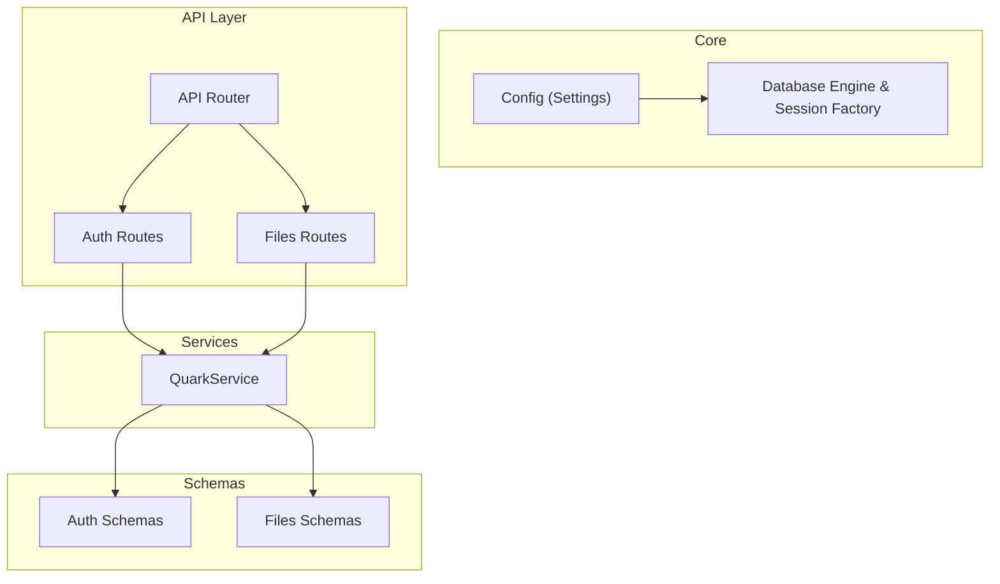
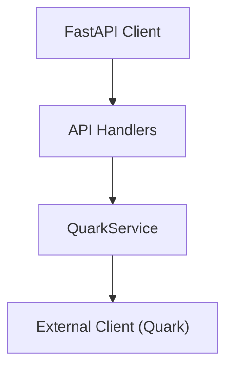
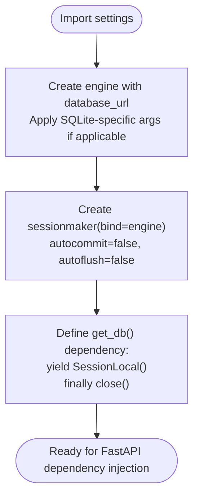
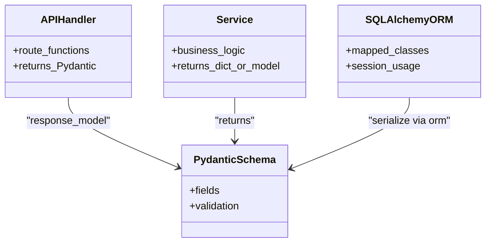
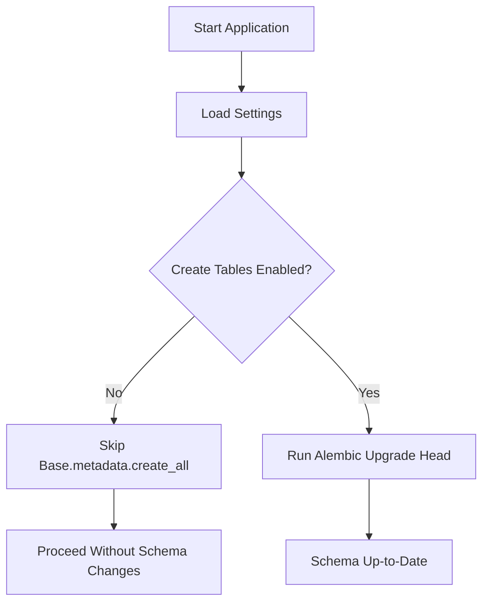
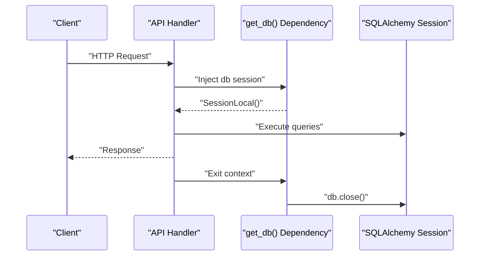
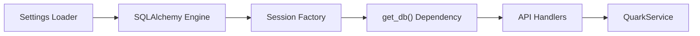
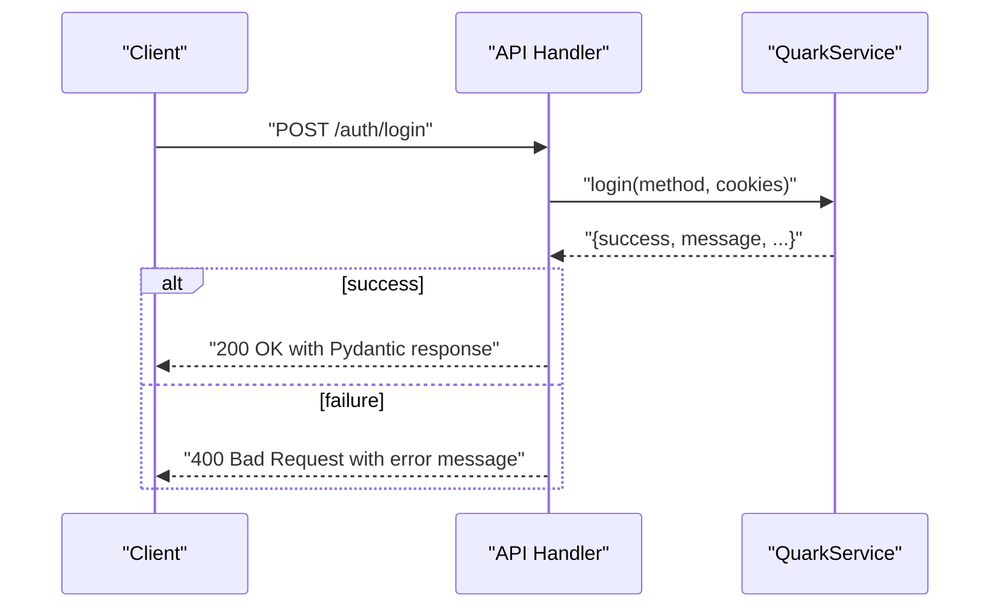

# Database Integration

<cite>
**Referenced Files in This Document**
- [backend/app/core/database.py](file://backend/app/core/database.py)
- [backend/app/core/config.py](file://backend/app/core/config.py)
- [backend/app/main.py](file://backend/app/main.py)
- [backend/app/api/v1/router.py](file://backend/app/api/v1/router.py)
- [backend/app/api/v1/auth.py](file://backend/app/api/v1/auth.py)
- [backend/app/api/v1/files.py](file://backend/app/api/v1/files.py)
- [backend/app/schemas/auth.py](file://backend/app/schemas/auth.py)
- [backend/app/schemas/files.py](file://backend/app/schemas/files.py)
- [backend/app/services/quark_service.py](file://backend/app/services/quark_service.py)
</cite>

## Table of Contents
1. [Introduction](#introduction)
2. [Project Structure](#project-structure)
3. [Core Components](#core-components)
4. [Architecture Overview](#architecture-overview)
5. [Detailed Component Analysis](#detailed-component-analysis)
6. [Dependency Analysis](#dependency-analysis)
7. [Performance Considerations](#performance-considerations)
8. [Troubleshooting Guide](#troubleshooting-guide)
9. [Conclusion](#conclusion)
10. [Appendices](#appendices)

## Introduction
This document provides comprehensive data model documentation for the database integration in the backend. It focuses on SQLAlchemy ORM configuration and session management, the relationship between database models, Pydantic schemas, and API response objects, and the current database initialization and migration posture. It also outlines practical patterns for database operations, transaction management, FastAPI dependency injection, connection pooling, performance optimization, and security considerations. Finally, it provides guidelines for extending the schema while maintaining backward compatibility.

## Project Structure
The backend follows a layered architecture:
- Core configuration and database setup live under core.
- API routers define endpoints and orchestrate service calls.
- Services encapsulate business logic and integrate with external clients.
- Pydantic schemas define request/response contracts.
- Models are currently placeholders and not yet wired into the application.

**Diagram sources**
- [backend/app/core/config.py:1-35](file://backend/app/core/config.py#L1-L35)
- [backend/app/core/database.py:1-29](file://backend/app/core/database.py#L1-L29)
- [backend/app/api/v1/router.py:1-24](file://backend/app/api/v1/router.py#L1-L24)
- [backend/app/api/v1/auth.py:1-107](file://backend/app/api/v1/auth.py#L1-L107)
- [backend/app/api/v1/files.py:1-150](file://backend/app/api/v1/files.py#L1-L150)
- [backend/app/schemas/auth.py:1-50](file://backend/app/schemas/auth.py#L1-L50)
- [backend/app/schemas/files.py:1-54](file://backend/app/schemas/files.py#L1-L54)
- [backend/app/services/quark_service.py:1-388](file://backend/app/services/quark_service.py#L1-L388)

**Section sources**
- [backend/app/core/config.py:1-35](file://backend/app/core/config.py#L1-L35)
- [backend/app/core/database.py:1-29](file://backend/app/core/database.py#L1-L29)
- [backend/app/api/v1/router.py:1-24](file://backend/app/api/v1/router.py#L1-L24)
- [backend/app/api/v1/auth.py:1-107](file://backend/app/api/v1/auth.py#L1-L107)
- [backend/app/api/v1/files.py:1-150](file://backend/app/api/v1/files.py#L1-L150)
- [backend/app/schemas/auth.py:1-50](file://backend/app/schemas/auth.py#L1-L50)
- [backend/app/schemas/files.py:1-54](file://backend/app/schemas/files.py#L1-L54)
- [backend/app/services/quark_service.py:1-388](file://backend/app/services/quark_service.py#L1-L388)

## Core Components
- Configuration and settings: Centralized via a cached settings loader that reads from environment files.
- Database engine and session factory: Created using SQLAlchemy with a local SQLite default and a dependency provider for sessions.
- API routing: Routers expose endpoints for authentication and file management.
- Services: Business logic orchestrates external client interactions and returns structured responses aligned with Pydantic schemas.
- Pydantic schemas: Define typed request/response contracts for API consumers.

Key implementation references:
- Settings and database URL: [backend/app/core/config.py:10-11](file://backend/app/core/config.py#L10-L11)
- Engine creation and SQLite-specific connection args: [backend/app/core/database.py:10-13](file://backend/app/core/database.py#L10-L13)
- Session factory and dependency provider: [backend/app/core/database.py:15-16](file://backend/app/core/database.py#L15-L16), [backend/app/core/database.py:22-28](file://backend/app/core/database.py#L22-L28)
- Application startup and table creation disabled: [backend/app/main.py:9-10](file://backend/app/main.py#L9-L10)
- Router composition: [backend/app/api/v1/router.py:22-23](file://backend/app/api/v1/router.py#L22-L23)

**Section sources**
- [backend/app/core/config.py:10-11](file://backend/app/core/config.py#L10-L11)
- [backend/app/core/database.py:10-13](file://backend/app/core/database.py#L10-L13)
- [backend/app/core/database.py:15-16](file://backend/app/core/database.py#L15-L16)
- [backend/app/core/database.py:22-28](file://backend/app/core/database.py#L22-L28)
- [backend/app/main.py:9-10](file://backend/app/main.py#L9-L10)
- [backend/app/api/v1/router.py:22-23](file://backend/app/api/v1/router.py#L22-L23)

## Architecture Overview
The current architecture does not persist application data to the database. Instead, the service layer interacts with an external client library to fulfill requests. The SQLAlchemy components are present but unused for persistence. The API layer depends on services, which return Pydantic models to FastAPI for serialization.

[No sources needed since this diagram shows conceptual workflow, not actual code structure]

## Detailed Component Analysis

### SQLAlchemy ORM Setup and Session Management
- Engine configuration:
  - Reads the database URL from settings.
  - Applies SQLite-specific connection arguments conditionally.
- Session factory:
  - Non-autocommit and non-autoflush sessions bound to the engine.
- Dependency provider:
  - A generator yields a session and ensures closure in a finally block.

**Diagram sources**
- [backend/app/core/database.py:10-16](file://backend/app/core/database.py#L10-L16)
- [backend/app/core/database.py:22-28](file://backend/app/core/database.py#L22-L28)
- [backend/app/core/config.py:10-11](file://backend/app/core/config.py#L10-L11)

**Section sources**
- [backend/app/core/database.py:10-16](file://backend/app/core/database.py#L10-L16)
- [backend/app/core/database.py:22-28](file://backend/app/core/database.py#L22-L28)
- [backend/app/core/config.py:10-11](file://backend/app/core/config.py#L10-L11)

### Relationship Between Models, Pydantic Schemas, and API Responses
- Current state:
  - SQLAlchemy models are not defined in the repository.
  - API handlers return Pydantic models directly to FastAPI for serialization.
- Future extension:
  - When adding persistent models, align field types and constraints with Pydantic schemas to minimize conversion overhead.
  - Use Pydantic models for API I/O and SQLAlchemy ORM mapped classes for persistence, with clear mapping layers.

[No sources needed since this diagram shows conceptual relationships, not specific code structure]

**Section sources**
- [backend/app/api/v1/auth.py:18-35](file://backend/app/api/v1/auth.py#L18-L35)
- [backend/app/api/v1/auth.py:38-52](file://backend/app/api/v1/auth.py#L38-L52)
- [backend/app/api/v1/auth.py:55-75](file://backend/app/api/v1/auth.py#L55-L75)
- [backend/app/api/v1/auth.py:78-95](file://backend/app/api/v1/auth.py#L78-L95)
- [backend/app/api/v1/auth.py:98-106](file://backend/app/api/v1/auth.py#L98-L106)
- [backend/app/api/v1/files.py:19-35](file://backend/app/api/v1/files.py#L19-L35)
- [backend/app/api/v1/files.py:38-53](file://backend/app/api/v1/files.py#L38-L53)
- [backend/app/api/v1/files.py:56-68](file://backend/app/api/v1/files.py#L56-L68)
- [backend/app/api/v1/files.py:71-86](file://backend/app/api/v1/files.py#L71-L86)
- [backend/app/api/v1/files.py:89-104](file://backend/app/api/v1/files.py#L89-L104)
- [backend/app/api/v1/files.py:107-123](file://backend/app/api/v1/files.py#L107-L123)
- [backend/app/api/v1/files.py:126-138](file://backend/app/api/v1/files.py#L126-L138)
- [backend/app/api/v1/files.py:141-149](file://backend/app/api/v1/files.py#L141-L149)
- [backend/app/schemas/auth.py:5-16](file://backend/app/schemas/auth.py#L5-L16)
- [backend/app/schemas/auth.py:19-24](file://backend/app/schemas/auth.py#L19-L24)
- [backend/app/schemas/auth.py:27-37](file://backend/app/schemas/auth.py#L27-L37)
- [backend/app/schemas/auth.py:40-43](file://backend/app/schemas/auth.py#L40-L43)
- [backend/app/schemas/auth.py:46-49](file://backend/app/schemas/auth.py#L46-L49)
- [backend/app/schemas/files.py:5-9](file://backend/app/schemas/files.py#L5-L9)
- [backend/app/schemas/files.py:12-16](file://backend/app/schemas/files.py#L12-L16)
- [backend/app/schemas/files.py:19-22](file://backend/app/schemas/files.py#L19-L22)
- [backend/app/schemas/files.py:25-27](file://backend/app/schemas/files.py#L25-L27)
- [backend/app/schemas/files.py:30-33](file://backend/app/schemas/files.py#L30-L33)
- [backend/app/schemas/files.py:36-39](file://backend/app/schemas/files.py#L36-L39)
- [backend/app/schemas/files.py:42-46](file://backend/app/schemas/files.py#L42-L46)
- [backend/app/schemas/files.py:49-53](file://backend/app/schemas/files.py#L49-L53)

### Database Initialization and Migration Considerations
- Current behavior:
  - Table creation is intentionally disabled during application startup to avoid unintended schema changes.
- Recommended migration strategy:
  - Use Alembic for versioned migrations.
  - Keep initial migration scripts minimal and idempotent.
  - Apply migrations at application startup or via CI/CD pipeline before deployment.
  - Backward compatibility: Add nullable columns, avoid dropping columns, and maintain existing field semantics.

**Diagram sources**
- [backend/app/main.py:9-10](file://backend/app/main.py#L9-L10)

**Section sources**
- [backend/app/main.py:9-10](file://backend/app/main.py#L9-L10)

### Practical Examples of Database Operations and Transaction Management
- Example patterns (conceptual):
  - CRUD operations using the dependency provider to acquire a session per request.
  - Explicit commit/rollback around write operations.
  - Read-only operations using autocommit=False but avoiding writes.
- Transaction management:
  - Use try/finally blocks or context managers to ensure session closure.
  - For long-running operations, consider explicit rollback on errors.

[No sources needed since this section provides general guidance]

### Integration Between SQLAlchemy and FastAPI Dependency Injection
- Session lifecycle:
  - The dependency provider yields a session and guarantees closure.
  - Integrate with route handlers by type-hinting the dependency to receive a session instance.
- Best practices:
  - Keep sessions short-lived and bound to request scope.
  - Avoid sharing sessions across threads unless properly pooled and isolated.

**Diagram sources**
- [backend/app/core/database.py:22-28](file://backend/app/core/database.py#L22-L28)

**Section sources**
- [backend/app/core/database.py:22-28](file://backend/app/core/database.py#L22-L28)

### Security Considerations for Database Access
- Secrets management:
  - Store database credentials in environment files and load via settings.
- Connection safety:
  - Avoid exposing raw SQL; prefer ORM constructs and parameterized queries.
  - Sanitize inputs and validate schemas before persistence.
- Transport and isolation:
  - Use encrypted connections for remote databases.
  - Limit privileges of the application database user.

[No sources needed since this section provides general guidance]

### Guidelines for Extending the Database Schema and Maintaining Backward Compatibility
- Add new tables as separate migration steps.
- Prefer additive changes: add columns, create new tables, keep old ones.
- Version APIs and schemas; deprecate fields gracefully with optional handling.
- Test schema changes in staging environments before production rollout.

[No sources needed since this section provides general guidance]

## Dependency Analysis
- Configuration dependency:
  - Database engine and dependency provider depend on settings loaded via a cached settings loader.
- API dependency:
  - API routers import and register sub-routers; they do not directly depend on database sessions.
- Service dependency:
  - Services encapsulate business logic and external client interactions; they do not currently use the database.

**Diagram sources**
- [backend/app/core/config.py:31-34](file://backend/app/core/config.py#L31-L34)
- [backend/app/core/database.py:10-16](file://backend/app/core/database.py#L10-L16)
- [backend/app/core/database.py:22-28](file://backend/app/core/database.py#L22-L28)
- [backend/app/api/v1/router.py:22-23](file://backend/app/api/v1/router.py#L22-L23)
- [backend/app/services/quark_service.py:387-388](file://backend/app/services/quark_service.py#L387-L388)

**Section sources**
- [backend/app/core/config.py:31-34](file://backend/app/core/config.py#L31-L34)
- [backend/app/core/database.py:10-16](file://backend/app/core/database.py#L10-L16)
- [backend/app/core/database.py:22-28](file://backend/app/core/database.py#L22-L28)
- [backend/app/api/v1/router.py:22-23](file://backend/app/api/v1/router.py#L22-L23)
- [backend/app/services/quark_service.py:387-388](file://backend/app/services/quark_service.py#L387-L388)

## Performance Considerations
- Connection pooling:
  - Configure pool_size and max_overflow in engine creation for production deployments.
- Session reuse:
  - Minimize long-lived sessions; prefer short-lived sessions per request.
- Query optimization:
  - Use eager loading and joined loads to reduce N+1 queries.
  - Batch operations for inserts/updates/deletes.
- Caching:
  - Cache read-heavy data with appropriate invalidation policies.

[No sources needed since this section provides general guidance]

## Troubleshooting Guide
- Health checks:
  - Use dedicated endpoints to verify service readiness and external dependencies.
- Error propagation:
  - API handlers raise HTTP exceptions with meaningful messages; services return structured dictionaries with success flags and messages.
- Logging:
  - Services log warnings and errors; ensure logs are captured and monitored.

**Diagram sources**
- [backend/app/api/v1/auth.py:55-75](file://backend/app/api/v1/auth.py#L55-L75)
- [backend/app/services/quark_service.py:161-197](file://backend/app/services/quark_service.py#L161-L197)

**Section sources**
- [backend/app/api/v1/auth.py:55-75](file://backend/app/api/v1/auth.py#L55-L75)
- [backend/app/services/quark_service.py:161-197](file://backend/app/services/quark_service.py#L161-L197)

## Conclusion
The backend currently uses SQLAlchemy components for potential future persistence but does not persist application data at runtime. The API layer relies on services that return Pydantic models to FastAPI. To evolve toward a full ORM-backed system, introduce Alembic migrations, define SQLAlchemy models, wire dependency injection for sessions, and adopt robust transaction and caching strategies. Maintain backward compatibility by evolving schemas and APIs incrementally.

## Appendices
- Environment configuration:
  - Settings are loaded from an environment file and cached for performance.
- Application entry:
  - FastAPI app is configured with CORS and registered routers.

**Section sources**
- [backend/app/core/config.py:27-28](file://backend/app/core/config.py#L27-L28)
- [backend/app/main.py:12-28](file://backend/app/main.py#L12-L28)