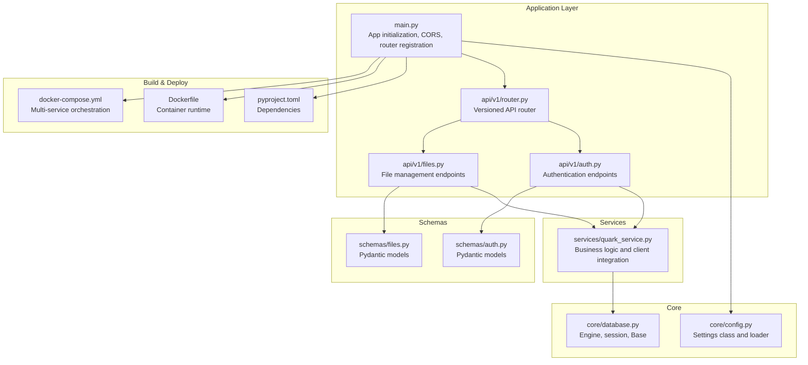
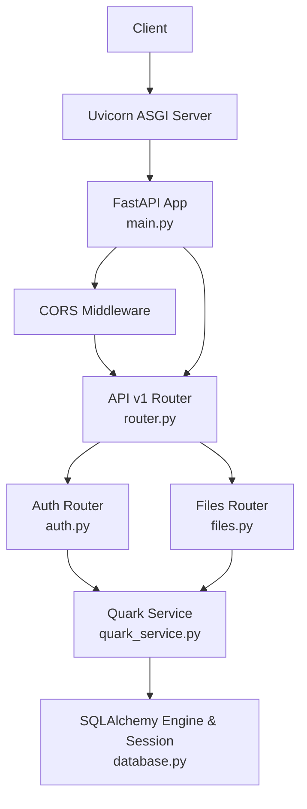
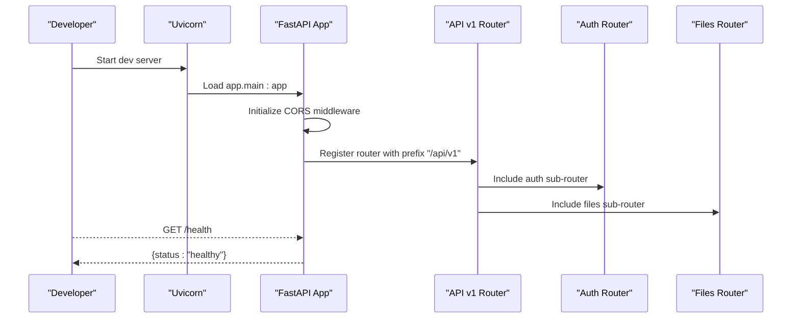
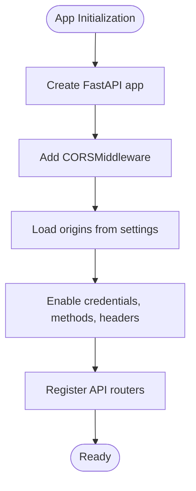
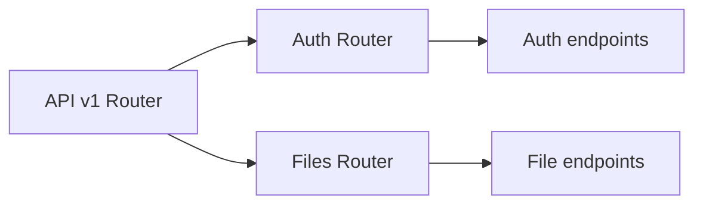
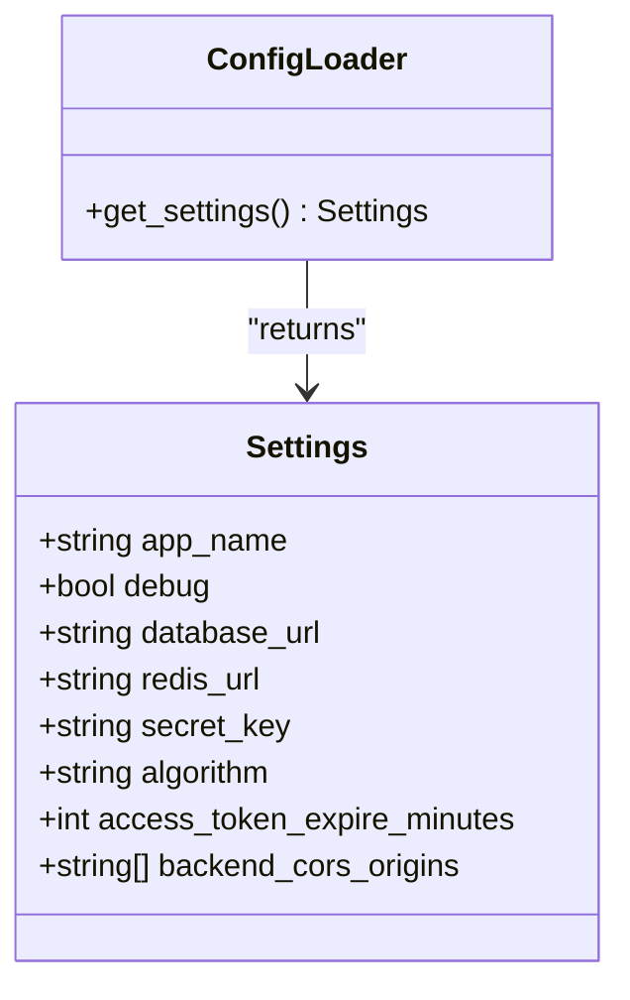
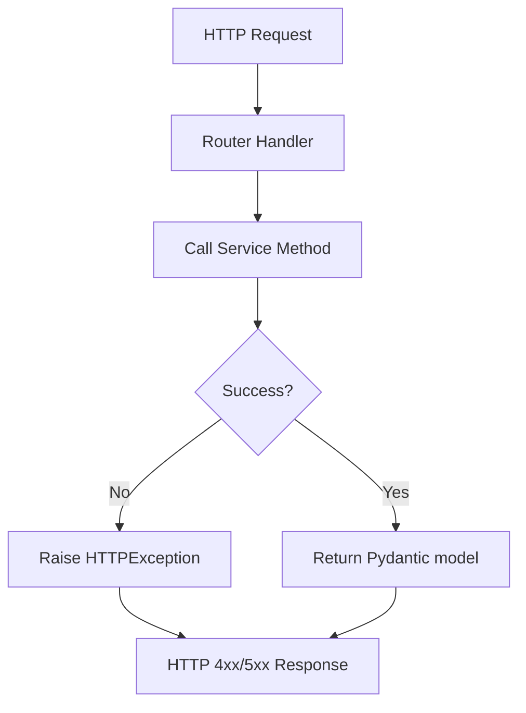
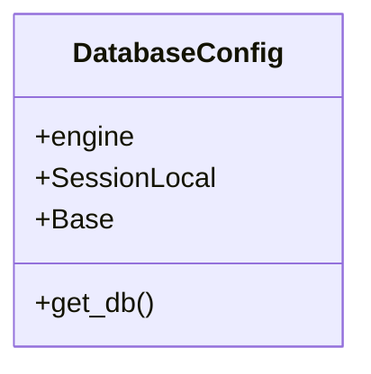
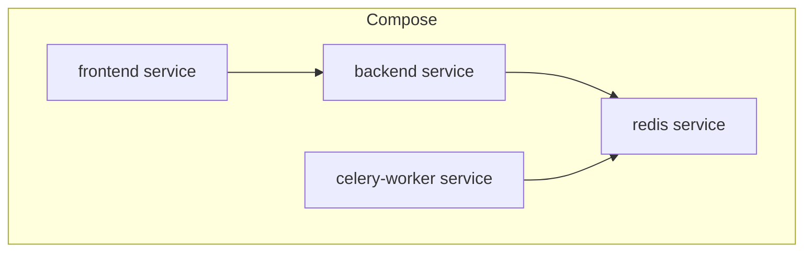
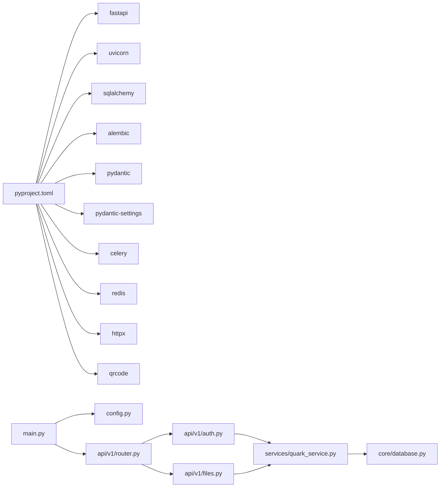

# FastAPI Application Structure

<cite>
**Referenced Files in This Document**
- [main.py](file://backend/app/main.py)
- [config.py](file://backend/app/core/config.py)
- [router.py](file://backend/app/api/v1/router.py)
- [auth.py](file://backend/app/api/v1/auth.py)
- [files.py](file://backend/app/api/v1/files.py)
- [database.py](file://backend/app/core/database.py)
- [quark_service.py](file://backend/app/services/quark_service.py)
- [auth.py](file://backend/app/schemas/auth.py)
- [files.py](file://backend/app/schemas/files.py)
- [pyproject.toml](file://backend/pyproject.toml)
- [Dockerfile](file://backend/Dockerfile)
- [docker-compose.yml](file://docker-compose.yml)
</cite>

## Table of Contents
1. [Introduction](#introduction)
2. [Project Structure](#project-structure)
3. [Core Components](#core-components)
4. [Architecture Overview](#architecture-overview)
5. [Detailed Component Analysis](#detailed-component-analysis)
6. [Dependency Analysis](#dependency-analysis)
7. [Performance Considerations](#performance-considerations)
8. [Troubleshooting Guide](#troubleshooting-guide)
9. [Conclusion](#conclusion)
10. [Appendices](#appendices)

## Introduction
This document explains the FastAPI application structure for the backend service, focusing on application initialization, middleware configuration (especially CORS), router registration patterns, configuration management via environment variables, and development server setup. It also covers health checks, development lifecycle, and practical examples for middleware setup, error handling, and customization. Deployment considerations, performance tuning, and security configurations are included to guide production readiness.

## Project Structure
The backend follows a layered structure:
- Application entrypoint initializes the FastAPI app, loads settings, configures CORS, registers routers, and exposes health endpoints.
- Core configuration encapsulates environment-driven settings and caching.
- API versioning groups routes under a versioned namespace.
- Services encapsulate business logic and integrate with external clients.
- Schemas define request/response models for type safety and validation.
- Database module sets up SQLAlchemy engine and session factory.
- Build and deployment artifacts include pyproject configuration, Dockerfile, and docker-compose for local development.

**Diagram sources**
- [main.py:12-46](file://backend/app/main.py#L12-L46)
- [config.py:5-35](file://backend/app/core/config.py#L5-L35)
- [router.py:1-24](file://backend/app/api/v1/router.py#L1-L24)
- [auth.py:1-107](file://backend/app/api/v1/auth.py#L1-L107)
- [files.py:1-150](file://backend/app/api/v1/files.py#L1-L150)
- [database.py:1-29](file://backend/app/core/database.py#L1-L29)
- [quark_service.py:1-377](file://backend/app/services/quark_service.py#L1-L377)
- [auth.py:1-50](file://backend/app/schemas/auth.py#L1-L50)
- [files.py:1-54](file://backend/app/schemas/files.py#L1-L54)
- [pyproject.toml:1-32](file://backend/pyproject.toml#L1-L32)
- [Dockerfile:1-15](file://backend/Dockerfile#L1-L15)
- [docker-compose.yml:1-65](file://docker-compose.yml#L1-L65)

**Section sources**
- [main.py:1-46](file://backend/app/main.py#L1-L46)
- [config.py:1-35](file://backend/app/core/config.py#L1-L35)
- [router.py:1-24](file://backend/app/api/v1/router.py#L1-L24)
- [auth.py:1-107](file://backend/app/api/v1/auth.py#L1-L107)
- [files.py:1-150](file://backend/app/api/v1/files.py#L1-L150)
- [database.py:1-29](file://backend/app/core/database.py#L1-L29)
- [quark_service.py:1-377](file://backend/app/services/quark_service.py#L1-L377)
- [auth.py:1-50](file://backend/app/schemas/auth.py#L1-L50)
- [files.py:1-54](file://backend/app/schemas/files.py#L1-L54)
- [pyproject.toml:1-32](file://backend/pyproject.toml#L1-L32)
- [Dockerfile:1-15](file://backend/Dockerfile#L1-L15)
- [docker-compose.yml:1-65](file://docker-compose.yml#L1-L65)

## Core Components
- Application instance creation: The FastAPI app is instantiated with metadata from settings and includes a development health endpoint at the root path.
- CORS middleware: Configured centrally with allow-all methods and headers, credentials enabled, and origins loaded from settings.
- Router registration: The versioned API router aggregates sub-routers for authentication and file management, mounted under a versioned prefix.
- Configuration management: Settings are defined via a typed settings class with defaults and environment loading, cached for performance.
- Health checks: Root and API-level health endpoints provide quick status verification.
- Development server: Uvicorn is used directly in the main module for local development.

Practical examples (paths only):
- Application initialization and CORS: [main.py:12-25](file://backend/app/main.py#L12-L25)
- Router registration: [main.py:27-28](file://backend/app/main.py#L27-L28), [router.py:21-24](file://backend/app/api/v1/router.py#L21-L24)
- Settings class and loader: [config.py:5-35](file://backend/app/core/config.py#L5-L35)
- Health endpoints: [main.py:31-40](file://backend/app/main.py#L31-L40), [router.py:15-18](file://backend/app/api/v1/router.py#L15-L18)
- Development server: [main.py:43-46](file://backend/app/main.py#L43-L46)

**Section sources**
- [main.py:12-46](file://backend/app/main.py#L12-L46)
- [config.py:5-35](file://backend/app/core/config.py#L5-L35)
- [router.py:1-24](file://backend/app/api/v1/router.py#L1-L24)
- [auth.py:1-107](file://backend/app/api/v1/auth.py#L1-L107)
- [files.py:1-150](file://backend/app/api/v1/files.py#L1-L150)

## Architecture Overview
The application follows a clean separation of concerns:
- Entry point initializes the ASGI app, middleware, and routes.
- Versioned API router organizes endpoints by domain (authentication, files).
- Services encapsulate business logic and integrate with external systems.
- Schemas enforce request/response contracts.
- Database module centralizes ORM setup and dependency injection.
- Build and deployment artifacts support containerized development and production.

**Diagram sources**
- [main.py:12-28](file://backend/app/main.py#L12-L28)
- [router.py:1-24](file://backend/app/api/v1/router.py#L1-L24)
- [auth.py:1-107](file://backend/app/api/v1/auth.py#L1-L107)
- [files.py:1-150](file://backend/app/api/v1/files.py#L1-L150)
- [quark_service.py:23-377](file://backend/app/services/quark_service.py#L23-L377)
- [database.py:1-29](file://backend/app/core/database.py#L1-L29)

## Detailed Component Analysis

### Application Initialization and Lifecycle
- Instance creation: The app is configured with application metadata and mounted under a versioned prefix.
- Startup procedures: The current implementation does not define startup/shutdown event handlers; initialization is straightforward.
- Health checks: Two health endpoints exist—one at the root and one under the API v1 namespace—to confirm service availability.
- Development server: Uvicorn runs the app with hot reload enabled for rapid iteration.

**Diagram sources**
- [main.py:12-28](file://backend/app/main.py#L12-L28)
- [router.py:21-24](file://backend/app/api/v1/router.py#L21-L24)
- [auth.py:1-107](file://backend/app/api/v1/auth.py#L1-L107)
- [files.py:1-150](file://backend/app/api/v1/files.py#L1-L150)

**Section sources**
- [main.py:12-46](file://backend/app/main.py#L12-L46)
- [router.py:15-18](file://backend/app/api/v1/router.py#L15-L18)

### Middleware Configuration (CORS)
- Middleware type: CORSMiddleware.
- Origins: Loaded from settings for flexible origin configuration.
- Credentials, methods, and headers: Enabled broadly for development convenience.
- Placement: Added immediately after app instantiation and before router registration.

**Diagram sources**
- [main.py:18-25](file://backend/app/main.py#L18-L25)
- [config.py:21-25](file://backend/app/core/config.py#L21-L25)

**Section sources**
- [main.py:18-25](file://backend/app/main.py#L18-L25)
- [config.py:21-25](file://backend/app/core/config.py#L21-L25)

### Router Registration Patterns
- Versioned router: A dedicated router aggregates sub-routers and exposes a versioned base path.
- Sub-router composition: Authentication and file management routers are included into the versioned router.
- Endpoint tagging: Routers use tags for grouping and documentation clarity.

**Diagram sources**
- [router.py:1-24](file://backend/app/api/v1/router.py#L1-L24)
- [auth.py:1-107](file://backend/app/api/v1/auth.py#L1-L107)
- [files.py:1-150](file://backend/app/api/v1/files.py#L1-L150)

**Section sources**
- [router.py:1-24](file://backend/app/api/v1/router.py#L1-L24)
- [auth.py:1-107](file://backend/app/api/v1/auth.py#L1-L107)
- [files.py:1-150](file://backend/app/api/v1/files.py#L1-L150)

### Configuration Management System
- Settings class: Centralized configuration with defaults for application name, debug mode, database URL, Redis URL, JWT-related keys, and CORS origins.
- Environment loading: Uses a settings loader with caching to avoid repeated parsing.
- Access pattern: Settings are retrieved once and passed to the app constructor and middleware configuration.

**Diagram sources**
- [config.py:5-35](file://backend/app/core/config.py#L5-L35)

**Section sources**
- [config.py:5-35](file://backend/app/core/config.py#L5-L35)

### Error Handling Patterns
- HTTP exceptions: Routers raise HTTPException with appropriate status codes and messages when upstream operations fail.
- Service-level error wrapping: Business logic returns structured dictionaries with success flags and messages; routers translate failures into HTTP exceptions.
- Graceful degradation: Service methods handle missing client libraries by returning mock data or failure messages.

**Diagram sources**
- [auth.py:27-28](file://backend/app/api/v1/auth.py#L27-L28)
- [files.py:28-29](file://backend/app/api/v1/files.py#L28-L29)
- [quark_service.py:79-83](file://backend/app/services/quark_service.py#L79-L83)

**Section sources**
- [auth.py:27-28](file://backend/app/api/v1/auth.py#L27-L28)
- [files.py:28-29](file://backend/app/api/v1/files.py#L28-L29)
- [quark_service.py:79-83](file://backend/app/services/quark_service.py#L79-L83)

### Application Customization Options
- Metadata customization: Title, description, and version are set from settings.
- CORS customization: Origins, methods, and headers are configurable via settings.
- Router customization: New endpoints can be added to existing sub-routers or new sub-routers can be introduced under the versioned router.

Paths for customization:
- App metadata and CORS: [main.py:12-25](file://backend/app/main.py#L12-L25)
- Settings defaults: [config.py:7-25](file://backend/app/core/config.py#L7-L25)
- Router composition: [router.py:21-24](file://backend/app/api/v1/router.py#L21-L24)

**Section sources**
- [main.py:12-25](file://backend/app/main.py#L12-L25)
- [config.py:7-25](file://backend/app/core/config.py#L7-L25)
- [router.py:21-24](file://backend/app/api/v1/router.py#L21-L24)

### Database Integration
- Engine creation: Built from settings with platform-specific connection arguments.
- Session factory: Provides dependency injection for database sessions.
- Base model: Declarative base for ORM models.

**Diagram sources**
- [database.py:9-29](file://backend/app/core/database.py#L9-L29)

**Section sources**
- [database.py:9-29](file://backend/app/core/database.py#L9-L29)

### Deployment Considerations
- Containerization: Python slim image, installed dependencies from requirements, exposed port, and CMD using Uvicorn.
- Orchestration: docker-compose defines services for backend, frontend, Redis, and Celery worker, wiring environment variables and shared volumes.
- Production readiness: Consider disabling debug mode, tightening CORS origins, enabling HTTPS, and adding health probes.

**Diagram sources**
- [Dockerfile:1-15](file://backend/Dockerfile#L1-L15)
- [docker-compose.yml:4-65](file://docker-compose.yml#L4-L65)

**Section sources**
- [Dockerfile:1-15](file://backend/Dockerfile#L1-L15)
- [docker-compose.yml:4-65](file://docker-compose.yml#L4-L65)

## Dependency Analysis
- External dependencies are declared in pyproject, including FastAPI, Uvicorn, SQLAlchemy, Alembic, Pydantic, Pydantic Settings, Celery, Redis, httpx, qrcode, and development tools.
- Internal dependencies: main imports settings and the v1 router; v1 router imports sub-routers; sub-routers depend on schemas and services; services depend on the database layer.

**Diagram sources**
- [pyproject.toml:13-27](file://backend/pyproject.toml#L13-L27)
- [main.py:4-5](file://backend/app/main.py#L4-L5)
- [router.py:3-4](file://backend/app/api/v1/router.py#L3-L4)
- [auth.py:13-13](file://backend/app/api/v1/auth.py#L13-L13)
- [files.py:14-14](file://backend/app/api/v1/files.py#L14-L14)
- [quark_service.py:11-20](file://backend/app/services/quark_service.py#L11-L20)
- [database.py:1-3](file://backend/app/core/database.py#L1-L3)

**Section sources**
- [pyproject.toml:13-27](file://backend/pyproject.toml#L13-L27)
- [main.py:4-5](file://backend/app/main.py#L4-L5)
- [router.py:3-4](file://backend/app/api/v1/router.py#L3-L4)
- [auth.py:13-13](file://backend/app/api/v1/auth.py#L13-L13)
- [files.py:14-14](file://backend/app/api/v1/files.py#L14-L14)
- [quark_service.py:11-20](file://backend/app/services/quark_service.py#L11-L20)
- [database.py:1-3](file://backend/app/core/database.py#L1-L3)

## Performance Considerations
- Middleware overhead: Broad CORS configuration simplifies development but should be narrowed in production.
- Database connections: Ensure connection pooling and session lifecycle are managed efficiently; consider async alternatives for high concurrency.
- Static assets and routing: Keep route handlers lean; delegate heavy work to services or background tasks.
- Caching: Use Redis for caching frequently accessed data or tokens.
- Logging: Integrate structured logging to monitor latency and errors without impacting request throughput.

[No sources needed since this section provides general guidance]

## Troubleshooting Guide
- Health checks: Verify both root and API health endpoints return expected status.
- CORS errors: Confirm origins in settings match the frontend origin; avoid wildcard origins in production.
- Database connectivity: Validate database URL and permissions; ensure migrations are applied.
- Service client availability: If the external client library is unavailable, service methods fall back to mock responses; confirm logs for warnings.
- Development server: Ensure Uvicorn reload is enabled locally; for production, use a process manager or ASGI server directly.

**Section sources**
- [main.py:31-40](file://backend/app/main.py#L31-L40)
- [router.py:15-18](file://backend/app/api/v1/router.py#L15-L18)
- [config.py:21-25](file://backend/app/core/config.py#L21-L25)
- [database.py:10-13](file://backend/app/core/database.py#L10-L13)
- [quark_service.py:11-20](file://backend/app/services/quark_service.py#L11-L20)

## Conclusion
The FastAPI backend is structured for clarity and extensibility: a centralized settings system, versioned routers, modular services, and robust schema validation. CORS is configured centrally for simplicity during development, while health endpoints and a development server streamline the workflow. For production, tighten CORS, enable secure transport, and adopt monitoring and caching strategies to improve reliability and performance.

[No sources needed since this section summarizes without analyzing specific files]

## Appendices

### Practical Examples Index
- Application initialization and CORS: [main.py:12-25](file://backend/app/main.py#L12-L25)
- Router registration pattern: [router.py:21-24](file://backend/app/api/v1/router.py#L21-L24)
- Settings class and loader: [config.py:5-35](file://backend/app/core/config.py#L5-L35)
- Health endpoints: [main.py:31-40](file://backend/app/main.py#L31-L40), [router.py:15-18](file://backend/app/api/v1/router.py#L15-L18)
- Development server: [main.py:43-46](file://backend/app/main.py#L43-L46)
- Error handling in routers: [auth.py:27-28](file://backend/app/api/v1/auth.py#L27-L28), [files.py:28-29](file://backend/app/api/v1/files.py#L28-L29)
- Service error handling: [quark_service.py:79-83](file://backend/app/services/quark_service.py#L79-L83)

**Section sources**
- [main.py:12-46](file://backend/app/main.py#L12-L46)
- [router.py:15-24](file://backend/app/api/v1/router.py#L15-L24)
- [config.py:5-35](file://backend/app/core/config.py#L5-L35)
- [auth.py:27-28](file://backend/app/api/v1/auth.py#L27-L28)
- [files.py:28-29](file://backend/app/api/v1/files.py#L28-L29)
- [quark_service.py:79-83](file://backend/app/services/quark_service.py#L79-L83)