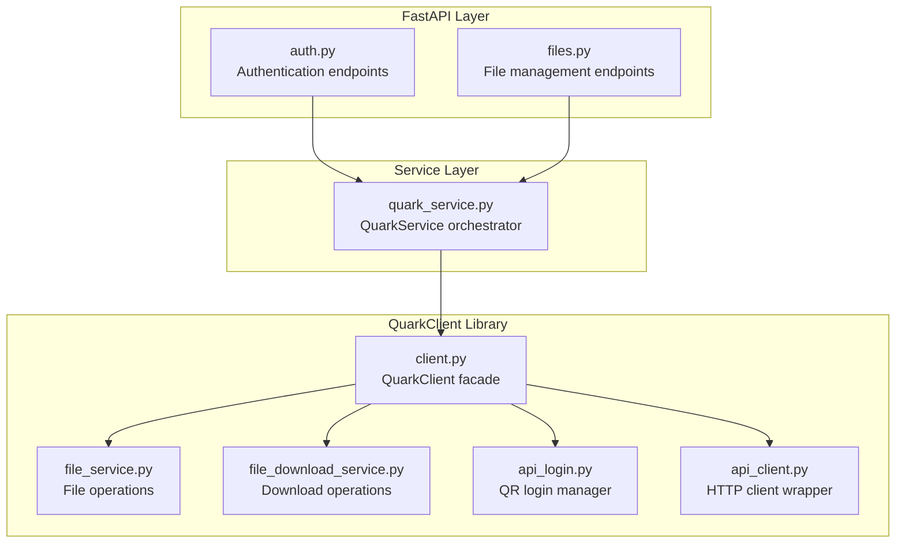
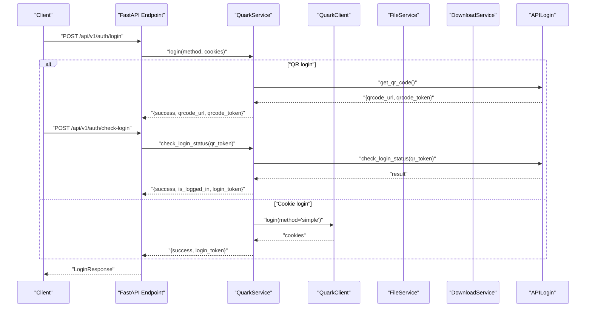
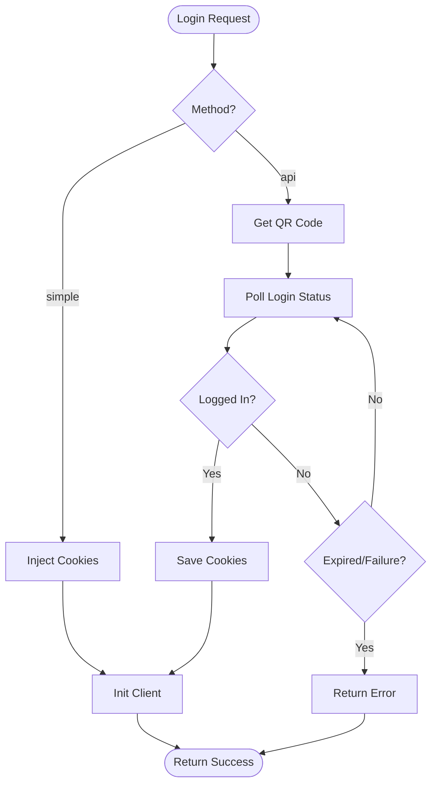
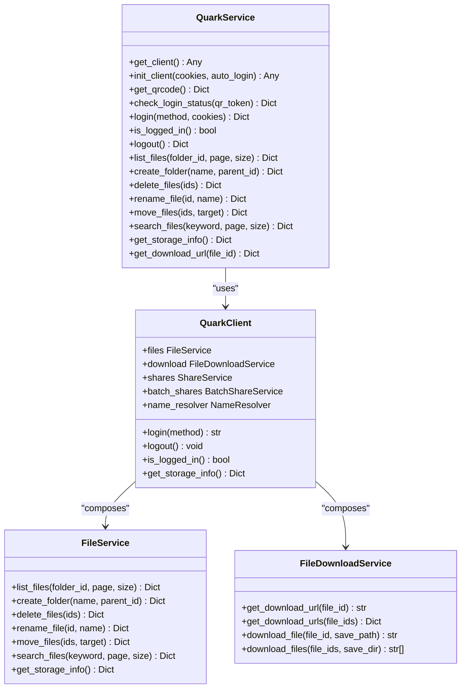
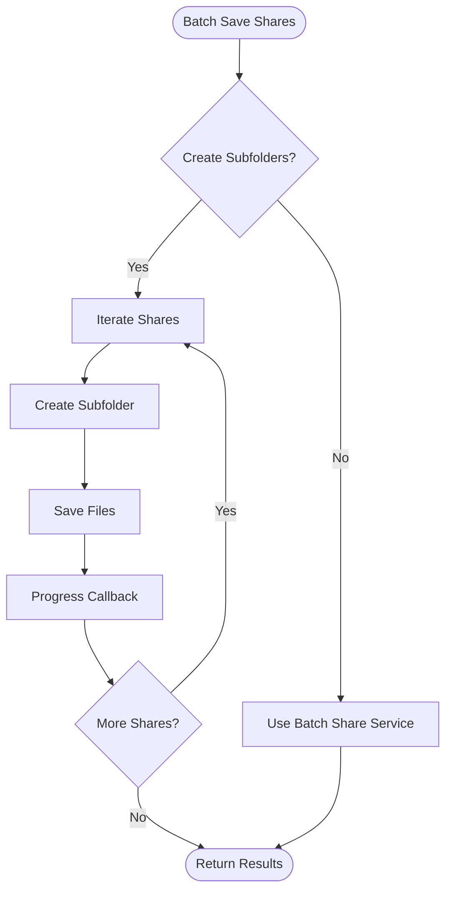
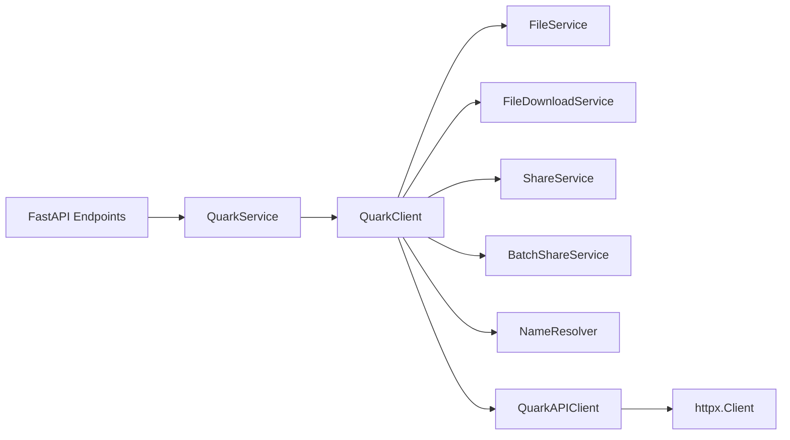

# Service Layer Implementation

<cite>
**Referenced Files in This Document**
- [quark_service.py](file://backend/app/services/quark_service.py)
- [auth.py](file://backend/app/api/v1/auth.py)
- [files.py](file://backend/app/api/v1/files.py)
- [client.py](file://quark_client/client.py)
- [api_login.py](file://quark_client/auth/api_login.py)
- [file_service.py](file://quark_client/services/file_service.py)
- [api_client.py](file://quark_client/core/api_client.py)
- [file_download_service.py](file://quark_client/services/file_download_service.py)
- [auth.py](file://backend/app/schemas/auth.py)
- [files.py](file://backend/app/schemas/files.py)
- [main.py](file://backend/app/main.py)
- [router.py](file://backend/app/api/v1/router.py)
- [config.py](file://backend/app/core/config.py)
</cite>

## Table of Contents
1. [Introduction](#introduction)
2. [Project Structure](#project-structure)
3. [Core Components](#core-components)
4. [Architecture Overview](#architecture-overview)
5. [Detailed Component Analysis](#detailed-component-analysis)
6. [Dependency Analysis](#dependency-analysis)
7. [Performance Considerations](#performance-considerations)
8. [Troubleshooting Guide](#troubleshooting-guide)
9. [Conclusion](#conclusion)
10. [Appendices](#appendices)

## Introduction
This document explains the service layer implementation that encapsulates business logic and integrates with the QuarkClient library. It covers authentication workflows, file management operations, and share processing patterns. The service layer sits between FastAPI endpoints and the QuarkClient, providing:
- Dependency injection and composition
- Parameter validation using Pydantic schemas
- Response transformation and error handling
- Transaction-like patterns for multi-step operations
- Extension points and integration patterns

## Project Structure
The service layer is organized around:
- FastAPI routers exposing endpoints under `/api/v1`
- Pydantic schemas validating request/response payloads
- A central service class orchestrating QuarkClient operations
- QuarkClient providing typed services for authentication, file operations, and downloads

**Diagram sources**
- [auth.py:1-107](file://backend/app/api/v1/auth.py#L1-L107)
- [files.py:1-150](file://backend/app/api/v1/files.py#L1-L150)
- [quark_service.py:1-388](file://backend/app/services/quark_service.py#L1-L388)
- [client.py:1-405](file://quark_client/client.py#L1-L405)
- [file_service.py:1-800](file://quark_client/services/file_service.py#L1-L800)
- [file_download_service.py:1-301](file://quark_client/services/file_download_service.py#L1-L301)
- [api_login.py:1-521](file://quark_client/auth/api_login.py#L1-L521)
- [api_client.py:1-209](file://quark_client/core/api_client.py#L1-L209)

**Section sources**
- [main.py:1-46](file://backend/app/main.py#L1-L46)
- [router.py:1-24](file://backend/app/api/v1/router.py#L1-L24)

## Core Components
- QuarkService: Central service orchestrating QuarkClient initialization, authentication, and file operations. It maintains singleton semantics, manages login state, and exposes convenience methods for file operations.
- FastAPI endpoints: Thin controllers validating requests via Pydantic schemas and delegating to QuarkService.
- QuarkClient: High-level facade around QuarkClient services (file, download, share, etc.), initialized with an HTTP client and authentication manager.
- QuarkClient services: Typed services for file listing, moving, renaming, searching, and downloading.

Key responsibilities:
- Validation: Pydantic models define strict request/response contracts.
- Transformation: Service methods normalize QuarkClient responses into consistent dictionaries with success/message fields.
- Error handling: Exceptions are caught and mapped to structured error responses.
- Composition: Services depend on QuarkClient services, which depend on the HTTP client.

**Section sources**
- [quark_service.py:23-388](file://backend/app/services/quark_service.py#L23-L388)
- [auth.py:1-107](file://backend/app/api/v1/auth.py#L1-L107)
- [files.py:1-150](file://backend/app/api/v1/files.py#L1-L150)
- [client.py:18-405](file://quark_client/client.py#L18-L405)
- [file_service.py:13-800](file://quark_client/services/file_service.py#L13-L800)

## Architecture Overview
The service layer follows a layered architecture:
- API layer: FastAPI endpoints with Pydantic validation
- Service layer: QuarkService coordinating business logic
- Domain layer: QuarkClient and its services
- Infrastructure: HTTP client and authentication utilities

**Diagram sources**
- [auth.py:55-75](file://backend/app/api/v1/auth.py#L55-L75)
- [quark_service.py:161-197](file://backend/app/services/quark_service.py#L161-L197)
- [api_login.py:467-506](file://quark_client/auth/api_login.py#L467-L506)

## Detailed Component Analysis

### Authentication Service Workflow
The authentication service implements QR-based and cookie-based login flows:
- QR login: Obtain QR token and URL, then poll for login status until success or failure.
- Cookie login: Inject cookies into the QuarkClient session.
- Status checks: Determine logged-in state and fetch user storage info.

**Diagram sources**
- [quark_service.py:54-197](file://backend/app/services/quark_service.py#L54-L197)
- [api_login.py:94-406](file://quark_client/auth/api_login.py#L94-L406)

**Section sources**
- [auth.py:18-107](file://backend/app/api/v1/auth.py#L18-L107)
- [auth.py:5-50](file://backend/app/schemas/auth.py#L5-L50)
- [quark_service.py:48-197](file://backend/app/services/quark_service.py#L48-L197)

### File Management Operations
The service layer exposes CRUD and search operations:
- List files with pagination and sorting
- Create, delete, rename, and move files
- Search files with optional advanced filtering
- Get storage info and download URLs

**Diagram sources**
- [quark_service.py:23-388](file://backend/app/services/quark_service.py#L23-L388)
- [client.py:18-405](file://quark_client/client.py#L18-L405)
- [file_service.py:13-800](file://quark_client/services/file_service.py#L13-L800)
- [file_download_service.py:13-301](file://quark_client/services/file_download_service.py#L13-L301)

**Section sources**
- [files.py:19-150](file://backend/app/api/v1/files.py#L19-L150)
- [files.py:5-54](file://backend/app/schemas/files.py#L5-L54)
- [quark_service.py:225-384](file://backend/app/services/quark_service.py#L225-L384)

### Share Processing Workflows
QuarkClient supports batch share saving with two modes:
- Subfolder mode: Creates a subfolder per share and saves files into it.
- Batch mode: Uses the batch share service to process multiple shares efficiently.

**Diagram sources**
- [client.py:170-236](file://quark_client/client.py#L170-L236)

**Section sources**
- [client.py:170-236](file://quark_client/client.py#L170-L236)

### Data Validation Using Pydantic Schemas
Pydantic models define strict request/response contracts:
- Authentication: LoginRequest/LoginResponse, QRCodeResponse, CheckLoginRequest/Response, AuthStatusResponse, LogoutResponse
- File operations: FileListRequest/FileListResponse, CreateFolderRequest, DeleteFilesRequest, RenameFileRequest, MoveFilesRequest, SearchFilesRequest, StorageInfoResponse

Validation occurs automatically in FastAPI endpoints, ensuring:
- Type safety
- Constraint enforcement (e.g., page/size bounds)
- Clear error messages for malformed requests

**Section sources**
- [auth.py:5-50](file://backend/app/schemas/auth.py#L5-L50)
- [files.py:5-54](file://backend/app/schemas/files.py#L5-L54)
- [auth.py:18-107](file://backend/app/api/v1/auth.py#L18-L107)
- [files.py:19-150](file://backend/app/api/v1/files.py#L19-L150)

### Error Handling Strategies
The service layer implements layered error handling:
- API layer: Converts service errors into HTTP exceptions with structured details.
- Service layer: Catches exceptions and returns standardized dictionaries with success=false and message.
- QuarkClient layer: Raises typed exceptions (APIError, AuthenticationError, NetworkError) that are caught and normalized.

Common patterns:
- Import-time fallback: If QuarkClient is unavailable, service returns demo responses.
- Login state checks: Many operations validate login state before proceeding.
- Graceful degradation: Some operations simulate results in demo mode.

**Section sources**
- [quark_service.py:11-21](file://backend/app/services/quark_service.py#L11-L21)
- [quark_service.py:242-247](file://backend/app/services/quark_service.py#L242-L247)
- [api_client.py:146-182](file://quark_client/core/api_client.py#L146-L182)

### Dependency Injection and Service Composition
- Global service instance: A singleton QuarkService instance is exposed for reuse across endpoints.
- FastAPI dependency: Endpoints import the global service instance and delegate to it.
- QuarkClient composition: QuarkClient composes multiple services (FileService, FileDownloadService, ShareService, etc.) and initializes them with a shared HTTP client.

Extension points:
- Add new service methods to QuarkService to expose additional QuarkClient capabilities.
- Introduce middleware or interceptors for cross-cutting concerns (logging, metrics).
- Swap underlying services by injecting alternate implementations during testing.

**Section sources**
- [quark_service.py:386-388](file://backend/app/services/quark_service.py#L386-L388)
- [client.py:18-405](file://quark_client/client.py#L18-L405)

## Dependency Analysis
The service layer exhibits low coupling and high cohesion:
- FastAPI endpoints depend on QuarkService only.
- QuarkService depends on QuarkClient and APILogin.
- QuarkClient depends on typed services and the HTTP client.
- HTTP client encapsulates network concerns and error mapping.

**Diagram sources**
- [auth.py:1-107](file://backend/app/api/v1/auth.py#L1-L107)
- [files.py:1-150](file://backend/app/api/v1/files.py#L1-L150)
- [quark_service.py:1-388](file://backend/app/services/quark_service.py#L1-L388)
- [client.py:18-405](file://quark_client/client.py#L18-L405)
- [api_client.py:16-209](file://quark_client/core/api_client.py#L16-L209)

**Section sources**
- [router.py:22-24](file://backend/app/api/v1/router.py#L22-L24)
- [main.py:28-28](file://backend/app/main.py#L28-L28)

## Performance Considerations
- Pagination and limits: Enforce page/size constraints in endpoints to prevent heavy loads.
- Asynchronous operations: For long-running tasks (e.g., batch share saving), consider background tasks and polling.
- Caching: Cache frequently accessed metadata (e.g., storage info) with TTL.
- Download strategies: The download service attempts multiple methods to handle anti-bot protections gracefully.
- Logging: Use structured logs to track slow operations and error rates.

[No sources needed since this section provides general guidance]

## Troubleshooting Guide
Common issues and resolutions:
- Authentication failures: Verify QR token validity and network connectivity. Check APILogin timeouts and service tickets.
- Login state inconsistencies: Ensure cookies are persisted and re-initialized when needed.
- API errors: Inspect HTTP status codes and API response messages; handle 401/403 specifically.
- Network timeouts: Increase timeouts or retry with backoff for transient failures.
- Download failures: The download service handles 403 intentionally; try alternative methods or adjust headers.

**Section sources**
- [api_client.py:146-182](file://quark_client/core/api_client.py#L146-L182)
- [api_login.py:347-406](file://quark_client/auth/api_login.py#L347-L406)
- [file_download_service.py:188-257](file://quark_client/services/file_download_service.py#L188-L257)

## Conclusion
The service layer cleanly separates business logic from API concerns and external library integrations. It leverages Pydantic for validation, QuarkClient for robust operations, and structured error handling for reliability. The architecture supports extension, testing, and performance tuning while maintaining a consistent interface for clients.

[No sources needed since this section summarizes without analyzing specific files]

## Appendices

### API Definitions and Examples
- Authentication endpoints:
  - GET /api/v1/auth/qrcode: Returns QR code URL and token
  - POST /api/v1/auth/check-login: Polls login status
  - POST /api/v1/auth/login: Performs login (QR or cookie)
  - GET /api/v1/auth/status: Checks current login state
  - POST /api/v1/auth/logout: Logs out

- File management endpoints:
  - GET /api/v1/files/list: Lists files with pagination
  - POST /api/v1/files/folder: Creates a folder
  - DELETE /api/v1/files/delete: Deletes files
  - PUT /api/v1/files/rename: Renames a file
  - POST /api/v1/files/move: Moves files
  - GET /api/v1/files/search: Searches files
  - GET /api/v1/files/storage: Gets storage info
  - GET /api/v1/files/download/{file_id}: Gets download URL

**Section sources**
- [auth.py:18-107](file://backend/app/api/v1/auth.py#L18-L107)
- [files.py:19-150](file://backend/app/api/v1/files.py#L19-L150)

### Testing Strategies for Service Methods
- Unit tests: Mock QuarkClient and APILogin to isolate service logic.
- Integration tests: Use demo mode fallbacks to validate end-to-end flows without external dependencies.
- Schema tests: Validate Pydantic model parsing and constraints.
- Error propagation: Ensure HTTP exceptions are raised for service failures.

[No sources needed since this section provides general guidance]