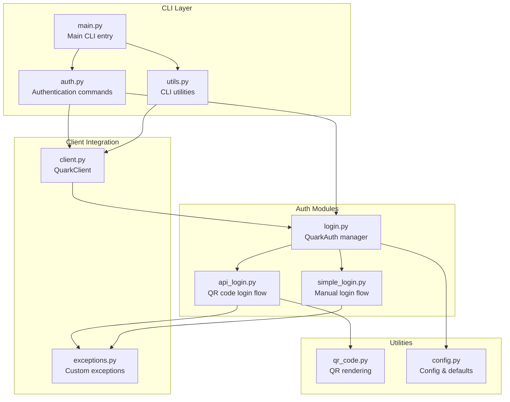
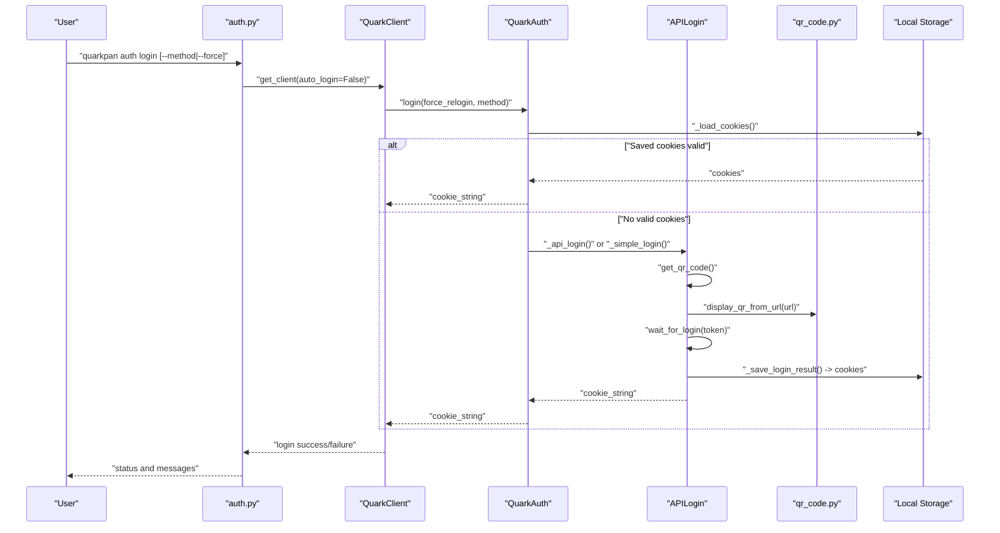
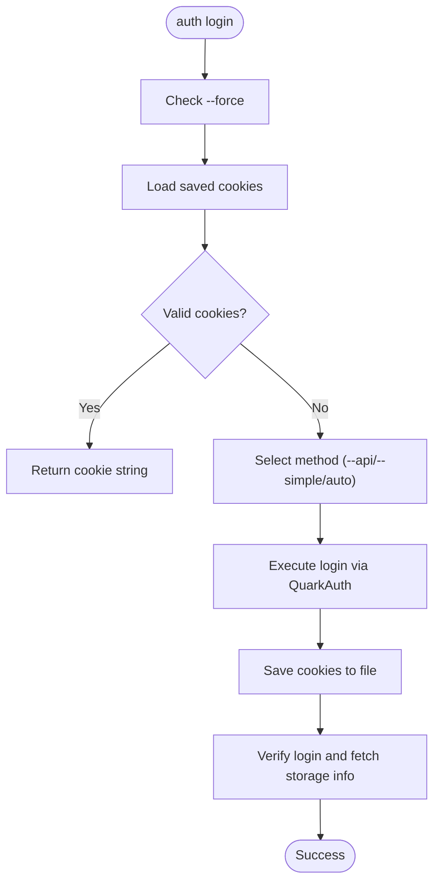
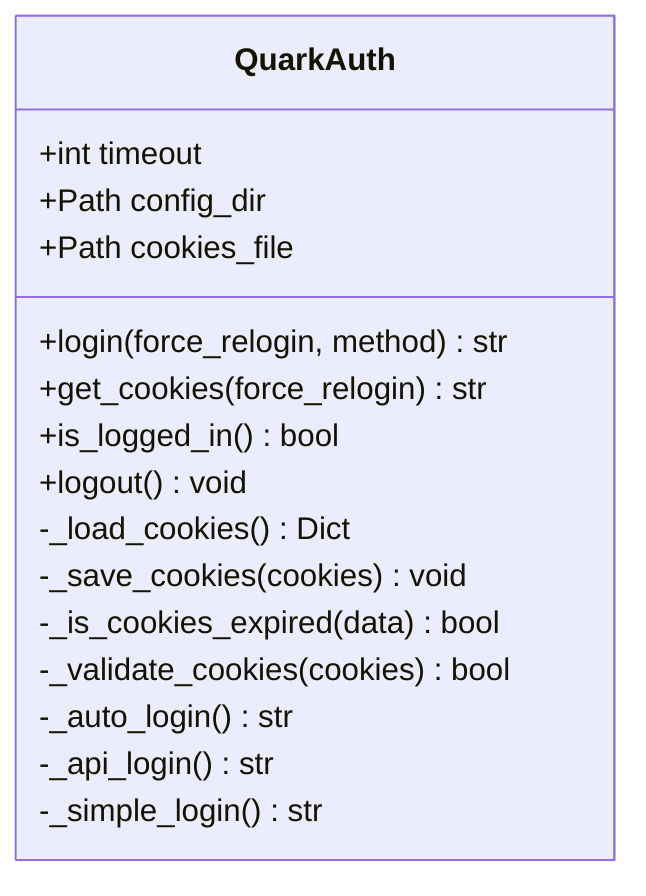
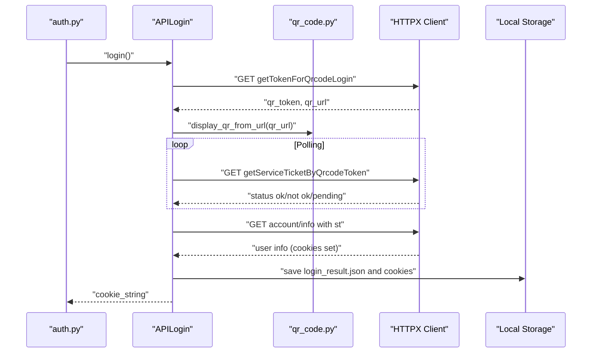
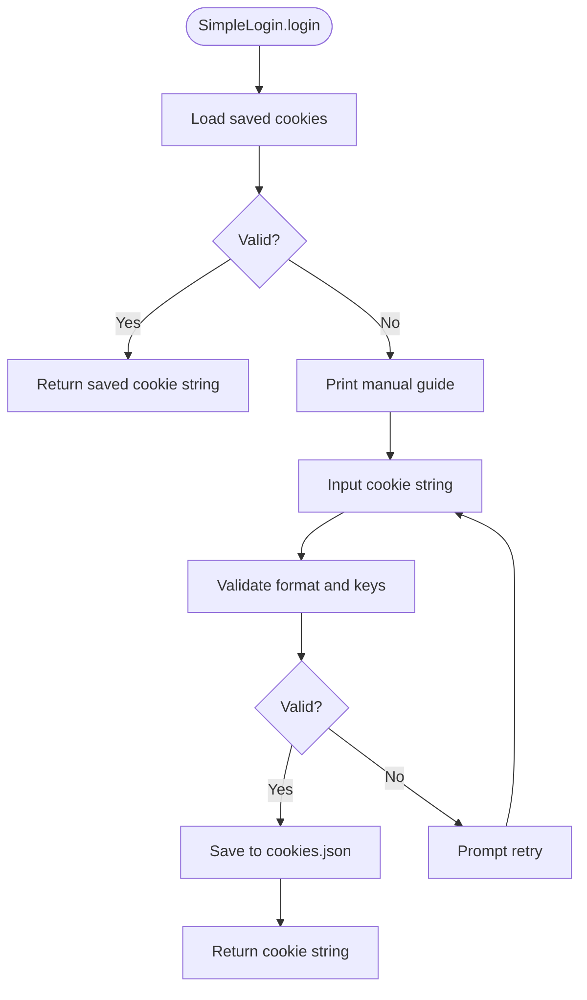
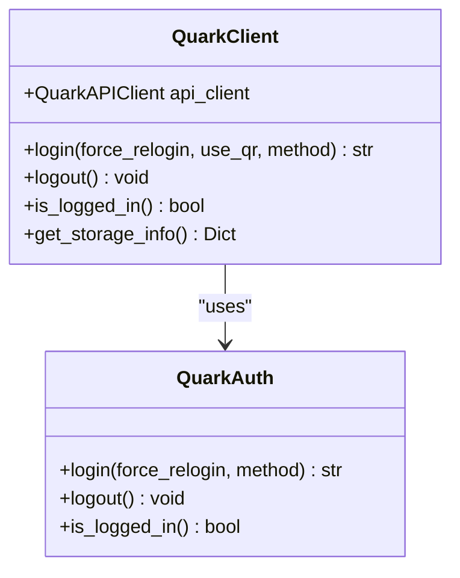
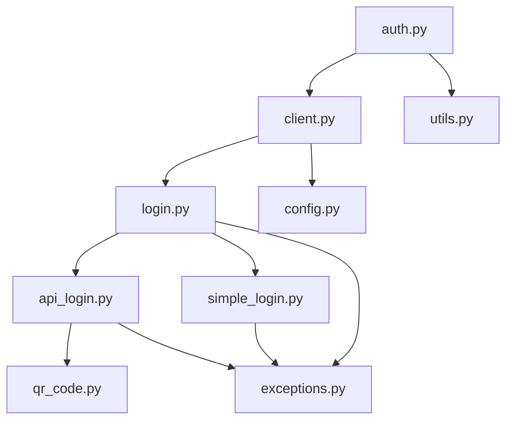

# Authentication Commands

<cite>
**Referenced Files in This Document**
- [auth.py](file://quark_client/cli/commands/auth.py)
- [login.py](file://quark_client/auth/login.py)
- [api_login.py](file://quark_client/auth/api_login.py)
- [simple_login.py](file://quark_client/auth/simple_login.py)
- [qr_code.py](file://quark_client/utils/qr_code.py)
- [main.py](file://quark_client/cli/main.py)
- [client.py](file://quark_client/client.py)
- [config.py](file://quark_client/config.py)
- [exceptions.py](file://quark_client/exceptions.py)
- [utils.py](file://quark_client/cli/utils.py)
</cite>

## Table of Contents
1. [Introduction](#introduction)
2. [Project Structure](#project-structure)
3. [Core Components](#core-components)
4. [Architecture Overview](#architecture-overview)
5. [Detailed Component Analysis](#detailed-component-analysis)
6. [Dependency Analysis](#dependency-analysis)
7. [Performance Considerations](#performance-considerations)
8. [Troubleshooting Guide](#troubleshooting-guide)
9. [Conclusion](#conclusion)

## Introduction
This document provides comprehensive documentation for authentication-related CLI commands in the Quark Pan CLI. It covers the login command with QR code authentication flow, cookie-based login methods, session persistence, logout functionality, and session cleanup. It also explains command syntax, parameter options, authentication timeout handling, error scenarios, practical examples, troubleshooting, and security considerations for automated authentication scripts.

## Project Structure
The authentication functionality is organized across CLI commands, authentication modules, utilities, and client integration:

- CLI commands for authentication are defined under the CLI commands package.
- Authentication logic is encapsulated in dedicated modules for API login, simple login, and cookie management.
- Utilities support QR code rendering and client utilities.
- The client integrates authentication with API operations.

**Diagram sources**
- [auth.py:1-188](file://quark_client/cli/commands/auth.py#L1-L188)
- [login.py:1-301](file://quark_client/auth/login.py#L1-L301)
- [api_login.py:1-521](file://quark_client/auth/api_login.py#L1-L521)
- [simple_login.py:1-249](file://quark_client/auth/simple_login.py#L1-L249)
- [qr_code.py:1-46](file://quark_client/utils/qr_code.py#L1-L46)
- [main.py:1-609](file://quark_client/cli/main.py#L1-L609)
- [client.py:1-405](file://quark_client/client.py#L1-L405)
- [config.py:1-63](file://quark_client/config.py#L1-L63)
- [exceptions.py:1-50](file://quark_client/exceptions.py#L1-L50)
- [utils.py:1-273](file://quark_client/cli/utils.py#L1-L273)

**Section sources**
- [auth.py:1-188](file://quark_client/cli/commands/auth.py#L1-L188)
- [main.py:1-609](file://quark_client/cli/main.py#L1-L609)

## Core Components
- CLI authentication commands: login, logout, status, info.
- Authentication managers: QuarkAuth for cookie management and login orchestration, APILogin for QR-based login, SimpleLogin for manual login.
- Client integration: QuarkClient wraps authentication and API operations.
- Utilities: QR code rendering and CLI helpers.

Key responsibilities:
- Login command orchestrates method selection and displays feedback.
- QuarkAuth manages cookie persistence and validation.
- APILogin handles QR generation, status polling, and token management.
- SimpleLogin provides manual cookie input and validation.
- Logout clears stored credentials.
- Status checks login state and storage usage.

**Section sources**
- [auth.py:13-188](file://quark_client/cli/commands/auth.py#L13-L188)
- [login.py:15-301](file://quark_client/auth/login.py#L15-L301)
- [api_login.py:20-521](file://quark_client/auth/api_login.py#L20-L521)
- [simple_login.py:16-249](file://quark_client/auth/simple_login.py#L16-L249)
- [client.py:18-405](file://quark_client/client.py#L18-L405)

## Architecture Overview
The authentication flow integrates CLI commands, authentication managers, and client utilities. The CLI commands delegate to QuarkClient, which coordinates QuarkAuth. Depending on the selected method, QuarkAuth invokes APILogin (QR-based) or SimpleLogin (manual). Cookies are persisted locally and reused until expiration.

**Diagram sources**
- [auth.py:13-92](file://quark_client/cli/commands/auth.py#L13-L92)
- [client.py:50-74](file://quark_client/client.py#L50-L74)
- [login.py:107-259](file://quark_client/auth/login.py#L107-L259)
- [api_login.py:467-521](file://quark_client/auth/api_login.py#L467-L521)
- [qr_code.py:40-46](file://quark_client/utils/qr_code.py#L40-L46)

## Detailed Component Analysis

### CLI Authentication Commands
- Command group: auth_app with subcommands login, logout, status, info.
- Options:
  - login: --force/-f, --method/-m, --api, --simple.
  - logout: no options.
  - status: no options.
  - info: no options.
- Behavior:
  - login: checks existing session, selects method, executes login, validates and prints account info.
  - logout: checks login state, performs logout, clears local cookies.
  - status: checks login state, prints storage usage.
  - info: prints help and examples.

**Diagram sources**
- [auth.py:13-92](file://quark_client/cli/commands/auth.py#L13-L92)
- [login.py:107-259](file://quark_client/auth/login.py#L107-L259)

**Section sources**
- [auth.py:13-188](file://quark_client/cli/commands/auth.py#L13-L188)

### QuarkAuth Manager
Responsibilities:
- Cookie persistence: save/load cookies to JSON file with timestamps and expiry.
- Validation: check cookie presence and required keys (__pus, __kps, __uid).
- Login orchestration: auto, API, or simple login methods.
- Logout: remove stored cookies.

Key methods:
- login(force_relogin, method): orchestrates login flow.
- get_cookies(force_relogin): returns valid cookie string.
- is_logged_in(): checks validity.
- logout(): clears stored cookies.

**Diagram sources**
- [login.py:15-301](file://quark_client/auth/login.py#L15-L301)

**Section sources**
- [login.py:15-301](file://quark_client/auth/login.py#L15-L301)

### API Login (QR Code Flow)
- QR generation: calls external API to obtain token and constructs QR URL.
- QR display: renders ASCII QR code in terminal or prints URL fallback.
- Status polling: periodically checks service ticket status with exponential-like intervals.
- Timeout handling: configurable timeout with countdown display.
- Token management: extracts cookies after successful login and saves them.

**Diagram sources**
- [api_login.py:94-521](file://quark_client/auth/api_login.py#L94-L521)
- [qr_code.py:40-46](file://quark_client/utils/qr_code.py#L40-L46)

**Section sources**
- [api_login.py:20-521](file://quark_client/auth/api_login.py#L20-L521)
- [qr_code.py:1-46](file://quark_client/utils/qr_code.py#L1-L46)

### Simple Login (Manual Flow)
- Manual guidance: prints step-by-step instructions to obtain cookies from browser developer tools.
- Input validation: ensures required cookie keys are present.
- Persistence: saves cookie data to JSON file with timestamp.
- Reuse: loads saved cookies if not expired.

**Diagram sources**
- [simple_login.py:28-249](file://quark_client/auth/simple_login.py#L28-L249)

**Section sources**
- [simple_login.py:16-249](file://quark_client/auth/simple_login.py#L16-L249)

### Client Integration
- QuarkClient delegates authentication to QuarkAuth and updates API client cookies.
- Methods: login, logout, is_logged_in, get_storage_info.
- Integration with CLI utilities for status reporting.

**Diagram sources**
- [client.py:18-405](file://quark_client/client.py#L18-L405)
- [login.py:15-301](file://quark_client/auth/login.py#L15-L301)

**Section sources**
- [client.py:18-405](file://quark_client/client.py#L18-L405)

## Dependency Analysis
- CLI commands depend on QuarkClient and CLI utilities.
- QuarkAuth depends on configuration directory and exceptions.
- APILogin depends on HTTPX client, QR utilities, and exceptions.
- SimpleLogin depends on configuration directory and exceptions.
- Client depends on QuarkAuth and API client.

**Diagram sources**
- [auth.py:1-188](file://quark_client/cli/commands/auth.py#L1-L188)
- [client.py:1-405](file://quark_client/client.py#L1-L405)
- [login.py:1-301](file://quark_client/auth/login.py#L1-L301)
- [api_login.py:1-521](file://quark_client/auth/api_login.py#L1-L521)
- [simple_login.py:1-249](file://quark_client/auth/simple_login.py#L1-L249)
- [qr_code.py:1-46](file://quark_client/utils/qr_code.py#L1-L46)
- [config.py:1-63](file://quark_client/config.py#L1-L63)
- [exceptions.py:1-50](file://quark_client/exceptions.py#L1-L50)
- [utils.py:1-273](file://quark_client/cli/utils.py#L1-L273)

**Section sources**
- [auth.py:1-188](file://quark_client/cli/commands/auth.py#L1-L188)
- [client.py:1-405](file://quark_client/client.py#L1-L405)
- [login.py:1-301](file://quark_client/auth/login.py#L1-L301)
- [api_login.py:1-521](file://quark_client/auth/api_login.py#L1-L521)
- [simple_login.py:1-249](file://quark_client/auth/simple_login.py#L1-L249)
- [qr_code.py:1-46](file://quark_client/utils/qr_code.py#L1-L46)
- [config.py:1-63](file://quark_client/config.py#L1-L63)
- [exceptions.py:1-50](file://quark_client/exceptions.py#L1-L50)
- [utils.py:1-273](file://quark_client/cli/utils.py#L1-L273)

## Performance Considerations
- QR polling interval: the polling loop checks status every few seconds; adjust timeout to balance responsiveness and network usage.
- Cookie persistence: loading and saving cookies is lightweight; ensure filesystem access is fast.
- Network requests: APILogin uses HTTPX with reasonable timeouts; avoid excessive retries to prevent rate limiting.
- Terminal rendering: QR ASCII rendering is CPU-light; fallback to URL printing reduces overhead.

[No sources needed since this section provides general guidance]

## Troubleshooting Guide
Common issues and resolutions:
- Login fails with invalid credentials or expired cookies:
  - Use --force to force re-login.
  - Try --simple for manual cookie input.
- QR code does not appear or scanning fails:
  - Ensure network connectivity and browser availability.
  - Use fallback URL printed when ASCII QR rendering fails.
- Authentication timeout:
  - Increase timeout setting for APILogin if needed.
  - Re-run login command.
- Session not recognized:
  - Run status to verify login state.
  - Clear cookies via logout and re-login.
- Automated scripts:
  - Prefer --simple with pre-obtained cookies for reliability.
  - Store cookies securely and manage expiry.

**Section sources**
- [auth.py:82-91](file://quark_client/cli/commands/auth.py#L82-L91)
- [api_login.py:347-406](file://quark_client/auth/api_login.py#L347-L406)
- [simple_login.py:28-94](file://quark_client/auth/simple_login.py#L28-L94)

## Conclusion
The authentication subsystem provides robust, user-friendly login options with QR-based and manual flows, persistent cookie management, and clear CLI feedback. The design separates concerns between CLI commands, authentication managers, and utilities, enabling maintainable and extensible authentication workflows. For production automation, prefer manual cookie input and secure storage to minimize reliance on interactive flows.