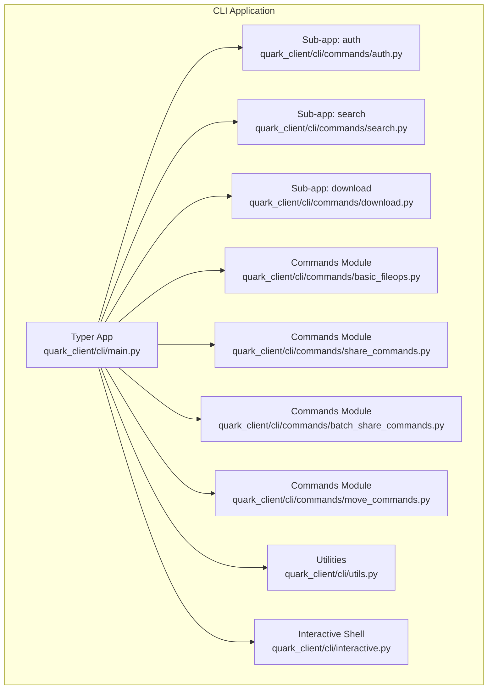
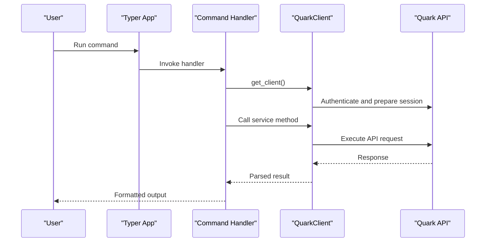
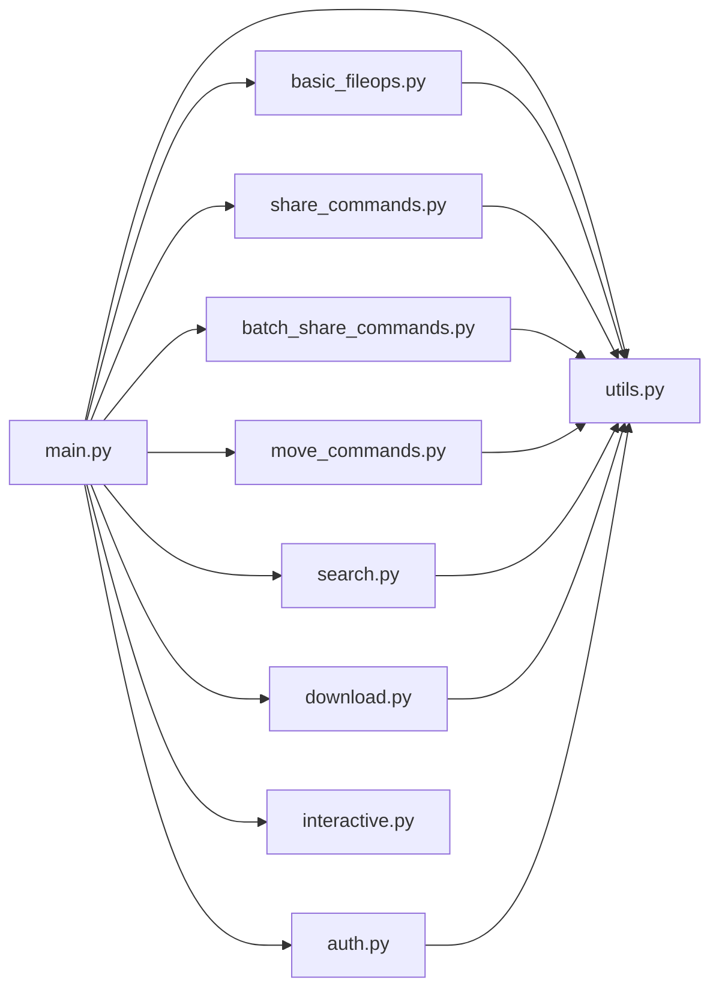

# Available Commands

<cite>
**Referenced Files in This Document**
- [main.py](file://quark_client/cli/main.py)
- [auth.py](file://quark_client/cli/commands/auth.py)
- [basic_fileops.py](file://quark_client/cli/commands/basic_fileops.py)
- [search.py](file://quark_client/cli/commands/search.py)
- [download.py](file://quark_client/cli/commands/download.py)
- [share_commands.py](file://quark_client/cli/commands/share_commands.py)
- [batch_share_commands.py](file://quark_client/cli/commands/batch_share_commands.py)
- [move_commands.py](file://quark_client/cli/commands/move_commands.py)
- [utils.py](file://quark_client/cli/utils.py)
- [interactive.py](file://quark_client/cli/interactive.py)
</cite>

## Table of Contents
1. [Introduction](#introduction)
2. [Project Structure](#project-structure)
3. [Core Components](#core-components)
4. [Architecture Overview](#architecture-overview)
5. [Detailed Component Analysis](#detailed-component-analysis)
6. [Dependency Analysis](#dependency-analysis)
7. [Performance Considerations](#performance-considerations)
8. [Troubleshooting Guide](#troubleshooting-guide)
9. [Conclusion](#conclusion)
10. [Appendices](#appendices)

## Introduction
This document provides comprehensive documentation for all available CLI commands in the QuarkPan CLI. It organizes commands by functional categories, describes syntax, parameters, options, examples, and expected outputs. It also explains command relationships, parameter validation, error handling, and integration with QuarkClient services. Guidance on command chaining, automation, and troubleshooting common execution issues is included.

## Project Structure
The CLI is implemented as a Typer-based application with subcommands and an interactive mode. Commands are grouped into modules by functionality:
- Authentication commands under a dedicated sub-app
- File management commands (create, delete, rename, info, browse, goto, upload)
- Search commands with advanced filtering
- Download commands for single and batch operations
- Share management commands (create, list, save, batch save)
- Movement commands (move, mv, move_to)
- Utility functions for client creation, formatting, and error handling
- Interactive mode for exploratory workflows

**Diagram sources**
- [main.py:38-43](file://quark_client/cli/main.py#L38-L43)
- [auth.py:10](file://quark_client/cli/commands/auth.py#L10)
- [search.py:16](file://quark_client/cli/commands/search.py#L16)
- [download.py:23](file://quark_client/cli/commands/download.py#L23)
- [basic_fileops.py:14](file://quark_client/cli/commands/basic_fileops.py#L14)
- [share_commands.py:16](file://quark_client/cli/commands/share_commands.py#L16)
- [batch_share_commands.py:15](file://quark_client/cli/commands/batch_share_commands.py#L15)
- [move_commands.py:13](file://quark_client/cli/commands/move_commands.py#L13)
- [utils.py:17](file://quark_client/cli/utils.py#L17)
- [interactive.py:23](file://quark_client/cli/interactive.py#L23)

**Section sources**
- [main.py:38-43](file://quark_client/cli/main.py#L38-L43)
- [auth.py:10](file://quark_client/cli/commands/auth.py#L10)
- [search.py:16](file://quark_client/cli/commands/search.py#L16)
- [download.py:23](file://quark_client/cli/commands/download.py#L23)
- [basic_fileops.py:14](file://quark_client/cli/commands/basic_fileops.py#L14)
- [share_commands.py:16](file://quark_client/cli/commands/share_commands.py#L16)
- [batch_share_commands.py:15](file://quark_client/cli/commands/batch_share_commands.py#L15)
- [move_commands.py:13](file://quark_client/cli/commands/move_commands.py#L13)
- [utils.py:17](file://quark_client/cli/utils.py#L17)
- [interactive.py:23](file://quark_client/cli/interactive.py#L23)

## Core Components
- Typer App: Defines top-level commands and sub-apps, sets up logging, and integrates with QuarkClient.
- Sub-apps: Separate Typer apps for authentication, search, and download.
- Command Modules: Encapsulate command logic for file operations, sharing, moving, and batch sharing.
- Utilities: Provide client creation, formatting helpers, error handling, and interactive navigation.
- Interactive Mode: Provides an interactive shell with command mapping and navigation.

Key integration points:
- All commands rely on get_client() to obtain a QuarkClient instance.
- Commands delegate to QuarkClient services for API interactions.
- Rich is used for formatted output and progress reporting.

**Section sources**
- [main.py:15-36](file://quark_client/cli/main.py#L15-L36)
- [utils.py:17](file://quark_client/cli/utils.py#L17)
- [utils.py:87](file://quark_client/cli/utils.py#L87)

## Architecture Overview
The CLI architecture follows a layered design:
- Presentation Layer: Typer commands and interactive shell
- Service Layer: QuarkClient and service classes (file, share, batch share, download)
- Data Formatting: Utilities for sizes, timestamps, icons, and truncation
- Error Handling: Centralized handler for API errors and user feedback

**Diagram sources**
- [main.py:17-36](file://quark_client/cli/main.py#L17-L36)
- [utils.py:17](file://quark_client/cli/utils.py#L17)
- [utils.py:87](file://quark_client/cli/utils.py#L87)

## Detailed Component Analysis

### Authentication Commands
- Sub-app: auth
- Commands:
  - login: Supports multiple login methods (auto, api, simple), handles force re-login, and validates status.
  - logout: Logs out and clears credentials.
  - status: Checks login status and prints storage info.

Syntax and parameters:
- login [--force] [--method auto|api|simple] [--api] [--simple]
- logout
- status

Options:
- --force: Force re-login even if already logged in.
- --method: Choose login method.
- --api: Use API login.
- --simple: Use simplified login.

Examples:
- quarkpan auth login
- quarkpan auth login --force
- quarkpan auth logout
- quarkpan auth status

Expected outputs:
- Success messages, warnings for existing sessions, and storage usage details.

Integration:
- Uses get_client() and QuarkClient.login/logout/status APIs.
- Handles keyboard interrupts and general exceptions.

**Section sources**
- [auth.py:13-92](file://quark_client/cli/commands/auth.py#L13-L92)
- [auth.py:94-110](file://quark_client/cli/commands/auth.py#L94-L110)
- [auth.py:112-144](file://quark_client/cli/commands/auth.py#L112-L144)
- [main.py:292-344](file://quark_client/cli/main.py#L292-L344)

### File Management Commands
- Sub-app: main (top-level)
- Commands:
  - mkdir: Create a folder under a given parent folder ID or path.
  - rm: Delete files/folders by path or ID with optional force confirmation.
  - rename: Rename a file or folder by path or ID.
  - fileinfo: Get detailed information for a file/folder by ID.
  - browse: Interactive folder browsing placeholder.
  - goto: Smart navigation placeholder.
  - upload: Upload a file to a parent folder ID or path, with optional automatic directory creation.

Parameters and options:
- mkdir folder_name [--parent PARENT_ID]
- rm PATH_OR_ID... [--force] [--id]
- rename PATH_OR_ID NEW_NAME [--id]
- fileinfo FILE_ID
- browse [FOLDER_ID]
- goto TARGET [--from CURRENT_FOLDER]
- upload FILE_PATH [--parent PARENT_ID] [--folder TARGET_FOLDER_PATH] [--create-dirs]

Examples:
- quarkpan mkdir "MyDocs" --parent 0
- quarkpan rm "file.txt" --force
- quarkpan rename "old.txt" "new.txt"
- quarkpan fileinfo 0d51b7344d894d20a671a5c567383749
- quarkpan upload "./document.pdf" --folder "/Photos"
- quarkpan upload "./image.jpg" --create-dirs

Expected outputs:
- Success messages, warnings for missing items, and formatted tables for fileinfo.

Validation and error handling:
- Path resolution and ID validation.
- Confirmation prompts for destructive operations.
- Error messages for invalid paths or IDs.

**Section sources**
- [main.py:76-139](file://quark_client/cli/main.py#L76-L139)
- [basic_fileops.py:14-43](file://quark_client/cli/commands/basic_fileops.py#L14-L43)
- [basic_fileops.py:45-109](file://quark_client/cli/commands/basic_fileops.py#L45-L109)
- [basic_fileops.py:111-159](file://quark_client/cli/commands/basic_fileops.py#L111-L159)
- [basic_fileops.py:161-198](file://quark_client/cli/commands/basic_fileops.py#L161-L198)
- [basic_fileops.py:200-214](file://quark_client/cli/commands/basic_fileops.py#L200-L214)
- [basic_fileops.py:208-214](file://quark_client/cli/commands/basic_fileops.py#L208-L214)
- [basic_fileops.py:335-406](file://quark_client/cli/commands/basic_fileops.py#L335-L406)

### Search Commands
- Sub-app: search
- Command: search (with callback invoked when no subcommand is provided)
- Options:
  - --folder FOLDER_ID
  - --page PAGE
  - --size SIZE
  - --details
  - --ext EXTENSIONS
  - --min-size MIN_SIZE
  - --max-size MAX_SIZE

Filtering options:
- Extension filtering (multiple values)
- Size range filtering (min/max)
- Pagination and sorting

Examples:
- quarkpan search "document"
- quarkpan search --ext pdf --min-size 1MB "course"
- quarkpan search --details --page 2 --size 50 "report"

Expected outputs:
- Results list with optional detailed table view, pagination hints, and filter summaries.

Validation and error handling:
- Keyword required; otherwise exits with guidance.
- Parses human-readable sizes (e.g., 1MB, 100KB) to bytes.

**Section sources**
- [search.py:20-43](file://quark_client/cli/commands/search.py#L20-L43)
- [search.py:45-178](file://quark_client/cli/commands/search.py#L45-L178)
- [search.py:180-210](file://quark_client/cli/commands/search.py#L180-L210)

### Download Commands
- Sub-app: download
- Commands:
  - download file: Download a single file by path or ID.
  - download files: Download multiple files by ID list.
  - download folder: Placeholder for folder download (ID-based).
  - download info: Show help and usage examples.

Parameters and options:
- download file PATH_OR_ID [--output DIR] [--name NAME]
- download files FILE_ID... [--output DIR]
- download folder PATH_OR_ID [--recursive/--no-recursive] [--output DIR]

Examples:
- quarkpan download file "/L2-2/L23-1/document.pdf"
- quarkpan download files 0d51b7344d894d20a671a5c567383749 1a2b3c... [--output downloads]
- quarkpan download info

Expected outputs:
- Progress updates, completion messages, and file lists for batch downloads.

Validation and error handling:
- Determines whether input is a path or ID and routes accordingly.
- Creates output directories as needed.

**Section sources**
- [download.py:26-82](file://quark_client/cli/commands/download.py#L26-L82)
- [download.py:84-147](file://quark_client/cli/commands/download.py#L84-L147)
- [download.py:149-209](file://quark_client/cli/commands/download.py#L149-L209)
- [download.py:211-257](file://quark_client/cli/commands/download.py#L211-L257)

### Share Management Commands
- Commands:
  - share: Create share links for files/folders by path or ID, with options for title, expiration, password, and duplicate handling.
  - shares: List my shares with pagination.
  - save: Save a shared link to a target folder, with options for creating the folder and waiting for completion.
  - batch_save: Batch save multiple shared links from CLI arguments or a file, with deduplication and validation.

Parameters and options:
- share PATH_OR_ID... [--title TITLE] [--expire DAYS] [--password PASS] [--use-id] [--no-check] [--force-new]
- shares [--page PAGE] [--size SIZE]
- save SHARE_URL [--folder TARGET] [--create-folder/--no-create-folder] [--save-all/--no-save-all] [--wait/--no-wait] [--timeout SECONDS]
- batch_save [SHARE_URL...] [--folder TARGET] [--save-all/--no-save-all] [--wait/--no-wait] [--create-subfolder/--no-subfolder] [--from FILE]

Examples:
- quarkpan share "document.pdf" --title "Course Notes" --expire 7
- quarkpan shares --page 1 --size 20
- quarkpan save "https://pan.quark.cn/s/abc123" --folder "/Downloads"
- quarkpan batch_save --from links.txt --folder "/Shared"

Expected outputs:
- Share URLs, statistics, and progress for batch operations.

Validation and error handling:
- Extracts and validates share links from files.
- Deduplicates and filters invalid links.
- Handles timeouts and completion statuses.

**Section sources**
- [main.py:155-183](file://quark_client/cli/main.py#L155-L183)
- [main.py:185-250](file://quark_client/cli/main.py#L185-L250)
- [share_commands.py:121-242](file://quark_client/cli/commands/share_commands.py#L121-L242)
- [share_commands.py:244-340](file://quark_client/cli/commands/share_commands.py#L244-L340)
- [share_commands.py:342-418](file://quark_client/cli/commands/share_commands.py#L342-L418)
- [share_commands.py:420-525](file://quark_client/cli/commands/share_commands.py#L420-L525)

### File Movement Commands
- Commands:
  - move: Move files/folders to a target folder by path or ID.
  - mv: Alias for move.
  - move_to: Move files to a named folder under a parent, creating it if needed.

Parameters and options:
- move SOURCE... --to TARGET [--use-id]
- mv SOURCE... --to TARGET [--use-id]
- move_to SOURCE... --folder NAME --parent PARENT [--create-folder/--no-create-folder] [--use-id]

Examples:
- quarkpan move "file1.txt" "file2.txt" --to "0d51b7344d894d20a671a5c567383749"
- quarkpan mv "folder1/" --to "0d51b7344d894d20a671a5c567383749"
- quarkpan move_to "file.txt" --folder "Archived" --parent "/"

Expected outputs:
- Completion messages and task status.

Validation and error handling:
- Resolves paths to IDs and verifies target is a folder.
- Supports ID-based operations.

**Section sources**
- [main.py:252-282](file://quark_client/cli/main.py#L252-L282)
- [move_commands.py:13-97](file://quark_client/cli/commands/move_commands.py#L13-L97)
- [move_commands.py:99-169](file://quark_client/cli/commands/move_commands.py#L99-L169)

### Additional Commands
- ls: List files and folders with sorting, filtering, and pagination.
- cd: Enter a folder by ID and display contents.
- status: Show login status and storage usage.
- info: Print help and examples.
- version: Print version information.
- interactive: Launch interactive mode.

Examples:
- quarkpan ls --details --folders-only
- quarkpan cd "0d51b7344d894d20a671a5c567383749"
- quarkpan status
- quarkpan info
- quarkpan version
- quarkpan interactive

**Section sources**
- [main.py:347-448](file://quark_client/cli/main.py#L347-L448)
- [main.py:450-527](file://quark_client/cli/main.py#L450-L527)
- [main.py:292-344](file://quark_client/cli/main.py#L292-L344)
- [main.py:529-604](file://quark_client/cli/main.py#L529-L604)
- [main.py:284-289](file://quark_client/cli/main.py#L284-L289)
- [main.py:69-73](file://quark_client/cli/main.py#L69-L73)

### Interactive Mode
- Provides a shell with command mapping, navigation, and progress feedback.
- Supports commands like ls, ll, cd, pwd, search, download, mkdir, rm, rename, info, upload, share, shares, move, batch-share, list-dirs, save, status, version, clear.
- Handles path resolution, breadcrumb navigation, and directory stack.

**Section sources**
- [interactive.py:23-146](file://quark_client/cli/interactive.py#L23-L146)
- [interactive.py:147-185](file://quark_client/cli/interactive.py#L147-L185)
- [interactive.py:590-621](file://quark_client/cli/interactive.py#L590-L621)
- [interactive.py:622-679](file://quark_client/cli/interactive.py#L622-L679)
- [interactive.py:680-713](file://quark_client/cli/interactive.py#L680-L713)
- [interactive.py:714-774](file://quark_client/cli/interactive.py#L714-L774)
- [interactive.py:799-884](file://quark_client/cli/interactive.py#L799-L884)
- [interactive.py:885-921](file://quark_client/cli/interactive.py#L885-L921)
- [interactive.py:922-960](file://quark_client/cli/interactive.py#L922-L960)
- [interactive.py:961-1014](file://quark_client/cli/interactive.py#L961-L1014)
- [interactive.py:1015-1020](file://quark_client/cli/interactive.py#L1015-L1020)

## Dependency Analysis
- Command-to-service dependencies:
  - Authentication: auth.py delegates to QuarkClient.login/logout/status.
  - File ops: basic_fileops.py uses QuarkClient.create/delete/rename/get_file_info/upload.
  - Search: search.py uses QuarkClient.search_files and advanced search.
  - Download: download.py uses QuarkClient.download_file(s)/folder.
  - Shares: share_commands.py uses QuarkClient.shares and save APIs.
  - Move: move_commands.py uses QuarkClient.move_files and name resolver.
  - Batch share: batch_share_commands.py uses BatchShareService and exports CSV.
- Utilities:
  - get_client() centralizes client creation and error handling.
  - Formatting helpers for sizes, timestamps, and icons.
  - Error handler translates API errors into actionable messages.

**Diagram sources**
- [main.py:18-35](file://quark_client/cli/main.py#L18-L35)
- [utils.py:17](file://quark_client/cli/utils.py#L17)

**Section sources**
- [main.py:18-35](file://quark_client/cli/main.py#L18-L35)
- [utils.py:17](file://quark_client/cli/utils.py#L17)

## Performance Considerations
- Batch operations: Prefer batch commands (download files, batch_save, batch-share) to reduce overhead.
- Pagination: Use --page and --size to manage large result sets.
- Filtering: Narrow search results with --ext, --min-size, --max-size to reduce payload.
- Progress indicators: Leverage built-in progress bars for uploads/downloads to monitor throughput.
- Concurrency: Some operations support concurrent processing; tune worker counts where applicable.

## Troubleshooting Guide
Common issues and resolutions:
- Authentication failures: Re-login using quarkpan auth login; ensure network connectivity.
- Invalid paths or IDs: Verify file/folder IDs and paths; use --id for ID-based operations.
- Capacity limits: Free up space or upgrade storage; check storage usage with status.
- Network errors: Retry after checking connection stability.
- Share-related errors: Confirm link validity and expiration; use batch_save --from to validate inputs.

Diagnostic utilities:
- handle_api_error translates API errors into actionable messages.
- Status command displays storage usage and login state.

**Section sources**
- [utils.py:87-110](file://quark_client/cli/utils.py#L87-L110)
- [main.py:292-344](file://quark_client/cli/main.py#L292-L344)

## Conclusion
The QuarkPan CLI offers a comprehensive set of commands for managing Quark Pan storage, including authentication, file operations, search, downloads, sharing, and movement. Commands integrate tightly with QuarkClient services, provide robust error handling, and support both scripted automation and interactive exploration. Use the provided examples and guidance to build reliable workflows and troubleshoot common issues effectively.

## Appendices

### Command Chaining and Automation
- Chain commands using shell pipelines or scripts to automate repetitive tasks (e.g., search, download, move).
- Use batch commands for bulk operations to minimize overhead.
- Combine ls with move to organize files programmatically.

### Parameter Validation Summary
- Path vs ID: Use --id for ID-based operations; otherwise resolve paths automatically.
- Size parsing: Human-readable sizes accepted (e.g., 1MB, 100KB).
- Share link extraction: batch_save --from reads files and extracts valid links.

### Integration Notes
- All commands depend on get_client() for QuarkClient initialization.
- Rich is used for structured output and progress; ensure terminal support for best experience.