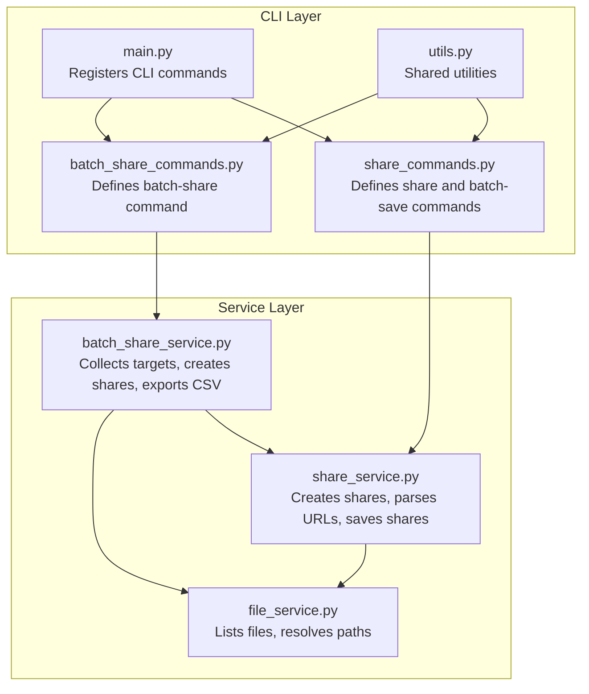
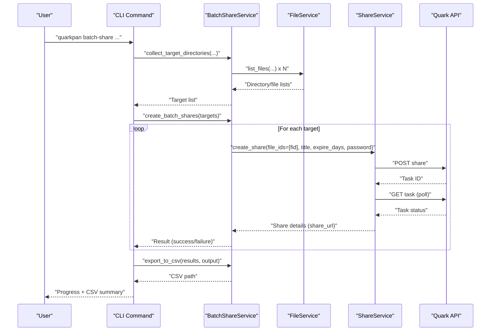
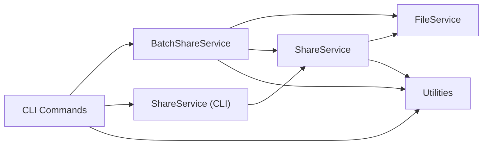

# Batch Share Commands

<cite>
**Referenced Files in This Document**
- [batch_share_commands.py](file://quark_client/cli/commands/batch_share_commands.py)
- [batch_share_service.py](file://quark_client/services/batch_share_service.py)
- [share_commands.py](file://quark_client/cli/commands/share_commands.py)
- [share_service.py](file://quark_client/services/share_service.py)
- [file_service.py](file://quark_client/services/file_service.py)
- [main.py](file://quark_client/cli/main.py)
- [utils.py](file://quark_client/cli/utils.py)
</cite>

## Table of Contents
1. [Introduction](#introduction)
2. [Project Structure](#project-structure)
3. [Core Components](#core-components)
4. [Architecture Overview](#architecture-overview)
5. [Detailed Component Analysis](#detailed-component-analysis)
6. [Dependency Analysis](#dependency-analysis)
7. [Performance Considerations](#performance-considerations)
8. [Troubleshooting Guide](#troubleshooting-guide)
9. [Conclusion](#conclusion)
10. [Appendices](#appendices)

## Introduction
This document explains batch share operations in the project, focusing on:
- batch_create_share (via smart_batch_create_shares)
- batch_save_shares (bulk share download)
- bulk share management commands
It covers batch processing workflows, queue management, progress monitoring for large-scale operations, configuration options, error handling strategies, partial success scenarios, automation patterns, integration with file organization scripts, and performance monitoring. It also includes examples for scheduled cleanup and bulk distribution workflows, plus troubleshooting guidance.

## Project Structure
The batch share functionality spans CLI commands and service layers:
- CLI commands define user-facing operations and options
- Services encapsulate API interactions and orchestration
- Utilities provide shared helpers for logging, formatting, and error handling

**Diagram sources**
- [batch_share_commands.py:15-221](file://quark_client/cli/commands/batch_share_commands.py#L15-L221)
- [share_commands.py:121-524](file://quark_client/cli/commands/share_commands.py#L121-L524)
- [main.py:29-250](file://quark_client/cli/main.py#L29-L250)
- [batch_share_service.py:16-571](file://quark_client/services/batch_share_service.py#L16-L571)
- [share_service.py:13-742](file://quark_client/services/share_service.py#L13-L742)
- [file_service.py:13-800](file://quark_client/services/file_service.py#L13-L800)
- [utils.py:17-126](file://quark_client/cli/utils.py#L17-L126)

**Section sources**
- [main.py:29-250](file://quark_client/cli/main.py#L29-L250)

## Core Components
- batch_share (CLI): Scans directories, previews targets, and creates shares with progress and CSV export
- BatchShareService: Central orchestrator for target collection, share creation, and CSV export
- share_service (CLI): Creates individual or smart batch shares with reuse detection and progress callbacks
- ShareService: Low-level share operations, URL parsing, token acquisition, saving shares, and batch save
- FileService: Directory traversal, path resolution, and file listing used by batch collectors
- Utilities: Logging, formatting, and error handling helpers

Key capabilities:
- Flexible target collection (legacy four-level, path-scoped, depth-scoped)
- Progress reporting and rich terminal UX
- CSV export for audit and automation
- Partial success handling and error categorization
- Reuse detection to avoid redundant shares

**Section sources**
- [batch_share_commands.py:15-221](file://quark_client/cli/commands/batch_share_commands.py#L15-L221)
- [batch_share_service.py:16-571](file://quark_client/services/batch_share_service.py#L16-L571)
- [share_commands.py:121-242](file://quark_client/cli/commands/share_commands.py#L121-L242)
- [share_service.py:13-742](file://quark_client/services/share_service.py#L13-L742)
- [file_service.py:13-800](file://quark_client/services/file_service.py#L13-L800)
- [utils.py:87-126](file://quark_client/cli/utils.py#L87-L126)

## Architecture Overview
The batch share architecture follows a layered design:
- CLI commands accept user options and drive workflows
- Services encapsulate business logic and API interactions
- FileService and ShareService provide low-level operations
- Utilities support logging, formatting, and error handling

**Diagram sources**
- [batch_share_commands.py:38-221](file://quark_client/cli/commands/batch_share_commands.py#L38-L221)
- [batch_share_service.py:31-478](file://quark_client/services/batch_share_service.py#L31-L478)
- [share_service.py:75-171](file://quark_client/services/share_service.py#L75-L171)
- [file_service.py:25-60](file://quark_client/services/file_service.py#L25-L60)

## Detailed Component Analysis

### batch_share (CLI)
Purpose:
- Scan directories based on options (target_dir, depth, share_level)
- Preview targets, confirm action for large batches
- Create shares for each target with progress
- Export results to CSV and summarize successes/failures

Options:
- --output/-o: CSV filename
- --exclude/-e: Exclude patterns (default: ["来自：分享"])
- --dry-run: Preview only
- --target-dir/-t: Start from a specific path
- --depth/-d: Depth for scanning (default 3)
- --share-level/-l: folders | files | both

Workflow highlights:
- Validates login, collects targets, displays preview
- Prompts for confirmation if batch is large
- Iterates targets, creates shares, aggregates results
- Exports CSV and prints summaries

Partial success:
- Tracks successes and failures per target
- Continues despite individual failures
- Reports aggregated statistics and CSV export

Progress monitoring:
- Rich progress bars during scan and share creation
- Per-target status updates

**Section sources**
- [batch_share_commands.py:15-221](file://quark_client/cli/commands/batch_share_commands.py#L15-L221)

### BatchShareService
Responsibilities:
- Target collection strategies:
  - Legacy four-level scanning (keep backward compatibility)
  - Path-scoped scanning (start from a given path)
  - Depth-scoped scanning (scan from root with configurable depth)
- Recursive traversal with exclusion filters
- Share creation via ShareService
- CSV export with timestamps and statuses

Key methods:
- collect_target_directories: Unified entrypoint selecting strategy
- collect_directories_by_path: Resolve path to folder ID, then recursive scan
- collect_directories_by_depth: Root-based recursive scan up to depth
- _collect_items_recursive: Core recursion with filtering and depth checks
- _resolve_path_to_folder_id: Path-to-ID resolution
- create_batch_shares: Iterative share creation with error handling
- export_to_csv: Writes CSV with share title, URL, path, and timestamp
- batch_share_and_export: End-to-end orchestration

Error handling:
- Graceful handling of API errors and missing directories
- Logs warnings and continues processing
- Aggregates partial failures for CSV and summary

**Section sources**
- [batch_share_service.py:16-571](file://quark_client/services/batch_share_service.py#L16-L571)

### share_service (CLI): smart_batch_create_shares
Purpose:
- Create shares for multiple file IDs with intelligent reuse detection
- Provide progress callbacks and detailed results

Behavior:
- Optionally checks existing shares to avoid duplicates
- For each file ID:
  - If reuse enabled and existing share found: reuse
  - Else: create new share
- Returns totals and per-result status (created, reused, failed)

Progress callback:
- Receives current/total, file_id, and result
- Enables real-time feedback in CLI

**Section sources**
- [share_commands.py:121-242](file://quark_client/cli/commands/share_commands.py#L121-L242)
- [share_service.py:622-742](file://quark_client/services/share_service.py#L622-L742)

### ShareService: Low-level Operations
Capabilities:
- create_share: Task-based creation with polling and completion
- get_my_shares: List user’s shares
- parse_share_url: Extract share_id and optional password
- get_share_token: Obtain access token for share pages
- get_share_info: Fetch share details
- save_shared_files: Save files to destination with optional wait
- batch_save_shares: Iterate and save multiple shares with progress callbacks
- smart_batch_create_shares: High-level batch creation with reuse detection

Error handling:
- Raises APIError on failures
- Specialized handling for capacity limits, timeouts, and invalid states
- Graceful degradation when checking existing shares fails

**Section sources**
- [share_service.py:13-742](file://quark_client/services/share_service.py#L13-L742)

### FileService: Directory Traversal and Path Resolution
Capabilities:
- list_files: Paginated file listing with sorting
- resolve_path: Convert path to folder/file ID
- get_file_info: Retrieve file metadata
- get_download_urls: Obtain download links
- get_storage_info: Capacity usage

Used by:
- BatchShareService for collecting targets and resolving paths
- ShareService for parsing and saving shares

**Section sources**
- [file_service.py:13-800](file://quark_client/services/file_service.py#L13-L800)

### CLI Registration and Integration
- main.py registers batch-share and batch-save commands
- batch-share delegates to batch_share_commands.batch_share
- batch-save delegates to share_commands.batch_save_shares

**Section sources**
- [main.py:186-250](file://quark_client/cli/main.py#L186-L250)

## Dependency Analysis
High-level dependencies:
- CLI commands depend on services for orchestration
- Services depend on FileService and ShareService
- ShareService depends on FileService for metadata and path resolution
- Utilities provide shared logging and formatting

**Diagram sources**
- [batch_share_commands.py:38-221](file://quark_client/cli/commands/batch_share_commands.py#L38-L221)
- [batch_share_service.py:16-571](file://quark_client/services/batch_share_service.py#L16-L571)
- [share_commands.py:121-524](file://quark_client/cli/commands/share_commands.py#L121-L524)
- [share_service.py:13-742](file://quark_client/services/share_service.py#L13-L742)
- [file_service.py:13-800](file://quark_client/services/file_service.py#L13-L800)
- [utils.py:17-126](file://quark_client/cli/utils.py#L17-L126)

**Section sources**
- [batch_share_commands.py:38-221](file://quark_client/cli/commands/batch_share_commands.py#L38-L221)
- [batch_share_service.py:16-571](file://quark_client/services/batch_share_service.py#L16-L571)
- [share_commands.py:121-524](file://quark_client/cli/commands/share_commands.py#L121-L524)
- [share_service.py:13-742](file://quark_client/services/share_service.py#L13-L742)
- [file_service.py:13-800](file://quark_client/services/file_service.py#L13-L800)
- [utils.py:17-126](file://quark_client/cli/utils.py#L17-L126)

## Performance Considerations
- Batch size and concurrency:
  - Current implementation iterates sequentially; consider batching API calls where supported
  - For large scans, prefer depth-scoped or path-scoped modes to reduce traversal cost
- Network efficiency:
  - Reuse detection avoids redundant share creation
  - CSV export minimizes repeated API calls for post-processing
- Progress and UX:
  - Rich progress bars improve perceived responsiveness
  - Early exit on empty target sets reduces unnecessary work
- Storage and capacity:
  - Monitor storage usage before bulk operations
  - Handle capacity-limit errors gracefully

[No sources needed since this section provides general guidance]

## Troubleshooting Guide
Common issues and resolutions:
- Authentication errors:
  - Re-login using the auth command; utilities detect and guide accordingly
- Network connectivity:
  - Retry after verifying network; utilities categorize network errors
- Capacity limit exceeded:
  - Free up space or upgrade; utilities suggest actionable steps
- Share expired or invalid:
  - Verify share URL validity; utilities surface expiration-related errors
- Path resolution failures:
  - Ensure paths exist; BatchShareService logs and continues on missing directories
- Timeout during save/share operations:
  - Increase timeout or reduce batch size; ShareService handles timeouts explicitly

Partial success scenarios:
- Individual targets may fail while others succeed
- Results are aggregated and exported to CSV for review
- CLI prints summaries and failure reasons

**Section sources**
- [utils.py:87-126](file://quark_client/cli/utils.py#L87-L126)
- [share_service.py:377-454](file://quark_client/services/share_service.py#L377-L454)
- [batch_share_service.py:405-478](file://quark_client/services/batch_share_service.py#L405-L478)

## Conclusion
The batch share system provides robust, user-friendly operations for large-scale share management:
- Flexible target collection strategies
- Real-time progress and rich UX
- Comprehensive error handling and partial success reporting
- CSV export for auditing and automation
- Integration points for scheduling and file organization scripts

[No sources needed since this section summarizes without analyzing specific files]

## Appendices

### Configuration Options Reference
- batch_share (CLI):
  - --output/-o: CSV filename
  - --exclude/-e: Comma-separated exclude patterns
  - --dry-run: Preview mode only
  - --target-dir/-t: Starting path for scanning
  - --depth/-d: Depth for scanning
  - --share-level/-l: folders | files | both

- share (CLI) smart batch:
  - --title/-t: Share title
  - --expire/-e: Days until expiry (0 for permanent)
  - --password/-p: Password (optional)
  - --use-id: Treat arguments as IDs
  - --no-check / --force-new: Control reuse detection

- batch_save (CLI):
  - --folder/-f: Destination folder
  - --save-all/--no-save-all: Save all files or selected
  - --wait/--no-wait: Wait for completion
  - --create-subfolder/--no-subfolder: Create subfolders per share
  - --from: Read links from a file

**Section sources**
- [batch_share_commands.py:15-221](file://quark_client/cli/commands/batch_share_commands.py#L15-L221)
- [share_commands.py:121-242](file://quark_client/cli/commands/share_commands.py#L121-L242)
- [main.py:186-250](file://quark_client/cli/main.py#L186-L250)

### Example Workflows

- Scheduled share cleanup:
  - Periodically run batch_share with exclude patterns to avoid re-sharing protected folders
  - Export CSV and process results to remove outdated shares via list_my_shares and delete_share

- Bulk share distribution:
  - Use batch_save with --from to ingest links from a file
  - Configure --create-subfolder to organize downloads per share
  - Monitor progress via CLI output and CSV

- Regular maintenance automation:
  - Integrate batch_share with cron/systemd to periodically create shares for new content
  - Combine with file organization scripts to move processed items into dedicated folders

[No sources needed since this section provides general guidance]