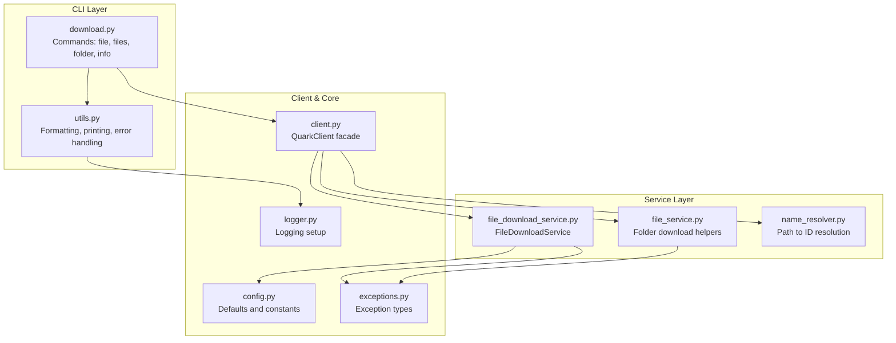
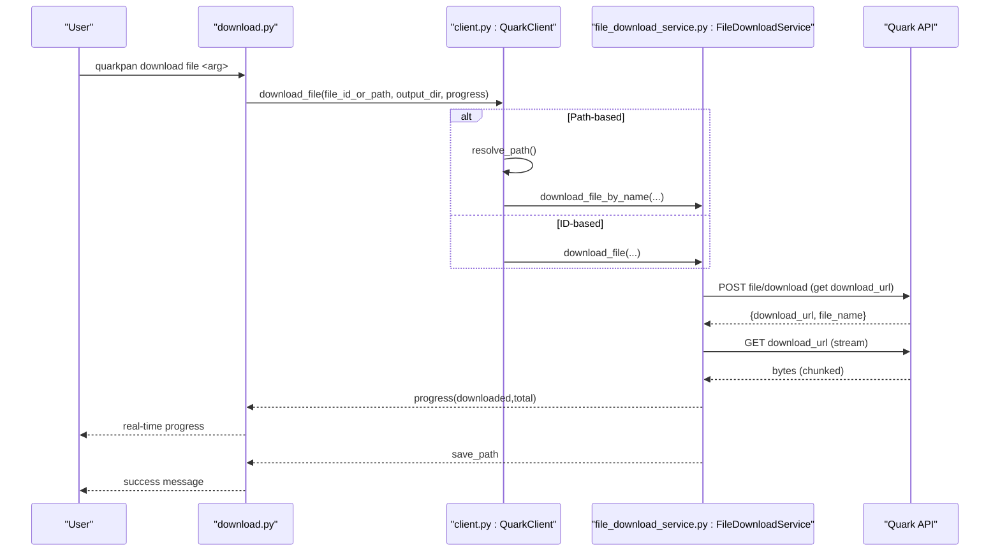
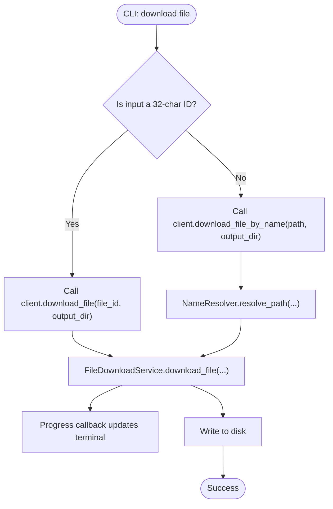
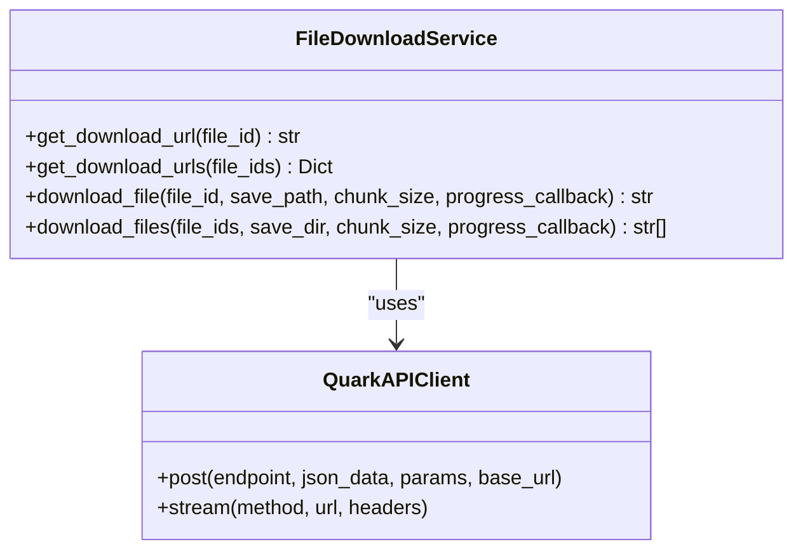
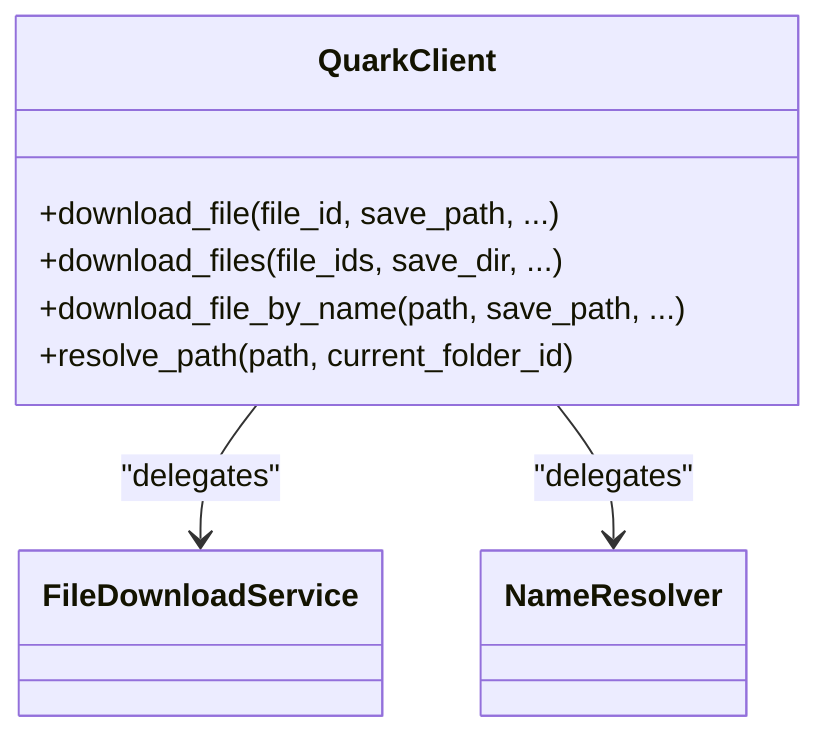
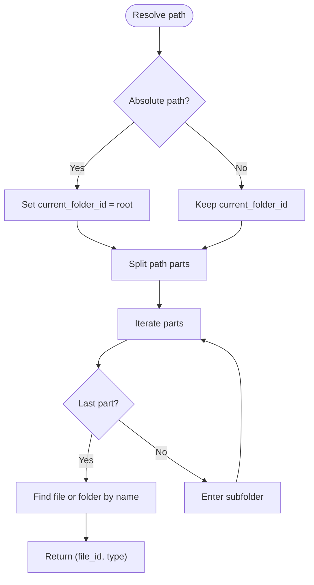
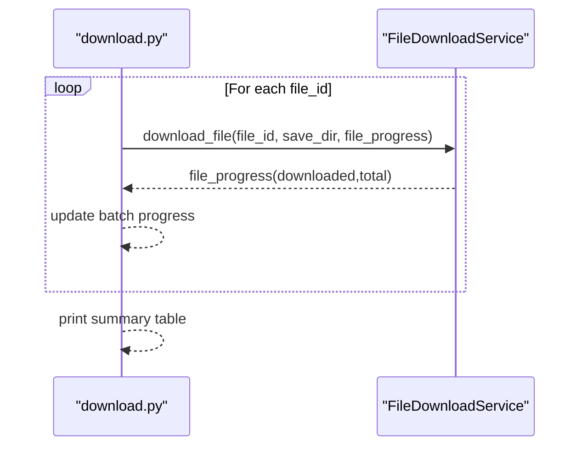
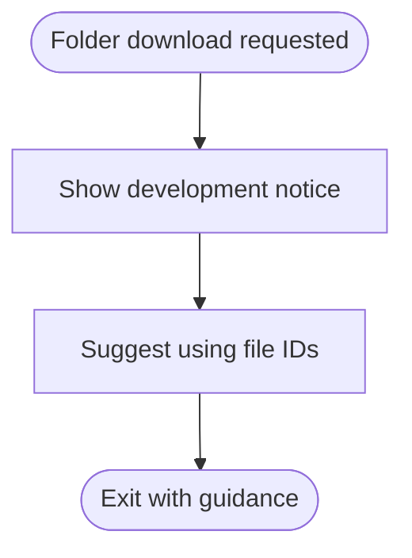
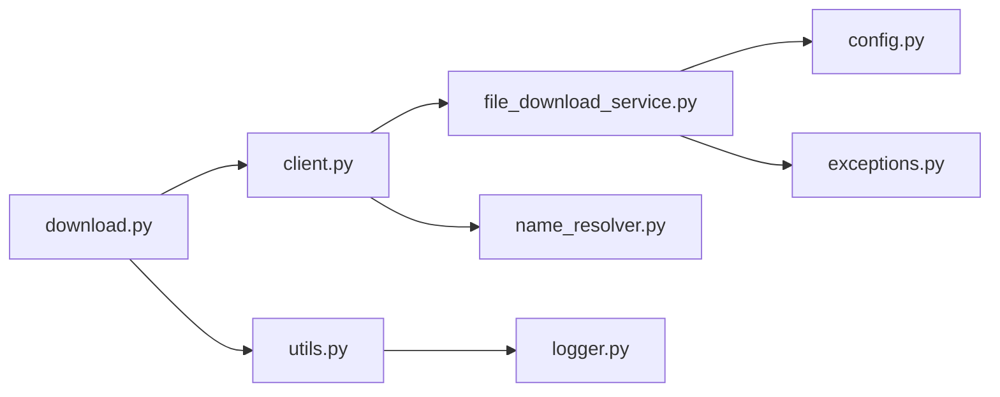

# Download Commands

<cite>
**Referenced Files in This Document**
- [download.py](file://quark_client/cli/commands/download.py)
- [file_download_service.py](file://quark_client/services/file_download_service.py)
- [client.py](file://quark_client/client.py)
- [utils.py](file://quark_client/cli/utils.py)
- [config.py](file://quark_client/config.py)
- [logger.py](file://quark_client/utils/logger.py)
- [exceptions.py](file://quark_client/exceptions.py)
- [file_service.py](file://quark_client/services/file_service.py)
- [name_resolver.py](file://quark_client/services/name_resolver.py)
</cite>

## Table of Contents
1. [Introduction](#introduction)
2. [Project Structure](#project-structure)
3. [Core Components](#core-components)
4. [Architecture Overview](#architecture-overview)
5. [Detailed Component Analysis](#detailed-component-analysis)
6. [Dependency Analysis](#dependency-analysis)
7. [Performance Considerations](#performance-considerations)
8. [Troubleshooting Guide](#troubleshooting-guide)
9. [Conclusion](#conclusion)
10. [Appendices](#appendices)

## Introduction
This document explains the download-related CLI commands and underlying implementation. It covers single-file downloads, batch downloads, folder download status, progress tracking, download path resolution, filename conflict handling, and integration points. It also addresses concurrency, retries, bandwidth considerations, network interruption handling, and troubleshooting.

## Project Structure
The download functionality spans the CLI command layer, service layer, and client wrapper:
- CLI commands define user-facing commands and argument parsing.
- Services encapsulate download logic, URL retrieval, and streaming.
- The client exposes convenience methods bridging CLI and services.
- Utilities provide formatting, logging, and error handling helpers.

**Diagram sources**
- [download.py:1-262](file://quark_client/cli/commands/download.py#L1-L262)
- [file_download_service.py:1-301](file://quark_client/services/file_download_service.py#L1-L301)
- [client.py:1-405](file://quark_client/client.py#L1-L405)
- [utils.py:1-273](file://quark_client/cli/utils.py#L1-L273)
- [config.py:1-63](file://quark_client/config.py#L1-L63)
- [logger.py:1-73](file://quark_client/utils/logger.py#L1-L73)
- [exceptions.py:1-50](file://quark_client/exceptions.py#L1-L50)
- [file_service.py:800-893](file://quark_client/services/file_service.py#L800-L893)
- [name_resolver.py:1-198](file://quark_client/services/name_resolver.py#L1-L198)

**Section sources**
- [download.py:1-262](file://quark_client/cli/commands/download.py#L1-L262)
- [client.py:18-102](file://quark_client/client.py#L18-L102)
- [file_download_service.py:13-301](file://quark_client/services/file_download_service.py#L13-L301)
- [file_service.py:800-893](file://quark_client/services/file_service.py#L800-L893)
- [name_resolver.py:19-73](file://quark_client/services/name_resolver.py#L19-L73)
- [utils.py:17-126](file://quark_client/cli/utils.py#L17-L126)
- [config.py:34-63](file://quark_client/config.py#L34-L63)
- [logger.py:12-73](file://quark_client/utils/logger.py#L12-L73)
- [exceptions.py:8-50](file://quark_client/exceptions.py#L8-L50)

## Core Components
- CLI download commands:
  - Single file: supports file ID or path-based download with progress reporting.
  - Batch files: accepts multiple file IDs, creates output directory, and reports per-file progress.
  - Folder download: currently indicates development status and suggests using file IDs.
  - Info: prints usage examples and features.
- Download services:
  - Retrieve download URLs via API.
  - Stream downloads with chunked writes and progress callbacks.
  - Fallback download methods when initial approach fails.
  - Batch download orchestration with per-file progress aggregation.
- Client facade:
  - Exposes convenience methods for file and folder operations.
  - Bridges CLI commands to services and resolves paths to IDs.
- Utilities and configuration:
  - Formatting, printing, and error handling helpers.
  - Default chunk sizes, timeouts, and retry settings.
  - Logging setup for diagnostics.

**Section sources**
- [download.py:26-262](file://quark_client/cli/commands/download.py#L26-L262)
- [file_download_service.py:25-301](file://quark_client/services/file_download_service.py#L25-L301)
- [client.py:88-102](file://quark_client/client.py#L88-L102)
- [utils.py:26-126](file://quark_client/cli/utils.py#L26-L126)
- [config.py:50-63](file://quark_client/config.py#L50-L63)

## Architecture Overview
The CLI commands delegate to the client, which coordinates services and utilities. Downloads use two-phase retrieval (URL + stream) with robust fallbacks and progress callbacks.

**Diagram sources**
- [download.py:26-82](file://quark_client/cli/commands/download.py#L26-L82)
- [client.py:96-102](file://quark_client/client.py#L96-L102)
- [file_download_service.py:97-257](file://quark_client/services/file_download_service.py#L97-L257)

## Detailed Component Analysis

### CLI Download Commands
- Command: download file
  - Accepts either a 32-character file ID or a path.
  - Supports output directory and optional filename override.
  - Uses a progress callback emitting percentage and MB totals.
  - On completion, prints success and file size.
- Command: download files
  - Accepts multiple file IDs.
  - Creates output directory if missing.
  - Aggregates per-file progress into a combined progress bar.
  - Prints a table of downloaded files with sizes.
- Command: download folder
  - Currently marked as under development; suggests using file IDs and lists a warning.
  - Placeholder for future recursive folder download implementation.
- Command: download info
  - Displays usage examples and feature highlights.

**Diagram sources**
- [download.py:26-82](file://quark_client/cli/commands/download.py#L26-L82)
- [client.py:133-139](file://quark_client/client.py#L133-L139)
- [name_resolver.py:19-73](file://quark_client/services/name_resolver.py#L19-L73)
- [file_download_service.py:97-257](file://quark_client/services/file_download_service.py#L97-L257)

**Section sources**
- [download.py:26-82](file://quark_client/cli/commands/download.py#L26-L82)
- [download.py:84-147](file://quark_client/cli/commands/download.py#L84-L147)
- [download.py:149-209](file://quark_client/cli/commands/download.py#L149-L209)
- [download.py:211-257](file://quark_client/cli/commands/download.py#L211-L257)

### FileDownloadService
- Retrieves download URLs via API with specific parameters.
- Streams downloads with configurable chunk size and progress callbacks.
- Implements dual-method download:
  - Method 1: Uses internal session with custom headers.
  - Method 2: Falls back to external HTTP client with cookies extracted from session.
- Raises APIError when all methods fail or when download metadata is invalid.
- Provides batch download orchestration iterating over file IDs and aggregating progress.

**Diagram sources**
- [file_download_service.py:13-301](file://quark_client/services/file_download_service.py#L13-L301)

**Section sources**
- [file_download_service.py:25-95](file://quark_client/services/file_download_service.py#L25-L95)
- [file_download_service.py:97-257](file://quark_client/services/file_download_service.py#L97-L257)
- [file_download_service.py:259-301](file://quark_client/services/file_download_service.py#L259-L301)

### Client Facade (QuarkClient)
- Exposes convenience methods for downloading files and resolving paths.
- Delegates to FileDownloadService for downloads and NameResolver for path-to-ID resolution.
- Provides both ID-based and name-based download methods.

**Diagram sources**
- [client.py:18-102](file://quark_client/client.py#L18-L102)
- [client.py:133-139](file://quark_client/client.py#L133-L139)

**Section sources**
- [client.py:88-102](file://quark_client/client.py#L88-L102)
- [client.py:133-139](file://quark_client/client.py#L133-L139)

### Path Resolution and Filename Conflict Handling
- Path resolution:
  - Converts absolute or relative paths to file IDs using NameResolver.
  - Supports trailing slash semantics for folders.
- Filename conflict handling:
  - When saving files, ensures unique filenames by appending an incremental counter if a file exists.
  - Preserves directory structure during downloads.

**Diagram sources**
- [name_resolver.py:19-73](file://quark_client/services/name_resolver.py#L19-L73)

**Section sources**
- [name_resolver.py:19-73](file://quark_client/services/name_resolver.py#L19-L73)
- [file_service.py:617-640](file://quark_client/services/file_service.py#L617-L640)

### Progress Tracking and Batch Downloads
- Single file:
  - Emits progress events with filename, percentage, and MB totals.
- Batch files:
  - Aggregates per-file progress into a unified progress bar with MB totals.
  - Prints a summary table of downloaded files with sizes.
- Folder download:
  - Provides event-driven progress (per-file) and statistics counters.
  - Notes placeholder status for recursive folder download.

**Diagram sources**
- [download.py:101-119](file://quark_client/cli/commands/download.py#L101-L119)
- [file_download_service.py:284-294](file://quark_client/services/file_download_service.py#L284-L294)

**Section sources**
- [download.py:42-52](file://quark_client/cli/commands/download.py#L42-L52)
- [download.py:101-119](file://quark_client/cli/commands/download.py#L101-L119)
- [download.py:169-189](file://quark_client/cli/commands/download.py#L169-L189)

### Folder Download Implementation Notes
- The current CLI folder command indicates development status and suggests using file IDs.
- A dedicated folder download service exists with recursive traversal, safe filename generation, and event-driven progress reporting.
- Future work includes integrating the folder service into the CLI.

**Diagram sources**
- [download.py:149-209](file://quark_client/cli/commands/download.py#L149-L209)

**Section sources**
- [download.py:149-209](file://quark_client/cli/commands/download.py#L149-L209)
- [file_service.py:800-893](file://quark_client/services/file_service.py#L800-L893)

## Dependency Analysis
- CLI depends on client facade and utilities.
- Client depends on services and name resolver.
- Services depend on API client and configuration.
- Exceptions and logging support cross-cutting concerns.

**Diagram sources**
- [download.py:1-262](file://quark_client/cli/commands/download.py#L1-L262)
- [client.py:18-102](file://quark_client/client.py#L18-L102)
- [file_download_service.py:13-301](file://quark_client/services/file_download_service.py#L13-L301)
- [utils.py:1-273](file://quark_client/cli/utils.py#L1-L273)
- [config.py:1-63](file://quark_client/config.py#L1-L63)
- [logger.py:1-73](file://quark_client/utils/logger.py#L1-L73)
- [exceptions.py:1-50](file://quark_client/exceptions.py#L1-L50)
- [name_resolver.py:1-198](file://quark_client/services/name_resolver.py#L1-L198)

**Section sources**
- [download.py:1-262](file://quark_client/cli/commands/download.py#L1-L262)
- [client.py:18-102](file://quark_client/client.py#L18-L102)
- [file_download_service.py:13-301](file://quark_client/services/file_download_service.py#L13-L301)
- [utils.py:1-273](file://quark_client/cli/utils.py#L1-L273)
- [config.py:1-63](file://quark_client/config.py#L1-L63)
- [logger.py:1-73](file://quark_client/utils/logger.py#L1-L73)
- [exceptions.py:1-50](file://quark_client/exceptions.py#L1-L50)
- [name_resolver.py:1-198](file://quark_client/services/name_resolver.py#L1-L198)

## Performance Considerations
- Chunk size: The default chunk size is set in configuration and used by the download service to balance memory and throughput.
- Concurrency: The batch downloader iterates sequentially; there is no built-in concurrency limit or parallelism in the current implementation.
- Bandwidth throttling: No explicit throttling mechanism is present in the codebase.
- Retries: The download service attempts two methods before raising an error; there is no automatic retry loop for transient failures.
- Recommendations:
  - Introduce a configurable concurrency cap for batch downloads.
  - Add exponential backoff and retry for transient errors.
  - Consider adding bandwidth throttling via rate limiting or adaptive chunk sizing.

[No sources needed since this section provides general guidance]

## Troubleshooting Guide
Common issues and resolutions:
- Authentication errors:
  - Re-login using the authentication command and retry the download.
- Network errors:
  - Verify connectivity and retry; the download service attempts a fallback method.
- Capacity or quota exceeded:
  - Free up space or upgrade storage; the system surfaces capacity-related errors.
- File not found or path invalid:
  - Confirm the file ID or path exists and is accessible.
- Download failures:
  - Inspect logs and re-run with verbose logging enabled.
  - Retry after a delay; consider reducing batch size.

Operational tips:
- Enable logging to capture detailed traces for diagnosing failures.
- Use file IDs for reliability when paths are ambiguous.
- Monitor progress callbacks to detect stalled downloads early.

**Section sources**
- [utils.py:87-110](file://quark_client/cli/utils.py#L87-L110)
- [file_download_service.py:208-255](file://quark_client/services/file_download_service.py#L208-L255)
- [logger.py:12-73](file://quark_client/utils/logger.py#L12-L73)

## Conclusion
The download subsystem provides robust single-file and batch download capabilities with real-time progress reporting and path resolution. While folder downloads are noted as under development, the underlying service supports recursive traversal and safe filename handling. The design cleanly separates CLI, service, and client layers, enabling future enhancements such as concurrency, retries, and throttling.

[No sources needed since this section summarizes without analyzing specific files]

## Appendices

### Command Reference and Examples
- Single file download by ID:
  - quarkpan download file <file_id> -o <output_dir>
- Single file download by path:
  - quarkpan download file "<absolute_or_relative_path>" -o <output_dir>
- Batch download:
  - quarkpan download files <file_id1> <file_id2> ... -o <output_dir>
- Folder download (development note):
  - quarkpan download folder <folder_id> -o <output_dir> (use ID; see info for guidance)
- Help and examples:
  - quarkpan download info

**Section sources**
- [download.py:211-257](file://quark_client/cli/commands/download.py#L211-L257)

### Configuration Options
- Default chunk size for downloads.
- Request timeout and retry settings.
- Default download directory.

**Section sources**
- [config.py:50-63](file://quark_client/config.py#L50-L63)