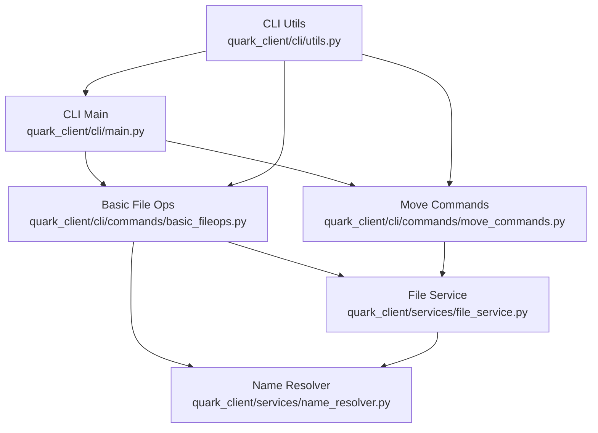
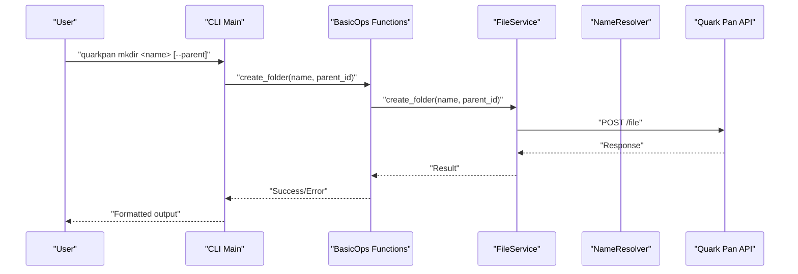
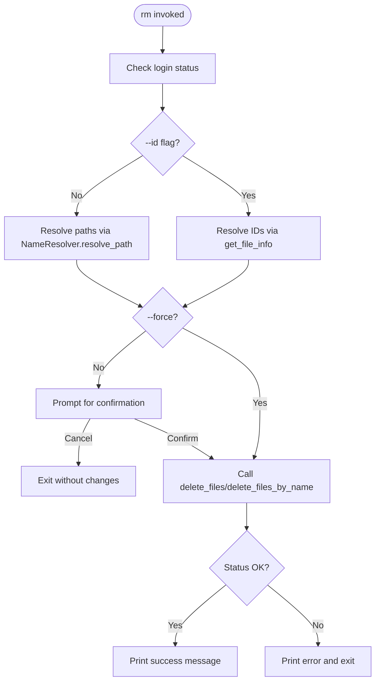
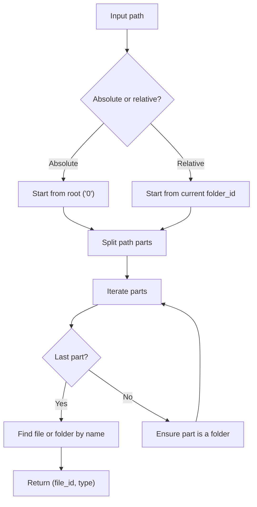
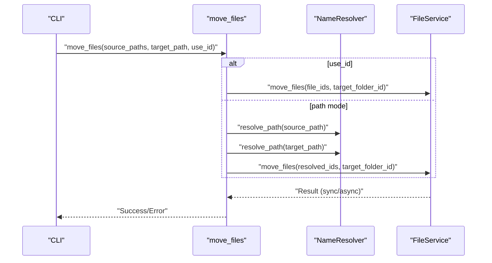
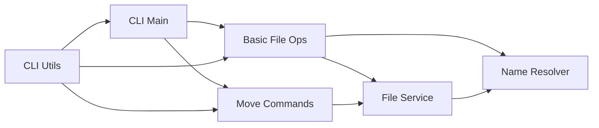

# File Management Commands

<cite>
**Referenced Files in This Document**
- [basic_fileops.py](file://quark_client/cli/commands/basic_fileops.py)
- [move_commands.py](file://quark_client/cli/commands/move_commands.py)
- [file_service.py](file://quark_client/services/file_service.py)
- [name_resolver.py](file://quark_client/services/name_resolver.py)
- [main.py](file://quark_client/cli/main.py)
- [interactive.py](file://quark_client/cli/interactive.py)
- [utils.py](file://quark_client/cli/utils.py)
</cite>

## Table of Contents
1. [Introduction](#introduction)
2. [Project Structure](#project-structure)
3. [Core Components](#core-components)
4. [Architecture Overview](#architecture-overview)
5. [Detailed Component Analysis](#detailed-component-analysis)
6. [Dependency Analysis](#dependency-analysis)
7. [Performance Considerations](#performance-considerations)
8. [Troubleshooting Guide](#troubleshooting-guide)
9. [Conclusion](#conclusion)
10. [Appendices](#appendices)

## Introduction
This document provides comprehensive documentation for file management commands in the Quark Pan CLI, focusing on directory creation, deletion, renaming, metadata inspection, directory listing, and navigation. It explains syntax, parameters, flags, output formats, path resolution, recursive operations, batch processing, error handling, and practical automation patterns with shell scripting.

## Project Structure
The file management commands are implemented as CLI subcommands backed by a service layer that interacts with the Quark Pan API. The CLI entrypoint defines commands like mkdir, rm, rename, fileinfo, browse, and goto, while the service layer handles path resolution, API calls, and recursive operations.

**Diagram sources**
- [main.py:75-128](file://quark_client/cli/main.py#L75-L128)
- [basic_fileops.py:14-406](file://quark_client/cli/commands/basic_fileops.py#L14-L406)
- [move_commands.py:13-169](file://quark_client/cli/commands/move_commands.py#L13-L169)
- [file_service.py:13-893](file://quark_client/services/file_service.py#L13-L893)
- [name_resolver.py:10-198](file://quark_client/services/name_resolver.py#L10-L198)
- [utils.py:17-126](file://quark_client/cli/utils.py#L17-L126)

**Section sources**
- [main.py:75-128](file://quark_client/cli/main.py#L75-L128)
- [basic_fileops.py:14-406](file://quark_client/cli/commands/basic_fileops.py#L14-L406)
- [move_commands.py:13-169](file://quark_client/cli/commands/move_commands.py#L13-L169)
- [file_service.py:13-893](file://quark_client/services/file_service.py#L13-L893)
- [name_resolver.py:10-198](file://quark_client/services/name_resolver.py#L10-L198)
- [utils.py:17-126](file://quark_client/cli/utils.py#L17-L126)

## Core Components
- CLI Command Definitions: The CLI registers commands for mkdir, rm, rename, fileinfo, browse, and goto, mapping them to functions in the basic file operations module.
- Service Layer: The FileService encapsulates API interactions for listing, creating, deleting, renaming, moving, and resolving paths.
- Path Resolution: The NameResolver resolves human-readable paths to file/folder IDs and caches directory listings for efficiency.
- Utilities: Shared utilities provide client initialization, formatting, confirmation prompts, and error handling.

Key responsibilities:
- mkdir: Creates a folder under a given parent folder ID or path.
- rm: Deletes files or folders by ID or path, with confirmation and batch support.
- rename: Renames files or folders by ID or path.
- fileinfo: Retrieves and displays detailed metadata for a given file/folder ID.
- browse: Provides interactive browsing (placeholder in current implementation).
- goto: Smart navigation to a target folder (placeholder in current implementation).

**Section sources**
- [main.py:75-128](file://quark_client/cli/main.py#L75-L128)
- [basic_fileops.py:14-406](file://quark_client/cli/commands/basic_fileops.py#L14-L406)
- [file_service.py:13-893](file://quark_client/services/file_service.py#L13-L893)
- [name_resolver.py:10-198](file://quark_client/services/name_resolver.py#L10-L198)
- [utils.py:17-126](file://quark_client/cli/utils.py#L17-L126)

## Architecture Overview
The CLI commands delegate to functions in basic_fileops.py, which use the shared client to call FileService methods. FileService performs path resolution via NameResolver and interacts with the Quark Pan API. Utilities centralize logging, formatting, and error handling.

**Diagram sources**
- [main.py:75-83](file://quark_client/cli/main.py#L75-L83)
- [basic_fileops.py:14-43](file://quark_client/cli/commands/basic_fileops.py#L14-L43)
- [file_service.py:103-129](file://quark_client/services/file_service.py#L103-L129)

## Detailed Component Analysis

### mkdir (Create Directory)
- Syntax: quarkpan mkdir FOLDER_NAME [--parent PARENT_ID]
- Required parameters:
  - FOLDER_NAME: Name of the new folder.
- Optional flags:
  - --parent PARENT_ID: Parent folder ID; defaults to root ("0").
- Behavior:
  - Validates login status.
  - Calls FileService.create_folder with parent_id and folder_name.
  - Prints success with folder ID and formatted success message.
- Output formats:
  - Success: "文件夹创建成功: <name>" and "文件夹ID: <id>".
  - Error: "创建文件夹失败: <message>" with exit code 1.
- Path resolution:
  - Uses parent_id directly; does not resolve path strings.
- Recursive operations:
  - Not applicable for mkdir.
- Batch processing:
  - Single folder creation per invocation.
- Error handling:
  - Handles authentication errors, API errors, and prints user-friendly messages.

**Section sources**
- [main.py:75-83](file://quark_client/cli/main.py#L75-L83)
- [basic_fileops.py:14-43](file://quark_client/cli/commands/basic_fileops.py#L14-L43)
- [file_service.py:103-129](file://quark_client/services/file_service.py#L103-L129)
- [utils.py:87-110](file://quark_client/cli/utils.py#L87-L110)

### rm (Delete Files/Directories)
- Syntax: quarkpan rm PATH_OR_ID... [--force] [--id]
- Required parameters:
  - PATH_OR_ID: One or more file/folder paths or IDs to delete.
- Optional flags:
  - --force: Skip confirmation prompt.
  - --id: Treat arguments as IDs rather than paths.
- Behavior:
  - Validates login status.
  - If --id is set: treats arguments as IDs and resolves names via get_file_info.
  - If not --id: resolves each path to an ID using NameResolver.resolve_path.
  - Confirms deletion unless --force is set.
  - Calls FileService.delete_files for IDs or delete_files_by_name for paths.
- Output formats:
  - Lists items to be deleted with type and name.
  - Success: "成功删除 <count> 个文件/文件夹".
  - Error: "删除失败: <message>" with exit code 1.
- Path resolution:
  - Uses NameResolver.resolve_path for path-to-ID conversion.
- Recursive operations:
  - Deletion is performed per item; recursion is not implemented here.
- Batch processing:
  - Supports multiple items in a single command.
- Error handling:
  - Handles invalid paths, permission issues, and API errors.

**Diagram sources**
- [basic_fileops.py:45-108](file://quark_client/cli/commands/basic_fileops.py#L45-L108)
- [file_service.py:131-155](file://quark_client/services/file_service.py#L131-L155)
- [name_resolver.py:19-73](file://quark_client/services/name_resolver.py#L19-L73)

**Section sources**
- [main.py:85-93](file://quark_client/cli/main.py#L85-L93)
- [basic_fileops.py:45-108](file://quark_client/cli/commands/basic_fileops.py#L45-L108)
- [file_service.py:131-155](file://quark_client/services/file_service.py#L131-L155)
- [name_resolver.py:19-73](file://quark_client/services/name_resolver.py#L19-L73)
- [utils.py:87-110](file://quark_client/cli/utils.py#L87-L110)

### rename (Rename Files/Directories)
- Syntax: quarkpan rename PATH_OR_ID NEW_NAME [--id]
- Required parameters:
  - PATH_OR_ID: Target file/folder path or ID.
  - NEW_NAME: New name for the file/folder.
- Optional flags:
  - --id: Treat PATH_OR_ID as an ID.
- Behavior:
  - Validates login status.
  - If --id: resolves current name via get_file_info and calls rename_file.
  - If not --id: resolves path to ID, retrieves current name, and calls rename_file_by_name.
- Output formats:
  - Success: "重命名成功: <new_name>".
  - Error: "重命名失败: <message>" with exit code 1.
- Path resolution:
  - Uses NameResolver.resolve_path for path-to-ID conversion.
- Recursive operations:
  - Not applicable for rename.
- Batch processing:
  - Single rename per invocation.
- Error handling:
  - Handles invalid paths, permission issues, and API errors.

**Section sources**
- [main.py:95-103](file://quark_client/cli/main.py#L95-L103)
- [basic_fileops.py:111-158](file://quark_client/cli/commands/basic_fileops.py#L111-L158)
- [file_service.py:157-181](file://quark_client/services/file_service.py#L157-L181)
- [name_resolver.py:19-73](file://quark_client/services/name_resolver.py#L19-L73)
- [utils.py:87-110](file://quark_client/cli/utils.py#L87-L110)

### fileinfo (Display File Metadata)
- Syntax: quarkpan fileinfo FILE_ID
- Required parameters:
  - FILE_ID: Unique identifier for the file or folder.
- Behavior:
  - Validates login status.
  - Calls FileService.get_file_info to retrieve metadata.
  - Displays a formatted table with attributes like file name, ID, type, size, format, created/updated timestamps.
- Output formats:
  - Rich table with two columns: attribute and value.
- Path resolution:
  - Operates directly on IDs; no path resolution needed.
- Recursive operations:
  - Not applicable.
- Batch processing:
  - Single file info per invocation.
- Error handling:
  - Handles invalid IDs and API errors.

**Section sources**
- [main.py:105-111](file://quark_client/cli/main.py#L105-L111)
- [basic_fileops.py:161-197](file://quark_client/cli/commands/basic_fileops.py#L161-L197)
- [file_service.py:61-101](file://quark_client/services/file_service.py#L61-L101)
- [utils.py:87-110](file://quark_client/cli/utils.py#L87-L110)

### browse (List Directory Contents)
- Syntax: quarkpan browse [FOLDER_ID]
- Required parameters:
  - FOLDER_ID: Folder ID to browse; defaults to root ("0").
- Behavior:
  - Placeholder implementation currently prints a development notice and suggests interactive mode.
- Output formats:
  - Warning and informational messages.
- Path resolution:
  - Not applicable in current implementation.
- Recursive operations:
  - Not applicable in current implementation.
- Batch processing:
  - Not applicable in current implementation.
- Error handling:
  - No-op placeholder.

**Section sources**
- [main.py:113-119](file://quark_client/cli/main.py#L113-L119)
- [basic_fileops.py:200-206](file://quark_client/cli/commands/basic_fileops.py#L200-L206)

### goto (Navigate Directories)
- Syntax: quarkpan goto TARGET [--from CURRENT_FOLDER]
- Required parameters:
  - TARGET: Target folder (ID, name, or index).
- Optional flags:
  - --from CURRENT_FOLDER: Current folder ID; defaults to root ("0").
- Behavior:
  - Placeholder implementation currently prints a development notice and suggests interactive mode.
- Output formats:
  - Warning and informational messages.
- Path resolution:
  - Not applicable in current implementation.
- Recursive operations:
  - Not applicable in current implementation.
- Batch processing:
  - Not applicable in current implementation.
- Error handling:
  - No-op placeholder.

**Section sources**
- [main.py:121-128](file://quark_client/cli/main.py#L121-L128)
- [basic_fileops.py:208-214](file://quark_client/cli/commands/basic_fileops.py#L208-L214)

### Path Resolution and Navigation Internals
- NameResolver.resolve_path:
  - Converts human-readable paths to file/folder IDs.
  - Supports absolute and relative paths, trailing slash for folders, and caching of directory listings.
  - Throws APIError if items are not found.
- FileService.resolve_path:
  - Iteratively lists directory contents and matches names to build path resolution.
  - Handles absolute paths starting with "/", and enforces directory semantics.
- Recursive folder creation:
  - _create_folder_path creates missing intermediate folders during uploads and other operations.

**Diagram sources**
- [name_resolver.py:19-73](file://quark_client/services/name_resolver.py#L19-L73)
- [file_service.py:474-551](file://quark_client/services/file_service.py#L474-L551)

**Section sources**
- [name_resolver.py:19-73](file://quark_client/services/name_resolver.py#L19-L73)
- [file_service.py:474-551](file://quark_client/services/file_service.py#L474-L551)
- [basic_fileops.py:252-332](file://quark_client/cli/commands/basic_fileops.py#L252-L332)

### Move Operations (Related to Navigation)
While not strictly part of the requested commands, move operations demonstrate advanced path resolution and batch processing:
- move_files: Moves multiple files to a target folder, supporting both path and ID modes.
- move_to_folder: Creates a target folder (with optional auto-creation) and moves files into it.

**Diagram sources**
- [move_commands.py:13-96](file://quark_client/cli/commands/move_commands.py#L13-L96)
- [name_resolver.py:19-73](file://quark_client/services/name_resolver.py#L19-L73)
- [file_service.py:386-472](file://quark_client/services/file_service.py#L386-L472)

**Section sources**
- [move_commands.py:13-96](file://quark_client/cli/commands/move_commands.py#L13-L96)
- [file_service.py:386-472](file://quark_client/services/file_service.py#L386-L472)
- [name_resolver.py:19-73](file://quark_client/services/name_resolver.py#L19-L73)

## Dependency Analysis
- CLI depends on basic_fileops and move_commands for command implementations.
- basic_fileops depends on FileService and NameResolver for path resolution and API calls.
- FileService depends on NameResolver for path resolution and on the QuarkAPIClient for HTTP requests.
- utils centralizes client creation, formatting, confirmation, and error handling.

**Diagram sources**
- [main.py:75-128](file://quark_client/cli/main.py#L75-L128)
- [basic_fileops.py:14-406](file://quark_client/cli/commands/basic_fileops.py#L14-L406)
- [move_commands.py:13-169](file://quark_client/cli/commands/move_commands.py#L13-L169)
- [file_service.py:13-893](file://quark_client/services/file_service.py#L13-L893)
- [name_resolver.py:10-198](file://quark_client/services/name_resolver.py#L10-L198)
- [utils.py:17-126](file://quark_client/cli/utils.py#L17-L126)

**Section sources**
- [main.py:75-128](file://quark_client/cli/main.py#L75-L128)
- [basic_fileops.py:14-406](file://quark_client/cli/commands/basic_fileops.py#L14-L406)
- [move_commands.py:13-169](file://quark_client/cli/commands/move_commands.py#L13-L169)
- [file_service.py:13-893](file://quark_client/services/file_service.py#L13-L893)
- [name_resolver.py:10-198](file://quark_client/services/name_resolver.py#L10-L198)
- [utils.py:17-126](file://quark_client/cli/utils.py#L17-L126)

## Performance Considerations
- Path resolution caching: NameResolver caches directory listings per folder to reduce repeated API calls.
- Pagination: FileService.list_files supports pagination to manage large directory listings efficiently.
- Asynchronous operations: FileService.move_files may return asynchronous tasks; the implementation waits with polling and configurable intervals.
- Streaming downloads: FileService.download_file uses streaming to handle large files without loading entire content into memory.

[No sources needed since this section provides general guidance]

## Troubleshooting Guide
Common issues and resolutions:
- Authentication errors: Re-login using the auth subsystem; utilities detect and guide users accordingly.
- Network failures: Utilities categorize network-related errors and suggest retrying or checking connectivity.
- Permission issues: Errors are surfaced with actionable messages; ensure sufficient permissions for the target folder.
- Capacity limits: Utilities detect capacity-related errors and suggest cleanup or upgrade actions.
- Invalid paths or IDs: NameResolver throws APIError for missing items; verify path correctness or ID validity.

**Section sources**
- [utils.py:87-110](file://quark_client/cli/utils.py#L87-L110)
- [file_service.py:61-101](file://quark_client/services/file_service.py#L61-L101)
- [name_resolver.py:75-104](file://quark_client/services/name_resolver.py#L75-L104)

## Conclusion
The Quark Pan CLI provides robust file management capabilities with clear command syntax, comprehensive error handling, and efficient path resolution. While browse and goto are placeholders, the underlying service layer supports advanced operations like recursive folder creation and asynchronous task handling. Users can chain commands and integrate with shell scripts for automation, leveraging the provided utilities for consistent output and error reporting.

## Appendices

### Command Reference Summary
- mkdir: Create a folder under a parent folder ID or path.
- rm: Delete files or folders by ID or path with confirmation and batch support.
- rename: Rename files or folders by ID or path.
- fileinfo: Display detailed metadata for a file or folder ID.
- browse: Placeholder for interactive directory browsing.
- goto: Placeholder for smart navigation to a target folder.

[No sources needed since this section summarizes without analyzing specific files]