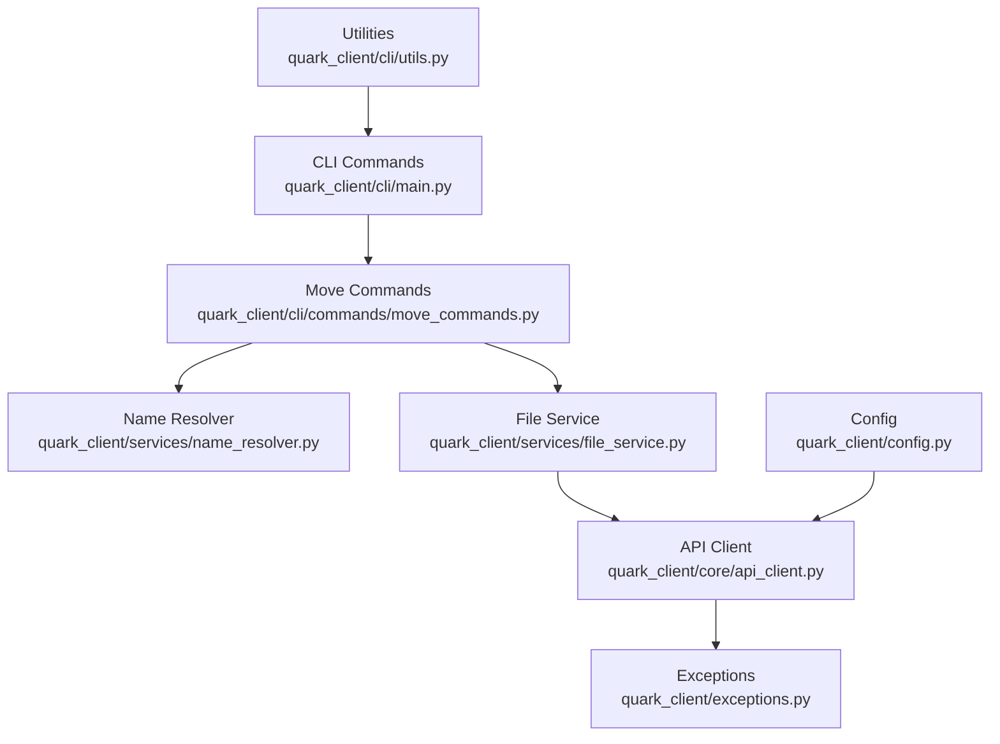
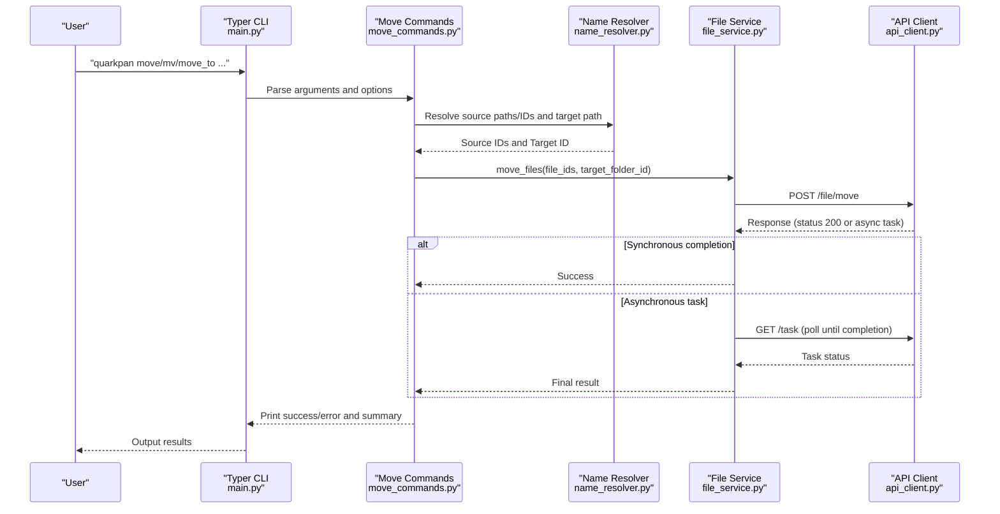
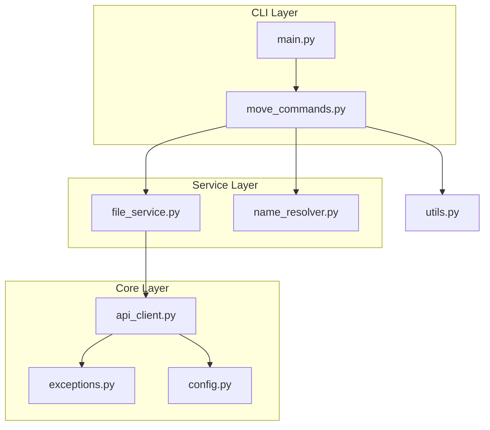

# Move Commands

<cite>
**Referenced Files in This Document**
- [move_commands.py](file://quark_client/cli/commands/move_commands.py)
- [main.py](file://quark_client/cli/main.py)
- [file_service.py](file://quark_client/services/file_service.py)
- [name_resolver.py](file://quark_client/services/name_resolver.py)
- [api_client.py](file://quark_client/core/api_client.py)
- [exceptions.py](file://quark_client/exceptions.py)
- [config.py](file://quark_client/config.py)
- [utils.py](file://quark_client/cli/utils.py)
</cite>

## Table of Contents
1. [Introduction](#introduction)
2. [Project Structure](#project-structure)
3. [Core Components](#core-components)
4. [Architecture Overview](#architecture-overview)
5. [Detailed Component Analysis](#detailed-component-analysis)
6. [Dependency Analysis](#dependency-analysis)
7. [Performance Considerations](#performance-considerations)
8. [Troubleshooting Guide](#troubleshooting-guide)
9. [Conclusion](#conclusion)

## Introduction
This document provides comprehensive documentation for file movement commands in the Quark Pan CLI, covering the move, mv, and move_to operations. It explains destination path resolution, cross-directory moving, and batch move operations. It also documents move semantics, overwrite behavior, conflict resolution strategies, atomic move operations, rollback capabilities, and progress reporting for large transfers. Practical examples demonstrate file organization workflows, automated file sorting scripts, and integration with backup operations. Error handling for permission issues, disk space constraints, and network connectivity problems during moves is addressed.

## Project Structure
The move command functionality spans several modules:
- CLI command definitions and user-facing commands
- Command implementations that parse paths and orchestrate moves
- File service that performs the actual move operation via the API
- Name resolver that resolves human-readable paths to internal IDs
- Core API client that handles HTTP communication and error mapping
- Utilities for error handling and user feedback

**Diagram sources**
- [main.py:252-282](file://quark_client/cli/main.py#L252-L282)
- [move_commands.py:13-169](file://quark_client/cli/commands/move_commands.py#L13-L169)
- [file_service.py:386-473](file://quark_client/services/file_service.py#L386-L473)
- [name_resolver.py:19-74](file://quark_client/services/name_resolver.py#L19-L74)
- [api_client.py:80-183](file://quark_client/core/api_client.py#L80-L183)
- [exceptions.py:23-34](file://quark_client/exceptions.py#L23-L34)
- [config.py:34-63](file://quark_client/config.py#L34-L63)
- [utils.py:87-110](file://quark_client/cli/utils.py#L87-L110)

**Section sources**
- [main.py:252-282](file://quark_client/cli/main.py#L252-L282)
- [move_commands.py:13-169](file://quark_client/cli/commands/move_commands.py#L13-L169)
- [file_service.py:386-473](file://quark_client/services/file_service.py#L386-L473)
- [name_resolver.py:19-74](file://quark_client/services/name_resolver.py#L19-L74)
- [api_client.py:80-183](file://quark_client/core/api_client.py#L80-L183)
- [exceptions.py:23-34](file://quark_client/exceptions.py#L23-L34)
- [config.py:34-63](file://quark_client/config.py#L34-L63)
- [utils.py:87-110](file://quark_client/cli/utils.py#L87-L110)

## Core Components
- CLI commands: move, mv, and move_to are registered as Typer commands in the main CLI entrypoint.
- Move command implementation: parses source paths or IDs, resolves targets, and executes the move operation.
- File service move operation: sends the move request to the API and handles synchronous vs asynchronous completion.
- Name resolver: converts human-readable paths to internal file/folder IDs and validates types.
- API client: manages HTTP requests, authentication, and maps HTTP/API errors to typed exceptions.
- Utilities: provide consistent error handling, user messaging, and path resolution helpers.

Key behaviors:
- Destination path resolution supports both absolute and relative paths and validates that the target is a folder.
- Cross-directory moving is supported by resolving source and target IDs independently.
- Batch move operations accept multiple source paths or IDs and move them to a single target.
- Overwrite behavior and conflict resolution are handled by the underlying API; the CLI surfaces errors and allows users to retry or adjust targets.
- Atomicity and rollback: the API move operation is atomic; if asynchronous, the CLI waits for completion and reports failures.

**Section sources**
- [main.py:252-282](file://quark_client/cli/main.py#L252-L282)
- [move_commands.py:13-169](file://quark_client/cli/commands/move_commands.py#L13-L169)
- [file_service.py:386-473](file://quark_client/services/file_service.py#L386-L473)
- [name_resolver.py:19-74](file://quark_client/services/name_resolver.py#L19-L74)
- [api_client.py:80-183](file://quark_client/core/api_client.py#L80-L183)

## Architecture Overview
The move workflow integrates CLI parsing, path resolution, and API invocation with robust error handling.

**Diagram sources**
- [main.py:252-282](file://quark_client/cli/main.py#L252-L282)
- [move_commands.py:13-169](file://quark_client/cli/commands/move_commands.py#L13-L169)
- [file_service.py:386-473](file://quark_client/services/file_service.py#L386-L473)
- [api_client.py:80-183](file://quark_client/core/api_client.py#L80-L183)

## Detailed Component Analysis

### CLI Commands: move, mv, move_to
- move and mv are aliases that delegate to the same implementation, accepting a list of source paths/IDs and a target path/ID.
- move_to constructs a target folder path from a folder name and parent folder, optionally creating the folder if it does not exist.
- Both commands support a use_id flag to bypass path resolution and operate directly on IDs.

Behavior highlights:
- Validates login state before proceeding.
- Resolves source paths or IDs using the name resolver.
- Validates that the target is a folder.
- Executes the move and prints a summary including whether the operation finished synchronously or asynchronously.

**Section sources**
- [main.py:252-282](file://quark_client/cli/main.py#L252-L282)
- [move_commands.py:13-169](file://quark_client/cli/commands/move_commands.py#L13-L169)

### Move Implementation Details
- Source resolution:
  - If use_id is false, each source path is resolved to a file/folder ID using the name resolver.
  - If use_id is true, the CLI treats the inputs as IDs directly.
- Target resolution:
  - If use_id is false, the target path is resolved to a folder ID and validated to ensure it is a folder.
  - If use_id is true, the target is treated as a folder ID.
- Execution:
  - Calls the file service move_files with the collected IDs.
  - Prints detailed results including task ID and completion status.

Conflict and overwrite behavior:
- The CLI does not implement explicit overwrite logic; conflicts are reported by the API and surfaced as errors.

**Section sources**
- [move_commands.py:13-169](file://quark_client/cli/commands/move_commands.py#L13-L169)

### File Service Move Operation
- Constructs the move payload with action_type set to move, target parent folder ID, and the list of source IDs.
- Sends a POST request to the move endpoint.
- If the response indicates synchronous completion, returns immediately.
- If an asynchronous task is created, polls the task endpoint until completion or failure, respecting a configurable polling interval.

Asynchronous task handling:
- Polls the task endpoint with a retry index.
- Handles task completion and failure states.
- Raises an API error if the task fails or times out.

**Section sources**
- [file_service.py:386-473](file://quark_client/services/file_service.py#L386-L473)

### Name Resolution and Path Validation
- Supports absolute and relative paths, with special handling for trailing slashes indicating folders.
- Validates that intermediate path segments are folders and the final segment is either a file or folder depending on context.
- Caches folder listings to reduce repeated API calls during batch operations.

Resolution behavior:
- Converts human-readable paths to internal IDs.
- Distinguishes between files and folders for validation and error reporting.

**Section sources**
- [name_resolver.py:19-74](file://quark_client/services/name_resolver.py#L19-L74)

### API Client and Error Mapping
- Manages HTTP requests with timeouts and default headers.
- Maps HTTP errors (e.g., 401, 403) and API-level errors to typed exceptions.
- Provides convenience methods for GET and POST requests.

Error handling:
- Authentication errors are mapped to AuthenticationError.
- Network errors are mapped to NetworkError.
- API errors are mapped to APIError with status code and response data.

**Section sources**
- [api_client.py:80-183](file://quark_client/core/api_client.py#L80-L183)
- [exceptions.py:23-34](file://quark_client/exceptions.py#L23-L34)

### Progress Reporting and Large Transfers
- The move operation itself does not expose a progress callback in the current implementation.
- The file service’s download operations demonstrate a pattern for progress callbacks, which can inspire future enhancements for move progress reporting.

**Section sources**
- [file_service.py:833-893](file://quark_client/services/file_service.py#L833-L893)

## Dependency Analysis
The move command stack exhibits clear separation of concerns:
- CLI layer defines commands and argument parsing.
- Command layer orchestrates resolution and execution.
- Service layer encapsulates API interactions and task management.
- Resolver layer abstracts path-to-ID translation.
- Core layer handles HTTP transport and error mapping.

**Diagram sources**
- [main.py:252-282](file://quark_client/cli/main.py#L252-L282)
- [move_commands.py:13-169](file://quark_client/cli/commands/move_commands.py#L13-L169)
- [file_service.py:386-473](file://quark_client/services/file_service.py#L386-L473)
- [name_resolver.py:19-74](file://quark_client/services/name_resolver.py#L19-L74)
- [api_client.py:80-183](file://quark_client/core/api_client.py#L80-L183)
- [exceptions.py:23-34](file://quark_client/exceptions.py#L23-L34)
- [config.py:34-63](file://quark_client/config.py#L34-L63)
- [utils.py:87-110](file://quark_client/cli/utils.py#L87-L110)

**Section sources**
- [main.py:252-282](file://quark_client/cli/main.py#L252-L282)
- [move_commands.py:13-169](file://quark_client/cli/commands/move_commands.py#L13-L169)
- [file_service.py:386-473](file://quark_client/services/file_service.py#L386-L473)
- [name_resolver.py:19-74](file://quark_client/services/name_resolver.py#L19-L74)
- [api_client.py:80-183](file://quark_client/core/api_client.py#L80-L183)
- [exceptions.py:23-34](file://quark_client/exceptions.py#L23-L34)
- [config.py:34-63](file://quark_client/config.py#L34-L63)
- [utils.py:87-110](file://quark_client/cli/utils.py#L87-L110)

## Performance Considerations
- Path resolution caching: The name resolver caches folder listings to minimize repeated API calls during batch operations.
- Asynchronous task polling: The file service polls task completion with a bounded retry count and configurable interval to avoid excessive load.
- Request timeouts: The API client enforces request timeouts to prevent indefinite blocking.

Recommendations:
- For very large batches, consider batching requests to respect API limits and reduce polling overhead.
- Monitor task completion status to avoid unnecessary retries.

**Section sources**
- [name_resolver.py:106-118](file://quark_client/services/name_resolver.py#L106-L118)
- [file_service.py:428-472](file://quark_client/services/file_service.py#L428-L472)
- [api_client.py:40-45](file://quark_client/core/api_client.py#L40-L45)

## Troubleshooting Guide
Common issues and resolutions:
- Authentication errors: The API client maps HTTP 401/403 to AuthenticationError; re-login using the auth command.
- Network errors: The API client maps network failures to NetworkError; verify connectivity and retry.
- Not found errors: The API client raises APIError for invalid paths or missing resources; verify source and target IDs/paths.
- Capacity limit errors: The CLI utility maps capacity-related messages to actionable suggestions (cleanup, empty recycle bin, upgrade).
- Task failures: The file service raises APIError when a move task fails; inspect the task status and retry if appropriate.

Error handling flow:
- CLI commands catch exceptions and delegate to the utility handler for consistent messaging.
- The utility handler categorizes errors and prints user-friendly guidance.

**Section sources**
- [api_client.py:146-182](file://quark_client/core/api_client.py#L146-L182)
- [utils.py:87-110](file://quark_client/cli/utils.py#L87-L110)
- [file_service.py:428-472](file://quark_client/services/file_service.py#L428-L472)

## Conclusion
The move command suite provides a robust, user-friendly interface for moving files and folders within the Quark Pan cloud storage. It supports path resolution, cross-directory moves, and batch operations, with clear error handling and asynchronous task management. While overwrite behavior is governed by the underlying API, the CLI offers informative feedback and actionable suggestions for common issues. Future enhancements could include progress reporting for large transfers and explicit overwrite controls.