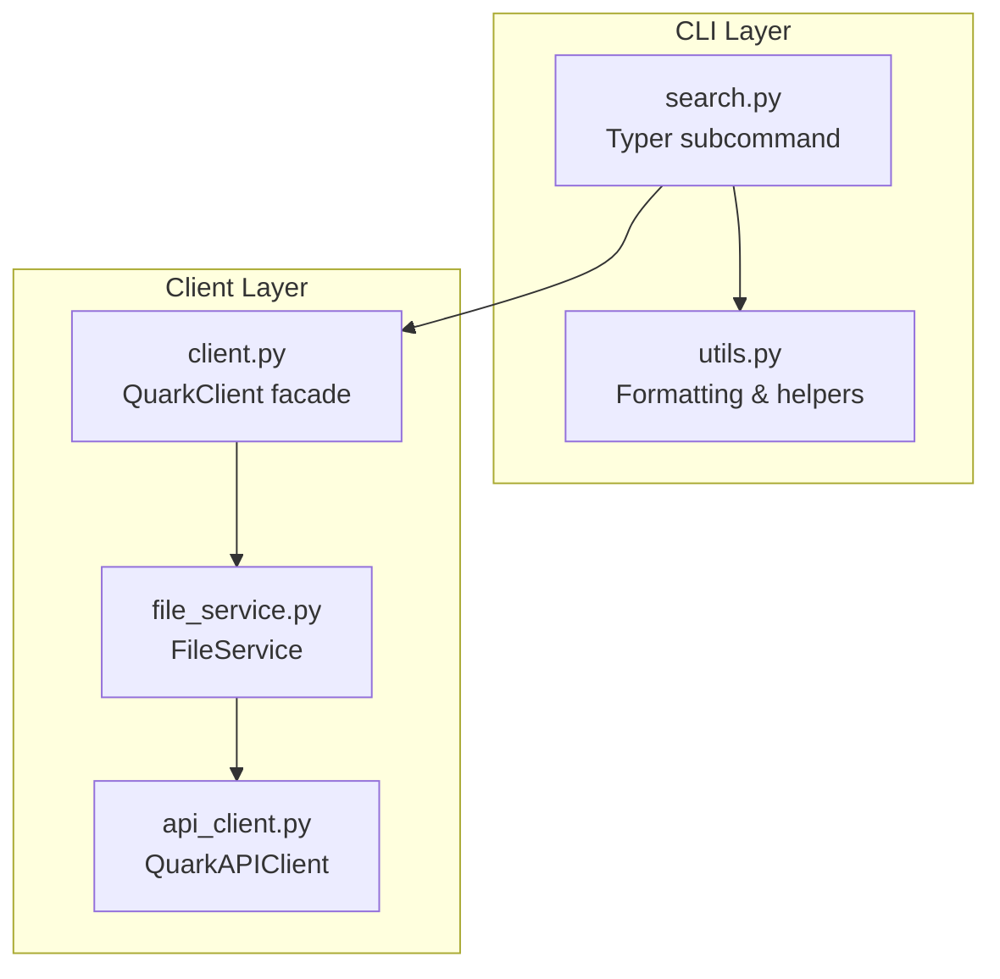
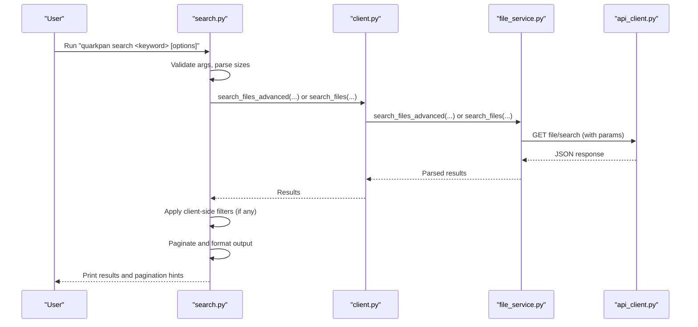
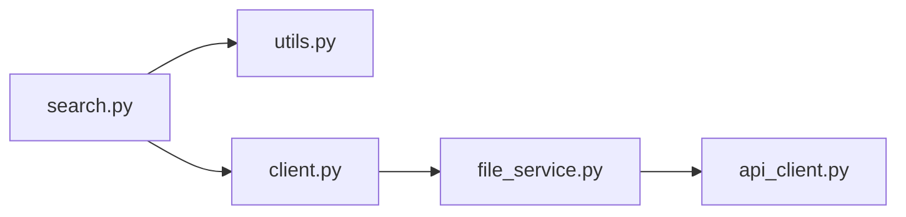

# Search Commands

<cite>
**Referenced Files in This Document**
- [search.py](file://quark_client/cli/commands/search.py)
- [main.py](file://quark_client/cli/main.py)
- [file_service.py](file://quark_client/services/file_service.py)
- [api_client.py](file://quark_client/core/api_client.py)
- [utils.py](file://quark_client/cli/utils.py)
- [client.py](file://quark_client/client.py)
</cite>

## Table of Contents
1. [Introduction](#introduction)
2. [Project Structure](#project-structure)
3. [Core Components](#core-components)
4. [Architecture Overview](#architecture-overview)
5. [Detailed Component Analysis](#detailed-component-analysis)
6. [Dependency Analysis](#dependency-analysis)
7. [Performance Considerations](#performance-considerations)
8. [Troubleshooting Guide](#troubleshooting-guide)
9. [Conclusion](#conclusion)

## Introduction
This document provides comprehensive documentation for the search-related CLI commands in the QuarkPan CLI. It explains search syntax, filtering options (by file type, size ranges), pagination controls, result formatting, and advanced features such as extension-based filtering and size-based filtering. It also covers integration with file management operations and provides troubleshooting guidance for common search failures.

## Project Structure
The search functionality is implemented as a Typer subcommand under the main CLI application. The command delegates to a client service that interacts with the Quark API. The CLI command handles argument parsing, user feedback, and result presentation, while the service layer manages API calls and client-side filtering.

**Diagram sources**
- [search.py:16-43](file://quark_client/cli/commands/search.py#L16-L43)
- [client.py:84-156](file://quark_client/client.py#L84-L156)
- [file_service.py:183-219](file://quark_client/services/file_service.py#L183-L219)
- [api_client.py:184-190](file://quark_client/core/api_client.py#L184-L190)
- [utils.py:26-175](file://quark_client/cli/utils.py#L26-L175)

**Section sources**
- [main.py:38-48](file://quark_client/cli/main.py#L38-L48)
- [search.py:16-43](file://quark_client/cli/commands/search.py#L16-L43)

## Core Components
- CLI search command: Parses arguments, validates input, and orchestrates search execution.
- Advanced filtering: Applies client-side filters for file extensions and size ranges.
- Pagination and formatting: Handles pagination metadata and presents results in two modes (simple and detailed).
- Integration: Works with the broader CLI ecosystem for authentication, navigation, and file operations.

Key capabilities:
- Basic keyword search across the cloud storage.
- Extension-based filtering (supports multiple extensions).
- Size-based filtering (minimum and maximum sizes).
- Pagination with page and size options.
- Result formatting with icons and optional detailed table view.
- Integration with file operations (e.g., moving, downloading) via file IDs shown in results.

**Section sources**
- [search.py:20-43](file://quark_client/cli/commands/search.py#L20-L43)
- [search.py:45-177](file://quark_client/cli/commands/search.py#L45-L177)
- [file_service.py:295-366](file://quark_client/services/file_service.py#L295-L366)

## Architecture Overview
The search command follows a layered architecture:
- CLI command layer: Validates inputs and invokes the client.
- Client facade: Provides convenient methods for higher-level operations.
- Service layer: Implements API interactions and client-side filtering.
- API client: Manages HTTP requests and error handling.

**Diagram sources**
- [search.py:45-87](file://quark_client/cli/commands/search.py#L45-L87)
- [client.py:84-156](file://quark_client/client.py#L84-L156)
- [file_service.py:183-219](file://quark_client/services/file_service.py#L183-L219)
- [api_client.py:184-190](file://quark_client/core/api_client.py#L184-L190)

## Detailed Component Analysis

### CLI Search Command
- Arguments and options:
  - Keyword (optional positional): The search term.
  - Folder scope: folder_id defaults to "0" (full disk).
  - Pagination: page (default 1), size (default 20).
  - Details mode: show_details toggles detailed table view.
  - Filters:
    - Extensions: --ext/-e accepts multiple values.
    - Min/max size: --min-size and --max-size accept human-readable sizes (e.g., 1MB, 100KB).
- Execution logic:
  - If no keyword is provided, prints an error and exits.
  - Determines whether to use advanced filtering based on presence of extensions or size options.
  - Calls the client’s search method and displays results.
  - Formats results with icons, sizes, timestamps, and IDs.
  - Shows pagination hints when applicable.

Advanced filtering behavior:
- If extensions or size bounds are provided, the command uses the advanced search method which fetches more results and applies client-side filtering.
- Otherwise, it uses the basic search method.

Size parsing:
- Supports units KB, MB, GB, TB and shorthand K, M, G, T.
- Case-insensitive and whitespace handling.

Result formatting:
- Simple list view: compact display with icons and sizes for files.
- Detailed table view: includes columns for type, name, size, update time, and ID.

Pagination:
- Computes total pages from metadata and prints navigation hints.

**Section sources**
- [search.py:20-43](file://quark_client/cli/commands/search.py#L20-L43)
- [search.py:45-177](file://quark_client/cli/commands/search.py#L45-L177)
- [search.py:180-209](file://quark_client/cli/commands/search.py#L180-L209)

### Client and Service Layer
- Client facade:
  - Exposes search_files and search_files_advanced methods for convenience.
- File service:
  - search_files: Calls the API endpoint for file search with pagination and highlighting.
  - search_files_advanced: Fetches more results than requested and applies client-side filters for extensions and size ranges, then paginates the filtered set.
- API client:
  - Handles HTTP requests, authentication, and error translation.

Important notes:
- The API does not support folder-scoped search; the folder_id parameter is currently ignored in the search implementation.
- Sorting is handled by the API for basic search; advanced search relies on client-side filtering and pagination.

**Section sources**
- [client.py:84-156](file://quark_client/client.py#L84-L156)
- [file_service.py:183-219](file://quark_client/services/file_service.py#L183-L219)
- [file_service.py:295-366](file://quark_client/services/file_service.py#L295-L366)
- [api_client.py:184-190](file://quark_client/core/api_client.py#L184-L190)

### Result Formatting and Pagination
- Formatting utilities:
  - Icons based on file type.
  - Human-readable file sizes.
  - Formatted timestamps.
- Pagination:
  - Uses metadata total count when available.
  - Calculates total pages and prints navigation hints.

**Section sources**
- [utils.py:26-53](file://quark_client/cli/utils.py#L26-L53)
- [utils.py:135-175](file://quark_client/cli/utils.py#L135-L175)
- [search.py:93-173](file://quark_client/cli/commands/search.py#L93-L173)

### Advanced Features
- Extension filtering:
  - Multiple extensions supported via repeated --ext options.
  - Case-insensitive comparison against file extensions.
- Size filtering:
  - Minimum and maximum sizes parsed from human-readable strings.
  - Client-side filtering applied to the fetched results.
- Sorting:
  - Basic search uses API-side sorting; advanced search uses client-side filtering and pagination.

Note: The implementation does not include regex or wildcard pattern matching for content or filenames. It focuses on extension and size filtering.

**Section sources**
- [search.py:69-87](file://quark_client/cli/commands/search.py#L69-L87)
- [file_service.py:324-366](file://quark_client/services/file_service.py#L324-L366)
- [search.py:180-209](file://quark_client/cli/commands/search.py#L180-L209)

### Integration with File Management Operations
- The search results display file IDs, enabling integration with other CLI commands that operate on file IDs (e.g., moving, downloading).
- Users can copy IDs from the detailed view to use with other commands.

**Section sources**
- [search.py:117-149](file://quark_client/cli/commands/search.py#L117-L149)

## Dependency Analysis
The search command depends on:
- CLI utilities for formatting and printing.
- Client facade for search operations.
- Service layer for API interactions and filtering.
- API client for HTTP communication.

**Diagram sources**
- [search.py:12-14](file://quark_client/cli/commands/search.py#L12-L14)
- [client.py:33-38](file://quark_client/client.py#L33-L38)
- [file_service.py:9-10](file://quark_client/services/file_service.py#L9-L10)
- [api_client.py:12-13](file://quark_client/core/api_client.py#L12-L13)

**Section sources**
- [search.py:12-14](file://quark_client/cli/commands/search.py#L12-L14)
- [client.py:33-38](file://quark_client/client.py#L33-L38)
- [file_service.py:9-10](file://quark_client/services/file_service.py#L9-L10)
- [api_client.py:12-13](file://quark_client/core/api_client.py#L12-L13)

## Performance Considerations
- Advanced filtering fetches more results than requested to improve filtering quality. The service increases the fetch size to a multiple of the requested size and then applies client-side filtering and pagination.
- Pagination metadata is derived from API responses; when metadata is unavailable, the CLI falls back to list length.
- Sorting is performed by the API for basic search, reducing client overhead.

Recommendations:
- Use extension and size filters to reduce result sets when performing advanced searches.
- Increase page size judiciously to minimize round trips while keeping memory usage reasonable.
- For large datasets, prefer narrowing the search scope with filters rather than increasing page size excessively.

**Section sources**
- [file_service.py:328-330](file://quark_client/services/file_service.py#L328-L330)
- [search.py:94-95](file://quark_client/cli/commands/search.py#L94-L95)

## Troubleshooting Guide
Common issues and resolutions:
- Authentication errors:
  - The command checks login status and prompts to log in if needed.
  - API errors indicating authentication failures are handled and displayed with guidance.
- Network errors:
  - Timeouts and network failures are caught and reported.
- Invalid inputs:
  - Missing keyword triggers an immediate exit with a helpful message.
  - Invalid size strings are rejected by the parser and cause an error.
- No results:
  - The command prints a warning when no matches are found.
- Pagination hints:
  - When total results exceed the page size, the command prints navigation hints to move to subsequent pages.

Operational tips:
- Use the detailed view to inspect file IDs and metadata for downstream operations.
- Combine filters to refine results quickly.

**Section sources**
- [search.py:36-39](file://quark_client/cli/commands/search.py#L36-L39)
- [search.py:56-60](file://quark_client/cli/commands/search.py#L56-L60)
- [search.py:89-91](file://quark_client/cli/commands/search.py#L89-L91)
- [utils.py:87-110](file://quark_client/cli/utils.py#L87-L110)

## Conclusion
The search command provides a robust, user-friendly interface for finding files in Quark Cloud Storage. It supports essential filtering by file extension and size, offers flexible pagination and formatting, and integrates seamlessly with other CLI operations through file IDs. While advanced features like regex and wildcard matching are not implemented, the current filtering and pagination model delivers practical performance and usability for everyday file discovery tasks.