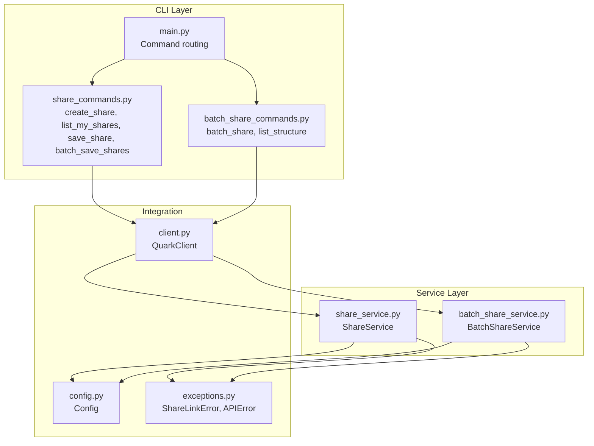
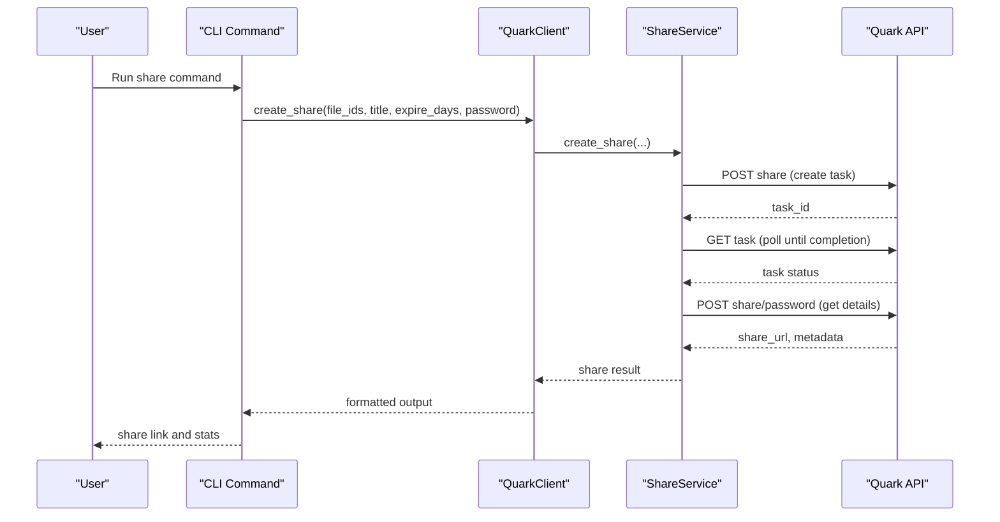
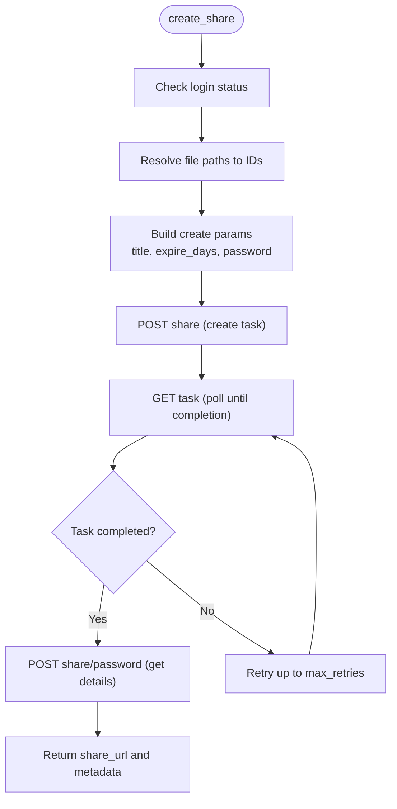
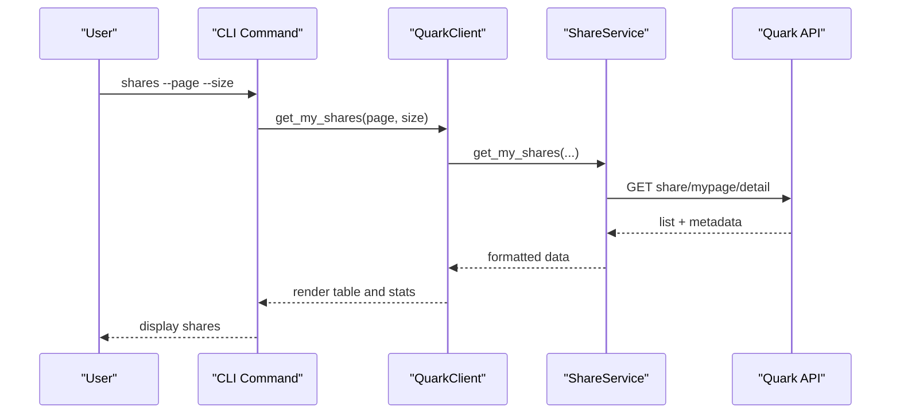
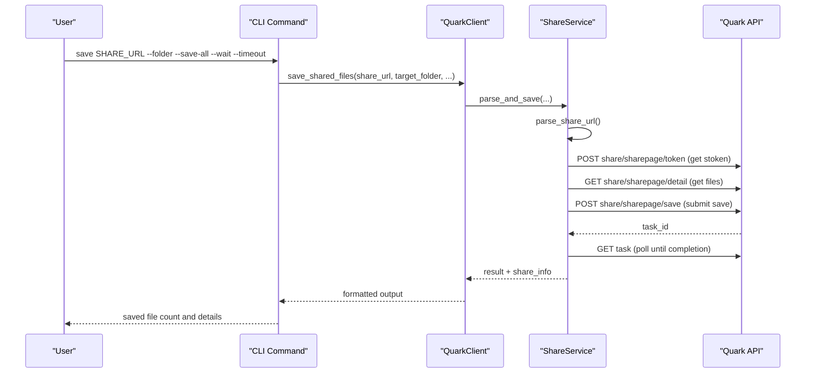
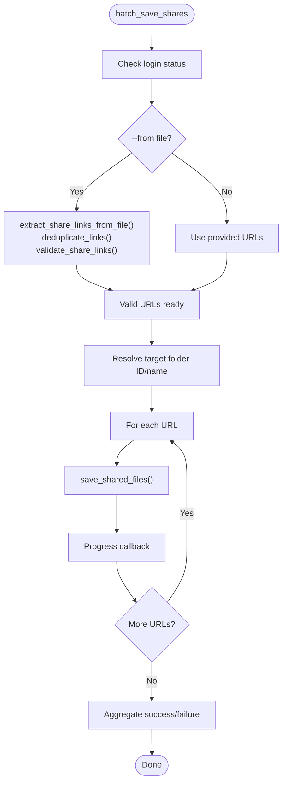
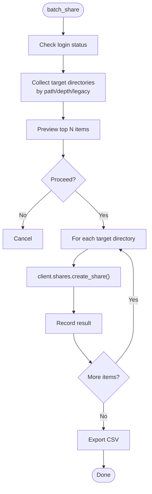
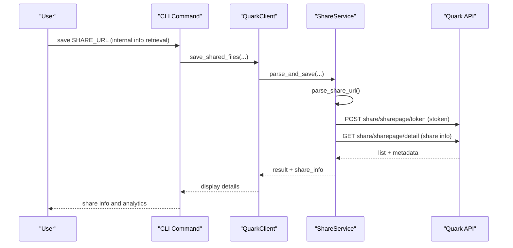
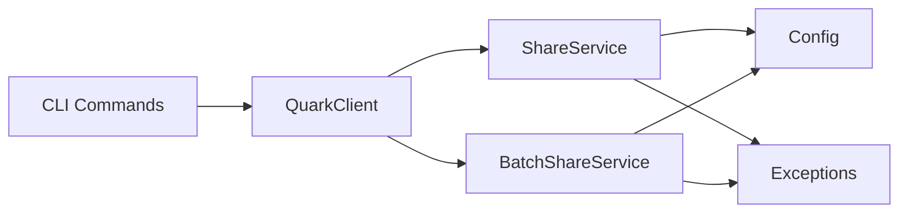

# Share Commands

<cite>
**Referenced Files in This Document**
- [share_commands.py](file://quark_client/cli/commands/share_commands.py)
- [batch_share_commands.py](file://quark_client/cli/commands/batch_share_commands.py)
- [share_service.py](file://quark_client/services/share_service.py)
- [batch_share_service.py](file://quark_client/services/batch_share_service.py)
- [client.py](file://quark_client/client.py)
- [main.py](file://quark_client/cli/main.py)
- [config.py](file://quark_client/config.py)
- [exceptions.py](file://quark_client/exceptions.py)
</cite>

## Table of Contents
1. [Introduction](#introduction)
2. [Project Structure](#project-structure)
3. [Core Components](#core-components)
4. [Architecture Overview](#architecture-overview)
5. [Detailed Component Analysis](#detailed-component-analysis)
6. [Dependency Analysis](#dependency-analysis)
7. [Performance Considerations](#performance-considerations)
8. [Troubleshooting Guide](#troubleshooting-guide)
9. [Conclusion](#conclusion)
10. [Appendices](#appendices)

## Introduction
This document provides comprehensive documentation for share management commands in the Quark Pan CLI. It covers the creation, listing, downloading, and information retrieval of share links, along with advanced features such as bulk sharing, automation workflows, and integration with file organization tasks. It also explains share expiration settings, password protection, view/download analytics, access control, security considerations, revocation procedures, and troubleshooting.

## Project Structure
The share-related functionality spans the CLI commands, services, and client integration layers:
- CLI commands define user-facing commands and argument parsing.
- Services encapsulate API interactions for share creation, listing, saving, and analytics.
- The client integrates services and exposes high-level methods to the CLI.
- Configuration and exception handling support robust operation.

**Diagram sources**
- [main.py:155-250](file://quark_client/cli/main.py#L155-L250)
- [share_commands.py:121-525](file://quark_client/cli/commands/share_commands.py#L121-L525)
- [batch_share_commands.py:15-221](file://quark_client/cli/commands/batch_share_commands.py#L15-L221)
- [share_service.py:13-742](file://quark_client/services/share_service.py#L13-L742)
- [batch_share_service.py:16-572](file://quark_client/services/batch_share_service.py#L16-L572)
- [client.py:18-405](file://quark_client/client.py#L18-L405)
- [config.py:34-63](file://quark_client/config.py#L34-L63)
- [exceptions.py:8-50](file://quark_client/exceptions.py#L8-L50)

**Section sources**
- [main.py:155-250](file://quark_client/cli/main.py#L155-L250)
- [share_commands.py:121-525](file://quark_client/cli/commands/share_commands.py#L121-L525)
- [batch_share_commands.py:15-221](file://quark_client/cli/commands/batch_share_commands.py#L15-L221)
- [share_service.py:13-742](file://quark_client/services/share_service.py#L13-L742)
- [batch_share_service.py:16-572](file://quark_client/services/batch_share_service.py#L16-L572)
- [client.py:18-405](file://quark_client/client.py#L18-L405)
- [config.py:34-63](file://quark_client/config.py#L34-L63)
- [exceptions.py:8-50](file://quark_client/exceptions.py#L8-L50)

## Core Components
- CLI Commands:
  - create_share: Generates share links for files/folders with optional title, expiration, and password.
  - list_my_shares: Lists created shares with pagination and analytics summaries.
  - save_share: Downloads or saves shared content to a target folder.
  - batch_save_shares: Bulk saves multiple share URLs with progress reporting.
  - batch_share: Automated bulk sharing of directories with CSV export.
  - list_structure: Inspects directory structure for targeted sharing.
- Services:
  - ShareService: Manages share creation, token acquisition, share info retrieval, saving shared files, and analytics.
  - BatchShareService: Collects target directories, creates shares, and exports results to CSV.
- Client Integration:
  - QuarkClient: Exposes high-level methods for share operations and delegates to services.
- Configuration and Exceptions:
  - Config: Defines base URLs for share APIs and defaults.
  - ShareLinkError and APIError: Specialized exceptions for share-related failures.

**Section sources**
- [share_commands.py:121-525](file://quark_client/cli/commands/share_commands.py#L121-L525)
- [batch_share_commands.py:15-221](file://quark_client/cli/commands/batch_share_commands.py#L15-L221)
- [share_service.py:13-742](file://quark_client/services/share_service.py#L13-L742)
- [batch_share_service.py:16-572](file://quark_client/services/batch_share_service.py#L16-L572)
- [client.py:18-405](file://quark_client/client.py#L18-L405)
- [config.py:34-63](file://quark_client/config.py#L34-L63)
- [exceptions.py:8-50](file://quark_client/exceptions.py#L8-L50)

## Architecture Overview
The share workflow follows a layered architecture:
- CLI commands parse arguments and orchestrate operations.
- The client mediates between CLI and services.
- Services interact with Quark APIs for share creation, token retrieval, and saving.
- Analytics and metadata are surfaced to the user via CLI outputs.

**Diagram sources**
- [share_commands.py:121-242](file://quark_client/cli/commands/share_commands.py#L121-L242)
- [share_service.py:75-172](file://quark_client/services/share_service.py#L75-L172)
- [client.py:294-314](file://quark_client/client.py#L294-L314)

## Detailed Component Analysis

### create_share (Generate Share Links)
- Purpose: Create public or private share links for one or more files/folders.
- Key features:
  - Title customization.
  - Expiration control (permanent or days-based).
  - Password protection (private link).
  - Duplicate detection and reuse to avoid redundant shares.
  - Smart batching with progress callbacks.
- Workflow:
  - Resolve file paths to IDs (or accept IDs).
  - Call ShareService.create_share or smart_batch_create_shares.
  - Poll task status until completion.
  - Retrieve share details and return share_url.
- Output: Rich terminal table with status, share URL, and title.

**Diagram sources**
- [share_commands.py:121-242](file://quark_client/cli/commands/share_commands.py#L121-L242)
- [share_service.py:75-172](file://quark_client/services/share_service.py#L75-L172)

**Section sources**
- [share_commands.py:121-242](file://quark_client/cli/commands/share_commands.py#L121-L242)
- [share_service.py:75-172](file://quark_client/services/share_service.py#L75-L172)
- [client.py:294-314](file://quark_client/client.py#L294-L314)

### list_my_shares (View Created Shares)
- Purpose: Display a paginated list of user-created shares with metadata and analytics.
- Features:
  - Pagination with page and size options.
  - Metadata: title, share URL, type (file/folder), file count, creation time, status, click_pv.
  - Aggregate statistics: total clicks, saves, downloads.
- Output: Rich table with icons and formatted timestamps.

**Diagram sources**
- [share_commands.py:244-340](file://quark_client/cli/commands/share_commands.py#L244-L340)
- [share_service.py:173-194](file://quark_client/services/share_service.py#L173-L194)

**Section sources**
- [share_commands.py:244-340](file://quark_client/cli/commands/share_commands.py#L244-L340)
- [share_service.py:173-194](file://quark_client/services/share_service.py#L173-L194)

### save_share (Download Shared Content)
- Purpose: Save files from a share URL into a target folder.
- Options:
  - Target folder resolution (existing or auto-created).
  - Save all files or filtered subset.
  - Wait for completion with timeout.
- Workflow:
  - Parse share URL to extract share_id and optional password.
  - Obtain stoken via share API.
  - Fetch share details and file list.
  - Submit save request and optionally wait for task completion.

**Diagram sources**
- [share_commands.py:342-418](file://quark_client/cli/commands/share_commands.py#L342-L418)
- [share_service.py:455-524](file://quark_client/services/share_service.py#L455-L524)
- [client.py:327-354](file://quark_client/client.py#L327-L354)

**Section sources**
- [share_commands.py:342-418](file://quark_client/cli/commands/share_commands.py#L342-L418)
- [share_service.py:455-524](file://quark_client/services/share_service.py#L455-L524)
- [client.py:327-354](file://quark_client/client.py#L327-L354)

### batch_save_shares (Bulk Save)
- Purpose: Process multiple share URLs with progress reporting and CSV-like feedback.
- Features:
  - Extract URLs from a file (with deduplication and validation).
  - Target folder resolution and optional subfolder creation per share.
  - Progress callback and aggregated success/failure counts.

**Diagram sources**
- [share_commands.py:420-525](file://quark_client/cli/commands/share_commands.py#L420-L525)
- [share_service.py:525-581](file://quark_client/services/share_service.py#L525-L581)

**Section sources**
- [share_commands.py:420-525](file://quark_client/cli/commands/share_commands.py#L420-L525)
- [share_service.py:525-581](file://quark_client/services/share_service.py#L525-L581)

### batch_share (Automated Bulk Sharing)
- Purpose: Automatically discover directories and create share links with CSV export.
- Features:
  - Flexible collection modes: default legacy scanning, target directory mode, depth-based scanning.
  - Exclude patterns and share level filtering (folders/files/both).
  - Dry-run mode for preview.
  - Export results to CSV with share title, URL, and path.

**Diagram sources**
- [batch_share_commands.py:15-221](file://quark_client/cli/commands/batch_share_commands.py#L15-L221)
- [batch_share_service.py:31-63](file://quark_client/services/batch_share_service.py#L31-L63)
- [batch_share_service.py:405-478](file://quark_client/services/batch_share_service.py#L405-L478)

**Section sources**
- [batch_share_commands.py:15-221](file://quark_client/cli/commands/batch_share_commands.py#L15-L221)
- [batch_share_service.py:31-63](file://quark_client/services/batch_share_service.py#L31-L63)
- [batch_share_service.py:405-478](file://quark_client/services/batch_share_service.py#L405-L478)

### share_info (Display Share Details)
- Purpose: Retrieve and present share metadata and analytics.
- Implementation:
  - Parse share URL to extract share_id and optional password.
  - Obtain stoken and fetch share details including file list, banner, and share metadata.
  - Present file count, click_pv, save_pv, download_pv, and other metrics.

**Diagram sources**
- [share_service.py:455-524](file://quark_client/services/share_service.py#L455-L524)
- [client.py:327-354](file://quark_client/client.py#L327-L354)

**Section sources**
- [share_service.py:455-524](file://quark_client/services/share_service.py#L455-L524)
- [client.py:327-354](file://quark_client/client.py#L327-L354)

## Dependency Analysis
- CLI depends on QuarkClient for share operations.
- QuarkClient composes ShareService and BatchShareService.
- ShareService and BatchShareService depend on Config for base URLs and on API client for HTTP requests.
- Exceptions are raised for share link parsing and API errors.

**Diagram sources**
- [main.py:155-250](file://quark_client/cli/main.py#L155-L250)
- [client.py:18-405](file://quark_client/client.py#L18-L405)
- [share_service.py:13-742](file://quark_client/services/share_service.py#L13-L742)
- [batch_share_service.py:16-572](file://quark_client/services/batch_share_service.py#L16-L572)
- [config.py:34-63](file://quark_client/config.py#L34-L63)
- [exceptions.py:8-50](file://quark_client/exceptions.py#L8-L50)

**Section sources**
- [main.py:155-250](file://quark_client/cli/main.py#L155-L250)
- [client.py:18-405](file://quark_client/client.py#L18-L405)
- [share_service.py:13-742](file://quark_client/services/share_service.py#L13-L742)
- [batch_share_service.py:16-572](file://quark_client/services/batch_share_service.py#L16-L572)
- [config.py:34-63](file://quark_client/config.py#L34-L63)
- [exceptions.py:8-50](file://quark_client/exceptions.py#L8-L50)

## Performance Considerations
- Batch operations:
  - Use smart_batch_create_shares to reuse existing shares and reduce API calls.
  - batch_save_shares supports progress callbacks and timeouts to manage long-running tasks.
- Polling:
  - Share creation and save tasks are polled with bounded retries and delays.
- Concurrency:
  - CLI-level loops process items sequentially; consider external orchestration for parallelism.
- Network:
  - Configurable timeouts and retry settings minimize transient failures.

[No sources needed since this section provides general guidance]

## Troubleshooting Guide
Common issues and resolutions:
- Not logged in:
  - Ensure authentication before running share commands.
- Invalid share URL:
  - Use validate_share_links to filter malformed links.
  - Verify share_id extraction and password parsing.
- Capacity or permission errors:
  - Transient capacity limit errors halt retries early; free space or adjust quotas.
  - Access denied or unauthorized indicates missing permissions or expired share.
- Timeout during save:
  - Increase timeout or check network stability.
- Duplicate shares:
  - Enable duplicate checking to reuse existing shares.

**Section sources**
- [share_commands.py:86-118](file://quark_client/cli/commands/share_commands.py#L86-L118)
- [share_service.py:377-453](file://quark_client/services/share_service.py#L377-L453)
- [exceptions.py:42-44](file://quark_client/exceptions.py#L42-L44)

## Conclusion
The share management commands provide a robust, automated solution for creating, listing, saving, and organizing shared content. With built-in analytics, bulk operations, and strong error handling, they integrate seamlessly with file organization workflows. Proper use of expiration, password protection, and revocation ensures secure and controlled sharing.

[No sources needed since this section summarizes without analyzing specific files]

## Appendices

### Share Settings and Capabilities
- Expiration:
  - Permanent or days-based expiration supported during creation.
- Password Protection:
  - Private links with optional passwords; stoken required for access.
- View Count Limits and Download Restrictions:
  - Analytics include click_pv, save_pv, download_pv; restrictions enforced server-side.
- Link Formats:
  - Standard https://pan.quark.cn/s/{share_id} and variants; password extraction supported.
- Access Control:
  - Requires valid stoken; password verification when present.
- Analytics:
  - Per-share metrics surfaced via list_my_shares and internal share info retrieval.

**Section sources**
- [share_service.py:196-247](file://quark_client/services/share_service.py#L196-L247)
- [share_service.py:280-311](file://quark_client/services/share_service.py#L280-L311)
- [share_service.py:173-194](file://quark_client/services/share_service.py#L173-L194)

### Revocation Procedures
- Delete share:
  - Use delete_share to revoke a share by share_id.
- Notes:
  - Immediate effect on access; ensure backup copies if needed.

**Section sources**
- [share_service.py:607-621](file://quark_client/services/share_service.py#L607-L621)

### Automation and Integration Examples
- Workflow automation:
  - Use batch_share to scan directories and export CSV for record keeping.
  - Combine with external schedulers to periodically refresh share links.
- Bulk share operations:
  - Use batch_save_shares to process lists of URLs from files.
- Integration with file organization:
  - Use list_my_shares to audit and clean up outdated shares.
  - Use save_share to consolidate shared content into organized folders.

**Section sources**
- [batch_share_commands.py:15-221](file://quark_client/cli/commands/batch_share_commands.py#L15-L221)
- [share_commands.py:420-525](file://quark_client/cli/commands/share_commands.py#L420-L525)
- [share_commands.py:244-340](file://quark_client/cli/commands/share_commands.py#L244-L340)