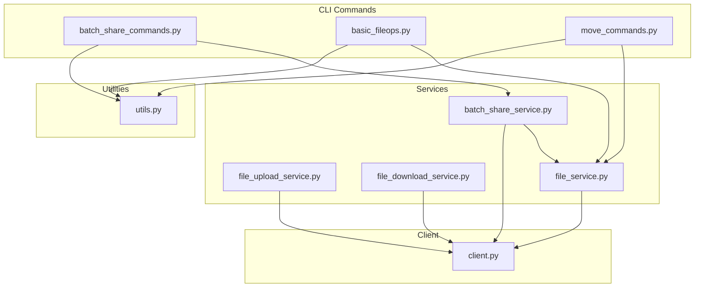
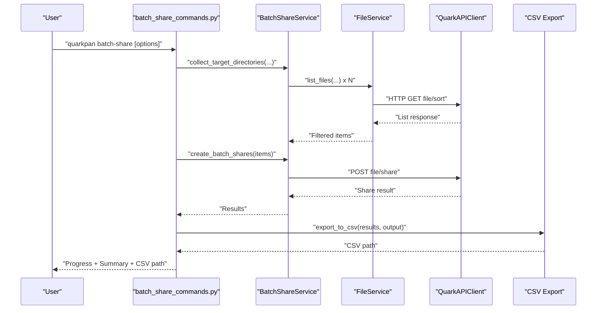
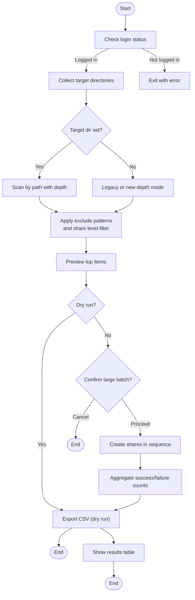
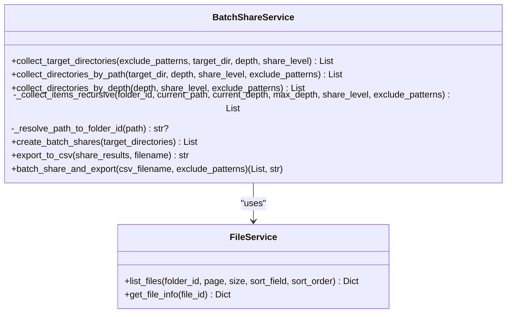
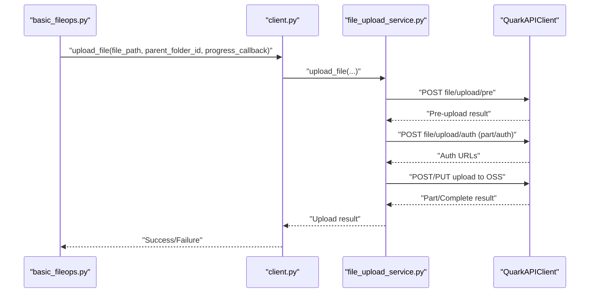
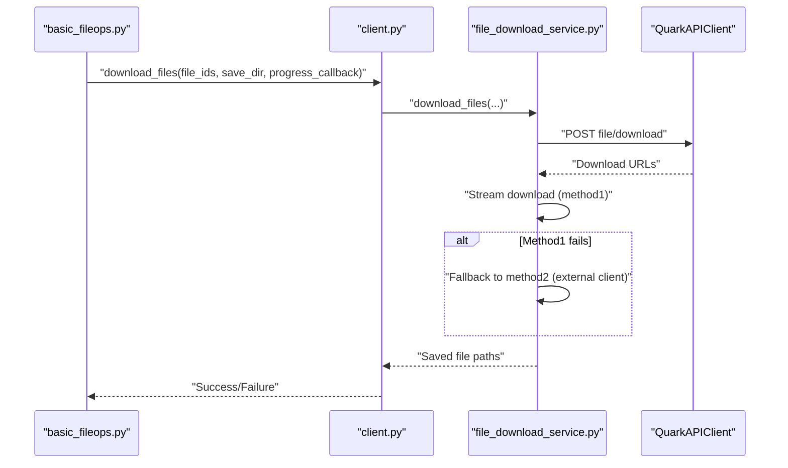
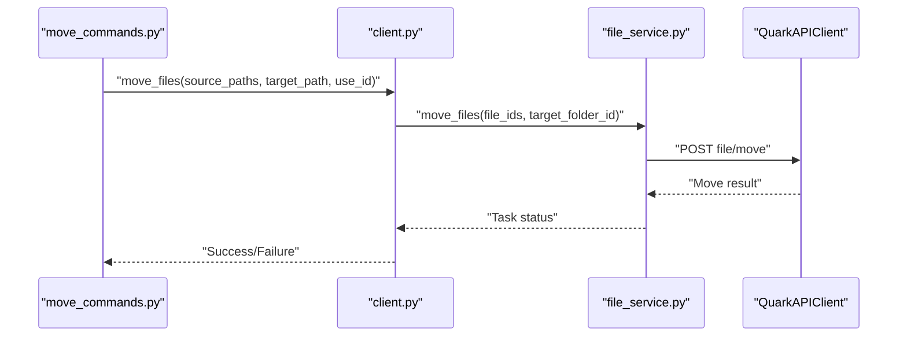
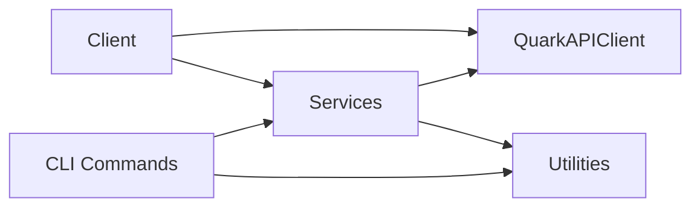

# Batch Processing

<cite>
**Referenced Files in This Document**
- [batch_share_commands.py](file://quark_client/cli/commands/batch_share_commands.py)
- [batch_share_service.py](file://quark_client/services/batch_share_service.py)
- [basic_fileops.py](file://quark_client/cli/commands/basic_fileops.py)
- [move_commands.py](file://quark_client/cli/commands/move_commands.py)
- [file_upload_service.py](file://quark_client/services/file_upload_service.py)
- [file_download_service.py](file://quark_client/services/file_download_service.py)
- [file_service.py](file://quark_client/services/file_service.py)
- [client.py](file://quark_client/client.py)
- [utils.py](file://quark_client/cli/utils.py)
</cite>

## Table of Contents
1. [Introduction](#introduction)
2. [Project Structure](#project-structure)
3. [Core Components](#core-components)
4. [Architecture Overview](#architecture-overview)
5. [Detailed Component Analysis](#detailed-component-analysis)
6. [Dependency Analysis](#dependency-analysis)
7. [Performance Considerations](#performance-considerations)
8. [Troubleshooting Guide](#troubleshooting-guide)
9. [Conclusion](#conclusion)
10. [Appendices](#appendices)

## Introduction
This document explains the batch processing capabilities of the Quark Manager project, focusing on automated operations and scripting support. It covers:
- Batch share functionality: directory scanning, filtering, CSV output, and progress tracking
- Batch file operations: bulk uploads, downloads, moves, and deletions
- Concurrency control and error handling
- Scripting patterns, parameter configuration, and integration with external tools
- Practical workflows, performance optimization, monitoring, error recovery, retries, and best practices for large-scale operations

## Project Structure
The batch processing features are implemented across CLI command modules, service modules, and a central client that orchestrates operations.

**Diagram sources**
- [batch_share_commands.py:1-275](file://quark_client/cli/commands/batch_share_commands.py#L1-L275)
- [batch_share_service.py:1-572](file://quark_client/services/batch_share_service.py#L1-L572)
- [basic_fileops.py:1-406](file://quark_client/cli/commands/basic_fileops.py#L1-L406)
- [move_commands.py:1-169](file://quark_client/cli/commands/move_commands.py#L1-L169)
- [file_upload_service.py:1-891](file://quark_client/services/file_upload_service.py#L1-L891)
- [file_download_service.py:1-301](file://quark_client/services/file_download_service.py#L1-L301)
- [file_service.py:1-893](file://quark_client/services/file_service.py#L1-L893)
- [client.py:1-405](file://quark_client/client.py#L1-L405)
- [utils.py:1-273](file://quark_client/cli/utils.py#L1-L273)

**Section sources**
- [batch_share_commands.py:1-275](file://quark_client/cli/commands/batch_share_commands.py#L1-L275)
- [batch_share_service.py:1-572](file://quark_client/services/batch_share_service.py#L1-L572)
- [basic_fileops.py:1-406](file://quark_client/cli/commands/basic_fileops.py#L1-L406)
- [move_commands.py:1-169](file://quark_client/cli/commands/move_commands.py#L1-L169)
- [file_upload_service.py:1-891](file://quark_client/services/file_upload_service.py#L1-L891)
- [file_download_service.py:1-301](file://quark_client/services/file_download_service.py#L1-L301)
- [file_service.py:1-893](file://quark_client/services/file_service.py#L1-L893)
- [client.py:1-405](file://quark_client/client.py#L1-L405)
- [utils.py:1-273](file://quark_client/cli/utils.py#L1-L273)

## Core Components
- Batch share CLI and service: directory scanning, filtering, CSV export, and progress reporting
- File operations CLI: create, delete, rename, info, upload, download, and move
- Upload service: multipart/single-part upload with hashing and retry logic
- Download service: single and batch download with progress callbacks
- File service: list, search, move, path resolution, and recursive download helpers
- Client facade: exposes high-level APIs for batch operations and integrates services

Key capabilities:
- Directory scanning with flexible depth and share-level filters
- CSV export of results with timestamps and statuses
- Progress bars and rich terminal output
- Robust error handling and logging
- Path resolution and ID-based operations

**Section sources**
- [batch_share_commands.py:15-221](file://quark_client/cli/commands/batch_share_commands.py#L15-L221)
- [batch_share_service.py:31-572](file://quark_client/services/batch_share_service.py#L31-L572)
- [file_service.py:25-893](file://quark_client/services/file_service.py#L25-L893)
- [file_upload_service.py:28-800](file://quark_client/services/file_upload_service.py#L28-L800)
- [file_download_service.py:25-301](file://quark_client/services/file_download_service.py#L25-L301)
- [client.py:170-387](file://quark_client/client.py#L170-L387)

## Architecture Overview
The batch processing architecture follows a layered design:
- CLI commands accept parameters and orchestrate operations
- Services encapsulate business logic (scanning, filtering, sharing, uploading, downloading)
- The client provides a unified interface to services and handles authentication
- Utilities provide shared helpers for logging, formatting, and progress

**Diagram sources**
- [batch_share_commands.py:38-221](file://quark_client/cli/commands/batch_share_commands.py#L38-L221)
- [batch_share_service.py:31-572](file://quark_client/services/batch_share_service.py#L31-L572)
- [file_service.py:25-60](file://quark_client/services/file_service.py#L25-L60)
- [client.py:170-314](file://quark_client/client.py#L170-L314)

## Detailed Component Analysis

### Batch Share Workflow
The batch share workflow scans directories, filters items, creates shares, exports CSV, and reports progress.

Key parameters:
- Output CSV filename
- Exclude patterns (directories to skip)
- Dry run mode
- Target directory (optional)
- Scan depth (default 3)
- Share level: folders, files, or both

Progress tracking:
- Rich progress bars during scanning and share creation
- Summary statistics and CSV export

Error handling:
- Graceful handling of missing directories and API errors
- CSV records failures with error messages

**Section sources**
- [batch_share_commands.py:15-221](file://quark_client/cli/commands/batch_share_commands.py#L15-L221)
- [batch_share_service.py:31-572](file://quark_client/services/batch_share_service.py#L31-L572)

### Directory Scanning and Filtering
The service supports:
- Legacy four-level scanning (maintained for backward compatibility)
- Flexible depth scanning from a given directory
- Exclusion patterns and share-level filtering (folders/files/both)

**Diagram sources**
- [batch_share_service.py:16-572](file://quark_client/services/batch_share_service.py#L16-L572)
- [file_service.py:13-60](file://quark_client/services/file_service.py#L13-L60)

**Section sources**
- [batch_share_service.py:31-572](file://quark_client/services/batch_share_service.py#L31-L572)
- [file_service.py:25-60](file://quark_client/services/file_service.py#L25-L60)

### CSV Output Generation
The service exports a CSV file containing:
- Share title
- Share URL
- Full path
- Created time

It ensures the filename ends with .csv and writes headers and rows for both successes and failures.

**Section sources**
- [batch_share_service.py:480-533](file://quark_client/services/batch_share_service.py#L480-L533)

### Batch File Operations

#### Uploads
- Single-file upload with progress callbacks
- Automatic selection between single-part (<5MB) and multi-part (>5MB) strategies
- Hash calculation and incremental hash context for multi-part
- Retry logic with exponential backoff for failed parts

Best practices:
- Use progress callbacks for long-running uploads
- Respect network conditions; adjust chunk sizes if needed
- Monitor upload_id and task_id for diagnostics

**Diagram sources**
- [basic_fileops.py:335-406](file://quark_client/cli/commands/basic_fileops.py#L335-L406)
- [file_upload_service.py:28-470](file://quark_client/services/file_upload_service.py#L28-L470)
- [client.py:274-292](file://quark_client/client.py#L274-L292)

**Section sources**
- [basic_fileops.py:335-406](file://quark_client/cli/commands/basic_fileops.py#L335-L406)
- [file_upload_service.py:28-470](file://quark_client/services/file_upload_service.py#L28-L470)
- [client.py:274-292](file://quark_client/client.py#L274-L292)

#### Downloads
- Single and batch downloads with progress callbacks
- Two download strategies: API session and external client fallback
- Recursive folder download with progress reporting

Best practices:
- Use batch download for multiple files
- Implement progress callbacks to monitor throughput
- Handle 403 errors gracefully (expected by anti-bot checks)

**Diagram sources**
- [basic_fileops.py:259-301](file://quark_client/cli/commands/basic_fileops.py#L259-L301)
- [file_download_service.py:97-301](file://quark_client/services/file_download_service.py#L97-L301)
- [client.py:100-102](file://quark_client/client.py#L100-L102)

**Section sources**
- [basic_fileops.py:259-301](file://quark_client/cli/commands/basic_fileops.py#L259-L301)
- [file_download_service.py:97-301](file://quark_client/services/file_download_service.py#L97-L301)
- [client.py:100-102](file://quark_client/client.py#L100-L102)

#### Moves and Deletes
- Move files to a target folder with optional ID-based operations
- Delete files by ID or path with confirmation prompts
- Rename files by ID or path

Best practices:
- Resolve paths to IDs for reliability
- Use async task polling for large batches
- Confirm destructive operations

**Diagram sources**
- [move_commands.py:13-96](file://quark_client/cli/commands/move_commands.py#L13-L96)
- [file_service.py:386-473](file://quark_client/services/file_service.py#L386-L473)
- [client.py:370-387](file://quark_client/client.py#L370-L387)

**Section sources**
- [move_commands.py:13-96](file://quark_client/cli/commands/move_commands.py#L13-L96)
- [file_service.py:386-473](file://quark_client/services/file_service.py#L386-L473)
- [client.py:370-387](file://quark_client/client.py#L370-L387)

### Scripting Patterns and Parameter Configuration
Common scripting patterns:
- Dry-run mode to preview targets before action
- Exclusion patterns to skip unwanted directories
- Depth-based scanning for targeted operations
- CSV export for audit trails and downstream processing

Parameter configuration:
- CLI options for batch-share: output, exclude, dry-run, target-dir, depth, share-level
- CLI options for file operations: force, use-id, create-dirs, folder-path
- Progress callbacks for uploads/downloads to integrate with external monitoring

Integration with external tools:
- CSV output can be consumed by spreadsheets or ETL pipelines
- Use shell scripts to chain commands and schedule operations
- Combine with cron/systemd timers for periodic maintenance

**Section sources**
- [batch_share_commands.py:15-22](file://quark_client/cli/commands/batch_share_commands.py#L15-L22)
- [basic_fileops.py:45-109](file://quark_client/cli/commands/basic_fileops.py#L45-L109)
- [utils.py:87-110](file://quark_client/cli/utils.py#L87-L110)

## Dependency Analysis
The batch processing stack depends on:
- CLI commands for user interaction and parameter parsing
- Services for core logic (scanning, filtering, sharing, uploading, downloading)
- Client for unified API access and authentication
- Utilities for logging, formatting, and progress

**Diagram sources**
- [batch_share_commands.py:38-46](file://quark_client/cli/commands/batch_share_commands.py#L38-L46)
- [batch_share_service.py:19-29](file://quark_client/services/batch_share_service.py#L19-L29)
- [client.py:18-38](file://quark_client/client.py#L18-L38)
- [utils.py:17-24](file://quark_client/cli/utils.py#L17-L24)

**Section sources**
- [batch_share_commands.py:38-46](file://quark_client/cli/commands/batch_share_commands.py#L38-L46)
- [batch_share_service.py:19-29](file://quark_client/services/batch_share_service.py#L19-L29)
- [client.py:18-38](file://quark_client/client.py#L18-L38)
- [utils.py:17-24](file://quark_client/cli/utils.py#L17-L24)

## Performance Considerations
- Uploads:
  - Multi-part strategy improves reliability for large files
  - Incremental hash context reduces compute overhead
  - Retry with exponential backoff prevents transient failures
- Downloads:
  - Streamed downloads minimize memory usage
  - Fallback methods handle anti-bot protections
- Scanning:
  - Limit depth and apply exclusion patterns to reduce API calls
  - Use share-level filters to narrow targets
- Progress:
  - Use callbacks to update dashboards or logs
  - Batch operations benefit from aggregated progress updates

[No sources needed since this section provides general guidance]

## Troubleshooting Guide
Common issues and resolutions:
- Authentication errors: re-login using the auth command
- Network failures: retry operations; check connectivity
- Capacity limits: free up space or upgrade storage
- Path resolution failures: verify paths and permissions
- Share creation failures: check exclusions and target availability

Error handling patterns:
- Centralized error handler prints actionable messages
- CSV export includes failure reasons for traceability
- Logging captures detailed context for debugging

**Section sources**
- [utils.py:87-110](file://quark_client/cli/utils.py#L87-L110)
- [batch_share_service.py:480-533](file://quark_client/services/batch_share_service.py#L480-L533)

## Conclusion
The batch processing subsystem provides robust, scriptable operations for scanning, sharing, uploading, downloading, moving, and deleting files. It emphasizes reliability through filtering, CSV auditing, progress tracking, and resilient error handling. For large-scale operations, combine dry runs, targeted depths, and CSV-driven workflows with external scheduling and monitoring.

[No sources needed since this section summarizes without analyzing specific files]

## Appendices

### Practical Workflows
- Batch share:
  - Dry-run to preview targets
  - Adjust depth and share-level filters
  - Export CSV for record keeping
- Bulk upload:
  - Use progress callbacks for monitoring
  - Split large batches to manage retries
- Bulk download:
  - Use batch download for multiple files
  - Implement progress callbacks for dashboards
- Bulk move:
  - Resolve paths to IDs for reliability
  - Confirm destructive actions

[No sources needed since this section provides general guidance]