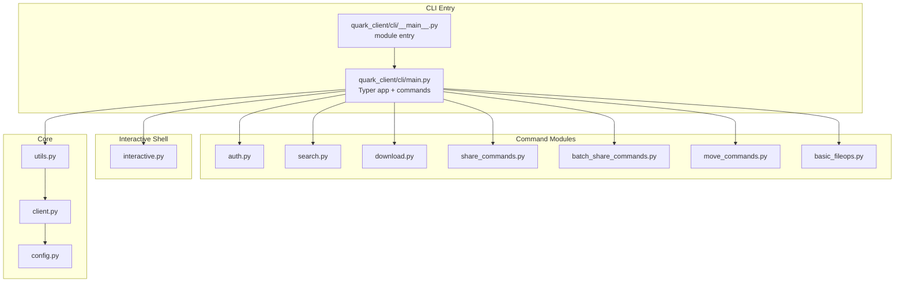
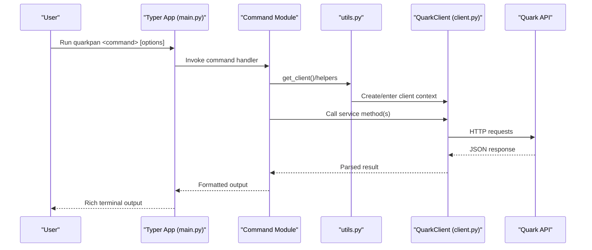
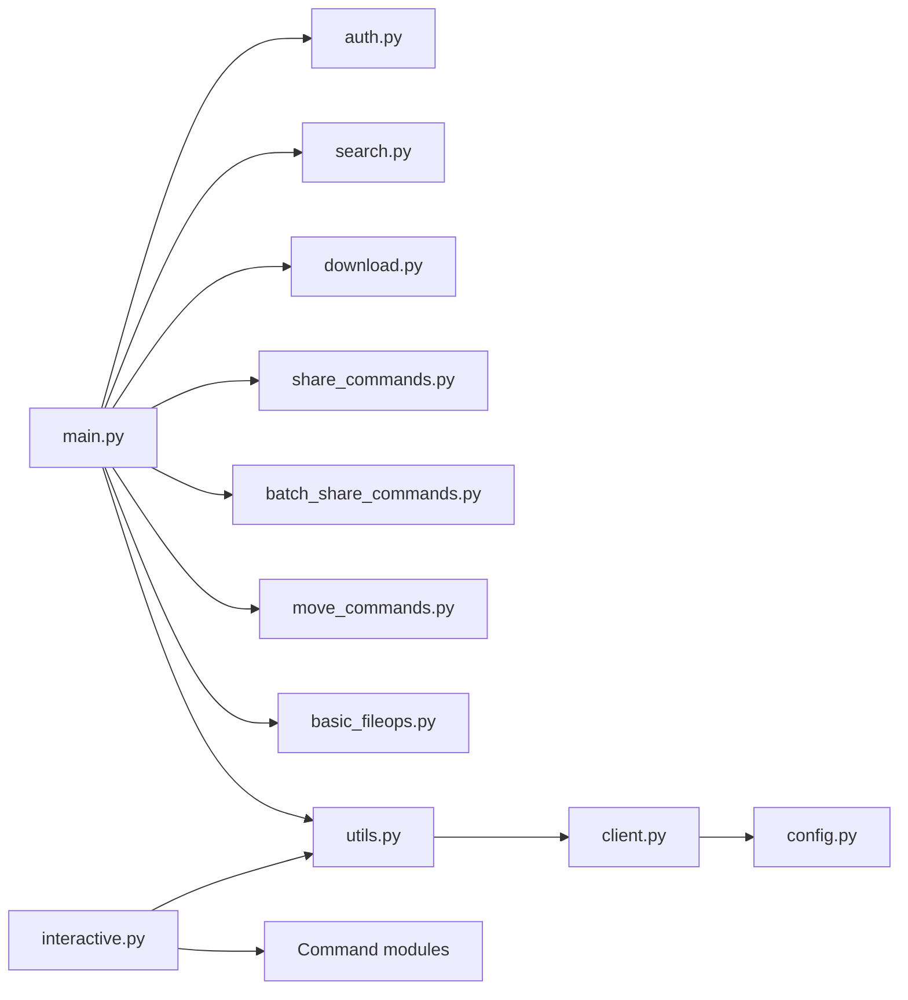

# CLI Interface System

<cite>
**Referenced Files in This Document**
- [__main__.py](file://quark_client/cli/__main__.py)
- [main.py](file://quark_client/cli/main.py)
- [interactive.py](file://quark_client/cli/interactive.py)
- [utils.py](file://quark_client/cli/utils.py)
- [auth.py](file://quark_client/cli/commands/auth.py)
- [basic_fileops.py](file://quark_client/cli/commands/basic_fileops.py)
- [download.py](file://quark_client/cli/commands/download.py)
- [search.py](file://quark_client/cli/commands/search.py)
- [share_commands.py](file://quark_client/cli/commands/share_commands.py)
- [batch_share_commands.py](file://quark_client/cli/commands/batch_share_commands.py)
- [move_commands.py](file://quark_client/cli/commands/move_commands.py)
- [client.py](file://quark_client/client.py)
- [config.py](file://quark_client/config.py)
</cite>

## Table of Contents
1. [Introduction](#introduction)
2. [Project Structure](#project-structure)
3. [Core Components](#core-components)
4. [Architecture Overview](#architecture-overview)
5. [Detailed Component Analysis](#detailed-component-analysis)
6. [Dependency Analysis](#dependency-analysis)
7. [Performance Considerations](#performance-considerations)
8. [Troubleshooting Guide](#troubleshooting-guide)
9. [Conclusion](#conclusion)
10. [Appendices](#appendices)

## Introduction
This document describes the CLI interface system for the standalone command-line tool that operates Quark Pan (Quark Cloud Drive). It covers the CLI architecture, interactive shell functionality, command-line argument processing, available commands (authentication, file operations, search, share, and batch processing), CLI entry points, command parsing, context management, configuration options, practical usage patterns, automation scripting, and integration with shell environments. It also documents the relationship between CLI commands and underlying QuarkClient services, error handling, and debugging techniques for CLI operations.

## Project Structure
The CLI is organized around a Typer-based command framework with modular command groups and a dedicated interactive shell. The main entry points are:
- Standalone module entry: python -m quark_client.cli
- Direct script entry: quark_client/cli/__main__.py

Key modules:
- Command registry and top-level commands: quark_client/cli/main.py
- Subcommand modules: auth.py, search.py, download.py, share_commands.py, batch_share_commands.py, move_commands.py, basic_fileops.py
- Interactive shell: quark_client/cli/interactive.py
- Utilities and helpers: quark_client/cli/utils.py
- Client wrapper: quark_client/client.py
- Configuration constants: quark_client/config.py

**Diagram sources**
- [__main__.py:1-10](file://quark_client/cli/__main__.py#L1-L10)
- [main.py:1-609](file://quark_client/cli/main.py#L1-L609)
- [interactive.py:1-1030](file://quark_client/cli/interactive.py#L1-L1030)
- [utils.py:1-273](file://quark_client/cli/utils.py#L1-L273)
- [client.py:1-405](file://quark_client/client.py#L1-L405)
- [config.py:1-63](file://quark_client/config.py#L1-L63)

**Section sources**
- [__main__.py:1-10](file://quark_client/cli/__main__.py#L1-L10)
- [main.py:1-609](file://quark_client/cli/main.py#L1-L609)

## Core Components
- Typer-based CLI app: Defines top-level commands, subcommand groups, and global behaviors.
- Command modules: Each group encapsulates related commands (auth, search, download, share, batch share, move, basic file ops).
- Interactive shell: Provides a REPL-like experience with navigation, file operations, and batch actions.
- Utilities: Shared helpers for client creation, formatting, error handling, and path resolution.
- QuarkClient wrapper: Centralized client that composes services for files, uploads, downloads, shares, and batch sharing.
- Configuration: Constants for base URLs, timeouts, retries, and defaults.

Key responsibilities:
- Argument parsing and validation via Typer decorators.
- Context management using context managers for QuarkClient.
- Rich terminal output and progress reporting.
- Integration with QuarkClient services for all operations.

**Section sources**
- [main.py:18-35](file://quark_client/cli/main.py#L18-L35)
- [utils.py:17-24](file://quark_client/cli/utils.py#L17-L24)
- [client.py:18-48](file://quark_client/client.py#L18-L48)
- [config.py:34-63](file://quark_client/config.py#L34-L63)

## Architecture Overview
The CLI architecture follows a layered design:
- Presentation layer: Typer app and subcommand modules define commands and arguments.
- Service layer: QuarkClient orchestrates service calls for files, shares, uploads, downloads, and batch operations.
- Infrastructure layer: HTTP client and configuration constants manage network and defaults.
- Interactive layer: InteractiveShell provides a REPL with navigation and batch operations.

**Diagram sources**
- [main.py:55-66](file://quark_client/cli/main.py#L55-L66)
- [utils.py:17-24](file://quark_client/cli/utils.py#L17-L24)
- [client.py:393-398](file://quark_client/client.py#L393-L398)

## Detailed Component Analysis

### CLI Entry Points and Command Parsing
- Module entry point: quark_client/cli/__main__.py delegates to the Typer app.
- Top-level app: quark_client/cli/main.py creates a Typer app named “quarkpan” and registers subcommand groups and commands.
- Callback behavior: If invoked without a subcommand, the app starts the interactive shell.

Command parsing:
- Typer decorators define arguments and options with rich help text and validation.
- Commands use Context for introspection and invoke_without_command behavior.
- Global logging level reduced for CLI to minimize noise.

Practical usage:
- Direct invocation: quarkpan auth login
- Interactive mode: quarkpan or quarkpan interactive
- Help: quarkpan --help; quarkpan <command> --help

**Section sources**
- [__main__.py:1-10](file://quark_client/cli/__main__.py#L1-L10)
- [main.py:38-66](file://quark_client/cli/main.py#L38-L66)
- [main.py:55-66](file://quark_client/cli/main.py#L55-L66)

### Authentication Commands
Subcommand group: quark_client/cli/commands/auth.py
- login: Supports multiple login modes (auto, api, simple), handles force re-login, and validates session.
- logout: Logs out and clears credentials.
- status: Checks login state and prints storage info.
- info: Displays help and usage examples.

Context management:
- Uses get_client(auto_login=False) to avoid auto-login during auth operations.
- Validates is_logged_in before proceeding with sensitive operations.

**Section sources**
- [auth.py:13-92](file://quark_client/cli/commands/auth.py#L13-L92)
- [auth.py:94-110](file://quark_client/cli/commands/auth.py#L94-L110)
- [auth.py:112-144](file://quark_client/cli/commands/auth.py#L112-L144)
- [auth.py:147-184](file://quark_client/cli/commands/auth.py#L147-L184)

### File Operations (Basic File Ops)
Module: quark_client/cli/commands/basic_fileops.py
Commands:
- mkdir: Create folder under a parent folder ID or path.
- rm: Delete files/folders by path or ID with confirmation.
- rename: Rename files/folders by path or ID.
- fileinfo: Get detailed file info.
- browse: Placeholder for interactive browsing (interactive mode recommended).
- goto: Placeholder for smart navigation (interactive mode recommended).
- upload: Upload a file to a parent folder or path, with optional directory creation.

Implementation highlights:
- Path resolution via NameResolver integrated into QuarkClient.
- Progress reporting for uploads.
- Confirmation prompts for destructive operations.

**Section sources**
- [basic_fileops.py:14-43](file://quark_client/cli/commands/basic_fileops.py#L14-L43)
- [basic_fileops.py:45-109](file://quark_client/cli/commands/basic_fileops.py#L45-L109)
- [basic_fileops.py:111-159](file://quark_client/cli/commands/basic_fileops.py#L111-L159)
- [basic_fileops.py:161-198](file://quark_client/cli/commands/basic_fileops.py#L161-L198)
- [basic_fileops.py:208-214](file://quark_client/cli/commands/basic_fileops.py#L208-L214)
- [basic_fileops.py:208-214](file://quark_client/cli/commands/basic_fileops.py#L208-L214)
- [basic_fileops.py:335-406](file://quark_client/cli/commands/basic_fileops.py#L335-L406)

### Search Commands
Module: quark_client/cli/commands/search.py
- search_main: Primary callback that validates keyword and invokes do_search.
- do_search: Performs basic or advanced search with filters (extensions, min/max size).
- parse_file_size: Parses human-readable sizes to bytes.

Features:
- Pagination support.
- Detailed and concise listing modes.
- Filtering and sorting options.

**Section sources**
- [search.py:20-43](file://quark_client/cli/commands/search.py#L20-L43)
- [search.py:45-178](file://quark_client/cli/commands/search.py#L45-L178)
- [search.py:180-210](file://quark_client/cli/commands/search.py#L180-L210)

### Download Commands
Module: quark_client/cli/commands/download.py
- download file: Single file download by path or ID with progress.
- download files: Batch download by file IDs with aggregated progress.
- download folder: Placeholder for folder download (advanced implementation pending).
- download info: Displays usage guide and examples.

Features:
- Real-time progress reporting.
- Output directory customization.
- Error handling and user-friendly messages.

**Section sources**
- [download.py:26-82](file://quark_client/cli/commands/download.py#L26-L82)
- [download.py:84-147](file://quark_client/cli/commands/download.py#L84-L147)
- [download.py:149-209](file://quark_client/cli/commands/download.py#L149-L209)
- [download.py:211-258](file://quark_client/cli/commands/download.py#L211-L258)

### Share Commands
Module: quark_client/cli/commands/share_commands.py
- create_share: Creates share links for files/folders by path or ID, with title, expiration, and password.
- list_my_shares: Lists created shares with pagination and statistics.
- save_share: Transfers shared files to the user’s drive with optional folder creation.
- batch_save_shares: Batch transference from a list of links or a file containing links, with deduplication and validation.

Utilities:
- extract_share_links_from_file: Extracts Quark share links from a file.
- deduplicate_links: Removes duplicates while preserving order.
- validate_share_links: Validates link format.

**Section sources**
- [share_commands.py:121-242](file://quark_client/cli/commands/share_commands.py#L121-L242)
- [share_commands.py:244-340](file://quark_client/cli/commands/share_commands.py#L244-L340)
- [share_commands.py:342-418](file://quark_client/cli/commands/share_commands.py#L342-L418)
- [share_commands.py:420-525](file://quark_client/cli/commands/share_commands.py#L420-L525)

### Batch Share Commands
Module: quark_client/cli/commands/batch_share_commands.py
- batch_share: Scans directories up to a given depth, collects targets by share level (folders/files/both), optionally excludes directories, and creates share links. Supports dry-run and CSV export.
- list_structure: Displays directory structure at a specified depth level.

Features:
- Progress bars for scanning and creation.
- Confirmation prompt for large batches.
- CSV export of results.

**Section sources**
- [batch_share_commands.py:15-221](file://quark_client/cli/commands/batch_share_commands.py#L15-L221)
- [batch_share_commands.py:223-275](file://quark_client/cli/commands/batch_share_commands.py#L223-L275)

### Move Commands
Module: quark_client/cli/commands/move_commands.py
- move_files: Moves files to a target folder by path or ID, with path resolution and validation.
- move_to_folder: Moves files to a named folder under a parent, creating the folder if needed.

Notes:
- Path resolution uses NameResolver integrated into QuarkClient.
- Validation ensures the target is a folder.

**Section sources**
- [move_commands.py:13-96](file://quark_client/cli/commands/move_commands.py#L13-L96)
- [move_commands.py:99-169](file://quark_client/cli/commands/move_commands.py#L99-L169)

### Interactive Shell
Module: quark_client/cli/interactive.py
- InteractiveShell: REPL with command mapping, navigation stack, and rich output.
- Commands: help, exit/quit/q, ls/list, ll, cd, pwd, search/find, download/dl, mkdir, rm/del/delete, rename/mv, info, clear/cls, upload/up, share, shares, move/mv, batch-share, list-dirs, save, status, version.
- Path resolution and navigation: Resolves paths to IDs, maintains breadcrumb, and supports parent navigation.
- Batch operations: Integrates batch-share and list-dirs with interactive options.

**Section sources**
- [interactive.py:23-146](file://quark_client/cli/interactive.py#L23-L146)
- [interactive.py:147-185](file://quark_client/cli/interactive.py#L147-L185)
- [interactive.py:287-334](file://quark_client/cli/interactive.py#L287-L334)
- [interactive.py:800-884](file://quark_client/cli/interactive.py#L800-L884)

### Utilities and Context Management
Module: quark_client/cli/utils.py
- get_client: Creates QuarkClient with optional auto_login, exits on failure.
- Formatting: format_file_size, format_timestamp, get_file_type_icon, truncate_text.
- I/O helpers: confirm_action, print_error, print_success, print_warning, print_info.
- Error handling: handle_api_error with categorized messages.
- Navigation helpers: FolderNavigator, get_folder_name_by_id, select_folder_from_list.

Context management:
- get_client returns a context manager; commands use with get_client() as client.
- QuarkClient implements __enter__/__exit__ for cleanup.

**Section sources**
- [utils.py:17-24](file://quark_client/cli/utils.py#L17-L24)
- [utils.py:26-54](file://quark_client/cli/utils.py#L26-L54)
- [utils.py:67-110](file://quark_client/cli/utils.py#L67-L110)
- [utils.py:178-222](file://quark_client/cli/utils.py#L178-L222)
- [client.py:393-398](file://quark_client/client.py#L393-L398)

### Relationship Between CLI Commands and QuarkClient Services
- QuarkClient composes services: files, upload, download, shares, batch_shares, name_resolver.
- Commands delegate to QuarkClient methods, which in turn call service implementations.
- Example relationships:
  - auth.login/logout/status -> QuarkAuth
  - list_files/search_files/get_file_info -> FileService
  - upload_file -> FileUploadService
  - download_file/download_files -> FileDownloadService
  - create_share/get_my_shares/save_shared_files -> ShareService
  - batch_save_shares -> ShareService or BatchShareService depending on options
  - move_files -> FileService

**Section sources**
- [client.py:18-48](file://quark_client/client.py#L18-L48)
- [client.py:76-169](file://quark_client/client.py#L76-L169)
- [client.py:294-368](file://quark_client/client.py#L294-L368)

## Dependency Analysis
High-level dependencies:
- main.py depends on command modules and utils.
- Command modules depend on utils and QuarkClient.
- Interactive shell depends on command modules and utils.
- QuarkClient depends on core.api_client and service modules.
- config.py provides constants used by core.api_client.

**Diagram sources**
- [main.py:18-35](file://quark_client/cli/main.py#L18-L35)
- [utils.py:12](file://quark_client/cli/utils.py#L12)
- [client.py:9-16](file://quark_client/client.py#L9-L16)
- [config.py:38-47](file://quark_client/config.py#L38-L47)

**Section sources**
- [main.py:18-35](file://quark_client/cli/main.py#L18-L35)
- [utils.py:12](file://quark_client/cli/utils.py#L12)
- [client.py:9-16](file://quark_client/client.py#L9-L16)

## Performance Considerations
- Progress reporting: Rich progress bars for uploads and batch operations reduce perceived latency.
- Pagination: Search and share listing use pagination to limit payload sizes.
- Batch operations: Batch share and batch save leverage service-level batching where available.
- Logging: CLI reduces logging verbosity to minimize overhead.
- Path resolution: NameResolver caches and minimizes repeated API calls.

[No sources needed since this section provides general guidance]

## Troubleshooting Guide
Common issues and resolutions:
- Authentication failures: Use quarkpan auth login with --force or different method (api/simple). Check network connectivity.
- Not logged in: Many commands require login; use quarkpan auth login and verify with quarkpan auth status.
- Path resolution errors: Ensure paths are correct and use --id flag when providing IDs directly.
- Capacity limits: If uploads fail due to capacity, free space or upgrade storage.
- Share link issues: Validate links with validate_share_links logic; ensure links are active and not expired.
- Network errors: Retry operations; increase timeouts if needed.

Debugging techniques:
- Use verbose output and confirm prompts to isolate failures.
- Export CSV from batch operations for audit and reprocessing.
- Use interactive mode for iterative testing and navigation.
- Inspect formatted storage and file counts with status and ls commands.

**Section sources**
- [utils.py:87-110](file://quark_client/cli/utils.py#L87-L110)
- [share_commands.py:86-119](file://quark_client/cli/commands/share_commands.py#L86-L119)
- [batch_share_commands.py:18-221](file://quark_client/cli/commands/batch_share_commands.py#L18-L221)

## Conclusion
The CLI interface system provides a robust, user-friendly command-line experience for managing Quark Pan with strong modularity, rich output, and interactive capabilities. It integrates tightly with QuarkClient services to deliver authenticated operations across authentication, file management, search, sharing, and batch processing. The architecture supports both scripted automation and interactive exploration, with comprehensive error handling and helpful diagnostics.

[No sources needed since this section summarizes without analyzing specific files]

## Appendices

### Practical Usage Patterns and Automation
- Authentication:
  - quarkpan auth login
  - quarkpan auth status
- Listing and navigation:
  - quarkpan ls --details
  - quarkpan cd <folder_id>
- File operations:
  - quarkpan mkdir "New Folder"
  - quarkpan rm "File.txt" --force
  - quarkpan rename "OldName" "NewName"
  - quarkpan upload "document.pdf" --parent 0
- Search:
  - quarkpan search "keyword" --ext pdf --min-size 1MB
- Download:
  - quarkpan download file <file_id_or_path>
  - quarkpan download files <id1> <id2> --output ./downloads
- Share:
  - quarkpan share "Folder/" --title "Backup" --expire 7
  - quarkpan shares --page 1 --size 20
  - quarkpan save "<share_url>" --folder "/Target/"
- Batch processing:
  - quarkpan batch-share --depth 2 --share-level both
  - quarkpan batch_save --from links.txt --folder "/Imports/"

[No sources needed since this section provides general guidance]

### Advanced CLI Usage and Scripting
- Parameter configuration:
  - Use --page, --size, --sort, --order for pagination and sorting.
  - Use --details for richer listings.
  - Use --id to bypass path resolution for IDs.
- Integration with shell environments:
  - Pipe outputs to grep, awk, or other Unix tools.
  - Use loops and conditionals to automate repetitive tasks.
  - Export CSV from batch operations for downstream processing.

[No sources needed since this section provides general guidance]