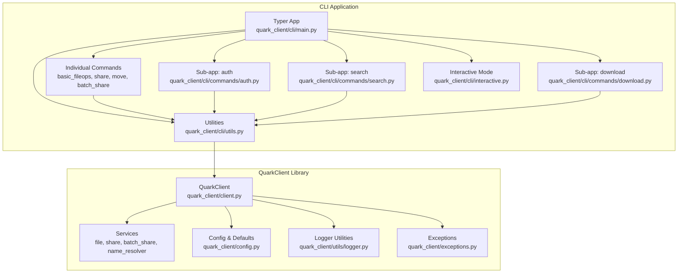
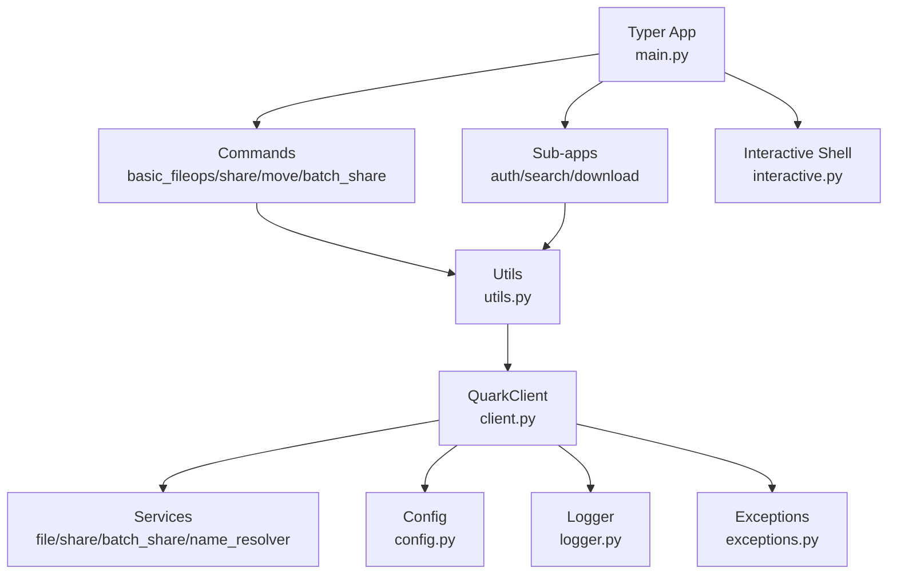
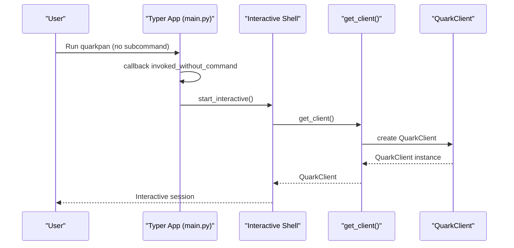
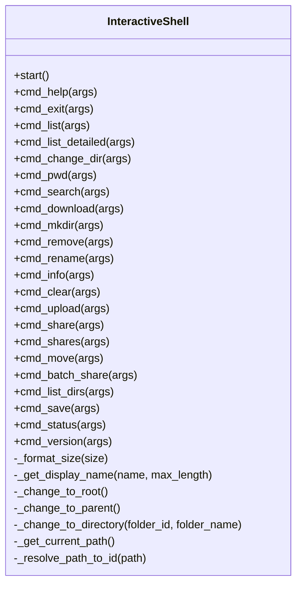
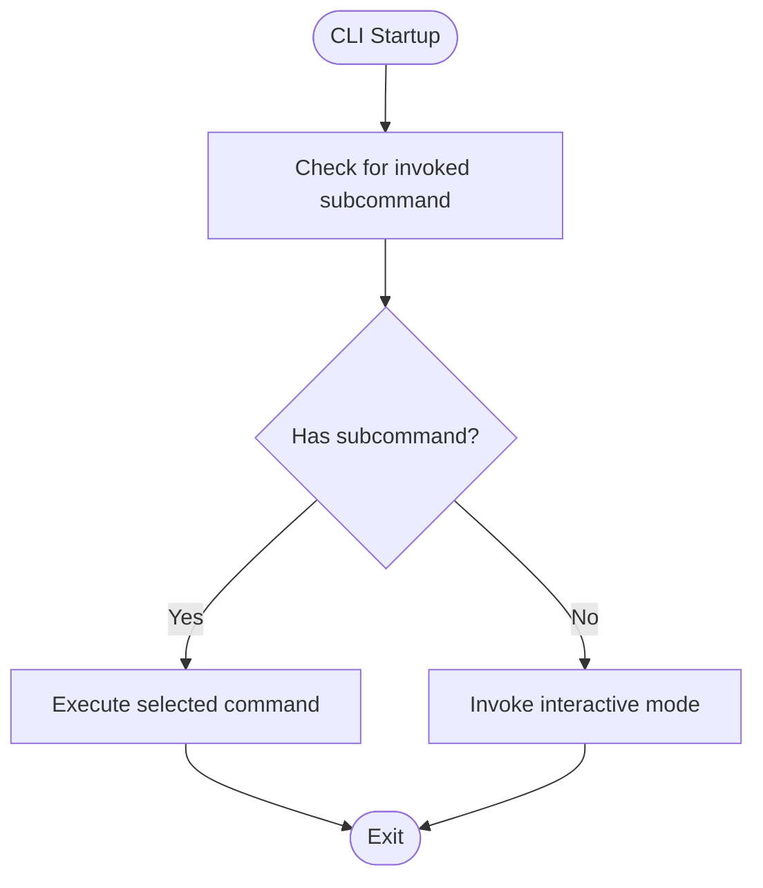
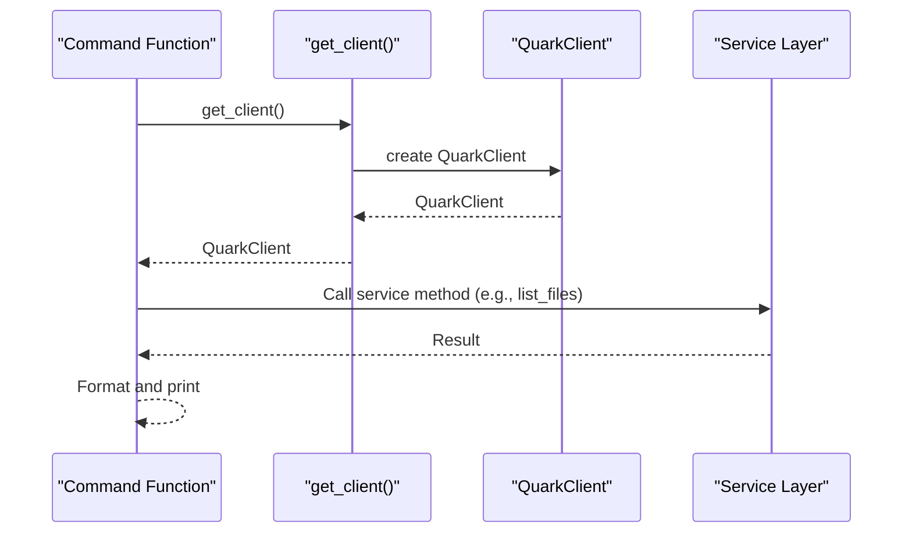
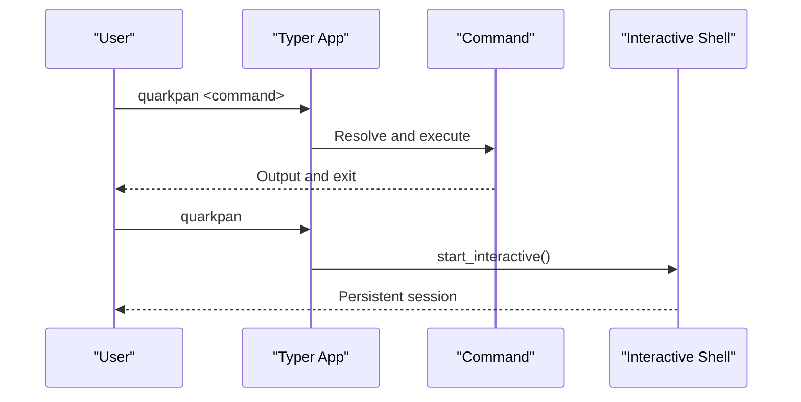
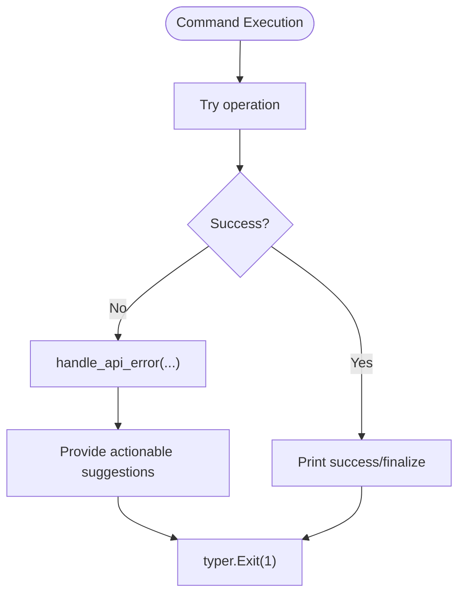
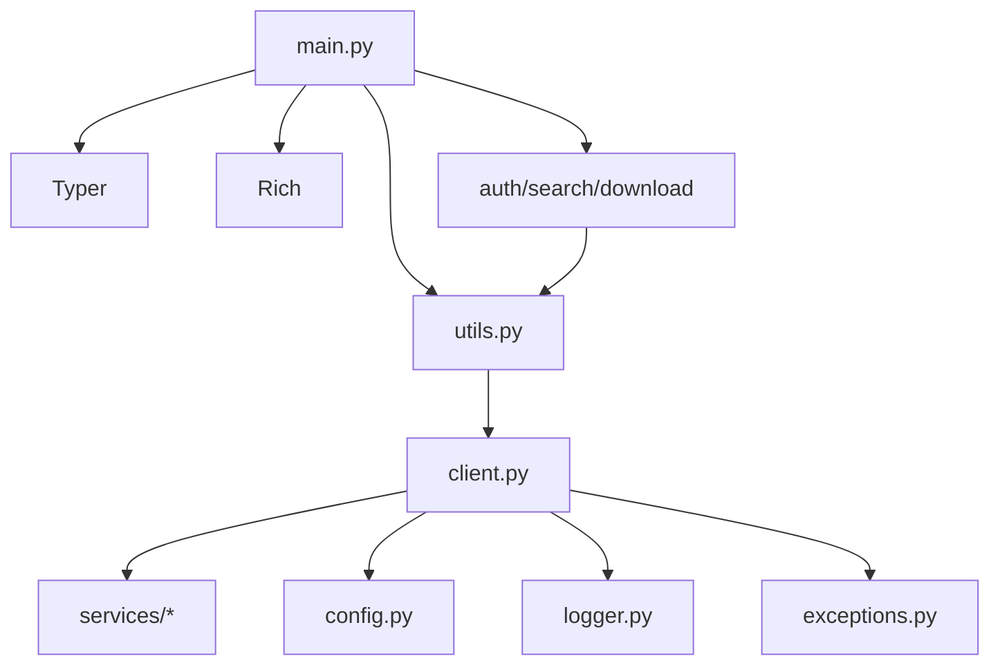

# CLI Overview

<cite>
**Referenced Files in This Document**
- [quark_client/cli/main.py](file://quark_client/cli/main.py)
- [quark_client/cli/__main__.py](file://quark_client/cli/__main__.py)
- [quark_client/cli/interactive.py](file://quark_client/cli/interactive.py)
- [quark_client/cli/utils.py](file://quark_client/cli/utils.py)
- [quark_client/cli/commands/auth.py](file://quark_client/cli/commands/auth.py)
- [quark_client/cli/commands/basic_fileops.py](file://quark_client/cli/commands/basic_fileops.py)
- [quark_client/cli/commands/download.py](file://quark_client/cli/commands/download.py)
- [quark_client/cli/commands/search.py](file://quark_client/cli/commands/search.py)
- [quark_client/cli/commands/share_commands.py](file://quark_client/cli/commands/share_commands.py)
- [quark_client/cli/commands/batch_share_commands.py](file://quark_client/cli/commands/batch_share_commands.py)
- [quark_client/cli/commands/move_commands.py](file://quark_client/cli/commands/move_commands.py)
- [quark_client/client.py](file://quark_client/client.py)
- [quark_client/config.py](file://quark_client/config.py)
- [quark_client/utils/logger.py](file://quark_client/utils/logger.py)
- [quark_client/exceptions.py](file://quark_client/exceptions.py)
</cite>

## Table of Contents
1. [Introduction](#introduction)
2. [Project Structure](#project-structure)
3. [Core Components](#core-components)
4. [Architecture Overview](#architecture-overview)
5. [Detailed Component Analysis](#detailed-component-analysis)
6. [Dependency Analysis](#dependency-analysis)
7. [Performance Considerations](#performance-considerations)
8. [Troubleshooting Guide](#troubleshooting-guide)
9. [Conclusion](#conclusion)

## Introduction
This document explains the standalone command-line interface (CLI) architecture and entry points for the Quark Pan CLI. It covers how the CLI is structured with Typer, the main entry point and callback mechanism, command registration patterns, and integration with the QuarkClient library. It also documents the CLI’s dual-mode operation (direct commands vs interactive mode), global configuration options, logging setup, and error handling strategies. Practical examples illustrate startup patterns, command discovery, and the relationship between CLI commands and underlying service implementations. Finally, it describes CLI initialization, context management, and how interactive mode seamlessly integrates with command-line operations.

## Project Structure
The CLI is organized around a central Typer application that registers sub-applications and individual commands. Sub-applications group related commands (e.g., authentication, search, download), while individual commands implement specific actions. The CLI integrates with the QuarkClient library for all backend operations and uses shared utilities for client creation, formatting, and error handling.

**Diagram sources**
- [quark_client/cli/main.py:37-609](file://quark_client/cli/main.py#L37-L609)
- [quark_client/cli/commands/auth.py:10-188](file://quark_client/cli/commands/auth.py#L10-L188)
- [quark_client/cli/commands/search.py:16-214](file://quark_client/cli/commands/search.py#L16-L214)
- [quark_client/cli/commands/download.py:23-262](file://quark_client/cli/commands/download.py#L23-L262)
- [quark_client/cli/commands/basic_fileops.py:1-406](file://quark_client/cli/commands/basic_fileops.py#L1-L406)
- [quark_client/cli/commands/share_commands.py:1-537](file://quark_client/cli/commands/share_commands.py#L1-L537)
- [quark_client/cli/commands/move_commands.py:1-169](file://quark_client/cli/commands/move_commands.py#L1-L169)
- [quark_client/cli/commands/batch_share_commands.py:1-275](file://quark_client/cli/commands/batch_share_commands.py#L1-L275)
- [quark_client/cli/interactive.py:23-146](file://quark_client/cli/interactive.py#L23-L146)
- [quark_client/cli/utils.py:17-273](file://quark_client/cli/utils.py#L17-L273)
- [quark_client/client.py:18-405](file://quark_client/client.py#L18-L405)
- [quark_client/config.py:34-63](file://quark_client/config.py#L34-L63)
- [quark_client/utils/logger.py:12-73](file://quark_client/utils/logger.py#L12-L73)
- [quark_client/exceptions.py:8-50](file://quark_client/exceptions.py#L8-L50)

**Section sources**
- [quark_client/cli/main.py:37-609](file://quark_client/cli/main.py#L37-L609)
- [quark_client/cli/__main__.py:1-10](file://quark_client/cli/__main__.py#L1-L10)

## Core Components
- Typer application and callbacks
  - Central Typer app is created and configured with a name, help, and rich markup mode.
  - A callback ensures that when no subcommand is provided, the CLI starts interactive mode.
  - Individual commands are registered directly under the main app and via sub-applications.

- Command registration patterns
  - Sub-applications: authentication, search, and download are registered as nested Typer apps.
  - Individual commands: file operations (mkdir, rm, rename, fileinfo), browsing (browse, goto), upload, share, shares, batch_share, list_dirs, save, batch_save, move, mv, move_to, version, status, ls, cd, info are registered as top-level commands.

- Integration with QuarkClient
  - Commands use a shared utility to obtain a QuarkClient instance with optional auto-login.
  - Commands delegate all backend operations to QuarkClient methods (list, search, upload, share, move, etc.).

- Dual-mode operation
  - Direct command mode: run a specific command (e.g., ls, upload, share).
  - Interactive mode: invoked automatically when no subcommand is given or explicitly via the interactive command.

- Global configuration and logging
  - CLI-specific logging level is set for the quark_client logger to reduce noise.
  - Configuration constants (API base URLs, timeouts, pagination defaults) are centralized.

- Error handling
  - Commands wrap operations in try/except blocks and use a shared error handler to present user-friendly messages and exit with non-zero status codes.
  - Interactive mode handles unknown commands and parsing errors gracefully.

**Section sources**
- [quark_client/cli/main.py:37-609](file://quark_client/cli/main.py#L37-L609)
- [quark_client/cli/utils.py:17-273](file://quark_client/cli/utils.py#L17-L273)
- [quark_client/client.py:18-405](file://quark_client/client.py#L18-L405)
- [quark_client/config.py:34-63](file://quark_client/config.py#L34-L63)
- [quark_client/utils/logger.py:12-73](file://quark_client/utils/logger.py#L12-L73)

## Architecture Overview
The CLI architecture follows a layered pattern:
- Presentation layer: Typer app and sub-applications define the command surface.
- Command layer: individual command functions orchestrate user input, validation, and service invocation.
- Integration layer: shared utilities provide QuarkClient instances and formatting helpers.
- Business logic layer: QuarkClient exposes high-level operations backed by services and API clients.
- Infrastructure layer: configuration, logging, and exception definitions support cross-cutting concerns.

**Diagram sources**
- [quark_client/cli/main.py:37-609](file://quark_client/cli/main.py#L37-L609)
- [quark_client/cli/commands/auth.py:10-188](file://quark_client/cli/commands/auth.py#L10-L188)
- [quark_client/cli/commands/search.py:16-214](file://quark_client/cli/commands/search.py#L16-L214)
- [quark_client/cli/commands/download.py:23-262](file://quark_client/cli/commands/download.py#L23-L262)
- [quark_client/cli/commands/basic_fileops.py:1-406](file://quark_client/cli/commands/basic_fileops.py#L1-L406)
- [quark_client/cli/commands/share_commands.py:1-537](file://quark_client/cli/commands/share_commands.py#L1-L537)
- [quark_client/cli/commands/move_commands.py:1-169](file://quark_client/cli/commands/move_commands.py#L1-L169)
- [quark_client/cli/commands/batch_share_commands.py:1-275](file://quark_client/cli/commands/batch_share_commands.py#L1-L275)
- [quark_client/cli/interactive.py:23-146](file://quark_client/cli/interactive.py#L23-L146)
- [quark_client/cli/utils.py:17-273](file://quark_client/cli/utils.py#L17-L273)
- [quark_client/client.py:18-405](file://quark_client/client.py#L18-L405)
- [quark_client/config.py:34-63](file://quark_client/config.py#L34-L63)
- [quark_client/utils/logger.py:12-73](file://quark_client/utils/logger.py#L12-L73)
- [quark_client/exceptions.py:8-50](file://quark_client/exceptions.py#L8-L50)

## Detailed Component Analysis

### Main CLI Application and Entry Points
- Entry points
  - Direct module execution: python -m quark_client.cli invokes the Typer app.
  - Standalone script execution: the main module runs the Typer app directly.
- Callback behavior
  - When no subcommand is provided, the main callback prints a welcome message and starts the interactive shell.
- Command registration
  - Sub-applications are added for auth, search, and download.
  - Top-level commands include interactive, file operations, sharing, moving, listing, and informational commands.

**Diagram sources**
- [quark_client/cli/main.py:55-67](file://quark_client/cli/main.py#L55-L67)
- [quark_client/cli/interactive.py:74-96](file://quark_client/cli/interactive.py#L74-L96)
- [quark_client/cli/utils.py:17-24](file://quark_client/cli/utils.py#L17-L24)
- [quark_client/client.py:21-49](file://quark_client/client.py#L21-L49)

**Section sources**
- [quark_client/cli/main.py:37-609](file://quark_client/cli/main.py#L37-L609)
- [quark_client/cli/__main__.py:1-10](file://quark_client/cli/__main__.py#L1-L10)

### Interactive Mode
- Purpose
  - Provides a REPL-like experience for file operations, navigation, and sharing.
- Initialization
  - Starts by obtaining a QuarkClient instance and verifying login status.
  - Initializes current directory state and a directory stack for navigation.
- Command loop
  - Parses user input using shell-like splitting.
  - Dispatches to mapped command handlers (list, cd, search, download, upload, share, move, etc.).
  - Handles keyboard interrupts and unknown commands gracefully.
- Navigation and path resolution
  - Uses a name resolver to convert paths to IDs and maintain breadcrumb navigation.
- Integration with commands
  - Reuses shared command implementations (e.g., upload, share, move) for consistent behavior.

**Diagram sources**
- [quark_client/cli/interactive.py:23-798](file://quark_client/cli/interactive.py#L23-L798)

**Section sources**
- [quark_client/cli/interactive.py:23-146](file://quark_client/cli/interactive.py#L23-L146)
- [quark_client/cli/interactive.py:196-252](file://quark_client/cli/interactive.py#L196-L252)
- [quark_client/cli/interactive.py:287-334](file://quark_client/cli/interactive.py#L287-L334)
- [quark_client/cli/interactive.py:590-621](file://quark_client/cli/interactive.py#L590-L621)
- [quark_client/cli/interactive.py:622-679](file://quark_client/cli/interactive.py#L622-L679)
- [quark_client/cli/interactive.py:714-774](file://quark_client/cli/interactive.py#L714-L774)
- [quark_client/cli/interactive.py:775-798](file://quark_client/cli/interactive.py#L775-L798)

### Command Registration Patterns
- Sub-applications
  - auth_app: login, logout, status, info.
  - search_app: search with advanced filtering and pagination.
  - download_app: file, files, folder, info.
- Individual commands
  - File operations: mkdir, rm, rename, fileinfo, browse, goto, upload.
  - Sharing: share, shares, save, batch_save.
  - Movement: move, mv, move_to.
  - Listing and navigation: ls, cd, list_dirs, status, version, info.
- Discovery mechanism
  - Typer discovers commands via decorators and sub-app registrations.
  - Help text and rich formatting are applied at registration time.

**Diagram sources**
- [quark_client/cli/main.py:55-67](file://quark_client/cli/main.py#L55-L67)

**Section sources**
- [quark_client/cli/commands/auth.py:10-188](file://quark_client/cli/commands/auth.py#L10-L188)
- [quark_client/cli/commands/search.py:16-214](file://quark_client/cli/commands/search.py#L16-L214)
- [quark_client/cli/commands/download.py:23-262](file://quark_client/cli/commands/download.py#L23-L262)
- [quark_client/cli/main.py:46-609](file://quark_client/cli/main.py#L46-L609)

### Integration with QuarkClient
- Client acquisition
  - Shared utility creates a QuarkClient with optional auto-login and handles failures with immediate exits.
- Command-to-service mapping
  - File operations (create, delete, rename, list, search, upload) delegate to QuarkClient methods.
  - Sharing operations (create share, list shares, save share) use QuarkClient’s share service.
  - Movement operations (move files) use QuarkClient’s file service.
- Context management
  - Commands use context managers to ensure proper resource cleanup after operations.

**Diagram sources**
- [quark_client/cli/utils.py:17-24](file://quark_client/cli/utils.py#L17-L24)
- [quark_client/client.py:76-170](file://quark_client/client.py#L76-L170)
- [quark_client/cli/commands/basic_fileops.py:14-43](file://quark_client/cli/commands/basic_fileops.py#L14-L43)
- [quark_client/cli/commands/share_commands.py:133-242](file://quark_client/cli/commands/share_commands.py#L133-L242)
- [quark_client/cli/commands/move_commands.py:18-96](file://quark_client/cli/commands/move_commands.py#L18-L96)

**Section sources**
- [quark_client/cli/utils.py:17-273](file://quark_client/cli/utils.py#L17-L273)
- [quark_client/client.py:18-405](file://quark_client/client.py#L18-L405)
- [quark_client/cli/commands/basic_fileops.py:1-406](file://quark_client/cli/commands/basic_fileops.py#L1-L406)
- [quark_client/cli/commands/share_commands.py:1-537](file://quark_client/cli/commands/share_commands.py#L1-L537)
- [quark_client/cli/commands/move_commands.py:1-169](file://quark_client/cli/commands/move_commands.py#L1-L169)

### Dual-Mode Operation
- Direct command mode
  - Users run specific commands (e.g., quarkpan ls, quarkpan upload, quarkpan share).
  - Each command validates login, constructs requests, and prints formatted results.
- Interactive mode
  - Invoked when no subcommand is provided or explicitly via quarkpan interactive.
  - Provides a persistent session with navigation, path resolution, and command dispatch.

**Diagram sources**
- [quark_client/cli/main.py:55-73](file://quark_client/cli/main.py#L55-L73)
- [quark_client/cli/interactive.py:74-146](file://quark_client/cli/interactive.py#L74-L146)

**Section sources**
- [quark_client/cli/main.py:55-73](file://quark_client/cli/main.py#L55-L73)
- [quark_client/cli/interactive.py:74-146](file://quark_client/cli/interactive.py#L74-L146)

### Logging Setup and Error Handling Strategies
- Logging
  - CLI sets the quark_client logger level to WARNING to reduce noise during CLI operations.
  - A dedicated logger utility supports configurable console and file handlers.
- Error handling
  - Commands catch exceptions, format user-friendly messages, and exit with non-zero status.
  - A shared error handler inspects error messages to provide actionable guidance (e.g., login, network, capacity limits, share expiration).
  - Interactive mode wraps command execution with try/except to prevent crashes and guide users.

**Diagram sources**
- [quark_client/cli/utils.py:87-110](file://quark_client/cli/utils.py#L87-L110)
- [quark_client/cli/commands/basic_fileops.py:40-42](file://quark_client/cli/commands/basic_fileops.py#L40-L42)
- [quark_client/cli/commands/share_commands.py:239-242](file://quark_client/cli/commands/share_commands.py#L239-L242)
- [quark_client/cli/commands/move_commands.py:94-96](file://quark_client/cli/commands/move_commands.py#L94-L96)

**Section sources**
- [quark_client/cli/main.py:15-16](file://quark_client/cli/main.py#L15-L16)
- [quark_client/utils/logger.py:12-73](file://quark_client/utils/logger.py#L12-L73)
- [quark_client/cli/utils.py:87-110](file://quark_client/cli/utils.py#L87-L110)
- [quark_client/cli/commands/basic_fileops.py:40-42](file://quark_client/cli/commands/basic_fileops.py#L40-L42)
- [quark_client/cli/commands/share_commands.py:239-242](file://quark_client/cli/commands/share_commands.py#L239-L242)
- [quark_client/cli/commands/move_commands.py:94-96](file://quark_client/cli/commands/move_commands.py#L94-L96)

### Practical Examples and Command Discovery
- Startup patterns
  - python -m quark_client.cli: starts the Typer app.
  - quarkpan: starts interactive mode by default.
  - quarkpan <subcommand>: executes the specified command.
- Command discovery
  - Typer scans decorated functions and sub-applications to build the command tree.
  - Rich help text and formatting are applied at registration time.
- Relationship to services
  - Commands call QuarkClient methods which route to appropriate services (file, share, batch_share, name_resolver).
  - Example: upload delegates to QuarkClient.upload_file; share delegates to QuarkClient.create_share.

**Section sources**
- [quark_client/cli/__main__.py:1-10](file://quark_client/cli/__main__.py#L1-L10)
- [quark_client/cli/main.py:37-609](file://quark_client/cli/main.py#L37-L609)
- [quark_client/cli/commands/basic_fileops.py:335-406](file://quark_client/cli/commands/basic_fileops.py#L335-L406)
- [quark_client/cli/commands/share_commands.py:121-242](file://quark_client/cli/commands/share_commands.py#L121-L242)

## Dependency Analysis
The CLI depends on Typer for command definition and routing, Rich for rich output, and QuarkClient for backend operations. The main app aggregates sub-applications and individual commands, while utilities centralize client creation and formatting.

**Diagram sources**
- [quark_client/cli/main.py:9-13](file://quark_client/cli/main.py#L9-L13)
- [quark_client/cli/utils.py:12-14](file://quark_client/cli/utils.py#L12-L14)
- [quark_client/client.py:9-16](file://quark_client/client.py#L9-L16)
- [quark_client/config.py:5-7](file://quark_client/config.py#L5-L7)
- [quark_client/utils/logger.py:6-9](file://quark_client/utils/logger.py#L6-L9)
- [quark_client/exceptions.py:5-6](file://quark_client/exceptions.py#L5-L6)

**Section sources**
- [quark_client/cli/main.py:9-13](file://quark_client/cli/main.py#L9-L13)
- [quark_client/cli/utils.py:12-14](file://quark_client/cli/utils.py#L12-L14)
- [quark_client/client.py:9-16](file://quark_client/client.py#L9-L16)
- [quark_client/config.py:5-7](file://quark_client/config.py#L5-L7)
- [quark_client/utils/logger.py:6-9](file://quark_client/utils/logger.py#L6-L9)
- [quark_client/exceptions.py:5-6](file://quark_client/exceptions.py#L5-L6)

## Performance Considerations
- Use pagination and size controls for listing and search operations to avoid large payloads.
- Prefer batch operations where supported (e.g., batch share, batch save) to reduce overhead.
- Avoid unnecessary retries by validating inputs early (e.g., file existence, path resolution).
- Interactive mode maintains minimal state; keep command loops responsive by avoiding heavy synchronous operations.

## Troubleshooting Guide
- Authentication issues
  - Use quarkpan auth login to establish a session; verify with quarkpan auth status.
  - If login fails, retry with explicit method flags or manual guidance.
- Network and API errors
  - The shared error handler detects common conditions (network, capacity, share expiration) and suggests fixes.
- Interactive mode problems
  - Unknown commands are handled gracefully; use help to discover available commands.
  - Keyboard interrupts are caught to allow clean exits.

**Section sources**
- [quark_client/cli/commands/auth.py:27-92](file://quark_client/cli/commands/auth.py#L27-L92)
- [quark_client/cli/commands/auth.py:94-144](file://quark_client/cli/commands/auth.py#L94-L144)
- [quark_client/cli/utils.py:87-110](file://quark_client/cli/utils.py#L87-L110)
- [quark_client/cli/interactive.py:123-136](file://quark_client/cli/interactive.py#L123-L136)

## Conclusion
The Quark Pan CLI is a modular, Typer-driven application that cleanly separates presentation, command orchestration, and backend integration. Its dual-mode operation (direct commands and interactive mode) offers flexibility for both scripted automation and exploratory workflows. The integration with QuarkClient centralizes business logic and service interactions, while shared utilities and robust error handling ensure a consistent and user-friendly experience. The architecture supports easy extension with new commands and sub-applications, maintaining clarity and reliability across operations.