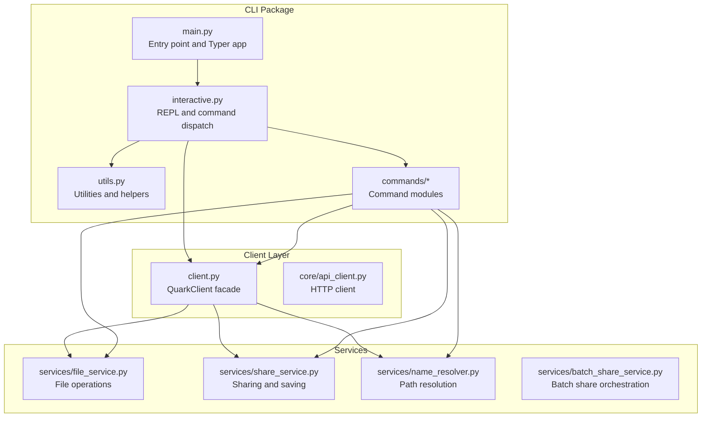
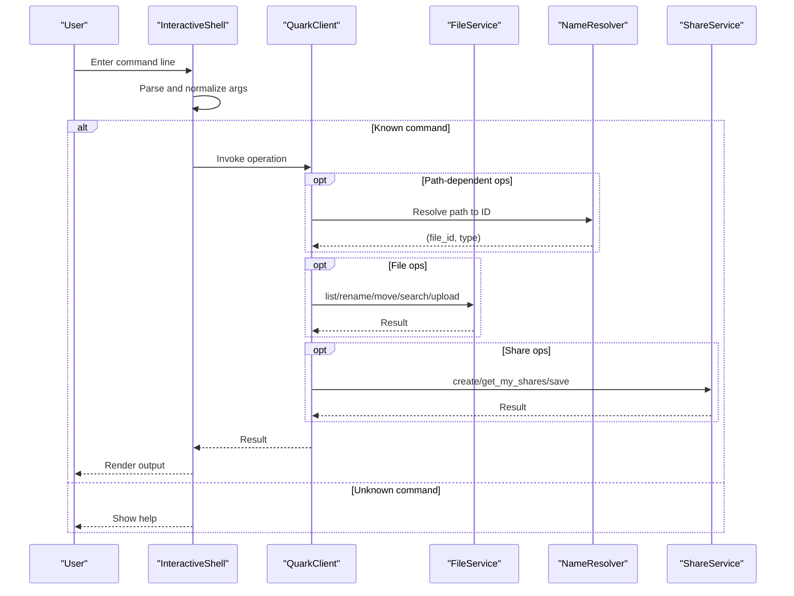
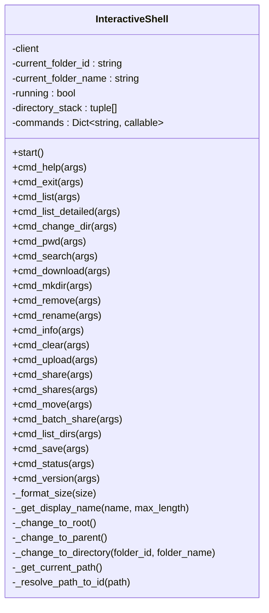
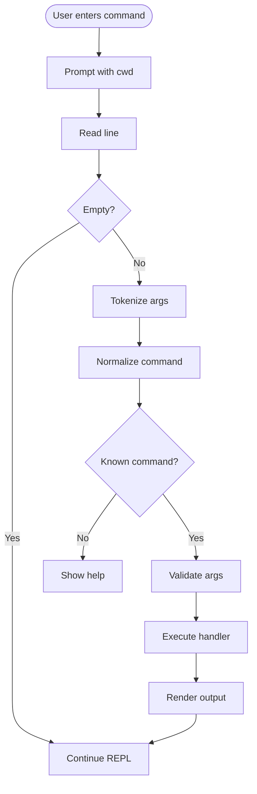
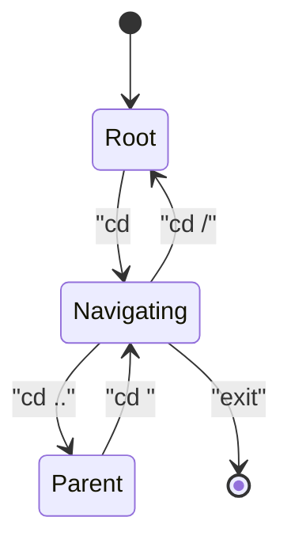
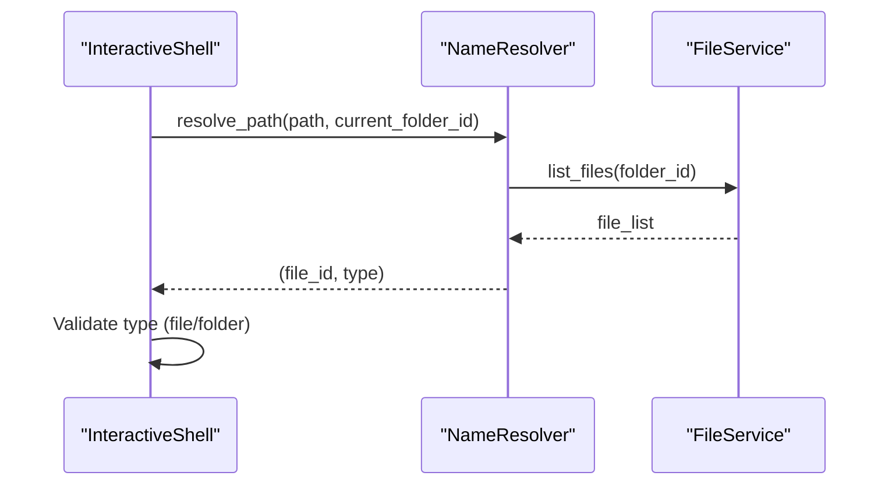
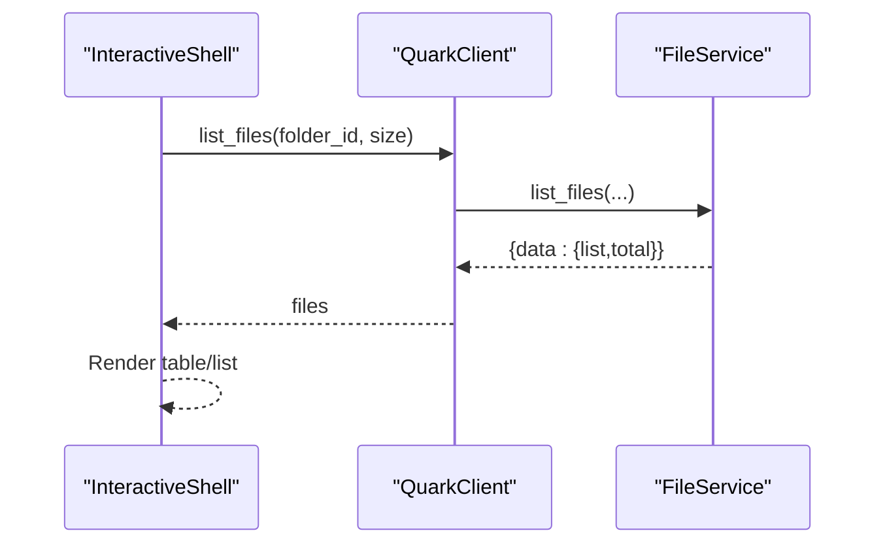
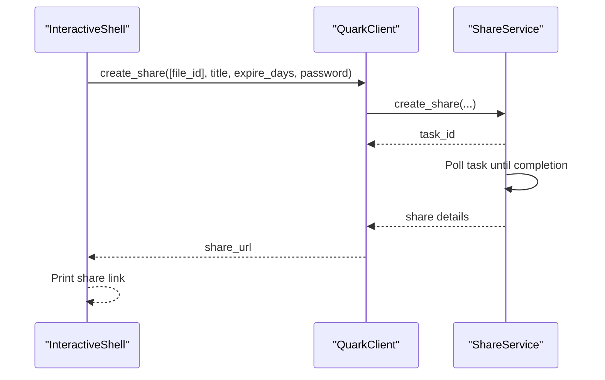
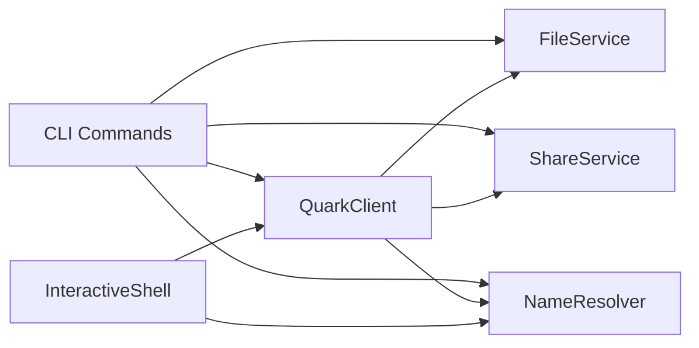

# Interactive Shell

<cite>
**Referenced Files in This Document**
- [interactive.py](file://quark_client/cli/interactive.py)
- [main.py](file://quark_client/cli/main.py)
- [client.py](file://quark_client/client.py)
- [utils.py](file://quark_client/cli/utils.py)
- [name_resolver.py](file://quark_client/services/name_resolver.py)
- [file_service.py](file://quark_client/services/file_service.py)
- [share_service.py](file://quark_client/services/share_service.py)
- [basic_fileops.py](file://quark_client/cli/commands/basic_fileops.py)
- [share_commands.py](file://quark_client/cli/commands/share_commands.py)
- [batch_share_commands.py](file://quark_client/cli/commands/batch_share_commands.py)
- [move_commands.py](file://quark_client/cli/commands/move_commands.py)
- [search.py](file://quark_client/cli/commands/search.py)
</cite>

## Table of Contents
1. [Introduction](#introduction)
2. [Project Structure](#project-structure)
3. [Core Components](#core-components)
4. [Architecture Overview](#architecture-overview)
5. [Detailed Component Analysis](#detailed-component-analysis)
6. [Dependency Analysis](#dependency-analysis)
7. [Performance Considerations](#performance-considerations)
8. [Troubleshooting Guide](#troubleshooting-guide)
9. [Conclusion](#conclusion)

## Introduction
This document explains the interactive shell functionality of the Quark Manager CLI, focusing on the REPL (Read-Eval-Print Loop) implementation and the command processing engine. It covers interactive mode startup, command parsing and execution pipeline, context-aware navigation, session state management, file browser integration, command history, user input validation, and integration with QuarkClient services. Practical workflows and debugging techniques are included to help users operate efficiently and recover from errors.

## Project Structure
The interactive shell is implemented as a standalone REPL inside the CLI package. It integrates with the QuarkClient and service layer to perform file operations, sharing, and navigation.

**Diagram sources**
- [main.py](file://quark_client/cli/main.py)
- [interactive.py](file://quark_client/cli/interactive.py)
- [utils.py](file://quark_client/cli/utils.py)
- [client.py](file://quark_client/client.py)
- [file_service.py](file://quark_client/services/file_service.py)
- [share_service.py](file://quark_client/services/share_service.py)
- [name_resolver.py](file://quark_client/services/name_resolver.py)

**Section sources**
- [main.py](file://quark_client/cli/main.py)
- [interactive.py](file://quark_client/cli/interactive.py)

## Core Components
- InteractiveShell: The REPL engine that manages the interactive loop, parses commands, dispatches to handlers, and maintains session state (current directory, stack, and client).
- Command handlers: Methods under InteractiveShell that implement each command (e.g., ls, cd, upload, share, move, search).
- QuarkClient: Facade that exposes high-level operations (list, search, upload, download, rename, move, share, status).
- Services: FileService, ShareService, NameResolver, and BatchShareService that encapsulate API interactions and caching.
- Utilities: Logging, printing, error handling, and path helpers.

Key responsibilities:
- Startup and lifecycle: initialize client, check login, run REPL loop, cleanup.
- Parsing and dispatch: tokenize input, map aliases, route to handler.
- Session state: maintain current folder ID and name, directory stack, display formatting.
- Integration: delegate to QuarkClient and services for network operations.

**Section sources**
- [interactive.py](file://quark_client/cli/interactive.py)
- [client.py](file://quark_client/client.py)
- [utils.py](file://quark_client/cli/utils.py)

## Architecture Overview
The interactive shell sits atop the QuarkClient, which delegates to service classes. Commands are dispatched to handlers that may call services for file operations, sharing, or navigation.

**Diagram sources**
- [interactive.py](file://quark_client/cli/interactive.py)
- [client.py](file://quark_client/client.py)
- [file_service.py](file://quark_client/services/file_service.py)
- [name_resolver.py](file://quark_client/services/name_resolver.py)
- [share_service.py](file://quark_client/services/share_service.py)

## Detailed Component Analysis

### InteractiveShell: REPL Engine
Responsibilities:
- Initialize and manage session state (current folder ID/name, directory stack).
- Start interactive mode, validate login, and run the REPL loop.
- Parse user input via shell tokenizer, dispatch to command handlers.
- Handle interrupts and errors gracefully.
- Provide contextual display formatting and path helpers.

Notable behaviors:
- Directory stack tracks navigation history for backward traversal.
- Friendly display names for long paths.
- Rich terminal rendering for lists, tables, and progress callbacks.

**Diagram sources**
- [interactive.py](file://quark_client/cli/interactive.py)

**Section sources**
- [interactive.py](file://quark_client/cli/interactive.py)

### Command Processing Pipeline
- Input capture: Prompt with current directory indicator.
- Tokenization: Split by shell-safe rules.
- Dispatch: Match normalized command to handler map.
- Validation: Type checks, path existence, and argument presence.
- Execution: Call QuarkClient or service methods.
- Rendering: Print formatted results via rich tables and panels.

**Diagram sources**
- [interactive.py](file://quark_client/cli/interactive.py)

**Section sources**
- [interactive.py](file://quark_client/cli/interactive.py)

### Session State Management
- Current location: folder ID and friendly name.
- Navigation stack: enables “cd ..” and breadcrumb-like history.
- Path construction: build readable absolute paths for display and logs.
- Display formatting: truncate long names, format sizes, and icons.

**Diagram sources**
- [interactive.py](file://quark_client/cli/interactive.py)

**Section sources**
- [interactive.py](file://quark_client/cli/interactive.py)

### Path Resolution and Navigation
- NameResolver resolves human-friendly paths to file IDs, caches folder listings, and supports absolute and relative paths.
- InteractiveShell uses NameResolver to validate targets for move, rename, download, and share operations.

**Diagram sources**
- [interactive.py](file://quark_client/cli/interactive.py)
- [name_resolver.py](file://quark_client/services/name_resolver.py)
- [file_service.py](file://quark_client/services/file_service.py)

**Section sources**
- [interactive.py](file://quark_client/cli/interactive.py)
- [name_resolver.py](file://quark_client/services/name_resolver.py)
- [file_service.py](file://quark_client/services/file_service.py)

### File Operations Integration
- Listing: list_files with pagination and optional details.
- Search: search_files or advanced filtering via FileService.
- Upload: upload_file with progress callback.
- Download: download_file_by_name with progress reporting.
- Rename and Delete: rename_file_by_name and delete_files_by_name.
- Move: move_files with async task polling.

**Diagram sources**
- [interactive.py](file://quark_client/cli/interactive.py)
- [client.py](file://quark_client/client.py)
- [file_service.py](file://quark_client/services/file_service.py)

**Section sources**
- [interactive.py](file://quark_client/cli/interactive.py)
- [client.py](file://quark_client/client.py)
- [file_service.py](file://quark_client/services/file_service.py)

### Sharing and Save Workflows
- Create share: create_share with optional title, password, and expiry; handles async task completion.
- List my shares: get_my_shares with pagination and statistics.
- Save share: parse_and_save to fetch files and save to target folder; supports wait-for-completion and timeouts.

**Diagram sources**
- [interactive.py](file://quark_client/cli/interactive.py)
- [client.py](file://quark_client/client.py)
- [share_service.py](file://quark_client/services/share_service.py)

**Section sources**
- [interactive.py](file://quark_client/cli/interactive.py)
- [client.py](file://quark_client/client.py)
- [share_service.py](file://quark_client/services/share_service.py)

### Practical Workflows and Examples
- Navigate and list:
  - Start interactive mode.
  - Use pwd to confirm current location.
  - Use ls or ll to list items.
  - Use cd to move around; cd .. to go up; cd / to return to root.
- Search and filter:
  - search <keyword> to search across the drive.
  - Combine with advanced filters via CLI commands (outside REPL).
- Upload and download:
  - upload <local_path> to upload to current directory.
  - download <path> to download a file by name.
- Manage files:
  - rename <old> <new> to rename a file or folder.
  - rm <paths...> to delete files or folders (with confirmation).
- Share and save:
  - share <path> [--title] [--password] [--expire] to create a share.
  - shares [--page] [--size] to list your shares.
  - save <url> [--folder] to save shared files to a target folder.

These workflows leverage the session state to keep track of the current working directory and resolve paths consistently.

**Section sources**
- [interactive.py](file://quark_client/cli/interactive.py)
- [basic_fileops.py](file://quark_client/cli/commands/basic_fileops.py)
- [share_commands.py](file://quark_client/cli/commands/share_commands.py)
- [move_commands.py](file://quark_client/cli/commands/move_commands.py)
- [search.py](file://quark_client/cli/commands/search.py)

## Dependency Analysis
- InteractiveShell depends on:
  - QuarkClient for high-level operations.
  - NameResolver for path-to-ID resolution.
  - Rich for UI rendering and prompts.
- QuarkClient composes:
  - FileService, ShareService, NameResolver, BatchShareService.
- Command modules depend on QuarkClient and services for CLI operations.

**Diagram sources**
- [interactive.py](file://quark_client/cli/interactive.py)
- [client.py](file://quark_client/client.py)
- [file_service.py](file://quark_client/services/file_service.py)
- [share_service.py](file://quark_client/services/share_service.py)
- [name_resolver.py](file://quark_client/services/name_resolver.py)
- [basic_fileops.py](file://quark_client/cli/commands/basic_fileops.py)
- [share_commands.py](file://quark_client/cli/commands/share_commands.py)
- [batch_share_commands.py](file://quark_client/cli/commands/batch_share_commands.py)
- [move_commands.py](file://quark_client/cli/commands/move_commands.py)
- [search.py](file://quark_client/cli/commands/search.py)

**Section sources**
- [interactive.py](file://quark_client/cli/interactive.py)
- [client.py](file://quark_client/client.py)

## Performance Considerations
- Caching: NameResolver refreshes folder caches per lookup to ensure freshness; repeated lookups in the same folder reuse cached results.
- Pagination: Listing and search use page-based retrieval; adjust size for responsiveness.
- Async tasks: Move and share operations may return tasks; the client polls completion; avoid long-running synchronous waits.
- Progress callbacks: Use callbacks for uploads/downloads to provide feedback without blocking.

[No sources needed since this section provides general guidance]

## Troubleshooting Guide
Common issues and recovery steps:
- Not logged in:
  - Start interactive mode; the shell checks login and exits with guidance if not authenticated.
- Unknown command:
  - Use help to list available commands and aliases.
- Path errors:
  - Verify paths exist; use pwd to confirm current directory; use ls to inspect contents.
- Operation failures:
  - Inspect printed error messages; use status to check storage and login state.
  - For share creation or save operations, check expiry, password, and capacity limits.
- Interrupts:
  - Keyboard interrupt during long operations cancels gracefully; continue or exit as needed.

Debugging tips:
- Enable verbose logging at the module level to observe API calls and responses.
- Test individual commands outside the REPL (e.g., upload, share) to isolate issues.
- Validate file IDs and paths using fileinfo and resolve-path helpers.

**Section sources**
- [interactive.py](file://quark_client/cli/interactive.py)
- [utils.py](file://quark_client/cli/utils.py)
- [client.py](file://quark_client/client.py)

## Conclusion
The interactive shell provides a robust, context-aware REPL for managing Quark Cloud Drive resources. It integrates tightly with QuarkClient and service layers to deliver reliable file operations, sharing, and navigation. By maintaining session state, validating inputs, and leveraging caching and async tasks, it offers a responsive and user-friendly experience. Use the provided workflows and troubleshooting guidance to operate effectively and recover from common issues.