# Configuration and Deployment

<cite>
**Referenced Files in This Document**
- [docker-compose.yml](file://docker-compose.yml)
- [backend/app/core/config.py](file://backend/app/core/config.py)
- [backend/app/core/database.py](file://backend/app/core/database.py)
- [backend/app/main.py](file://backend/app/main.py)
- [backend/app/api/v1/router.py](file://backend/app/api/v1/router.py)
- [backend/Dockerfile](file://backend/Dockerfile)
- [backend/requirements.txt](file://backend/requirements.txt)
- [backend/pyproject.toml](file://backend/pyproject.toml)
- [frontend/Dockerfile](file://frontend/Dockerfile)
- [frontend/package.json](file://frontend/package.json)
- [frontend/vite.config.ts](file://frontend/vite.config.ts)
- [quark_client/config.py](file://quark_client/config.py)
- [quark_client/client.py](file://quark_client/client.py)
- [quark_client/auth/login.py](file://quark_client/auth/login.py)
- [PROJECT_SUMMARY.md](file://PROJECT_SUMMARY.md)
</cite>

## Table of Contents
1. [Introduction](#introduction)
2. [Project Structure](#project-structure)
3. [Core Components](#core-components)
4. [Architecture Overview](#architecture-overview)
5. [Detailed Component Analysis](#detailed-component-analysis)
6. [Dependency Analysis](#dependency-analysis)
7. [Performance Considerations](#performance-considerations)
8. [Troubleshooting Guide](#troubleshooting-guide)
9. [Conclusion](#conclusion)
10. [Appendices](#appendices)

## Introduction
This document provides comprehensive guidance for configuring and deploying QuarkManager across development and production environments. It covers backend and frontend environment settings, database setup, QuarkClient configuration, Docker-based multi-service orchestration with docker-compose, production considerations (scaling, load balancing, SSL termination, monitoring), secrets management, backups, disaster recovery, containerization, health checks, service discovery, performance optimization, resource allocation, and security hardening. Practical examples and troubleshooting steps are included to help operators deploy and maintain QuarkManager reliably.

## Project Structure
QuarkManager is organized into three primary areas:
- Backend service built with FastAPI, SQLAlchemy, Celery, and Redis
- Frontend application built with Vue 3, TypeScript, and Vite
- QuarkClient library for interacting with the Quark Cloud Drive API

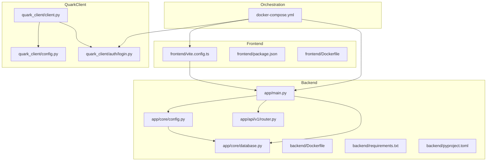

**Diagram sources**
- [docker-compose.yml](file://docker-compose.yml)
- [backend/app/main.py](file://backend/app/main.py)
- [backend/app/core/config.py](file://backend/app/core/config.py)
- [backend/app/core/database.py](file://backend/app/core/database.py)
- [backend/app/api/v1/router.py](file://backend/app/api/v1/router.py)
- [backend/Dockerfile](file://backend/Dockerfile)
- [backend/requirements.txt](file://backend/requirements.txt)
- [backend/pyproject.toml](file://backend/pyproject.toml)
- [frontend/Dockerfile](file://frontend/Dockerfile)
- [frontend/package.json](file://frontend/package.json)
- [frontend/vite.config.ts](file://frontend/vite.config.ts)
- [quark_client/config.py](file://quark_client/config.py)
- [quark_client/client.py](file://quark_client/client.py)
- [quark_client/auth/login.py](file://quark_client/auth/login.py)

**Section sources**
- [PROJECT_SUMMARY.md](file://PROJECT_SUMMARY.md)
- [docker-compose.yml](file://docker-compose.yml)

## Core Components
- Backend configuration and runtime:
  - Settings class defines application name, debug mode, database URL, Redis URL, JWT secret and algorithm, token expiration, and CORS origins. Environment variables are loaded from a .env file via pydantic-settings.
  - Database engine and session factory are configured from settings.
  - FastAPI app registers CORS middleware and mounts API routes under /api/v1.
  - Health endpoints are exposed at root and API level.
- Frontend configuration:
  - Vite dev server runs on port 3000 with proxy configuration to forward /api requests to the backend.
  - Package scripts include dev, build, preview, and lint.
- Orchestration:
  - docker-compose defines services for backend, frontend, Redis, and Celery worker, with shared network and persistent volumes for Redis data and backend data directory.
- QuarkClient configuration:
  - Default HTTP headers, base URLs, timeouts, retries, pagination, chunk sizes, and download directory are defined.
  - Client exposes high-level methods for login, file operations, sharing, and batch operations.

**Section sources**
- [backend/app/core/config.py](file://backend/app/core/config.py)
- [backend/app/core/database.py](file://backend/app/core/database.py)
- [backend/app/main.py](file://backend/app/main.py)
- [backend/app/api/v1/router.py](file://backend/app/api/v1/router.py)
- [frontend/vite.config.ts](file://frontend/vite.config.ts)
- [frontend/package.json](file://frontend/package.json)
- [docker-compose.yml](file://docker-compose.yml)
- [quark_client/config.py](file://quark_client/config.py)
- [quark_client/client.py](file://quark_client/client.py)

## Architecture Overview
The deployment architecture centers on a FastAPI backend, a Vue 3 frontend, Redis for caching/task coordination, and Celery worker for asynchronous tasks. docker-compose orchestrates these services in a single-host environment with explicit network isolation and persistent storage.

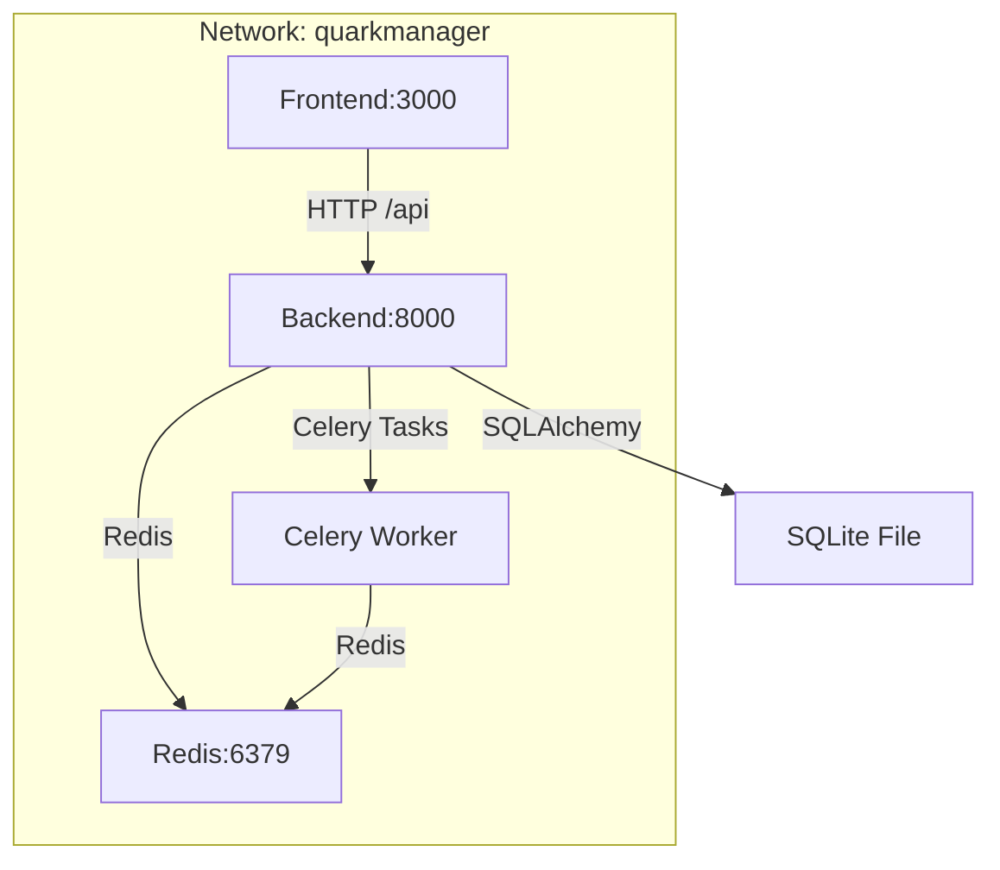

**Diagram sources**
- [docker-compose.yml](file://docker-compose.yml)
- [backend/app/main.py](file://backend/app/main.py)
- [backend/app/core/database.py](file://backend/app/core/database.py)

## Detailed Component Analysis

### Backend Configuration and Runtime
- Settings:
  - Application identity and debug flag
  - Database URL defaults to a SQLite file path
  - Redis URL defaults to localhost
  - Security: HS256 algorithm, 7-day token expiration, and a placeholder secret key
  - CORS allows localhost:3000 origins
  - Loads environment variables from .env
- Database:
  - Engine creation respects SQLite threading constraints
  - Session factory and declarative base for ORM
- API:
  - Root and API-level health checks
  - Router composition for auth and files endpoints

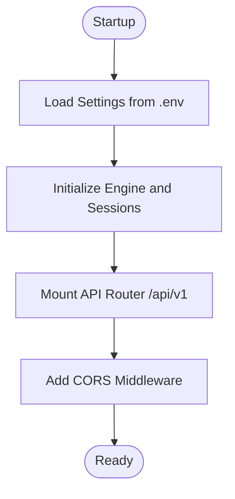

**Diagram sources**
- [backend/app/core/config.py](file://backend/app/core/config.py)
- [backend/app/core/database.py](file://backend/app/core/database.py)
- [backend/app/main.py](file://backend/app/main.py)
- [backend/app/api/v1/router.py](file://backend/app/api/v1/router.py)

**Section sources**
- [backend/app/core/config.py](file://backend/app/core/config.py)
- [backend/app/core/database.py](file://backend/app/core/database.py)
- [backend/app/main.py](file://backend/app/main.py)
- [backend/app/api/v1/router.py](file://backend/app/api/v1/router.py)

### Frontend Proxy Configuration
- Vite dev server listens on port 3000 and proxies /api requests to the backend running on port 8000.
- This simplifies local development by avoiding cross-origin issues during API calls.

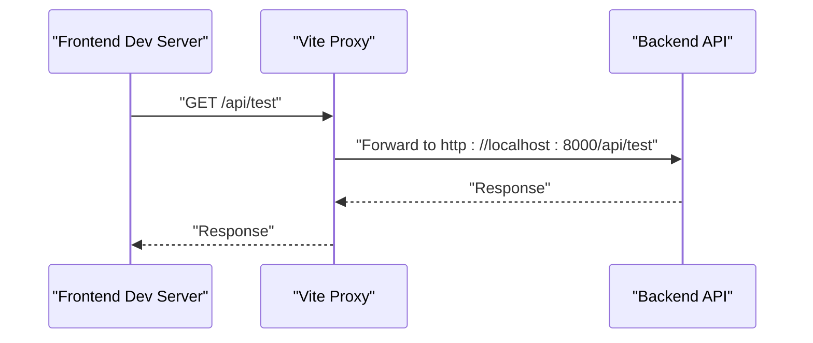

**Diagram sources**
- [frontend/vite.config.ts](file://frontend/vite.config.ts)
- [backend/app/api/v1/router.py](file://backend/app/api/v1/router.py)

**Section sources**
- [frontend/vite.config.ts](file://frontend/vite.config.ts)

### Database Setup
- Default SQLite database URL is set in settings.
- Engine initialization uses SQLite-specific connection arguments.
- For production, switch to PostgreSQL and configure credentials via environment variables.

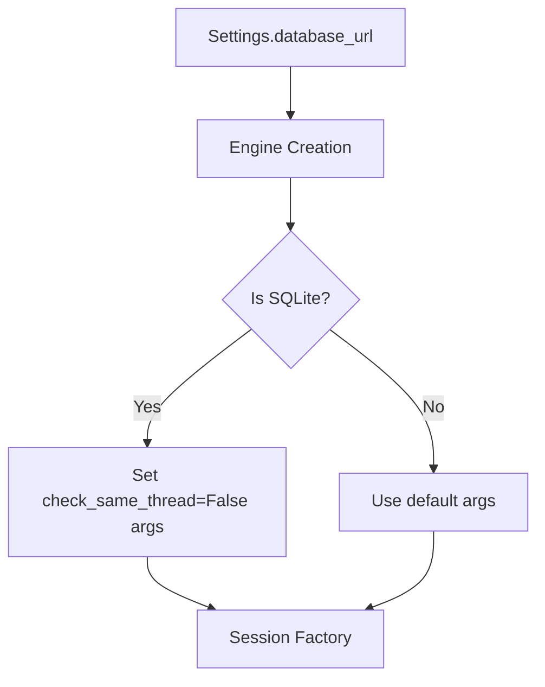

**Diagram sources**
- [backend/app/core/config.py](file://backend/app/core/config.py)
- [backend/app/core/database.py](file://backend/app/core/database.py)

**Section sources**
- [backend/app/core/config.py](file://backend/app/core/config.py)
- [backend/app/core/database.py](file://backend/app/core/database.py)

### QuarkClient Configuration Options
- Default HTTP headers emulate a browser and include origin, referer, accept-language, accept, and content-type.
- Base URLs for cloud drive, share, and account endpoints are defined.
- Request timeout, retry count/delay, pagination limits, chunk size for downloads, and default download directory are configurable.

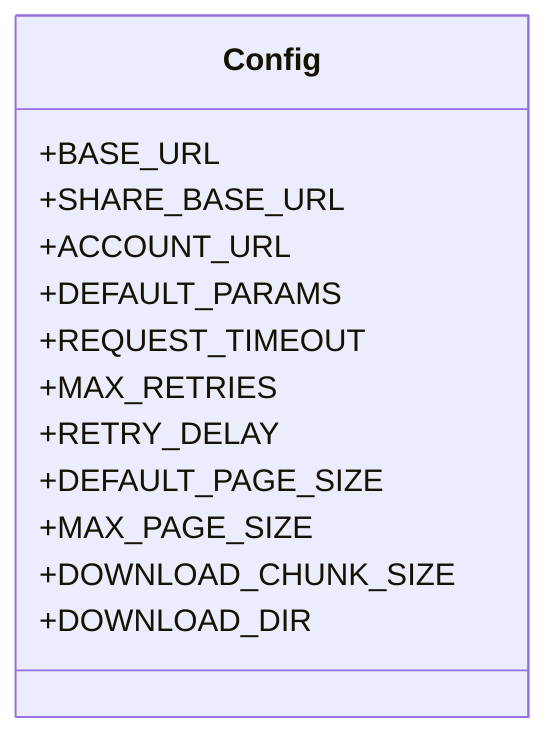

**Diagram sources**
- [quark_client/config.py](file://quark_client/config.py)

**Section sources**
- [quark_client/config.py](file://quark_client/config.py)

### Authentication and Cookies Management
- QuarkAuth manages cookie persistence and validation, supports multiple login methods, and validates required cookie fields.
- Cookies are stored in a JSON file under a configurable directory, with automatic expiry detection and refresh.

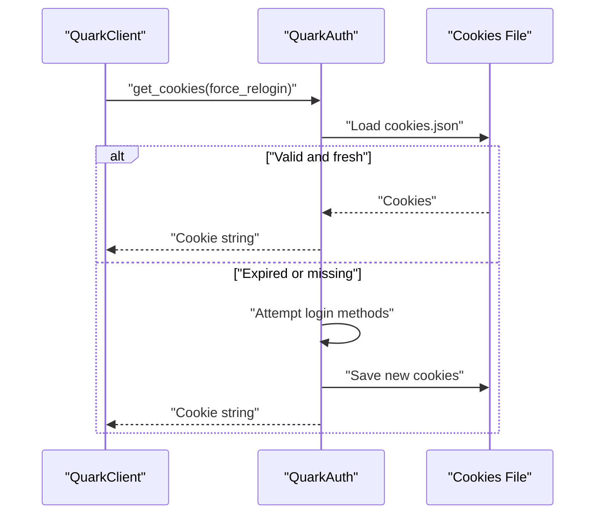

**Diagram sources**
- [quark_client/auth/login.py](file://quark_client/auth/login.py)
- [quark_client/config.py](file://quark_client/config.py)

**Section sources**
- [quark_client/auth/login.py](file://quark_client/auth/login.py)
- [quark_client/config.py](file://quark_client/config.py)

### Docker Deployment with docker-compose
- Services:
  - backend: builds from backend/Dockerfile, exposes 8000, mounts backend and data directories, sets DATABASE_URL and REDIS_URL, depends on redis, joins quarkmanager network.
  - frontend: builds from frontend/Dockerfile, exposes 3000, mounts frontend, depends on backend, joins quarkmanager network.
  - redis: official redis:7-alpine image, persists data to redis_data volume, exposes 6379, joins quarkmanager network.
  - celery-worker: builds from backend/Dockerfile, runs Celery worker with loglevel info, shares environment and volumes with backend, depends on redis, joins quarkmanager network.
- Networks and volumes:
  - A bridge network named quarkmanager isolates services.
  - Named volumes for redis data and backend data directory.

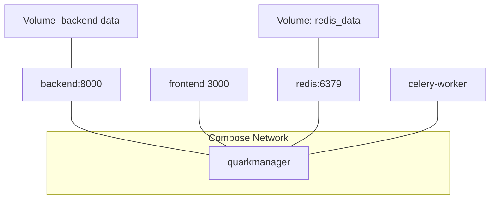

**Diagram sources**
- [docker-compose.yml](file://docker-compose.yml)

**Section sources**
- [docker-compose.yml](file://docker-compose.yml)

### Containerization Approach
- Backend:
  - Python slim image, installs dependencies from requirements.txt, copies source, creates data directory, exposes 8000, runs Uvicorn with host 0.0.0.0.
- Frontend:
  - Node alpine image, installs npm packages from package.json, copies source, exposes 3000, runs Vite dev server.

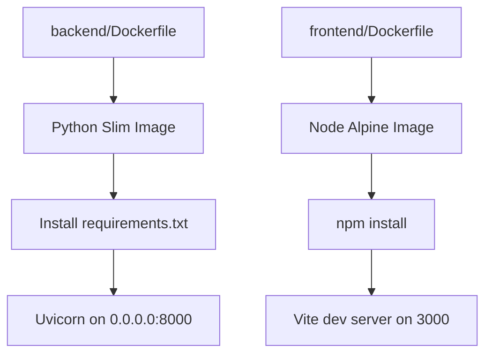

**Diagram sources**
- [backend/Dockerfile](file://backend/Dockerfile)
- [frontend/Dockerfile](file://frontend/Dockerfile)

**Section sources**
- [backend/Dockerfile](file://backend/Dockerfile)
- [frontend/Dockerfile](file://frontend/Dockerfile)

### Health Checks and Service Discovery
- Health endpoints:
  - Root: GET /health
  - API: GET /api/v1/health
- Service discovery:
  - Internal DNS resolution within the docker-compose network allows services to communicate by service name (e.g., redis, backend).

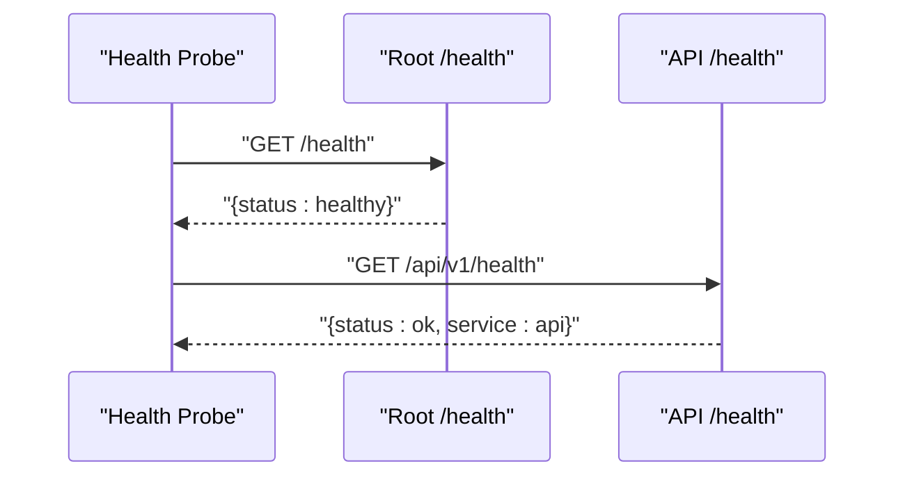

**Diagram sources**
- [backend/app/main.py](file://backend/app/main.py)
- [backend/app/api/v1/router.py](file://backend/app/api/v1/router.py)

**Section sources**
- [backend/app/main.py](file://backend/app/main.py)
- [backend/app/api/v1/router.py](file://backend/app/api/v1/router.py)

## Dependency Analysis
- Backend dependencies include FastAPI, Uvicorn, SQLAlchemy, Alembic, Pydantic, Celery, Redis, httpx, qrcode, rich, tqdm, python-jose, passlib, and python-multipart.
- Frontend dependencies include Vue 3, Element Plus, Pinia, Axios, Vue Router, and Vite toolchain.
- docker-compose orchestrates inter-service dependencies and shared resources.

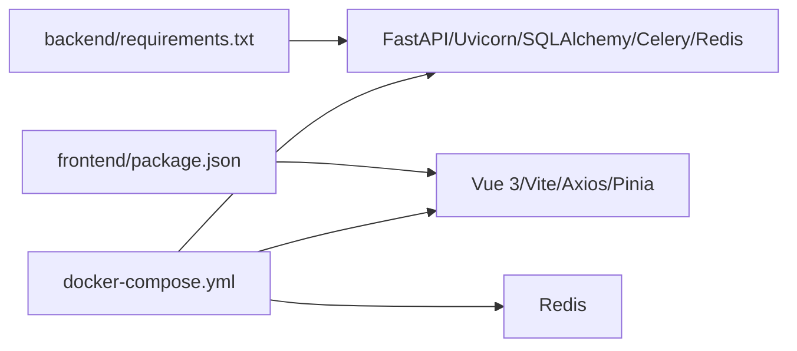

**Diagram sources**
- [backend/requirements.txt](file://backend/requirements.txt)
- [frontend/package.json](file://frontend/package.json)
- [docker-compose.yml](file://docker-compose.yml)

**Section sources**
- [backend/requirements.txt](file://backend/requirements.txt)
- [frontend/package.json](file://frontend/package.json)
- [docker-compose.yml](file://docker-compose.yml)

## Performance Considerations
- Database:
  - Prefer PostgreSQL in production; tune connection pool and max connections.
  - Use migrations (Alembic) for schema changes.
- Caching:
  - Leverage Redis for rate limiting, session storage, and cache invalidation.
- Async tasks:
  - Scale Celery workers horizontally; monitor queue depth and task latency.
- Frontend:
  - Build for production (Vite build) and enable gzip/brotli compression via reverse proxy.
- Backend:
  - Use ASGI server tuning (workers, keepalive) and limit concurrent uploads/downloads.
- Resource allocation:
  - Set CPU/memory limits and requests per service; enable health checks and readiness probes.

[No sources needed since this section provides general guidance]

## Troubleshooting Guide
- CORS errors in development:
  - Ensure frontend proxy targets the backend port and that backend CORS origins include the frontend origin.
- Database connectivity:
  - Verify DATABASE_URL matches the chosen backend (SQLite vs PostgreSQL) and credentials.
- Redis connectivity:
  - Confirm REDIS_URL points to redis service name and port within the compose network.
- Health checks failing:
  - Validate /health and /api/v1/health endpoints are reachable from the host or internal network.
- Cookie persistence:
  - Check cookies.json exists and is readable; ensure QUARK_CONFIG_DIR is set if using a custom directory.
- Port conflicts:
  - Change mapped ports in docker-compose if 8000 or 3000 are in use.

**Section sources**
- [frontend/vite.config.ts](file://frontend/vite.config.ts)
- [backend/app/core/config.py](file://backend/app/core/config.py)
- [backend/app/main.py](file://backend/app/main.py)
- [docker-compose.yml](file://docker-compose.yml)
- [quark_client/auth/login.py](file://quark_client/auth/login.py)

## Conclusion
QuarkManager’s configuration and deployment model leverages a clear separation of concerns across backend, frontend, and client libraries, orchestrated by docker-compose. By aligning environment variables, database choices, and Redis usage with production-grade patterns—such as PostgreSQL, horizontal scaling, SSL termination, and robust monitoring—you can reliably operate QuarkManager in diverse environments. Apply the provided configuration examples, secrets management strategies, and troubleshooting steps to streamline setup and maintenance.

[No sources needed since this section summarizes without analyzing specific files]

## Appendices

### Environment Variables Reference
- Backend settings loaded from .env:
  - APP_NAME, DEBUG, DATABASE_URL, REDIS_URL, SECRET_KEY, ALGORITHM, ACCESS_TOKEN_EXPIRE_MINUTES, BACKEND_CORS_ORIGINS
- Frontend:
  - No environment variables are defined in the provided Vite configuration; proxy target is hardcoded to backend port 8000.
- QuarkClient:
  - QUARK_CONFIG_DIR controls the configuration directory for cookies and related artifacts.

**Section sources**
- [backend/app/core/config.py](file://backend/app/core/config.py)
- [frontend/vite.config.ts](file://frontend/vite.config.ts)
- [quark_client/config.py](file://quark_client/config.py)

### Production Deployment Checklist
- Replace SQLite with PostgreSQL and manage credentials securely.
- Configure SSL/TLS termination at a reverse proxy/load balancer.
- Enable horizontal scaling for backend and Celery worker services.
- Set up centralized logging and metrics collection.
- Implement secrets management for DATABASE_URL, REDIS_URL, SECRET_KEY, and Quark account cookies.
- Back up Redis data and backend data directory volumes regularly.
- Plan disaster recovery procedures for database and Redis failover.

[No sources needed since this section provides general guidance]