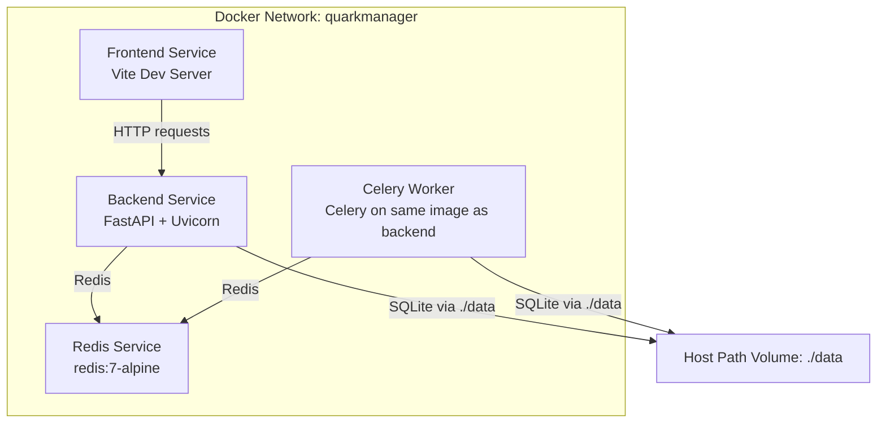
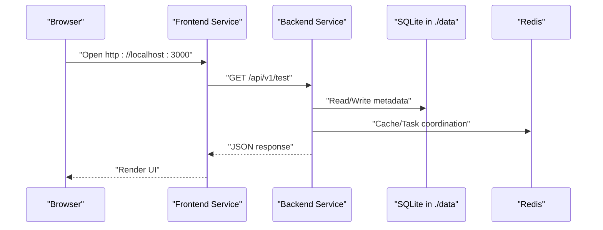
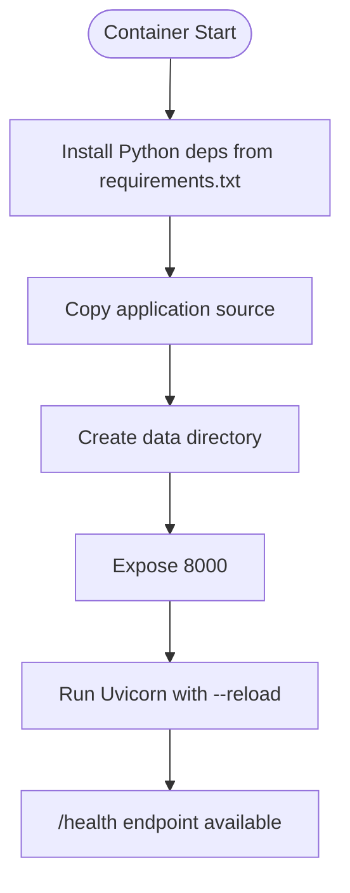
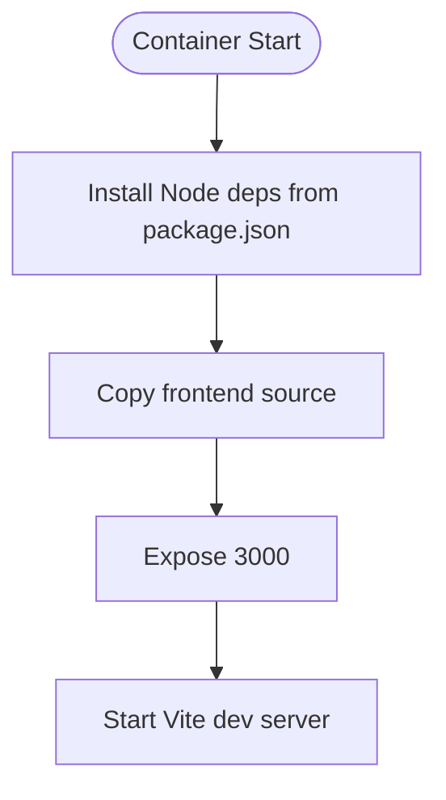
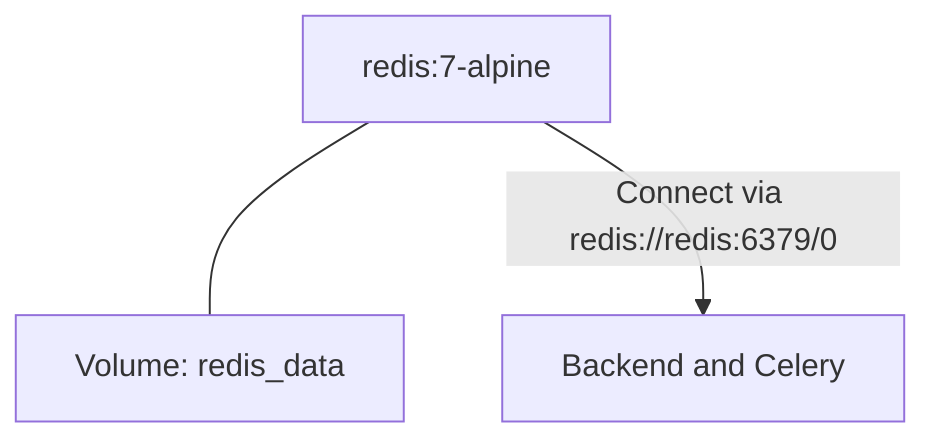
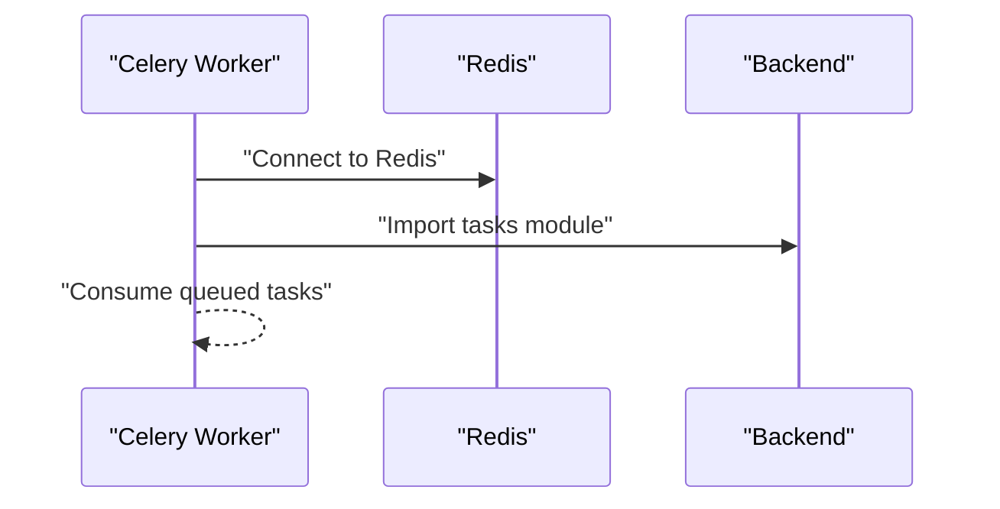
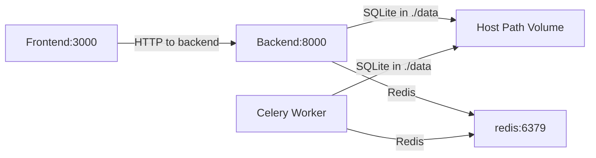
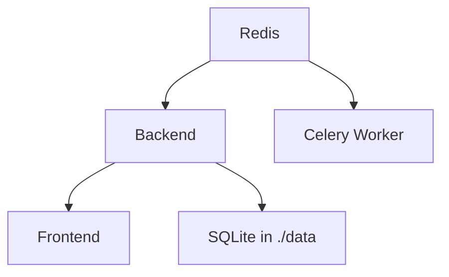

# Docker Deployment

<cite>
**Referenced Files in This Document**
- [docker-compose.yml](file://docker-compose.yml)
- [backend/Dockerfile](file://backend/Dockerfile)
- [frontend/Dockerfile](file://frontend/Dockerfile)
- [backend/requirements.txt](file://backend/requirements.txt)
- [backend/pyproject.toml](file://backend/pyproject.toml)
- [frontend/package.json](file://frontend/package.json)
- [backend/app/main.py](file://backend/app/main.py)
- [backend/app/core/config.py](file://backend/app/core/config.py)
- [backend/app/api/v1/router.py](file://backend/app/api/v1/router.py)
- [backend/app/api/v1/auth.py](file://backend/app/api/v1/auth.py)
- [backend/app/api/v1/files.py](file://backend/app/api/v1/files.py)
</cite>

## Table of Contents
1. [Introduction](#introduction)
2. [Project Structure](#project-structure)
3. [Core Components](#core-components)
4. [Architecture Overview](#architecture-overview)
5. [Detailed Component Analysis](#detailed-component-analysis)
6. [Dependency Analysis](#dependency-analysis)
7. [Performance Considerations](#performance-considerations)
8. [Troubleshooting Guide](#troubleshooting-guide)
9. [Conclusion](#conclusion)
10. [Appendices](#appendices)

## Introduction
This document explains how to deploy QuarkManager using Docker and docker-compose. It covers the service topology, container networking, persistent storage via volumes, inter-service communication, multi-stage-like build processes for backend and frontend, service dependencies and startup ordering, health checks, scaling guidance, security and resource considerations, and operational troubleshooting.

## Project Structure
QuarkManager consists of:
- Backend service built with Python/FastAPI and Uvicorn, exposing REST APIs and integrating Celery for async tasks.
- Frontend service built with Node/Vite, serving a Vue-based web UI.
- Redis cache/state store used by backend and Celery.
- Celery worker service that runs alongside the backend image to process asynchronous tasks.

**Diagram sources**
- [docker-compose.yml:3-64](file://docker-compose.yml#L3-L64)

**Section sources**
- [docker-compose.yml:1-65](file://docker-compose.yml#L1-L65)

## Core Components
- Backend service
  - Purpose: REST API server for authentication and file management.
  - Ports: Exposes 8000 internally; mapped to host 8000.
  - Environment: DATABASE_URL and REDIS_URL configured for SQLite and Redis.
  - Volumes: Mounts backend code and persistent data directory for SQLite.
  - Dependencies: Starts after Redis; depends_on ensures ordering.
  - Health endpoint: Provides a root and an explicit /health endpoint.

- Frontend service
  - Purpose: Development server for the Vue SPA.
  - Ports: Exposes 3000 internally; mapped to host 3000.
  - Volumes: Mounts frontend code for live development.
  - Dependencies: Starts after Backend; depends_on ensures ordering.

- Redis service
  - Purpose: Caching and task queue broker.
  - Ports: Exposes 6379 internally; mapped to host 6379.
  - Volumes: Persists Redis data to a named volume.

- Celery worker service
  - Purpose: Runs Celery worker using the same backend image.
  - Command: Invokes Celery with the configured app module path.
  - Environment: Shares DATABASE_URL and REDIS_URL with backend.
  - Volumes: Shares backend code and data directory with backend.
  - Dependencies: Starts after Redis; depends_on ensures ordering.

**Section sources**
- [docker-compose.yml:4-57](file://docker-compose.yml#L4-L57)
- [backend/app/main.py:31-40](file://backend/app/main.py#L31-L40)

## Architecture Overview
The deployment uses a single custom bridge network so all services can communicate by service name. The frontend communicates with the backend over HTTP; the backend and Celery worker both connect to Redis and use the shared SQLite database under the mounted data directory.

**Diagram sources**
- [docker-compose.yml:3-64](file://docker-compose.yml#L3-L64)
- [backend/app/api/v1/router.py:9-18](file://backend/app/api/v1/router.py#L9-L18)
- [backend/app/main.py:31-40](file://backend/app/main.py#L31-L40)

## Detailed Component Analysis

### Backend Service
- Build and runtime
  - Multi-stage-like process: installs Python dependencies, copies source, creates data directory, exposes port, and starts Uvicorn with hot reload enabled.
  - Uses requirements pinned in the repository for deterministic builds.
- Configuration
  - Reads settings from environment and .env; supports configurable database URL and Redis URL.
  - CORS origins include localhost:3000 for local development.
- API surface
  - Root and health endpoints for readiness.
  - Aggregates v1 routes for auth and files.

**Diagram sources**
- [backend/Dockerfile:1-15](file://backend/Dockerfile#L1-L15)
- [backend/requirements.txt:1-25](file://backend/requirements.txt#L1-L25)
- [backend/app/main.py:31-40](file://backend/app/main.py#L31-L40)

**Section sources**
- [backend/Dockerfile:1-15](file://backend/Dockerfile#L1-L15)
- [backend/requirements.txt:1-25](file://backend/requirements.txt#L1-L25)
- [backend/app/core/config.py:5-28](file://backend/app/core/config.py#L5-L28)
- [backend/app/main.py:12-25](file://backend/app/main.py#L12-L25)
- [backend/app/api/v1/router.py:6-24](file://backend/app/api/v1/router.py#L6-L24)

### Frontend Service
- Build and runtime
  - Installs Node dependencies from package.json, exposes port 3000, and starts Vite dev server.
- Development workflow
  - Live-reload enabled via Vite dev server; code mounted from host for rapid iteration.

**Diagram sources**
- [frontend/Dockerfile:1-13](file://frontend/Dockerfile#L1-L13)
- [frontend/package.json:1-31](file://frontend/package.json#L1-L31)

**Section sources**
- [frontend/Dockerfile:1-13](file://frontend/Dockerfile#L1-L13)
- [frontend/package.json:1-31](file://frontend/package.json#L1-L31)

### Redis Service
- Image: Official redis:7-alpine.
- Persistence: Named volume for Redis data.
- Networking: Part of the same bridge network; reachable by service name.

**Diagram sources**
- [docker-compose.yml:34-41](file://docker-compose.yml#L34-L41)

**Section sources**
- [docker-compose.yml:34-41](file://docker-compose.yml#L34-L41)

### Celery Worker Service
- Image: Same as backend (multi-purpose image).
- Command: Runs Celery worker pointing to the Celery app module path.
- Environment: Inherits database and Redis URLs from compose environment.
- Volumes: Shares backend code and data directory.

**Diagram sources**
- [docker-compose.yml:43-57](file://docker-compose.yml#L43-L57)

**Section sources**
- [docker-compose.yml:43-57](file://docker-compose.yml#L43-L57)

### Inter-Service Communication
- Backend to Redis: Configured via REDIS_URL; uses service name “redis” inside the network.
- Backend to SQLite: DATABASE_URL points to a mounted path under ./data.
- Frontend to Backend: Accessible via http://backend:8000 from within the network; externally exposed on port 8000.
- Celery to Redis: Shares the same REDIS_URL as backend.

**Diagram sources**
- [docker-compose.yml:3-64](file://docker-compose.yml#L3-L64)
- [backend/app/core/config.py:11-14](file://backend/app/core/config.py#L11-L14)

**Section sources**
- [docker-compose.yml:8-12](file://docker-compose.yml#L8-L12)
- [backend/app/core/config.py:11-14](file://backend/app/core/config.py#L11-L14)

## Dependency Analysis
- Startup order
  - Redis starts first; backend and Celery both declare depends_on redis.
  - Frontend declares depends_on backend to ensure API availability during development.
- Internal dependencies
  - Backend depends on SQLAlchemy for ORM and Alembic for migrations.
  - Backend integrates Celery and Redis for async task processing.
  - Frontend depends on Vue, Pinia, Axios, and Vite for development.

**Diagram sources**
- [docker-compose.yml:16-30](file://docker-compose.yml#L16-L30)
- [backend/requirements.txt:2-24](file://backend/requirements.txt#L2-L24)
- [backend/pyproject.toml:13-27](file://backend/pyproject.toml#L13-L27)
- [frontend/package.json:11-29](file://frontend/package.json#L11-L29)

**Section sources**
- [docker-compose.yml:16-30](file://docker-compose.yml#L16-L30)
- [backend/requirements.txt:2-24](file://backend/requirements.txt#L2-L24)
- [backend/pyproject.toml:13-27](file://backend/pyproject.toml#L13-L27)
- [frontend/package.json:11-29](file://frontend/package.json#L11-L29)

## Performance Considerations
- Hot reload in development
  - Backend uses Uvicorn with --reload; Frontend uses Vite dev server. These are optimized for developer productivity but not recommended for production.
- Resource limits
  - Consider adding memory and CPU constraints per service in production deployments to prevent resource contention.
- Database I/O
  - SQLite is suitable for development; for production, migrate to a managed database and externalize migrations.
- Redis sizing
  - Tune Redis memory and persistence settings according to workload; monitor keyspace and memory usage.

[No sources needed since this section provides general guidance]

## Troubleshooting Guide
- Port conflicts
  - Symptom: Containers fail to start or show port binding errors.
  - Resolution: Change host ports in docker-compose.yml or stop conflicting services on the host.
  - Reference: Backend and Frontend expose ports 8000 and 3000 respectively.
  
  **Section sources**
  - [docker-compose.yml:8-26](file://docker-compose.yml#L8-L26)

- Volume mounting issues
  - Symptom: Data not persisting or code changes not reflected.
  - Resolution: Verify ./data exists and has proper permissions; ensure ./backend and ./frontend mounts are correct.
  - Reference: Backend and Celery mount ./data; Frontend mounts ./frontend; Redis uses named volume redis_data.
  
  **Section sources**
  - [docker-compose.yml:13-15](file://docker-compose.yml#L13-L15)
  - [docker-compose.yml:27-29](file://docker-compose.yml#L27-L29)
  - [docker-compose.yml:38-40](file://docker-compose.yml#L38-L40)

- Service connectivity
  - Symptom: Frontend cannot reach backend or backend cannot reach Redis.
  - Resolution: Confirm all services are on the same network quarkmanager; verify REDIS_URL and DATABASE_URL match the compose environment; check depends_on ordering.
  - Reference: All services join quarkmanager; backend reads DATABASE_URL and REDIS_URL; Celery shares the same environment.
  
  **Section sources**
  - [docker-compose.yml:18-19](file://docker-compose.yml#L18-L19)
  - [docker-compose.yml:31-32](file://docker-compose.yml#L31-L32)
  - [docker-compose.yml:44-50](file://docker-compose.yml#L44-L50)

- Health checks
  - Symptom: Load balancer or monitoring reports unhealthy services.
  - Resolution: Use /health endpoints exposed by backend and ensure they return healthy responses.
  
  **Section sources**
  - [backend/app/main.py:37-40](file://backend/app/main.py#L37-L40)
  - [backend/app/api/v1/router.py:15-18](file://backend/app/api/v1/router.py#L15-L18)

- Celery worker not consuming tasks
  - Symptom: Tasks are enqueued but never processed.
  - Resolution: Ensure Celery command targets the correct module path; confirm Redis connectivity; verify environment variables match backend.
  
  **Section sources**
  - [docker-compose.yml:47](file://docker-compose.yml#L47)
  - [docker-compose.yml:48-50](file://docker-compose.yml#L48-L50)

## Conclusion
The docker-compose setup provides a cohesive development environment for QuarkManager with clear separation of concerns across backend, frontend, Redis, and Celery worker. By leveraging named volumes for persistence, a custom bridge network for service discovery, and environment-driven configuration, teams can iterate quickly while maintaining predictable behavior. For production, consider replacing hot reload with optimized production servers, migrating to a managed database, and adding health checks, resource limits, and secrets management.

[No sources needed since this section summarizes without analyzing specific files]

## Appendices

### Practical Deployment Examples
- Start all services
  - docker-compose up -d
- View logs
  - docker-compose logs -f backend
  - docker-compose logs -f frontend
  - docker-compose logs -f redis
  - docker-compose logs -f celery-worker
- Scale services
  - docker-compose up -d --scale backend=2
  - docker-compose up -d --scale celery-worker=2
- Stop and remove
  - docker-compose down

[No sources needed since this section provides general guidance]

### Security Best Practices
- Secrets management
  - Store sensitive configuration (e.g., secret keys) in environment files or secrets managers; avoid committing secrets to the repository.
- Network isolation
  - Keep services on an internal network; avoid publishing unnecessary ports to the host.
- Image hygiene
  - Pin base images and update regularly; scan images for vulnerabilities.
- Health checks
  - Add health checks to services to enable automatic restarts and load balancer decisions.

[No sources needed since this section provides general guidance]

### Logging Configuration
- Backend
  - Uvicorn log level can be adjusted; consider structured logging for observability.
- Frontend
  - Vite dev server logs are useful for development; for production, serve built assets with a reverse proxy and configure application logs accordingly.
- Redis
  - Enable appropriate logging and monitoring; consider exporting metrics for alerting.

[No sources needed since this section provides general guidance]