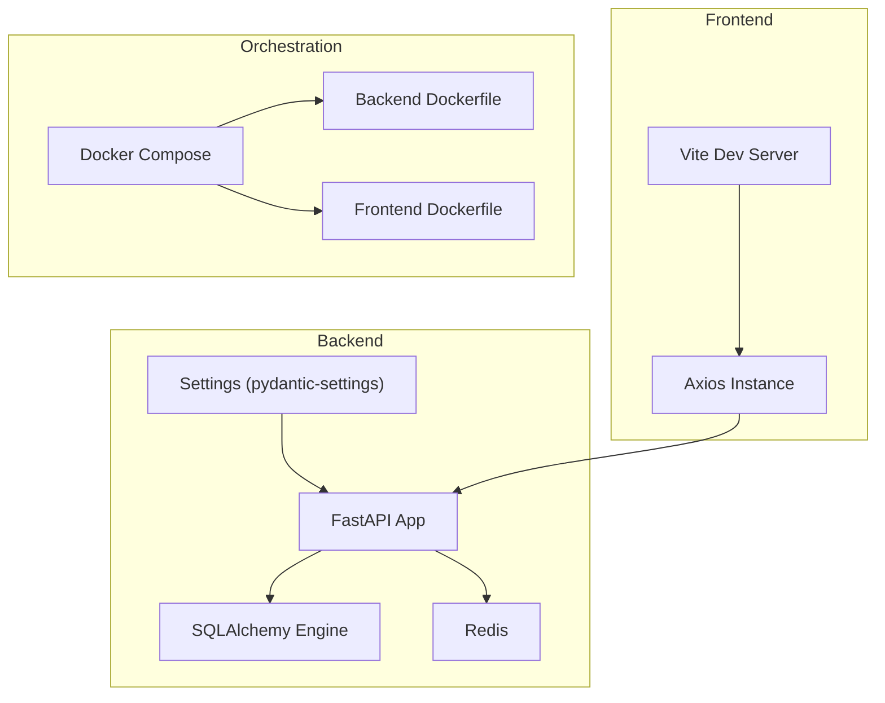
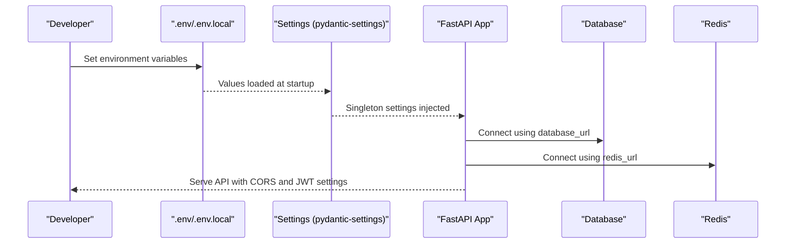
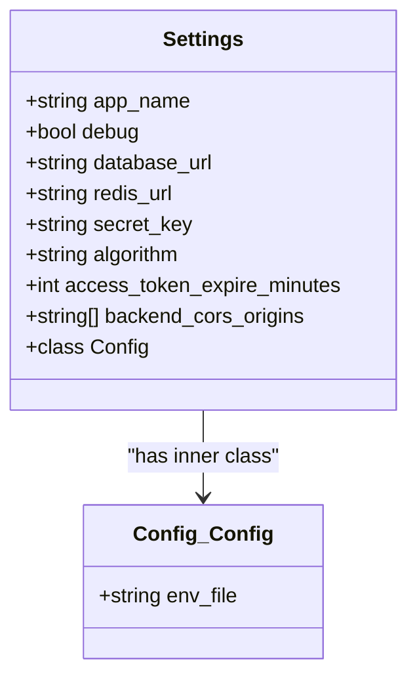
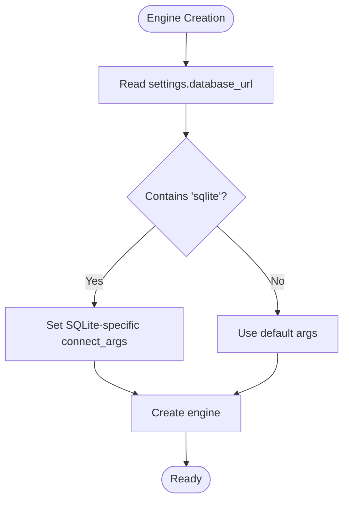
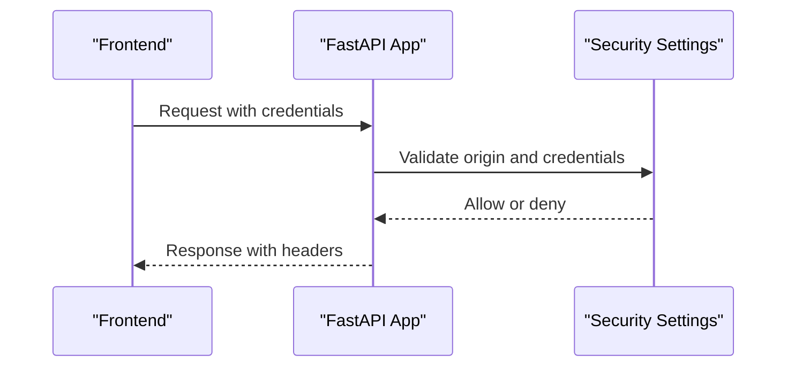
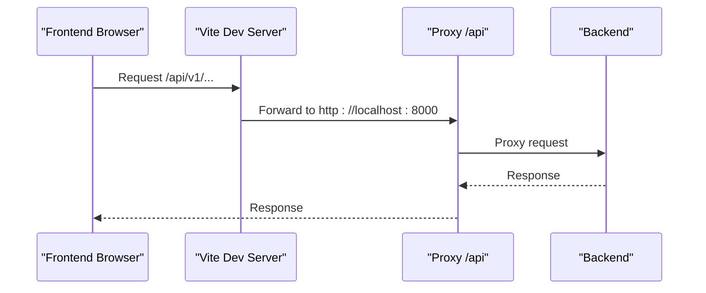
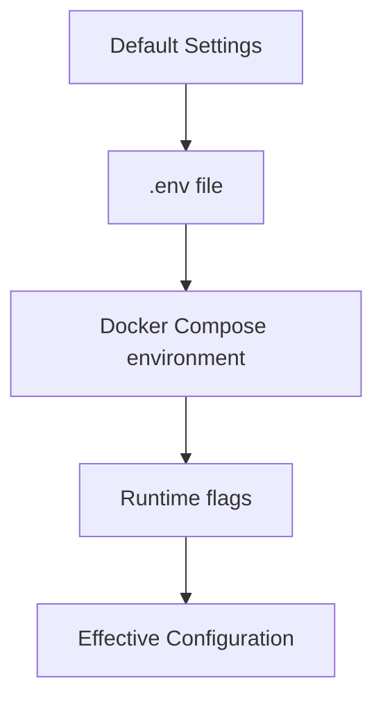
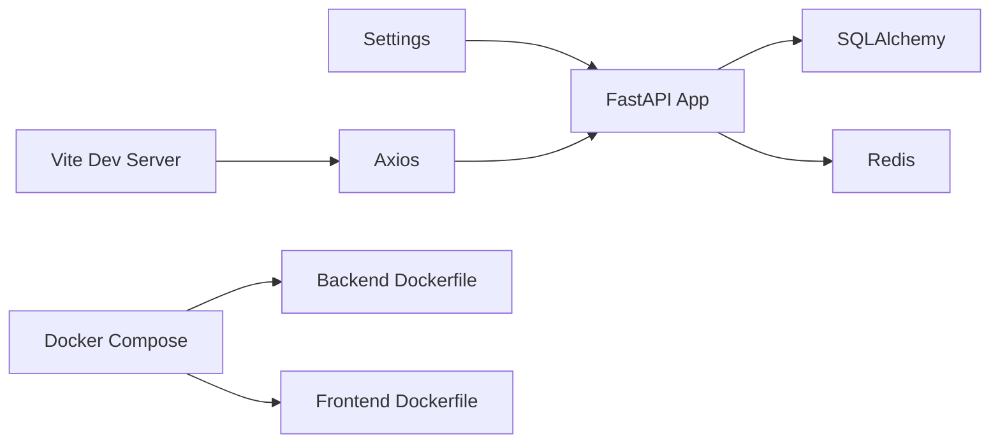

# Environment Configuration

<cite>
**Referenced Files in This Document**
- [backend/app/core/config.py](file://backend/app/core/config.py)
- [backend/app/main.py](file://backend/app/main.py)
- [backend/app/core/database.py](file://backend/app/core/database.py)
- [backend/Dockerfile](file://backend/Dockerfile)
- [docker-compose.yml](file://docker-compose.yml)
- [frontend/vite.config.ts](file://frontend/vite.config.ts)
- [frontend/src/api/index.ts](file://frontend/src/api/index.ts)
- [frontend/Dockerfile](file://frontend/Dockerfile)
- [backend/pyproject.toml](file://backend/pyproject.toml)
- [backend/requirements.txt](file://backend/requirements.txt)
- [quark_client/config.py](file://quark_client/config.py)
</cite>

## Table of Contents
1. [Introduction](#introduction)
2. [Project Structure](#project-structure)
3. [Core Components](#core-components)
4. [Architecture Overview](#architecture-overview)
5. [Detailed Component Analysis](#detailed-component-analysis)
6. [Dependency Analysis](#dependency-analysis)
7. [Performance Considerations](#performance-considerations)
8. [Troubleshooting Guide](#troubleshooting-guide)
9. [Conclusion](#conclusion)
10. [Appendices](#appendices)

## Introduction
This document explains how to configure QuarkManager for both development and production environments. It covers backend configuration (database, Redis, authentication, CORS), frontend environment variables and proxy settings, and operational differences between development and production. It also documents configuration hierarchy, secrets management via .env files, validation, and security considerations, along with templates for common deployment scenarios.

## Project Structure
QuarkManager consists of:
- Backend service built with FastAPI, SQLAlchemy, Celery, and Redis
- Frontend built with Vue 3, TypeScript, and Vite
- Shared client library for Quark-related operations
- Docker Compose orchestration for local development

**Diagram sources**
- [backend/app/core/config.py:5-34](file://backend/app/core/config.py#L5-L34)
- [backend/app/main.py:12-25](file://backend/app/main.py#L12-L25)
- [backend/app/core/database.py:10-13](file://backend/app/core/database.py#L10-L13)
- [frontend/vite.config.ts:12-20](file://frontend/vite.config.ts#L12-L20)
- [frontend/src/api/index.ts:3-9](file://frontend/src/api/index.ts#L3-L9)
- [docker-compose.yml:4-57](file://docker-compose.yml#L4-L57)
- [backend/Dockerfile:14](file://backend/Dockerfile#L14)
- [frontend/Dockerfile:12](file://frontend/Dockerfile#L12)

**Section sources**
- [docker-compose.yml:1-65](file://docker-compose.yml#L1-L65)
- [backend/Dockerfile:1-15](file://backend/Dockerfile#L1-L15)
- [frontend/Dockerfile:1-13](file://frontend/Dockerfile#L1-L13)

## Core Components
- Backend configuration model and defaults
  - Application name, debug mode, database URL, Redis URL, JWT secret and algorithm, token expiry, and CORS origins
  - Loads from .env via pydantic-settings
- Frontend configuration
  - Vite dev server proxy for API requests
  - Axios base URL and interceptors
- Orchestration
  - Docker Compose defines environment variables for backend and Celery worker
  - Dockerfiles set runtime behavior (reload in dev, no reload in prod)

**Section sources**
- [backend/app/core/config.py:5-34](file://backend/app/core/config.py#L5-L34)
- [backend/app/main.py:12-25](file://backend/app/main.py#L12-L25)
- [backend/app/core/database.py:10-13](file://backend/app/core/database.py#L10-L13)
- [frontend/vite.config.ts:12-20](file://frontend/vite.config.ts#L12-L20)
- [frontend/src/api/index.ts:3-9](file://frontend/src/api/index.ts#L3-L9)
- [docker-compose.yml:10-12](file://docker-compose.yml#L10-L12)
- [docker-compose.yml:48-50](file://docker-compose.yml#L48-L50)

## Architecture Overview
The configuration system follows a layered hierarchy:
- Defaults in the settings model
- Environment variable overrides (.env and docker-compose)
- Runtime behavior controlled by Dockerfiles and FastAPI/Uvicorn settings

**Diagram sources**
- [backend/app/core/config.py:27-28](file://backend/app/core/config.py#L27-L28)
- [backend/app/core/config.py:31-34](file://backend/app/core/config.py#L31-L34)
- [backend/app/main.py:12-25](file://backend/app/main.py#L12-L25)
- [backend/app/core/database.py:10-13](file://backend/app/core/database.py#L10-L13)

## Detailed Component Analysis

### Backend Configuration Model
- Purpose: Centralized configuration with defaults and environment override support
- Key settings:
  - Application identity and debug flag
  - Database URL (default SQLite for development)
  - Redis URL (default localhost)
  - Security: secret key, signing algorithm, token expiry minutes
  - CORS origins list
- Loading mechanism:
  - Uses pydantic-settings BaseSettings with env_file pointing to .env
  - Singletons via LRU cache for performance

**Diagram sources**
- [backend/app/core/config.py:5-29](file://backend/app/core/config.py#L5-L29)

**Section sources**
- [backend/app/core/config.py:5-34](file://backend/app/core/config.py#L5-L34)

### Database Configuration
- Default: SQLite file-based database for development
- Production: Replace database_url with a PostgreSQL connection string
- Engine creation conditionally sets SQLite-specific arguments

**Diagram sources**
- [backend/app/core/database.py:10-13](file://backend/app/core/database.py#L10-L13)

**Section sources**
- [backend/app/core/database.py:10-13](file://backend/app/core/database.py#L10-L13)

### Redis Configuration
- Default: redis://localhost:6379/0
- Used for caching and Celery task queues
- In Docker Compose, backend and Celery worker share a Redis service

**Section sources**
- [backend/app/core/config.py:13-14](file://backend/app/core/config.py#L13-L14)
- [docker-compose.yml:34-41](file://docker-compose.yml#L34-L41)
- [docker-compose.yml:43-57](file://docker-compose.yml#L43-L57)

### Authentication and Security Settings
- Secret key and JWT algorithm are configurable
- Access token expiry is configurable in minutes
- CORS allows credentials and all methods/headers for configured origins

**Diagram sources**
- [backend/app/main.py:18-25](file://backend/app/main.py#L18-L25)
- [backend/app/core/config.py:16-25](file://backend/app/core/config.py#L16-L25)

**Section sources**
- [backend/app/main.py:18-25](file://backend/app/main.py#L18-L25)
- [backend/app/core/config.py:16-25](file://backend/app/core/config.py#L16-L25)

### CORS Configuration
- Origins include typical development frontends
- Credentials, methods, and headers are permissive by default

**Section sources**
- [backend/app/core/config.py:21-25](file://backend/app/core/config.py#L21-L25)
- [backend/app/main.py:18-25](file://backend/app/main.py#L18-L25)

### Frontend Environment Variables and Proxy
- Vite dev server proxy forwards /api to backend
- Axios base URL targets /api/v1
- No environment variables are read at runtime; proxy and base URL are compiled into dev server behavior

**Diagram sources**
- [frontend/vite.config.ts:14-19](file://frontend/vite.config.ts#L14-L19)
- [frontend/src/api/index.ts:4](file://frontend/src/api/index.ts#L4)

**Section sources**
- [frontend/vite.config.ts:12-20](file://frontend/vite.config.ts#L12-L20)
- [frontend/src/api/index.ts:3-9](file://frontend/src/api/index.ts#L3-L9)

### Development vs Production Differences
- Development
  - SQLite database by default
  - Uvicorn reload enabled in Dockerfile CMD
  - Permissive CORS for local frontend
  - Debug mode enabled in settings
- Production
  - Replace database_url with PostgreSQL
  - Disable reload in production containerization
  - Tighten CORS origins to trusted domains
  - Rotate and secure secret_key and JWT algorithm

**Section sources**
- [backend/app/core/config.py:8](file://backend/app/core/config.py#L8)
- [backend/Dockerfile:14](file://backend/Dockerfile#L14)
- [docker-compose.yml:10-12](file://docker-compose.yml#L10-L12)
- [docker-compose.yml:48-50](file://docker-compose.yml#L48-L50)

### Configuration Hierarchy and Overrides
- Default values in Settings
- .env file overrides (env_file = ".env")
- Docker Compose environment variables override .env at runtime
- FastAPI/Uvicorn runtime flags can override behavior (e.g., reload)

**Diagram sources**
- [backend/app/core/config.py:27-28](file://backend/app/core/config.py#L27-L28)
- [docker-compose.yml:10-12](file://docker-compose.yml#L10-L12)
- [docker-compose.yml:48-50](file://docker-compose.yml#L48-L50)
- [backend/Dockerfile:14](file://backend/Dockerfile#L14)

**Section sources**
- [backend/app/core/config.py:27-28](file://backend/app/core/config.py#L27-L28)
- [docker-compose.yml:10-12](file://docker-compose.yml#L10-L12)
- [docker-compose.yml:48-50](file://docker-compose.yml#L48-L50)

### Secrets Management Using .env
- Place sensitive keys in .env
- Settings loads from env_file = ".env"
- DO NOT commit .env to version control
- Use .env.local for local overrides outside of version control

**Section sources**
- [backend/app/core/config.py:27-28](file://backend/app/core/config.py#L27-L28)

### Configuration Validation
- pydantic-settings validates types and presence of required fields
- Use explicit environment variables for production to avoid missing values
- Validate database connectivity and Redis reachability during startup checks

**Section sources**
- [backend/app/core/config.py:1-34](file://backend/app/core/config.py#L1-L34)

### Practical Examples and Templates

- Backend environment template
  - SQLite for development
  - PostgreSQL for production
  - Redis URL for local or remote Redis
  - JWT secret and algorithm
  - CORS origins for frontend domains

- Frontend template
  - Vite proxy target to backend host/port
  - Axios base URL for API routes

- Docker Compose template
  - Define DATABASE_URL and REDIS_URL environment variables
  - Mount persistent volumes for data and Redis

- Celery worker template
  - Same environment variables as backend
  - Separate service with Celery command

- Quark client configuration
  - API base URLs and request defaults
  - Not affected by backend .env but can be extended similarly

**Section sources**
- [backend/app/core/config.py:10-25](file://backend/app/core/config.py#L10-L25)
- [frontend/vite.config.ts:14-19](file://frontend/vite.config.ts#L14-L19)
- [frontend/src/api/index.ts:4](file://frontend/src/api/index.ts#L4)
- [docker-compose.yml:10-12](file://docker-compose.yml#L10-L12)
- [docker-compose.yml:48-50](file://docker-compose.yml#L48-L50)
- [quark_client/config.py:37-63](file://quark_client/config.py#L37-L63)

## Dependency Analysis
- Backend depends on pydantic-settings for configuration and SQLAlchemy for database
- Redis is used by backend and Celery worker
- Frontend depends on Vite for dev/proxy and Axios for API calls
- Docker Compose ties services together and injects environment variables

**Diagram sources**
- [backend/pyproject.toml:13-27](file://backend/pyproject.toml#L13-L27)
- [backend/requirements.txt:13-17](file://backend/requirements.txt#L13-L17)
- [frontend/vite.config.ts:12-20](file://frontend/vite.config.ts#L12-L20)
- [frontend/src/api/index.ts:3-9](file://frontend/src/api/index.ts#L3-L9)
- [docker-compose.yml:4-57](file://docker-compose.yml#L4-L57)

**Section sources**
- [backend/pyproject.toml:13-27](file://backend/pyproject.toml#L13-L27)
- [backend/requirements.txt:13-17](file://backend/requirements.txt#L13-L17)
- [docker-compose.yml:4-57](file://docker-compose.yml#L4-L57)

## Performance Considerations
- Use PostgreSQL in production for concurrency and reliability
- Keep Redis close to backend/Celery to minimize latency
- Avoid enabling reload in production containers
- Limit CORS origins to trusted domains to reduce overhead and risk

## Troubleshooting Guide
- Health check endpoint
  - Verify backend availability at /health
- Database connectivity
  - Confirm database_url resolves and credentials are valid
- Redis connectivity
  - Ensure redis_url points to a reachable Redis instance
- CORS errors
  - Add frontend origins to backend_cors_origins
- Proxy issues
  - Confirm Vite proxy target matches backend host/port

**Section sources**
- [backend/app/main.py:37-40](file://backend/app/main.py#L37-L40)
- [backend/app/core/database.py:10-13](file://backend/app/core/database.py#L10-L13)
- [backend/app/core/config.py:21-25](file://backend/app/core/config.py#L21-L25)
- [frontend/vite.config.ts:14-19](file://frontend/vite.config.ts#L14-L19)

## Conclusion
QuarkManager’s environment configuration is centralized in the backend settings model, overridden by .env and Docker Compose, and consumed by FastAPI, SQLAlchemy, and the frontend. For development, SQLite and local Redis are sufficient. For production, switch to PostgreSQL, secure secrets, tighten CORS, and disable reload. Use the provided templates and validation steps to ensure reliable deployments.

## Appendices

### Environment Variable Reference
- DATABASE_URL: Database connection string (SQLite for dev, PostgreSQL for prod)
- REDIS_URL: Redis connection string
- SECRET_KEY: JWT signing key
- ALGORITHM: JWT algorithm
- ACCESS_TOKEN_EXPIRE_MINUTES: Token lifetime
- BACKEND_CORS_ORIGINS: Comma-separated list of allowed origins

**Section sources**
- [backend/app/core/config.py:10-25](file://backend/app/core/config.py#L10-L25)
- [docker-compose.yml:10-12](file://docker-compose.yml#L10-L12)
- [docker-compose.yml:48-50](file://docker-compose.yml#L48-L50)