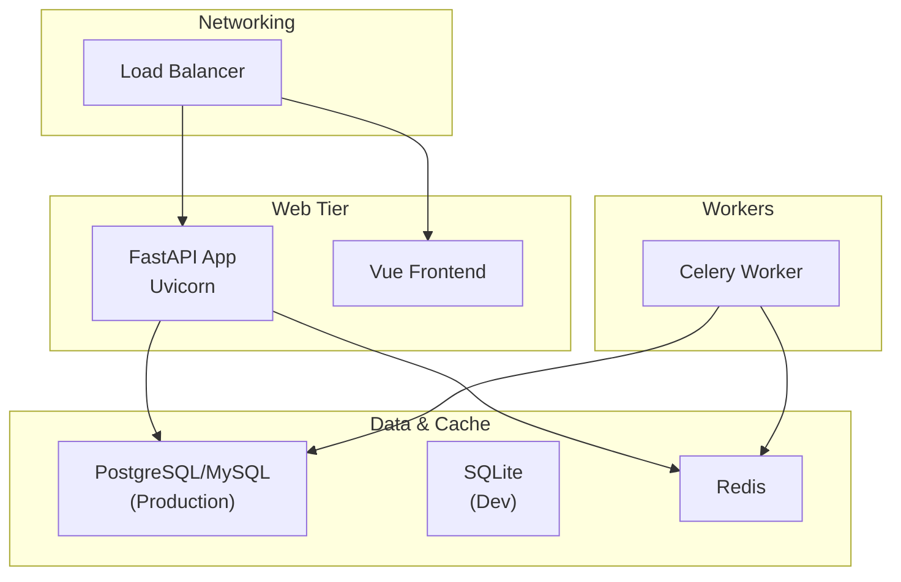
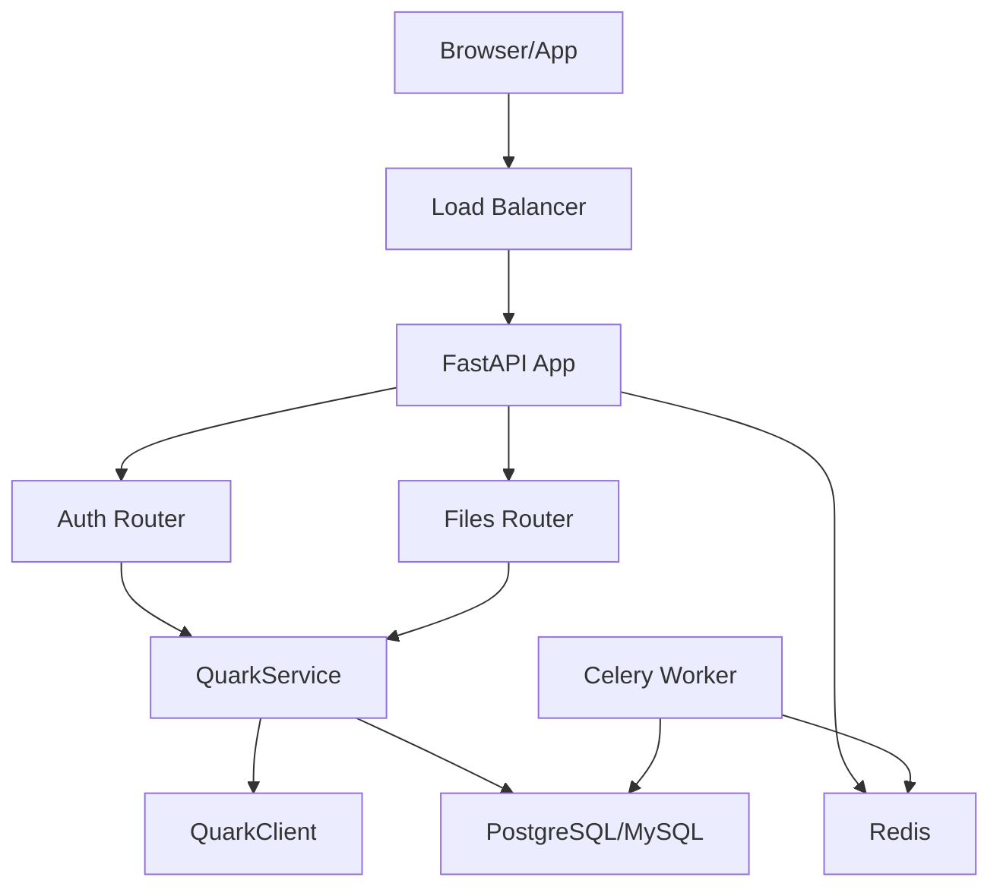
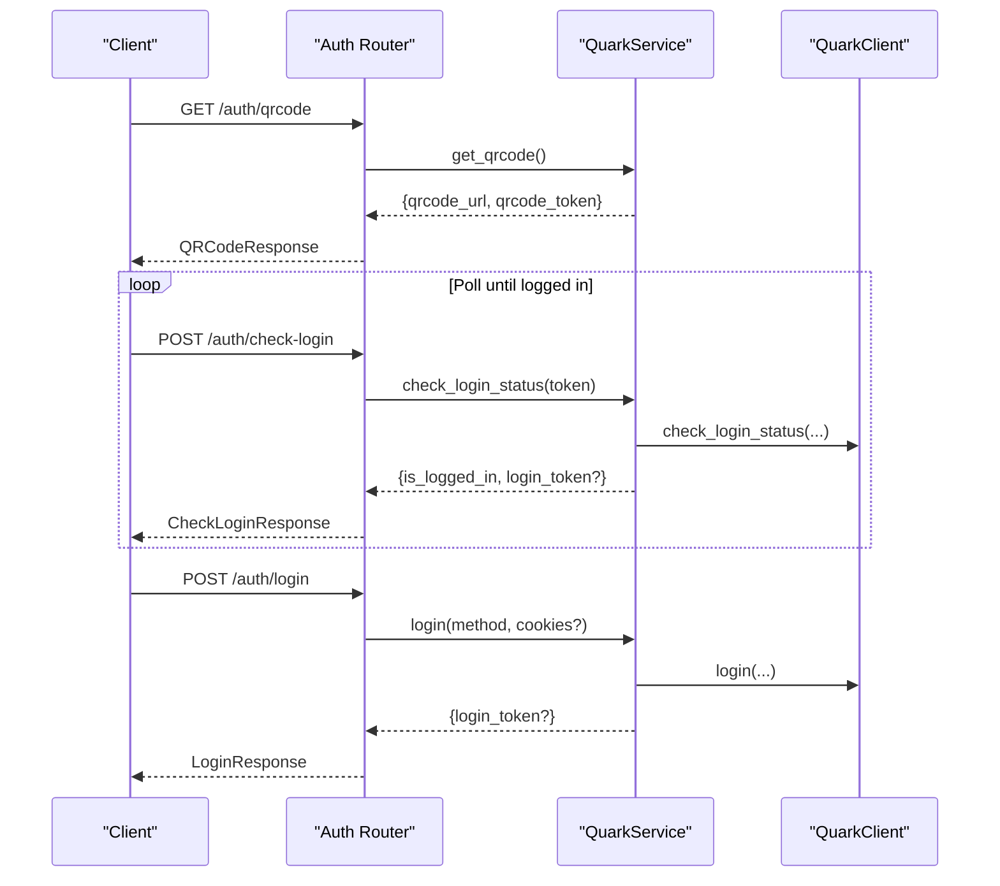
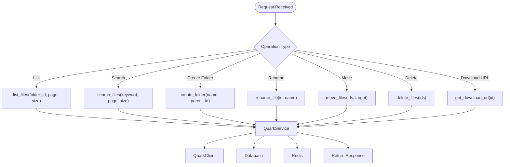
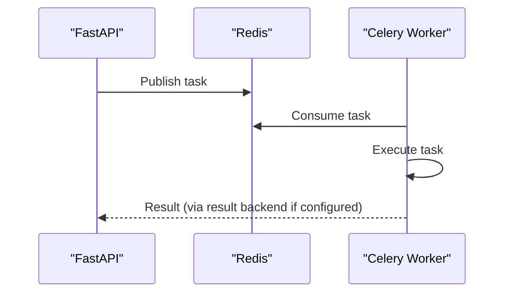
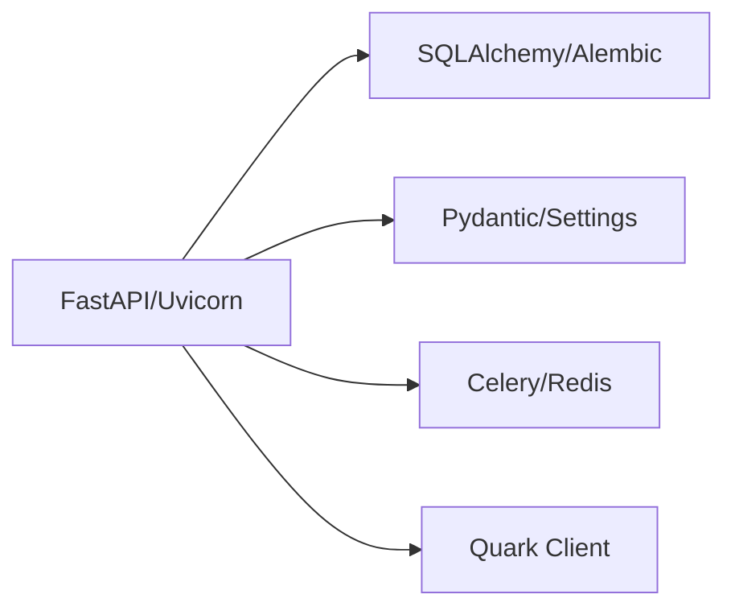

# Production Setup

<cite>
**Referenced Files in This Document**
- [backend/app/main.py](file://backend/app/main.py)
- [backend/app/core/config.py](file://backend/app/core/config.py)
- [backend/app/core/database.py](file://backend/app/core/database.py)
- [backend/app/api/v1/router.py](file://backend/app/api/v1/router.py)
- [backend/app/api/v1/auth.py](file://backend/app/api/v1/auth.py)
- [backend/app/api/v1/files.py](file://backend/app/api/v1/files.py)
- [backend/app/services/quark_service.py](file://backend/app/services/quark_service.py)
- [backend/Dockerfile](file://backend/Dockerfile)
- [frontend/Dockerfile](file://frontend/Dockerfile)
- [docker-compose.yml](file://docker-compose.yml)
- [backend/pyproject.toml](file://backend/pyproject.toml)
- [backend/requirements.txt](file://backend/requirements.txt)
- [quark_client/client.py](file://quark_client/client.py)
- [quark_client/config.py](file://quark_client/config.py)
</cite>

## Table of Contents
1. [Introduction](#introduction)
2. [Project Structure](#project-structure)
3. [Core Components](#core-components)
4. [Architecture Overview](#architecture-overview)
5. [Detailed Component Analysis](#detailed-component-analysis)
6. [Dependency Analysis](#dependency-analysis)
7. [Performance Considerations](#performance-considerations)
8. [Troubleshooting Guide](#troubleshooting-guide)
9. [Conclusion](#conclusion)
10. [Appendices](#appendices)

## Introduction
This document provides a production-focused deployment guide for QuarkManager, covering horizontal scaling, load balancing, high availability, database migrations and backups, security hardening, monitoring and observability, operational workflows (blue-green deployments, rolling updates), performance optimization, capacity planning, and troubleshooting. It synthesizes the repository’s backend FastAPI service, frontend Vue application, Redis-backed Celery worker, and the Quark client integration to deliver actionable guidance for enterprise-grade operations.

## Project Structure
QuarkManager consists of:
- Backend API built with FastAPI and Uvicorn, exposing REST endpoints for authentication and file management.
- Frontend Vue application for user interface.
- Redis for caching and Celery task queue.
- SQLite by default in development; production-grade deployments should use a robust relational database engine.
- Docker images for backend and frontend; docker-compose orchestrates services locally.

**Diagram sources**
- [backend/app/main.py:12-45](file://backend/app/main.py#L12-L45)
- [backend/app/core/database.py:10-19](file://backend/app/core/database.py#L10-L19)
- [docker-compose.yml:4-65](file://docker-compose.yml#L4-L65)

**Section sources**
- [backend/app/main.py:12-45](file://backend/app/main.py#L12-L45)
- [docker-compose.yml:4-65](file://docker-compose.yml#L4-L65)

## Core Components
- FastAPI application with CORS middleware, health checks, and modular routers for authentication and file management.
- Configuration via pydantic-settings with environment-driven overrides.
- SQLAlchemy ORM base and session factory for database interactions.
- QuarkService encapsulates integration with the Quark client library for cloud operations.
- Celery worker for asynchronous tasks backed by Redis.

Key production considerations:
- Replace SQLite with a production database (PostgreSQL/MySQL) and configure connection pooling.
- Secure secrets management and CORS origins.
- Enable health checks and readiness probes.
- Configure Redis for persistence and replication.

**Section sources**
- [backend/app/main.py:12-45](file://backend/app/main.py#L12-L45)
- [backend/app/core/config.py:5-34](file://backend/app/core/config.py#L5-L34)
- [backend/app/core/database.py:10-29](file://backend/app/core/database.py#L10-L29)
- [backend/app/api/v1/router.py:1-24](file://backend/app/api/v1/router.py#L1-L24)
- [backend/app/api/v1/auth.py:15-107](file://backend/app/api/v1/auth.py#L15-L107)
- [backend/app/api/v1/files.py:16-150](file://backend/app/api/v1/files.py#L16-L150)
- [backend/app/services/quark_service.py:23-388](file://backend/app/services/quark_service.py#L23-L388)
- [docker-compose.yml:43-57](file://docker-compose.yml#L43-L57)

## Architecture Overview
The system comprises:
- API server handling authentication and file operations.
- Frontend serving the SPA.
- Redis for caching and Celery task execution.
- Database for persistent data (preferably PostgreSQL/MySQL in production).
- Optional CDN for static assets and downloads.

**Diagram sources**
- [backend/app/main.py:12-28](file://backend/app/main.py#L12-L28)
- [backend/app/api/v1/router.py:22-23](file://backend/app/api/v1/router.py#L22-L23)
- [backend/app/api/v1/auth.py:15-107](file://backend/app/api/v1/auth.py#L15-L107)
- [backend/app/api/v1/files.py:16-150](file://backend/app/api/v1/files.py#L16-L150)
- [backend/app/services/quark_service.py:23-388](file://backend/app/services/quark_service.py#L23-L388)
- [docker-compose.yml:43-57](file://docker-compose.yml#L43-L57)

## Detailed Component Analysis

### API Application and Health Checks
- Application initialization sets up CORS, registers routers, and exposes health endpoints.
- Health checks support operational readiness and liveness verification.

Operational guidance:
- Expose /health and /api/v1/health for Kubernetes readiness/liveness probes.
- Tune Uvicorn workers and keepalive settings for production.

**Section sources**
- [backend/app/main.py:12-45](file://backend/app/main.py#L12-L45)
- [backend/app/api/v1/router.py:15-18](file://backend/app/api/v1/router.py#L15-L18)

### Authentication Flow
- QR code generation and polling for login status.
- Token exchange and logout flows.
- Integration with QuarkClient for backend operations.

**Diagram sources**
- [backend/app/api/v1/auth.py:18-75](file://backend/app/api/v1/auth.py#L18-L75)
- [backend/app/services/quark_service.py:54-159](file://backend/app/services/quark_service.py#L54-L159)
- [quark_client/client.py:50-64](file://quark_client/client.py#L50-L64)

**Section sources**
- [backend/app/api/v1/auth.py:18-107](file://backend/app/api/v1/auth.py#L18-L107)
- [backend/app/services/quark_service.py:54-159](file://backend/app/services/quark_service.py#L54-L159)
- [quark_client/client.py:50-64](file://quark_client/client.py#L50-L64)

### File Management Operations
- List, search, create folder, rename, move, delete, and download URL retrieval.
- Delegates to QuarkService and QuarkClient.

**Diagram sources**
- [backend/app/api/v1/files.py:19-149](file://backend/app/api/v1/files.py#L19-L149)
- [backend/app/services/quark_service.py:225-383](file://backend/app/services/quark_service.py#L225-L383)
- [quark_client/client.py:76-98](file://quark_client/client.py#L76-L98)

**Section sources**
- [backend/app/api/v1/files.py:19-150](file://backend/app/api/v1/files.py#L19-L150)
- [backend/app/services/quark_service.py:225-383](file://backend/app/services/quark_service.py#L225-L383)
- [quark_client/client.py:76-98](file://quark_client/client.py#L76-L98)

### Celery Worker and Task Queue
- Celery worker runs with Redis as broker.
- Suitable for offloading long-running tasks (e.g., batch operations, notifications).

**Diagram sources**
- [docker-compose.yml:43-57](file://docker-compose.yml#L43-L57)

**Section sources**
- [docker-compose.yml:43-57](file://docker-compose.yml#L43-L57)

## Dependency Analysis
External dependencies include FastAPI, Uvicorn, SQLAlchemy, Alembic, Celery, Redis, Pydantic, and the Quark client library. These inform production decisions around containerization, runtime, and integration.

**Diagram sources**
- [backend/pyproject.toml:13-27](file://backend/pyproject.toml#L13-L27)
- [backend/requirements.txt:2-17](file://backend/requirements.txt#L2-L17)

**Section sources**
- [backend/pyproject.toml:13-27](file://backend/pyproject.toml#L13-L27)
- [backend/requirements.txt:2-17](file://backend/requirements.txt#L2-L17)

## Performance Considerations
- Caching: Use Redis for session storage, rate limiting, and short-lived computed results.
- CDN: Serve static assets and signed download URLs via CDN for global latency reduction.
- Database tuning: Use connection pooling, appropriate indexes, and read replicas for scale.
- Async tasks: Offload heavy operations to Celery workers.
- Uvicorn workers: Scale horizontally behind a load balancer; tune keepalive and timeouts.

[No sources needed since this section provides general guidance]

## Troubleshooting Guide
Common production issues and resolutions:
- Authentication failures: Verify Quark login flow, cookies propagation, and network reachability to Quark endpoints.
- Database connectivity: Confirm production database credentials, TLS settings, and firewall rules.
- Redis outages: Ensure Redis HA (replication/sentinel) and failover; monitor latency and memory.
- Health check failures: Validate /health and /api/v1/health endpoints; confirm database and Redis readiness.
- CORS errors: Align backend_cors_origins with frontend origin and reverse proxy configuration.
- Slow file operations: Profile QuarkClient calls, enable CDN for downloads, and optimize pagination.

**Section sources**
- [backend/app/main.py:37-40](file://backend/app/main.py#L37-L40)
- [backend/app/api/v1/router.py:15-18](file://backend/app/api/v1/router.py#L15-L18)
- [backend/app/core/config.py:22-25](file://backend/app/core/config.py#L22-L25)
- [backend/app/services/quark_service.py:54-159](file://backend/app/services/quark_service.py#L54-L159)

## Conclusion
QuarkManager’s modular FastAPI backend, Vue frontend, Redis/Celery stack, and Quark client integration form a scalable foundation for enterprise deployments. By adopting production-grade databases, robust load balancing, strict security controls, comprehensive monitoring, and standardized CI/CD practices, teams can achieve reliable, secure, and high-performance operations.

[No sources needed since this section summarizes without analyzing specific files]

## Appendices

### A. Production Deployment Workflows
- Blue-Green Deployments:
  - Maintain two identical environments; route traffic to one while updating the other.
  - Validate health checks and rollback if needed.
- Rolling Updates:
  - Gradually replace instances behind a load balancer.
  - Use rolling restarts with zero-downtime strategies.

[No sources needed since this section provides general guidance]

### B. Horizontal Scaling Strategies
- Scale API pods behind a load balancer.
- Add read replicas for database reads; use connection pooling.
- Increase Celery worker replicas and shard queues by domain.

[No sources needed since this section provides general guidance]

### C. Load Balancing Configuration
- Terminate TLS at the load balancer; forward HTTP to API nodes.
- Configure health checks for API and worker readiness.
- Set sticky sessions only if required; otherwise distribute across pods.

[No sources needed since this section provides general guidance]

### D. High Availability Setup
- Multi-AZ deployment with active-passive or active-active API nodes.
- Redis HA (replication/sentinel) and automatic failover.
- Database HA with replication and automated failover.

[No sources needed since this section provides general guidance]

### E. Database Migration Procedures
- Use Alembic for schema migrations; apply migrations during maintenance windows.
- Back up before migration; verify schema changes on staging first.

**Section sources**
- [backend/requirements.txt:5](file://backend/requirements.txt#L5)

### F. Backup and Recovery Strategies
- Database: Automated logical backups with point-in-time recovery.
- Redis: Snapshotting and AOF persistence; test restore procedures.
- Secrets: Store in a managed secret vault; rotate regularly.

[No sources needed since this section provides general guidance]

### G. Disaster Recovery Planning
- Define RPO/RTO targets; replicate across regions.
- Test DR scenarios quarterly; maintain documented playbooks.

[No sources needed since this section provides general guidance]

### H. Security Hardening Measures
- TLS termination at load balancer; enforce HTTPS.
- Restrict inbound firewall rules to load balancer and admin bastions.
- Enforce least privilege; segment networks; use private subnets for backend services.
- Rotate secrets; disable development defaults; audit logs.

[No sources needed since this section provides general guidance]

### I. Monitoring and Observability
- Metrics: Export Prometheus metrics from API and workers.
- Logs: Centralized structured logging; ship to SIEM/log aggregation.
- Alerts: Threshold-based alerts for error rates, latency, and resource saturation.

[No sources needed since this section provides general guidance]

### J. Capacity Planning and Cost Optimization
- Right-size containers and nodes; use autoscaling.
- Optimize database connections and cache hit ratios.
- Reduce egress costs by colocating services and using CDN.

[No sources needed since this section provides general guidance]

### K. Containerization and Orchestration Notes
- Backend and frontend Dockerfiles define minimal images; ensure non-root users and minimal base images.
- docker-compose demonstrates local orchestration; adapt to Kubernetes manifests for production.

**Section sources**
- [backend/Dockerfile:1-15](file://backend/Dockerfile#L1-L15)
- [frontend/Dockerfile:1-13](file://frontend/Dockerfile#L1-L13)
- [docker-compose.yml:4-65](file://docker-compose.yml#L4-L65)

### L. Quark Client Integration Considerations
- Network access to Quark endpoints; configure timeouts and retries.
- Respect rate limits; implement exponential backoff.
- Monitor external service health and degrade gracefully when unavailable.

**Section sources**
- [quark_client/config.py:34-63](file://quark_client/config.py#L34-L63)
- [quark_client/client.py:268-273](file://quark_client/client.py#L268-L273)