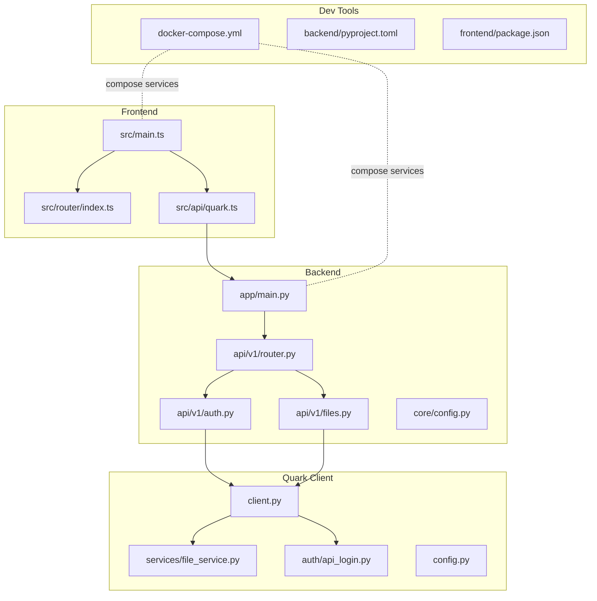
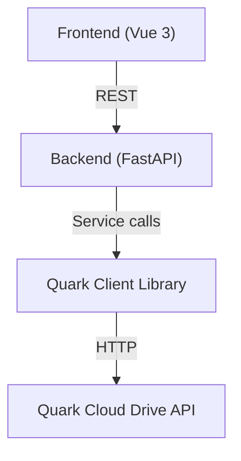
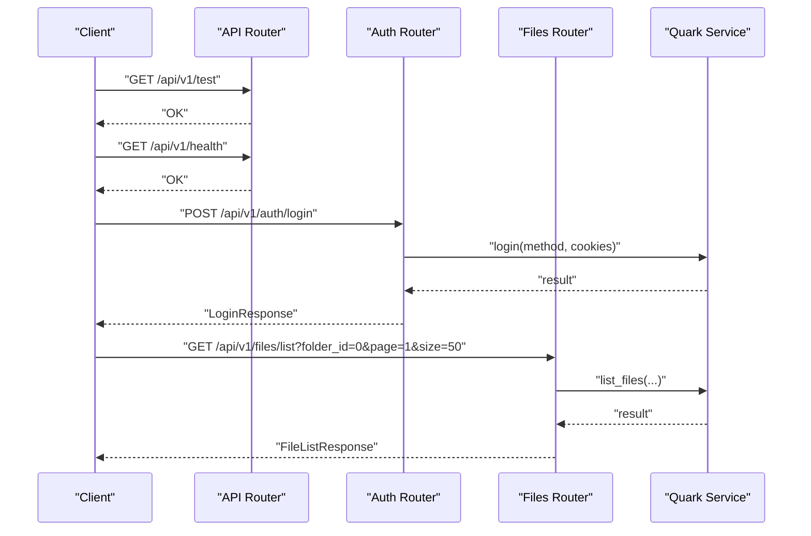
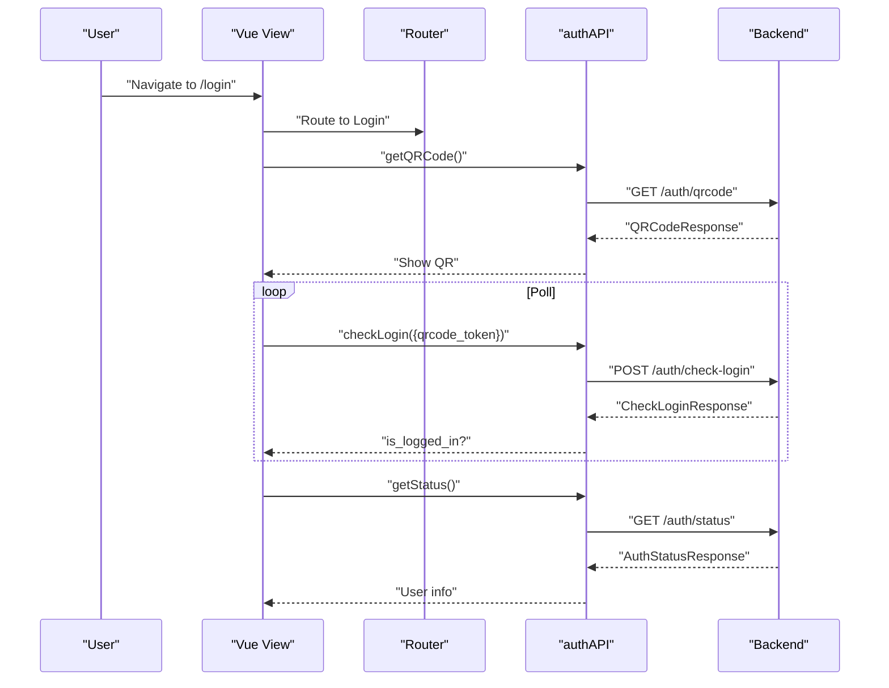
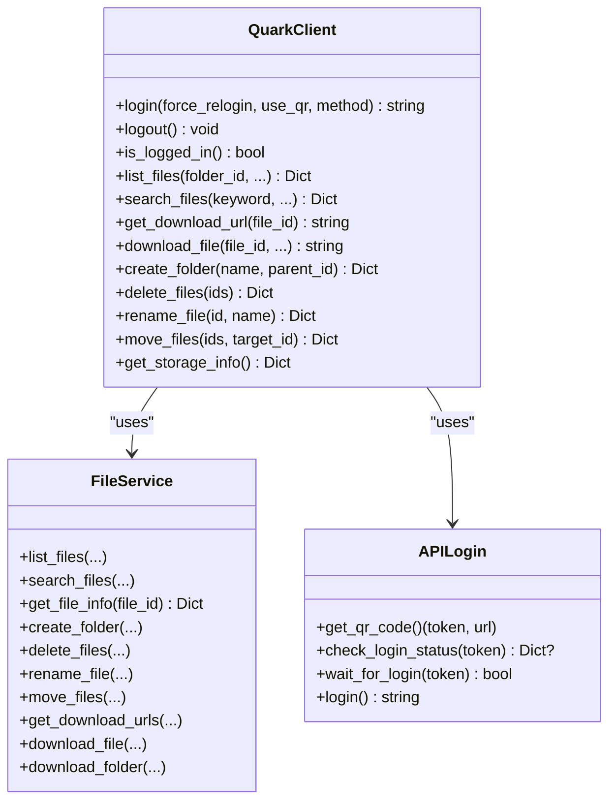
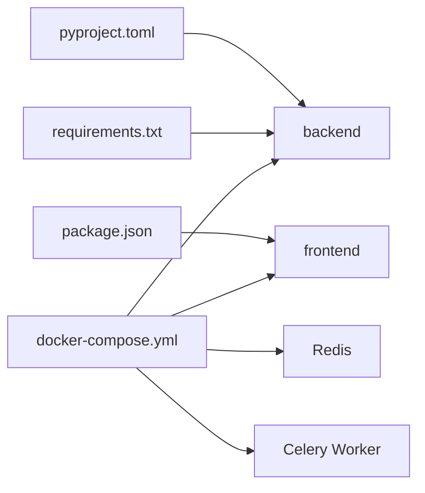
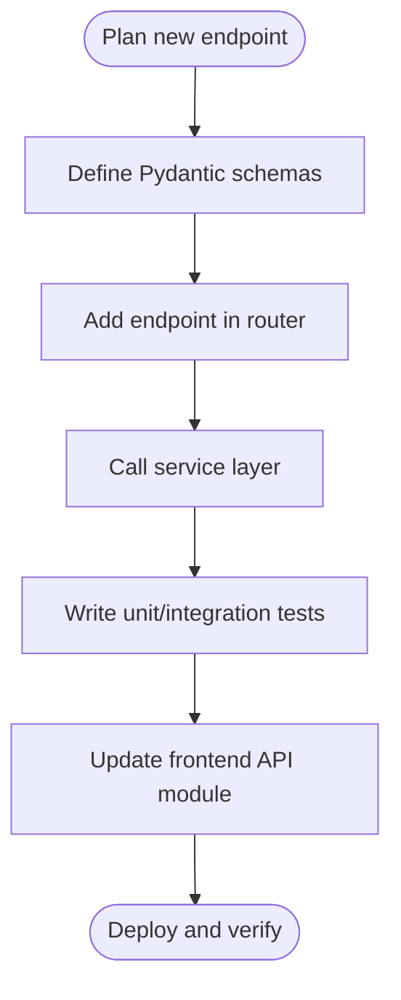

# Development Guide

<cite>
**Referenced Files in This Document**
- [PROJECT_SUMMARY.md](file://PROJECT_SUMMARY.md)
- [backend/pyproject.toml](file://backend/pyproject.toml)
- [backend/requirements.txt](file://backend/requirements.txt)
- [backend/app/main.py](file://backend/app/main.py)
- [backend/app/api/v1/router.py](file://backend/app/api/v1/router.py)
- [backend/app/api/v1/auth.py](file://backend/app/api/v1/auth.py)
- [backend/app/api/v1/files.py](file://backend/app/api/v1/files.py)
- [backend/app/core/config.py](file://backend/app/core/config.py)
- [docker-compose.yml](file://docker-compose.yml)
- [frontend/package.json](file://frontend/package.json)
- [frontend/vite.config.ts](file://frontend/vite.config.ts)
- [frontend/src/main.ts](file://frontend/src/main.ts)
- [frontend/src/router/index.ts](file://frontend/src/router/index.ts)
- [frontend/src/api/quark.ts](file://frontend/src/api/quark.ts)
- [quark_client/config.py](file://quark_client/config.py)
- [quark_client/client.py](file://quark_client/client.py)
- [quark_client/services/file_service.py](file://quark_client/services/file_service.py)
- [quark_client/auth/api_login.py](file://quark_client/auth/api_login.py)
</cite>

## Table of Contents
1. [Introduction](#introduction)
2. [Project Structure](#project-structure)
3. [Core Components](#core-components)
4. [Architecture Overview](#architecture-overview)
5. [Detailed Component Analysis](#detailed-component-analysis)
6. [Dependency Analysis](#dependency-analysis)
7. [Performance Considerations](#performance-considerations)
8. [Troubleshooting Guide](#troubleshooting-guide)
9. [Contribution Workflow](#contribution-workflow)
10. [Testing Strategies](#testing-strategies)
11. [Practical Examples](#practical-examples)
12. [IDE Configuration Recommendations](#ide-configuration-recommendations)
13. [Code Quality and Release Procedures](#code-quality-and-release-procedures)
14. [Conclusion](#conclusion)

## Introduction
This development guide helps contributors set up a productive development environment, understand the codebase architecture, and follow established patterns for building features, APIs, CLI extensions, and frontend components. It also covers testing, debugging, performance optimization, and contribution workflows.

## Project Structure
The project is organized into three primary areas:
- Backend service built with FastAPI, exposing REST endpoints under /api/v1
- Frontend application built with Vue 3, TypeScript, and Vite
- Quark client library providing core functionality for interacting with the Quark Cloud Drive API

**Diagram sources**
- [backend/app/main.py:1-46](file://backend/app/main.py#L1-L46)
- [backend/app/api/v1/router.py:1-24](file://backend/app/api/v1/router.py#L1-L24)
- [backend/app/api/v1/auth.py:1-107](file://backend/app/api/v1/auth.py#L1-L107)
- [backend/app/api/v1/files.py:1-150](file://backend/app/api/v1/files.py#L1-L150)
- [frontend/src/main.ts:1-23](file://frontend/src/main.ts#L1-L23)
- [frontend/src/router/index.ts:1-35](file://frontend/src/router/index.ts#L1-L35)
- [frontend/src/api/quark.ts:1-125](file://frontend/src/api/quark.ts#L1-L125)
- [quark_client/client.py:1-405](file://quark_client/client.py#L1-L405)
- [quark_client/services/file_service.py:1-800](file://quark_client/services/file_service.py#L1-L800)
- [quark_client/auth/api_login.py:1-521](file://quark_client/auth/api_login.py#L1-L521)
- [docker-compose.yml:1-65](file://docker-compose.yml#L1-L65)
- [backend/pyproject.toml:1-32](file://backend/pyproject.toml#L1-L32)
- [frontend/package.json:1-31](file://frontend/package.json#L1-L31)

**Section sources**
- [PROJECT_SUMMARY.md:10-34](file://PROJECT_SUMMARY.md#L10-L34)
- [backend/app/main.py:12-28](file://backend/app/main.py#L12-L28)
- [frontend/src/main.ts:10-22](file://frontend/src/main.ts#L10-L22)

## Core Components
- Backend entrypoint initializes FastAPI, registers routers, and sets CORS
- API v1 groups endpoints by domain (authentication, files)
- Frontend bootstraps Vue, Pinia, Element Plus, and Vue Router
- Quark client encapsulates Quark Cloud Drive interactions via services and authentication modules

Key responsibilities:
- Backend: HTTP routing, request/response handling, service orchestration
- Frontend: UI composition, state management, API integration
- Quark client: low-level API interactions, authentication, file operations

**Section sources**
- [backend/app/main.py:12-41](file://backend/app/main.py#L12-L41)
- [backend/app/api/v1/router.py:22-24](file://backend/app/api/v1/router.py#L22-L24)
- [frontend/src/main.ts:10-22](file://frontend/src/main.ts#L10-L22)
- [quark_client/client.py:18-49](file://quark_client/client.py#L18-L49)

## Architecture Overview
The system follows a layered architecture:
- Presentation layer: Vue 3 frontend
- Application layer: FastAPI backend with modular routers
- Domain services: Quark client services and authentication
- Infrastructure: Docker Compose for local dev stack

**Diagram sources**
- [frontend/src/api/quark.ts:55-124](file://frontend/src/api/quark.ts#L55-L124)
- [backend/app/api/v1/auth.py:18-75](file://backend/app/api/v1/auth.py#L18-L75)
- [backend/app/api/v1/files.py:19-149](file://backend/app/api/v1/files.py#L19-L149)
- [quark_client/client.py:18-49](file://quark_client/client.py#L18-L49)

## Detailed Component Analysis

### Backend API Layer
- Router composition aggregates sub-routers for auth and files
- Auth endpoints support QR code retrieval, login polling, status checks, and logout
- Files endpoints expose listing, creation, deletion, renaming, moving, searching, storage info, and download URL generation

**Diagram sources**
- [backend/app/api/v1/router.py:9-23](file://backend/app/api/v1/router.py#L9-L23)
- [backend/app/api/v1/auth.py:55-75](file://backend/app/api/v1/auth.py#L55-L75)
- [backend/app/api/v1/files.py:19-35](file://backend/app/api/v1/files.py#L19-L35)

**Section sources**
- [backend/app/api/v1/router.py:1-24](file://backend/app/api/v1/router.py#L1-L24)
- [backend/app/api/v1/auth.py:18-107](file://backend/app/api/v1/auth.py#L18-L107)
- [backend/app/api/v1/files.py:19-150](file://backend/app/api/v1/files.py#L19-L150)

### Frontend Integration Layer
- Axios-based API module defines typed interfaces for auth and files operations
- Router defines pages for home, login, and files
- Main app initializes Pinia, Element Plus, and registers icons

**Diagram sources**
- [frontend/src/router/index.ts:3-21](file://frontend/src/router/index.ts#L3-L21)
- [frontend/src/api/quark.ts:55-75](file://frontend/src/api/quark.ts#L55-L75)
- [backend/app/api/v1/auth.py:18-95](file://backend/app/api/v1/auth.py#L18-L95)

**Section sources**
- [frontend/src/api/quark.ts:55-124](file://frontend/src/api/quark.ts#L55-L124)
- [frontend/src/router/index.ts:1-35](file://frontend/src/router/index.ts#L1-L35)
- [frontend/src/main.ts:10-22](file://frontend/src/main.ts#L10-L22)

### Quark Client Services
- Client orchestrates authentication and service modules
- File service handles listing, searching, moving, downloading, and path resolution
- API login manages QR code generation, polling, and cookie extraction

**Diagram sources**
- [quark_client/client.py:18-405](file://quark_client/client.py#L18-L405)
- [quark_client/services/file_service.py:13-800](file://quark_client/services/file_service.py#L13-L800)
- [quark_client/auth/api_login.py:20-521](file://quark_client/auth/api_login.py#L20-L521)

**Section sources**
- [quark_client/client.py:18-405](file://quark_client/client.py#L18-L405)
- [quark_client/services/file_service.py:25-220](file://quark_client/services/file_service.py#L25-L220)
- [quark_client/auth/api_login.py:94-171](file://quark_client/auth/api_login.py#L94-L171)

## Dependency Analysis
- Backend dependencies managed via pyproject.toml and requirements.txt
- Frontend dependencies managed via package.json
- Docker Compose coordinates backend, frontend, Redis, and Celery worker

**Diagram sources**
- [backend/pyproject.toml:13-27](file://backend/pyproject.toml#L13-L27)
- [backend/requirements.txt:2-17](file://backend/requirements.txt#L2-L17)
- [frontend/package.json:11-29](file://frontend/package.json#L11-L29)
- [docker-compose.yml:4-57](file://docker-compose.yml#L4-L57)

**Section sources**
- [backend/pyproject.toml:1-32](file://backend/pyproject.toml#L1-L32)
- [backend/requirements.txt:1-25](file://backend/requirements.txt#L1-L25)
- [frontend/package.json:1-31](file://frontend/package.json#L1-L31)
- [docker-compose.yml:1-65](file://docker-compose.yml#L1-L65)

## Performance Considerations
- Backend
  - Use pagination parameters (page, size) for listing and search endpoints
  - Leverage async-friendly libraries and avoid blocking operations in handlers
  - Consider caching frequently accessed metadata (e.g., storage info) with appropriate invalidation
- Frontend
  - Debounce search input to reduce network requests
  - Lazy-load route components to improve initial load time
  - Use virtualized lists for large file listings
- Quark Client
  - Batch operations where supported to minimize API calls
  - Implement exponential backoff for transient failures
- Docker
  - Persist data volumes for backend and Redis to avoid repeated initialization overhead

[No sources needed since this section provides general guidance]

## Troubleshooting Guide
Common issues and remedies:
- Backend health and CORS
  - Verify CORS origins configured for frontend (default localhost:3000)
  - Use health endpoints to confirm service availability
- Frontend proxy configuration
  - Ensure Vite proxy targets the backend port (default 8000)
- Authentication flow
  - Confirm QR code retrieval and polling succeed
  - Validate cookie extraction after successful login
- File operations
  - Check folder_id correctness and permissions
  - Validate download URLs and network connectivity

**Section sources**
- [backend/app/core/config.py:22-25](file://backend/app/core/config.py#L22-L25)
- [frontend/vite.config.ts:14-19](file://frontend/vite.config.ts#L14-L19)
- [quark_client/auth/api_login.py:347-406](file://quark_client/auth/api_login.py#L347-L406)
- [quark_client/services/file_service.py:53-101](file://quark_client/services/file_service.py#L53-L101)

## Contribution Workflow
- Branching strategy
  - Feature branches: feature/short-description
  - Hotfix branches: hotfix/issue-number
- Pull requests
  - Target develop or main based on project policy
  - Include tests and documentation updates
  - Request reviews from maintainers
- Code review
  - Focus on correctness, readability, and adherence to existing patterns
- Continuous integration
  - Ensure linting and tests pass locally before pushing
  - CI should run backend and frontend checks

[No sources needed since this section summarizes general practices]

## Testing Strategies
- Backend
  - Unit tests for service methods using mocked clients
  - Integration tests for API endpoints with test database or mocks
  - Async tests for long-running tasks (Celery)
- Frontend
  - Component tests for Vue components using testing-library
  - API integration tests verifying request/response shapes
- CLI
  - Test command-line parsing and execution paths
  - Mock external services to validate behavior deterministically

[No sources needed since this section provides general guidance]

## Practical Examples

### Add a New API Endpoint
Steps:
1. Define request/response schemas in the schemas module
2. Add endpoint logic in the appropriate router module
3. Wire the router into the main API router
4. Write tests for the new endpoint
5. Update frontend API module and components as needed

**Diagram sources**
- [backend/app/api/v1/router.py:22-24](file://backend/app/api/v1/router.py#L22-L24)
- [backend/app/api/v1/auth.py:18-75](file://backend/app/api/v1/auth.py#L18-L75)
- [frontend/src/api/quark.ts:55-124](file://frontend/src/api/quark.ts#L55-L124)

**Section sources**
- [backend/app/api/v1/auth.py:18-75](file://backend/app/api/v1/auth.py#L18-L75)
- [frontend/src/api/quark.ts:55-124](file://frontend/src/api/quark.ts#L55-L124)

### Extend CLI Functionality
Steps:
1. Add a new command module under cli/commands
2. Register the command in the CLI main module
3. Implement the command logic using the Quark client
4. Add tests and update help/usage documentation

**Section sources**
- [quark_client/client.py:18-49](file://quark_client/client.py#L18-L49)

### Modify Frontend Components
Steps:
1. Create or update the component under views
2. Add or update API calls in the API module
3. Integrate with Vue Router and Pinia stores as needed
4. Add tests and verify responsiveness

**Section sources**
- [frontend/src/router/index.ts:3-21](file://frontend/src/router/index.ts#L3-L21)
- [frontend/src/api/quark.ts:77-124](file://frontend/src/api/quark.ts#L77-L124)

## IDE Configuration Recommendations
- Python
  - Use a virtual environment with Python 3.9+
  - Install backend dependencies from requirements.txt
  - Configure linters (flake8), formatters (black), and import sorters (isort)
- Node.js
  - Use Node.js LTS matching project scripts
  - Install frontend dependencies from package.json
  - Configure TypeScript and ESLint for Vue files
- Docker
  - Use Docker Compose to run backend, frontend, Redis, and Celery worker together

**Section sources**
- [backend/pyproject.toml:12](file://backend/pyproject.toml#L12)
- [backend/requirements.txt:19-24](file://backend/requirements.txt#L19-L24)
- [frontend/package.json:5-9](file://frontend/package.json#L5-L9)
- [docker-compose.yml:4-57](file://docker-compose.yml#L4-L57)

## Code Quality and Release Procedures
- Code quality
  - Enforce black, isort, flake8 for Python
  - Enforce ESLint and Vue plugin for frontend
  - Keep commit messages clear and scoped
- Documentation
  - Update project summary and inline comments for major changes
  - Document new API endpoints and schema changes
- Releases
  - Tag releases and update version in project metadata
  - Build and publish artifacts as needed

[No sources needed since this section provides general guidance]

## Conclusion
This guide outlined how to set up the development environment, understand the architecture, implement features across backend, frontend, and CLI, and follow contribution and quality practices. Use the provided diagrams and references to integrate new functionality safely and efficiently.