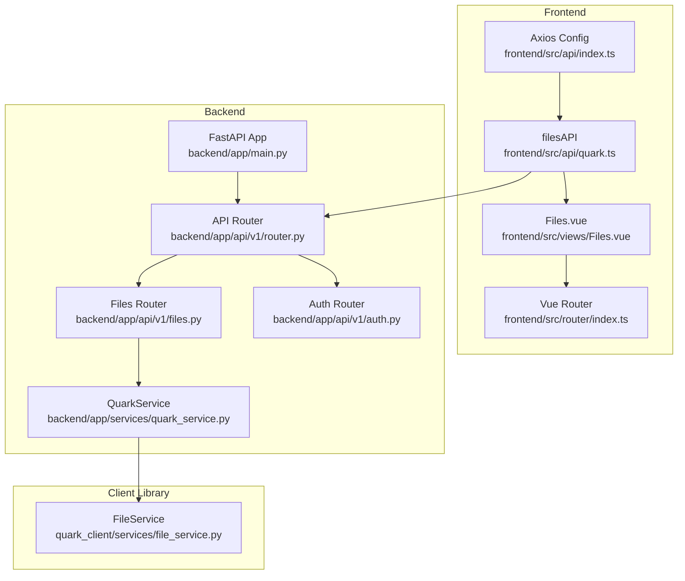
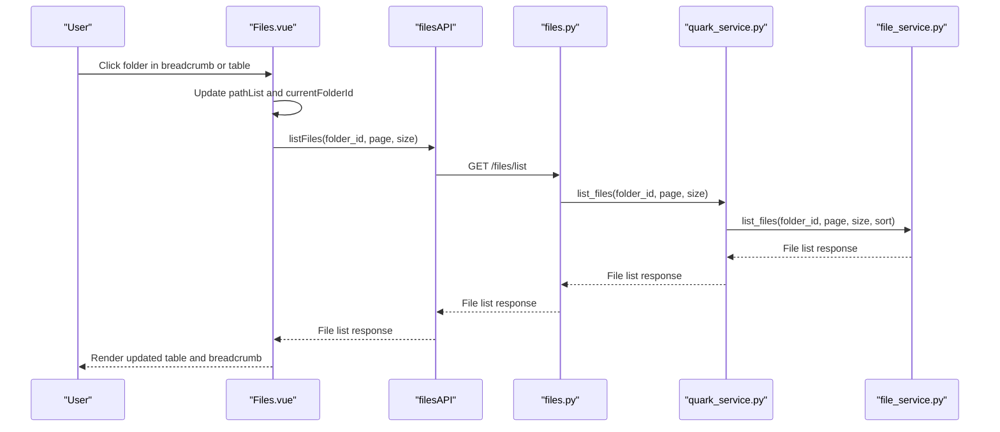
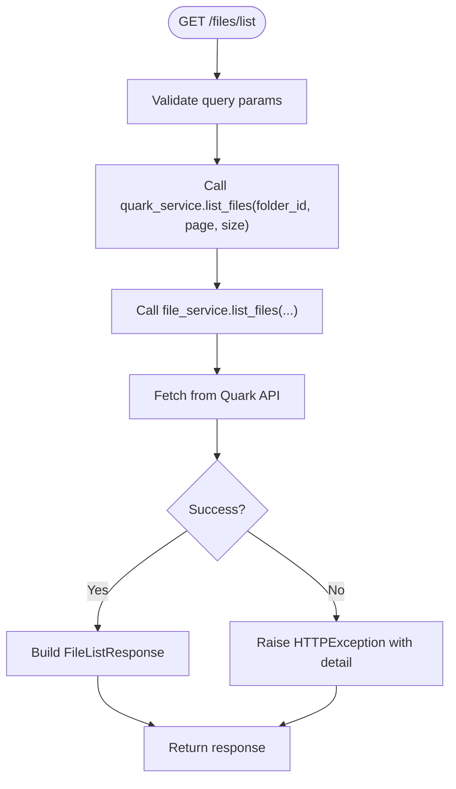
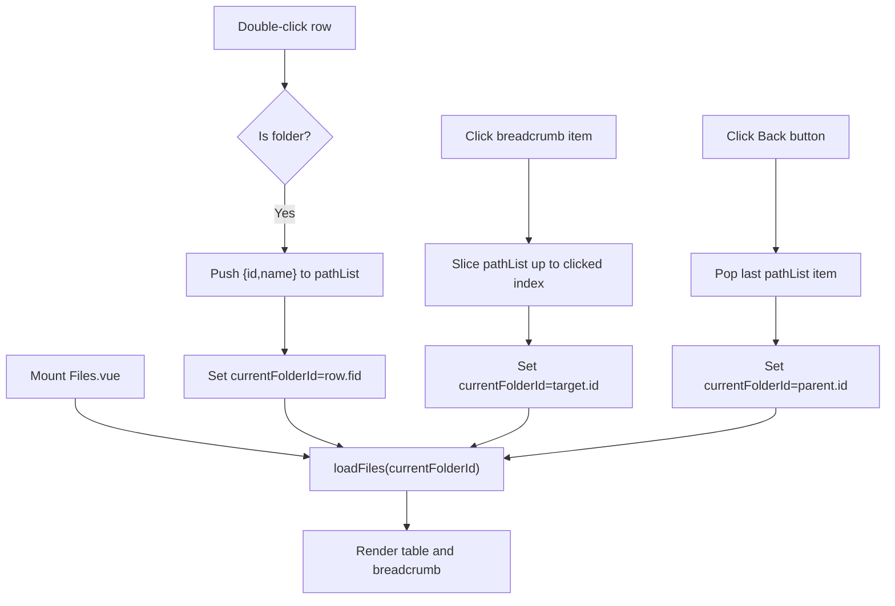
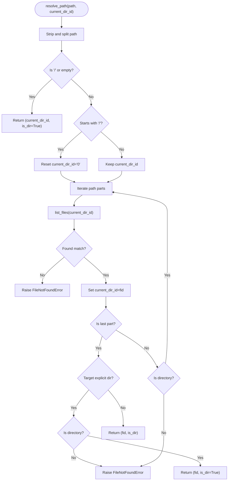
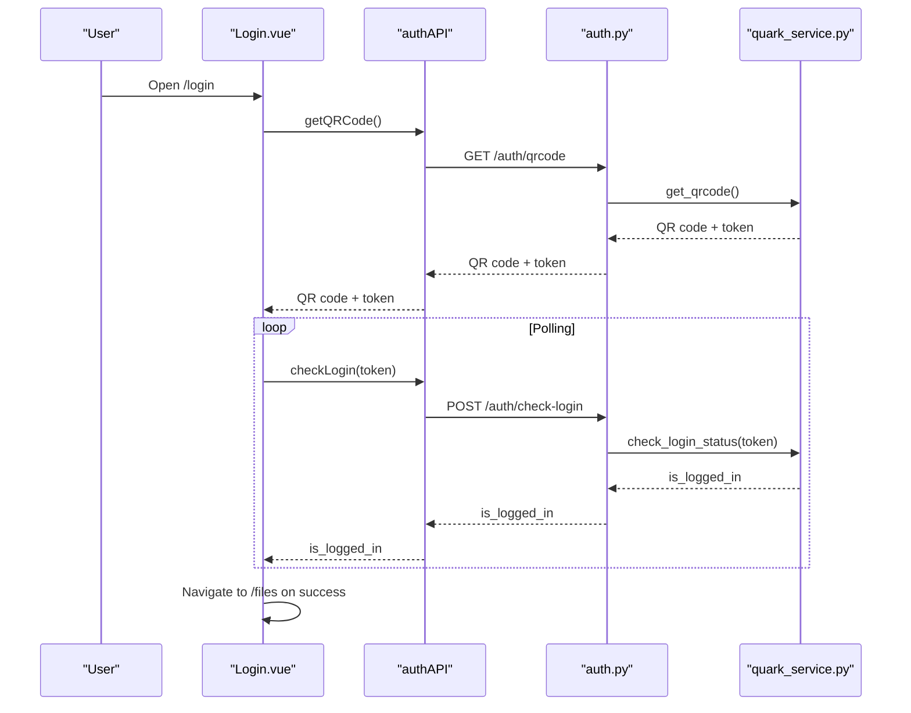
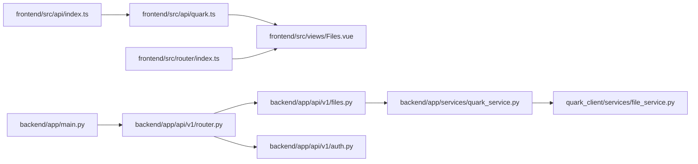

# Directory Navigation

<cite>
**Referenced Files in This Document**
- [backend/app/api/v1/files.py](file://backend/app/api/v1/files.py)
- [backend/app/schemas/files.py](file://backend/app/schemas/files.py)
- [backend/app/services/quark_service.py](file://backend/app/services/quark_service.py)
- [quark_client/services/file_service.py](file://quark_client/services/file_service.py)
- [frontend/src/views/Files.vue](file://frontend/src/views/Files.vue)
- [frontend/src/api/quark.ts](file://frontend/src/api/quark.ts)
- [frontend/src/router/index.ts](file://frontend/src/router/index.ts)
- [frontend/src/api/index.ts](file://frontend/src/api/index.ts)
- [backend/app/api/v1/router.py](file://backend/app/api/v1/router.py)
- [backend/app/main.py](file://backend/app/main.py)
- [backend/app/api/v1/auth.py](file://backend/app/api/v1/auth.py)
- [frontend/src/views/Login.vue](file://frontend/src/views/Login.vue)
</cite>

## Table of Contents
1. [Introduction](#introduction)
2. [Project Structure](#project-structure)
3. [Core Components](#core-components)
4. [Architecture Overview](#architecture-overview)
5. [Detailed Component Analysis](#detailed-component-analysis)
6. [Dependency Analysis](#dependency-analysis)
7. [Performance Considerations](#performance-considerations)
8. [Troubleshooting Guide](#troubleshooting-guide)
9. [Conclusion](#conclusion)

## Introduction
This document explains the directory navigation functionality of the QuarkManager application. It covers:
- Path resolution mechanism for converting human-readable paths to Quark identifiers
- Breadcrumb navigation implementation in the frontend
- Folder hierarchy traversal and deep navigation
- Backend API endpoints for folder listing and navigation, including pagination, filtering, and sorting
- Frontend navigation component behavior, including folder selection, path display, and navigation history management
- Examples of deep folder navigation, bookmark functionality, and quick access shortcuts
- Integration between frontend navigation state and backend folder structure
- Error handling for invalid paths and performance optimization for large directory trees

## Project Structure
The directory navigation spans both frontend and backend layers:
- Frontend: Vue 3 Single Page Application with Element Plus UI components, routing, and Pinia stores
- Backend: FastAPI application exposing REST endpoints for file operations and authentication
- Client library: Python client for interacting with the Quark Cloud API

**Diagram sources**
- [frontend/src/views/Files.vue:1-264](file://frontend/src/views/Files.vue#L1-L264)
- [frontend/src/api/quark.ts:77-124](file://frontend/src/api/quark.ts#L77-L124)
- [frontend/src/router/index.ts:1-35](file://frontend/src/router/index.ts#L1-L35)
- [frontend/src/api/index.ts:1-30](file://frontend/src/api/index.ts#L1-L30)
- [backend/app/main.py:12-28](file://backend/app/main.py#L12-L28)
- [backend/app/api/v1/router.py:1-24](file://backend/app/api/v1/router.py#L1-L24)
- [backend/app/api/v1/files.py:16-149](file://backend/app/api/v1/files.py#L16-L149)
- [backend/app/api/v1/auth.py:15-106](file://backend/app/api/v1/auth.py#L15-L106)
- [backend/app/services/quark_service.py:23-387](file://backend/app/services/quark_service.py#L23-L387)
- [quark_client/services/file_service.py:25-60](file://quark_client/services/file_service.py#L25-L60)

**Section sources**
- [frontend/src/views/Files.vue:1-264](file://frontend/src/views/Files.vue#L1-L264)
- [frontend/src/api/quark.ts:77-124](file://frontend/src/api/quark.ts#L77-L124)
- [frontend/src/router/index.ts:1-35](file://frontend/src/router/index.ts#L1-L35)
- [frontend/src/api/index.ts:1-30](file://frontend/src/api/index.ts#L1-L30)
- [backend/app/main.py:12-28](file://backend/app/main.py#L12-L28)
- [backend/app/api/v1/router.py:1-24](file://backend/app/api/v1/router.py#L1-L24)
- [backend/app/api/v1/files.py:16-149](file://backend/app/api/v1/files.py#L16-L149)
- [backend/app/api/v1/auth.py:15-106](file://backend/app/api/v1/auth.py#L15-L106)
- [backend/app/services/quark_service.py:23-387](file://backend/app/services/quark_service.py#L23-L387)
- [quark_client/services/file_service.py:25-60](file://quark_client/services/file_service.py#L25-L60)

## Core Components
- Frontend navigation component (Files.vue): Implements breadcrumb navigation, folder selection, path display, and navigation history management
- Frontend API layer (quark.ts): Wraps HTTP calls to backend endpoints for file operations
- Backend API (files.py): Exposes endpoints for listing files, creating folders, deleting files, renaming, moving, searching, and downloading
- Backend service (quark_service.py): Orchestrates authentication and delegates file operations to the Quark client
- Quark client (file_service.py): Provides path resolution, folder tree traversal, and file operations against the Quark API

Key responsibilities:
- Path resolution: Convert human-readable paths to Quark identifiers and validate existence
- Breadcrumb navigation: Maintain and render path segments, enable selective navigation
- Pagination and filtering: Control page size and apply client-side filters for advanced scenarios
- Sorting: Support sorting by various fields
- Error handling: Propagate meaningful errors from backend to frontend

**Section sources**
- [frontend/src/views/Files.vue:81-130](file://frontend/src/views/Files.vue#L81-L130)
- [frontend/src/api/quark.ts:77-124](file://frontend/src/api/quark.ts#L77-L124)
- [backend/app/api/v1/files.py:19-123](file://backend/app/api/v1/files.py#L19-L123)
- [backend/app/services/quark_service.py:225-340](file://backend/app/services/quark_service.py#L225-L340)
- [quark_client/services/file_service.py:474-551](file://quark_client/services/file_service.py#L474-L551)

## Architecture Overview
The directory navigation architecture integrates frontend and backend components:

**Diagram sources**
- [frontend/src/views/Files.vue:89-104](file://frontend/src/views/Files.vue#L89-L104)
- [frontend/src/api/quark.ts:77-82](file://frontend/src/api/quark.ts#L77-L82)
- [backend/app/api/v1/files.py:19-35](file://backend/app/api/v1/files.py#L19-L35)
- [backend/app/services/quark_service.py:225-253](file://backend/app/services/quark_service.py#L225-L253)
- [quark_client/services/file_service.py:25-60](file://quark_client/services/file_service.py#L25-L60)

## Detailed Component Analysis

### Backend API Endpoints for Folder Listing and Navigation
The backend exposes a dedicated endpoint for listing files in a folder with pagination and sorting support. The endpoint accepts:
- folder_id: Identifier of the target folder (defaults to root)
- page: Page number (>= 1)
- size: Items per page (bounded between 1 and 200)

Response model includes success flag, data payload, and message. The endpoint delegates to the service layer, which interacts with the Quark client to retrieve the file list.

**Diagram sources**
- [backend/app/api/v1/files.py:19-35](file://backend/app/api/v1/files.py#L19-L35)
- [backend/app/schemas/files.py:5-17](file://backend/app/schemas/files.py#L5-L17)
- [backend/app/services/quark_service.py:225-253](file://backend/app/services/quark_service.py#L225-L253)
- [quark_client/services/file_service.py:25-60](file://quark_client/services/file_service.py#L25-L60)

**Section sources**
- [backend/app/api/v1/files.py:19-35](file://backend/app/api/v1/files.py#L19-L35)
- [backend/app/schemas/files.py:5-17](file://backend/app/schemas/files.py#L5-L17)
- [backend/app/services/quark_service.py:225-253](file://backend/app/services/quark_service.py#L225-L253)
- [quark_client/services/file_service.py:25-60](file://quark_client/services/file_service.py#L25-L60)

### Frontend Navigation Component (Breadcrumb and History)
The frontend Files.vue component manages:
- Path list: An array representing the current breadcrumb path
- Current folder ID: Tracks the selected folder identifier
- Navigation history: Back button and breadcrumb clicks update the path list and trigger a refresh

Behavior highlights:
- Double-clicking a folder row navigates into that folder
- Clicking breadcrumb items allows jumping to any ancestor
- Back button pops the last breadcrumb segment
- Loading state prevents concurrent requests

**Diagram sources**
- [frontend/src/views/Files.vue:89-130](file://frontend/src/views/Files.vue#L89-L130)

**Section sources**
- [frontend/src/views/Files.vue:81-130](file://frontend/src/views/Files.vue#L81-L130)

### Path Resolution Mechanism
The Quark client provides a robust path resolution method that:
- Normalizes input paths, handles absolute and relative paths
- Validates each segment’s existence and type (file vs folder)
- Supports explicit directory targets (ending with “/”)
- Throws descriptive errors for missing paths or incorrect types

**Diagram sources**
- [quark_client/services/file_service.py:474-551](file://quark_client/services/file_service.py#L474-L551)

**Section sources**
- [quark_client/services/file_service.py:474-551](file://quark_client/services/file_service.py#L474-L551)

### Folder Hierarchy Traversal
The client supports retrieving hierarchical structures:
- get_folder_tree(folder_id, max_depth): Returns a tree-like structure of folders
- list_files_with_details(...): Enhances list_files with client-side filtering for folders/files
- Advanced search with client-side filtering: search_files_advanced(...) retrieves broader results and applies client-side filters for extensions, size ranges, etc.

These capabilities enable efficient navigation and discovery of deep folder hierarchies.

**Section sources**
- [quark_client/services/file_service.py:221-238](file://quark_client/services/file_service.py#L221-L238)
- [quark_client/services/file_service.py:250-293](file://quark_client/services/file_service.py#L250-L293)
- [quark_client/services/file_service.py:295-366](file://quark_client/services/file_service.py#L295-L366)

### Authentication and Navigation State
Navigation requires authentication. The frontend Login.vue component:
- Generates QR codes and polls for login status
- Routes to the Files view upon successful login
- Uses authAPI to communicate with backend authentication endpoints

The backend auth endpoints manage QR code generation, login status checks, and logout.

**Diagram sources**
- [frontend/src/views/Login.vue:84-176](file://frontend/src/views/Login.vue#L84-L176)
- [frontend/src/api/quark.ts:55-75](file://frontend/src/api/quark.ts#L55-L75)
- [backend/app/api/v1/auth.py:18-52](file://backend/app/api/v1/auth.py#L18-L52)
- [backend/app/services/quark_service.py:54-159](file://backend/app/services/quark_service.py#L54-L159)

**Section sources**
- [frontend/src/views/Login.vue:84-176](file://frontend/src/views/Login.vue#L84-L176)
- [frontend/src/api/quark.ts:55-75](file://frontend/src/api/quark.ts#L55-L75)
- [backend/app/api/v1/auth.py:18-52](file://backend/app/api/v1/auth.py#L18-L52)
- [backend/app/services/quark_service.py:54-159](file://backend/app/services/quark_service.py#L54-L159)

### Filtering, Sorting, and Pagination Options
- Pagination: Controlled by page and size parameters in list_files and search_files
- Sorting: The underlying file_service supports sort_field and sort_order parameters
- Filtering: Advanced search supports client-side filtering by extension and size ranges

These options are exposed through the frontend API layer and can be extended to support server-side filtering and sorting if needed.

**Section sources**
- [backend/app/api/v1/files.py:20-23](file://backend/app/api/v1/files.py#L20-L23)
- [backend/app/api/v1/files.py:108-112](file://backend/app/api/v1/files.py#L108-L112)
- [quark_client/services/file_service.py:25-60](file://quark_client/services/file_service.py#L25-L60)
- [quark_client/services/file_service.py:295-366](file://quark_client/services/file_service.py#L295-L366)

### Examples and Use Cases

- Deep folder navigation:
  - Traverse a path like “/Parent/Child/Subchild” using resolve_path to obtain the target folder ID and validate each segment
  - Use list_files to load the contents of the final folder

- Bookmark functionality:
  - Store frequently visited folder IDs in a Pinia store or local storage
  - Provide quick links to these bookmarks in the UI
  - On click, navigate to the stored folder ID and update breadcrumb accordingly

- Quick access shortcuts:
  - Offer shortcuts to root (“/”), recent folders, or starred items
  - Implement keyboard shortcuts (e.g., Ctrl+Shift+R to refresh) for power users

[No sources needed since this section provides conceptual examples]

## Dependency Analysis
The navigation stack depends on:
- Frontend Axios configuration for base URL and interceptors
- Backend routing registration under /api/v1
- Service delegation from API endpoints to the Quark client
- Client library providing path resolution and traversal

**Diagram sources**
- [frontend/src/api/index.ts:1-30](file://frontend/src/api/index.ts#L1-L30)
- [frontend/src/api/quark.ts:77-124](file://frontend/src/api/quark.ts#L77-L124)
- [frontend/src/views/Files.vue:89-104](file://frontend/src/views/Files.vue#L89-L104)
- [frontend/src/router/index.ts:1-35](file://frontend/src/router/index.ts#L1-L35)
- [backend/app/main.py:12-28](file://backend/app/main.py#L12-L28)
- [backend/app/api/v1/router.py:1-24](file://backend/app/api/v1/router.py#L1-L24)
- [backend/app/api/v1/files.py:19-35](file://backend/app/api/v1/files.py#L19-L35)
- [backend/app/api/v1/auth.py:18-52](file://backend/app/api/v1/auth.py#L18-L52)
- [backend/app/services/quark_service.py:225-253](file://backend/app/services/quark_service.py#L225-L253)
- [quark_client/services/file_service.py:25-60](file://quark_client/services/file_service.py#L25-L60)

**Section sources**
- [frontend/src/api/index.ts:1-30](file://frontend/src/api/index.ts#L1-L30)
- [frontend/src/api/quark.ts:77-124](file://frontend/src/api/quark.ts#L77-L124)
- [frontend/src/views/Files.vue:89-104](file://frontend/src/views/Files.vue#L89-L104)
- [frontend/src/router/index.ts:1-35](file://frontend/src/router/index.ts#L1-L35)
- [backend/app/main.py:12-28](file://backend/app/main.py#L12-L28)
- [backend/app/api/v1/router.py:1-24](file://backend/app/api/v1/router.py#L1-L24)
- [backend/app/api/v1/files.py:19-35](file://backend/app/api/v1/files.py#L19-L35)
- [backend/app/api/v1/auth.py:18-52](file://backend/app/api/v1/auth.py#L18-L52)
- [backend/app/services/quark_service.py:225-253](file://backend/app/services/quark_service.py#L225-L253)
- [quark_client/services/file_service.py:25-60](file://quark_client/services/file_service.py#L25-L60)

## Performance Considerations
- Pagination: Use reasonable page sizes (e.g., 50–200) to balance responsiveness and network overhead
- Client-side filtering: For advanced filtering (extensions, size ranges), increase page size temporarily to improve accuracy
- Caching: Cache folder listings for recently visited folders to reduce repeated network calls
- Lazy loading: For deep trees, consider loading child nodes on demand
- Debouncing: Debounce breadcrumb navigation to prevent rapid successive requests
- Sorting: Prefer server-side sorting when available; otherwise, apply minimal client-side sorting

[No sources needed since this section provides general guidance]

## Troubleshooting Guide
Common issues and resolutions:
- Invalid path or missing folder:
  - Symptom: FileNotFoundError during path resolution
  - Action: Verify the path segments exist; ensure trailing slash for directories when required
- Unauthorized access:
  - Symptom: HTTP 400 with “未登录” or “客户端未初始化”
  - Action: Trigger QR code login flow; ensure cookies are valid
- Network timeouts:
  - Symptom: Axios timeout errors
  - Action: Increase timeout in frontend Axios config; retry logic in API layer
- Pagination anomalies:
  - Symptom: Unexpected empty pages
  - Action: Validate page and size parameters; ensure backend bounds are respected

**Section sources**
- [quark_client/services/file_service.py:474-551](file://quark_client/services/file_service.py#L474-L551)
- [backend/app/services/quark_service.py:225-253](file://backend/app/services/quark_service.py#L225-L253)
- [frontend/src/api/index.ts:3-9](file://frontend/src/api/index.ts#L3-L9)

## Conclusion
The directory navigation system combines a robust backend API with a responsive frontend UI. Path resolution ensures reliable traversal, while breadcrumb navigation and history management provide intuitive user control. Pagination, sorting, and filtering options enable efficient browsing of large directory trees. Integrating authentication and leveraging client-side caching and lazy loading can further enhance performance and user experience.