# File Browser Interface

<cite>
**Referenced Files in This Document**
- [Files.vue](file://frontend/src/views/Files.vue)
- [quark.ts](file://frontend/src/api/quark.ts)
- [index.ts](file://frontend/src/api/index.ts)
- [files.py](file://backend/app/api/v1/files.py)
- [files.py](file://backend/app/schemas/files.py)
- [quark_service.py](file://backend/app/services/quark_service.py)
- [index.ts](file://frontend/src/router/index.ts)
- [main.ts](file://frontend/src/main.ts)
- [package.json](file://frontend/package.json)
</cite>

## Table of Contents
1. [Introduction](#introduction)
2. [Project Structure](#project-structure)
3. [Core Components](#core-components)
4. [Architecture Overview](#architecture-overview)
5. [Detailed Component Analysis](#detailed-component-analysis)
6. [Dependency Analysis](#dependency-analysis)
7. [Performance Considerations](#performance-considerations)
8. [Troubleshooting Guide](#troubleshooting-guide)
9. [Conclusion](#conclusion)

## Introduction
This document provides comprehensive technical documentation for the file browser interface component built with Vue 3 and Element Plus. The component implements a modern file listing interface with directory navigation, breadcrumb navigation, file metadata display, and user interaction patterns for file operations. It integrates with a FastAPI backend service that communicates with the Quark Cloud storage provider through a dedicated client library.

The file browser supports essential file management operations including listing files and folders, navigating directory hierarchies, creating new folders, downloading files, and deleting files. The component follows Vue 3 Composition API patterns with reactive state management and integrates seamlessly with Element Plus UI components for consistent user experience.

## Project Structure
The file browser interface is implemented as a standalone Vue 3 Single File Component (SFC) located in the frontend views directory. The component integrates with a centralized API module that handles all backend communication and is configured with Element Plus for UI components and styling.

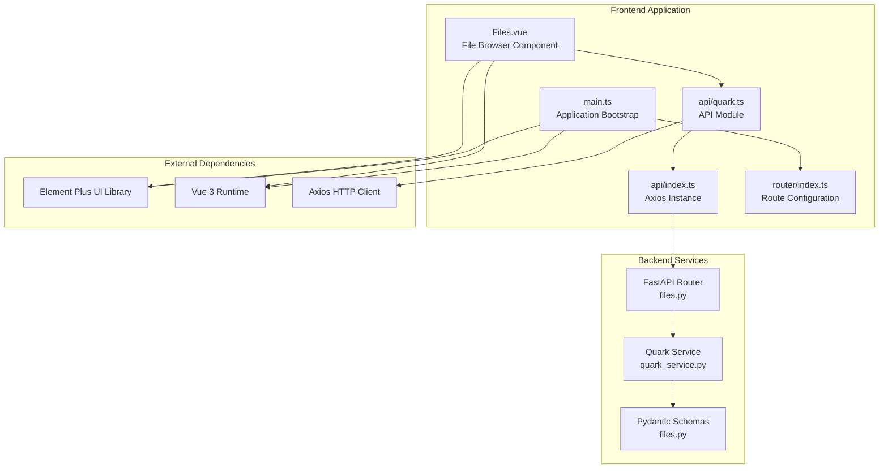

**Diagram sources**
- [Files.vue:1-264](file://frontend/src/views/Files.vue#L1-L264)
- [quark.ts:1-125](file://frontend/src/api/quark.ts#L1-L125)
- [index.ts:1-30](file://frontend/src/api/index.ts#L1-L30)
- [files.py:1-150](file://backend/app/api/v1/files.py#L1-L150)
- [files.py:1-54](file://backend/app/schemas/files.py#L1-L54)
- [quark_service.py:1-377](file://backend/app/services/quark_service.py#L1-L377)

**Section sources**
- [Files.vue:1-264](file://frontend/src/views/Files.vue#L1-L264)
- [quark.ts:1-125](file://frontend/src/api/quark.ts#L1-L125)
- [index.ts:1-30](file://frontend/src/api/index.ts#L1-L30)
- [files.py:1-150](file://backend/app/api/v1/files.py#L1-L150)
- [files.py:1-54](file://backend/app/schemas/files.py#L1-L54)
- [quark_service.py:1-377](file://backend/app/services/quark_service.py#L1-L377)

## Core Components
The file browser interface consists of several interconnected components that work together to provide a complete file management experience:

### Vue 3 Component Structure
The primary component is implemented as a Vue 3 SFC using the Composition API. It manages reactive state for file listings, navigation breadcrumbs, and loading states. The component utilizes Element Plus table components for displaying file metadata and navigation controls.

### API Integration Layer
The component communicates with backend services through a typed API module that defines request/response interfaces and handles HTTP communication. The API module centralizes all backend endpoint interactions and provides a clean interface for the component.

### Backend Service Layer
The backend implements a FastAPI router with comprehensive file management endpoints including listing, creation, deletion, renaming, moving, and searching operations. The service layer handles authentication and integrates with the Quark Cloud storage provider.

**Section sources**
- [Files.vue:69-215](file://frontend/src/views/Files.vue#L69-L215)
- [quark.ts:77-124](file://frontend/src/api/quark.ts#L77-L124)
- [files.py:19-149](file://backend/app/api/v1/files.py#L19-L149)

## Architecture Overview
The file browser implements a layered architecture with clear separation of concerns between frontend presentation, API abstraction, and backend services.

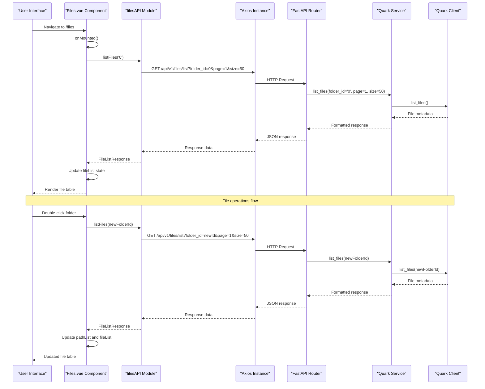

**Diagram sources**
- [Files.vue:89-104](file://frontend/src/views/Files.vue#L89-L104)
- [quark.ts:77-82](file://frontend/src/api/quark.ts#L77-L82)
- [files.py:19-35](file://backend/app/api/v1/files.py#L19-L35)
- [quark_service.py:218-242](file://backend/app/services/quark_service.py#L218-L242)

The architecture follows a unidirectional data flow pattern where user interactions trigger component methods that call API functions, which handle HTTP communication with the backend services. The backend services encapsulate business logic and integrate with external storage providers.

**Section sources**
- [Files.vue:89-130](file://frontend/src/views/Files.vue#L89-L130)
- [quark.ts:77-124](file://frontend/src/api/quark.ts#L77-L124)
- [files.py:19-149](file://backend/app/api/v1/files.py#L19-L149)

## Detailed Component Analysis

### Component State Management
The file browser component manages several key reactive states using Vue 3's Composition API:

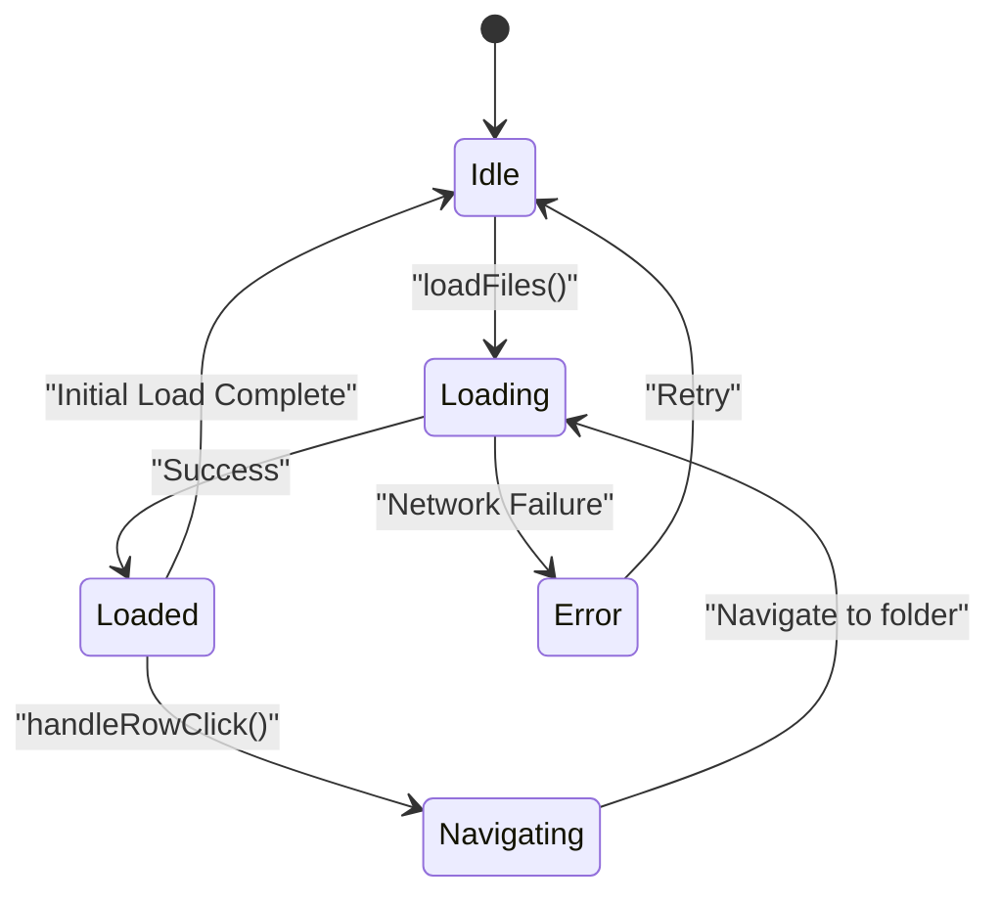

**Diagram sources**
- [Files.vue:78-87](file://frontend/src/views/Files.vue#L78-L87)

The component maintains state for:
- `loading`: Boolean flag indicating active network requests
- `currentFolderId`: String identifier for the currently displayed folder
- `pathList`: Array of breadcrumb navigation items
- `fileList`: Array containing the current directory's file metadata

**Section sources**
- [Files.vue:78-87](file://frontend/src/views/Files.vue#L78-L87)

### File Listing Display Implementation
The component renders file listings using Element Plus table components with custom cell templates for enhanced user experience:

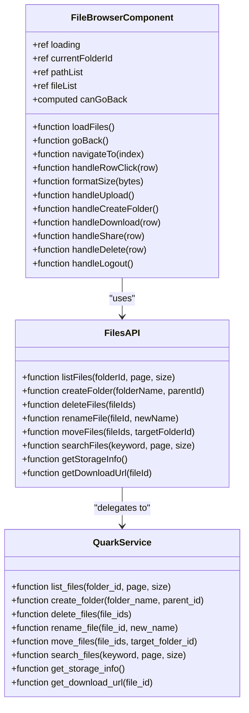

**Diagram sources**
- [Files.vue:69-215](file://frontend/src/views/Files.vue#L69-L215)
- [quark.ts:77-124](file://frontend/src/api/quark.ts#L77-L124)
- [quark_service.py:218-372](file://backend/app/services/quark_service.py#L218-L372)

The file display implementation includes:
- Icon differentiation between folders and files
- Size formatting with appropriate units
- Timestamp display for modification dates
- Action buttons for file operations

**Section sources**
- [Files.vue:36-61](file://frontend/src/views/Files.vue#L36-L61)
- [Files.vue:132-138](file://frontend/src/views/Files.vue#L132-L138)

### Directory Navigation and Breadcrumb System
The component implements a hierarchical navigation system with breadcrumb support:

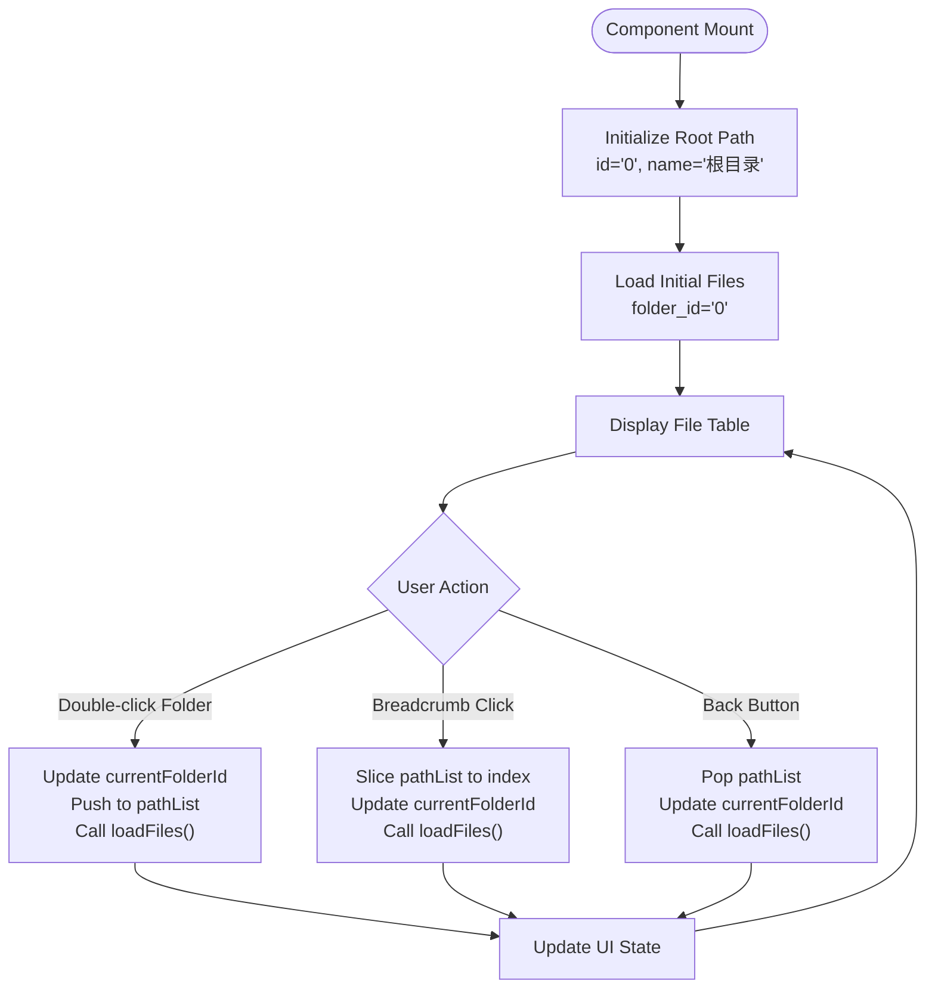

**Diagram sources**
- [Files.vue:81-83](file://frontend/src/views/Files.vue#L81-L83)
- [Files.vue:106-130](file://frontend/src/views/Files.vue#L106-L130)

The navigation system maintains:
- Current folder context through `currentFolderId`
- Hierarchical path tracking via `pathList`
- Back navigation capability with `canGoBack` computed property

**Section sources**
- [Files.vue:81-130](file://frontend/src/views/Files.vue#L81-L130)

### User Interaction Patterns and Event Handling
The component implements comprehensive user interaction patterns for file operations:

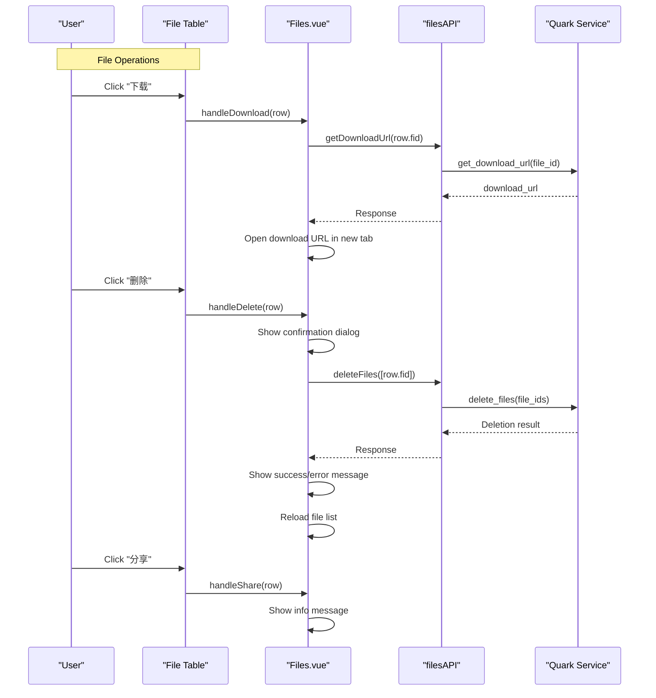

**Diagram sources**
- [Files.vue:165-200](file://frontend/src/views/Files.vue#L165-L200)
- [quark.ts:91-95](file://frontend/src/api/quark.ts#L91-L95)
- [quark_service.py:260-274](file://backend/app/services/quark_service.py#L260-L274)

The component handles various user interactions:
- File download initiation with URL retrieval
- File deletion with confirmation dialogs
- Folder navigation through double-click events
- New folder creation with validation prompts
- Logout functionality with route redirection

**Section sources**
- [Files.vue:140-210](file://frontend/src/views/Files.vue#L140-L210)

### Backend API Integration and Data Fetching
The component integrates with a comprehensive backend API that provides file management capabilities:

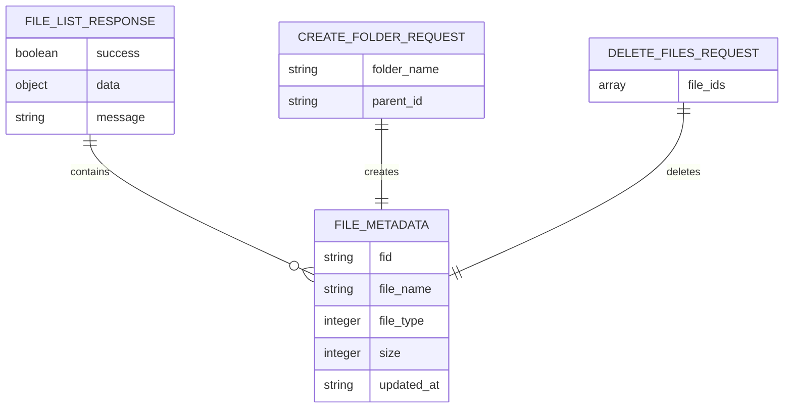

**Diagram sources**
- [quark.ts:43-47](file://frontend/src/api/quark.ts#L43-L47)
- [files.py:12-17](file://backend/app/schemas/files.py#L12-L17)

The API provides endpoints for:
- Listing files with pagination support
- Creating new folders with parent-child relationships
- Deleting files with bulk operations
- Renaming files and moving files between folders
- Searching files by keyword
- Retrieving storage information
- Generating download URLs

**Section sources**
- [quark.ts:77-124](file://frontend/src/api/quark.ts#L77-L124)
- [files.py:19-149](file://backend/app/api/v1/files.py#L19-L149)

### Responsive Design and Accessibility Features
The component implements responsive design patterns and accessibility considerations:

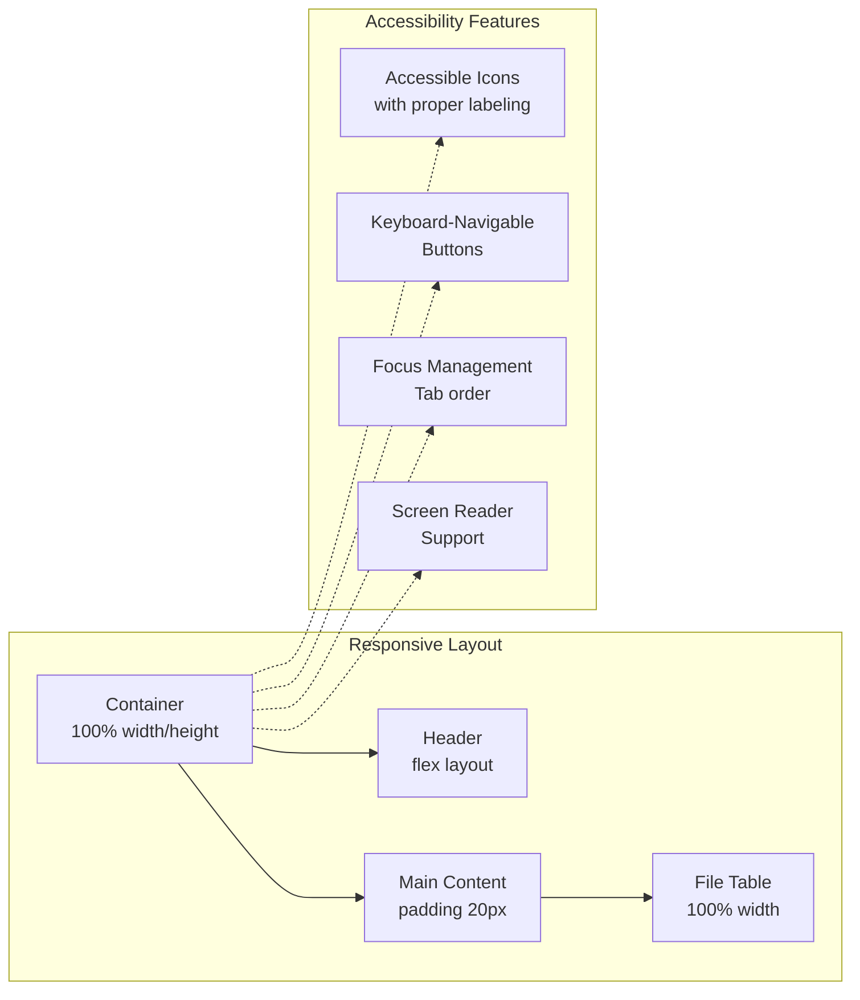

**Diagram sources**
- [Files.vue:217-263](file://frontend/src/views/Files.vue#L217-L263)

The component includes:
- Flexbox-based responsive layout
- Proper spacing and typography scales
- Accessible icon usage with Element Plus
- Keyboard navigation support through Element Plus components
- Screen reader friendly labels and descriptions

**Section sources**
- [Files.vue:217-263](file://frontend/src/views/Files.vue#L217-L263)

## Dependency Analysis

### Frontend Dependencies
The file browser component relies on several key frontend dependencies:

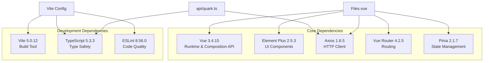

**Diagram sources**
- [package.json:11-29](file://frontend/package.json#L11-L29)

### Backend Dependencies
The backend service layer integrates with external cloud storage providers:

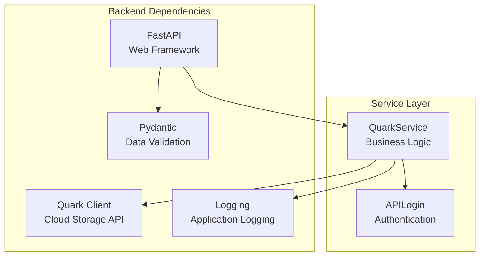

**Diagram sources**
- [quark_service.py:11-21](file://backend/app/services/quark_service.py#L11-L21)

**Section sources**
- [package.json:11-29](file://frontend/package.json#L11-L29)
- [quark_service.py:11-21](file://backend/app/services/quark_service.py#L11-L21)

## Performance Considerations
The file browser component implements several performance optimization strategies:

### Network Request Optimization
- **Debounced Requests**: Network requests are triggered only when necessary, avoiding redundant API calls during rapid user interactions.
- **Loading States**: Comprehensive loading indicators prevent multiple concurrent requests and provide user feedback.
- **Error Caching**: Failed requests are not cached, allowing users to retry operations.

### Memory Management
- **Reactive State Updates**: Vue 3's reactivity system efficiently updates only changed DOM nodes.
- **Component Lifecycle**: Proper cleanup of event listeners and timers prevents memory leaks.
- **Lazy Loading**: Route-based lazy loading ensures only necessary components are loaded.

### Rendering Performance
- **Virtual Scrolling**: Large file lists benefit from virtual scrolling to minimize DOM nodes.
- **Computed Properties**: Expensive calculations are cached using computed properties.
- **Conditional Rendering**: Empty states and loading states prevent unnecessary rendering.

## Troubleshooting Guide

### Common Issues and Solutions

#### Network Connectivity Problems
**Symptoms**: Loading spinner remains indefinitely, error messages appear
**Causes**: 
- Backend service unavailable
- Network timeouts
- Authentication failures

**Solutions**:
- Verify backend service health
- Check network connectivity
- Implement retry mechanisms
- Add connection status indicators

#### Authentication Failures
**Symptoms**: Unauthorized access errors, logout prompts
**Causes**:
- Expired authentication tokens
- Session timeouts
- Invalid credentials

**Solutions**:
- Implement automatic token refresh
- Add login state persistence
- Provide clear error messaging
- Enable manual re-authentication

#### Performance Issues
**Symptoms**: Slow file loading, UI freezes
**Causes**:
- Large file lists
- Network latency
- Memory leaks

**Solutions**:
- Implement pagination
- Add caching mechanisms
- Optimize rendering
- Monitor memory usage

**Section sources**
- [Files.vue:98-103](file://frontend/src/views/Files.vue#L98-L103)
- [Files.vue:182-200](file://frontend/src/views/Files.vue#L182-L200)

### Error Handling Patterns
The component implements comprehensive error handling:

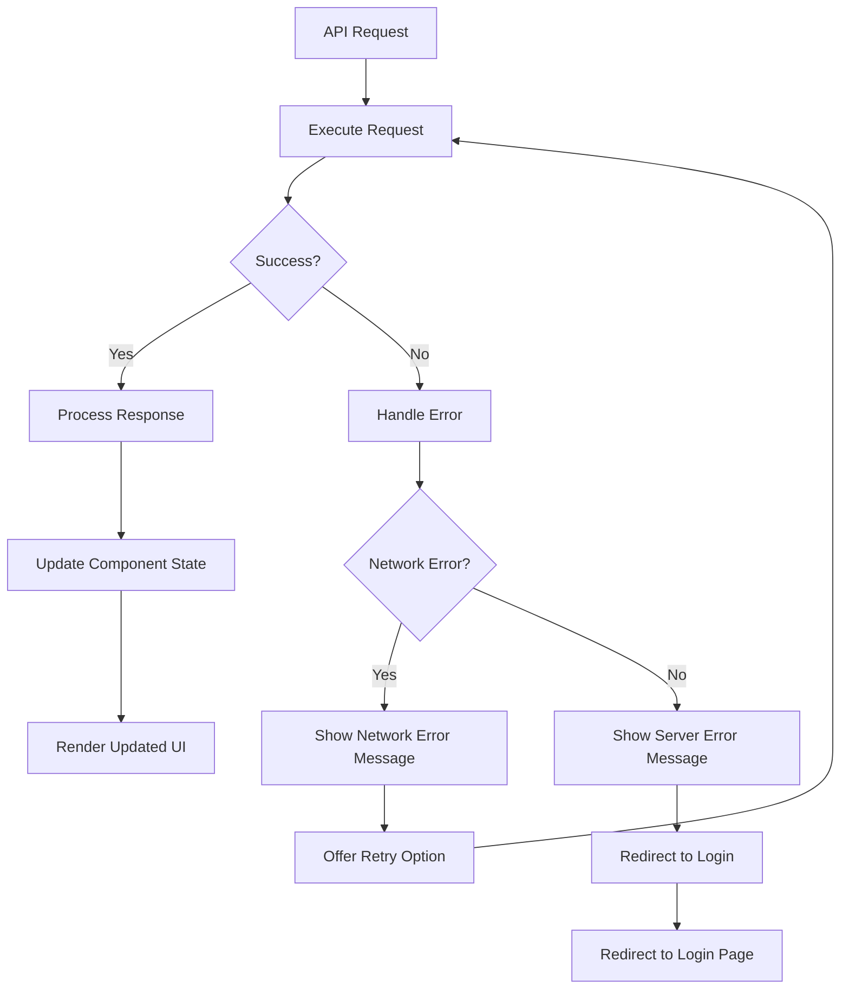

**Diagram sources**
- [Files.vue:89-104](file://frontend/src/views/Files.vue#L89-L104)

**Section sources**
- [Files.vue:89-104](file://frontend/src/views/Files.vue#L89-L104)

## Conclusion
The file browser interface component demonstrates a well-architected solution for cloud storage file management. Built with Vue 3 and Element Plus, it provides a responsive, accessible, and performant user experience while maintaining clean separation of concerns between frontend presentation and backend services.

Key strengths of the implementation include:
- **Modular Architecture**: Clear separation between component logic, API abstraction, and backend services
- **Comprehensive Feature Set**: Full file management capabilities with intuitive user interactions
- **Robust Error Handling**: Graceful degradation and user-friendly error messaging
- **Performance Optimization**: Efficient rendering and network request management
- **Accessibility Compliance**: Proper ARIA attributes and keyboard navigation support

The component serves as a solid foundation for cloud storage applications and can be extended with additional features such as file previews, advanced filtering, and collaborative sharing capabilities. The modular design facilitates future enhancements while maintaining backward compatibility and consistent user experience.