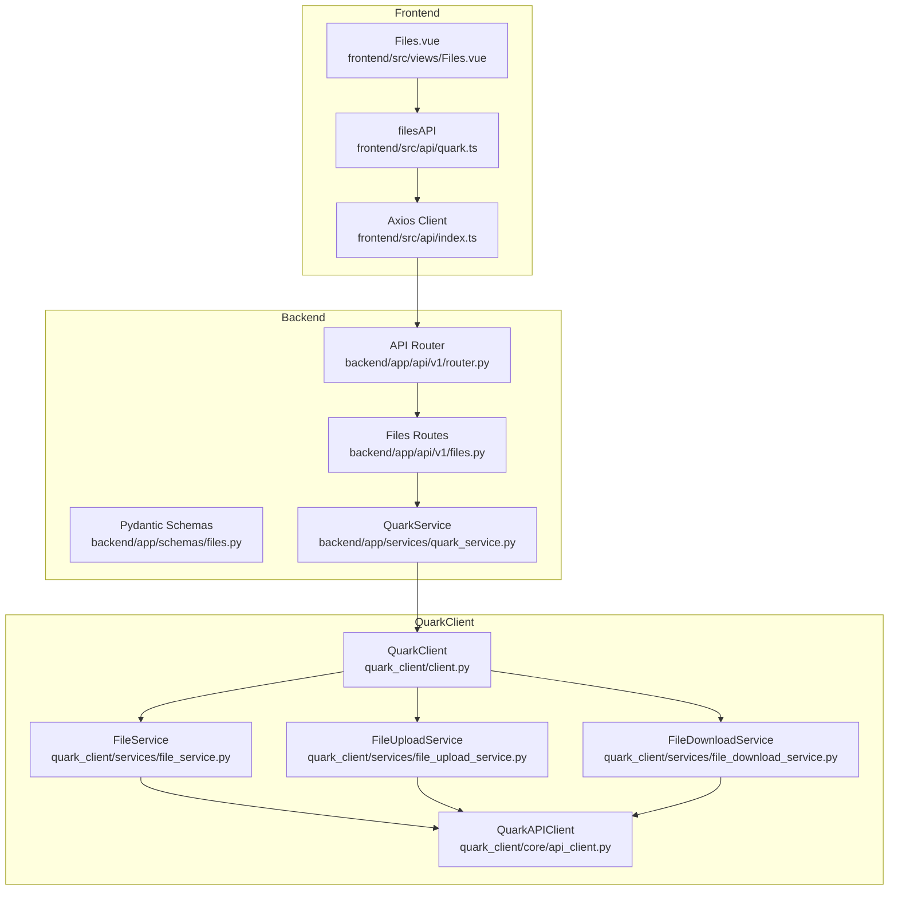
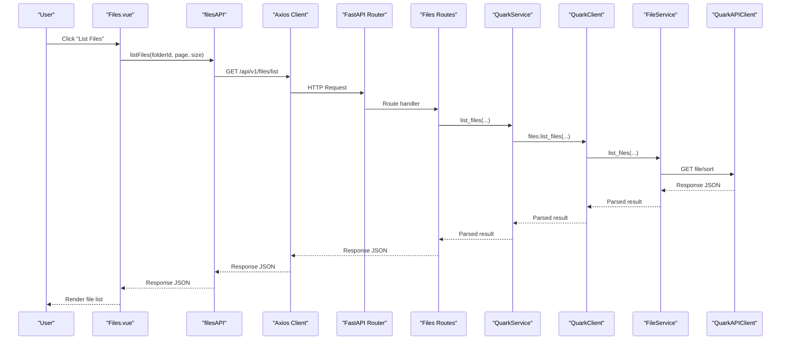
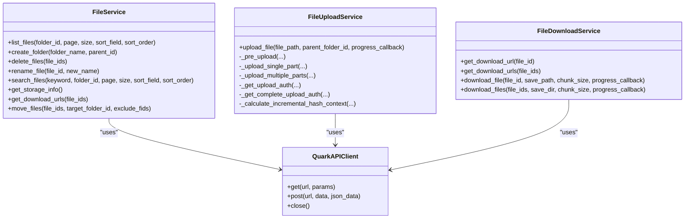
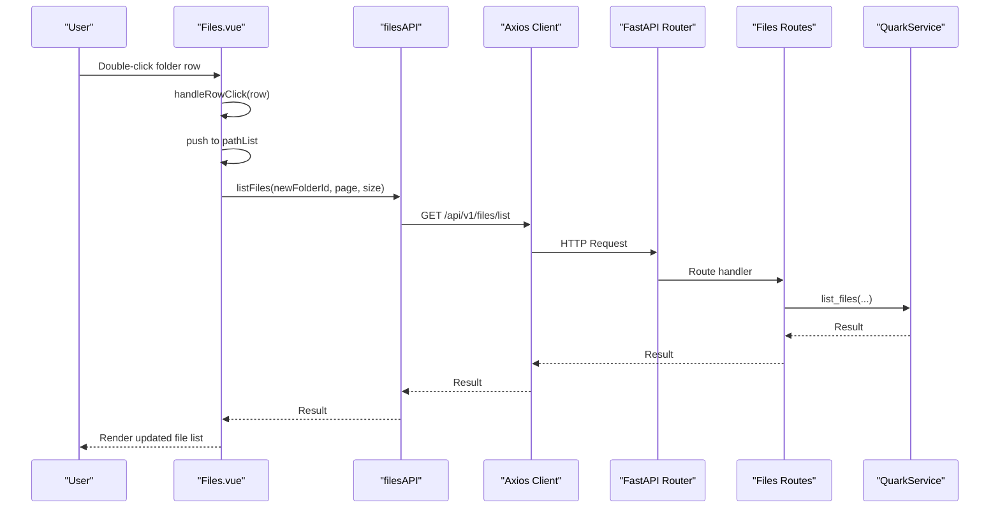
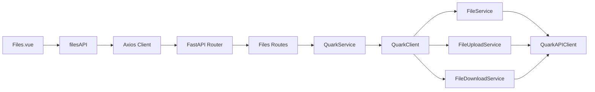

# File Management System

<cite>
**Referenced Files in This Document**
- [backend/app/api/v1/files.py](file://backend/app/api/v1/files.py)
- [backend/app/api/v1/router.py](file://backend/app/api/v1/router.py)
- [backend/app/schemas/files.py](file://backend/app/schemas/files.py)
- [backend/app/services/quark_service.py](file://backend/app/services/quark_service.py)
- [quark_client/services/file_service.py](file://quark_client/services/file_service.py)
- [quark_client/services/file_upload_service.py](file://quark_client/services/file_upload_service.py)
- [quark_client/services/file_download_service.py](file://quark_client/services/file_download_service.py)
- [quark_client/core/api_client.py](file://quark_client/core/api_client.py)
- [quark_client/client.py](file://quark_client/client.py)
- [frontend/src/views/Files.vue](file://frontend/src/views/Files.vue)
- [frontend/src/api/quark.ts](file://frontend/src/api/quark.ts)
- [frontend/src/api/index.ts](file://frontend/src/api/index.ts)
</cite>

## Table of Contents
1. [Introduction](#introduction)
2. [Project Structure](#project-structure)
3. [Core Components](#core-components)
4. [Architecture Overview](#architecture-overview)
5. [Detailed Component Analysis](#detailed-component-analysis)
6. [Dependency Analysis](#dependency-analysis)
7. [Performance Considerations](#performance-considerations)
8. [Troubleshooting Guide](#troubleshooting-guide)
9. [Conclusion](#conclusion)

## Introduction
This document provides comprehensive coverage of the file management system within QuarkManager. It explains the complete file operations suite, including the file browser interface, directory navigation, file listing, CRUD operations (create folder, delete, rename, move), search functionality, and storage information retrieval. It documents the backend API endpoints, frontend file browser component, and QuarkClient file service integration. Practical examples, progress tracking for uploads/downloads, error handling strategies, and performance considerations for large file handling are included.

## Project Structure
The file management system spans three layers:
- Backend API: FastAPI routes exposing file operations
- QuarkClient: Python SDK wrapping Quark Cloud API calls
- Frontend: Vue.js component with Axios integration for user interaction

**Diagram sources**
- [backend/app/api/v1/router.py:1-24](file://backend/app/api/v1/router.py#L1-L24)
- [backend/app/api/v1/files.py:1-150](file://backend/app/api/v1/files.py#L1-L150)
- [backend/app/schemas/files.py:1-54](file://backend/app/schemas/files.py#L1-L54)
- [backend/app/services/quark_service.py:1-345](file://backend/app/services/quark_service.py#L1-L345)
- [quark_client/client.py:1-405](file://quark_client/client.py#L1-L405)
- [quark_client/services/file_service.py:1-893](file://quark_client/services/file_service.py#L1-L893)
- [quark_client/services/file_upload_service.py:1-891](file://quark_client/services/file_upload_service.py#L1-L891)
- [quark_client/services/file_download_service.py:1-301](file://quark_client/services/file_download_service.py#L1-L301)
- [quark_client/core/api_client.py:1-209](file://quark_client/core/api_client.py#L1-L209)
- [frontend/src/views/Files.vue:1-148](file://frontend/src/views/Files.vue#L1-L148)
- [frontend/src/api/quark.ts:1-125](file://frontend/src/api/quark.ts#L1-L125)
- [frontend/src/api/index.ts:1-30](file://frontend/src/api/index.ts#L1-L30)

**Section sources**
- [backend/app/api/v1/router.py:1-24](file://backend/app/api/v1/router.py#L1-L24)
- [backend/app/api/v1/files.py:1-150](file://backend/app/api/v1/files.py#L1-L150)
- [quark_client/client.py:1-405](file://quark_client/client.py#L1-L405)
- [frontend/src/views/Files.vue:1-148](file://frontend/src/views/Files.vue#L1-L148)

## Core Components
- Backend API endpoints:
  - GET /api/v1/files/list: List files in a folder with pagination
  - POST /api/v1/files/folder: Create a new folder
  - DELETE /api/v1/files/delete: Delete files by IDs
  - PUT /api/v1/files/rename: Rename a file or folder
  - POST /api/v1/files/move: Move files to another folder
  - GET /api/v1/files/search: Search files by keyword with pagination
  - GET /api/v1/files/storage: Get storage capacity information
  - GET /api/v1/files/download/{file_id}: Get a download URL for a file
- QuarkClient file service integration:
  - FileService: Implements list_files, create_folder, delete_files, rename_file, search_files, get_storage_info, get_download_urls, and streaming download helpers
  - FileUploadService: Implements multi-part upload with progress callbacks and retry logic
  - FileDownloadService: Implements download URL retrieval and streaming downloads with progress callbacks
- Frontend file browser:
  - Files.vue: Provides breadcrumb navigation, file listing, and action buttons
  - filesAPI: Axios wrapper for backend endpoints

**Section sources**
- [backend/app/api/v1/files.py:19-150](file://backend/app/api/v1/files.py#L19-L150)
- [quark_client/services/file_service.py:25-893](file://quark_client/services/file_service.py#L25-L893)
- [quark_client/services/file_upload_service.py:28-891](file://quark_client/services/file_upload_service.py#L28-L891)
- [quark_client/services/file_download_service.py:25-301](file://quark_client/services/file_download_service.py#L25-L301)
- [frontend/src/views/Files.vue:1-148](file://frontend/src/views/Files.vue#L1-L148)
- [frontend/src/api/quark.ts:77-124](file://frontend/src/api/quark.ts#L77-L124)

## Architecture Overview
The system follows a layered architecture:
- Frontend Vue component renders the file browser and interacts with filesAPI
- filesAPI uses Axios to call backend endpoints under /api/v1
- Backend routes delegate to QuarkService
- QuarkService manages QuarkClient instances and delegates to FileService
- FileService communicates with QuarkAPIClient to call Quark Cloud APIs

**Diagram sources**
- [frontend/src/views/Files.vue:1-148](file://frontend/src/views/Files.vue#L1-L148)
- [frontend/src/api/quark.ts:77-82](file://frontend/src/api/quark.ts#L77-L82)
- [frontend/src/api/index.ts:1-30](file://frontend/src/api/index.ts#L1-L30)
- [backend/app/api/v1/router.py:21-24](file://backend/app/api/v1/router.py#L21-L24)
- [backend/app/api/v1/files.py:19-35](file://backend/app/api/v1/files.py#L19-L35)
- [backend/app/services/quark_service.py:186-210](file://backend/app/services/quark_service.py#L186-L210)
- [quark_client/client.py:76-78](file://quark_client/client.py#L76-L78)
- [quark_client/services/file_service.py:25-55](file://quark_client/services/file_service.py#L25-L55)
- [quark_client/core/api_client.py:184-190](file://quark_client/core/api_client.py#L184-L190)

## Detailed Component Analysis

### Backend API Endpoints
- GET /api/v1/files/list
  - Parameters: folder_id (default "0"), page (default 1), size (default 50, min 1, max 200)
  - Response: FileListResponse with success flag, data payload, and message
  - Implementation: Calls QuarkService.list_files and returns FileListResponse
- POST /api/v1/files/folder
  - Body: CreateFolderRequest with folder_name and parent_id
  - Response: FileListResponse
  - Implementation: Calls QuarkService.create_folder
- DELETE /api/v1/files/delete
  - Body: DeleteFilesRequest with file_ids list
  - Response: FileListResponse
  - Implementation: Calls QuarkService.delete_files
- PUT /api/v1/files/rename
  - Body: RenameFileRequest with file_id and new_name
  - Response: FileListResponse
  - Implementation: Calls QuarkService.rename_file
- POST /api/v1/files/move
  - Body: MoveFilesRequest with file_ids list and target_folder_id
  - Response: FileListResponse
  - Implementation: Calls QuarkService.move_files
- GET /api/v1/files/search
  - Parameters: keyword (required), page (default 1), size (default 50, min 1, max 200)
  - Response: FileListResponse
  - Implementation: Calls QuarkService.search_files
- GET /api/v1/files/storage
  - Response: StorageInfoResponse with success flag, data payload, and message
  - Implementation: Calls QuarkService.get_storage_info
- GET /api/v1/files/download/{file_id}
  - Response: Result from QuarkService.get_download_url
  - Implementation: Calls QuarkService.get_download_url

Validation and error handling:
- Pydantic schemas enforce parameter constraints (e.g., page and size bounds)
- HTTPException is raised with 400 status when QuarkService returns failure

**Section sources**
- [backend/app/api/v1/files.py:19-150](file://backend/app/api/v1/files.py#L19-L150)
- [backend/app/schemas/files.py:5-54](file://backend/app/schemas/files.py#L5-L54)
- [backend/app/services/quark_service.py:186-341](file://backend/app/services/quark_service.py#L186-L341)

### QuarkClient File Service Integration
FileService orchestrates file operations against Quark Cloud:
- list_files: GET file/sort with pagination and sorting parameters
- create_folder: POST file with dir_init_lock and empty dir_path
- delete_files: POST file/delete with action_type=2
- rename_file: POST file/rename with fid and new_name
- search_files: GET file/search with highlighting and sorting
- get_storage_info: GET capacity
- get_download_urls: POST file/download with fids list
- move_files: POST file/move with action_type=1; handles async task completion via polling

FileUploadService implements robust upload with:
- Pre-upload phase to obtain task_id and auth metadata
- Single-part vs multi-part upload selection based on file size threshold
- Incremental hash calculation for multi-part uploads
- Retry logic with exponential backoff
- Progress callbacks for UI feedback

FileDownloadService implements:
- Download URL retrieval via file/download endpoint
- Streaming download with progress callbacks
- Fallback mechanisms for anti-bot protections

**Diagram sources**
- [quark_client/core/api_client.py:16-209](file://quark_client/core/api_client.py#L16-L209)
- [quark_client/services/file_service.py:13-893](file://quark_client/services/file_service.py#L13-L893)
- [quark_client/services/file_upload_service.py:16-891](file://quark_client/services/file_upload_service.py#L16-L891)
- [quark_client/services/file_download_service.py:13-301](file://quark_client/services/file_download_service.py#L13-L301)

**Section sources**
- [quark_client/services/file_service.py:25-473](file://quark_client/services/file_service.py#L25-L473)
- [quark_client/services/file_upload_service.py:28-470](file://quark_client/services/file_upload_service.py#L28-L470)
- [quark_client/services/file_download_service.py:25-301](file://quark_client/services/file_download_service.py#L25-L301)
- [quark_client/core/api_client.py:80-190](file://quark_client/core/api_client.py#L80-L190)

### Frontend File Browser Component
Files.vue provides:
- Breadcrumb navigation with pathList state and navigateTo handler
- Back button disabled when at root
- Double-click to enter folders
- File listing with icons for folders and files
- Size formatting helper
- Placeholder actions for upload, create folder, download, share, delete

filesAPI exposes typed wrappers for backend endpoints:
- listFiles, createFolder, deleteFiles, renameFile, moveFiles, searchFiles, getStorageInfo, getDownloadUrl
- Uses Axios baseURL /api/v1 with interceptors for request/response

**Diagram sources**
- [frontend/src/views/Files.vue:82-90](file://frontend/src/views/Files.vue#L82-L90)
- [frontend/src/api/quark.ts:77-82](file://frontend/src/api/quark.ts#L77-L82)
- [frontend/src/api/index.ts:3-9](file://frontend/src/api/index.ts#L3-L9)
- [backend/app/api/v1/router.py:21-24](file://backend/app/api/v1/router.py#L21-L24)
- [backend/app/api/v1/files.py:19-35](file://backend/app/api/v1/files.py#L19-L35)
- [backend/app/services/quark_service.py:186-210](file://backend/app/services/quark_service.py#L186-L210)

**Section sources**
- [frontend/src/views/Files.vue:1-148](file://frontend/src/views/Files.vue#L1-L148)
- [frontend/src/api/quark.ts:77-124](file://frontend/src/api/quark.ts#L77-L124)
- [frontend/src/api/index.ts:1-30](file://frontend/src/api/index.ts#L1-L30)

### File Operations Workflow Examples

#### Create Folder
- Frontend: filesAPI.createFolder(folderName, parentId)
- Backend: POST /api/v1/files/folder with CreateFolderRequest
- Service: QuarkService.create_folder
- Client: FileService.create_folder
- API: POST file with dir_init_lock and empty dir_path

#### Delete Files
- Frontend: filesAPI.deleteFiles(fileIds)
- Backend: DELETE /api/v1/files/delete with DeleteFilesRequest
- Service: QuarkService.delete_files
- Client: FileService.delete_files
- API: POST file/delete with action_type=2

#### Rename File/Folder
- Frontend: filesAPI.renameFile(fileId, newName)
- Backend: PUT /api/v1/files/rename with RenameFileRequest
- Service: QuarkService.rename_file
- Client: FileService.rename_file
- API: POST file/rename

#### Move Files
- Frontend: filesAPI.moveFiles(fileIds, targetFolderId)
- Backend: POST /api/v1/files/move with MoveFilesRequest
- Service: QuarkService.move_files
- Client: FileService.move_files
- API: POST file/move with action_type=1; may poll task completion

#### Search Files
- Frontend: filesAPI.searchFiles(keyword, page, size)
- Backend: GET /api/v1/files/search with SearchFilesRequest
- Service: QuarkService.search_files
- Client: FileService.search_files
- API: GET file/search with highlighting and sorting

#### Download File
- Frontend: filesAPI.getDownloadUrl(fileId)
- Backend: GET /api/v1/files/download/{fileId}
- Service: QuarkService.get_download_url
- Client: FileDownloadService.get_download_url
- API: POST file/download

**Section sources**
- [backend/app/api/v1/files.py:38-149](file://backend/app/api/v1/files.py#L38-L149)
- [backend/app/services/quark_service.py:212-341](file://backend/app/services/quark_service.py#L212-L341)
- [quark_client/services/file_service.py:103-181](file://quark_client/services/file_service.py#L103-L181)
- [quark_client/services/file_download_service.py:25-62](file://quark_client/services/file_download_service.py#L25-L62)

### Progress Tracking for Uploads/Downloads
- Upload progress:
  - FileUploadService provides progress_callback throughout stages:
    - Hash calculation (0–10%)
    - Pre-upload (10–20%)
    - Hash update (20–30%)
    - Single/multi-part upload (30–95%)
    - Completion (95–100%)
  - Multi-part upload uses chunked progress per part with exponential backoff retries
- Download progress:
  - FileDownloadService streams chunks and reports downloaded/total bytes
  - Progress callback receives current file index and totals for batch downloads

**Section sources**
- [quark_client/services/file_upload_service.py:66-148](file://quark_client/services/file_upload_service.py#L66-L148)
- [quark_client/services/file_upload_service.py:340-402](file://quark_client/services/file_upload_service.py#L340-L402)
- [quark_client/services/file_download_service.py:196-250](file://quark_client/services/file_download_service.py#L196-L250)

### Error Handling Strategies
- Backend:
  - Pydantic validation enforces parameter constraints
  - HTTPException with 400 status for service failures
  - QuarkService wraps client calls and returns structured success/message
- Client:
  - QuarkAPIClient raises APIError/AuthenticationError/NetworkError based on HTTP status and response content
  - FileService/FileUploadService/FileDownloadService catch and re-raise with context
- Frontend:
  - Axios interceptors unwrap response.data and propagate errors
  - filesAPI returns typed responses for UI consumption

**Section sources**
- [backend/app/api/v1/files.py:28-29](file://backend/app/api/v1/files.py#L28-L29)
- [backend/app/api/v1/files.py:46-47](file://backend/app/api/v1/files.py#L46-L47)
- [backend/app/api/v1/files.py:79-80](file://backend/app/api/v1/files.py#L79-L80)
- [backend/app/api/v1/files.py:97-98](file://backend/app/api/v1/files.py#L97-L98)
- [backend/app/api/v1/files.py:116-117](file://backend/app/api/v1/files.py#L116-L117)
- [backend/app/api/v1/files.py:131-132](file://backend/app/api/v1/files.py#L131-L132)
- [quark_client/core/api_client.py:145-182](file://quark_client/core/api_client.py#L145-L182)
- [quark_client/services/file_service.py:56-59](file://quark_client/services/file_service.py#L56-L59)
- [quark_client/services/file_download_service.py:208-216](file://quark_client/services/file_download_service.py#L208-L216)

## Dependency Analysis
The system exhibits clean separation of concerns:
- Frontend depends on Axios and filesAPI for backend communication
- Backend routes depend on QuarkService for orchestration
- QuarkService depends on QuarkClient for API calls
- QuarkClient composes FileService, FileUploadService, FileDownloadService, and QuarkAPIClient
- FileService depends on QuarkAPIClient for HTTP requests

**Diagram sources**
- [frontend/src/views/Files.vue:1-148](file://frontend/src/views/Files.vue#L1-L148)
- [frontend/src/api/quark.ts:1-125](file://frontend/src/api/quark.ts#L1-L125)
- [frontend/src/api/index.ts:1-30](file://frontend/src/api/index.ts#L1-L30)
- [backend/app/api/v1/router.py:1-24](file://backend/app/api/v1/router.py#L1-L24)
- [backend/app/api/v1/files.py:1-150](file://backend/app/api/v1/files.py#L1-L150)
- [backend/app/services/quark_service.py:1-345](file://backend/app/services/quark_service.py#L1-L345)
- [quark_client/client.py:1-405](file://quark_client/client.py#L1-L405)
- [quark_client/core/api_client.py:1-209](file://quark_client/core/api_client.py#L1-L209)

**Section sources**
- [backend/app/api/v1/router.py:1-24](file://backend/app/api/v1/router.py#L1-L24)
- [backend/app/api/v1/files.py:1-150](file://backend/app/api/v1/files.py#L1-L150)
- [quark_client/client.py:1-405](file://quark_client/client.py#L1-L405)
- [quark_client/core/api_client.py:1-209](file://quark_client/core/api_client.py#L1-L209)

## Performance Considerations
- Pagination: Backend enforces page size limits (min 1, max 200) to prevent excessive loads
- Large file uploads:
  - Threshold-based single vs multi-part upload selection
  - Chunked upload with configurable part size for multi-part
  - Exponential backoff retry logic reduces network overhead
- Streaming downloads:
  - Chunked streaming avoids loading entire files into memory
  - Progress reporting enables responsive UI updates
- Async operations:
  - Move operation may return task_id requiring polling; FileService implements bounded polling with timeouts
- Caching and filtering:
  - Advanced search supports client-side filtering to reduce server load for large result sets

**Section sources**
- [backend/app/api/v1/files.py:21-23](file://backend/app/api/v1/files.py#L21-L23)
- [quark_client/services/file_upload_service.py:98-128](file://quark_client/services/file_upload_service.py#L98-L128)
- [quark_client/services/file_upload_service.py:324-343](file://quark_client/services/file_upload_service.py#L324-L343)
- [quark_client/services/file_service.py:428-472](file://quark_client/services/file_service.py#L428-L472)
- [quark_client/services/file_download_service.py:196-250](file://quark_client/services/file_download_service.py#L196-L250)

## Troubleshooting Guide
Common issues and resolutions:
- Authentication failures:
  - Backend raises 401/403; ensure cookies are set and valid
  - QuarkAPIClient throws AuthenticationError for unauthorized access
- Network timeouts:
  - QuarkAPIClient raises NetworkError on timeout; adjust timeouts or retry logic
- Invalid parameters:
  - Pydantic validation errors for out-of-range page/size values
- Move operation timeouts:
  - FileService.move_files implements polling with max retries; verify task_id availability
- Download failures:
  - FileDownloadService attempts fallback methods; check anti-bot protections and cookies
- Frontend errors:
  - Axios interceptors unwrap response.data; inspect error.response.data for details

**Section sources**
- [quark_client/core/api_client.py:145-182](file://quark_client/core/api_client.py#L145-L182)
- [quark_client/services/file_service.py:428-472](file://quark_client/services/file_service.py#L428-L472)
- [quark_client/services/file_download_service.py:208-256](file://quark_client/services/file_download_service.py#L208-L256)
- [frontend/src/api/index.ts:20-27](file://frontend/src/api/index.ts#L20-L27)

## Conclusion
QuarkManager’s file management system integrates a robust backend API, a comprehensive QuarkClient SDK, and a responsive frontend file browser. The system supports full CRUD operations, search, storage information retrieval, and efficient upload/download workflows with progress tracking. Clear error handling and performance optimizations ensure reliability for both small and large-scale file operations.