# CRUD Operations

<cite>
**Referenced Files in This Document**
- [files.py](file://backend/app/api/v1/files.py)
- [files.py](file://backend/app/schemas/files.py)
- [quark_service.py](file://backend/app/services/quark_service.py)
- [file_service.py](file://quark_client/services/file_service.py)
- [api_client.py](file://quark_client/core/api_client.py)
- [client.py](file://quark_client/client.py)
- [router.py](file://backend/app/api/v1/router.py)
- [main.py](file://backend/app/main.py)
- [auth.py](file://backend/app/api/v1/auth.py)
- [auth.py](file://backend/app/schemas/auth.py)
</cite>

## Table of Contents
1. [Introduction](#introduction)
2. [Project Structure](#project-structure)
3. [Core Components](#core-components)
4. [Architecture Overview](#architecture-overview)
5. [Detailed Component Analysis](#detailed-component-analysis)
6. [API Endpoints Reference](#api-endpoints-reference)
7. [QuarkClient Service Integration](#quarkclient-service-integration)
8. [Request Validation and Error Handling](#request-validation-and-error-handling)
9. [Response Formatting](#response-formatting)
10. [Practical Operation Workflows](#practical-operation-workflows)
11. [Error Scenarios and Troubleshooting](#error-scenarios-and-troubleshooting)
12. [Best Practices for Concurrent Operations](#best-practices-for-concurrent-operations)
13. [Performance Considerations](#performance-considerations)
14. [Conclusion](#conclusion)

## Introduction

This document provides comprehensive coverage of CRUD operations for file management in the QuarkManager system. The implementation includes create folder, delete, rename, and move functionality with robust request validation, error handling, and response formatting. The system integrates with the QuarkClient service to communicate with the Quark Cloud storage API, providing a complete file management solution.

The CRUD operations are exposed through RESTful API endpoints under `/api/v1/files/` with standardized request/response schemas and comprehensive error handling mechanisms.

## Project Structure

The CRUD functionality is organized across multiple layers of the application architecture:

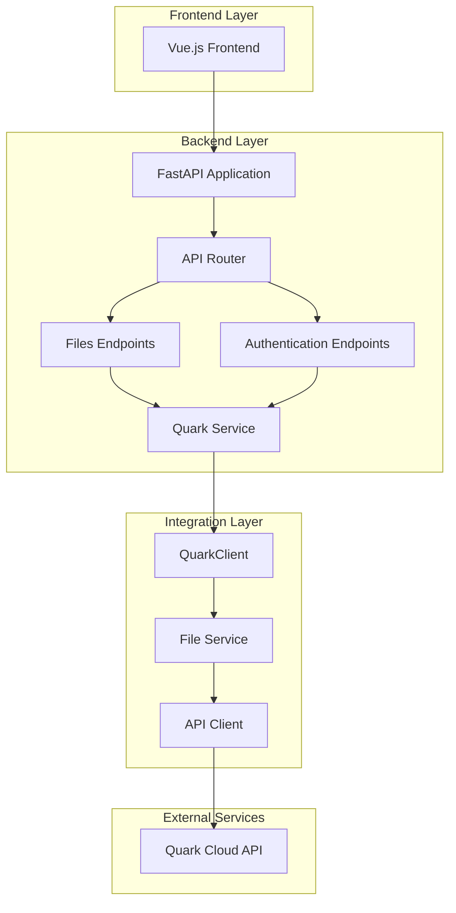

**Diagram sources**
- [main.py:12-28](file://backend/app/main.py#L12-L28)
- [router.py:1-24](file://backend/app/api/v1/router.py#L1-L24)
- [files.py:16](file://backend/app/api/v1/files.py#L16)

**Section sources**
- [main.py:12-28](file://backend/app/main.py#L12-L28)
- [router.py:1-24](file://backend/app/api/v1/router.py#L1-L24)

## Core Components

The CRUD operations are built around several key components that work together to provide a seamless file management experience:

### API Layer Components

The API layer consists of FastAPI routers that handle HTTP requests and responses:

- **Files Router**: Manages file operations including create, delete, rename, and move
- **Authentication Router**: Handles user authentication and session management
- **Request Schemas**: Pydantic models for request validation
- **Response Schemas**: Standardized response formatting

### Service Layer Components

The service layer provides business logic and integration with external APIs:

- **QuarkService**: Central service managing QuarkClient instances
- **FileService**: Direct integration with Quark Cloud file operations
- **Authentication Management**: QR code generation and login status checking

### Client Integration Components

The client layer handles communication with the Quark Cloud API:

- **QuarkAPIClient**: HTTP client for API communication
- **File Operations**: Individual file management methods
- **Error Handling**: Comprehensive exception management

**Section sources**
- [files.py:16](file://backend/app/api/v1/files.py#L16)
- [quark_service.py:23-388](file://backend/app/services/quark_service.py#L23-L388)
- [file_service.py:13-800](file://quark_client/services/file_service.py#L13-L800)

## Architecture Overview

The CRUD operations follow a layered architecture pattern with clear separation of concerns:

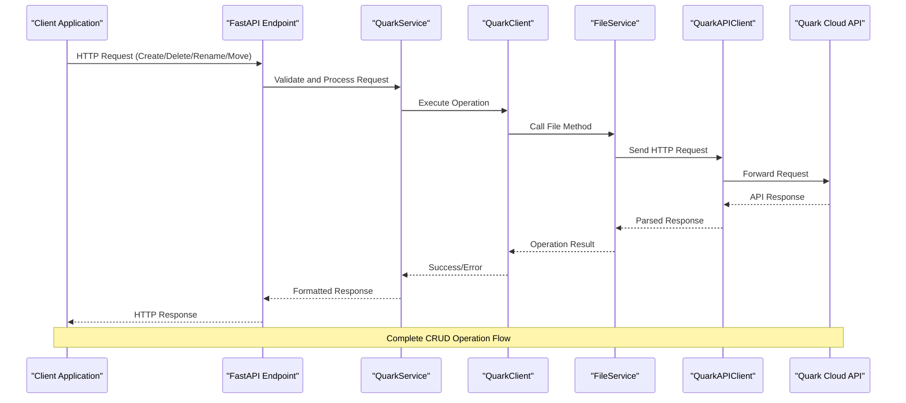

**Diagram sources**
- [files.py:38-104](file://backend/app/api/v1/files.py#L38-L104)
- [quark_service.py:255-317](file://backend/app/services/quark_service.py#L255-L317)
- [file_service.py:103-181](file://quark_client/services/file_service.py#L103-L181)

## Detailed Component Analysis

### Create Folder Operation

The create folder operation enables users to create new directories within the Quark Cloud storage system.

#### Implementation Details

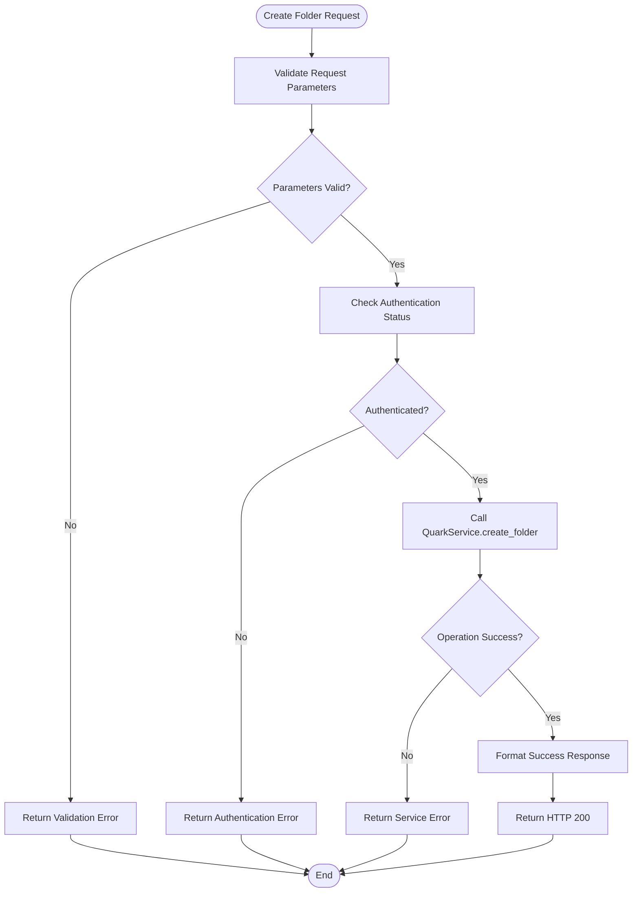

**Diagram sources**
- [files.py:38-53](file://backend/app/api/v1/files.py#L38-L53)
- [quark_service.py:255-269](file://backend/app/services/quark_service.py#L255-L269)
- [file_service.py:103-129](file://quark_client/services/file_service.py#L103-L129)

#### Request Schema

The create folder endpoint accepts the following request parameters:

| Parameter | Type | Required | Description |
|-----------|------|----------|-------------|
| folder_name | string | Yes | Name of the folder to create |
| parent_id | string | No | Parent folder ID (default: "0" for root) |

#### Response Schema

| Field | Type | Description |
|-------|------|-------------|
| success | boolean | Operation success status |
| data | object | Created folder information |
| message | string | Operation result message |

**Section sources**
- [files.py:19-23](file://backend/app/schemas/files.py#L19-L23)
- [files.py:38-53](file://backend/app/api/v1/files.py#L38-L53)
- [quark_service.py:255-269](file://backend/app/services/quark_service.py#L255-L269)

### Delete Operation

The delete operation removes files and folders from the Quark Cloud storage system.

#### Implementation Details

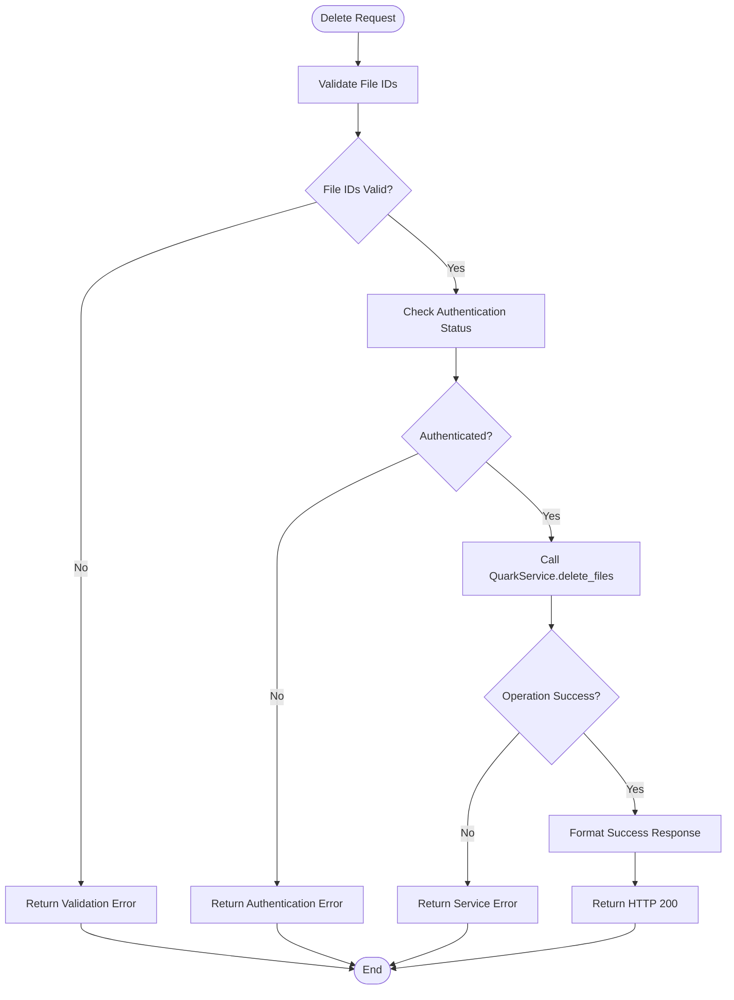

**Diagram sources**
- [files.py:56-68](file://backend/app/api/v1/files.py#L56-L68)
- [quark_service.py:271-285](file://backend/app/services/quark_service.py#L271-L285)
- [file_service.py:131-155](file://quark_client/services/file_service.py#L131-L155)

#### Request Schema

The delete endpoint accepts the following request parameters:

| Parameter | Type | Required | Description |
|-----------|------|----------|-------------|
| file_ids | array[string] | Yes | Array of file/folder IDs to delete |

#### Response Schema

| Field | Type | Description |
|-------|------|-------------|
| success | boolean | Operation success status |
| data | object | Deletion result information |
| message | string | Operation result message |

**Section sources**
- [files.py:25-28](file://backend/app/schemas/files.py#L25-L28)
- [files.py:56-68](file://backend/app/api/v1/files.py#L56-L68)
- [quark_service.py:271-285](file://backend/app/services/quark_service.py#L271-L285)

### Rename Operation

The rename operation allows users to change the name of files and folders.

#### Implementation Details

**Diagram sources**
- [files.py:71-86](file://backend/app/api/v1/files.py#L71-L86)
- [quark_service.py:287-301](file://backend/app/services/quark_service.py#L287-L301)
- [file_service.py:157-181](file://quark_client/services/file_service.py#L157-L181)

#### Request Schema

The rename endpoint accepts the following request parameters:

| Parameter | Type | Required | Description |
|-----------|------|----------|-------------|
| file_id | string | Yes | ID of the file/folder to rename |
| new_name | string | Yes | New name for the file/folder |

#### Response Schema

| Field | Type | Description |
|-------|------|-------------|
| success | boolean | Operation success status |
| data | object | Rename result information |
| message | string | Operation result message |

**Section sources**
- [files.py:30-34](file://backend/app/schemas/files.py#L30-L34)
- [files.py:71-86](file://backend/app/api/v1/files.py#L71-L86)
- [quark_service.py:287-301](file://backend/app/services/quark_service.py#L287-L301)

### Move Operation

The move operation transfers files and folders to different locations within the Quark Cloud storage system.

#### Implementation Details

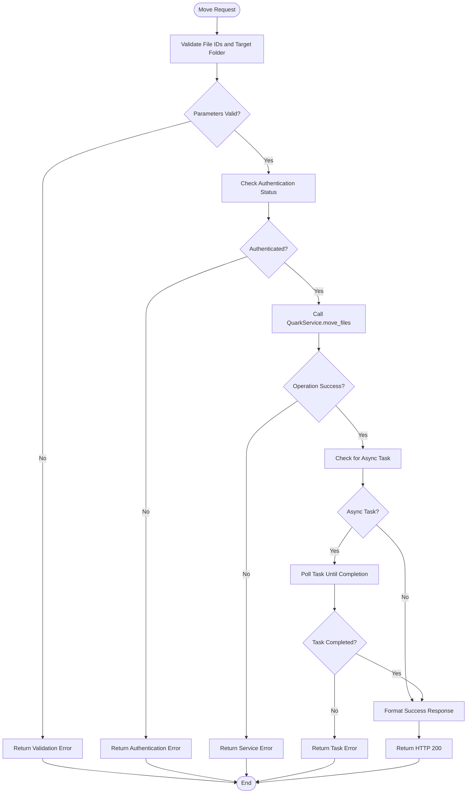

**Diagram sources**
- [files.py:89-104](file://backend/app/api/v1/files.py#L89-L104)
- [quark_service.py:303-317](file://backend/app/services/quark_service.py#L303-L317)
- [file_service.py:386-472](file://quark_client/services/file_service.py#L386-L472)

#### Request Schema

The move endpoint accepts the following request parameters:

| Parameter | Type | Required | Description |
|-----------|------|----------|-------------|
| file_ids | array[string] | Yes | Array of file/folder IDs to move |
| target_folder_id | string | Yes | Target folder ID for the move operation |

#### Response Schema

| Field | Type | Description |
|-------|------|-------------|
| success | boolean | Operation success status |
| data | object | Move result information |
| message | string | Operation result message |

**Section sources**
- [files.py:36-40](file://backend/app/schemas/files.py#L36-L40)
- [files.py:89-104](file://backend/app/api/v1/files.py#L89-L104)
- [quark_service.py:303-317](file://backend/app/services/quark_service.py#L303-L317)

## API Endpoints Reference

### Endpoint Definitions

The CRUD operations are exposed through the following RESTful endpoints:

#### Create Folder
- **Method**: POST
- **Endpoint**: `/api/v1/files/folder`
- **Description**: Creates a new folder in the specified location
- **Authentication**: Required

#### Delete Files/Folders
- **Method**: DELETE
- **Endpoint**: `/api/v1/files/delete`
- **Description**: Deletes one or more files/folders
- **Authentication**: Required

#### Rename File/Folder
- **Method**: PUT
- **Endpoint**: `/api/v1/files/rename`
- **Description**: Renames a file or folder
- **Authentication**: Required

#### Move Files/Folders
- **Method**: POST
- **Endpoint**: `/api/v1/files/move`
- **Description**: Moves files/folders to a target location
- **Authentication**: Required

### Request Validation

Each endpoint implements comprehensive request validation:

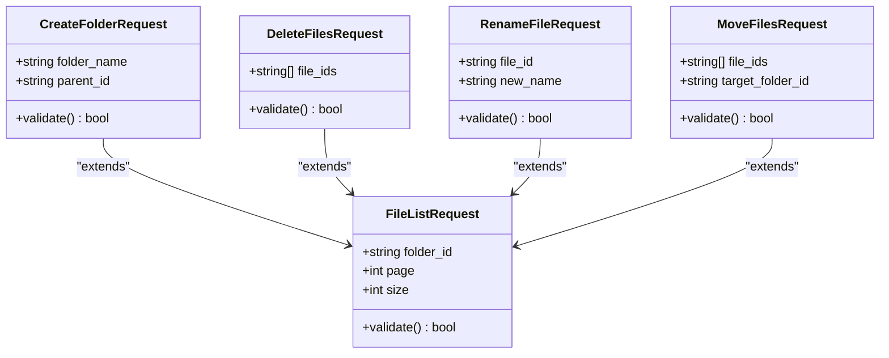

**Diagram sources**
- [files.py:5-46](file://backend/app/schemas/files.py#L5-L46)

**Section sources**
- [files.py:19-40](file://backend/app/schemas/files.py#L19-L40)
- [files.py:38-104](file://backend/app/api/v1/files.py#L38-L104)

## QuarkClient Service Integration

The QuarkClient service provides the core integration with the Quark Cloud API, handling all file operations through a well-structured service layer.

### Service Architecture

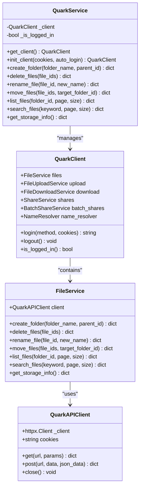

**Diagram sources**
- [quark_service.py:23-52](file://backend/app/services/quark_service.py#L23-L52)
- [client.py:18-42](file://quark_client/client.py#L18-L42)
- [file_service.py:13-24](file://quark_client/services/file_service.py#L13-L24)
- [api_client.py:16-45](file://quark_client/core/api_client.py#L16-L45)

### Authentication Requirements

The QuarkClient service implements multiple authentication methods:

#### QR Code Authentication Flow

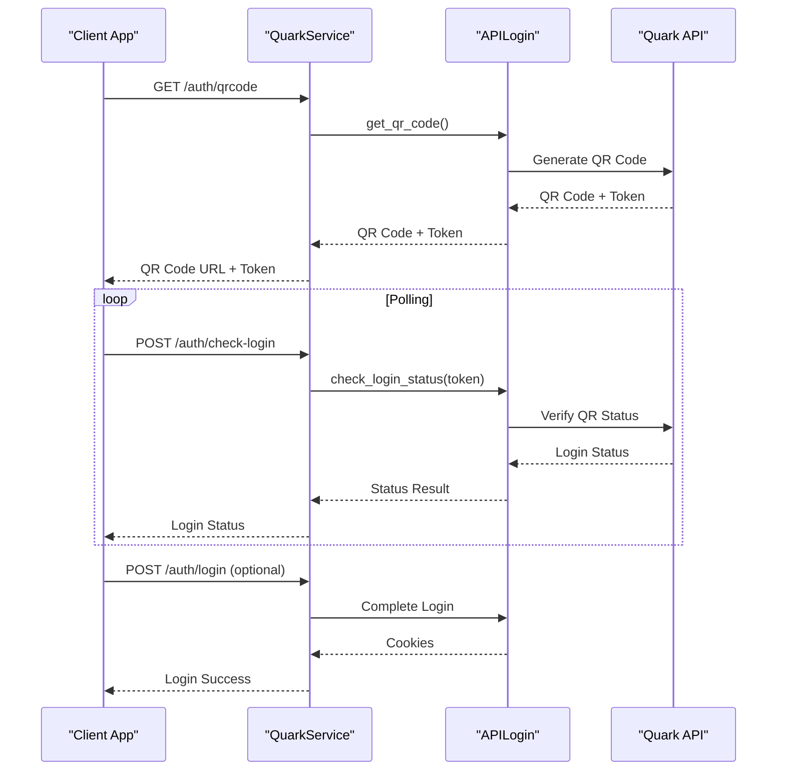

**Diagram sources**
- [auth.py:18-52](file://backend/app/api/v1/auth.py#L18-L52)
- [quark_service.py:54-159](file://backend/app/services/quark_service.py#L54-L159)

#### Cookie-Based Authentication

The system supports direct cookie-based authentication for programmatic access:

- **Method**: `simple` authentication mode
- **Requirements**: Valid Quark Cloud cookies
- **Usage**: Direct cookie injection without QR code process

**Section sources**
- [quark_service.py:54-159](file://backend/app/services/quark_service.py#L54-L159)
- [client.py:50-64](file://quark_client/client.py#L50-L64)

### Rate Limiting Considerations

The QuarkClient service implements several mechanisms to handle rate limiting and API constraints:

#### Built-in Rate Limiting
- **HTTP Client Timeout**: Configured through `Config.REQUEST_TIMEOUT`
- **Automatic Retry Logic**: Implemented in API client for transient failures
- **Task Polling**: Asynchronous operations use controlled polling intervals

#### Recommended Rate Limiting Strategies
- **Batch Operations**: Group multiple file operations within reasonable limits
- **Backoff Strategy**: Implement exponential backoff for failed requests
- **Concurrent Operation Limits**: Limit simultaneous file operations to prevent API throttling

**Section sources**
- [api_client.py:41-45](file://quark_client/core/api_client.py#L41-L45)
- [file_service.py:428-472](file://quark_client/services/file_service.py#L428-L472)

## Request Validation and Error Handling

The system implements comprehensive validation and error handling across all CRUD operations.

### Validation Mechanisms

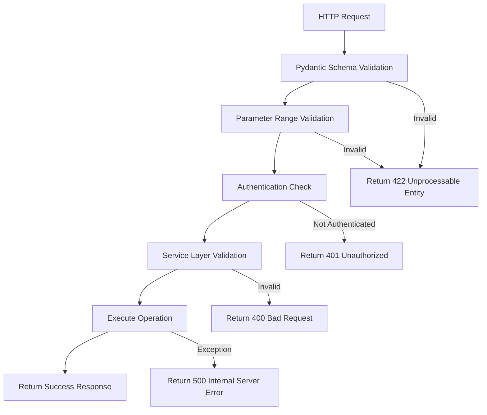

**Diagram sources**
- [files.py:38-104](file://backend/app/api/v1/files.py#L38-L104)
- [files.py:5-46](file://backend/app/schemas/files.py#L5-L46)

### Error Response Formats

All error responses follow a consistent format:

| Field | Type | Description |
|-------|------|-------------|
| success | boolean | Always false for error responses |
| message | string | Human-readable error description |
| data | object | Additional error context (optional) |

### Common Error Scenarios

#### Authentication Errors
- **401 Unauthorized**: User not logged in or session expired
- **403 Forbidden**: Insufficient permissions or invalid credentials

#### Validation Errors
- **422 Unprocessable Entity**: Invalid request parameters
- **400 Bad Request**: Business logic validation failures

#### Service Errors
- **500 Internal Server Error**: Unexpected server-side failures
- **504 Gateway Timeout**: Upstream API timeouts

**Section sources**
- [files.py:28-29](file://backend/app/api/v1/files.py#L28-L29)
- [files.py:61-62](file://backend/app/api/v1/files.py#L61-L62)
- [files.py:79-80](file://backend/app/api/v1/files.py#L79-L80)
- [files.py:97-98](file://backend/app/api/v1/files.py#L97-L98)

## Response Formatting

The system provides standardized response formatting across all CRUD operations.

### Response Schema Structure

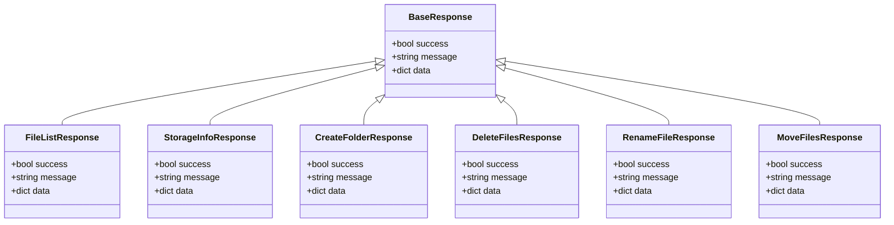

**Diagram sources**
- [files.py:12-16](file://backend/app/schemas/files.py#L12-L16)
- [files.py:49-53](file://backend/app/schemas/files.py#L49-L53)

### Response Content Patterns

#### Success Responses
- **HTTP Status**: 200 OK
- **Content-Type**: application/json
- **Structure**: `{ "success": true, "message": "...", "data": {...} }`

#### Error Responses  
- **HTTP Status**: 400, 401, 403, 422, or 500
- **Content-Type**: application/json
- **Structure**: `{ "success": false, "message": "...", "data": null }`

**Section sources**
- [files.py:12-16](file://backend/app/schemas/files.py#L12-L16)
- [files.py:31-35](file://backend/app/api/v1/files.py#L31-L35)
- [files.py:64-68](file://backend/app/api/v1/files.py#L64-L68)

## Practical Operation Workflows

### Create Folder Workflow

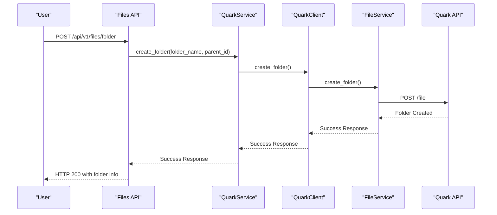

**Diagram sources**
- [files.py:38-53](file://backend/app/api/v1/files.py#L38-L53)
- [quark_service.py:255-269](file://backend/app/services/quark_service.py#L255-L269)
- [file_service.py:103-129](file://quark_client/services/file_service.py#L103-L129)

### Delete Files Workflow

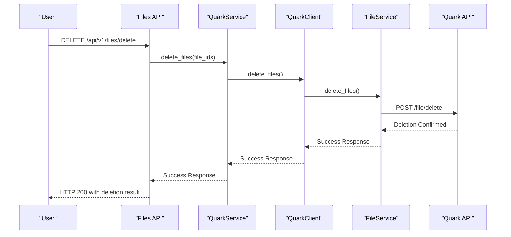

**Diagram sources**
- [files.py:56-68](file://backend/app/api/v1/files.py#L56-L68)
- [quark_service.py:271-285](file://backend/app/services/quark_service.py#L271-L285)
- [file_service.py:131-155](file://quark_client/services/file_service.py#L131-L155)

### Rename File Workflow

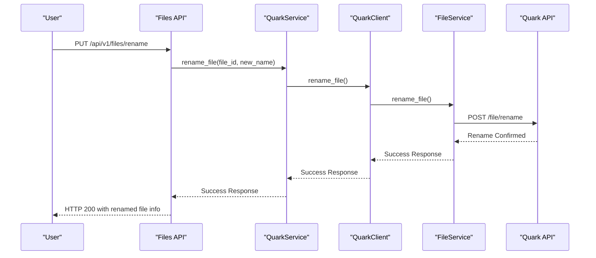

**Diagram sources**
- [files.py:71-86](file://backend/app/api/v1/files.py#L71-L86)
- [quark_service.py:287-301](file://backend/app/services/quark_service.py#L287-L301)
- [file_service.py:157-181](file://quark_client/services/file_service.py#L157-L181)

### Move Files Workflow

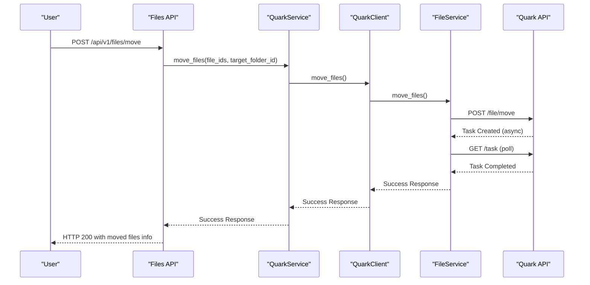

**Diagram sources**
- [files.py:89-104](file://backend/app/api/v1/files.py#L89-L104)
- [quark_service.py:303-317](file://backend/app/services/quark_service.py#L303-L317)
- [file_service.py:386-472](file://quark_client/services/file_service.py#L386-L472)

## Error Scenarios and Troubleshooting

### Common Error Categories

#### Authentication Issues
- **Expired Session**: User needs to re-authenticate
- **Invalid Credentials**: Incorrect login information
- **Network Connectivity**: API unreachable or timeout

#### Business Logic Errors
- **Invalid File IDs**: Non-existent or malformed identifiers
- **Permission Denied**: Insufficient privileges for operation
- **Resource Conflicts**: Naming conflicts or invalid paths

#### System Errors
- **API Limit Exceeded**: Rate limiting or quota exceeded
- **Internal Server Error**: Unexpected application failures
- **Database Issues**: Storage or connection problems

### Troubleshooting Guidelines

#### Immediate Actions
1. **Verify Authentication**: Ensure user is logged in and session is valid
2. **Check Parameters**: Validate all request parameters meet requirements
3. **Review Logs**: Check server logs for detailed error information
4. **Test Connectivity**: Verify network connectivity to Quark API

#### Recovery Strategies
- **Retry Logic**: Implement exponential backoff for transient failures
- **Fallback Options**: Provide alternative operations when primary fails
- **User Feedback**: Clear error messages with actionable guidance

**Section sources**
- [quark_service.py:242-253](file://backend/app/services/quark_service.py#L242-L253)
- [api_client.py:145-182](file://quark_client/core/api_client.py#L145-L182)

## Best Practices for Concurrent Operations

### Concurrency Control

The system implements several strategies to handle concurrent operations safely:

#### Operation Queuing
- **Sequential Processing**: Queue operations to prevent race conditions
- **Batch Operations**: Group related operations for atomic processing
- **Conflict Resolution**: Detect and resolve naming conflicts

#### Resource Management
- **Connection Pooling**: Efficient HTTP client connection reuse
- **Memory Management**: Proper cleanup of temporary resources
- **Timeout Handling**: Configurable timeouts for long-running operations

### Performance Optimization

#### Caching Strategies
- **Response Caching**: Cache frequently accessed file metadata
- **Authentication Caching**: Store validated session information
- **API Response Caching**: Cache successful API responses

#### Scalability Considerations
- **Asynchronous Processing**: Use async operations for non-blocking performance
- **Load Balancing**: Distribute operations across multiple instances
- **Database Optimization**: Indexes and efficient query patterns

**Section sources**
- [file_service.py:428-472](file://quark_client/services/file_service.py#L428-L472)
- [api_client.py:80-183](file://quark_client/core/api_client.py#L80-L183)

## Performance Considerations

### API Response Times

The system is designed for responsive user experiences:

#### Typical Response Time Targets
- **Create/Delete/Rename**: < 2 seconds
- **Move Operations**: < 5 seconds (including async completion)
- **List Operations**: < 1 second
- **Search Operations**: < 3 seconds

#### Performance Monitoring
- **Response Time Tracking**: Monitor and log operation durations
- **Error Rate Monitoring**: Track failure rates and patterns
- **Resource Utilization**: Monitor CPU, memory, and network usage

### Optimization Recommendations

#### Client-Side Optimizations
- **Lazy Loading**: Load file lists incrementally
- **Pagination**: Implement efficient pagination patterns
- **Caching**: Cache frequently accessed data

#### Server-Side Optimizations
- **Connection Reuse**: Maintain persistent HTTP connections
- **Compression**: Enable gzip compression for responses
- **Database Indexing**: Optimize database queries

## Conclusion

The CRUD operations implementation provides a robust, scalable, and user-friendly file management system integrated with the Quark Cloud storage platform. The architecture follows modern best practices with clear separation of concerns, comprehensive error handling, and standardized response formats.

Key strengths of the implementation include:

- **Comprehensive Validation**: Pydantic-based request validation ensures data integrity
- **Robust Error Handling**: Consistent error response formats across all operations
- **Flexible Authentication**: Multiple authentication methods support various use cases
- **Asynchronous Operations**: Proper handling of long-running operations
- **Performance Optimization**: Built-in caching and connection pooling
- **Security Considerations**: Proper authentication and authorization mechanisms

The system is well-suited for production deployment and can be extended with additional features such as advanced search capabilities, batch operations, and enhanced monitoring systems.