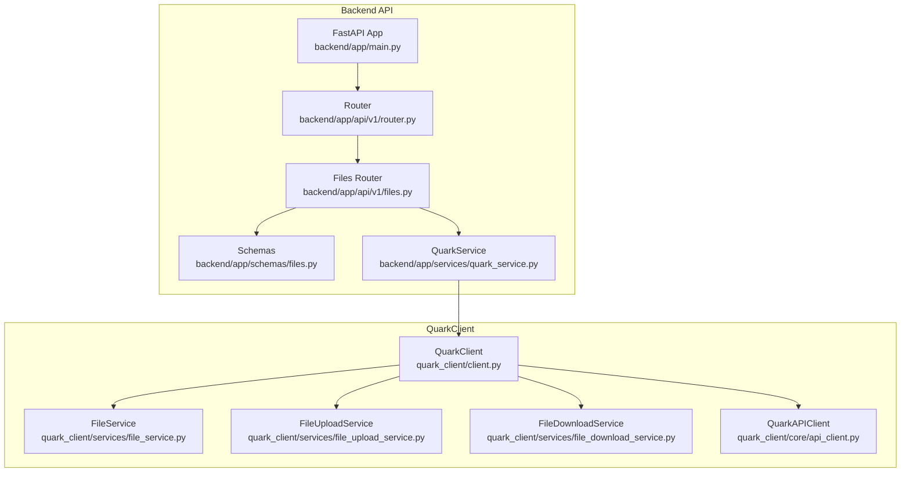
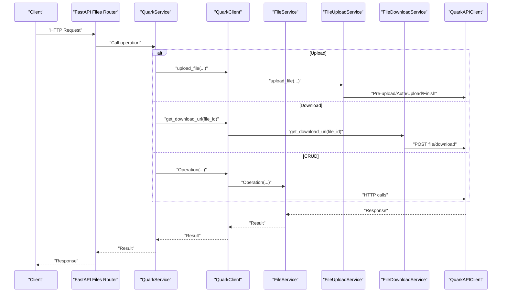
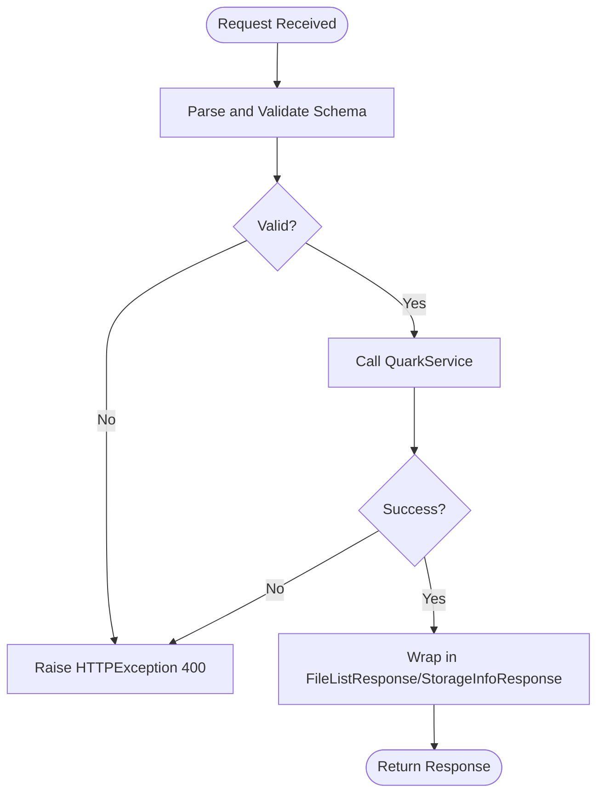
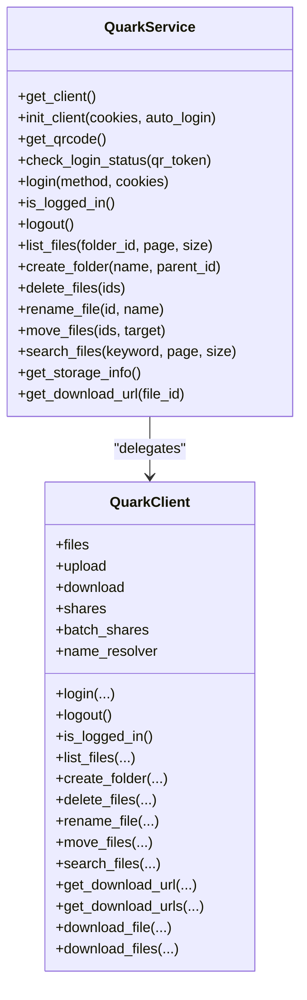
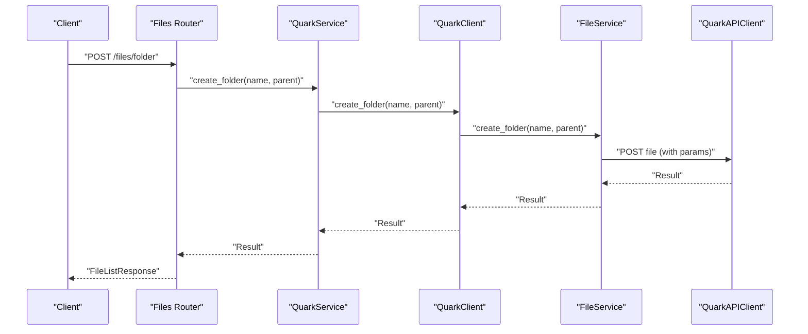
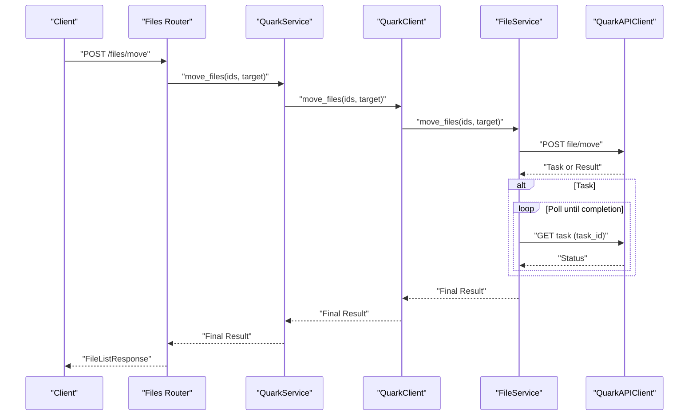
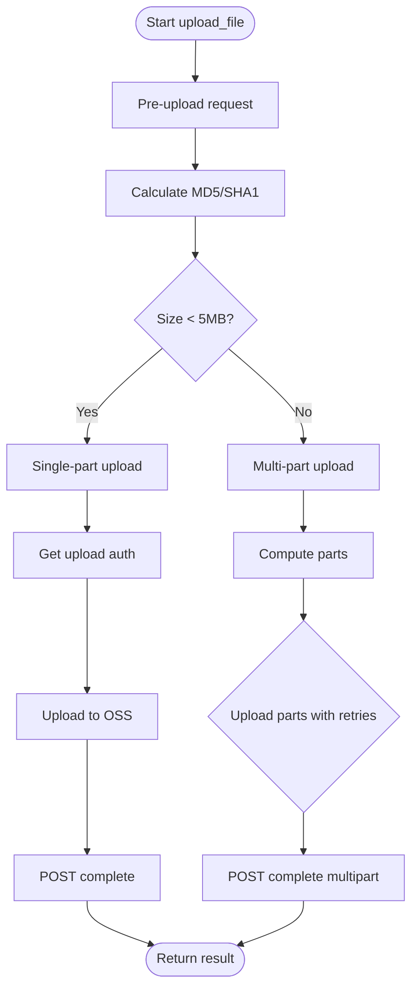
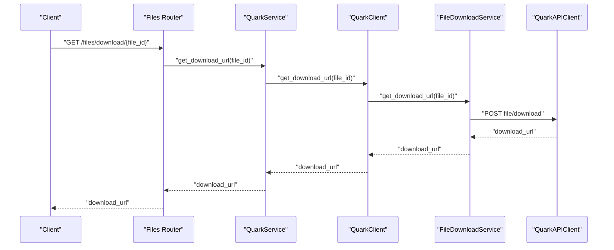
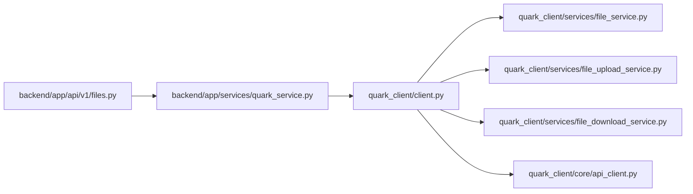

# File Operations

<cite>
**Referenced Files in This Document**
- [backend/app/api/v1/files.py](file://backend/app/api/v1/files.py)
- [backend/app/schemas/files.py](file://backend/app/schemas/files.py)
- [backend/app/api/v1/router.py](file://backend/app/api/v1/router.py)
- [backend/app/services/quark_service.py](file://backend/app/services/quark_service.py)
- [quark_client/services/file_service.py](file://quark_client/services/file_service.py)
- [quark_client/services/file_upload_service.py](file://quark_client/services/file_upload_service.py)
- [quark_client/services/file_download_service.py](file://quark_client/services/file_download_service.py)
- [quark_client/core/api_client.py](file://quark_client/core/api_client.py)
- [quark_client/client.py](file://quark_client/client.py)
- [backend/app/main.py](file://backend/app/main.py)
- [backend/app/core/config.py](file://backend/app/core/config.py)
</cite>

## Table of Contents
1. [Introduction](#introduction)
2. [Project Structure](#project-structure)
3. [Core Components](#core-components)
4. [Architecture Overview](#architecture-overview)
5. [Detailed Component Analysis](#detailed-component-analysis)
6. [Dependency Analysis](#dependency-analysis)
7. [Performance Considerations](#performance-considerations)
8. [Troubleshooting Guide](#troubleshooting-guide)
9. [Conclusion](#conclusion)
10. [Appendices](#appendices)

## Introduction
This document explains the file operations implementation across the backend API and the QuarkClient service integration. It covers all CRUD operations and bulk actions for files and folders, including create folder, delete, rename, and move. It also documents upload and download mechanisms with progress tracking, chunked transfers, and resume capabilities. The backend exposes endpoints under /api/v1/files for file management and /api/v1/files/download for downloads. The document outlines request/response schemas, validation, error handling, response formatting, and practical workflows for batch processing and concurrent operations. It also details authentication requirements and rate-limiting considerations.

## Project Structure
The file operations span two layers:
- Backend API (FastAPI): Defines routes, validates requests, and delegates to the QuarkService.
- QuarkClient service: Implements the actual cloud operations against the Quark Cloud Drive APIs.

**Diagram sources**
- [backend/app/main.py:12-28](file://backend/app/main.py#L12-L28)
- [backend/app/api/v1/router.py:6-23](file://backend/app/api/v1/router.py#L6-L23)
- [backend/app/api/v1/files.py:16-149](file://backend/app/api/v1/files.py#L16-L149)
- [backend/app/schemas/files.py:5-54](file://backend/app/schemas/files.py#L5-L54)
- [backend/app/services/quark_service.py:23-387](file://backend/app/services/quark_service.py#L23-L387)
- [quark_client/client.py:18-39](file://quark_client/client.py#L18-L39)
- [quark_client/services/file_service.py:13-248](file://quark_client/services/file_service.py#L13-L248)
- [quark_client/services/file_upload_service.py:16-148](file://quark_client/services/file_upload_service.py#L16-L148)
- [quark_client/services/file_download_service.py:13-301](file://quark_client/services/file_download_service.py#L13-L301)
- [quark_client/core/api_client.py:16-209](file://quark_client/core/api_client.py#L16-L209)

**Section sources**
- [backend/app/main.py:12-28](file://backend/app/main.py#L12-L28)
- [backend/app/api/v1/router.py:6-23](file://backend/app/api/v1/router.py#L6-L23)
- [backend/app/api/v1/files.py:16-149](file://backend/app/api/v1/files.py#L16-L149)
- [backend/app/schemas/files.py:5-54](file://backend/app/schemas/files.py#L5-L54)
- [backend/app/services/quark_service.py:23-387](file://backend/app/services/quark_service.py#L23-L387)
- [quark_client/client.py:18-39](file://quark_client/client.py#L18-L39)
- [quark_client/services/file_service.py:13-248](file://quark_client/services/file_service.py#L13-L248)
- [quark_client/services/file_upload_service.py:16-148](file://quark_client/services/file_upload_service.py#L16-L148)
- [quark_client/services/file_download_service.py:13-301](file://quark_client/services/file_download_service.py#L13-L301)
- [quark_client/core/api_client.py:16-209](file://quark_client/core/api_client.py#L16-L209)

## Core Components
- Backend API router for files:
  - GET /api/v1/files/list: Paginated file listing with folder scope.
  - POST /api/v1/files/folder: Create a folder.
  - DELETE /api/v1/files/delete: Delete files/folders by IDs.
  - PUT /api/v1/files/rename: Rename a file or folder.
  - POST /api/v1/files/move: Move files to a target folder.
  - GET /api/v1/files/search: Search files by keyword.
  - GET /api/v1/files/storage: Get storage capacity info.
  - GET /api/v1/files/download/{file_id}: Get a direct download URL.
- Request/response schemas:
  - FileListRequest/FileListResponse, CreateFolderRequest, DeleteFilesRequest, RenameFileRequest, MoveFilesRequest, SearchFilesRequest, StorageInfoResponse.
- QuarkService orchestrates operations via QuarkClient:
  - Validates login state and delegates to FileService, FileUploadService, FileDownloadService.
- QuarkClient services:
  - FileService: list_files, create_folder, delete_files, rename_file, move_files, search_files, get_storage_info, get_download_urls.
  - FileUploadService: upload_file with single/multi-part upload, chunked transfer, retries, and completion.
  - FileDownloadService: get_download_url, download_file(s) with chunked stream and progress callbacks.

**Section sources**
- [backend/app/api/v1/files.py:19-149](file://backend/app/api/v1/files.py#L19-L149)
- [backend/app/schemas/files.py:5-54](file://backend/app/schemas/files.py#L5-L54)
- [backend/app/services/quark_service.py:225-384](file://backend/app/services/quark_service.py#L225-L384)
- [quark_client/services/file_service.py:25-427](file://quark_client/services/file_service.py#L25-L427)
- [quark_client/services/file_upload_service.py:28-148](file://quark_client/services/file_upload_service.py#L28-L148)
- [quark_client/services/file_download_service.py:25-301](file://quark_client/services/file_download_service.py#L25-L301)

## Architecture Overview
The backend FastAPI app registers routers and forwards requests to QuarkService, which manages a QuarkClient instance. The QuarkClient composes services that communicate with the Quark Cloud Drive APIs via QuarkAPIClient.

**Diagram sources**
- [backend/app/api/v1/files.py:19-149](file://backend/app/api/v1/files.py#L19-L149)
- [backend/app/services/quark_service.py:225-384](file://backend/app/services/quark_service.py#L225-L384)
- [quark_client/client.py:18-39](file://quark_client/client.py#L18-L39)
- [quark_client/services/file_service.py:25-427](file://quark_client/services/file_service.py#L25-L427)
- [quark_client/services/file_upload_service.py:28-148](file://quark_client/services/file_upload_service.py#L28-L148)
- [quark_client/services/file_download_service.py:25-301](file://quark_client/services/file_download_service.py#L25-L301)
- [quark_client/core/api_client.py:80-183](file://quark_client/core/api_client.py#L80-L183)

## Detailed Component Analysis

### Backend API Endpoints and Schemas
- Endpoints:
  - GET /api/v1/files/list: Query parameters folder_id, page, size.
  - POST /api/v1/files/folder: Body CreateFolderRequest.
  - DELETE /api/v1/files/delete: Body DeleteFilesRequest.
  - PUT /api/v1/files/rename: Body RenameFileRequest.
  - POST /api/v1/files/move: Body MoveFilesRequest.
  - GET /api/v1/files/search: Query keyword, page, size.
  - GET /api/v1/files/storage: No body.
  - GET /api/v1/files/download/{file_id}: Path parameter file_id.
- Response model:
  - FileListResponse and StorageInfoResponse wrap success, data, message.
- Validation:
  - Pydantic models enforce field presence and ranges (e.g., page and size constraints).
- Error handling:
  - On failure, HTTPException is raised with 400 status and message.

**Diagram sources**
- [backend/app/api/v1/files.py:19-149](file://backend/app/api/v1/files.py#L19-L149)
- [backend/app/schemas/files.py:5-54](file://backend/app/schemas/files.py#L5-L54)

**Section sources**
- [backend/app/api/v1/files.py:19-149](file://backend/app/api/v1/files.py#L19-L149)
- [backend/app/schemas/files.py:5-54](file://backend/app/schemas/files.py#L5-L54)

### QuarkService Orchestration
- Maintains a singleton QuarkClient instance and login state.
- Delegates file operations to QuarkClient methods.
- Returns unified success/message/data responses for the API.

**Diagram sources**
- [backend/app/services/quark_service.py:23-387](file://backend/app/services/quark_service.py#L23-L387)
- [quark_client/client.py:18-39](file://quark_client/client.py#L18-L39)

**Section sources**
- [backend/app/services/quark_service.py:225-384](file://backend/app/services/quark_service.py#L225-L384)
- [quark_client/client.py:18-39](file://quark_client/client.py#L18-L39)

### File CRUD Operations

#### Create Folder
- Endpoint: POST /api/v1/files/folder
- Request: CreateFolderRequest (folder_name, parent_id)
- Implementation:
  - QuarkService.create_folder delegates to QuarkClient.create_folder.
  - QuarkClient calls FileService.create_folder, which posts to the cloud API endpoint with pr/fr/uc_param_str parameters.
- Response: FileListResponse with success/data/message.

**Diagram sources**
- [backend/app/api/v1/files.py:38-53](file://backend/app/api/v1/files.py#L38-L53)
- [backend/app/services/quark_service.py:255-269](file://backend/app/services/quark_service.py#L255-L269)
- [quark_client/client.py:158-160](file://quark_client/client.py#L158-L160)
- [quark_client/services/file_service.py:103-129](file://quark_client/services/file_service.py#L103-L129)
- [quark_client/core/api_client.py:184-190](file://quark_client/core/api_client.py#L184-L190)

**Section sources**
- [backend/app/api/v1/files.py:38-53](file://backend/app/api/v1/files.py#L38-L53)
- [backend/app/services/quark_service.py:255-269](file://backend/app/services/quark_service.py#L255-L269)
- [quark_client/client.py:158-160](file://quark_client/client.py#L158-L160)
- [quark_client/services/file_service.py:103-129](file://quark_client/services/file_service.py#L103-L129)

#### Delete Files/Folders
- Endpoint: DELETE /api/v1/files/delete
- Request: DeleteFilesRequest (file_ids: List[str])
- Implementation:
  - QuarkService.delete_files → QuarkClient.delete_files → FileService.delete_files → POST file/delete.
- Response: FileListResponse.

**Section sources**
- [backend/app/api/v1/files.py:56-68](file://backend/app/api/v1/files.py#L56-L68)
- [backend/app/services/quark_service.py:271-285](file://backend/app/services/quark_service.py#L271-L285)
- [quark_client/client.py:162-164](file://quark_client/client.py#L162-L164)
- [quark_client/services/file_service.py:131-155](file://quark_client/services/file_service.py#L131-L155)

#### Rename File/Folder
- Endpoint: PUT /api/v1/files/rename
- Request: RenameFileRequest (file_id, new_name)
- Implementation:
  - QuarkService.rename_file → QuarkClient.rename_file → FileService.rename_file → POST file/rename.
- Response: FileListResponse.

**Section sources**
- [backend/app/api/v1/files.py:71-86](file://backend/app/api/v1/files.py#L71-L86)
- [backend/app/services/quark_service.py:287-301](file://backend/app/services/quark_service.py#L287-L301)
- [quark_client/client.py:166-168](file://quark_client/client.py#L166-L168)
- [quark_client/services/file_service.py:157-181](file://quark_client/services/file_service.py#L157-L181)

#### Move Files
- Endpoint: POST /api/v1/files/move
- Request: MoveFilesRequest (file_ids: List[str], target_folder_id)
- Implementation:
  - QuarkService.move_files → QuarkClient.move_files → FileService.move_files → POST file/move.
  - If task_id returned, FileService waits for task completion with polling and configurable intervals.
- Response: FileListResponse.

**Diagram sources**
- [backend/app/api/v1/files.py:89-104](file://backend/app/api/v1/files.py#L89-L104)
- [backend/app/services/quark_service.py:303-317](file://backend/app/services/quark_service.py#L303-L317)
- [quark_client/client.py:370-387](file://quark_client/client.py#L370-L387)
- [quark_client/services/file_service.py:386-472](file://quark_client/services/file_service.py#L386-L472)
- [quark_client/core/api_client.py:184-190](file://quark_client/core/api_client.py#L184-L190)

**Section sources**
- [backend/app/api/v1/files.py:89-104](file://backend/app/api/v1/files.py#L89-L104)
- [backend/app/services/quark_service.py:303-317](file://backend/app/services/quark_service.py#L303-L317)
- [quark_client/client.py:370-387](file://quark_client/client.py#L370-L387)
- [quark_client/services/file_service.py:386-472](file://quark_client/services/file_service.py#L386-L472)

### File Upload Mechanisms
- Entry point: QuarkClient.upload_file delegates to FileUploadService.upload_file.
- Steps:
  - Pre-upload: POST file/upload/pre with metadata (name, size, MIME, timestamps).
  - Update hashes: POST update hash info.
  - Single-part (< 5MB) or Multi-part (≥ 5MB) upload:
    - Single-part: Get upload auth, upload to OSS, POST complete.
    - Multi-part: Calculate parts, per-part auth, upload with retries, POST complete.
  - Finish: Complete upload process.
- Progress tracking:
  - FileUploadService accepts progress_callback and reports stages (hashing, pre-upload, parts, completion).
- Chunked transfers and resume:
  - Multi-part upload supports resumable uploads via upload_id and partNumber. Retries use exponential backoff.

**Diagram sources**
- [quark_client/services/file_upload_service.py:28-148](file://quark_client/services/file_upload_service.py#L28-L148)
- [quark_client/services/file_upload_service.py:214-469](file://quark_client/services/file_upload_service.py#L214-L469)

**Section sources**
- [quark_client/client.py:274-291](file://quark_client/client.py#L274-L291)
- [quark_client/services/file_upload_service.py:28-148](file://quark_client/services/file_upload_service.py#L28-L148)
- [quark_client/services/file_upload_service.py:214-469](file://quark_client/services/file_upload_service.py#L214-L469)

### File Download Mechanisms
- Endpoint: GET /api/v1/files/download/{file_id}
- Implementation:
  - QuarkService.get_download_url → QuarkClient.get_download_url → FileDownloadService.get_download_url.
  - FileDownloadService.get_download_url posts to file/download and extracts download_url.
- Bulk download:
  - FileDownloadService.download_files iterates file_ids and invokes download_file with progress callbacks.
- Chunked transfers:
  - Uses streaming with chunk_size and iter_bytes to write incrementally.
- Resume:
  - Not implemented in the current download flow; relies on server-side signed URLs.

**Diagram sources**
- [backend/app/api/v1/files.py:141-149](file://backend/app/api/v1/files.py#L141-L149)
- [backend/app/services/quark_service.py:364-383](file://backend/app/services/quark_service.py#L364-L383)
- [quark_client/client.py:88-90](file://quark_client/client.py#L88-L90)
- [quark_client/services/file_download_service.py:25-62](file://quark_client/services/file_download_service.py#L25-62)
- [quark_client/core/api_client.py:184-190](file://quark_client/core/api_client.py#L184-L190)

**Section sources**
- [backend/app/api/v1/files.py:141-149](file://backend/app/api/v1/files.py#L141-L149)
- [backend/app/services/quark_service.py:364-383](file://backend/app/services/quark_service.py#L364-L383)
- [quark_client/client.py:88-90](file://quark_client/client.py#L88-L90)
- [quark_client/services/file_download_service.py:25-62](file://quark_client/services/file_download_service.py#L25-L62)
- [quark_client/services/file_download_service.py:97-301](file://quark_client/services/file_download_service.py#L97-L301)

### Practical Workflows and Batch Processing
- Batch delete:
  - Client sends DELETE /api/v1/files/delete with DeleteFilesRequest containing multiple file_ids.
  - Backend calls QuarkService.delete_files which delegates to FileService.delete_files.
- Batch move:
  - Client sends POST /api/v1/files/move with MoveFilesRequest including file_ids and target_folder_id.
  - FileService.move_files handles asynchronous task completion via polling.
- Concurrent operations:
  - The backend FastAPI app is async; however, individual operations are synchronous at the cloud API level.
  - For concurrency, clients should issue parallel requests and handle task polling separately.

**Section sources**
- [backend/app/api/v1/files.py:56-68](file://backend/app/api/v1/files.py#L56-L68)
- [backend/app/api/v1/files.py:89-104](file://backend/app/api/v1/files.py#L89-L104)
- [quark_client/services/file_service.py:131-155](file://quark_client/services/file_service.py#L131-L155)
- [quark_client/services/file_service.py:386-472](file://quark_client/services/file_service.py#L386-L472)

### Authentication and Rate Limiting
- Authentication:
  - The backend uses QuarkService to manage login state and cookies.
  - QuarkAPIClient sets default headers and attaches cookies for authenticated requests.
  - The API does not implement JWT tokens; authentication relies on session cookies.
- Rate limiting:
  - The QuarkAPIClient raises AuthenticationError on 401/403 and APIError on HTTP errors.
  - There is no explicit rate-limiting logic in the code; clients should implement backoff and retry policies around API calls.

**Section sources**
- [backend/app/services/quark_service.py:48-52](file://backend/app/services/quark_service.py#L48-L52)
- [quark_client/core/api_client.py:146-182](file://quark_client/core/api_client.py#L146-L182)
- [quark_client/core/api_client.py:21-38](file://quark_client/core/api_client.py#L21-L38)

## Dependency Analysis
- Backend depends on:
  - FastAPI routing and schemas.
  - QuarkService for orchestration.
- QuarkService depends on:
  - QuarkClient for cloud operations.
- QuarkClient depends on:
  - FileService, FileUploadService, FileDownloadService.
  - QuarkAPIClient for HTTP transport.

**Diagram sources**
- [backend/app/api/v1/files.py:16-149](file://backend/app/api/v1/files.py#L16-L149)
- [backend/app/services/quark_service.py:23-387](file://backend/app/services/quark_service.py#L23-L387)
- [quark_client/client.py:18-39](file://quark_client/client.py#L18-L39)
- [quark_client/services/file_service.py:13-248](file://quark_client/services/file_service.py#L13-L248)
- [quark_client/services/file_upload_service.py:16-148](file://quark_client/services/file_upload_service.py#L16-L148)
- [quark_client/services/file_download_service.py:13-301](file://quark_client/services/file_download_service.py#L13-L301)
- [quark_client/core/api_client.py:16-209](file://quark_client/core/api_client.py#L16-L209)

**Section sources**
- [backend/app/api/v1/files.py:16-149](file://backend/app/api/v1/files.py#L16-L149)
- [backend/app/services/quark_service.py:23-387](file://backend/app/services/quark_service.py#L23-L387)
- [quark_client/client.py:18-39](file://quark_client/client.py#L18-L39)
- [quark_client/core/api_client.py:16-209](file://quark_client/core/api_client.py#L16-L209)

## Performance Considerations
- Pagination:
  - Use page and size parameters to limit response sizes for list/search operations.
- Asynchronous tasks:
  - Move operations may return a task_id; poll with appropriate intervals to avoid excessive load.
- Upload strategy:
  - Multi-part upload reduces memory footprint and improves reliability for large files.
- Download streaming:
  - Use chunked downloads to minimize memory usage during large file retrieval.
- Concurrency:
  - Issue parallel requests judiciously; implement client-side backoff and retry to respect server constraints.

## Troubleshooting Guide
- Authentication failures:
  - 401/403 responses trigger AuthenticationError; re-authenticate via QuarkService login methods.
- API errors:
  - Non-200 HTTP status or non-zero API code triggers APIError; inspect message for details.
- Task completion:
  - For move operations, ensure task polling completes; timeouts or failures should be retried with backoff.
- Download issues:
  - If download fails with 403, the signed URL may require specific headers; ensure cookies and referer are set.

**Section sources**
- [quark_client/core/api_client.py:146-182](file://quark_client/core/api_client.py#L146-L182)
- [quark_client/services/file_service.py:428-472](file://quark_client/services/file_service.py#L428-L472)
- [quark_client/services/file_download_service.py:186-257](file://quark_client/services/file_download_service.py#L186-L257)

## Conclusion
The file operations are implemented consistently across the backend API and QuarkClient services. CRUD operations (create, delete, rename, move) and bulk actions leverage QuarkClient’s typed services and QuarkAPIClient’s robust HTTP handling. Uploads support chunked transfers and multi-part resumable uploads, while downloads stream data efficiently. Authentication relies on session cookies, and error handling is standardized. Clients should implement appropriate backoff and concurrency controls to respect server constraints.

## Appendices

### API Definitions and Schemas

- GET /api/v1/files/list
  - Query: folder_id (default "0"), page (default 1), size (default 50, min 1, max 200)
  - Response: FileListResponse(success, data, message)

- POST /api/v1/files/folder
  - Body: CreateFolderRequest(folder_name, parent_id default "0")
  - Response: FileListResponse(success, data, message)

- DELETE /api/v1/files/delete
  - Body: DeleteFilesRequest(file_ids: List[str])
  - Response: FileListResponse(success, data, message)

- PUT /api/v1/files/rename
  - Body: RenameFileRequest(file_id, new_name)
  - Response: FileListResponse(success, data, message)

- POST /api/v1/files/move
  - Body: MoveFilesRequest(file_ids: List[str], target_folder_id)
  - Response: FileListResponse(success, data, message)

- GET /api/v1/files/search
  - Query: keyword (required), page (default 1), size (default 50, min 1, max 200)
  - Response: FileListResponse(success, data, message)

- GET /api/v1/files/storage
  - Response: StorageInfoResponse(success, data, message)

- GET /api/v1/files/download/{file_id}
  - Path: file_id
  - Response: Dictionary containing download_url

**Section sources**
- [backend/app/api/v1/files.py:19-149](file://backend/app/api/v1/files.py#L19-L149)
- [backend/app/schemas/files.py:5-54](file://backend/app/schemas/files.py#L5-L54)