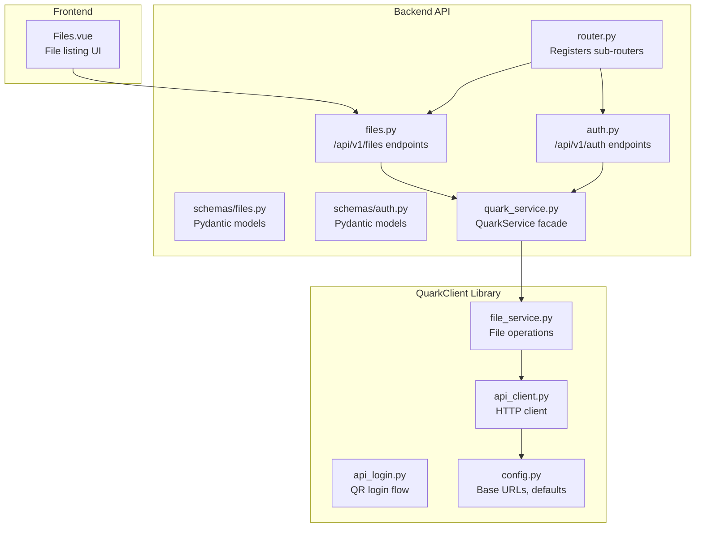
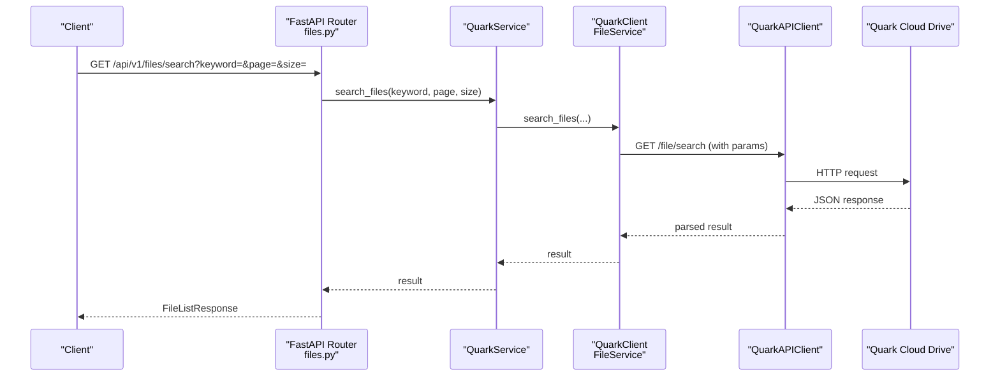
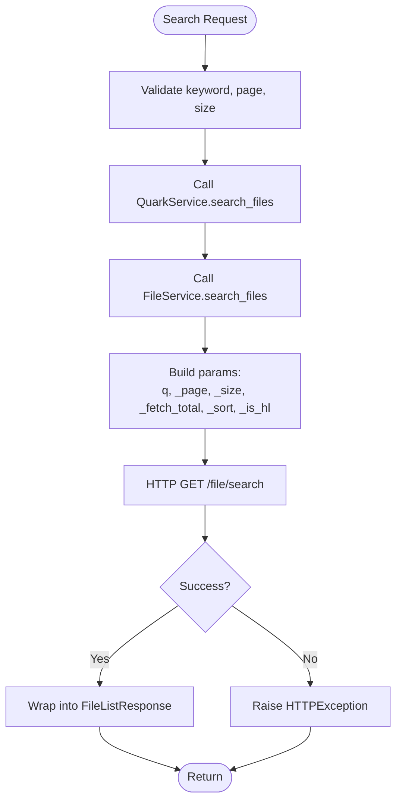
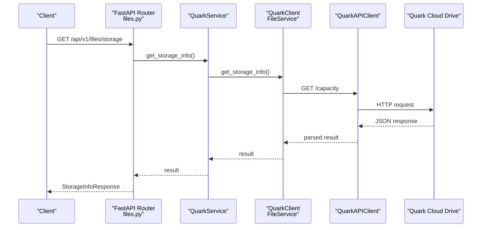
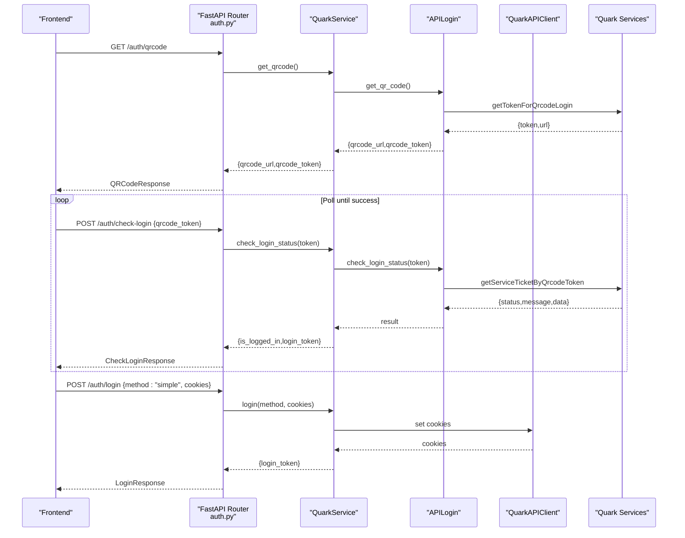
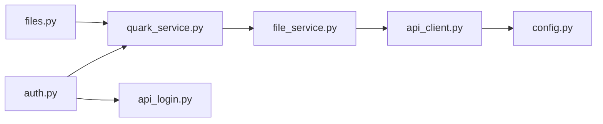

# Search and Storage Management

<cite>
**Referenced Files in This Document**
- [files.py](file://backend/app/api/v1/files.py)
- [router.py](file://backend/app/api/v1/router.py)
- [auth.py](file://backend/app/api/v1/auth.py)
- [schemas/files.py](file://backend/app/schemas/files.py)
- [schemas/auth.py](file://backend/app/schemas/auth.py)
- [quark_service.py](file://backend/app/services/quark_service.py)
- [api_client.py](file://quark_client/core/api_client.py)
- [api_login.py](file://quark_client/auth/api_login.py)
- [file_service.py](file://quark_client/services/file_service.py)
- [config.py](file://quark_client/config.py)
- [Files.vue](file://frontend/src/views/Files.vue)
</cite>

## Table of Contents
1. [Introduction](#introduction)
2. [Project Structure](#project-structure)
3. [Core Components](#core-components)
4. [Architecture Overview](#architecture-overview)
5. [Detailed Component Analysis](#detailed-component-analysis)
6. [Dependency Analysis](#dependency-analysis)
7. [Performance Considerations](#performance-considerations)
8. [Troubleshooting Guide](#troubleshooting-guide)
9. [Conclusion](#conclusion)

## Introduction
This document explains the file search and storage management capabilities implemented in the backend and integrated with the QuarkClient services. It covers:
- Keyword-based file search with pagination and result filtering
- Storage information retrieval including capacity monitoring and usage statistics
- API endpoints for search and storage
- Practical workflows, performance considerations, and integration with authentication

## Project Structure
The relevant components are organized across backend FastAPI routes, schemas, and services, and integrate with the QuarkClient library for interacting with the Quark Cloud Drive APIs.

**Diagram sources**
- [router.py:1-24](file://backend/app/api/v1/router.py#L1-L24)
- [files.py:1-150](file://backend/app/api/v1/files.py#L1-L150)
- [auth.py:1-107](file://backend/app/api/v1/auth.py#L1-L107)
- [schemas/files.py:1-54](file://backend/app/schemas/files.py#L1-L54)
- [schemas/auth.py:1-50](file://backend/app/schemas/auth.py#L1-L50)
- [quark_service.py:1-388](file://backend/app/services/quark_service.py#L1-L388)
- [api_client.py:1-209](file://quark_client/core/api_client.py#L1-L209)
- [api_login.py:1-521](file://quark_client/auth/api_login.py#L1-L521)
- [file_service.py:1-800](file://quark_client/services/file_service.py#L1-L800)
- [config.py:1-63](file://quark_client/config.py#L1-L63)
- [Files.vue:1-264](file://frontend/src/views/Files.vue#L1-L264)

**Section sources**
- [router.py:1-24](file://backend/app/api/v1/router.py#L1-L24)
- [files.py:1-150](file://backend/app/api/v1/files.py#L1-L150)
- [auth.py:1-107](file://backend/app/api/v1/auth.py#L1-L107)
- [schemas/files.py:1-54](file://backend/app/schemas/files.py#L1-L54)
- [schemas/auth.py:1-50](file://backend/app/schemas/auth.py#L1-L50)
- [quark_service.py:1-388](file://backend/app/services/quark_service.py#L1-L388)
- [api_client.py:1-209](file://quark_client/core/api_client.py#L1-L209)
- [api_login.py:1-521](file://quark_client/auth/api_login.py#L1-L521)
- [file_service.py:1-800](file://quark_client/services/file_service.py#L1-L800)
- [config.py:1-63](file://quark_client/config.py#L1-L63)
- [Files.vue:1-264](file://frontend/src/views/Files.vue#L1-L264)

## Core Components
- Search endpoint: GET /api/v1/files/search
- Storage info endpoint: GET /api/v1/files/storage
- Authentication endpoints: GET /api/v1/auth/qrcode, POST /api/v1/auth/check-login, POST /api/v1/auth/login, GET /api/v1/auth/status, POST /api/v1/auth/logout

Key implementation highlights:
- Pagination: page and size parameters are validated and forwarded to the underlying service.
- Filtering: advanced search supports client-side filtering by extension and size range.
- Storage info: returns capacity and usage metrics via the QuarkClient capacity endpoint.
- Authentication: QR-based login flow with polling and cookie-based session management.

**Section sources**
- [files.py:107-139](file://backend/app/api/v1/files.py#L107-L139)
- [auth.py:18-107](file://backend/app/api/v1/auth.py#L18-L107)
- [quark_service.py:319-362](file://backend/app/services/quark_service.py#L319-L362)
- [file_service.py:183-219](file://quark_client/services/file_service.py#L183-L219)
- [file_service.py:240-248](file://quark_client/services/file_service.py#L240-L248)

## Architecture Overview
The backend FastAPI routers delegate requests to the QuarkService, which encapsulates QuarkClient interactions. The QuarkClient uses a typed HTTP client to call Quark Cloud Drive endpoints, applying default headers and parameters.

**Diagram sources**
- [files.py:107-123](file://backend/app/api/v1/files.py#L107-L123)
- [quark_service.py:319-340](file://backend/app/services/quark_service.py#L319-L340)
- [file_service.py:183-219](file://quark_client/services/file_service.py#L183-L219)
- [api_client.py:184-190](file://quark_client/core/api_client.py#L184-L190)

## Detailed Component Analysis

### Search Implementation
- Endpoint: GET /api/v1/files/search
- Request parameters:
  - keyword: string (required)
  - page: integer ≥ 1 (default 1)
  - size: integer between 1 and 200 (default 50)
- Response model: FileListResponse (success, data, message)
- Backend flow:
  - Validates query parameters
  - Calls QuarkService.search_files
  - Wraps result into FileListResponse
- Underlying service:
  - QuarkClient FileService.search_files forwards to Quark Cloud Drive /file/search with:
    - q: keyword
    - _page, _size
    - _fetch_total: 1
    - _sort: configured sorting
    - _is_hl: 1 (highlighting)
  - Note: folder_id parameter is accepted but not used by the underlying API per implementation comments.

Advanced filtering (client-side):
- QuarkClient FileService.search_files_advanced supports:
  - file_extensions filter
  - min_size and max_size filters
  - Larger initial fetch (size × 3) to enable client-side pagination after filtering

**Diagram sources**
- [files.py:107-123](file://backend/app/api/v1/files.py#L107-L123)
- [quark_service.py:319-340](file://backend/app/services/quark_service.py#L319-L340)
- [file_service.py:183-219](file://quark_client/services/file_service.py#L183-L219)

**Section sources**
- [files.py:107-123](file://backend/app/api/v1/files.py#L107-L123)
- [schemas/files.py:42-47](file://backend/app/schemas/files.py#L42-L47)
- [quark_service.py:319-340](file://backend/app/services/quark_service.py#L319-L340)
- [file_service.py:183-219](file://quark_client/services/file_service.py#L183-L219)
- [file_service.py:295-366](file://quark_client/services/file_service.py#L295-L366)

### Storage Information Retrieval
- Endpoint: GET /api/v1/files/storage
- Response model: StorageInfoResponse (success, data, message)
- Backend flow:
  - Calls QuarkService.get_storage_info
  - Wraps result into StorageInfoResponse
- Underlying service:
  - QuarkClient FileService.get_storage_info calls Quark Cloud Drive /capacity
  - Returns capacity and usage data

**Diagram sources**
- [files.py:126-138](file://backend/app/api/v1/files.py#L126-L138)
- [quark_service.py:342-362](file://backend/app/services/quark_service.py#L342-L362)
- [file_service.py:240-248](file://quark_client/services/file_service.py#L240-L248)
- [api_client.py:184-190](file://quark_client/core/api_client.py#L184-L190)

**Section sources**
- [files.py:126-138](file://backend/app/api/v1/files.py#L126-L138)
- [schemas/files.py:49-54](file://backend/app/schemas/files.py#L49-L54)
- [quark_service.py:342-362](file://backend/app/services/quark_service.py#L342-L362)
- [file_service.py:240-248](file://quark_client/services/file_service.py#L240-L248)

### Authentication and Session Management
- QR login flow:
  - GET /api/v1/auth/qrcode returns qrcode_url and qrcode_token
  - POST /api/v1/auth/check-login polls login status using qrcode_token
  - On success, cookies are extracted and stored for subsequent API calls
- Alternative login methods:
  - POST /api/v1/auth/login supports method "api" (QR) and "simple" (Cookie)
- Status and logout:
  - GET /api/v1/auth/status checks current login state
  - POST /api/v1/auth/logout clears session

**Diagram sources**
- [auth.py:18-107](file://backend/app/api/v1/auth.py#L18-L107)
- [quark_service.py:54-159](file://backend/app/services/quark_service.py#L54-L159)
- [api_login.py:94-521](file://quark_client/auth/api_login.py#L94-L521)
- [api_client.py:184-190](file://quark_client/core/api_client.py#L184-L190)

**Section sources**
- [auth.py:18-107](file://backend/app/api/v1/auth.py#L18-L107)
- [quark_service.py:54-159](file://backend/app/services/quark_service.py#L54-L159)
- [api_login.py:94-521](file://quark_client/auth/api_login.py#L94-L521)
- [api_client.py:184-190](file://quark_client/core/api_client.py#L184-L190)

### API Endpoints and Schemas

- GET /api/v1/files/search
  - Query parameters:
    - keyword: string (required)
    - page: integer ≥ 1 (default 1)
    - size: integer between 1 and 200 (default 50)
  - Response: FileListResponse
  - Notes: Sorting and highlighting are applied by the underlying service.

- GET /api/v1/files/storage
  - No parameters
  - Response: StorageInfoResponse
  - Data typically includes total capacity and used space.

- Authentication endpoints overview:
  - GET /api/v1/auth/qrcode → QRCodeResponse
  - POST /api/v1/auth/check-login → CheckLoginResponse
  - POST /api/v1/auth/login → LoginResponse
  - GET /api/v1/auth/status → AuthStatusResponse
  - POST /api/v1/auth/logout → LogoutResponse

Request/response schemas are defined in the backend schemas module and used by the routers.

**Section sources**
- [files.py:107-139](file://backend/app/api/v1/files.py#L107-L139)
- [schemas/files.py:42-54](file://backend/app/schemas/files.py#L42-L54)
- [schemas/auth.py:5-50](file://backend/app/schemas/auth.py#L5-L50)
- [auth.py:18-107](file://backend/app/api/v1/auth.py#L18-L107)

## Dependency Analysis
- Backend routers depend on QuarkService for business logic.
- QuarkService depends on QuarkClient (via create_client) and FileService for cloud operations.
- FileService depends on QuarkAPIClient for HTTP communication.
- QuarkAPIClient applies default headers and parameters from Config and handles errors.

**Diagram sources**
- [files.py:1-150](file://backend/app/api/v1/files.py#L1-L150)
- [auth.py:1-107](file://backend/app/api/v1/auth.py#L1-L107)
- [quark_service.py:1-388](file://backend/app/services/quark_service.py#L1-L388)
- [file_service.py:1-800](file://quark_client/services/file_service.py#L1-L800)
- [api_client.py:1-209](file://quark_client/core/api_client.py#L1-L209)
- [config.py:1-63](file://quark_client/config.py#L1-L63)
- [api_login.py:1-521](file://quark_client/auth/api_login.py#L1-L521)

**Section sources**
- [files.py:1-150](file://backend/app/api/v1/files.py#L1-L150)
- [auth.py:1-107](file://backend/app/api/v1/auth.py#L1-L107)
- [quark_service.py:1-388](file://backend/app/services/quark_service.py#L1-L388)
- [file_service.py:1-800](file://quark_client/services/file_service.py#L1-L800)
- [api_client.py:1-209](file://quark_client/core/api_client.py#L1-L209)
- [config.py:1-63](file://quark_client/config.py#L1-L63)
- [api_login.py:1-521](file://quark_client/auth/api_login.py#L1-L521)

## Performance Considerations
- Pagination limits:
  - size is constrained to a maximum of 200 in the backend route, reducing payload sizes.
  - The advanced search increases the initial fetch size to support client-side filtering; tune size and fetch_total accordingly.
- Client-side filtering:
  - search_files_advanced retrieves more results and filters locally; consider increasing size multiplier for large result sets.
- Network timeouts:
  - HTTP client uses a configurable timeout; adjust for large downloads or slow networks.
- Sorting and highlighting:
  - Sorting and highlighting parameters are passed to the cloud API; keep sort fields reasonable to avoid heavy server workloads.

[No sources needed since this section provides general guidance]

## Troubleshooting Guide
Common issues and resolutions:
- Authentication failures:
  - 401/403 responses indicate expired or missing cookies; trigger QR login again.
  - Use GET /api/v1/auth/status to verify login state.
- Search yields no results:
  - Verify keyword spelling and consider enabling advanced filters (extensions, size).
  - The underlying API may not support folder-scoped search; search globally.
- Storage info unavailable:
  - Ensure the user is logged in; the service returns an error if not authenticated.
- Network errors:
  - Check request timeouts and retry logic; the HTTP client raises network-related exceptions.

**Section sources**
- [api_client.py:146-182](file://quark_client/core/api_client.py#L146-L182)
- [quark_service.py:342-362](file://backend/app/services/quark_service.py#L342-L362)
- [auth.py:78-95](file://backend/app/api/v1/auth.py#L78-L95)

## Conclusion
The system provides robust file search and storage management through a clean FastAPI interface backed by QuarkClient. Search supports pagination and advanced client-side filtering, while storage info retrieval exposes capacity and usage metrics. Authentication is handled via QR login with polling and cookie-based sessions. For large file collections, tune pagination and filtering parameters to balance responsiveness and accuracy.