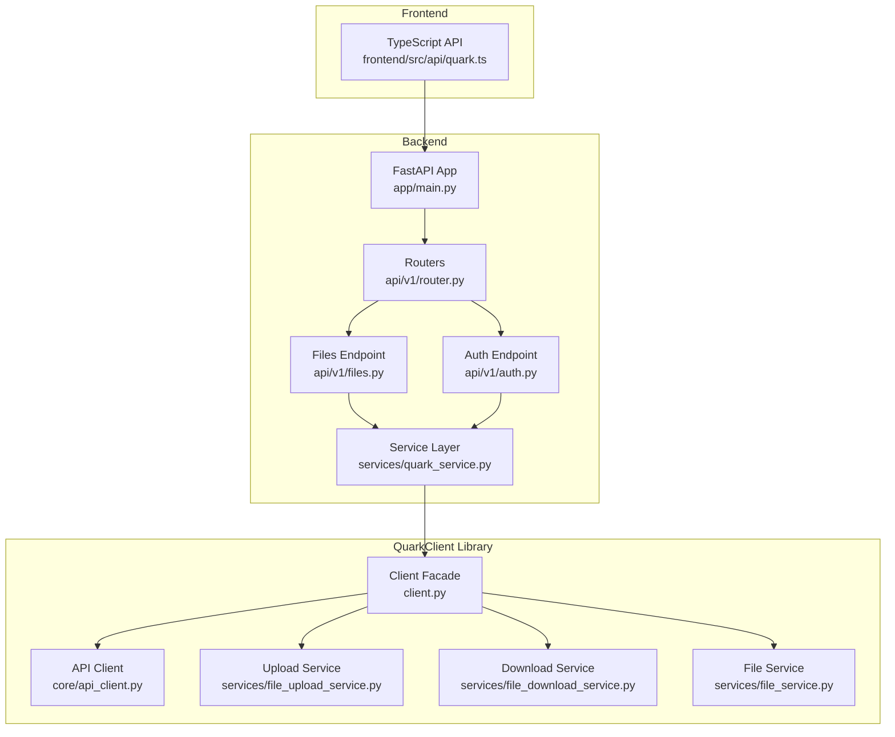
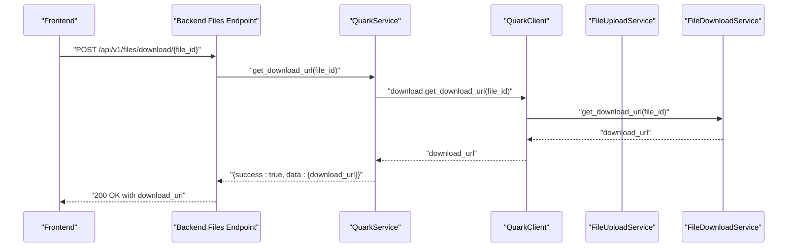
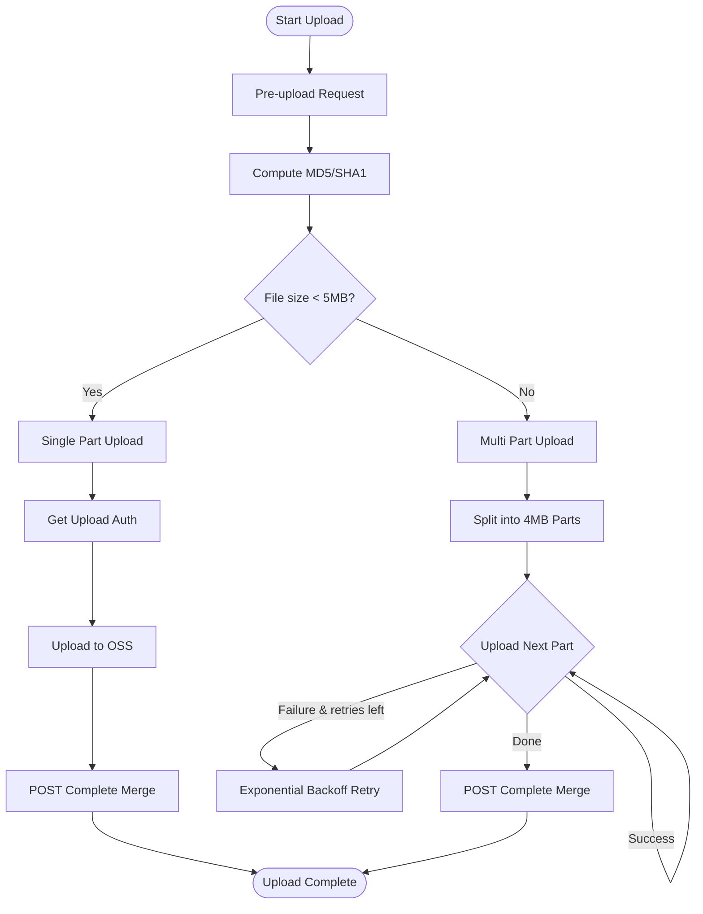
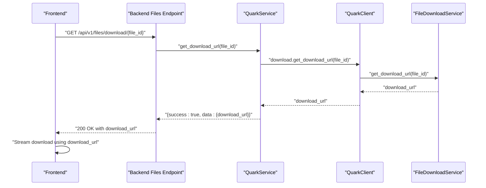
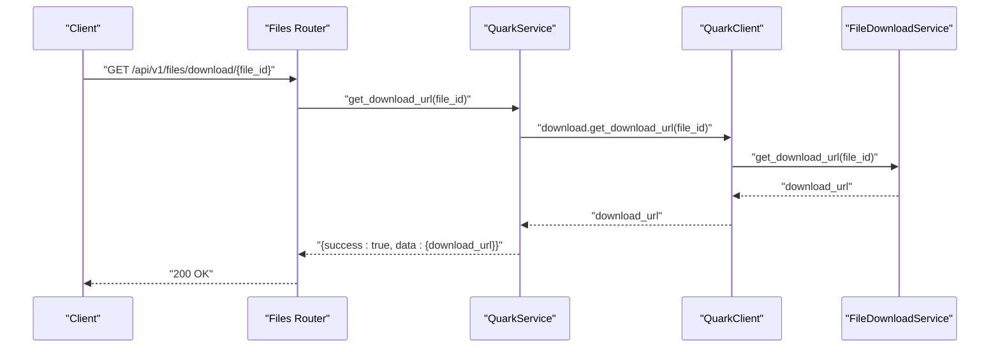
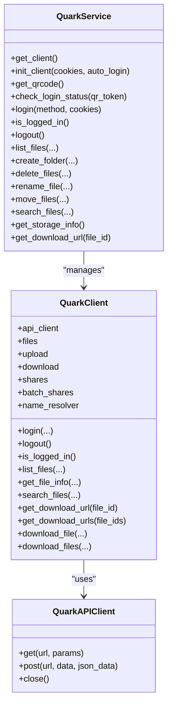
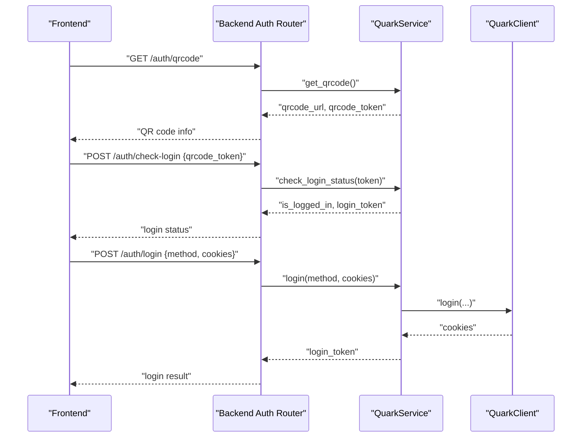
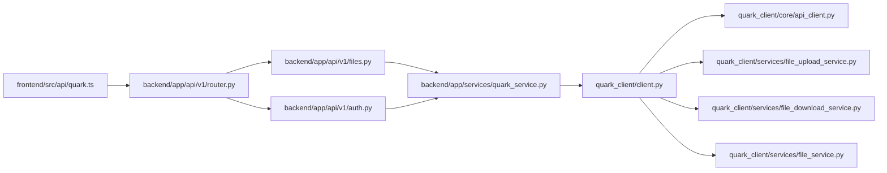

# Upload and Download

<cite>
**Referenced Files in This Document**
- [backend/app/api/v1/files.py](file://backend/app/api/v1/files.py)
- [backend/app/api/v1/auth.py](file://backend/app/api/v1/auth.py)
- [backend/app/services/quark_service.py](file://backend/app/services/quark_service.py)
- [quark_client/client.py](file://quark_client/client.py)
- [quark_client/core/api_client.py](file://quark_client/core/api_client.py)
- [quark_client/services/file_upload_service.py](file://quark_client/services/file_upload_service.py)
- [quark_client/services/file_download_service.py](file://quark_client/services/file_download_service.py)
- [quark_client/services/file_service.py](file://quark_client/services/file_service.py)
- [backend/app/schemas/files.py](file://backend/app/schemas/files.py)
- [backend/app/schemas/auth.py](file://backend/app/schemas/auth.py)
- [frontend/src/api/quark.ts](file://frontend/src/api/quark.ts)
- [backend/app/main.py](file://backend/app/main.py)
- [backend/app/api/v1/router.py](file://backend/app/api/v1/router.py)
- [quark_client/config.py](file://quark_client/config.py)
</cite>

## Table of Contents
1. [Introduction](#introduction)
2. [Project Structure](#project-structure)
3. [Core Components](#core-components)
4. [Architecture Overview](#architecture-overview)
5. [Detailed Component Analysis](#detailed-component-analysis)
6. [Dependency Analysis](#dependency-analysis)
7. [Performance Considerations](#performance-considerations)
8. [Troubleshooting Guide](#troubleshooting-guide)
9. [Conclusion](#conclusion)
10. [Appendices](#appendices)

## Introduction
This document explains the file upload and download mechanisms implemented in the project. It covers:
- Upload pipeline: single-part and multi-part uploads, chunked transfer, resume capability via task-based completion, and progress reporting.
- Download pipeline: direct URL retrieval and streaming with robust fallback strategies.
- Backend endpoint /api/v1/files/download and the underlying service architecture.
- Practical workflows, error handling for network interruptions, and performance optimization techniques.
- Integration with QuarkClient upload/download services, authentication requirements, and file size considerations.

## Project Structure
The system is split into:
- Backend API (FastAPI): exposes endpoints for file operations and delegates to a service layer.
- QuarkClient library: provides typed clients and services for interacting with the Quark Cloud Drive API.
- Frontend integration: TypeScript APIs that call the backend endpoints.

**Diagram sources**
- [backend/app/main.py:12-29](file://backend/app/main.py#L12-L29)
- [backend/app/api/v1/router.py:21-24](file://backend/app/api/v1/router.py#L21-L24)
- [backend/app/api/v1/files.py:16](file://backend/app/api/v1/files.py#L16)
- [backend/app/api/v1/auth.py:15](file://backend/app/api/v1/auth.py#L15)
- [backend/app/services/quark_service.py:23-388](file://backend/app/services/quark_service.py#L23-L388)
- [quark_client/client.py:18-405](file://quark_client/client.py#L18-L405)
- [quark_client/core/api_client.py:16-209](file://quark_client/core/api_client.py#L16-L209)
- [quark_client/services/file_upload_service.py:16-891](file://quark_client/services/file_upload_service.py#L16-L891)
- [quark_client/services/file_download_service.py:13-301](file://quark_client/services/file_download_service.py#L13-L301)
- [quark_client/services/file_service.py:13-893](file://quark_client/services/file_service.py#L13-L893)
- [frontend/src/api/quark.ts:55-124](file://frontend/src/api/quark.ts#L55-L124)

**Section sources**
- [backend/app/main.py:12-29](file://backend/app/main.py#L12-L29)
- [backend/app/api/v1/router.py:21-24](file://backend/app/api/v1/router.py#L21-L24)
- [frontend/src/api/quark.ts:55-124](file://frontend/src/api/quark.ts#L55-L124)

## Core Components
- Backend Files Endpoint: Implements GET /api/v1/files/download/{file_id} and other file management endpoints. It delegates to the service layer.
- QuarkService: Central orchestrator that initializes and manages the QuarkClient, performs authentication, and forwards requests to QuarkClient services.
- QuarkClient: High-level facade exposing file operations, upload, download, shares, and helpers.
- FileUploadService: Implements pre-upload, hash calculation, single/multi-part upload, and completion steps with progress callbacks.
- FileDownloadService: Retrieves download URLs and streams downloads with robust fallbacks and progress reporting.
- FileService: Provides file listing, search, metadata, and path resolution; also includes convenience methods for downloading files and folders.
- API Client: Encapsulates HTTP requests, authentication, and error handling.
- Frontend API: TypeScript wrappers around backend endpoints for authentication and file operations.

**Section sources**
- [backend/app/api/v1/files.py:141-149](file://backend/app/api/v1/files.py#L141-L149)
- [backend/app/services/quark_service.py:23-388](file://backend/app/services/quark_service.py#L23-L388)
- [quark_client/client.py:18-405](file://quark_client/client.py#L18-L405)
- [quark_client/services/file_upload_service.py:16-891](file://quark_client/services/file_upload_service.py#L16-L891)
- [quark_client/services/file_download_service.py:13-301](file://quark_client/services/file_download_service.py#L13-L301)
- [quark_client/services/file_service.py:13-893](file://quark_client/services/file_service.py#L13-L893)
- [quark_client/core/api_client.py:16-209](file://quark_client/core/api_client.py#L16-L209)
- [frontend/src/api/quark.ts:55-124](file://frontend/src/api/quark.ts#L55-L124)

## Architecture Overview
The upload/download architecture follows a layered design:
- Frontend calls backend endpoints.
- Backend routes delegate to QuarkService.
- QuarkService uses QuarkClient.
- QuarkClient uses QuarkAPIClient and specialized services (FileUploadService, FileDownloadService, FileService).
- FileUploadService handles chunked uploads with pre-upload, auth, and completion steps.
- FileDownloadService retrieves signed URLs and streams content with fallback strategies.

**Diagram sources**
- [backend/app/api/v1/files.py:141-149](file://backend/app/api/v1/files.py#L141-L149)
- [backend/app/services/quark_service.py:364-383](file://backend/app/services/quark_service.py#L364-L383)
- [quark_client/client.py:88-98](file://quark_client/client.py#L88-L102)
- [quark_client/services/file_download_service.py:25-62](file://quark_client/services/file_download_service.py#L25-L62)

## Detailed Component Analysis

### Upload Mechanism: Chunked Transfers, Resume, and Progress Tracking
- Pre-upload and task creation: Initiates upload preparation and receives task identifiers and authorization info.
- Hash calculation: Computes MD5/SHA1 incrementally during upload to support resume and integrity checks.
- Single-part vs multi-part:
  - Single-part (< 5 MB): Obtains upload authorization, uploads to OSS, and completes via POST merge.
  - Multi-part (≥ 5 MB): Splits file into 4 MB chunks, uploads each part with retry logic, and merges parts via POST completion.
- Retry and exponential backoff: Retries failed parts with capped delays.
- Completion and callback handling: Handles both successful and partially successful POST completion scenarios.
- Progress callbacks: Reports stages like hashing, pre-upload, part uploads, and finalization.

**Diagram sources**
- [quark_client/services/file_upload_service.py:28-148](file://quark_client/services/file_upload_service.py#L28-L148)
- [quark_client/services/file_upload_service.py:310-469](file://quark_client/services/file_upload_service.py#L310-L469)

**Section sources**
- [quark_client/services/file_upload_service.py:28-148](file://quark_client/services/file_upload_service.py#L28-L148)
- [quark_client/services/file_upload_service.py:310-469](file://quark_client/services/file_upload_service.py#L310-L469)

### Download Mechanism: Direct URL Generation and Streaming
- URL retrieval: Calls the download endpoint to obtain a direct download URL.
- Streaming: Streams content in chunks, supports progress callbacks.
- Robust fallback: If the primary method fails (e.g., 403), falls back to an external client with cookies.
- Batch downloads: Supports downloading multiple files with per-file progress reporting.

**Diagram sources**
- [backend/app/api/v1/files.py:141-149](file://backend/app/api/v1/files.py#L141-L149)
- [backend/app/services/quark_service.py:364-383](file://backend/app/services/quark_service.py#L364-L383)
- [quark_client/services/file_download_service.py:25-62](file://quark_client/services/file_download_service.py#L25-L62)

**Section sources**
- [quark_client/services/file_download_service.py:25-62](file://quark_client/services/file_download_service.py#L25-L62)
- [quark_client/services/file_download_service.py:97-257](file://quark_client/services/file_download_service.py#L97-L257)

### Backend Endpoint: /api/v1/files/download
- Purpose: Returns a direct download URL for a given file ID after validating the request and delegating to the service layer.
- Behavior: On success, returns a structured payload containing the download URL; on failure, raises HTTPException with the error message.

**Diagram sources**
- [backend/app/api/v1/files.py:141-149](file://backend/app/api/v1/files.py#L141-L149)
- [backend/app/services/quark_service.py:364-383](file://backend/app/services/quark_service.py#L364-L383)
- [quark_client/client.py:88-98](file://quark_client/client.py#L88-L102)
- [quark_client/services/file_download_service.py:25-62](file://quark_client/services/file_download_service.py#L25-L62)

**Section sources**
- [backend/app/api/v1/files.py:141-149](file://backend/app/api/v1/files.py#L141-L149)
- [backend/app/schemas/files.py:12-16](file://backend/app/schemas/files.py#L12-L16)

### Service Architecture and Integration
- QuarkService: Initializes QuarkClient, manages authentication, and forwards file operations to QuarkClient services.
- QuarkClient: Exposes high-level methods for upload, download, file operations, and shares.
- API Client: Encapsulates HTTP transport, headers, cookies, and error handling.

**Diagram sources**
- [backend/app/services/quark_service.py:23-388](file://backend/app/services/quark_service.py#L23-L388)
- [quark_client/client.py:18-405](file://quark_client/client.py#L18-L405)
- [quark_client/core/api_client.py:16-209](file://quark_client/core/api_client.py#L16-L209)

**Section sources**
- [backend/app/services/quark_service.py:23-388](file://backend/app/services/quark_service.py#L23-L388)
- [quark_client/client.py:18-405](file://quark_client/client.py#L18-L405)
- [quark_client/core/api_client.py:16-209](file://quark_client/core/api_client.py#L16-L209)

### Authentication Requirements
- Backend endpoints rely on a logged-in state managed by QuarkService and QuarkClient.
- Frontend integrates with backend auth endpoints to obtain QR code, check login status, log in, and fetch auth status.
- The API client automatically attaches cookies for authenticated requests.

**Diagram sources**
- [backend/app/api/v1/auth.py:18-106](file://backend/app/api/v1/auth.py#L18-L106)
- [backend/app/services/quark_service.py:54-223](file://backend/app/services/quark_service.py#L54-L223)
- [quark_client/client.py:50-73](file://quark_client/client.py#L50-L73)
- [frontend/src/api/quark.ts:55-75](file://frontend/src/api/quark.ts#L55-L75)

**Section sources**
- [backend/app/api/v1/auth.py:18-106](file://backend/app/api/v1/auth.py#L18-L106)
- [backend/app/schemas/auth.py:5-50](file://backend/app/schemas/auth.py#L5-L50)
- [backend/app/services/quark_service.py:54-223](file://backend/app/services/quark_service.py#L54-L223)
- [quark_client/client.py:50-73](file://quark_client/client.py#L50-L73)
- [frontend/src/api/quark.ts:55-75](file://frontend/src/api/quark.ts#L55-L75)

## Dependency Analysis
- Backend depends on QuarkService for all Quark-related operations.
- QuarkService depends on QuarkClient, which depends on QuarkAPIClient and specialized services.
- Frontend depends on backend endpoints for authentication and file operations.

**Diagram sources**
- [frontend/src/api/quark.ts:55-124](file://frontend/src/api/quark.ts#L55-L124)
- [backend/app/api/v1/router.py:21-24](file://backend/app/api/v1/router.py#L21-L24)
- [backend/app/api/v1/files.py:16](file://backend/app/api/v1/files.py#L16)
- [backend/app/api/v1/auth.py:15](file://backend/app/api/v1/auth.py#L15)
- [backend/app/services/quark_service.py:23-388](file://backend/app/services/quark_service.py#L23-L388)
- [quark_client/client.py:18-405](file://quark_client/client.py#L18-L405)
- [quark_client/core/api_client.py:16-209](file://quark_client/core/api_client.py#L16-L209)
- [quark_client/services/file_upload_service.py:16-891](file://quark_client/services/file_upload_service.py#L16-L891)
- [quark_client/services/file_download_service.py:13-301](file://quark_client/services/file_download_service.py#L13-L301)
- [quark_client/services/file_service.py:13-893](file://quark_client/services/file_service.py#L13-L893)

**Section sources**
- [backend/app/api/v1/router.py:21-24](file://backend/app/api/v1/router.py#L21-L24)
- [backend/app/services/quark_service.py:23-388](file://backend/app/services/quark_service.py#L23-L388)
- [quark_client/client.py:18-405](file://quark_client/client.py#L18-L405)

## Performance Considerations
- Chunk sizing: Multi-part uploads use 4 MB chunks to balance throughput and memory usage.
- Retry strategy: Uploading parts includes up to three retries with exponential backoff to mitigate transient failures.
- Streaming downloads: Downloads stream content in fixed-size chunks to reduce memory overhead.
- Timeout tuning: API client timeouts and request timeouts are configured to handle network variability.
- Parallelization: Multi-part uploads leverage parallel parts; adjust chunk count and concurrency based on network conditions.

[No sources needed since this section provides general guidance]

## Troubleshooting Guide
Common issues and resolutions:
- Authentication errors:
  - Symptom: 401/403 responses or API errors indicating auth failure.
  - Resolution: Re-initiate QR login or re-check cookies; ensure session is valid.
- Upload failures:
  - Symptom: Pre-upload or auth failures, or POST merge errors.
  - Resolution: Verify file size thresholds, retry failed parts, and confirm network stability.
- Download failures:
  - Symptom: 403 Forbidden or inability to stream.
  - Resolution: The download service attempts fallback methods; ensure cookies are attached and retry.
- Network interruptions:
  - Symptom: Timeouts or partial transfers.
  - Resolution: Leverage built-in retries for uploads and fallback streaming for downloads.

**Section sources**
- [quark_client/core/api_client.py:146-182](file://quark_client/core/api_client.py#L146-L182)
- [quark_client/services/file_upload_service.py:351-401](file://quark_client/services/file_upload_service.py#L351-L401)
- [quark_client/services/file_download_service.py:186-256](file://quark_client/services/file_download_service.py#L186-L256)

## Conclusion
The project implements a robust upload and download pipeline leveraging QuarkClient services behind a clean backend API. Uploads support chunked transfers with resumable characteristics and progress reporting, while downloads provide direct URL access with resilient streaming and fallback strategies. Authentication is integrated via QR-based login flows, and the architecture cleanly separates concerns across frontend, backend, and client libraries.

[No sources needed since this section summarizes without analyzing specific files]

## Appendices

### Practical Upload Workflows
- Single-part upload (< 5 MB):
  - Compute hashes → Pre-upload → Get auth → Upload to OSS → POST complete merge → Finalize.
- Multi-part upload (≥ 5 MB):
  - Split into 4 MB parts → For each part: get auth → upload → collect ETag → merge via POST → finalize.

**Section sources**
- [quark_client/services/file_upload_service.py:28-148](file://quark_client/services/file_upload_service.py#L28-L148)
- [quark_client/services/file_upload_service.py:310-469](file://quark_client/services/file_upload_service.py#L310-L469)

### Download Workflow
- Retrieve download URL via backend endpoint → Stream content with progress → Fallback to alternate method if needed.

**Section sources**
- [backend/app/api/v1/files.py:141-149](file://backend/app/api/v1/files.py#L141-L149)
- [quark_client/services/file_download_service.py:25-62](file://quark_client/services/file_download_service.py#L25-L62)
- [quark_client/services/file_download_service.py:97-257](file://quark_client/services/file_download_service.py#L97-L257)

### Authentication Integration
- Frontend calls backend auth endpoints to obtain QR code, check login status, and log in.
- Backend uses QuarkService to manage QuarkClient sessions and forward operations.

**Section sources**
- [frontend/src/api/quark.ts:55-75](file://frontend/src/api/quark.ts#L55-L75)
- [backend/app/api/v1/auth.py:18-106](file://backend/app/api/v1/auth.py#L18-L106)
- [backend/app/services/quark_service.py:54-223](file://backend/app/services/quark_service.py#L54-L223)

### File Size Limitations and Thresholds
- Multi-part upload threshold: 5 MB; below this, single-part upload is used.
- Chunk size: 4 MB for multi-part uploads.
- Page sizes and limits are enforced by backend schemas and QuarkClient defaults.

**Section sources**
- [quark_client/services/file_upload_service.py:98-128](file://quark_client/services/file_upload_service.py#L98-L128)
- [backend/app/schemas/files.py:1-54](file://backend/app/schemas/files.py#L1-L54)
- [quark_client/config.py:56-62](file://quark_client/config.py#L56-L62)