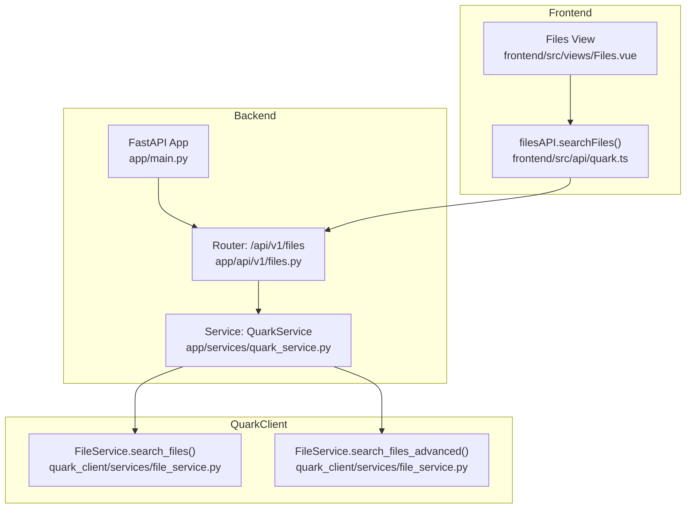
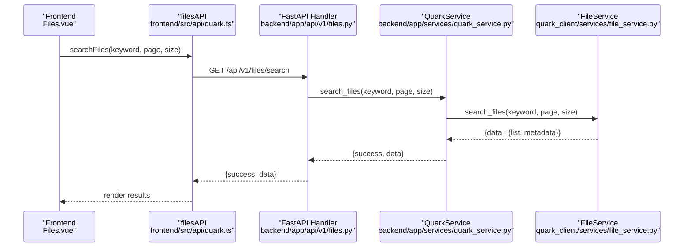
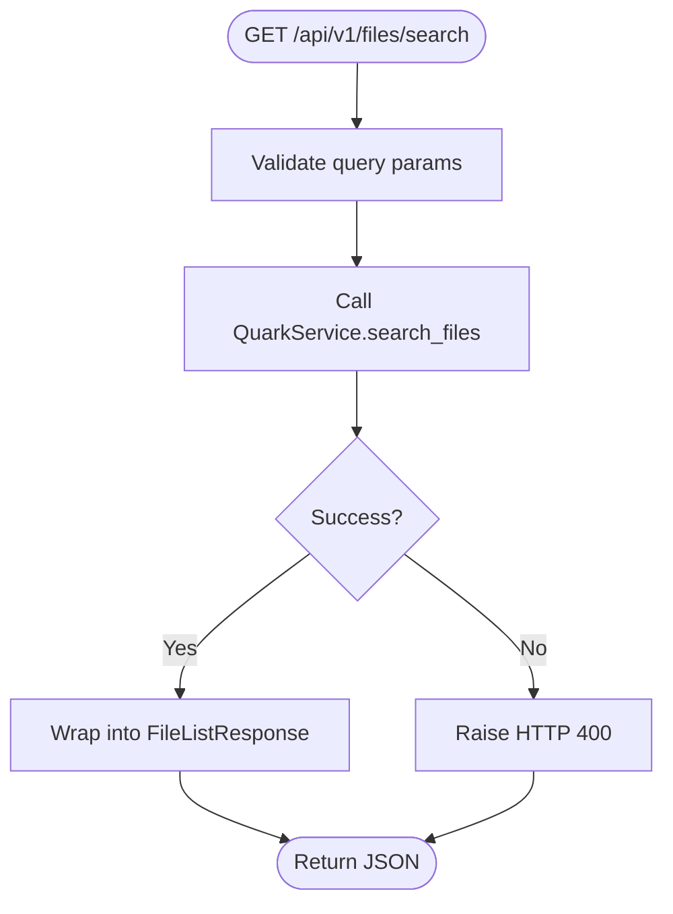
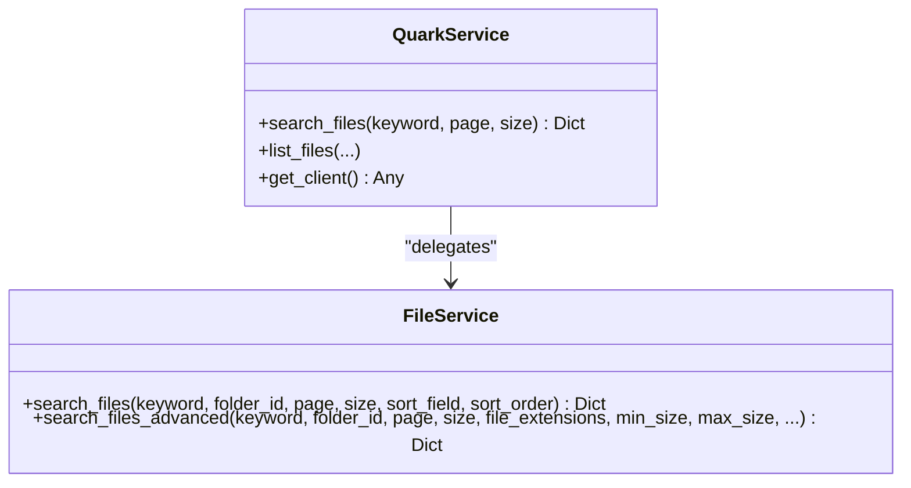
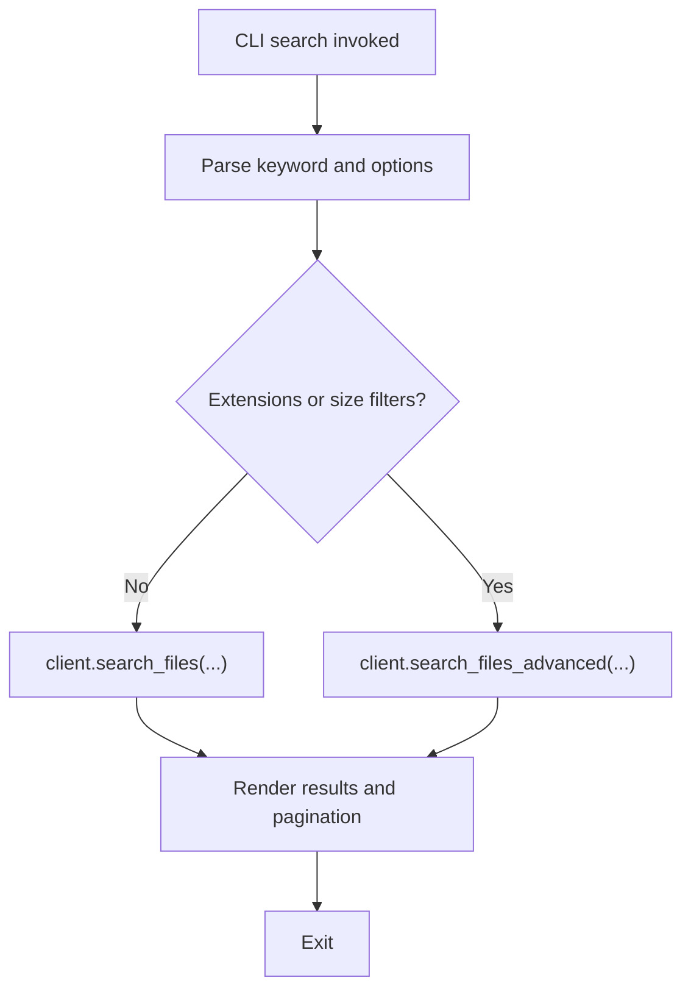
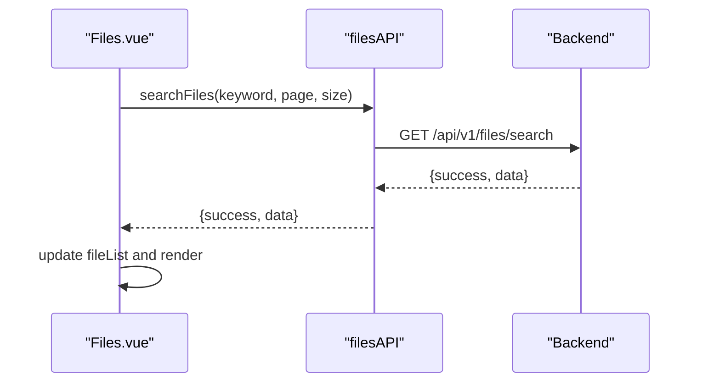
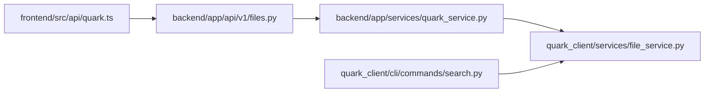

# Search and Filtering

<cite>
**Referenced Files in This Document**
- [backend/app/api/v1/files.py](file://backend/app/api/v1/files.py)
- [backend/app/schemas/files.py](file://backend/app/schemas/files.py)
- [backend/app/services/quark_service.py](file://backend/app/services/quark_service.py)
- [quark_client/services/file_service.py](file://quark_client/services/file_service.py)
- [quark_client/cli/commands/search.py](file://quark_client/cli/commands/search.py)
- [frontend/src/api/quark.ts](file://frontend/src/api/quark.ts)
- [frontend/src/views/Files.vue](file://frontend/src/views/Files.vue)
- [backend/app/main.py](file://backend/app/main.py)
</cite>

## Table of Contents
1. [Introduction](#introduction)
2. [Project Structure](#project-structure)
3. [Core Components](#core-components)
4. [Architecture Overview](#architecture-overview)
5. [Detailed Component Analysis](#detailed-component-analysis)
6. [Dependency Analysis](#dependency-analysis)
7. [Performance Considerations](#performance-considerations)
8. [Troubleshooting Guide](#troubleshooting-guide)
9. [Conclusion](#conclusion)

## Introduction
This document explains the search and filtering capabilities implemented in the project. It covers the backend search API endpoint, the search algorithm and filtering strategy, pagination handling, and the frontend integration. It also documents how the CLI supports advanced search filters (file type, size range), and outlines practical guidance for extending the system with auto-complete, saved filters, and ranking enhancements.

## Project Structure
The search and filtering feature spans three layers:
- Backend API: exposes a GET /files/search endpoint with pagination.
- Service layer: integrates with QuarkClient to call the underlying file search APIs.
- Frontend: provides a file browser UI and an API module to call the backend.

**Diagram sources**
- [backend/app/main.py:12-28](file://backend/app/main.py#L12-L28)
- [backend/app/api/v1/files.py:106-123](file://backend/app/api/v1/files.py#L106-L123)
- [backend/app/services/quark_service.py:318-340](file://backend/app/services/quark_service.py#L318-L340)
- [quark_client/services/file_service.py:183-219](file://quark_client/services/file_service.py#L183-L219)
- [quark_client/services/file_service.py:295-366](file://quark_client/services/file_service.py#L295-L366)
- [frontend/src/api/quark.ts:111-115](file://frontend/src/api/quark.ts#L111-L115)
- [frontend/src/views/Files.vue](file://frontend/src/views/Files.vue)

**Section sources**
- [backend/app/main.py:12-28](file://backend/app/main.py#L12-L28)
- [backend/app/api/v1/files.py:106-123](file://backend/app/api/v1/files.py#L106-L123)
- [backend/app/services/quark_service.py:318-340](file://backend/app/services/quark_service.py#L318-L340)
- [quark_client/services/file_service.py:183-219](file://quark_client/services/file_service.py#L183-L219)
- [quark_client/services/file_service.py:295-366](file://quark_client/services/file_service.py#L295-L366)
- [frontend/src/api/quark.ts:111-115](file://frontend/src/api/quark.ts#L111-L115)
- [frontend/src/views/Files.vue](file://frontend/src/views/Files.vue)

## Core Components
- Backend search endpoint: GET /api/v1/files/search with keyword, page, size query parameters.
- Request/response models: SearchFilesRequest and FileListResponse.
- Service layer: QuarkService delegates to QuarkClient’s FileService.search_files and FileService.search_files_advanced.
- CLI advanced search: supports extension filters and size range parsing.
- Frontend API: filesAPI.searchFiles wraps the backend endpoint.
- Pagination: handled by the backend endpoint and service layer; metadata totals are preserved in CLI results.

Key implementation references:
- Endpoint definition and handler: [backend/app/api/v1/files.py:106-123](file://backend/app/api/v1/files.py#L106-L123)
- Request model: [backend/app/schemas/files.py:42-47](file://backend/app/schemas/files.py#L42-L47)
- Service delegation: [backend/app/services/quark_service.py:318-340](file://backend/app/services/quark_service.py#L318-L340)
- FileService.search_files: [quark_client/services/file_service.py:183-219](file://quark_client/services/file_service.py#L183-L219)
- FileService.search_files_advanced: [quark_client/services/file_service.py:295-366](file://quark_client/services/file_service.py#L295-L366)
- CLI advanced search: [quark_client/cli/commands/search.py:45-87](file://quark_client/cli/commands/search.py#L45-L87)
- Frontend API wrapper: [frontend/src/api/quark.ts:111-115](file://frontend/src/api/quark.ts#L111-L115)

**Section sources**
- [backend/app/api/v1/files.py:106-123](file://backend/app/api/v1/files.py#L106-L123)
- [backend/app/schemas/files.py:42-47](file://backend/app/schemas/files.py#L42-L47)
- [backend/app/services/quark_service.py:318-340](file://backend/app/services/quark_service.py#L318-L340)
- [quark_client/services/file_service.py:183-219](file://quark_client/services/file_service.py#L183-L219)
- [quark_client/services/file_service.py:295-366](file://quark_client/services/file_service.py#L295-L366)
- [quark_client/cli/commands/search.py:45-87](file://quark_client/cli/commands/search.py#L45-L87)
- [frontend/src/api/quark.ts:111-115](file://frontend/src/api/quark.ts#L111-L115)

## Architecture Overview
The search pipeline flows from the frontend to the backend, then to the service layer, and finally to the QuarkClient. Advanced filtering is applied client-side when needed.

**Diagram sources**
- [frontend/src/views/Files.vue](file://frontend/src/views/Files.vue)
- [frontend/src/api/quark.ts:111-115](file://frontend/src/api/quark.ts#L111-L115)
- [backend/app/api/v1/files.py:106-123](file://backend/app/api/v1/files.py#L106-L123)
- [backend/app/services/quark_service.py:318-340](file://backend/app/services/quark_service.py#L318-L340)
- [quark_client/services/file_service.py:183-219](file://quark_client/services/file_service.py#L183-L219)

## Detailed Component Analysis

### Backend Search Endpoint
- Path: GET /api/v1/files/search
- Query parameters:
  - keyword: required string
  - page: integer, default 1, minimum 1
  - size: integer, default 50, typical 1–200
- Response: FileListResponse with success flag and data payload.

Processing logic:
- Validates inputs via Pydantic models.
- Delegates to QuarkService.search_files.
- Wraps results into FileListResponse.

**Diagram sources**
- [backend/app/api/v1/files.py:106-123](file://backend/app/api/v1/files.py#L106-L123)
- [backend/app/schemas/files.py:42-47](file://backend/app/schemas/files.py#L42-L47)

**Section sources**
- [backend/app/api/v1/files.py:106-123](file://backend/app/api/v1/files.py#L106-L123)
- [backend/app/schemas/files.py:42-47](file://backend/app/schemas/files.py#L42-L47)

### Service Layer and QuarkClient Integration
- QuarkService.search_files:
  - Returns mock data if QuarkClient is unavailable.
  - Otherwise calls client.search_files and returns the result.
- FileService.search_files:
  - Calls the Quark API endpoint for search with query, pagination, and highlighting enabled.
  - Metadata includes total counts for pagination.
- FileService.search_files_advanced:
  - If no filters are provided, forwards to basic search.
  - Otherwise fetches more results than requested, applies client-side filters (extension and size), then slices to requested page.

**Diagram sources**
- [backend/app/services/quark_service.py:318-340](file://backend/app/services/quark_service.py#L318-L340)
- [quark_client/services/file_service.py:183-219](file://quark_client/services/file_service.py#L183-L219)
- [quark_client/services/file_service.py:295-366](file://quark_client/services/file_service.py#L295-L366)

**Section sources**
- [backend/app/services/quark_service.py:318-340](file://backend/app/services/quark_service.py#L318-L340)
- [quark_client/services/file_service.py:183-219](file://quark_client/services/file_service.py#L183-L219)
- [quark_client/services/file_service.py:295-366](file://quark_client/services/file_service.py#L295-L366)

### CLI Advanced Search Filters
The CLI supports:
- Extension-based filtering: --ext with multiple values.
- Size range filtering: --min-size and --max-size with human-readable units.
- Pagination: --page and --size.
- Scope: --folder to constrain search to a folder ID.

Implementation highlights:
- Parses size strings into bytes.
- Chooses FileService.search_files vs FileService.search_files_advanced based on presence of filters.
- Displays metadata totals and pagination hints.

**Diagram sources**
- [quark_client/cli/commands/search.py:45-87](file://quark_client/cli/commands/search.py#L45-L87)
- [quark_client/cli/commands/search.py:180-210](file://quark_client/cli/commands/search.py#L180-L210)

**Section sources**
- [quark_client/cli/commands/search.py:45-87](file://quark_client/cli/commands/search.py#L45-L87)
- [quark_client/cli/commands/search.py:180-210](file://quark_client/cli/commands/search.py#L180-L210)

### Frontend Integration and Result Display
- API wrapper: filesAPI.searchFiles constructs the GET request with keyword, page, size.
- UI: Files.vue displays a table of files and supports navigation and actions.
- Pagination: The backend and service layer provide metadata totals; the CLI demonstrates how to compute total pages from metadata.

**Diagram sources**
- [frontend/src/views/Files.vue](file://frontend/src/views/Files.vue)
- [frontend/src/api/quark.ts:111-115](file://frontend/src/api/quark.ts#L111-L115)
- [backend/app/api/v1/files.py:106-123](file://backend/app/api/v1/files.py#L106-L123)

**Section sources**
- [frontend/src/api/quark.ts:111-115](file://frontend/src/api/quark.ts#L111-L115)
- [frontend/src/views/Files.vue](file://frontend/src/views/Files.vue)
- [backend/app/api/v1/files.py:106-123](file://backend/app/api/v1/files.py#L106-L123)

## Dependency Analysis
- Backend depends on FastAPI and Pydantic models for request validation.
- Service layer depends on QuarkClient’s FileService for actual search.
- CLI depends on QuarkClient’s advanced search and size parsing utilities.
- Frontend depends on the backend API exposed under /api/v1.

**Diagram sources**
- [frontend/src/api/quark.ts:111-115](file://frontend/src/api/quark.ts#L111-L115)
- [backend/app/api/v1/files.py:106-123](file://backend/app/api/v1/files.py#L106-L123)
- [backend/app/services/quark_service.py:318-340](file://backend/app/services/quark_service.py#L318-L340)
- [quark_client/services/file_service.py:183-219](file://quark_client/services/file_service.py#L183-L219)
- [quark_client/cli/commands/search.py:45-87](file://quark_client/cli/commands/search.py#L45-L87)

**Section sources**
- [frontend/src/api/quark.ts:111-115](file://frontend/src/api/quark.ts#L111-L115)
- [backend/app/api/v1/files.py:106-123](file://backend/app/api/v1/files.py#L106-L123)
- [backend/app/services/quark_service.py:318-340](file://backend/app/services/quark_service.py#L318-L340)
- [quark_client/services/file_service.py:183-219](file://quark_client/services/file_service.py#L183-L219)
- [quark_client/cli/commands/search.py:45-87](file://quark_client/cli/commands/search.py#L45-L87)

## Performance Considerations
- Current search retrieves results from the Quark API and applies client-side filtering only when filters are present. This reduces server-side complexity but increases client-side work and network usage.
- To optimize:
  - Increase initial fetch size for advanced search to reduce repeated round trips (already partially addressed by fetching more results).
  - Consider server-side filtering if the upstream API supports it.
  - Add result caching at the service layer to avoid repeated identical queries.
  - Implement debounced auto-complete on the frontend to reduce frequent requests.
  - Use efficient pagination and avoid unnecessary metadata updates.

[No sources needed since this section provides general guidance]

## Troubleshooting Guide
Common issues and remedies:
- Not logged in:
  - Backend returns an error when QuarkService detects missing credentials.
  - Ensure the frontend invokes authentication and passes session cookies to the backend.
- Invalid parameters:
  - FastAPI validates page and size; ensure they meet constraints.
- No results:
  - Verify keyword spelling and consider broader scope (root vs folder).
  - For CLI, confirm filters are not overly restrictive.
- Pagination mismatch:
  - Use metadata totals returned by the API to compute total pages.

**Section sources**
- [backend/app/services/quark_service.py:318-340](file://backend/app/services/quark_service.py#L318-L340)
- [quark_client/services/file_service.py:183-219](file://quark_client/services/file_service.py#L183-L219)
- [quark_client/cli/commands/search.py:45-87](file://quark_client/cli/commands/search.py#L45-L87)

## Conclusion
The project implements a clean separation of concerns for search and filtering:
- Backend: minimal endpoint with validated pagination.
- Service layer: integrates with QuarkClient and supports advanced filtering client-side.
- CLI: advanced filters and pagination display.
- Frontend: API integration and result rendering.

Future enhancements could include:
- Auto-complete suggestions on the frontend.
- Saved search filters and persistent query profiles.
- Ranking improvements (e.g., relevance scoring) either upstream or via post-processing.
- Server-side filtering and caching for improved performance.

[No sources needed since this section summarizes without analyzing specific files]