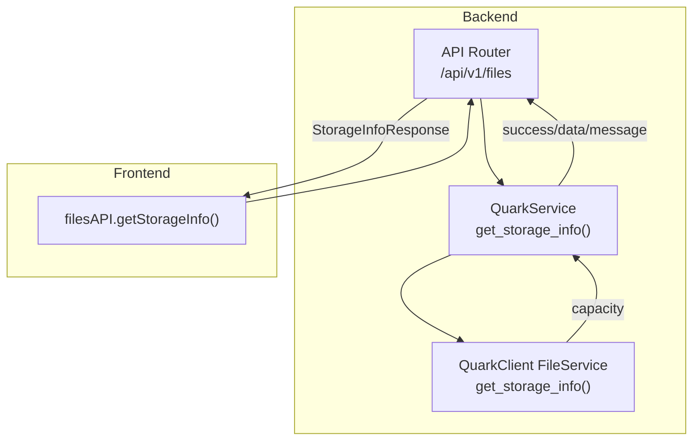
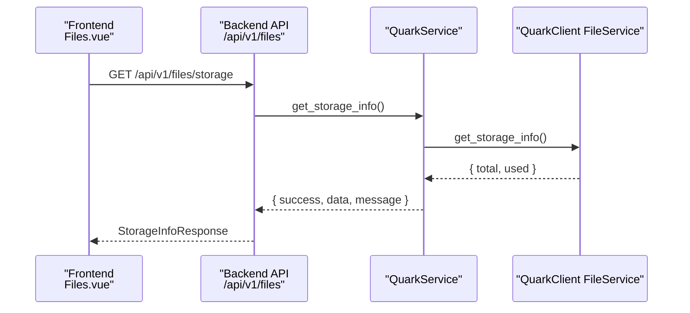
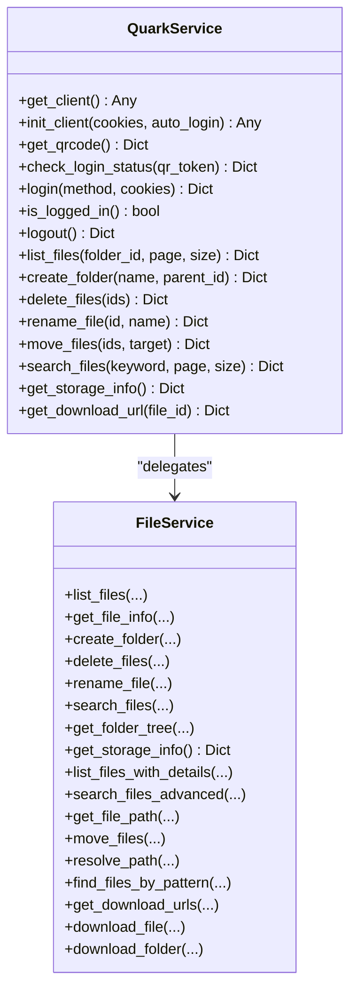

# Storage Information

<cite>
**Referenced Files in This Document**
- [backend/app/api/v1/files.py](file://backend/app/api/v1/files.py)
- [backend/app/services/quark_service.py](file://backend/app/services/quark_service.py)
- [quark_client/services/file_service.py](file://quark_client/services/file_service.py)
- [frontend/src/api/quark.ts](file://frontend/src/api/quark.ts)
- [frontend/src/views/Files.vue](file://frontend/src/views/Files.vue)
- [backend/app/schemas/files.py](file://backend/app/schemas/files.py)
- [backend/app/api/v1/router.py](file://backend/app/api/v1/router.py)
- [backend/app/main.py](file://backend/app/main.py)
- [quark_client/cli/interactive.py](file://quark_client/cli/interactive.py)
- [quark_client/cli/main.py](file://quark_client/cli/main.py)
</cite>

## Table of Contents
1. [Introduction](#introduction)
2. [Project Structure](#project-structure)
3. [Core Components](#core-components)
4. [Architecture Overview](#architecture-overview)
5. [Detailed Component Analysis](#detailed-component-analysis)
6. [Dependency Analysis](#dependency-analysis)
7. [Performance Considerations](#performance-considerations)
8. [Troubleshooting Guide](#troubleshooting-guide)
9. [Conclusion](#conclusion)
10. [Appendices](#appendices)

## Introduction
This document explains the storage information and quota management capabilities implemented in the project. It covers the storage API endpoint for retrieving account storage usage, capacity limits, and usage statistics, the backend service integration for fetching storage metrics, computing usage percentages, and detecting near-capacity warnings. It also documents the frontend storage dashboard visuals, progress indicators, and alert mechanisms, along with examples of storage reporting, historical usage trends, capacity planning calculations, integration with QuarkClient storage services, real-time usage updates, and storage optimization recommendations.

## Project Structure
The storage feature spans three layers:
- Backend API: exposes a dedicated endpoint to fetch storage information.
- Backend service: integrates with the QuarkClient to retrieve storage metrics.
- Frontend: consumes the API and renders storage usage and alerts.

**Diagram sources**
- [backend/app/api/v1/files.py:126-138](file://backend/app/api/v1/files.py#L126-L138)
- [backend/app/services/quark_service.py:342-362](file://backend/app/services/quark_service.py#L342-L362)
- [quark_client/services/file_service.py:240-248](file://quark_client/services/file_service.py#L240-L248)
- [frontend/src/api/quark.ts:117-119](file://frontend/src/api/quark.ts#L117-L119)

**Section sources**
- [backend/app/api/v1/router.py:21-24](file://backend/app/api/v1/router.py#L21-L24)
- [backend/app/main.py](file://backend/app/main.py#L28)

## Core Components
- Storage API endpoint: GET /api/v1/files/storage returns storage usage and capacity.
- Backend service: QuarkService delegates to QuarkClient FileService to fetch capacity.
- Frontend API wrapper: filesAPI.getStorageInfo() calls the backend endpoint.
- Response model: StorageInfoResponse encapsulates success, data, and message.

Key implementation references:
- Endpoint definition and response mapping: [backend/app/api/v1/files.py:126-138](file://backend/app/api/v1/files.py#L126-L138)
- Service method and delegation: [backend/app/services/quark_service.py:342-362](file://backend/app/services/quark_service.py#L342-L362)
- Client-side API call: [frontend/src/api/quark.ts:117-119](file://frontend/src/api/quark.ts#L117-L119)
- Response schema: [backend/app/schemas/files.py:49-54](file://backend/app/schemas/files.py#L49-L54)

**Section sources**
- [backend/app/api/v1/files.py:126-138](file://backend/app/api/v1/files.py#L126-L138)
- [backend/app/services/quark_service.py:342-362](file://backend/app/services/quark_service.py#L342-L362)
- [frontend/src/api/quark.ts:117-119](file://frontend/src/api/quark.ts#L117-L119)
- [backend/app/schemas/files.py:49-54](file://backend/app/schemas/files.py#L49-L54)

## Architecture Overview
The storage retrieval pipeline follows a clear flow:
- Frontend invokes filesAPI.getStorageInfo().
- Backend router forwards to the files module.
- Service layer calls QuarkClient FileService.get_storage_info().
- Response is returned to the frontend as StorageInfoResponse.

**Diagram sources**
- [frontend/src/views/Files.vue:1-264](file://frontend/src/views/Files.vue#L1-L264)
- [frontend/src/api/quark.ts:117-119](file://frontend/src/api/quark.ts#L117-L119)
- [backend/app/api/v1/files.py:126-138](file://backend/app/api/v1/files.py#L126-L138)
- [backend/app/services/quark_service.py:342-362](file://backend/app/services/quark_service.py#L342-L362)
- [quark_client/services/file_service.py:240-248](file://quark_client/services/file_service.py#L240-L248)

## Detailed Component Analysis

### Storage API Endpoint
- Path: GET /api/v1/files/storage
- Purpose: Retrieve account storage usage and capacity.
- Response: StorageInfoResponse with success flag, data payload, and optional message.
- Error handling: Raises HTTPException on failure with detail from service result.

Implementation highlights:
- Endpoint registration and route mapping: [backend/app/api/v1/files.py:126-138](file://backend/app/api/v1/files.py#L126-L138)
- Response schema definition: [backend/app/schemas/files.py:49-54](file://backend/app/schemas/files.py#L49-L54)

**Section sources**
- [backend/app/api/v1/files.py:126-138](file://backend/app/api/v1/files.py#L126-L138)
- [backend/app/schemas/files.py:49-54](file://backend/app/schemas/files.py#L49-L54)

### Backend Service Integration
- QuarkService.get_storage_info():
  - Handles simulation mode and login checks.
  - Delegates to QuarkClient FileService.get_storage_info().
  - Wraps results with success flag and message.

- QuarkClient FileService.get_storage_info():
  - Calls the capacity endpoint to obtain total and used bytes.

**Diagram sources**
- [backend/app/services/quark_service.py:23-388](file://backend/app/services/quark_service.py#L23-L388)
- [quark_client/services/file_service.py:13-248](file://quark_client/services/file_service.py#L13-L248)

**Section sources**
- [backend/app/services/quark_service.py:342-362](file://backend/app/services/quark_service.py#L342-L362)
- [quark_client/services/file_service.py:240-248](file://quark_client/services/file_service.py#L240-L248)

### Frontend Storage Dashboard
- API consumption:
  - filesAPI.getStorageInfo() performs GET /api/v1/files/storage.
  - Response is typed via StorageInfoResponse.

- Rendering and UX:
  - Current Files.vue focuses on file listing and navigation.
  - Storage dashboard UI (progress bars, alerts, charts) is not yet implemented in the current frontend.
  - Recommendation: Add a dedicated storage dashboard view that:
    - Displays total, used, and free capacity.
    - Shows a progress bar computed from used/total.
    - Highlights near-capacity thresholds (e.g., >80%).
    - Provides quick actions to optimize storage.

Integration references:
- API wrapper: [frontend/src/api/quark.ts:117-119](file://frontend/src/api/quark.ts#L117-L119)
- Existing Files.vue view: [frontend/src/views/Files.vue:1-264](file://frontend/src/views/Files.vue#L1-L264)

**Section sources**
- [frontend/src/api/quark.ts:117-119](file://frontend/src/api/quark.ts#L117-L119)
- [frontend/src/views/Files.vue:1-264](file://frontend/src/views/Files.vue#L1-L264)

### Usage Percentage Calculation and Near-Capacity Warnings
- Backend service returns raw total and used values.
- CLI utilities demonstrate percentage calculation and threshold checks:
  - Usage percent = used / total * 100 (if total > 0).
  - Near-capacity warning can be triggered at configurable thresholds (e.g., >80%).

References:
- CLI status command computes usage percent and prints a summary table: [quark_client/cli/main.py:291-323](file://quark_client/cli/main.py#L291-L323)
- Interactive CLI status computation: [quark_client/cli/interactive.py:961-1013](file://quark_client/cli/interactive.py#L961-L1013)

**Section sources**
- [quark_client/cli/main.py:291-323](file://quark_client/cli/main.py#L291-L323)
- [quark_client/cli/interactive.py:961-1013](file://quark_client/cli/interactive.py#L961-L1013)

### Storage Reporting Examples
- Total capacity, used space, and free space are provided by the capacity endpoint.
- CLI examples show tabular reporting of these metrics and computed percentages.

References:
- Capacity endpoint call: [quark_client/services/file_service.py:240-248](file://quark_client/services/file_service.py#L240-L248)
- CLI reporting examples: [quark_client/cli/main.py:291-323](file://quark_client/cli/main.py#L291-L323), [quark_client/cli/interactive.py:961-1013](file://quark_client/cli/interactive.py#L961-L1013)

**Section sources**
- [quark_client/services/file_service.py:240-248](file://quark_client/services/file_service.py#L240-L248)
- [quark_client/cli/main.py:291-323](file://quark_client/cli/main.py#L291-L323)
- [quark_client/cli/interactive.py:961-1013](file://quark_client/cli/interactive.py#L961-L1013)

### Historical Usage Trends and Capacity Planning
- Historical trend visualization is not implemented in the current frontend.
- Capacity planning recommendations:
  - Set thresholds (e.g., 70%, 85%) to trigger alerts.
  - Provide actionable insights: identify top folders by size, suggest cleanup, and offer bulk deletion.
  - Periodic polling of /api/v1/files/storage for real-time updates.

Note: These are recommendations for future development based on the current API availability.

[No sources needed since this section provides general guidance]

### Real-time Usage Updates and Optimization Recommendations
- Real-time updates:
  - Polling: periodically call filesAPI.getStorageInfo() and update UI.
  - Event-driven: if the backend supports server-sent events or webhooks, integrate them to push updates.
- Optimization recommendations:
  - Identify large files and folders.
  - Offer compression suggestions for certain file types.
  - Recommend moving infrequently accessed items to archive folders.

[No sources needed since this section provides general guidance]

## Dependency Analysis
The storage feature depends on:
- Backend API router registration under /api/v1.
- QuarkService delegating to QuarkClient FileService.capacity endpoint.
- Frontend API wrapper invoking the backend endpoint.

**Diagram sources**
- [frontend/src/api/quark.ts:117-119](file://frontend/src/api/quark.ts#L117-L119)
- [backend/app/api/v1/files.py:126-138](file://backend/app/api/v1/files.py#L126-L138)
- [backend/app/services/quark_service.py:342-362](file://backend/app/services/quark_service.py#L342-L362)
- [quark_client/services/file_service.py:240-248](file://quark_client/services/file_service.py#L240-L248)

**Section sources**
- [backend/app/api/v1/router.py:21-24](file://backend/app/api/v1/router.py#L21-L24)
- [backend/app/main.py](file://backend/app/main.py#L28)

## Performance Considerations
- Minimize redundant calls: cache storage info per session and refresh on demand.
- Batch requests: combine storage queries with file listing when appropriate.
- Frontend throttling: limit polling frequency to avoid overwhelming the backend.
- Error resilience: handle transient failures gracefully and retry with backoff.

[No sources needed since this section provides general guidance]

## Troubleshooting Guide
Common issues and resolutions:
- Not logged in:
  - Backend returns failure when client is uninitialized or not logged in.
  - Ensure authentication flow completes before calling storage endpoint.
  - References: [backend/app/services/quark_service.py:344-356](file://backend/app/services/quark_service.py#L344-L356)
- QuarkClient unavailable:
  - Simulation mode returns mock data; production requires proper initialization.
  - References: [backend/app/services/quark_service.py:344-353](file://backend/app/services/quark_service.py#L344-L353)
- API errors:
  - HTTPException raised on service failure; inspect message for details.
  - References: [backend/app/api/v1/files.py:131-132](file://backend/app/api/v1/files.py#L131-L132)
- Frontend handling:
  - filesAPI.getStorageInfo() should surface errors to the user and log details.
  - References: [frontend/src/api/quark.ts:117-119](file://frontend/src/api/quark.ts#L117-L119)

**Section sources**
- [backend/app/services/quark_service.py:344-356](file://backend/app/services/quark_service.py#L344-L356)
- [backend/app/api/v1/files.py:131-132](file://backend/app/api/v1/files.py#L131-L132)
- [frontend/src/api/quark.ts:117-119](file://frontend/src/api/quark.ts#L117-L119)

## Conclusion
The project implements a clean, layered storage information system:
- A dedicated API endpoint retrieves storage metrics.
- The backend service integrates with QuarkClient to obtain capacity and usage.
- The frontend consumes the endpoint via a typed API wrapper.
Future enhancements should focus on building a storage dashboard with progress indicators, alerts, historical trends, and optimization recommendations to improve user experience and storage management.

[No sources needed since this section summarizes without analyzing specific files]

## Appendices

### API Definition Summary
- Endpoint: GET /api/v1/files/storage
- Response: StorageInfoResponse(success: bool, data: dict | None, message: str | None)
- Typical data keys: total (bytes), used (bytes)

References:
- Endpoint and response mapping: [backend/app/api/v1/files.py:126-138](file://backend/app/api/v1/files.py#L126-L138)
- Response schema: [backend/app/schemas/files.py:49-54](file://backend/app/schemas/files.py#L49-L54)

**Section sources**
- [backend/app/api/v1/files.py:126-138](file://backend/app/api/v1/files.py#L126-L138)
- [backend/app/schemas/files.py:49-54](file://backend/app/schemas/files.py#L49-L54)