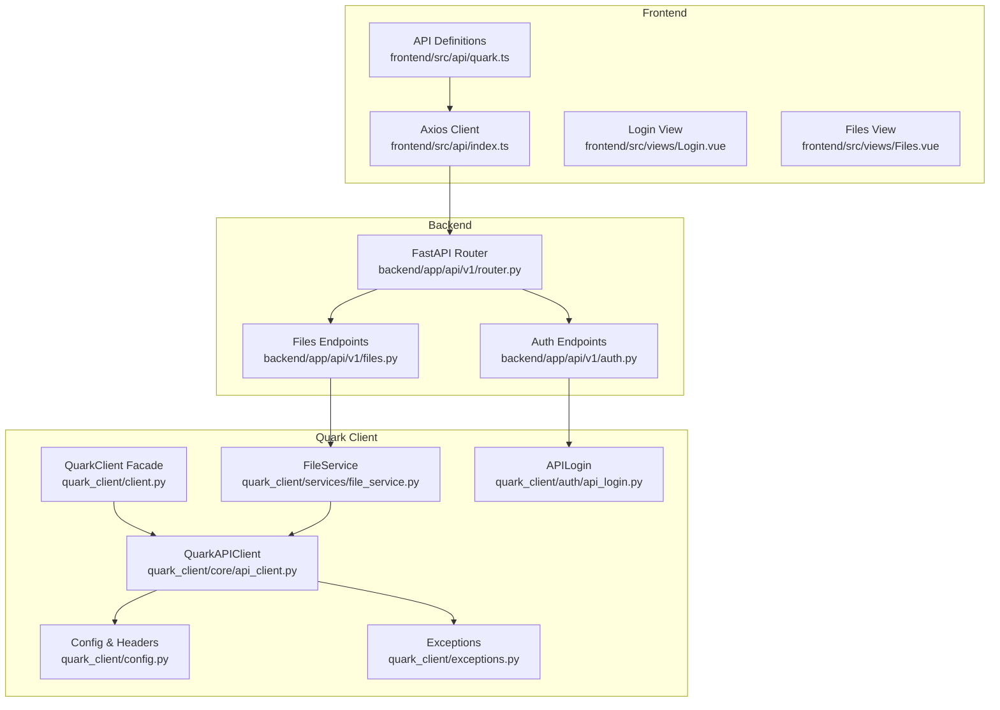
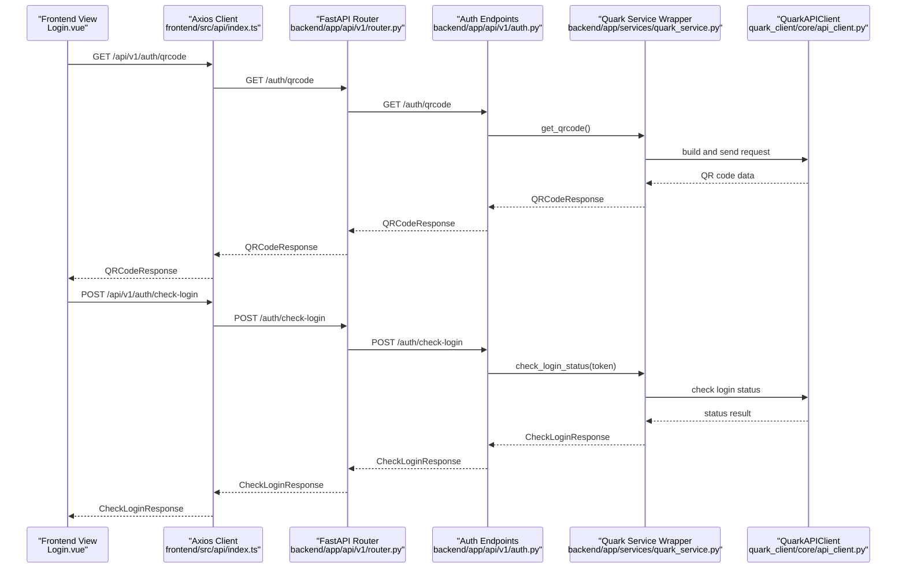
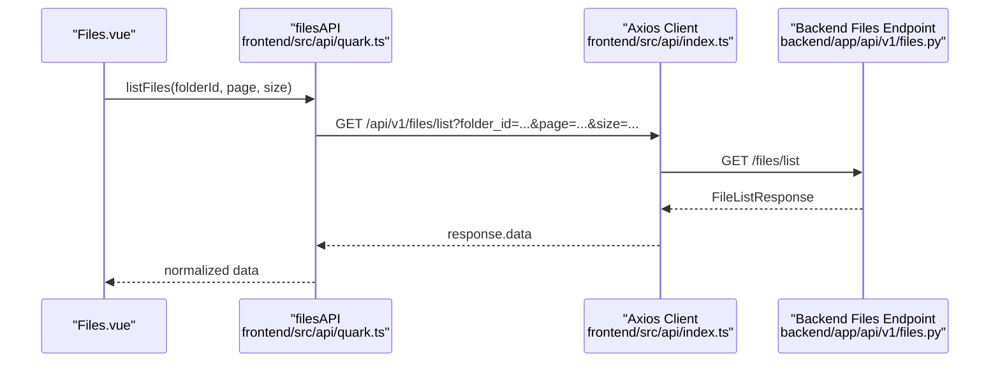
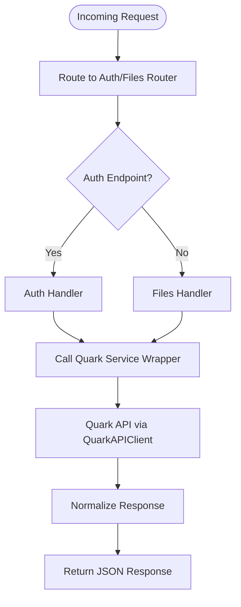
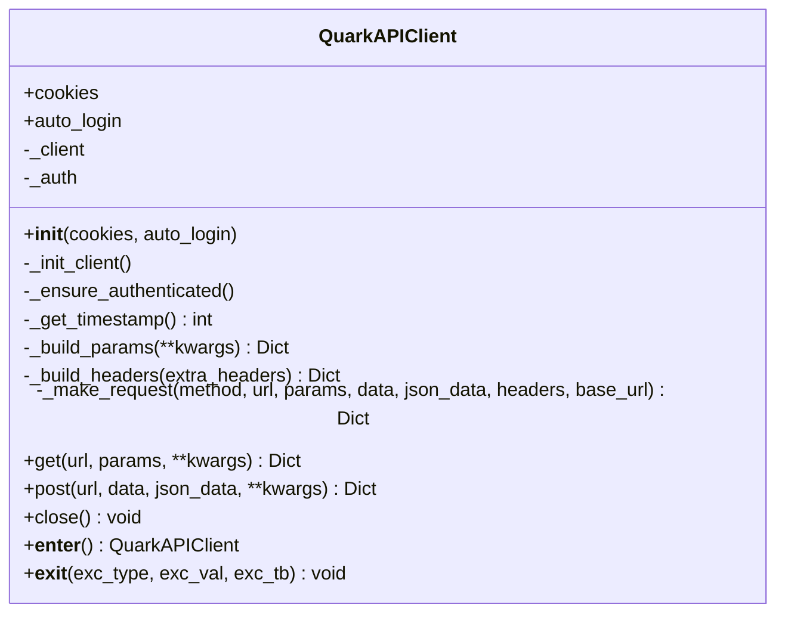
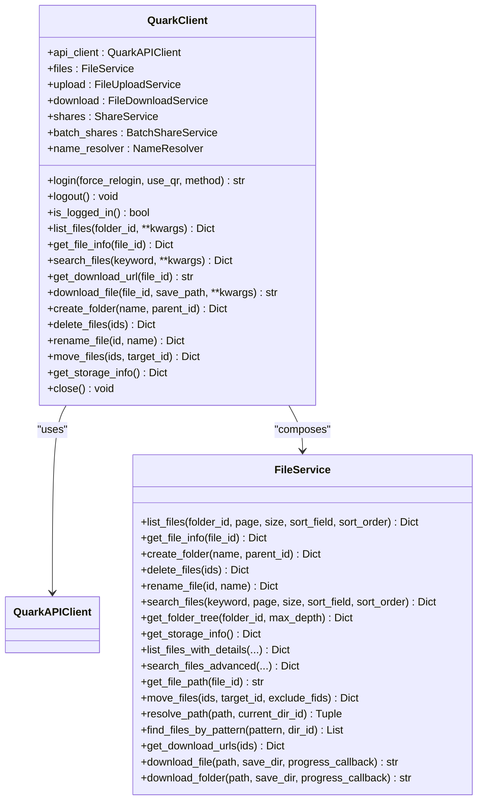
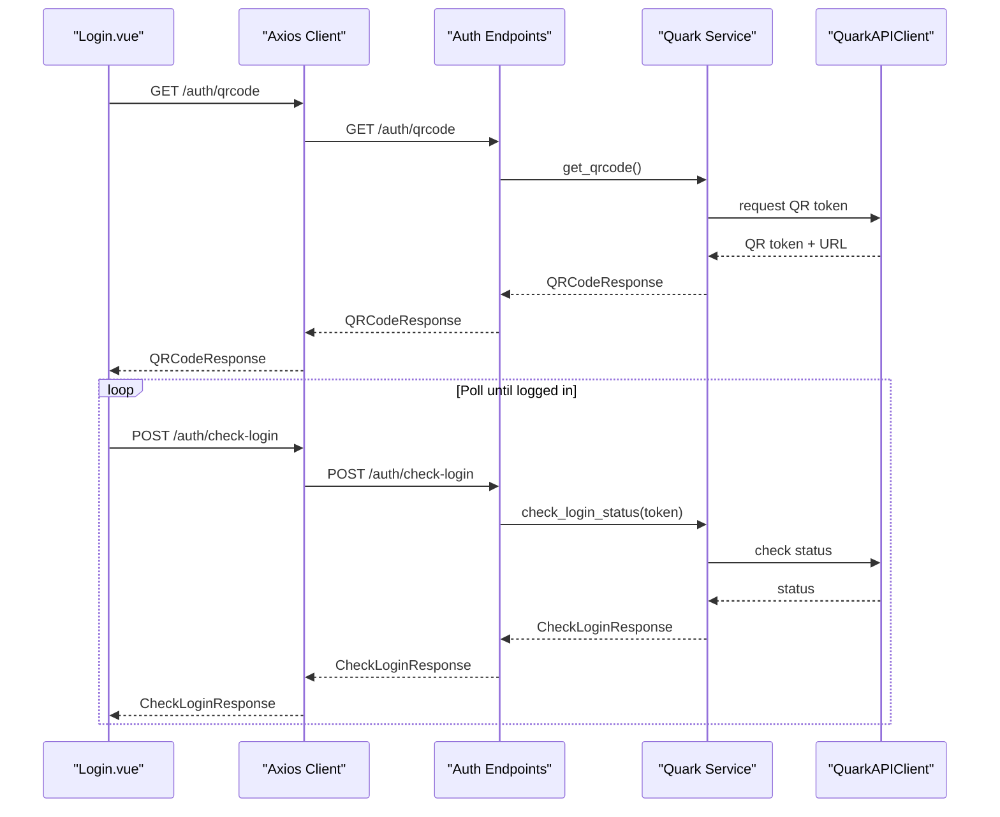
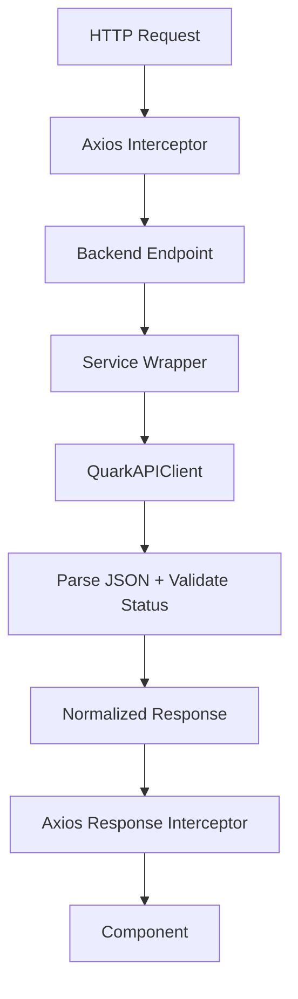
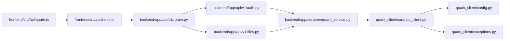

# API Integration Layer

<cite>
**Referenced Files in This Document**
- [api_client.py](file://quark_client/core/api_client.py)
- [client.py](file://quark_client/client.py)
- [config.py](file://quark_client/config.py)
- [exceptions.py](file://quark_client/exceptions.py)
- [api_login.py](file://quark_client/auth/api_login.py)
- [file_service.py](file://quark_client/services/file_service.py)
- [index.ts](file://frontend/src/api/index.ts)
- [quark.ts](file://frontend/src/api/quark.ts)
- [router.py](file://backend/app/api/v1/router.py)
- [auth.py](file://backend/app/api/v1/auth.py)
- [files.py](file://backend/app/api/v1/files.py)
- [Login.vue](file://frontend/src/views/Login.vue)
- [Files.vue](file://frontend/src/views/Files.vue)
</cite>

## Table of Contents
1. [Introduction](#introduction)
2. [Project Structure](#project-structure)
3. [Core Components](#core-components)
4. [Architecture Overview](#architecture-overview)
5. [Detailed Component Analysis](#detailed-component-analysis)
6. [Dependency Analysis](#dependency-analysis)
7. [Performance Considerations](#performance-considerations)
8. [Troubleshooting Guide](#troubleshooting-guide)
9. [Conclusion](#conclusion)
10. [Appendices](#appendices)

## Introduction
This document describes the API integration layer that connects the frontend Vue application to the backend FastAPI service, which in turn communicates with the Quark Cloud Drive API. It focuses on the client architecture, request/response handling, error management, authentication token handling, interceptors, and response transformation. It also covers service wrappers for Quark API interactions, data fetching patterns, caching strategies, security considerations, rate limiting, offline fallbacks, and guidelines for extending the API layer.

## Project Structure
The API integration spans three layers:
- Backend FastAPI service exposes REST endpoints and delegates to a Quark service wrapper.
- Frontend Axios client encapsulates HTTP requests and response normalization.
- Quark Python client provides a high-level abstraction over the Quark API with authentication and service abstractions.

**Diagram sources**
- [index.ts:1-30](file://frontend/src/api/index.ts#L1-L30)
- [quark.ts:1-125](file://frontend/src/api/quark.ts#L1-L125)
- [router.py:1-24](file://backend/app/api/v1/router.py#L1-L24)
- [auth.py:1-107](file://backend/app/api/v1/auth.py#L1-L107)
- [files.py:1-150](file://backend/app/api/v1/files.py#L1-L150)
- [api_client.py:1-209](file://quark_client/core/api_client.py#L1-L209)
- [client.py:1-405](file://quark_client/client.py#L1-L405)
- [file_service.py:1-893](file://quark_client/services/file_service.py#L1-L893)
- [config.py:1-63](file://quark_client/config.py#L1-L63)
- [exceptions.py:1-50](file://quark_client/exceptions.py#L1-L50)
- [api_login.py:1-521](file://quark_client/auth/api_login.py#L1-L521)

**Section sources**
- [index.ts:1-30](file://frontend/src/api/index.ts#L1-L30)
- [quark.ts:1-125](file://frontend/src/api/quark.ts#L1-L125)
- [router.py:1-24](file://backend/app/api/v1/router.py#L1-L24)
- [auth.py:1-107](file://backend/app/api/v1/auth.py#L1-L107)
- [files.py:1-150](file://backend/app/api/v1/files.py#L1-L150)
- [api_client.py:1-209](file://quark_client/core/api_client.py#L1-L209)
- [client.py:1-405](file://quark_client/client.py#L1-L405)
- [file_service.py:1-893](file://quark_client/services/file_service.py#L1-L893)
- [config.py:1-63](file://quark_client/config.py#L1-L63)
- [exceptions.py:1-50](file://quark_client/exceptions.py#L1-L50)
- [api_login.py:1-521](file://quark_client/auth/api_login.py#L1-L521)

## Core Components
- Frontend Axios client: Centralized HTTP client with request/response interceptors and baseURL configuration.
- Backend FastAPI routers: Expose REST endpoints for auth and files, delegating to a service layer.
- Quark Python client: Provides a facade (QuarkClient) and service abstractions (FileService, ShareService, etc.) over the Quark API.
- QuarkAPIClient: Low-level HTTP client handling authentication, request building, retries, timeouts, and response parsing.
- Authentication: APILogin manages QR-based login flow and extracts cookies for subsequent API calls.
- Exceptions: Unified exception hierarchy for API, network, authentication, and domain-specific errors.

Key responsibilities:
- Request/response normalization and error propagation
- Authentication token handling via cookies
- Service abstraction for file operations
- Interceptors for request/response transformation
- Configurable timeouts and default headers

**Section sources**
- [index.ts:1-30](file://frontend/src/api/index.ts#L1-L30)
- [quark.ts:1-125](file://frontend/src/api/quark.ts#L1-L125)
- [router.py:1-24](file://backend/app/api/v1/router.py#L1-L24)
- [auth.py:1-107](file://backend/app/api/v1/auth.py#L1-L107)
- [files.py:1-150](file://backend/app/api/v1/files.py#L1-L150)
- [client.py:18-405](file://quark_client/client.py#L18-L405)
- [api_client.py:16-209](file://quark_client/core/api_client.py#L16-L209)
- [api_login.py:20-521](file://quark_client/auth/api_login.py#L20-L521)
- [exceptions.py:1-50](file://quark_client/exceptions.py#L1-L50)

## Architecture Overview
The frontend communicates with the backend via REST endpoints. The backend validates requests and invokes the Quark service wrapper, which performs the actual calls to the Quark API. The Quark client handles authentication, request construction, and response parsing, raising domain-specific exceptions on failure.

**Diagram sources**
- [Login.vue:84-176](file://frontend/src/views/Login.vue#L84-L176)
- [index.ts:1-30](file://frontend/src/api/index.ts#L1-L30)
- [router.py:1-24](file://backend/app/api/v1/router.py#L1-L24)
- [auth.py:18-75](file://backend/app/api/v1/auth.py#L18-L75)
- [api_client.py:80-183](file://quark_client/core/api_client.py#L80-L183)

## Detailed Component Analysis

### Frontend Axios Client and API Definitions
- Axios client is configured with baseURL, timeout, and default headers.
- Request interceptor is present but currently a no-op; it can be extended for adding auth tokens or correlation IDs.
- Response interceptor normalizes responses by extracting data, enabling uniform handling in views.
- API definitions encapsulate endpoint contracts and typed request/response shapes for auth and files.

Practical usage in components:
- Login.vue generates QR codes, renders them, and polls for login status using authAPI.
- Files.vue fetches file lists, handles loading states, and triggers actions like delete and download.

**Diagram sources**
- [Files.vue:89-104](file://frontend/src/views/Files.vue#L89-L104)
- [quark.ts:77-124](file://frontend/src/api/quark.ts#L77-L124)
- [index.ts:1-30](file://frontend/src/api/index.ts#L1-L30)
- [files.py:19-35](file://backend/app/api/v1/files.py#L19-L35)

**Section sources**
- [index.ts:1-30](file://frontend/src/api/index.ts#L1-L30)
- [quark.ts:1-125](file://frontend/src/api/quark.ts#L1-L125)
- [Files.vue:89-104](file://frontend/src/views/Files.vue#L89-L104)
- [Login.vue:84-176](file://frontend/src/views/Login.vue#L84-L176)

### Backend Endpoints and Service Delegation
- Router aggregates health checks and sub-routers for auth and files.
- Auth endpoints expose QR generation, login status polling, login, status, and logout.
- Files endpoints expose list, create folder, delete, rename, move, search, storage info, and download URL retrieval.
- Each endpoint validates responses and raises HTTP exceptions on failure, ensuring consistent error propagation.

**Diagram sources**
- [router.py:1-24](file://backend/app/api/v1/router.py#L1-L24)
- [auth.py:18-95](file://backend/app/api/v1/auth.py#L18-L95)
- [files.py:19-149](file://backend/app/api/v1/files.py#L19-L149)
- [api_client.py:80-183](file://quark_client/core/api_client.py#L80-L183)

**Section sources**
- [router.py:1-24](file://backend/app/api/v1/router.py#L1-L24)
- [auth.py:18-95](file://backend/app/api/v1/auth.py#L18-L95)
- [files.py:19-149](file://backend/app/api/v1/files.py#L19-L149)

### QuarkAPIClient: HTTP Abstraction and Error Management
- Initializes HTTP client with timeout, default headers, and redirect handling.
- Ensures authentication by obtaining cookies when none are provided.
- Builds standardized request parameters and headers, including a timestamp and fixed delta.
- Implements robust request dispatching for GET/POST with JSON/form data support.
- Handles HTTP status codes, JSON parsing, and API-level status fields, raising appropriate exceptions.
- Provides convenience methods for GET/POST and lifecycle management via context manager.

**Diagram sources**
- [api_client.py:16-209](file://quark_client/core/api_client.py#L16-L209)

**Section sources**
- [api_client.py:16-209](file://quark_client/core/api_client.py#L16-L209)

### QuarkClient and Service Wrappers
- QuarkClient acts as a facade, composing QuarkAPIClient and service instances (files, upload, download, shares, name resolver).
- Services encapsulate domain-specific operations and delegate to QuarkAPIClient.
- FileService demonstrates typical patterns: parameter assembly, API invocation, response normalization, and error translation.

**Diagram sources**
- [client.py:18-405](file://quark_client/client.py#L18-L405)
- [file_service.py:13-893](file://quark_client/services/file_service.py#L13-L893)
- [api_client.py:16-209](file://quark_client/core/api_client.py#L16-L209)

**Section sources**
- [client.py:18-405](file://quark_client/client.py#L18-L405)
- [file_service.py:13-893](file://quark_client/services/file_service.py#L13-L893)

### Authentication Token Handling and Login Flow
- APILogin orchestrates QR-based login: obtains QR token and URL, displays QR, polls for login completion, and extracts cookies.
- QuarkAPIClient consumes cookies to authenticate subsequent requests.
- Frontend Login.vue integrates with backend auth endpoints to generate QR codes and poll for login status.

**Diagram sources**
- [Login.vue:84-176](file://frontend/src/views/Login.vue#L84-L176)
- [auth.py:18-52](file://backend/app/api/v1/auth.py#L18-L52)
- [api_login.py:467-507](file://quark_client/auth/api_login.py#L467-L507)
- [api_client.py:47-53](file://quark_client/core/api_client.py#L47-L53)

**Section sources**
- [api_login.py:20-521](file://quark_client/auth/api_login.py#L20-L521)
- [api_client.py:47-53](file://quark_client/core/api_client.py#L47-L53)
- [Login.vue:84-176](file://frontend/src/views/Login.vue#L84-L176)
- [auth.py:18-52](file://backend/app/api/v1/auth.py#L18-L52)

### Request/Response Handling and Interceptors
- Frontend response interceptor extracts response.data, simplifying view logic.
- Backend endpoints return strongly typed responses; HTTP exceptions propagate structured errors.
- QuarkAPIClient parses JSON, checks HTTP and API statuses, and raises domain-specific exceptions.

**Diagram sources**
- [index.ts:11-27](file://frontend/src/api/index.ts#L11-L27)
- [files.py:19-35](file://backend/app/api/v1/files.py#L19-L35)
- [api_client.py:158-177](file://quark_client/core/api_client.py#L158-L177)

**Section sources**
- [index.ts:11-27](file://frontend/src/api/index.ts#L11-L27)
- [files.py:19-35](file://backend/app/api/v1/files.py#L19-L35)
- [api_client.py:158-177](file://quark_client/core/api_client.py#L158-L177)

### Practical Examples: Component Usage, Loading States, and Error Boundaries
- Login.vue:
  - Generates QR code, renders QR canvas, polls for login status, and navigates on success.
  - Uses loading/error states and clears intervals on unmount.
- Files.vue:
  - Fetches file lists with loading indicators, handles navigation, and performs destructive actions with confirmation dialogs.
  - Displays messages for success and error outcomes.

Guidelines:
- Always set loading booleans around async operations.
- Extract and display user-friendly messages from responses or error handlers.
- Clean up timers/intervals in onUnmounted hooks.
- Use confirm dialogs for destructive actions.

**Section sources**
- [Login.vue:84-176](file://frontend/src/views/Login.vue#L84-L176)
- [Files.vue:89-104](file://frontend/src/views/Files.vue#L89-L104)
- [Files.vue:182-200](file://frontend/src/views/Files.vue#L182-L200)

### Relationship Between API Services and Application State
- Frontend components manage local state (loading, path breadcrumbs, file lists).
- API responses update component state; normalized responses simplify state updates.
- Backend endpoints centralize validation and error reporting, keeping components lean.

Data fetching patterns:
- One-shot fetches for lists and single resources.
- Polling for asynchronous operations (login status).
- Pagination parameters passed through to endpoints.

Caching strategies:
- Frontend: Local state caching within components.
- Backend: No explicit caching shown; consider adding in-memory caches for frequent reads (e.g., file metadata) or Redis for distributed caching.

**Section sources**
- [Files.vue:78-104](file://frontend/src/views/Files.vue#L78-L104)
- [Login.vue:142-176](file://frontend/src/views/Login.vue#L142-L176)
- [files.py:19-35](file://backend/app/api/v1/files.py#L19-L35)

### Security Considerations, Rate Limiting, and Offline Fallbacks
Security:
- Cookies are used for authentication; ensure secure transport (HTTPS) and proper cookie policies.
- Avoid logging sensitive tokens or cookies.
- Validate and sanitize inputs on the backend.

Rate limiting:
- Configure backend rate limits per route or globally.
- Frontend should implement exponential backoff and user feedback on throttling.

Offline fallbacks:
- Detect navigator.onLine and show offline messaging.
- Cache recent successful responses for read-heavy operations.
- Allow retry mechanisms with user prompts.

[No sources needed since this section provides general guidance]

## Dependency Analysis
The frontend Axios client depends on API definitions; backend routers depend on auth and files endpoints; endpoints depend on the Quark service wrapper; the service wrapper depends on QuarkAPIClient; QuarkAPIClient depends on configuration and exceptions.

**Diagram sources**
- [quark.ts:1-125](file://frontend/src/api/quark.ts#L1-L125)
- [index.ts:1-30](file://frontend/src/api/index.ts#L1-L30)
- [router.py:1-24](file://backend/app/api/v1/router.py#L1-L24)
- [auth.py:1-107](file://backend/app/api/v1/auth.py#L1-L107)
- [files.py:1-150](file://backend/app/api/v1/files.py#L1-L150)
- [api_client.py:16-209](file://quark_client/core/api_client.py#L16-L209)
- [config.py:1-63](file://quark_client/config.py#L1-L63)
- [exceptions.py:1-50](file://quark_client/exceptions.py#L1-L50)

**Section sources**
- [quark.ts:1-125](file://frontend/src/api/quark.ts#L1-L125)
- [index.ts:1-30](file://frontend/src/api/index.ts#L1-L30)
- [router.py:1-24](file://backend/app/api/v1/router.py#L1-L24)
- [auth.py:1-107](file://backend/app/api/v1/auth.py#L1-L107)
- [files.py:1-150](file://backend/app/api/v1/files.py#L1-L150)
- [api_client.py:16-209](file://quark_client/core/api_client.py#L16-L209)
- [config.py:1-63](file://quark_client/config.py#L1-L63)
- [exceptions.py:1-50](file://quark_client/exceptions.py#L1-L50)

## Performance Considerations
- Prefer pagination and filtering to reduce payload sizes.
- Use streaming downloads for large files to avoid memory pressure.
- Implement request deduplication for concurrent identical requests.
- Cache frequently accessed data (e.g., file metadata) in the frontend.
- Tune timeouts and retry delays based on network conditions.

[No sources needed since this section provides general guidance]

## Troubleshooting Guide
Common issues and resolutions:
- Authentication failures: Verify cookies are present and not expired; re-run QR login flow.
- Network timeouts: Increase timeout values and implement retry with backoff.
- JSON parsing errors: Validate response shape and handle non-JSON responses gracefully.
- HTTP errors: Inspect status codes and error messages returned by endpoints.
- Frontend loading states: Ensure loading flags are toggled in try/catch/finally blocks.

Relevant exception types:
- AuthenticationError: Raised when credentials are invalid or missing.
- APIError: Raised for API-level errors with optional status code and response data.
- NetworkError: Raised for network-related failures.
- FileNotFoundError: Raised when requested resources are not found.

**Section sources**
- [exceptions.py:13-50](file://quark_client/exceptions.py#L13-L50)
- [api_client.py:146-183](file://quark_client/core/api_client.py#L146-L183)
- [Files.vue:89-104](file://frontend/src/views/Files.vue#L89-L104)

## Conclusion
The API integration layer cleanly separates concerns across frontend, backend, and Quark client components. It provides robust authentication, standardized request/response handling, and service abstractions for file operations. By following the outlined patterns for loading states, error handling, security, and extension, teams can reliably evolve the API layer and integrate new backend endpoints.

## Appendices

### Guidelines for Extending the API Layer
- Define new endpoints in backend routers and handlers.
- Add API definitions in frontend quark.ts with typed request/response interfaces.
- Implement service wrappers in the Quark client if needed.
- Add request/response interceptors as required.
- Update components to consume new endpoints and manage loading/error states.

[No sources needed since this section provides general guidance]