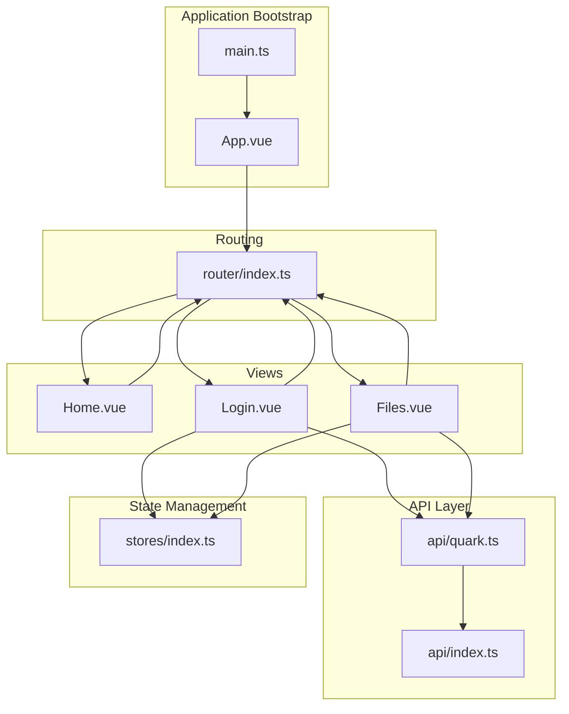
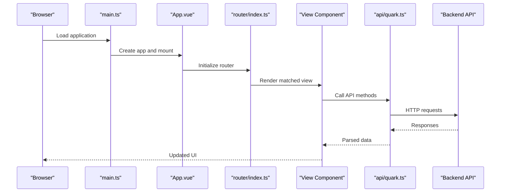
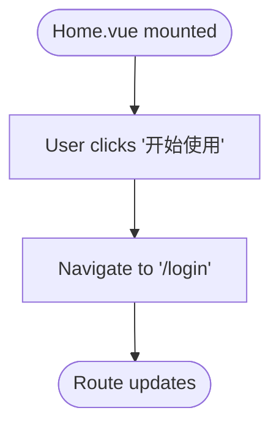
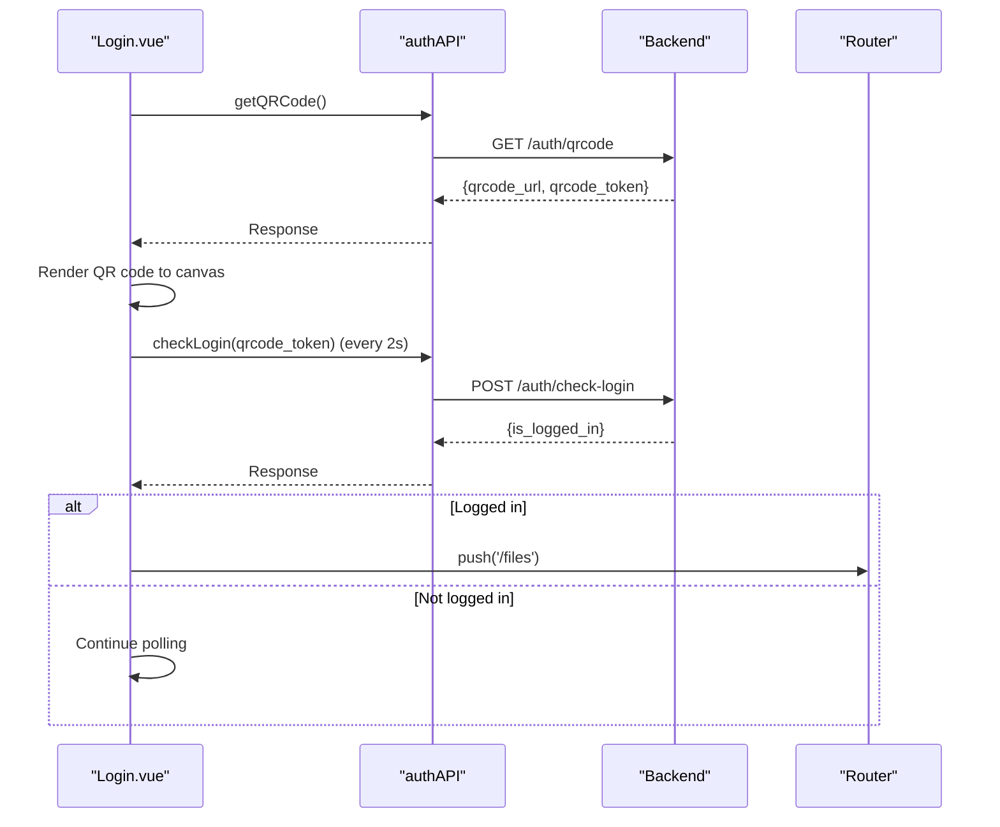
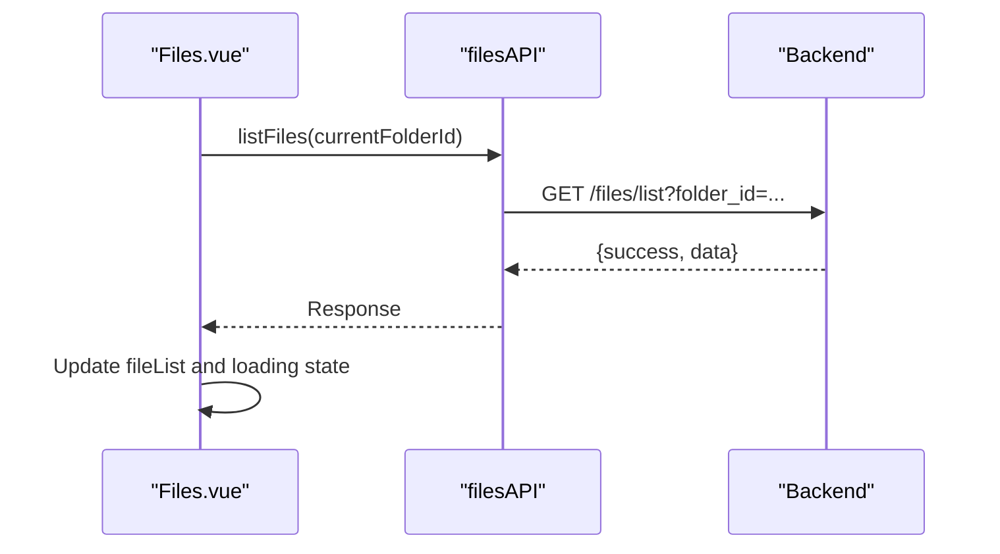
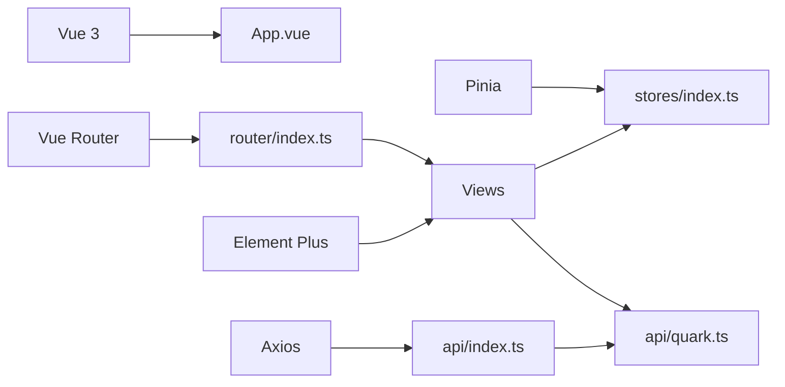

# Component Organization

<cite>
**Referenced Files in This Document**
- [Home.vue](file://frontend/src/views/Home.vue)
- [Files.vue](file://frontend/src/views/Files.vue)
- [Login.vue](file://frontend/src/views/Login.vue)
- [App.vue](file://frontend/src/App.vue)
- [main.ts](file://frontend/src/main.ts)
- [router/index.ts](file://frontend/src/router/index.ts)
- [api/quark.ts](file://frontend/src/api/quark.ts)
- [api/index.ts](file://frontend/src/api/index.ts)
- [stores/index.ts](file://frontend/src/stores/index.ts)
</cite>

## Table of Contents
1. [Introduction](#introduction)
2. [Project Structure](#project-structure)
3. [Core Components](#core-components)
4. [Architecture Overview](#architecture-overview)
5. [Detailed Component Analysis](#detailed-component-analysis)
6. [Dependency Analysis](#dependency-analysis)
7. [Performance Considerations](#performance-considerations)
8. [Troubleshooting Guide](#troubleshooting-guide)
9. [Conclusion](#conclusion)

## Introduction
This document explains the Vue component architecture and view structure of the QuarkManager application. It focuses on the component hierarchy among Home.vue, Files.vue, and Login.vue, detailing their responsibilities, composition patterns, prop passing, event handling, slots, lifecycle management, reactive data binding, computed properties, and integration with Element Plus UI components. The goal is to help beginners understand the component organization while providing sufficient technical depth for building scalable Vue applications.

## Project Structure
The frontend follows a straightforward view-centric structure:
- Views: Home.vue, Login.vue, Files.vue under frontend/src/views
- Application bootstrap: App.vue and main.ts
- Routing: frontend/src/router/index.ts
- API layer: frontend/src/api/quark.ts and frontend/src/api/index.ts
- State management: frontend/src/stores/index.ts (Pinia)

**Diagram sources**
- [main.ts:1-23](file://frontend/src/main.ts#L1-L23)
- [App.vue:1-23](file://frontend/src/App.vue#L1-L23)
- [router/index.ts:1-35](file://frontend/src/router/index.ts#L1-L35)
- [Home.vue:1-83](file://frontend/src/views/Home.vue#L1-L83)
- [Login.vue:1-290](file://frontend/src/views/Login.vue#L1-L290)
- [Files.vue:1-264](file://frontend/src/views/Files.vue#L1-L264)
- [api/quark.ts:1-125](file://frontend/src/api/quark.ts#L1-L125)
- [api/index.ts:1-30](file://frontend/src/api/index.ts#L1-L30)
- [stores/index.ts:1-23](file://frontend/src/stores/index.ts#L1-L23)

**Section sources**
- [main.ts:1-23](file://frontend/src/main.ts#L1-L23)
- [App.vue:1-23](file://frontend/src/App.vue#L1-L23)
- [router/index.ts:1-35](file://frontend/src/router/index.ts#L1-L35)

## Core Components
This section documents the responsibilities and key behaviors of the three primary views.

- Home.vue
  - Purpose: Entry landing page with branding and navigation to the login route.
  - Composition: Uses Element Plus container layout (el-container, el-header, el-main) and a primary button to navigate to /login.
  - Lifecycle: No mounted hook; relies on router navigation.
  - Styling: Scoped styles define gradient backgrounds and centered welcome card.

- Login.vue
  - Purpose: Authentication entry point supporting two modes:
    - QR code login: Generates a QR code, renders it to a canvas, polls backend for login status, and navigates to /files upon success.
    - Cookie login: Submits raw cookie text to backend for authentication.
  - Composition: Uses Element Plus tabs, forms, cards, icons, messages, and links. Implements reactive state for loading, errors, and polling timers.
  - Lifecycle: Mounted to generate QR code automatically; unmounted to clean up polling.
  - Events: Button clicks trigger actions; router navigation on successful login.

- Files.vue
  - Purpose: File browser and manager with breadcrumb navigation, upload, refresh, logout, and CRUD-like operations.
  - Composition: Uses Element Plus header, main, table, empty, icons, buttons, and message boxes. Implements path navigation and file listing.
  - Lifecycle: Mounted to load initial file list.
  - Reactive data: Tracks loading state, current folder ID, path list, and file list.
  - Computed: Determines whether the back button is enabled based on path length.
  - Events: Row double-click opens folders; action buttons trigger operations.

**Section sources**
- [Home.vue:1-83](file://frontend/src/views/Home.vue#L1-L83)
- [Login.vue:1-290](file://frontend/src/views/Login.vue#L1-L290)
- [Files.vue:1-264](file://frontend/src/views/Files.vue#L1-L264)

## Architecture Overview
The application follows a classic SPA routing model:
- App.vue wraps the application with Element Plus locale configuration and exposes router-view.
- main.ts initializes Vue, Pinia, Element Plus, registers icons globally, and mounts the app.
- router/index.ts defines routes for Home, Login, and Files, with dynamic imports for lazy loading.
- API layer abstracts backend communication via axios with interceptors and typed interfaces.
- Stores manage global state (e.g., login status and user info).

**Diagram sources**
- [main.ts:1-23](file://frontend/src/main.ts#L1-L23)
- [App.vue:1-23](file://frontend/src/App.vue#L1-L23)
- [router/index.ts:1-35](file://frontend/src/router/index.ts#L1-L35)
- [api/quark.ts:1-125](file://frontend/src/api/quark.ts#L1-L125)

## Detailed Component Analysis

### Home.vue Analysis
- Responsibilities
  - Present brand identity and call-to-action to log in.
  - Navigate to the Login view on user interaction.
- Composition patterns
  - Uses Element Plus layout primitives for header and main area.
  - Scoped styles encapsulate presentation.
- Event handling
  - Button click triggers programmatic navigation to /login.
- Slots
  - Uses named template slot for card header in a later component; Home.vue does not use slots.
- Lifecycle management
  - No lifecycle hooks; relies on router navigation.
- Reactive data and computed properties
  - No reactive refs or computed properties in this component.

**Diagram sources**
- [Home.vue:15](file://frontend/src/views/Home.vue#L15)

**Section sources**
- [Home.vue:1-83](file://frontend/src/views/Home.vue#L1-L83)

### Login.vue Analysis
- Responsibilities
  - Provide two authentication modes:
    - QR code login: Generate QR code, render to canvas, poll backend for login status, and redirect on success.
    - Cookie login: Submit cookie string to backend for authentication.
- Composition patterns
  - Tabs for mode switching; form controls for cookie input; card layout for content.
  - Uses Element Plus icons, message, and link components.
- Prop passing
  - No props passed to child components; uses local reactive state.
- Event handling
  - Button click handlers for generating QR code, refreshing QR code, and logging in via cookie.
  - Tab change sets active tab state.
- Slots
  - Uses named template slot for card header.
- Lifecycle management
  - onMounted: Auto-generates QR code on mount.
  - onUnmounted: Clears polling timer to prevent memory leaks.
- Reactive data and computed properties
  - Refs: activeTab, loading, error, qrcodeToken, checkingLogin, cookieForm.
  - Computed: None; logic is handled via refs and watchers implicitly through timers.
- Integration with Element Plus
  - Icons, message, link, tabs, tab pane, card, form, form items, input, button.
- API integration
  - Calls authAPI methods for QR code generation, login checks, and cookie login.

**Diagram sources**
- [Login.vue:84-176](file://frontend/src/views/Login.vue#L84-L176)
- [api/quark.ts:55-75](file://frontend/src/api/quark.ts#L55-L75)

**Section sources**
- [Login.vue:1-290](file://frontend/src/views/Login.vue#L1-L290)
- [api/quark.ts:1-125](file://frontend/src/api/quark.ts#L1-L125)

### Files.vue Analysis
- Responsibilities
  - Display hierarchical file listing with breadcrumb navigation.
  - Allow folder traversal, refresh, logout, and placeholder actions (upload/share).
- Composition patterns
  - Uses Element Plus container, header, main, table, table columns, icon, empty, and button.
  - Uses scoped slots to customize table cell rendering.
- Prop passing
  - No props passed to child components; uses local reactive state.
- Event handling
  - Header actions: upload, create folder, refresh, logout.
  - Table row double-click: open folder.
  - Action buttons: download, share, delete.
- Slots
  - Uses default scoped slot in table columns to render icons and names.
- Lifecycle management
  - onMounted: Loads initial file list.
- Reactive data and computed properties
  - Refs: loading, currentFolderId, pathList, fileList.
  - Computed: canGoBack derived from pathList length.
- Integration with Element Plus
  - Icons, table, table-column, empty, button, message, message box, breadcrumb.
- API integration
  - Calls filesAPI methods for listing, creating folders, deleting files, renaming, moving, searching, storage info, and downloading URLs.

**Diagram sources**
- [Files.vue:89-104](file://frontend/src/views/Files.vue#L89-L104)
- [api/quark.ts:77-124](file://frontend/src/api/quark.ts#L77-L124)

**Section sources**
- [Files.vue:1-264](file://frontend/src/views/Files.vue#L1-L264)
- [api/quark.ts:1-125](file://frontend/src/api/quark.ts#L1-L125)

### Conceptual Overview
- Component hierarchy
  - App.vue hosts router-view and provides global UI configuration.
  - router/index.ts maps routes to lazy-loaded views.
  - Views are leaf components responsible for specific user flows.
- Data flow
  - Views call API layer functions exported from api/quark.ts.
  - API layer uses axios configured in api/index.ts with interceptors.
  - State management via Pinia stores can be integrated to centralize login status and user info.
- Reusability patterns
  - Current views are self-contained; reusable components can be introduced later (e.g., a generic dialog component for confirmations).
  - Custom component creation can leverage existing Element Plus components and follow the same reactive patterns shown in the views.

[No sources needed since this section doesn't analyze specific source files]

## Dependency Analysis
- Runtime dependencies
  - Vue 3, Vue Router, Pinia, Element Plus, Axios, QRCode, Element Plus icons.
- Internal dependencies
  - Views depend on router for navigation and on API layer for data.
  - API layer depends on axios base configuration.
  - Stores provide global state for user session.

**Diagram sources**
- [package.json:11-29](file://frontend/package.json#L11-L29)
- [router/index.ts:1-35](file://frontend/src/router/index.ts#L1-L35)
- [api/index.ts:1-30](file://frontend/src/api/index.ts#L1-L30)
- [api/quark.ts:1-125](file://frontend/src/api/quark.ts#L1-L125)
- [stores/index.ts:1-23](file://frontend/src/stores/index.ts#L1-L23)

**Section sources**
- [package.json:1-31](file://frontend/package.json#L1-L31)
- [router/index.ts:1-35](file://frontend/src/router/index.ts#L1-L35)
- [api/index.ts:1-30](file://frontend/src/api/index.ts#L1-L30)
- [api/quark.ts:1-125](file://frontend/src/api/quark.ts#L1-L125)
- [stores/index.ts:1-23](file://frontend/src/stores/index.ts#L1-L23)

## Performance Considerations
- Lazy loading
  - Routes dynamically import views to reduce initial bundle size.
- Reactive updates
  - Prefer computed properties for derived data (e.g., canGoBack) to minimize unnecessary recalculations.
- API calls
  - Debounce or throttle frequent actions; cache small datasets locally if appropriate.
- Rendering
  - Use virtualized lists for large datasets; keep scoped styles minimal.
- Memory management
  - Clear timers and subscriptions in onUnmounted hooks (as seen in Login.vue).

[No sources needed since this section provides general guidance]

## Troubleshooting Guide
- Navigation issues
  - Verify routes exist and names match navigation targets.
  - Ensure router-view is present in App.vue.
- API connectivity
  - Confirm baseURL and interceptors in api/index.ts.
  - Check response parsing and error handling in API layer.
- Authentication flow
  - Validate QR code polling interval and token expiration handling.
  - Ensure cleanup of timers on component unmount.
- UI rendering
  - Confirm Element Plus is installed and icons are registered globally.
  - Verify scoped styles do not leak into unexpected areas.

**Section sources**
- [router/index.ts:1-35](file://frontend/src/router/index.ts#L1-L35)
- [api/index.ts:1-30](file://frontend/src/api/index.ts#L1-L30)
- [Login.vue:178-184](file://frontend/src/views/Login.vue#L178-L184)

## Conclusion
The component organization centers around three focused views that integrate with Element Plus and a clean API layer. Home.vue serves as an entry point, Login.vue manages authentication with QR code polling, and Files.vue provides a file browsing experience. The architecture emphasizes separation of concerns, reactive data patterns, and reusable UI components. Extending the system with shared components and centralized state via Pinia will further improve maintainability and scalability.