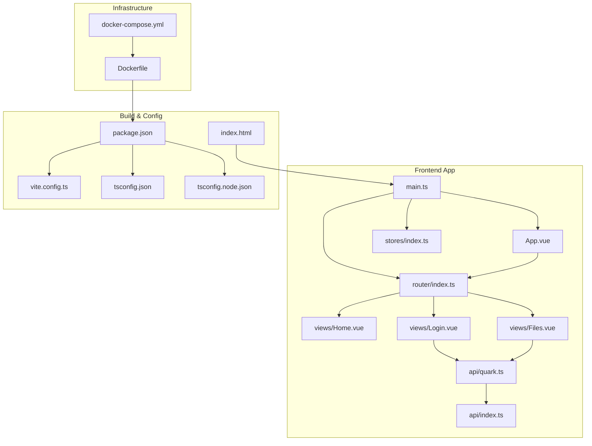
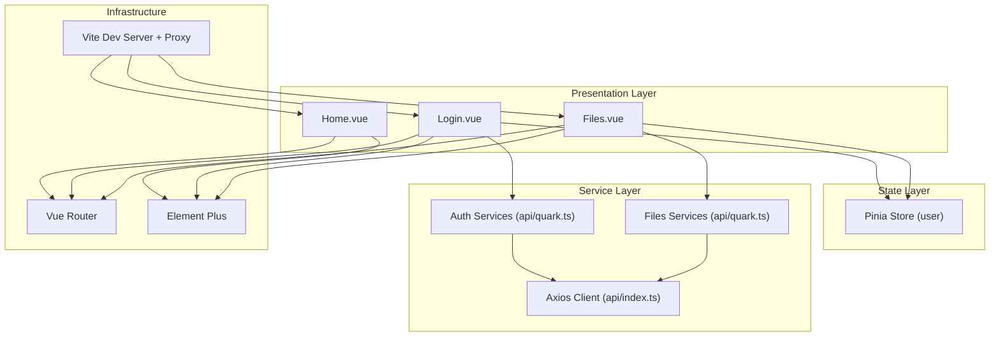
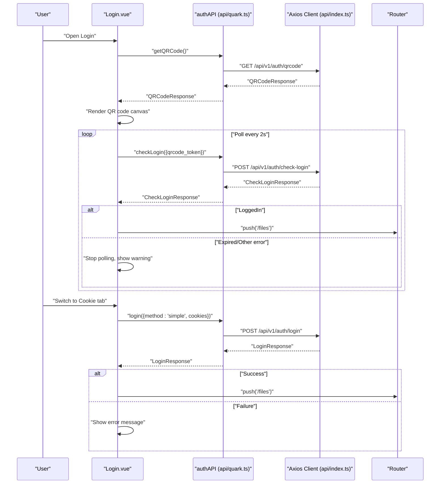
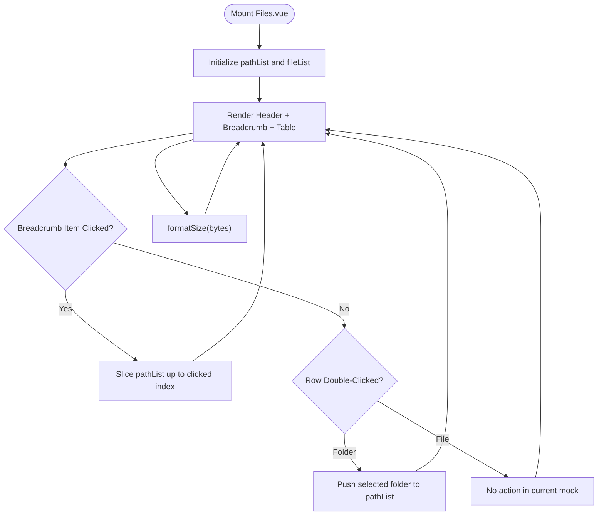
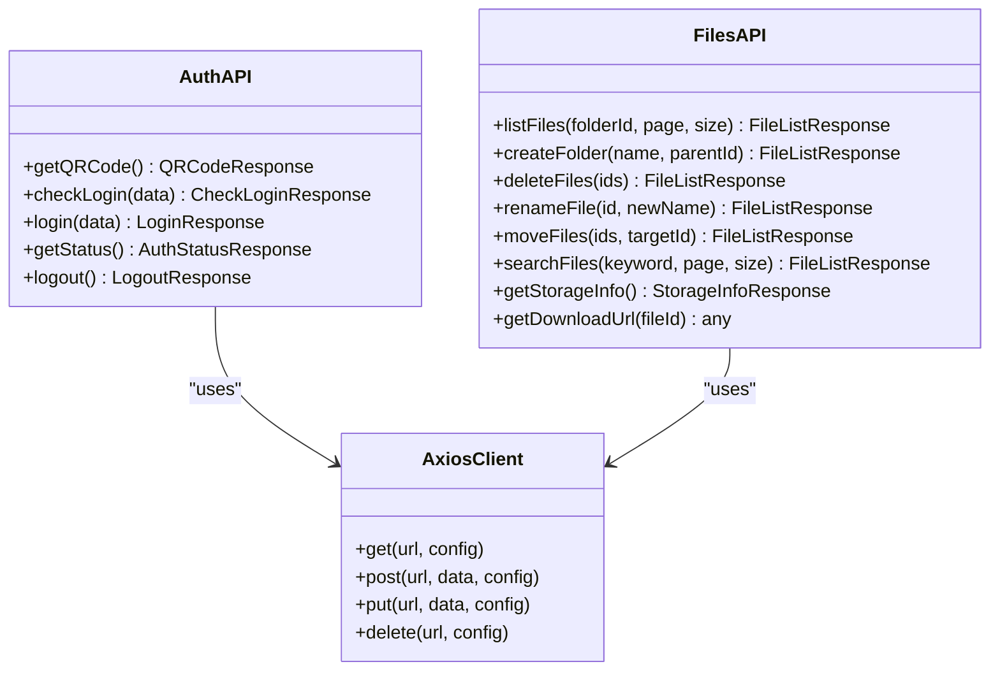
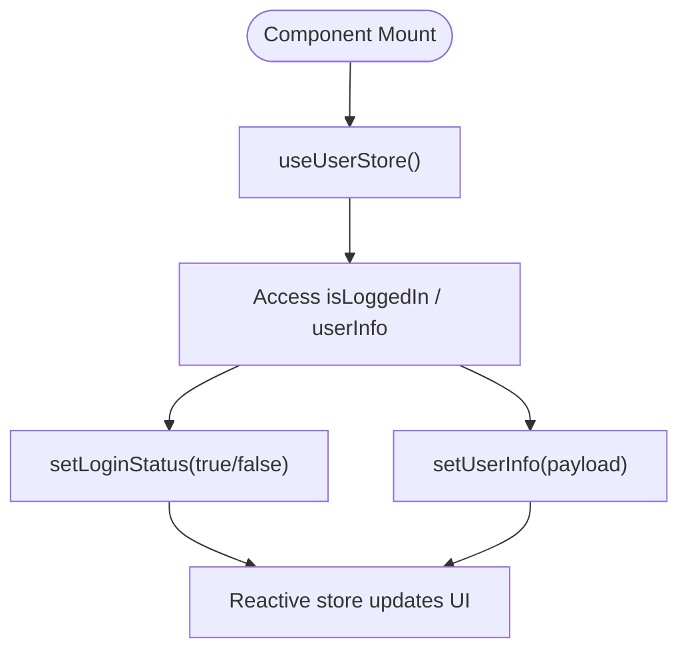
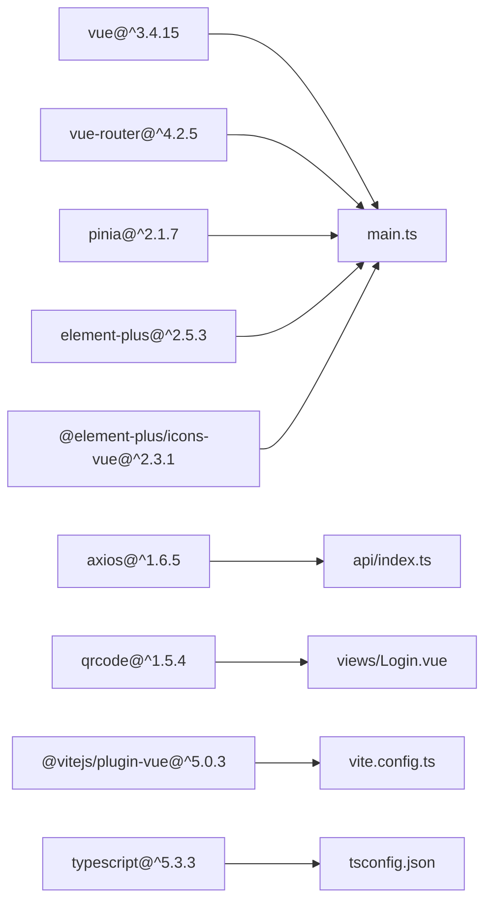
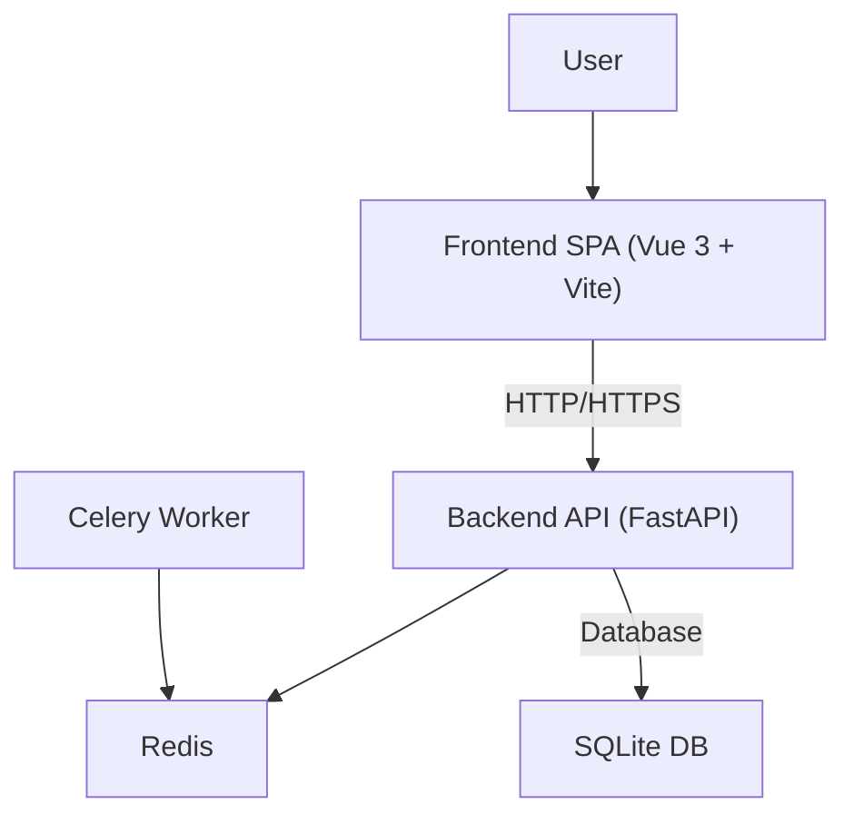

# Frontend Architecture

<cite>
**Referenced Files in This Document**
- [main.ts](file://frontend/src/main.ts)
- [App.vue](file://frontend/src/App.vue)
- [router/index.ts](file://frontend/src/router/index.ts)
- [stores/index.ts](file://frontend/src/stores/index.ts)
- [api/index.ts](file://frontend/src/api/index.ts)
- [api/quark.ts](file://frontend/src/api/quark.ts)
- [views/Home.vue](file://frontend/src/views/Home.vue)
- [views/Login.vue](file://frontend/src/views/Login.vue)
- [views/Files.vue](file://frontend/src/views/Files.vue)
- [package.json](file://frontend/package.json)
- [vite.config.ts](file://frontend/vite.config.ts)
- [tsconfig.json](file://frontend/tsconfig.json)
- [tsconfig.node.json](file://frontend/tsconfig.node.json)
- [index.html](file://frontend/index.html)
- [Dockerfile](file://frontend/Dockerfile)
- [docker-compose.yml](file://docker-compose.yml)
</cite>

## Table of Contents
1. [Introduction](#introduction)
2. [Project Structure](#project-structure)
3. [Core Components](#core-components)
4. [Architecture Overview](#architecture-overview)
5. [Detailed Component Analysis](#detailed-component-analysis)
6. [Dependency Analysis](#dependency-analysis)
7. [Performance Considerations](#performance-considerations)
8. [Troubleshooting Guide](#troubleshooting-guide)
9. [Conclusion](#conclusion)
10. [Appendices](#appendices)

## Introduction
This document describes the frontend architecture of a Vue 3 + TypeScript single-page application. It focuses on component-based design, state management with Pinia, routing with Vue Router, and API integration patterns. The system integrates Element Plus for UI components, uses Vite for development and build, and follows Composition API patterns with TypeScript. Cross-cutting concerns include error handling, loading states, form validation, and accessibility. The document also outlines infrastructure requirements, performance considerations, and responsive design patterns, along with system context diagrams showing user interactions, frontend components, and backend API relationships.

## Project Structure
The frontend is organized around a clear separation of concerns:
- Application bootstrap and plugin registration in main.ts
- Root application wrapper and locale provider in App.vue
- Routing configuration in router/index.ts
- Global state management via Pinia stores in stores/index.ts
- API client and typed service layer in api/index.ts and api/quark.ts
- Feature views in views/ (Home, Login, Files)
- Build and tooling configuration in package.json, vite.config.ts, tsconfig.json, tsconfig.node.json, and index.html
- Containerization and orchestration via Dockerfile and docker-compose.yml

**Diagram sources**
- [main.ts](file://frontend/src/main.ts)
- [App.vue](file://frontend/src/App.vue)
- [router/index.ts](file://frontend/src/router/index.ts)
- [stores/index.ts](file://frontend/src/stores/index.ts)
- [api/index.ts](file://frontend/src/api/index.ts)
- [api/quark.ts](file://frontend/src/api/quark.ts)
- [views/Home.vue](file://frontend/src/views/Home.vue)
- [views/Login.vue](file://frontend/src/views/Login.vue)
- [views/Files.vue](file://frontend/src/views/Files.vue)
- [package.json](file://frontend/package.json)
- [vite.config.ts](file://frontend/vite.config.ts)
- [tsconfig.json](file://frontend/tsconfig.json)
- [tsconfig.node.json](file://frontend/tsconfig.node.json)
- [index.html](file://frontend/index.html)
- [Dockerfile](file://frontend/Dockerfile)
- [docker-compose.yml](file://docker-compose.yml)

**Section sources**
- [main.ts](file://frontend/src/main.ts)
- [router/index.ts](file://frontend/src/router/index.ts)
- [stores/index.ts](file://frontend/src/stores/index.ts)
- [api/index.ts](file://frontend/src/api/index.ts)
- [api/quark.ts](file://frontend/src/api/quark.ts)
- [views/Home.vue](file://frontend/src/views/Home.vue)
- [views/Login.vue](file://frontend/src/views/Login.vue)
- [views/Files.vue](file://frontend/src/views/Files.vue)
- [package.json](file://frontend/package.json)
- [vite.config.ts](file://frontend/vite.config.ts)
- [tsconfig.json](file://frontend/tsconfig.json)
- [tsconfig.node.json](file://frontend/tsconfig.node.json)
- [index.html](file://frontend/index.html)
- [Dockerfile](file://frontend/Dockerfile)
- [docker-compose.yml](file://docker-compose.yml)

## Core Components
- Application bootstrap and plugin wiring:
  - Creates the Vue app instance, registers Pinia, Vue Router, and Element Plus, and mounts to the DOM.
  - Registers Element Plus icons globally for convenient icon usage across components.
- Root application wrapper:
  - Provides Element Plus locale configuration and renders the active route via router-view.
- Routing:
  - Defines routes for Home, Login, and Files with lazy-loaded components and per-route titles.
  - Implements a global navigation guard to update document titles based on route metadata.
- State management:
  - A minimal Pinia store exposes login status and user info with setters, suitable for session state.
- API layer:
  - Centralized Axios instance configured with base URL, timeout, and request/response interceptors.
  - Typed service module exports convenience methods for authentication and file operations.
- Views:
  - Home: Welcome screen with navigation to Login.
  - Login: Dual-tab login (QR code and Cookie) with polling, error handling, and success redirection.
  - Files: File listing with breadcrumb navigation, upload/new folder actions, and file operations placeholders.

**Section sources**
- [main.ts](file://frontend/src/main.ts)
- [App.vue](file://frontend/src/App.vue)
- [router/index.ts](file://frontend/src/router/index.ts)
- [stores/index.ts](file://frontend/src/stores/index.ts)
- [api/index.ts](file://frontend/src/api/index.ts)
- [api/quark.ts](file://frontend/src/api/quark.ts)
- [views/Home.vue](file://frontend/src/views/Home.vue)
- [views/Login.vue](file://frontend/src/views/Login.vue)
- [views/Files.vue](file://frontend/src/views/Files.vue)

## Architecture Overview
The frontend follows a layered architecture:
- Presentation layer: Vue components (views) driven by Composition API and TypeScript.
- State layer: Pinia stores for global reactive state.
- Service layer: Axios-based API client with typed endpoints.
- Infrastructure layer: Vite dev server with proxy, TypeScript compilation, and containerized deployment.

**Diagram sources**
- [views/Home.vue](file://frontend/src/views/Home.vue)
- [views/Login.vue](file://frontend/src/views/Login.vue)
- [views/Files.vue](file://frontend/src/views/Files.vue)
- [stores/index.ts](file://frontend/src/stores/index.ts)
- [api/index.ts](file://frontend/src/api/index.ts)
- [api/quark.ts](file://frontend/src/api/quark.ts)
- [router/index.ts](file://frontend/src/router/index.ts)
- [main.ts](file://frontend/src/main.ts)

## Detailed Component Analysis

### Authentication Flow (Login.vue)
The Login view implements two authentication modes:
- QR code login:
  - Generates a QR code URL via authAPI.getQRCode.
  - Renders the QR code onto a canvas.
  - Polls authAPI.checkLogin periodically until login succeeds or expires.
  - On success, navigates to Files view.
- Cookie login:
  - Submits a simple login request via authAPI.login with method and cookies payload.
  - Redirects on success.

**Diagram sources**
- [views/Login.vue](file://frontend/src/views/Login.vue)
- [api/quark.ts](file://frontend/src/api/quark.ts)
- [api/index.ts](file://frontend/src/api/index.ts)
- [router/index.ts](file://frontend/src/router/index.ts)

**Section sources**
- [views/Login.vue](file://frontend/src/views/Login.vue)
- [api/quark.ts](file://frontend/src/api/quark.ts)
- [api/index.ts](file://frontend/src/api/index.ts)

### File Listing and Navigation (Files.vue)
The Files view presents a breadcrumb-based navigation and a table of items:
- Breadcrumb navigation updates path segments on click.
- Double-clicking a folder navigates deeper.
- File size formatting is handled locally.
- Placeholder actions for upload, create folder, download, share, and delete are present.

**Diagram sources**
- [views/Files.vue](file://frontend/src/views/Files.vue)

**Section sources**
- [views/Files.vue](file://frontend/src/views/Files.vue)

### API Service Layer (typed endpoints)
The API module defines typed request/response interfaces and exports convenience functions for:
- Authentication: getQRCode, checkLogin, login, getStatus, logout
- Files: listFiles, createFolder, deleteFiles, renameFile, moveFiles, searchFiles, getStorageInfo, getDownloadUrl

**Diagram sources**
- [api/quark.ts](file://frontend/src/api/quark.ts)
- [api/index.ts](file://frontend/src/api/index.ts)

**Section sources**
- [api/quark.ts](file://frontend/src/api/quark.ts)
- [api/index.ts](file://frontend/src/api/index.ts)

### State Management (Pinia Store)
The user store exposes:
- Reactive flags: isLoggedIn
- Reactive object: userInfo
- Methods: setLoginStatus(status), setUserInfo(info)

**Diagram sources**
- [stores/index.ts](file://frontend/src/stores/index.ts)

**Section sources**
- [stores/index.ts](file://frontend/src/stores/index.ts)

## Dependency Analysis
- Runtime dependencies include Vue 3, Vue Router, Pinia, Element Plus, Axios, and QRCode generation.
- Build-time dependencies include Vite, TypeScript, ESLint, and Vue plugin for Vite.
- Aliasing and path resolution are configured to simplify imports with @/.

**Diagram sources**
- [package.json](file://frontend/package.json)
- [main.ts](file://frontend/src/main.ts)
- [api/index.ts](file://frontend/src/api/index.ts)
- [views/Login.vue](file://frontend/src/views/Login.vue)
- [vite.config.ts](file://frontend/vite.config.ts)
- [tsconfig.json](file://frontend/tsconfig.json)

**Section sources**
- [package.json](file://frontend/package.json)
- [vite.config.ts](file://frontend/vite.config.ts)
- [tsconfig.json](file://frontend/tsconfig.json)

## Performance Considerations
- Lazy-loaded route components reduce initial bundle size.
- Axios interceptor transforms responses to data-only, simplifying consumers.
- Scoped styles minimize CSS side effects; avoid deep selectors where possible.
- Canvas rendering for QR code is efficient but ensure cleanup timers and DOM references to prevent memory leaks.
- Consider pagination and virtualization for large file lists in Files.vue.
- Enable production builds with Vite for optimized assets and tree-shaking.

## Troubleshooting Guide
Common issues and resolutions:
- Backend connectivity:
  - Verify Vite proxy configuration for /api to backend host/port.
  - Confirm backend is reachable at http://localhost:8000 during local development.
- Authentication failures:
  - Check network tab for failed requests to /api/v1/auth endpoints.
  - Inspect error messages returned by authAPI and displayed via Element Plus notifications.
- QR code polling:
  - Ensure intervals are cleared on unmount to prevent memory leaks.
  - Handle expired tokens and show user-friendly warnings.
- TypeScript errors:
  - Run type checks via vue-tsc and fix strict mode violations.
- Build issues:
  - Clear node_modules and reinstall dependencies if package lock diverges.
  - Ensure Vite and TypeScript configurations align with bundler resolution.

**Section sources**
- [vite.config.ts](file://frontend/vite.config.ts)
- [views/Login.vue](file://frontend/src/views/Login.vue)
- [api/quark.ts](file://frontend/src/api/quark.ts)
- [tsconfig.json](file://frontend/tsconfig.json)

## Conclusion
The frontend employs a clean, modular architecture leveraging Vue 3’s Composition API, TypeScript, Pinia, and Element Plus. Routing and API services are centralized and typed, enabling maintainable and predictable interactions. The Vite-based build pipeline supports rapid iteration and production optimization. With proper error handling, loading states, and responsive design, the system delivers a robust user experience while remaining extensible for future enhancements.

## Appendices

### Technology Stack
- Core framework: Vue 3
- Routing: Vue Router
- State management: Pinia
- UI components: Element Plus
- HTTP client: Axios
- QR code generation: qrcode
- Build tool: Vite
- Language: TypeScript
- Packaging and linting: npm scripts, ESLint, vue-tsc

**Section sources**
- [package.json](file://frontend/package.json)
- [main.ts](file://frontend/src/main.ts)
- [vite.config.ts](file://frontend/vite.config.ts)
- [tsconfig.json](file://frontend/tsconfig.json)

### System Context Diagram
This diagram shows the relationship between the user, frontend SPA, backend API, and supporting services.

**Diagram sources**
- [docker-compose.yml](file://docker-compose.yml)
- [vite.config.ts](file://frontend/vite.config.ts)

### Build and Deployment Notes
- Local development:
  - Vite dev server runs on port 3000 with proxy to backend at 8000.
  - Hot reload enabled via Vite plugin for Vue.
- Production build:
  - Type-check and build via vue-tsc and Vite.
  - Serve built assets behind a reverse proxy or static hosting.
- Containerization:
  - Frontend Dockerfile installs dependencies and runs dev script.
  - docker-compose orchestrates frontend, backend, Redis, and Celery worker.

**Section sources**
- [vite.config.ts](file://frontend/vite.config.ts)
- [Dockerfile](file://frontend/Dockerfile)
- [docker-compose.yml](file://docker-compose.yml)
- [package.json](file://frontend/package.json)