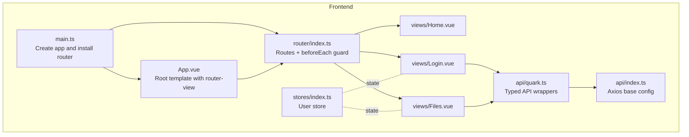
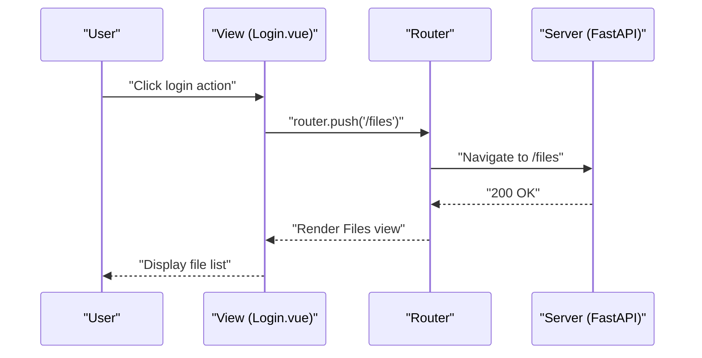
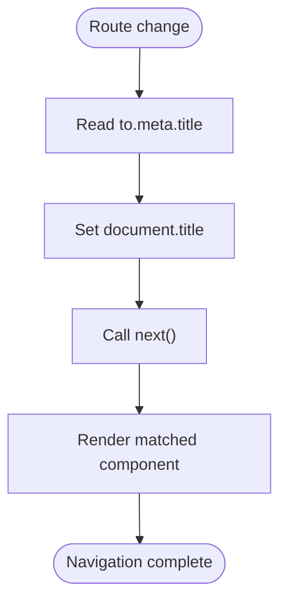
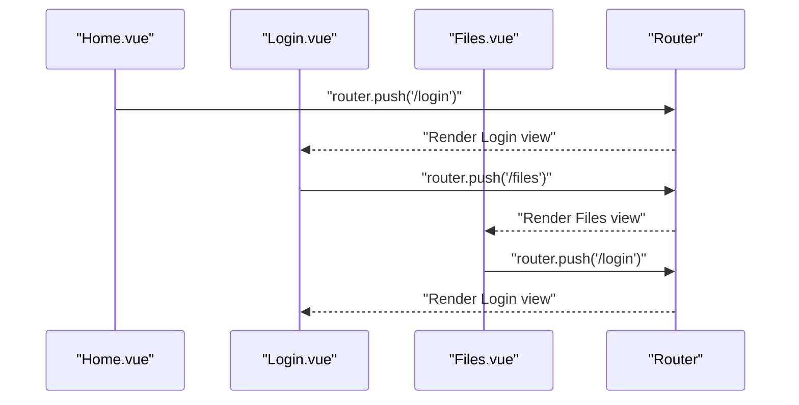
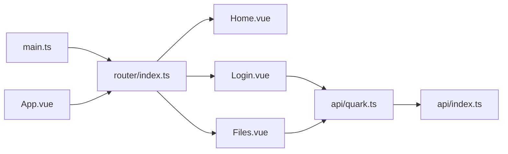

# Routing Configuration

<cite>
**Referenced Files in This Document**
- [router/index.ts](file://frontend/src/router/index.ts)
- [main.ts](file://frontend/src/main.ts)
- [App.vue](file://frontend/src/App.vue)
- [Home.vue](file://frontend/src/views/Home.vue)
- [Login.vue](file://frontend/src/views/Login.vue)
- [Files.vue](file://frontend/src/views/Files.vue)
- [stores/index.ts](file://frontend/src/stores/index.ts)
- [api/index.ts](file://frontend/src/api/index.ts)
- [api/quark.ts](file://frontend/src/api/quark.ts)
- [backend/app/api/v1/auth.py](file://backend/app/api/v1/auth.py)
- [backend/app/api/v1/files.py](file://backend/app/api/v1/files.py)
</cite>

## Table of Contents
1. [Introduction](#introduction)
2. [Project Structure](#project-structure)
3. [Core Components](#core-components)
4. [Architecture Overview](#architecture-overview)
5. [Detailed Component Analysis](#detailed-component-analysis)
6. [Dependency Analysis](#dependency-analysis)
7. [Performance Considerations](#performance-considerations)
8. [Troubleshooting Guide](#troubleshooting-guide)
9. [Conclusion](#conclusion)

## Introduction
This document explains the routing configuration system built with Vue Router in the frontend application. It covers route definitions, navigation guards, lazy-loaded components, and navigation patterns across views. It also documents how programmatic navigation is used for login flows, how route meta fields are leveraged for page titles, and how the router integrates with the application’s global state and API layer. The goal is to help both beginners and advanced developers understand how routing works and how to extend it safely.

## Project Structure
The routing system is centered around a single router configuration file that defines three routes and a global navigation guard. Views are organized under a dedicated directory and are lazily loaded to optimize initial bundle size. The application mounts the router globally and renders the active view via a router outlet.

**Diagram sources**
- [main.ts:1-23](file://frontend/src/main.ts#L1-L23)
- [App.vue:1-23](file://frontend/src/App.vue#L1-L23)
- [router/index.ts:1-35](file://frontend/src/router/index.ts#L1-L35)
- [Home.vue:1-83](file://frontend/src/views/Home.vue#L1-L83)
- [Login.vue:1-290](file://frontend/src/views/Login.vue#L1-L290)
- [Files.vue:1-264](file://frontend/src/views/Files.vue#L1-L264)
- [stores/index.ts:1-23](file://frontend/src/stores/index.ts#L1-L23)
- [api/index.ts:1-30](file://frontend/src/api/index.ts#L1-L30)
- [api/quark.ts:1-125](file://frontend/src/api/quark.ts#L1-L125)

**Section sources**
- [router/index.ts:1-35](file://frontend/src/router/index.ts#L1-L35)
- [main.ts:1-23](file://frontend/src/main.ts#L1-L23)
- [App.vue:1-23](file://frontend/src/App.vue#L1-L23)

## Core Components
- Router configuration: Defines three routes and a global navigation guard that sets the page title based on route meta.
- Lazy-loaded views: Routes use dynamic imports to load components on demand.
- Programmatic navigation: Components navigate programmatically using the router instance.
- Route meta: Used to set localized page titles for each route.
- Global app mounting: The router is installed globally and rendered via a router outlet in the root component.

Key implementation references:
- Router creation and routes: [router/index.ts:24-27](file://frontend/src/router/index.ts#L24-L27)
- Route definitions with lazy loading: [router/index.ts:3-22](file://frontend/src/router/index.ts#L3-L22)
- Global navigation guard: [router/index.ts:29-32](file://frontend/src/router/index.ts#L29-L32)
- Root outlet rendering: [App.vue:3](file://frontend/src/App.vue#L3)
- App installation of router: [main.ts:18-19](file://frontend/src/main.ts#L18-L19)

**Section sources**
- [router/index.ts:1-35](file://frontend/src/router/index.ts#L1-L35)
- [App.vue:1-23](file://frontend/src/App.vue#L1-L23)
- [main.ts:1-23](file://frontend/src/main.ts#L1-L23)

## Architecture Overview
The routing architecture follows a straightforward pattern:
- The router is created with a history mode and a static route table.
- Each route maps to a lazily loaded component.
- A global beforeEach guard updates the document title using route meta.
- Views use the router instance to navigate programmatically upon user actions.
- API calls are made through typed wrappers that communicate with backend endpoints.

**Diagram sources**
- [Login.vue:155](file://frontend/src/views/Login.vue#L155)
- [router/index.ts:29-32](file://frontend/src/router/index.ts#L29-L32)
- [backend/app/api/v1/files.py:19-35](file://backend/app/api/v1/files.py#L19-L35)

## Detailed Component Analysis

### Router Configuration and Navigation Guard
- Route table: Three routes are defined with lazy-loaded components and route meta for titles.
- History mode: Uses HTML5 history mode for clean URLs.
- Global guard: Updates the document title based on the route meta field before each navigation.

Implementation highlights:
- Route definitions: [router/index.ts:3-22](file://frontend/src/router/index.ts#L3-L22)
- Router creation: [router/index.ts:24-27](file://frontend/src/router/index.ts#L24-L27)
- Navigation guard: [router/index.ts:29-32](file://frontend/src/router/index.ts#L29-L32)

**Diagram sources**
- [router/index.ts:29-32](file://frontend/src/router/index.ts#L29-L32)

**Section sources**
- [router/index.ts:1-35](file://frontend/src/router/index.ts#L1-L35)

### Route Definitions and Lazy Loading
- Home route: Loads Home.vue lazily and sets a Chinese title in meta.
- Login route: Loads Login.vue lazily and sets a Chinese title in meta.
- Files route: Loads Files.vue lazily and sets a Chinese title in meta.

Lazy loading benefits:
- Reduces initial bundle size.
- Improves perceived performance by deferring heavy components until needed.

References:
- Route definitions: [router/index.ts:3-22](file://frontend/src/router/index.ts#L3-L22)
- View components: [Home.vue:1-83](file://frontend/src/views/Home.vue#L1-L83), [Login.vue:1-290](file://frontend/src/views/Login.vue#L1-L290), [Files.vue:1-264](file://frontend/src/views/Files.vue#L1-L264)

**Section sources**
- [router/index.ts:1-35](file://frontend/src/router/index.ts#L1-L35)

### Programmatic Navigation Patterns
- From Home to Login: The Home view navigates to the Login route when the user clicks a button.
- From Login to Files: After successful login (either via QR code polling or cookie), the Login view navigates to the Files route.
- From Files to Login: On logout, the Files view navigates back to the Login route.

References:
- Home to Login: [Home.vue:15](file://frontend/src/views/Home.vue#L15)
- Login to Files (QR code): [Login.vue:155](file://frontend/src/views/Login.vue#L155)
- Login to Files (cookie): [Login.vue:200](file://frontend/src/views/Login.vue#L200)
- Files to Login (logout): [Files.vue:206](file://frontend/src/views/Files.vue#L206)

**Diagram sources**
- [Home.vue:15](file://frontend/src/views/Home.vue#L15)
- [Login.vue:155](file://frontend/src/views/Login.vue#L155)
- [Login.vue:200](file://frontend/src/views/Login.vue#L200)
- [Files.vue:206](file://frontend/src/views/Files.vue#L206)

**Section sources**
- [Home.vue:1-83](file://frontend/src/views/Home.vue#L1-L83)
- [Login.vue:1-290](file://frontend/src/views/Login.vue#L1-L290)
- [Files.vue:1-264](file://frontend/src/views/Files.vue#L1-L264)

### Route Meta Fields and Page Titles
- Each route defines a meta object containing a localized title.
- The global beforeEach guard reads the meta title and sets the document title accordingly.

References:
- Route meta definitions: [router/index.ts:8](file://frontend/src/router/index.ts#L8), [router/index.ts:14](file://frontend/src/router/index.ts#L14), [router/index.ts:20](file://frontend/src/router/index.ts#L20)
- Global title update: [router/index.ts:30](file://frontend/src/router/index.ts#L30)

**Section sources**
- [router/index.ts:1-35](file://frontend/src/router/index.ts#L1-L35)

### Relationship Between Routes and Components
- Router maps route names to lazy-loaded components.
- The root component renders the active view via a router outlet.
- Views use the router instance to navigate programmatically.

References:
- Router outlet: [App.vue:3](file://frontend/src/App.vue#L3)
- Router installation: [main.ts:18-19](file://frontend/src/main.ts#L18-L19)
- Route-to-component mapping: [router/index.ts:3-22](file://frontend/src/router/index.ts#L3-L22)

**Section sources**
- [App.vue:1-23](file://frontend/src/App.vue#L1-L23)
- [main.ts:1-23](file://frontend/src/main.ts#L1-L23)
- [router/index.ts:1-35](file://frontend/src/router/index.ts#L1-L35)

### API Integration and Backend Endpoints
- Frontend API wrappers call backend endpoints under /api/v1.
- Authentication endpoints support QR code login and cookie-based login.
- File management endpoints support listing, creating folders, deleting, renaming, moving, searching, and downloading.

References:
- Axios base config: [api/index.ts:3-9](file://frontend/src/api/index.ts#L3-L9)
- Auth API wrappers: [api/quark.ts:55-75](file://frontend/src/api/quark.ts#L55-L75)
- Files API wrappers: [api/quark.ts:77-124](file://frontend/src/api/quark.ts#L77-L124)
- Backend auth endpoints: [backend/app/api/v1/auth.py:18-106](file://backend/app/api/v1/auth.py#L18-L106)
- Backend files endpoints: [backend/app/api/v1/files.py:19-149](file://backend/app/api/v1/files.py#L19-L149)

**Section sources**
- [api/index.ts:1-30](file://frontend/src/api/index.ts#L1-L30)
- [api/quark.ts:1-125](file://frontend/src/api/quark.ts#L1-L125)
- [backend/app/api/v1/auth.py:1-107](file://backend/app/api/v1/auth.py#L1-L107)
- [backend/app/api/v1/files.py:1-150](file://backend/app/api/v1/files.py#L1-L150)

### State Management and Route Protection
- The application includes a Pinia store for user state (login status and user info).
- While route protection is not currently implemented in the router, the store can be used to gate access to protected views.
- A practical approach would be to check the store in the navigation guard and redirect unauthenticated users to the login route.

References:
- User store definition: [stores/index.ts:4-22](file://frontend/src/stores/index.ts#L4-L22)

**Section sources**
- [stores/index.ts:1-23](file://frontend/src/stores/index.ts#L1-L23)

## Dependency Analysis
The routing system depends on the following relationships:
- main.ts installs the router globally.
- App.vue renders the active view via router-view.
- router/index.ts defines routes and a global guard.
- Views depend on the router instance for programmatic navigation.
- API wrappers depend on the axios base configuration.

**Diagram sources**
- [main.ts:18-19](file://frontend/src/main.ts#L18-L19)
- [App.vue:3](file://frontend/src/App.vue#L3)
- [router/index.ts:3-22](file://frontend/src/router/index.ts#L3-L22)
- [api/quark.ts:1-125](file://frontend/src/api/quark.ts#L1-L125)
- [api/index.ts:1-30](file://frontend/src/api/index.ts#L1-L30)

**Section sources**
- [main.ts:1-23](file://frontend/src/main.ts#L1-L23)
- [App.vue:1-23](file://frontend/src/App.vue#L1-L23)
- [router/index.ts:1-35](file://frontend/src/router/index.ts#L1-L35)
- [api/quark.ts:1-125](file://frontend/src/api/quark.ts#L1-L125)
- [api/index.ts:1-30](file://frontend/src/api/index.ts#L1-L30)

## Performance Considerations
- Lazy loading: Routes use dynamic imports to defer loading of views until navigation occurs, reducing initial bundle size.
- Minimal global guard: The guard performs a simple title update, avoiding heavy computations during navigation.
- Efficient API calls: API wrappers encapsulate request/response handling and centralize base URL configuration.

Recommendations:
- Add route-level guards for protected routes using the user store.
- Consider caching frequently accessed lists (e.g., file lists) to reduce network requests.
- Use keep-alive for views that are revisited often to preserve state.

**Section sources**
- [router/index.ts:3-22](file://frontend/src/router/index.ts#L3-L22)
- [router/index.ts:29-32](file://frontend/src/router/index.ts#L29-L32)
- [api/index.ts:1-30](file://frontend/src/api/index.ts#L1-L30)

## Troubleshooting Guide
Common routing issues and resolutions:
- Incorrect route names: Ensure route names match those used in programmatic navigation.
- Missing router outlet: Verify that the root component renders router-view.
- Navigation guard conflicts: Confirm the global guard does not block legitimate navigation.
- Lazy loading failures: Check that dynamic imports resolve to existing component paths.
- API mismatch: Ensure frontend API wrappers match backend endpoint paths and parameters.

Debugging techniques:
- Use browser devtools to inspect the current route and meta fields.
- Temporarily log navigation events in the global guard.
- Verify axios base URL and interceptors are configured correctly.

References:
- Router outlet: [App.vue:3](file://frontend/src/App.vue#L3)
- Global guard: [router/index.ts:29-32](file://frontend/src/router/index.ts#L29-L32)
- Axios base config: [api/index.ts:3-9](file://frontend/src/api/index.ts#L3-L9)

**Section sources**
- [App.vue:1-23](file://frontend/src/App.vue#L1-L23)
- [router/index.ts:1-35](file://frontend/src/router/index.ts#L1-L35)
- [api/index.ts:1-30](file://frontend/src/api/index.ts#L1-L30)

## Conclusion
The routing configuration establishes a clean, extensible foundation for the application. Routes are clearly defined with lazy-loaded components and a global navigation guard that enhances UX by setting meaningful page titles. Programmatic navigation is used effectively to move between views, and the API layer is cleanly separated from routing concerns. Extending the system involves adding route guards using the user store, introducing dynamic parameters where needed, and leveraging meta fields for richer navigation experiences.