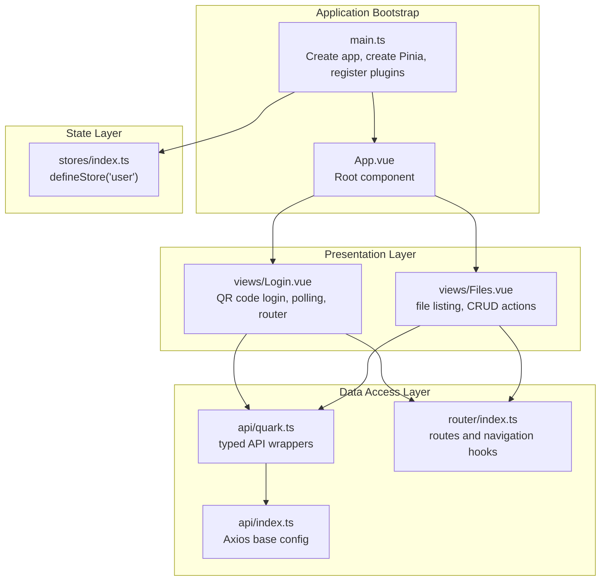
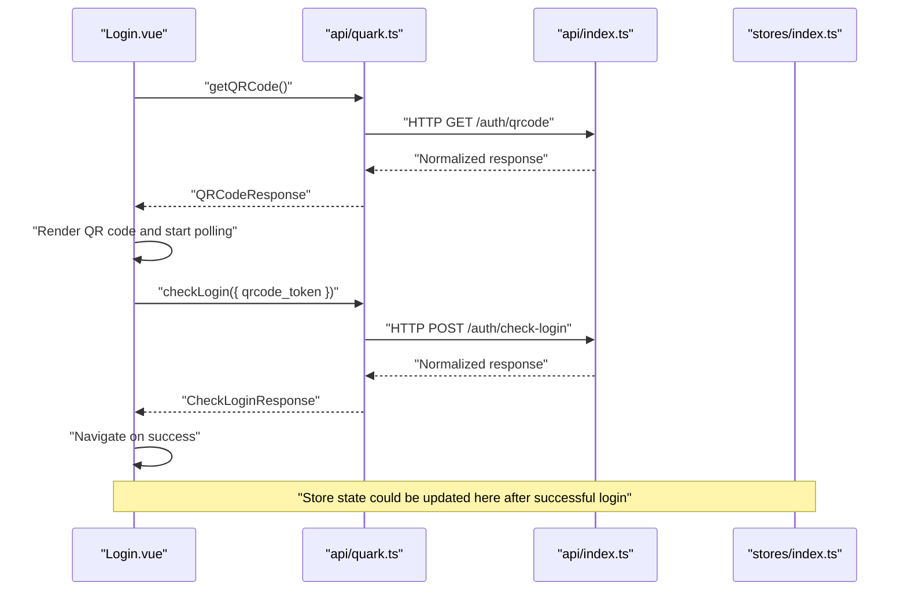
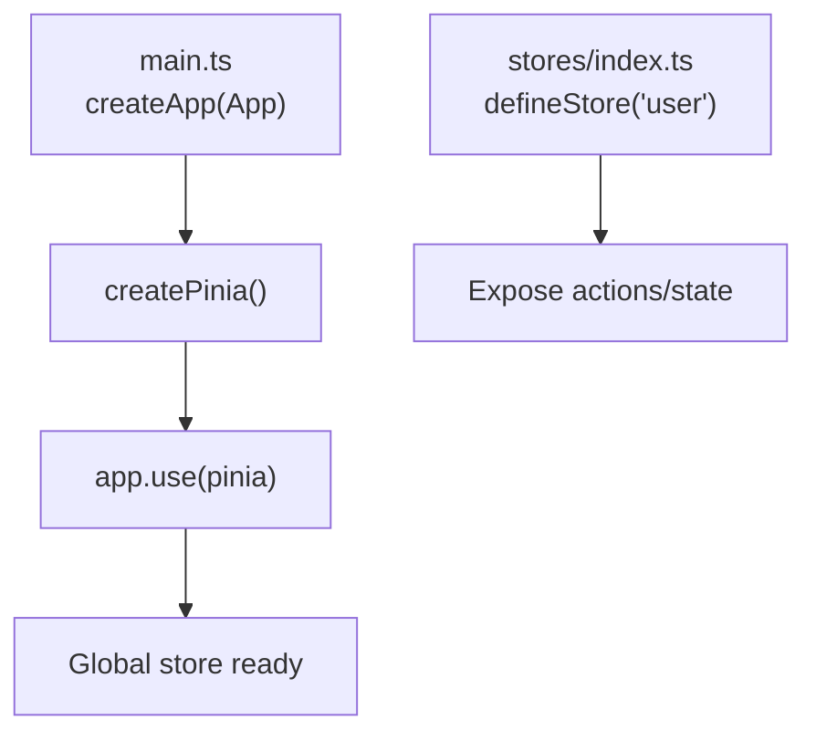
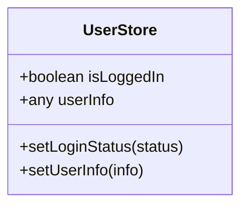
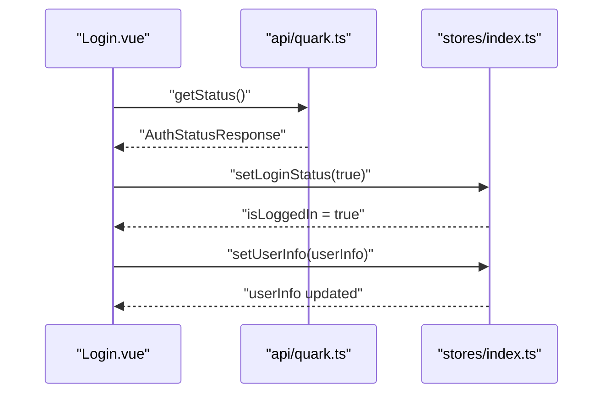
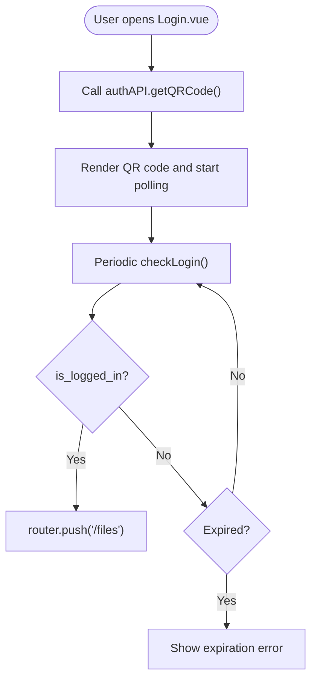
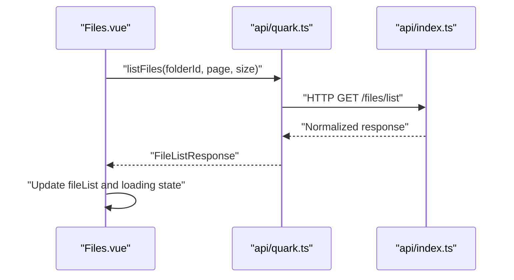
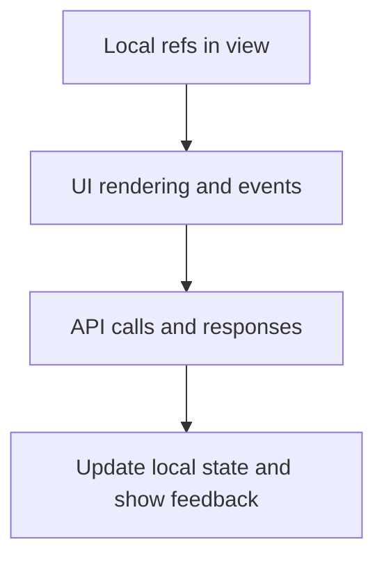
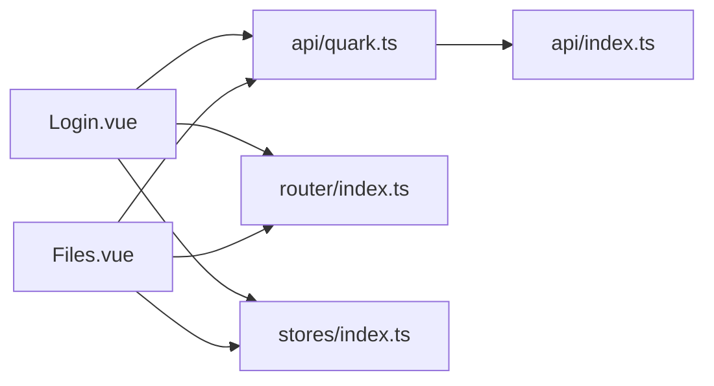
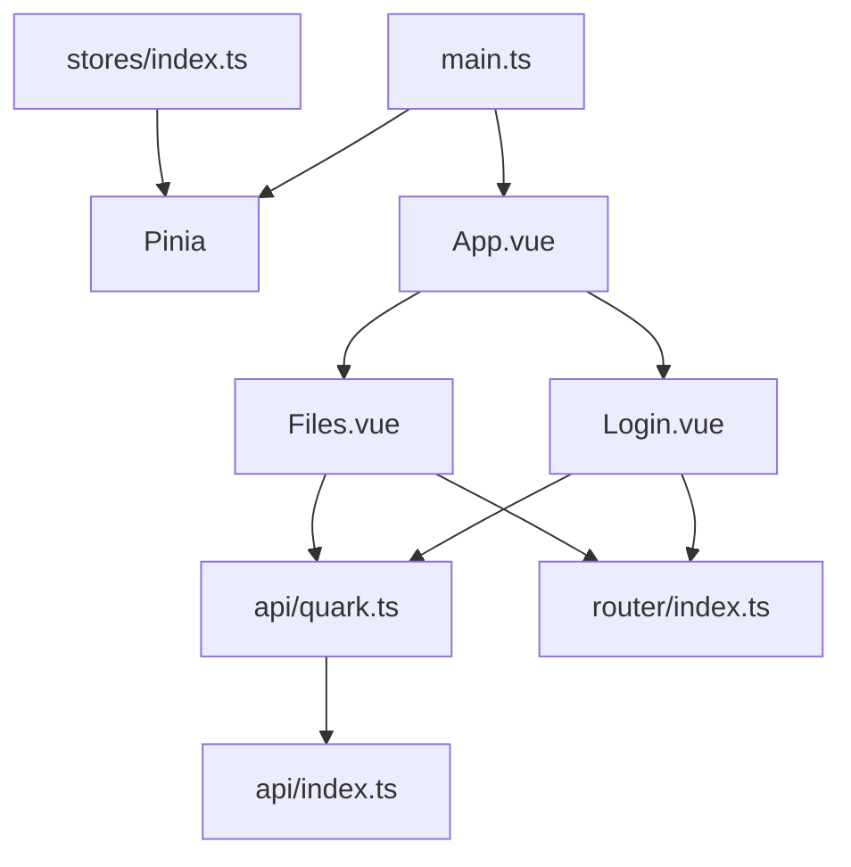

# State Management

<cite>
**Referenced Files in This Document**
- [frontend/src/main.ts](file://frontend/src/main.ts)
- [frontend/src/stores/index.ts](file://frontend/src/stores/index.ts)
- [frontend/src/api/index.ts](file://frontend/src/api/index.ts)
- [frontend/src/api/quark.ts](file://frontend/src/api/quark.ts)
- [frontend/src/router/index.ts](file://frontend/src/router/index.ts)
- [frontend/src/views/Login.vue](file://frontend/src/views/Login.vue)
- [frontend/src/views/Files.vue](file://frontend/src/views/Files.vue)
- [frontend/src/App.vue](file://frontend/src/App.vue)
</cite>

## Table of Contents
1. [Introduction](#introduction)
2. [Project Structure](#project-structure)
3. [Core Components](#core-components)
4. [Architecture Overview](#architecture-overview)
5. [Detailed Component Analysis](#detailed-component-analysis)
6. [Dependency Analysis](#dependency-analysis)
7. [Performance Considerations](#performance-considerations)
8. [Troubleshooting Guide](#troubleshooting-guide)
9. [Conclusion](#conclusion)
10. [Appendices](#appendices)

## Introduction
This document explains the state management system built with Pinia in the frontend. It covers store organization, state definition, actions, and getters, along with store registration, reactive updates, and component integration. Practical examples demonstrate authentication state handling, file management data flow, and UI state management. We also address persistence considerations, module organization, debugging techniques, and best practices for maintainable state management.

## Project Structure
The frontend uses a minimal but effective structure:
- Application bootstrap registers Pinia globally and mounts the app.
- A single user-focused store is defined for authentication state.
- API clients encapsulate backend communication and normalize responses.
- Views consume APIs and drive state transitions via actions.
- Routing defines protected navigation and page metadata.

**Diagram sources**
- [frontend/src/main.ts:1-23](file://frontend/src/main.ts#L1-L23)
- [frontend/src/stores/index.ts:1-23](file://frontend/src/stores/index.ts#L1-L23)
- [frontend/src/api/index.ts:1-30](file://frontend/src/api/index.ts#L1-L30)
- [frontend/src/api/quark.ts:1-125](file://frontend/src/api/quark.ts#L1-L125)
- [frontend/src/router/index.ts:1-35](file://frontend/src/router/index.ts#L1-L35)
- [frontend/src/views/Login.vue:1-290](file://frontend/src/views/Login.vue#L1-L290)
- [frontend/src/views/Files.vue:1-264](file://frontend/src/views/Files.vue#L1-L264)
- [frontend/src/App.vue:1-23](file://frontend/src/App.vue#L1-L23)

**Section sources**
- [frontend/src/main.ts:1-23](file://frontend/src/main.ts#L1-L23)
- [frontend/src/stores/index.ts:1-23](file://frontend/src/stores/index.ts#L1-L23)
- [frontend/src/api/index.ts:1-30](file://frontend/src/api/index.ts#L1-L30)
- [frontend/src/api/quark.ts:1-125](file://frontend/src/api/quark.ts#L1-L125)
- [frontend/src/router/index.ts:1-35](file://frontend/src/router/index.ts#L1-L35)
- [frontend/src/views/Login.vue:1-290](file://frontend/src/views/Login.vue#L1-L290)
- [frontend/src/views/Files.vue:1-264](file://frontend/src/views/Files.vue#L1-L264)
- [frontend/src/App.vue:1-23](file://frontend/src/App.vue#L1-L23)

## Core Components
- Pinia initialization and plugin registration occur in the application entrypoint.
- A single user store manages authentication state and exposes setters for external use.
- API modules centralize HTTP requests and response normalization.
- Views orchestrate user interactions, call API functions, and update local/UI state accordingly.

Key responsibilities:
- Pinia registration: global store container and devtools integration.
- User store: reactive authentication state and action-based mutations.
- API layer: typed request/response contracts and centralized interceptors.
- Views: UI state, user events, and navigation.

**Section sources**
- [frontend/src/main.ts:1-23](file://frontend/src/main.ts#L1-L23)
- [frontend/src/stores/index.ts:1-23](file://frontend/src/stores/index.ts#L1-L23)
- [frontend/src/api/index.ts:1-30](file://frontend/src/api/index.ts#L1-L30)
- [frontend/src/api/quark.ts:1-125](file://frontend/src/api/quark.ts#L1-L125)

## Architecture Overview
The state management architecture follows a unidirectional data flow:
- Components trigger actions via API calls or user interactions.
- API modules perform HTTP requests and return normalized data.
- Actions update reactive state in the store or local component state.
- Reactive state drives UI updates automatically.

**Diagram sources**
- [frontend/src/views/Login.vue:84-176](file://frontend/src/views/Login.vue#L84-L176)
- [frontend/src/api/quark.ts:55-75](file://frontend/src/api/quark.ts#L55-L75)
- [frontend/src/api/index.ts:1-30](file://frontend/src/api/index.ts#L1-L30)
- [frontend/src/stores/index.ts:1-23](file://frontend/src/stores/index.ts#L1-L23)

## Detailed Component Analysis

### Store Organization and Registration
- Store definition: a single user store is defined with Pinia’s composition API.
- Registration: Pinia is created and installed in the Vue app instance during bootstrap.
- Devtools: Pinia integrates with Vue Devtools for inspection and time-travel debugging.

**Diagram sources**
- [frontend/src/main.ts:1-23](file://frontend/src/main.ts#L1-L23)
- [frontend/src/stores/index.ts:1-23](file://frontend/src/stores/index.ts#L1-L23)

**Section sources**
- [frontend/src/main.ts:1-23](file://frontend/src/main.ts#L1-L23)
- [frontend/src/stores/index.ts:1-23](file://frontend/src/stores/index.ts#L1-L23)

### State Definition and Actions
- State: reactive flags and data for authentication.
- Actions: setters that mutate state; can be extended to include async logic and side effects.
- Getters: not currently defined; can be added later to derive computed values from state.

**Diagram sources**
- [frontend/src/stores/index.ts:1-23](file://frontend/src/stores/index.ts#L1-L23)

**Section sources**
- [frontend/src/stores/index.ts:1-23](file://frontend/src/stores/index.ts#L1-L23)

### Reactive State Updates and Component Integration
- Local UI state: views manage transient UI state (loading, errors, tabs).
- Store state: authentication state is exposed via the user store.
- Integration pattern: views call API functions and update local/UI state; store state can be updated by actions after successful operations.

**Diagram sources**
- [frontend/src/views/Login.vue:1-290](file://frontend/src/views/Login.vue#L1-L290)
- [frontend/src/api/quark.ts:68-70](file://frontend/src/api/quark.ts#L68-L70)
- [frontend/src/stores/index.ts:1-23](file://frontend/src/stores/index.ts#L1-L23)

**Section sources**
- [frontend/src/views/Login.vue:1-290](file://frontend/src/views/Login.vue#L1-L290)
- [frontend/src/stores/index.ts:1-23](file://frontend/src/stores/index.ts#L1-L23)

### Authentication State Management
- QR code generation and polling: the login view generates a QR code, renders it, and polls the backend until login succeeds or expires.
- Cookie-based login: submits credentials to backend and navigates on success.
- Navigation: successful login routes to the files view.

**Diagram sources**
- [frontend/src/views/Login.vue:84-176](file://frontend/src/views/Login.vue#L84-L176)
- [frontend/src/api/quark.ts:55-75](file://frontend/src/api/quark.ts#L55-L75)

**Section sources**
- [frontend/src/views/Login.vue:84-176](file://frontend/src/views/Login.vue#L84-L176)
- [frontend/src/api/quark.ts:55-75](file://frontend/src/api/quark.ts#L55-L75)

### File Management Data Flow
- Listing files: fetches paginated file lists and updates local state.
- Navigation: breadcrumb and folder navigation update current folder ID and reload data.
- CRUD operations: create, delete, rename, move, and search are exposed via API wrappers.
- Download: retrieves a pre-signed or redirect URL and opens in a new tab.

**Diagram sources**
- [frontend/src/views/Files.vue:89-104](file://frontend/src/views/Files.vue#L89-L104)
- [frontend/src/api/quark.ts:77-82](file://frontend/src/api/quark.ts#L77-L82)
- [frontend/src/api/index.ts:1-30](file://frontend/src/api/index.ts#L1-L30)

**Section sources**
- [frontend/src/views/Files.vue:89-104](file://frontend/src/views/Files.vue#L89-L104)
- [frontend/src/api/quark.ts:77-82](file://frontend/src/api/quark.ts#L77-L82)
- [frontend/src/api/index.ts:1-30](file://frontend/src/api/index.ts#L1-L30)

### UI State Management
- Transient UI flags: loading, error, and visibility toggles are managed locally in views.
- Navigation state: breadcrumbs and path segments reflect current location.
- Interaction feedback: messages and confirm dialogs guide user actions.

**Diagram sources**
- [frontend/src/views/Login.vue:70-82](file://frontend/src/views/Login.vue#L70-L82)
- [frontend/src/views/Files.vue:76-87](file://frontend/src/views/Files.vue#L76-L87)

**Section sources**
- [frontend/src/views/Login.vue:70-82](file://frontend/src/views/Login.vue#L70-L82)
- [frontend/src/views/Files.vue:76-87](file://frontend/src/views/Files.vue#L76-L87)

### Relationship Between Stores and Components
- Components depend on API modules for data and on routing for navigation.
- Store actions can be invoked after successful API operations to update global authentication state.
- Current store is minimal; future enhancements can include getters and async actions.

**Diagram sources**
- [frontend/src/views/Login.vue:1-290](file://frontend/src/views/Login.vue#L1-L290)
- [frontend/src/views/Files.vue:1-264](file://frontend/src/views/Files.vue#L1-L264)
- [frontend/src/api/quark.ts:1-125](file://frontend/src/api/quark.ts#L1-L125)
- [frontend/src/api/index.ts:1-30](file://frontend/src/api/index.ts#L1-L30)
- [frontend/src/router/index.ts:1-35](file://frontend/src/router/index.ts#L1-L35)
- [frontend/src/stores/index.ts:1-23](file://frontend/src/stores/index.ts#L1-L23)

**Section sources**
- [frontend/src/views/Login.vue:1-290](file://frontend/src/views/Login.vue#L1-L290)
- [frontend/src/views/Files.vue:1-264](file://frontend/src/views/Files.vue#L1-L264)
- [frontend/src/api/quark.ts:1-125](file://frontend/src/api/quark.ts#L1-L125)
- [frontend/src/api/index.ts:1-30](file://frontend/src/api/index.ts#L1-L30)
- [frontend/src/router/index.ts:1-35](file://frontend/src/router/index.ts#L1-L35)
- [frontend/src/stores/index.ts:1-23](file://frontend/src/stores/index.ts#L1-L23)

## Dependency Analysis
- Application bootstrap depends on Pinia and Vue.
- Views depend on API modules and router.
- API modules depend on Axios configuration.
- Store is independent and can be extended without changing views.

**Diagram sources**
- [frontend/src/main.ts:1-23](file://frontend/src/main.ts#L1-L23)
- [frontend/src/App.vue:1-23](file://frontend/src/App.vue#L1-L23)
- [frontend/src/views/Login.vue:1-290](file://frontend/src/views/Login.vue#L1-L290)
- [frontend/src/views/Files.vue:1-264](file://frontend/src/views/Files.vue#L1-L264)
- [frontend/src/api/quark.ts:1-125](file://frontend/src/api/quark.ts#L1-L125)
- [frontend/src/api/index.ts:1-30](file://frontend/src/api/index.ts#L1-L30)
- [frontend/src/router/index.ts:1-35](file://frontend/src/router/index.ts#L1-L35)
- [frontend/src/stores/index.ts:1-23](file://frontend/src/stores/index.ts#L1-L23)

**Section sources**
- [frontend/src/main.ts:1-23](file://frontend/src/main.ts#L1-L23)
- [frontend/src/App.vue:1-23](file://frontend/src/App.vue#L1-L23)
- [frontend/src/views/Login.vue:1-290](file://frontend/src/views/Login.vue#L1-L290)
- [frontend/src/views/Files.vue:1-264](file://frontend/src/views/Files.vue#L1-L264)
- [frontend/src/api/quark.ts:1-125](file://frontend/src/api/quark.ts#L1-L125)
- [frontend/src/api/index.ts:1-30](file://frontend/src/api/index.ts#L1-L30)
- [frontend/src/router/index.ts:1-35](file://frontend/src/router/index.ts#L1-L35)
- [frontend/src/stores/index.ts:1-23](file://frontend/src/stores/index.ts#L1-L23)

## Performance Considerations
- Prefer local refs for transient UI state to minimize unnecessary store updates.
- Debounce or throttle frequent UI interactions (e.g., search) to reduce API churn.
- Use computed properties for derived UI state to avoid recomputation.
- Keep store state minimal and flat; extract complex logic into actions or composables.
- Avoid excessive polling intervals; adjust timing based on backend guarantees.

## Troubleshooting Guide
Common issues and remedies:
- Store not updating: ensure actions mutate reactive refs and are called after API success.
- API errors: inspect normalized responses and handle error branches in views.
- Navigation problems: verify route guards and meta titles are configured correctly.
- Devtools inspection: enable Vue Devtools to inspect store state and actions.

Debugging tips:
- Add logging around API calls and store updates.
- Use Vue Devtools to monitor store state changes and component reactivity.
- Validate network requests and response shapes using browser devtools.

**Section sources**
- [frontend/src/views/Login.vue:134-140](file://frontend/src/views/Login.vue#L134-L140)
- [frontend/src/views/Files.vue:98-104](file://frontend/src/views/Files.vue#L98-L104)
- [frontend/src/api/index.ts:20-27](file://frontend/src/api/index.ts#L20-L27)
- [frontend/src/router/index.ts:29-32](file://frontend/src/router/index.ts#L29-L32)

## Conclusion
The current state management setup uses a minimal Pinia store for authentication alongside robust API modules and view-driven UI state. By keeping stores small, actions explicit, and views focused on UX, the system remains maintainable and extensible. Future enhancements can include getters, async actions, and persistence strategies to improve scalability and resilience.

## Appendices

### Best Practices for Store Architecture
- Keep state reactive and granular; expose only necessary state and actions.
- Encapsulate async logic in actions; keep components free of side effects.
- Use typed API modules to enforce request/response contracts.
- Centralize interceptors for consistent error handling and request shaping.
- Prefer local refs for UI-only state; reserve store for cross-component/shared state.
- Add getters for derived computations; avoid duplicating logic in components.
- Plan for persistence (e.g., session storage) for critical state like authentication tokens.

### Common Patterns Observed
- Composition API store with reactive refs and setters.
- View-managed UI state with API-driven data fetching.
- Typed API wrappers for backend endpoints.
- Minimal routing hooks for page metadata and navigation.