# Vue 3 Application Structure

<cite>
**Referenced Files in This Document**
- [main.ts](file://frontend/src/main.ts)
- [App.vue](file://frontend/src/App.vue)
- [router/index.ts](file://frontend/src/router/index.ts)
- [stores/index.ts](file://frontend/src/stores/index.ts)
- [vite.config.ts](file://frontend/vite.config.ts)
- [package.json](file://frontend/package.json)
- [tsconfig.json](file://frontend/tsconfig.json)
- [tsconfig.node.json](file://frontend/tsconfig.node.json)
- [views/Home.vue](file://frontend/src/views/Home.vue)
- [views/Login.vue](file://frontend/src/views/Login.vue)
- [views/Files.vue](file://frontend/src/views/Files.vue)
- [api/index.ts](file://frontend/src/api/index.ts)
- [api/quark.ts](file://frontend/src/api/quark.ts)
- [index.html](file://frontend/index.html)
</cite>

## Table of Contents
1. [Introduction](#introduction)
2. [Project Structure](#project-structure)
3. [Core Components](#core-components)
4. [Architecture Overview](#architecture-overview)
5. [Detailed Component Analysis](#detailed-component-analysis)
6. [Dependency Analysis](#dependency-analysis)
7. [Performance Considerations](#performance-considerations)
8. [Troubleshooting Guide](#troubleshooting-guide)
9. [Conclusion](#conclusion)
10. [Appendices](#appendices)

## Introduction
This document explains the Vue 3 application structure for the QuarkManager frontend, focusing on application bootstrap, plugin configuration, and global setup. It covers the main entry point, Vue Router integration, Pinia store setup, Element Plus UI framework initialization, icon component registration, TypeScript integration, and Vite build configuration. Practical examples demonstrate plugin ordering importance, global component registration, and application lifecycle management. Common configuration issues and debugging techniques are included to help developers troubleshoot and optimize their Vue 3 applications.

## Project Structure
The frontend follows a conventional Vue 3 + TypeScript + Vite project layout with clear separation of concerns:
- Entry point initializes the Vue app, registers plugins, and mounts the application.
- Router defines navigation routes and guards.
- Stores encapsulate state using Pinia composables.
- Views implement UI pages using Element Plus components.
- API module centralizes HTTP requests with Axios interceptors.
- Vite configuration enables Vue SFC compilation, path aliases, and dev server proxying.

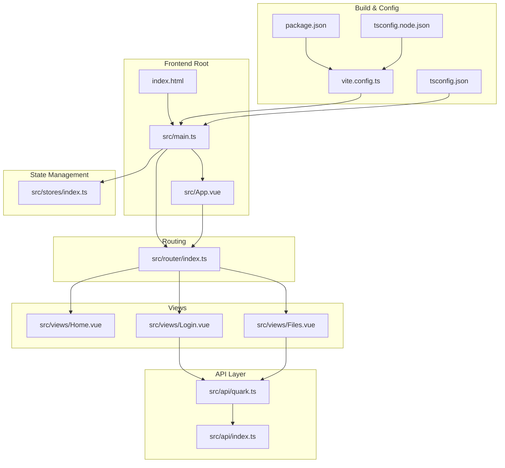

**Diagram sources**
- [index.html:1-14](file://frontend/index.html#L1-L14)
- [main.ts:1-23](file://frontend/src/main.ts#L1-L23)
- [App.vue:1-23](file://frontend/src/App.vue#L1-L23)
- [router/index.ts:1-35](file://frontend/src/router/index.ts#L1-L35)
- [stores/index.ts:1-23](file://frontend/src/stores/index.ts#L1-L23)
- [views/Home.vue:1-83](file://frontend/src/views/Home.vue#L1-L83)
- [views/Login.vue:1-290](file://frontend/src/views/Login.vue#L1-L290)
- [views/Files.vue:1-264](file://frontend/src/views/Files.vue#L1-L264)
- [api/index.ts:1-30](file://frontend/src/api/index.ts#L1-L30)
- [api/quark.ts:1-125](file://frontend/src/api/quark.ts#L1-L125)
- [vite.config.ts:1-22](file://frontend/vite.config.ts#L1-L22)
- [package.json:1-31](file://frontend/package.json#L1-L31)
- [tsconfig.json:1-26](file://frontend/tsconfig.json#L1-L26)
- [tsconfig.node.json:1-12](file://frontend/tsconfig.node.json#L1-L12)

**Section sources**
- [index.html:1-14](file://frontend/index.html#L1-L14)
- [main.ts:1-23](file://frontend/src/main.ts#L1-L23)
- [vite.config.ts:1-22](file://frontend/vite.config.ts#L1-L22)
- [package.json:1-31](file://frontend/package.json#L1-L31)
- [tsconfig.json:1-26](file://frontend/tsconfig.json#L1-L26)
- [tsconfig.node.json:1-12](file://frontend/tsconfig.node.json#L1-L12)

## Core Components
This section documents the core bootstrap and configuration components that initialize the Vue 3 application.

- Application Bootstrap (main.ts)
  - Creates the Vue app instance with the root component.
  - Initializes Pinia and registers it with the app.
  - Registers Element Plus icons globally for convenient usage.
  - Uses Vue Router and Element Plus as plugins.
  - Mounts the app to the DOM element with id "app".

- Root Component (App.vue)
  - Provides a global Element Plus locale provider for Chinese.
  - Renders the router outlet for dynamic route rendering.
  - Applies base styles for responsive layout.

- Router (router/index.ts)
  - Defines routes for Home, Login, and Files views.
  - Uses lazy-loaded components for performance.
  - Implements a navigation guard to update document titles based on route metadata.

- Store (stores/index.ts)
  - Defines a Pinia composable store for user state.
  - Exposes reactive state and actions for login status and user info.

- API Layer (api/index.ts, api/quark.ts)
  - Centralizes HTTP client configuration with Axios.
  - Provides typed APIs for authentication and file operations.
  - Handles request/response interceptors for consistent data flow.

- Build & Config (vite.config.ts, package.json, tsconfig.json, tsconfig.node.json)
  - Enables Vue SFC compilation and path aliases.
  - Configures dev server port and proxy to backend service.
  - Sets up TypeScript compiler options and module resolution.

**Section sources**
- [main.ts:1-23](file://frontend/src/main.ts#L1-L23)
- [App.vue:1-23](file://frontend/src/App.vue#L1-L23)
- [router/index.ts:1-35](file://frontend/src/router/index.ts#L1-L35)
- [stores/index.ts:1-23](file://frontend/src/stores/index.ts#L1-L23)
- [api/index.ts:1-30](file://frontend/src/api/index.ts#L1-L30)
- [api/quark.ts:1-125](file://frontend/src/api/quark.ts#L1-L125)
- [vite.config.ts:1-22](file://frontend/vite.config.ts#L1-L22)
- [package.json:1-31](file://frontend/package.json#L1-L31)
- [tsconfig.json:1-26](file://frontend/tsconfig.json#L1-L26)
- [tsconfig.node.json:1-12](file://frontend/tsconfig.node.json#L1-L12)

## Architecture Overview
The application follows a layered architecture:
- Entry layer: main.ts orchestrates plugin registration and mounting.
- Presentation layer: App.vue and views render UI with Element Plus.
- Routing layer: router/index.ts manages navigation and guards.
- State layer: stores/index.ts manages user state with Pinia.
- Data layer: api/index.ts and api/quark.ts encapsulate HTTP communication.

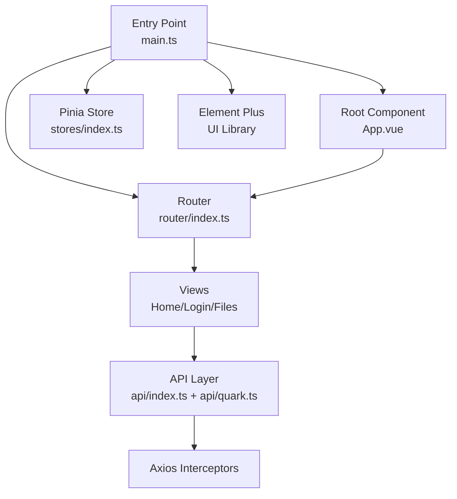

**Diagram sources**
- [main.ts:1-23](file://frontend/src/main.ts#L1-L23)
- [App.vue:1-23](file://frontend/src/App.vue#L1-L23)
- [router/index.ts:1-35](file://frontend/src/router/index.ts#L1-L35)
- [stores/index.ts:1-23](file://frontend/src/stores/index.ts#L1-L23)
- [views/Home.vue:1-83](file://frontend/src/views/Home.vue#L1-L83)
- [views/Login.vue:1-290](file://frontend/src/views/Login.vue#L1-L290)
- [views/Files.vue:1-264](file://frontend/src/views/Files.vue#L1-L264)
- [api/index.ts:1-30](file://frontend/src/api/index.ts#L1-L30)
- [api/quark.ts:1-125](file://frontend/src/api/quark.ts#L1-L125)

## Detailed Component Analysis

### Application Bootstrap and Plugin Registration Order
The bootstrap sequence in main.ts is critical for proper plugin initialization:
- Vue app instance creation with root component.
- Pinia initialization and registration.
- Global icon registration for Element Plus.
- Router registration.
- Element Plus registration.
- Mounting to the DOM.

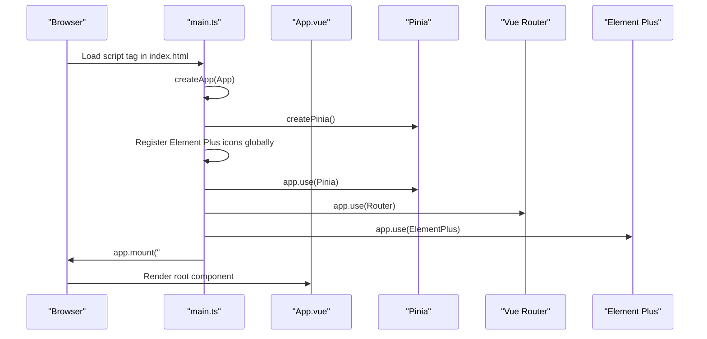

**Diagram sources**
- [main.ts:1-23](file://frontend/src/main.ts#L1-L23)
- [index.html:10-11](file://frontend/index.html#L10-L11)

Practical examples:
- Plugin ordering matters: Pinia must be registered before components that depend on it.
- Global icon registration ensures icons are available anywhere in the app without manual imports.
- Element Plus locale provider in App.vue affects all UI components globally.

**Section sources**
- [main.ts:1-23](file://frontend/src/main.ts#L1-L23)
- [App.vue:1-23](file://frontend/src/App.vue#L1-L23)
- [index.html:10-11](file://frontend/index.html#L10-L11)

### Router Integration and Navigation Guards
The router module defines routes and a navigation guard that updates the document title based on route metadata. Lazy-loaded components improve initial load performance.

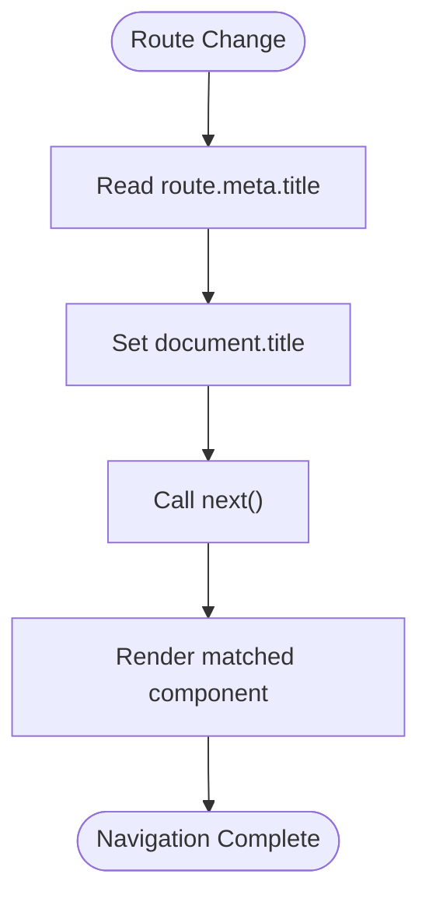

**Diagram sources**
- [router/index.ts:29-32](file://frontend/src/router/index.ts#L29-L32)

Key points:
- History mode routing with createWebHistory.
- Route guards modify document metadata for SEO and UX.
- Lazy-loaded components reduce bundle size.

**Section sources**
- [router/index.ts:1-35](file://frontend/src/router/index.ts#L1-L35)

### Pinia Store Setup and State Management
The store module defines a composable store for user state with reactive properties and actions. This pattern promotes reusability and testability.

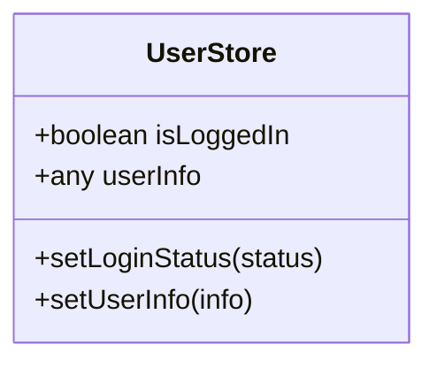

**Diagram sources**
- [stores/index.ts:4-22](file://frontend/src/stores/index.ts#L4-L22)

Best practices:
- Use defineStore for composable stores.
- Keep state reactive and actions pure.
- Access store instances via useUserStore in components.

**Section sources**
- [stores/index.ts:1-23](file://frontend/src/stores/index.ts#L1-L23)

### Element Plus UI Framework Initialization
Element Plus is initialized globally and configured with a Chinese locale provider in App.vue. Icons are registered globally for convenience.

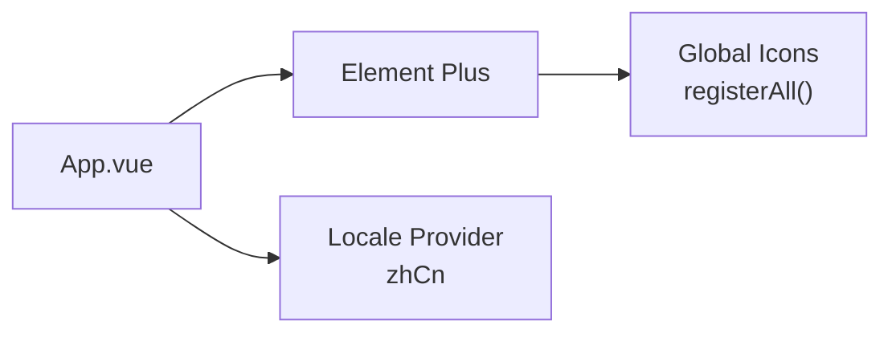

**Diagram sources**
- [main.ts:3-16](file://frontend/src/main.ts#L3-L16)
- [App.vue:2-8](file://frontend/src/App.vue#L2-L8)

Implementation highlights:
- CSS import for Element Plus styles.
- Icon registration loop for all Element Plus icons.
- Locale provider for consistent UI messages.

**Section sources**
- [main.ts:3-16](file://frontend/src/main.ts#L3-L16)
- [App.vue:1-9](file://frontend/src/App.vue#L1-L9)

### API Layer and HTTP Configuration
The API layer centralizes HTTP requests using Axios with interceptors for request/response handling. Strong typing improves developer experience and reduces runtime errors.

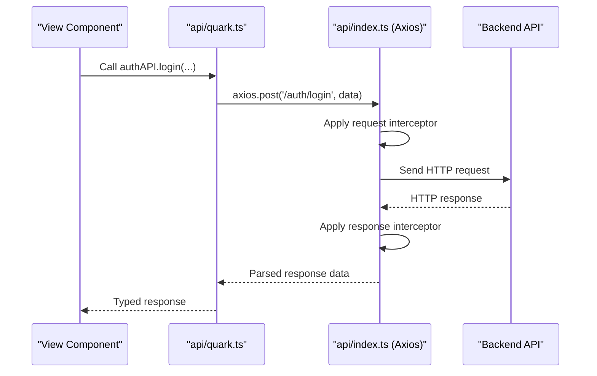

**Diagram sources**
- [api/quark.ts:55-75](file://frontend/src/api/quark.ts#L55-L75)
- [api/index.ts:1-30](file://frontend/src/api/index.ts#L1-L30)

Key features:
- Base URL configured for API endpoints.
- Request/response interceptors normalize data flow.
- Typed interfaces for request/response payloads.

**Section sources**
- [api/quark.ts:1-125](file://frontend/src/api/quark.ts#L1-L125)
- [api/index.ts:1-30](file://frontend/src/api/index.ts#L1-L30)

### View Components and Template Organization
The views demonstrate Element Plus usage, reactive state, and lifecycle hooks. They integrate with the API layer and router for navigation.

- Home.vue: Welcome screen with navigation to login.
- Login.vue: Multi-method authentication with QR code generation and polling.
- Files.vue: File listing with CRUD-like operations and navigation breadcrumbs.

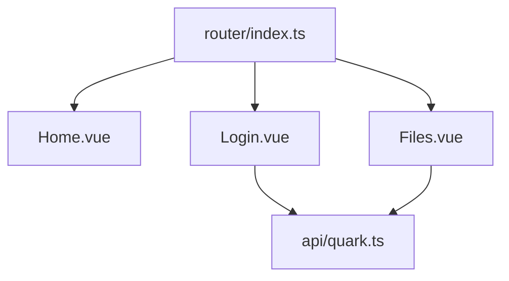

**Diagram sources**
- [views/Home.vue:1-83](file://frontend/src/views/Home.vue#L1-L83)
- [views/Login.vue:1-290](file://frontend/src/views/Login.vue#L1-L290)
- [views/Files.vue:1-264](file://frontend/src/views/Files.vue#L1-L264)
- [router/index.ts:1-35](file://frontend/src/router/index.ts#L1-L35)
- [api/quark.ts:1-125](file://frontend/src/api/quark.ts#L1-L125)

**Section sources**
- [views/Home.vue:1-83](file://frontend/src/views/Home.vue#L1-L83)
- [views/Login.vue:1-290](file://frontend/src/views/Login.vue#L1-L290)
- [views/Files.vue:1-264](file://frontend/src/views/Files.vue#L1-L264)

### TypeScript Integration Patterns
TypeScript configuration ensures type safety across the application:
- Strict compiler options for better reliability.
- Path aliases for clean imports.
- Module resolution configured for bundler environments.

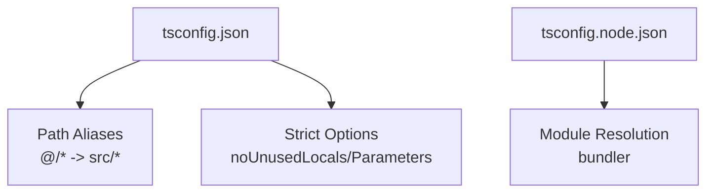

**Diagram sources**
- [tsconfig.json:1-26](file://frontend/tsconfig.json#L1-L26)
- [tsconfig.node.json:1-12](file://frontend/tsconfig.node.json#L1-L12)

**Section sources**
- [tsconfig.json:1-26](file://frontend/tsconfig.json#L1-L26)
- [tsconfig.node.json:1-12](file://frontend/tsconfig.node.json#L1-L12)

### Vite Build Configuration and Development Environment
Vite configuration enables fast development and optimized builds:
- Vue plugin for SFC support.
- Path alias resolution for imports.
- Dev server with port and proxy configuration.
- Build scripts for development, production, and preview.

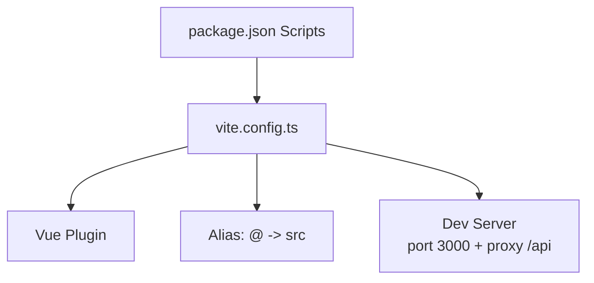

**Diagram sources**
- [vite.config.ts:1-22](file://frontend/vite.config.ts#L1-L22)
- [package.json:5-9](file://frontend/package.json#L5-L9)

**Section sources**
- [vite.config.ts:1-22](file://frontend/vite.config.ts#L1-L22)
- [package.json:1-31](file://frontend/package.json#L1-L31)

## Dependency Analysis
This section analyzes dependencies between components and their relationships.

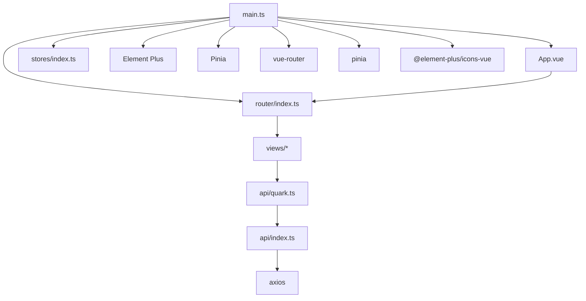

**Diagram sources**
- [main.ts:1-23](file://frontend/src/main.ts#L1-L23)
- [App.vue:1-23](file://frontend/src/App.vue#L1-L23)
- [router/index.ts:1-35](file://frontend/src/router/index.ts#L1-L35)
- [stores/index.ts:1-23](file://frontend/src/stores/index.ts#L1-L23)
- [api/index.ts:1-30](file://frontend/src/api/index.ts#L1-L30)
- [api/quark.ts:1-125](file://frontend/src/api/quark.ts#L1-L125)
- [package.json:11-29](file://frontend/package.json#L11-L29)

**Section sources**
- [main.ts:1-23](file://frontend/src/main.ts#L1-L23)
- [package.json:11-29](file://frontend/package.json#L11-L29)

## Performance Considerations
- Lazy-load route components to reduce initial bundle size.
- Use global icon registration judiciously; consider local imports for unused icons to minimize bundle weight.
- Leverage Element Plus tree-shaking by importing only used components if desired, though global registration simplifies usage.
- Configure Vite aliases to avoid deep relative imports that can complicate bundling.
- Keep Axios interceptors minimal to avoid unnecessary overhead during request/response processing.

## Troubleshooting Guide
Common configuration issues and debugging techniques:

- Plugin Registration Order
  - Symptom: Components cannot access Pinia or router.
  - Fix: Ensure Pinia is registered before components that use it, and that router is registered before mounting.
  - Reference: [main.ts:18-20](file://frontend/src/main.ts#L18-L20)

- Global Icon Availability
  - Symptom: Icons not rendering in templates.
  - Fix: Verify icon registration loop runs before mounting and that icon names match Element Plus icon exports.
  - Reference: [main.ts:14-16](file://frontend/src/main.ts#L14-L16)

- Router Navigation Issues
  - Symptom: Routes not updating document title or navigation failing.
  - Fix: Confirm beforeEach guard is defined and next() is called; verify route meta.title exists.
  - Reference: [router/index.ts:29-32](file://frontend/src/router/index.ts#L29-L32)

- API Proxy Configuration
  - Symptom: Frontend cannot reach backend endpoints.
  - Fix: Ensure Vite proxy targets the correct backend host/port and that baseURL matches backend routes.
  - Reference: [vite.config.ts:14-19](file://frontend/vite.config.ts#L14-L19), [api/index.ts:3-4](file://frontend/src/api/index.ts#L3-L4)

- TypeScript Path Aliases
  - Symptom: Import errors for @/* paths.
  - Fix: Verify tsconfig.json includes path aliases and Vite resolves them consistently.
  - Reference: [tsconfig.json:19-21](file://frontend/tsconfig.json#L19-L21), [vite.config.ts:7-11](file://frontend/vite.config.ts#L7-L11)

- Element Plus Locale
  - Symptom: UI messages not in Chinese.
  - Fix: Confirm zhCn locale provider is applied in App.vue and Element Plus CSS is imported.
  - Reference: [App.vue:2-8](file://frontend/src/App.vue#L2-L8), [main.ts:3-4](file://frontend/src/main.ts#L3-L4)

**Section sources**
- [main.ts:14-20](file://frontend/src/main.ts#L14-L20)
- [router/index.ts:29-32](file://frontend/src/router/index.ts#L29-L32)
- [vite.config.ts:14-19](file://frontend/vite.config.ts#L14-L19)
- [api/index.ts:3-4](file://frontend/src/api/index.ts#L3-L4)
- [tsconfig.json:19-21](file://frontend/tsconfig.json#L19-L21)
- [App.vue:2-8](file://frontend/src/App.vue#L2-L8)

## Conclusion
The QuarkManager frontend demonstrates a clean, modular Vue 3 application structure with robust plugin configuration, global component registration, and strong TypeScript integration. The main entry point orchestrates plugin registration order, while the router, store, and API layers provide cohesive navigation, state management, and data access. Vite configuration streamlines development and build processes. Following the outlined patterns and troubleshooting steps helps maintain a scalable and debuggable application.

## Appendices
- Development Commands
  - Run development server: npm run dev
  - Build for production: npm run build
  - Preview production build: npm run preview
  - Lint code: npm run lint

- Build Scripts Reference
  - [package.json:5-9](file://frontend/package.json#L5-L9)