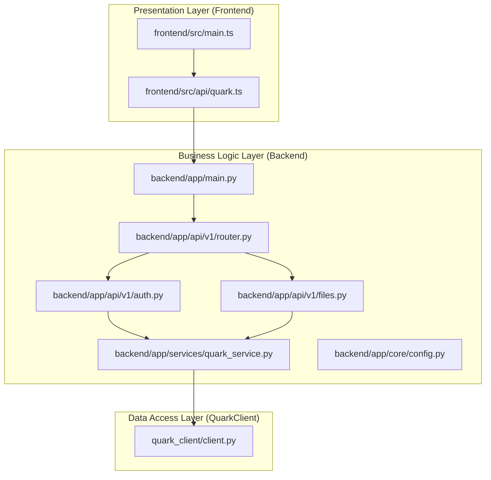
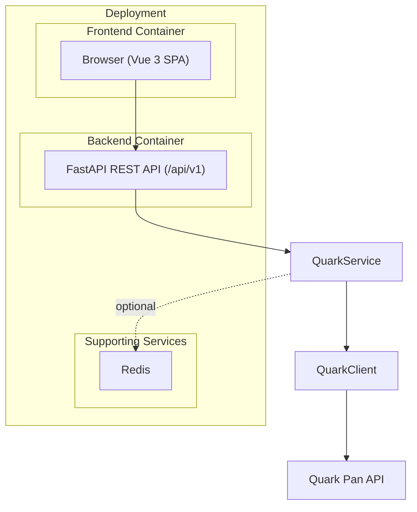
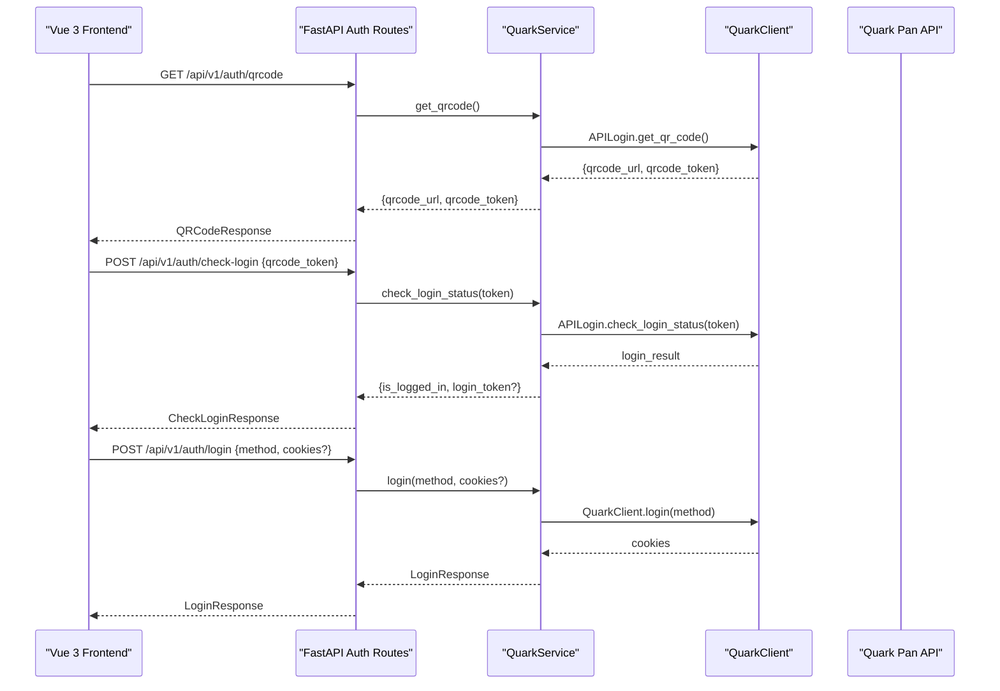
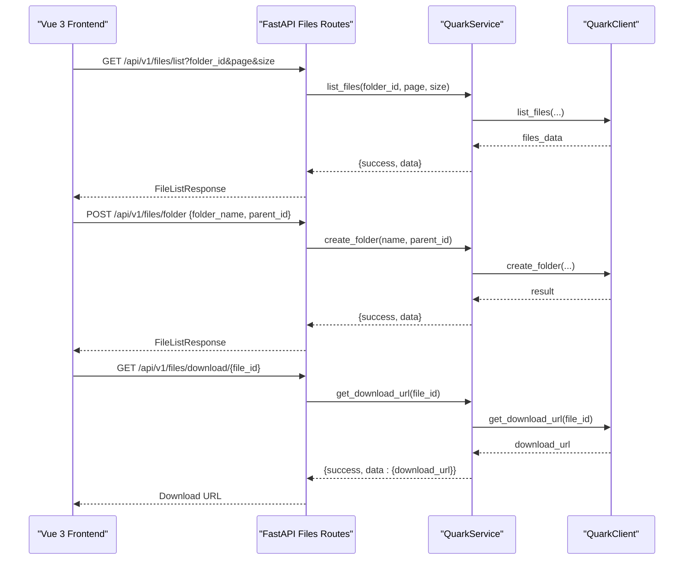
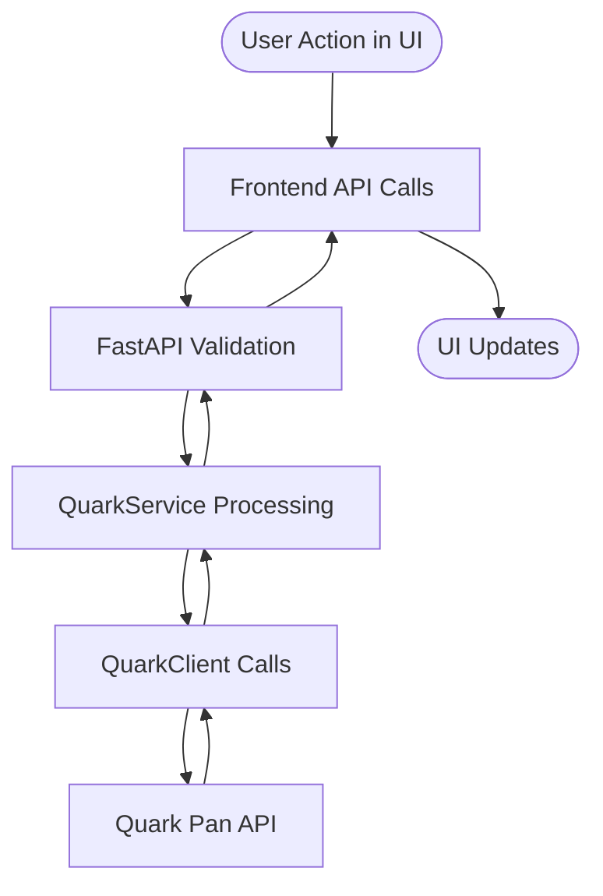
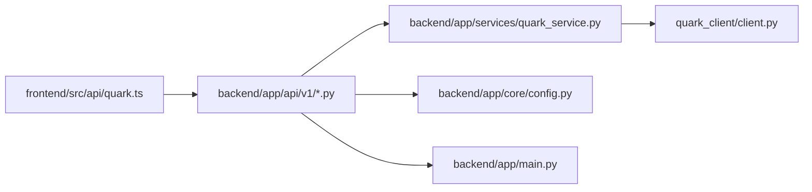
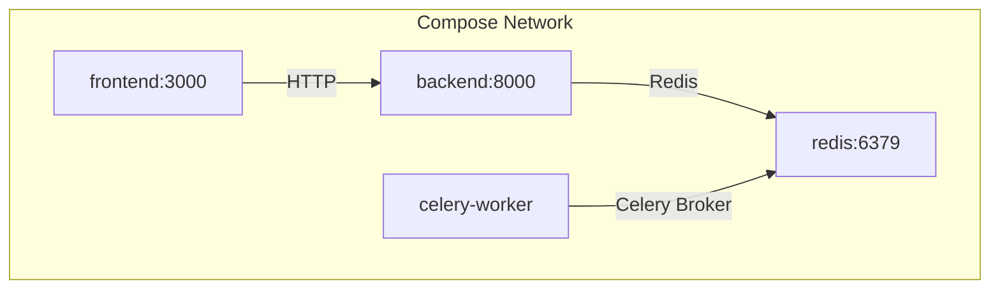
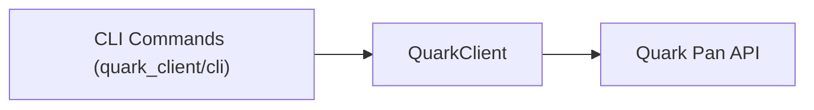

# Architecture Overview

<cite>
**Referenced Files in This Document**
- [backend/app/main.py](file://backend/app/main.py)
- [backend/app/api/v1/router.py](file://backend/app/api/v1/router.py)
- [backend/app/api/v1/auth.py](file://backend/app/api/v1/auth.py)
- [backend/app/api/v1/files.py](file://backend/app/api/v1/files.py)
- [backend/app/services/quark_service.py](file://backend/app/services/quark_service.py)
- [backend/app/core/config.py](file://backend/app/core/config.py)
- [backend/Dockerfile](file://backend/Dockerfile)
- [backend/pyproject.toml](file://backend/pyproject.toml)
- [frontend/src/main.ts](file://frontend/src/main.ts)
- [frontend/src/api/quark.ts](file://frontend/src/api/quark.ts)
- [frontend/package.json](file://frontend/package.json)
- [frontend/Dockerfile](file://frontend/Dockerfile)
- [docker-compose.yml](file://docker-compose.yml)
- [PROJECT_SUMMARY.md](file://PROJECT_SUMMARY.md)
- [quark_client/client.py](file://quark_client/client.py)
</cite>

## Table of Contents
1. [Introduction](#introduction)
2. [Project Structure](#project-structure)
3. [Core Components](#core-components)
4. [Architecture Overview](#architecture-overview)
5. [Detailed Component Analysis](#detailed-component-analysis)
6. [Dependency Analysis](#dependency-analysis)
7. [Performance Considerations](#performance-considerations)
8. [Troubleshooting Guide](#troubleshooting-guide)
9. [Conclusion](#conclusion)
10. [Appendices](#appendices)

## Introduction
This document presents the high-level architecture of QuarkManager, a system that integrates a Vue 3 frontend, a FastAPI backend, and the QuarkClient library to manage Quark Pan (Cloud Drive) resources. It explains the multi-tier architecture, containerized deployment via Docker Compose, service communication patterns (REST APIs), and the data flow from user actions through the web interface, API validation, business logic processing, and interactions with the Quark Pan API. It also covers system boundaries, external dependencies, scalability, fault tolerance, and monitoring approaches.

## Project Structure
QuarkManager is organized into three primary layers:
- Presentation Layer (Frontend): Vue 3 SPA with TypeScript, Pinia, and Element Plus.
- Business Logic Layer (Backend): FastAPI application exposing REST endpoints and coordinating with the QuarkClient library.
- Data Access Layer (QuarkClient Library): A Python library encapsulating Quark Pan API interactions, authentication, and file operations.

**Diagram sources**
- [frontend/src/main.ts:1-23](file://frontend/src/main.ts#L1-L23)
- [frontend/src/api/quark.ts:1-125](file://frontend/src/api/quark.ts#L1-L125)
- [backend/app/main.py:1-46](file://backend/app/main.py#L1-L46)
- [backend/app/api/v1/router.py:1-24](file://backend/app/api/v1/router.py#L1-L24)
- [backend/app/api/v1/auth.py:1-107](file://backend/app/api/v1/auth.py#L1-L107)
- [backend/app/api/v1/files.py:1-150](file://backend/app/api/v1/files.py#L1-L150)
- [backend/app/services/quark_service.py:1-388](file://backend/app/services/quark_service.py#L1-L388)
- [quark_client/client.py:1-405](file://quark_client/client.py#L1-L405)

**Section sources**
- [PROJECT_SUMMARY.md:10-34](file://PROJECT_SUMMARY.md#L10-L34)
- [backend/app/main.py:12-28](file://backend/app/main.py#L12-L28)
- [backend/app/api/v1/router.py:15-24](file://backend/app/api/v1/router.py#L15-L24)

## Core Components
- Frontend Application
  - Initializes Vue 3, Pinia, Element Plus, and registers icons.
  - Provides API modules for authentication and file management.
- Backend API Server
  - FastAPI application with CORS enabled, health checks, and route registration.
  - Exposes REST endpoints under /api/v1 for authentication and file management.
- Business Logic Service
  - Implements QuarkService singleton managing QuarkClient initialization, authentication, and file operations.
  - Provides fallback behavior when QuarkClient is unavailable (mock responses).
- QuarkClient Library
  - Encapsulates Quark Pan API interactions, authentication flows, file operations, and share management.
  - Offers convenience methods for login, file listing, search, move, rename, delete, and downloads.

**Section sources**
- [frontend/src/main.ts:10-23](file://frontend/src/main.ts#L10-L23)
- [frontend/src/api/quark.ts:55-124](file://frontend/src/api/quark.ts#L55-L124)
- [backend/app/main.py:12-40](file://backend/app/main.py#L12-L40)
- [backend/app/api/v1/router.py:15-24](file://backend/app/api/v1/router.py#L15-L24)
- [backend/app/api/v1/auth.py:18-107](file://backend/app/api/v1/auth.py#L18-L107)
- [backend/app/api/v1/files.py:19-150](file://backend/app/api/v1/files.py#L19-L150)
- [backend/app/services/quark_service.py:23-388](file://backend/app/services/quark_service.py#L23-L388)
- [quark_client/client.py:18-405](file://quark_client/client.py#L18-L405)

## Architecture Overview
The system follows a multi-tier architecture:
- Presentation Layer: Vue 3 SPA communicates with the backend via REST APIs.
- Business Logic Layer: FastAPI routes delegate requests to QuarkService, which manages QuarkClient interactions.
- Data Access Layer: QuarkClient abstracts Quark Pan API calls, including authentication and file operations.

**Diagram sources**
- [backend/app/main.py:12-28](file://backend/app/main.py#L12-L28)
- [backend/app/api/v1/router.py:22-24](file://backend/app/api/v1/router.py#L22-L24)
- [backend/app/services/quark_service.py:44-52](file://backend/app/services/quark_service.py#L44-L52)
- [quark_client/client.py:29-31](file://quark_client/client.py#L29-L31)

## Detailed Component Analysis

### Authentication Flow
The authentication flow supports QR code-based login and cookie-based login. The frontend initiates a QR code request, polls for login completion, and then performs subsequent authenticated operations.

**Diagram sources**
- [backend/app/api/v1/auth.py:18-107](file://backend/app/api/v1/auth.py#L18-L107)
- [backend/app/services/quark_service.py:54-197](file://backend/app/services/quark_service.py#L54-L197)
- [quark_client/client.py:50-74](file://quark_client/client.py#L50-L74)

**Section sources**
- [backend/app/api/v1/auth.py:18-107](file://backend/app/api/v1/auth.py#L18-L107)
- [backend/app/services/quark_service.py:54-197](file://backend/app/services/quark_service.py#L54-L197)
- [quark_client/client.py:50-74](file://quark_client/client.py#L50-L74)

### File Management Flow
File operations (list, create folder, delete, rename, move, search, storage info, download URL) are handled by the files router delegating to QuarkService.

**Diagram sources**
- [backend/app/api/v1/files.py:19-150](file://backend/app/api/v1/files.py#L19-L150)
- [backend/app/services/quark_service.py:225-384](file://backend/app/services/quark_service.py#L225-L384)
- [quark_client/client.py:76-98](file://quark_client/client.py#L76-L98)

**Section sources**
- [backend/app/api/v1/files.py:19-150](file://backend/app/api/v1/files.py#L19-L150)
- [backend/app/services/quark_service.py:225-384](file://backend/app/services/quark_service.py#L225-L384)
- [quark_client/client.py:76-98](file://quark_client/client.py#L76-L98)

### Data Flow from User Actions
End-to-end data flow:
- User interacts with the Vue 3 UI.
- Frontend API module sends REST requests to FastAPI.
- FastAPI validates requests and delegates to QuarkService.
- QuarkService initializes or uses QuarkClient to call Quark Pan API.
- Responses are returned through the chain to the frontend.

**Diagram sources**
- [frontend/src/api/quark.ts:55-124](file://frontend/src/api/quark.ts#L55-L124)
- [backend/app/api/v1/auth.py:18-107](file://backend/app/api/v1/auth.py#L18-L107)
- [backend/app/api/v1/files.py:19-150](file://backend/app/api/v1/files.py#L19-L150)
- [backend/app/services/quark_service.py:225-384](file://backend/app/services/quark_service.py#L225-L384)
- [quark_client/client.py:29-31](file://quark_client/client.py#L29-L31)

**Section sources**
- [frontend/src/api/quark.ts:55-124](file://frontend/src/api/quark.ts#L55-L124)
- [backend/app/api/v1/auth.py:18-107](file://backend/app/api/v1/auth.py#L18-L107)
- [backend/app/api/v1/files.py:19-150](file://backend/app/api/v1/files.py#L19-L150)
- [backend/app/services/quark_service.py:225-384](file://backend/app/services/quark_service.py#L225-L384)
- [quark_client/client.py:29-31](file://quark_client/client.py#L29-L31)

### Technology Stack Integration Points
- Frontend
  - Vue 3 + TypeScript for UI composition.
  - Axios for HTTP requests.
  - Pinia for state management.
  - Element Plus for UI components.
- Backend
  - FastAPI for REST API framework.
  - Pydantic for request/response models.
  - Redis/Celery for async tasks and caching (compose-managed).
- QuarkClient
  - Encapsulates Quark Pan API interactions and authentication.
- Docker
  - Separate containers for backend, frontend, Redis, and Celery worker.

**Section sources**
- [frontend/package.json:11-31](file://frontend/package.json#L11-L31)
- [backend/pyproject.toml:13-27](file://backend/pyproject.toml#L13-L27)
- [docker-compose.yml:3-65](file://docker-compose.yml#L3-L65)
- [quark_client/client.py:18-405](file://quark_client/client.py#L18-L405)

## Dependency Analysis
- Backend depends on:
  - Pydantic settings for configuration.
  - FastAPI for routing and middleware.
  - QuarkService for business logic.
- QuarkService depends on:
  - QuarkClient for Quark Pan API interactions.
  - APILogin for QR code and login flow orchestration.
- Frontend depends on:
  - Axios for HTTP communication.
  - API modules for typed endpoints.

**Diagram sources**
- [frontend/src/api/quark.ts:1-125](file://frontend/src/api/quark.ts#L1-L125)
- [backend/app/api/v1/auth.py:1-107](file://backend/app/api/v1/auth.py#L1-L107)
- [backend/app/api/v1/files.py:1-150](file://backend/app/api/v1/files.py#L1-L150)
- [backend/app/services/quark_service.py:11-21](file://backend/app/services/quark_service.py#L11-L21)
- [quark_client/client.py:8-16](file://quark_client/client.py#L8-L16)
- [backend/app/core/config.py:5-35](file://backend/app/core/config.py#L5-L35)
- [backend/app/main.py:4-28](file://backend/app/main.py#L4-L28)

**Section sources**
- [backend/app/core/config.py:5-35](file://backend/app/core/config.py#L5-L35)
- [backend/app/services/quark_service.py:11-21](file://backend/app/services/quark_service.py#L11-L21)
- [quark_client/client.py:8-16](file://quark_client/client.py#L8-L16)

## Performance Considerations
- Asynchronous Tasks
  - Celery worker is configured in Docker Compose for offloading long-running tasks (e.g., batch operations).
- Caching and State
  - Redis is provisioned for caching and session-like state management.
- API Pagination
  - File listing supports pagination parameters to limit payload sizes.
- Container Resource Limits
  - Consider adding resource limits and autoscaling policies in production deployments.

[No sources needed since this section provides general guidance]

## Troubleshooting Guide
- Health Checks
  - Root endpoint and health endpoints are available for quick verification.
- CORS Issues
  - Verify allowed origins in configuration match frontend origin.
- QuarkClient Availability
  - When QuarkClient is unavailable, the service returns mock responses; ensure dependencies are installed.
- Docker Networking
  - Confirm containers are on the same network and service names match compose definitions.

**Section sources**
- [backend/app/main.py:31-40](file://backend/app/main.py#L31-L40)
- [backend/app/core/config.py:22-25](file://backend/app/core/config.py#L22-L25)
- [backend/app/services/quark_service.py:11-21](file://backend/app/services/quark_service.py#L11-L21)
- [docker-compose.yml:62-65](file://docker-compose.yml#L62-L65)

## Conclusion
QuarkManager employs a clean multi-tier architecture with clear separation of concerns. The Vue 3 frontend focuses on user experience, the FastAPI backend enforces validation and orchestrates business logic, and the QuarkClient library abstracts Quark Pan interactions. Docker Compose streamlines deployment and service orchestration. The documented flows and integration points enable scalable, maintainable development and deployment.

[No sources needed since this section summarizes without analyzing specific files]

## Appendices

### Containerized Deployment Architecture
Docker Compose defines services for backend, frontend, Redis, and Celery worker, enabling local development and testing.

**Diagram sources**
- [docker-compose.yml:3-65](file://docker-compose.yml#L3-L65)

**Section sources**
- [docker-compose.yml:3-65](file://docker-compose.yml#L3-L65)
- [backend/Dockerfile:1-15](file://backend/Dockerfile#L1-L15)
- [frontend/Dockerfile:1-13](file://frontend/Dockerfile#L1-L13)

### CLI-to-API Integration
The QuarkClient library includes a CLI module with commands for authentication, file operations, sharing, and downloads. While the current backend does not expose CLI endpoints, the library’s CLI can be integrated as a separate operational tool.

**Diagram sources**
- [quark_client/client.py:18-405](file://quark_client/client.py#L18-L405)

**Section sources**
- [quark_client/client.py:18-405](file://quark_client/client.py#L18-L405)