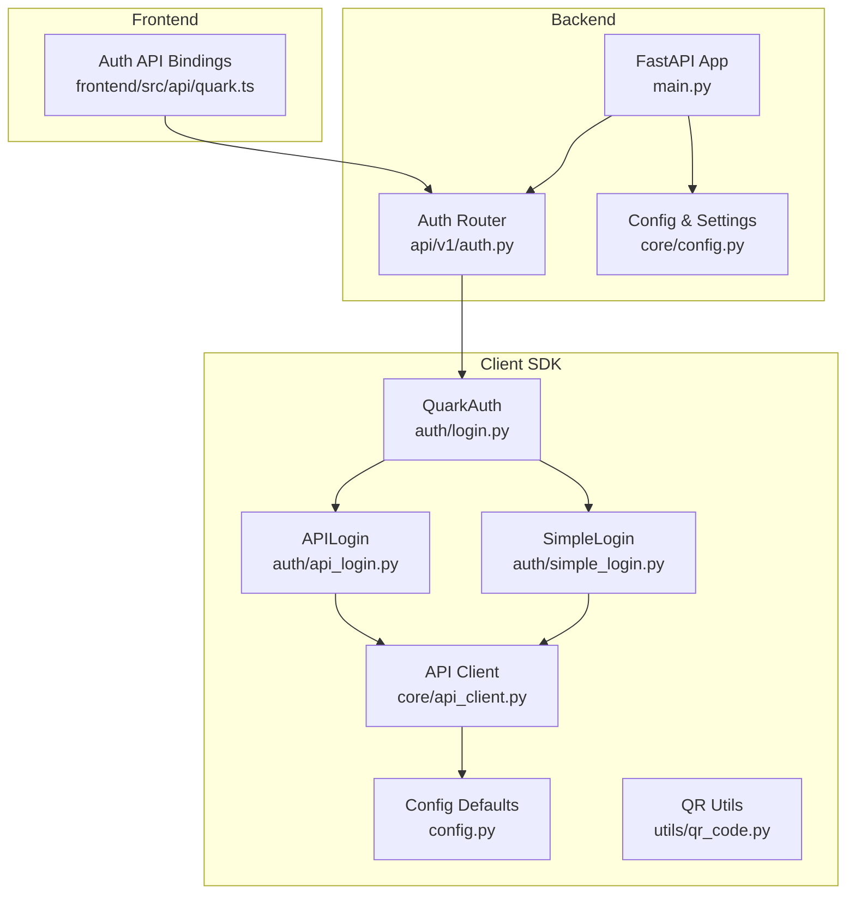
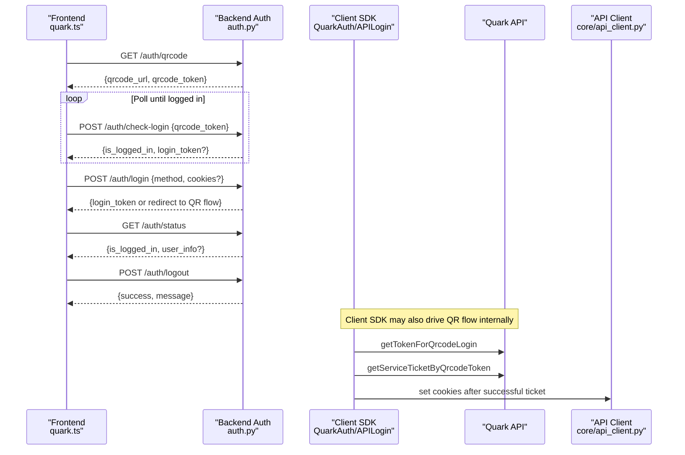
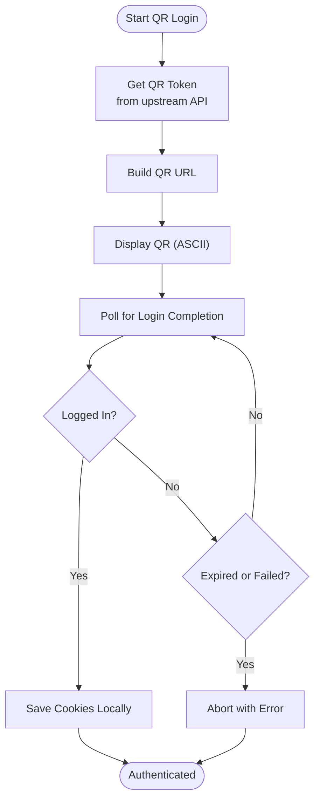
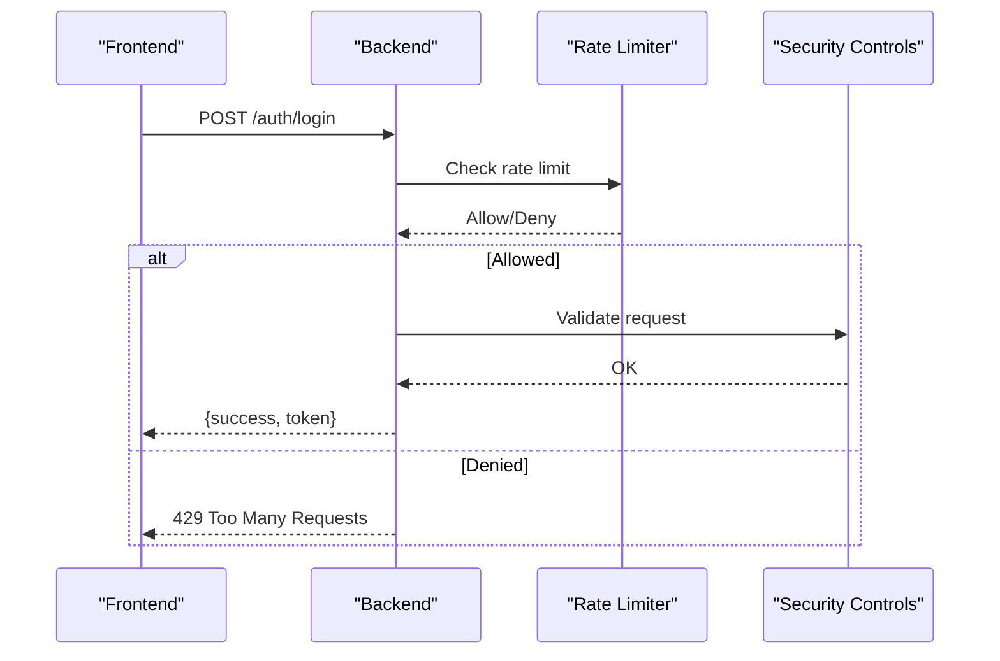
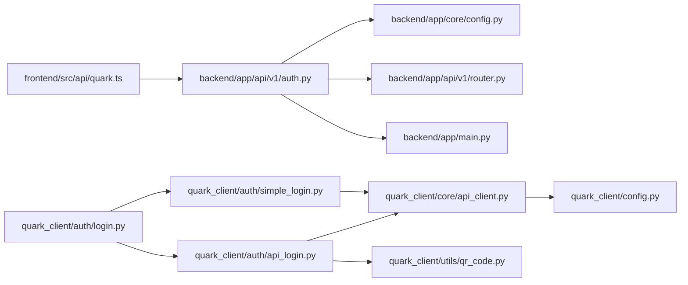

# Authentication Security

<cite>
**Referenced Files in This Document**
- [backend/app/api/v1/auth.py](file://backend/app/api/v1/auth.py)
- [backend/app/schemas/auth.py](file://backend/app/schemas/auth.py)
- [backend/app/main.py](file://backend/app/main.py)
- [backend/app/core/config.py](file://backend/app/core/config.py)
- [backend/app/api/v1/router.py](file://backend/app/api/v1/router.py)
- [quark_client/auth/api_login.py](file://quark_client/auth/api_login.py)
- [quark_client/auth/login.py](file://quark_client/auth/login.py)
- [quark_client/auth/simple_login.py](file://quark_client/auth/simple_login.py)
- [quark_client/core/api_client.py](file://quark_client/core/api_client.py)
- [quark_client/config.py](file://quark_client/config.py)
- [quark_client/utils/qr_code.py](file://quark_client/utils/qr_code.py)
- [quark_client/utils/logger.py](file://quark_client/utils/logger.py)
- [frontend/src/api/quark.ts](file://frontend/src/api/quark.ts)
- [docker-compose.yml](file://docker-compose.yml)
</cite>

## Table of Contents
1. [Introduction](#introduction)
2. [Project Structure](#project-structure)
3. [Core Components](#core-components)
4. [Architecture Overview](#architecture-overview)
5. [Detailed Component Analysis](#detailed-component-analysis)
6. [Dependency Analysis](#dependency-analysis)
7. [Performance Considerations](#performance-considerations)
8. [Troubleshooting Guide](#troubleshooting-guide)
9. [Conclusion](#conclusion)
10. [Appendices](#appendices)

## Introduction
This document provides a comprehensive guide to authentication security implementation and best practices for the project. It focuses on token security (including QR code token handling and expiration), session/security storage, authentication flow protections (CSRF, rate limiting, brute-force prevention), secure communications, and operational controls for compliance and auditing. The content is grounded in the repository’s code and configuration files.

## Project Structure
The authentication system spans three layers:
- Backend API (FastAPI): exposes authentication endpoints and manages CORS.
- Client SDK (Python): handles QR-based login, cookie persistence, and HTTP requests.
- Frontend (TypeScript): invokes backend authentication endpoints.

**Diagram sources**
- [backend/app/main.py:12-29](file://backend/app/main.py#L12-L29)
- [backend/app/api/v1/auth.py:15-15](file://backend/app/api/v1/auth.py#L15-L15)
- [backend/app/core/config.py:5-29](file://backend/app/core/config.py#L5-L29)
- [quark_client/auth/login.py:15-32](file://quark_client/auth/login.py#L15-L32)
- [quark_client/auth/api_login.py:20-56](file://quark_client/auth/api_login.py#L20-L56)
- [quark_client/auth/simple_login.py:16-27](file://quark_client/auth/simple_login.py#L16-L27)
- [quark_client/core/api_client.py:16-53](file://quark_client/core/api_client.py#L16-L53)
- [quark_client/config.py:34-63](file://quark_client/config.py#L34-L63)
- [quark_client/utils/qr_code.py:7-46](file://quark_client/utils/qr_code.py#L7-L46)
- [frontend/src/api/quark.ts:55-75](file://frontend/src/api/quark.ts#L55-L75)

**Section sources**
- [backend/app/main.py:12-29](file://backend/app/main.py#L12-L29)
- [backend/app/api/v1/auth.py:15-15](file://backend/app/api/v1/auth.py#L15-L15)
- [quark_client/auth/login.py:15-32](file://quark_client/auth/login.py#L15-L32)
- [quark_client/auth/api_login.py:20-56](file://quark_client/auth/api_login.py#L20-L56)
- [quark_client/auth/simple_login.py:16-27](file://quark_client/auth/simple_login.py#L16-L27)
- [quark_client/core/api_client.py:16-53](file://quark_client/core/api_client.py#L16-L53)
- [quark_client/config.py:34-63](file://quark_client/config.py#L34-L63)
- [quark_client/utils/qr_code.py:7-46](file://quark_client/utils/qr_code.py#L7-L46)
- [frontend/src/api/quark.ts:55-75](file://frontend/src/api/quark.ts#L55-L75)

## Core Components
- Backend authentication endpoints:
  - QR code retrieval and polling for login completion.
  - Traditional login via method selection.
  - Status and logout endpoints.
- Client-side authentication managers:
  - Automatic login with fallbacks (API, simple/manual).
  - Cookie persistence with expiry checks.
  - QR code generation/display and polling.
- HTTP client:
  - Builds standardized headers and parameters.
  - Handles authentication errors and API responses.
- Frontend bindings:
  - Typed wrappers for authentication endpoints.

Security-relevant highlights:
- Token lifecycle: QR tokens are short-lived and checked via polling.
- Session storage: cookies persisted locally with expiry detection.
- Transport: HTTP client sets referer/origin headers aligned with the target domain.

**Section sources**
- [backend/app/api/v1/auth.py:18-107](file://backend/app/api/v1/auth.py#L18-L107)
- [backend/app/schemas/auth.py:5-50](file://backend/app/schemas/auth.py#L5-L50)
- [quark_client/auth/login.py:107-294](file://quark_client/auth/login.py#L107-L294)
- [quark_client/auth/api_login.py:94-521](file://quark_client/auth/api_login.py#L94-L521)
- [quark_client/auth/simple_login.py:205-249](file://quark_client/auth/simple_login.py#L205-L249)
- [quark_client/core/api_client.py:80-183](file://quark_client/core/api_client.py#L80-L183)
- [quark_client/config.py:21-63](file://quark_client/config.py#L21-L63)
- [frontend/src/api/quark.ts:55-75](file://frontend/src/api/quark.ts#L55-L75)

## Architecture Overview
The authentication flow integrates frontend, backend, and client SDK:

**Diagram sources**
- [frontend/src/api/quark.ts:55-75](file://frontend/src/api/quark.ts#L55-L75)
- [backend/app/api/v1/auth.py:18-107](file://backend/app/api/v1/auth.py#L18-L107)
- [quark_client/auth/api_login.py:94-406](file://quark_client/auth/api_login.py#L94-L406)
- [quark_client/core/api_client.py:16-53](file://quark_client/core/api_client.py#L16-L53)

## Detailed Component Analysis

### Backend Authentication Endpoints
- QR code issuance and polling:
  - Non-blocking QR retrieval returns a token and URL.
  - Polling endpoint checks login status using the token.
- Traditional login:
  - Accepts method and optional cookies.
  - Returns a token suitable for session establishment.
- Status and logout:
  - Reports login state and clears session state.

Security considerations:
- Expiration: QR tokens are short-lived; polling enforces timely action.
- Validation: Responses validated against success flags and structured payloads.
- CORS: Strict origins configured for frontend integration.

**Section sources**
- [backend/app/api/v1/auth.py:18-107](file://backend/app/api/v1/auth.py#L18-L107)
- [backend/app/schemas/auth.py:19-50](file://backend/app/schemas/auth.py#L19-L50)
- [backend/app/main.py:18-25](file://backend/app/main.py#L18-L25)

### Client SDK Authentication Managers
- QuarkAuth orchestrates:
  - Loading persisted cookies with expiry checks.
  - Auto-login via API or simple login.
  - Saving cookies after successful login.
  - Logout and login state checks.
- APILogin drives:
  - QR token acquisition and QR URL construction.
  - Polling for login completion with timeouts.
  - Extracting cookies upon success and saving results.
- SimpleLogin supports:
  - Manual cookie input with validation.
  - Persistence and expiry checks.

Security considerations:
- Cookies stored with timestamps and expiry windows.
- Required cookie presence validated before reuse.
- QR flow includes countdown and explicit timeout handling.

**Section sources**
- [quark_client/auth/login.py:33-294](file://quark_client/auth/login.py#L33-L294)
- [quark_client/auth/api_login.py:94-521](file://quark_client/auth/api_login.py#L94-L521)
- [quark_client/auth/simple_login.py:205-249](file://quark_client/auth/simple_login.py#L205-L249)

### HTTP Client and Secure Transmission
- Standardized headers include origin/referer aligned with the target domain.
- Request building injects timestamped parameters and merges extras.
- Error handling distinguishes authentication failures and generic API errors.
- Automatic cookie propagation in requests.

Security considerations:
- Origin/referer headers help mitigate CSRF risks at the server boundary.
- Centralized error handling improves observability and reduces leakage.

**Section sources**
- [quark_client/core/api_client.py:68-183](file://quark_client/core/api_client.py#L68-L183)
- [quark_client/config.py:21-31](file://quark_client/config.py#L21-L31)

### QR Code Generation and Display
- QR code rendering to terminal via ASCII output.
- Direct URL-based QR display avoids storing transient images.

Security considerations:
- No sensitive data stored to disk; QR is ephemeral.
- Terminal output is visible to local users; ensure secure terminals.

**Section sources**
- [quark_client/utils/qr_code.py:7-46](file://quark_client/utils/qr_code.py#L7-L46)
- [quark_client/auth/api_login.py:40-52](file://quark_client/auth/api_login.py#L40-L52)

### Token Security Measures
- QR token lifecycle:
  - Short-lived tokens issued by upstream APIs.
  - Polling checks enforce timely completion.
  - Timeout logic prevents indefinite waits.
- Token sanitization:
  - Tokens are handled as opaque identifiers; no sensitive parsing performed.
- Secure transmission:
  - HTTPS endpoints enforced by deployment (see Compose).
  - Client sets referer/origin headers consistent with target domain.

**Diagram sources**
- [quark_client/auth/api_login.py:94-406](file://quark_client/auth/api_login.py#L94-L406)

**Section sources**
- [quark_client/auth/api_login.py:94-406](file://quark_client/auth/api_login.py#L94-L406)

### Session Security and Storage
- Local cookie storage:
  - Cookies saved with timestamps and computed expiry.
  - Validation ensures required cookie presence before reuse.
- Logout:
  - Removes persisted cookie artifacts.
- Session invalidation:
  - On 401/403 responses, client raises authentication errors prompting re-login.

Best practices observed:
- Separate cookie files per environment/configuration directory.
- Expiry thresholds prevent stale credential usage.

**Section sources**
- [quark_client/auth/login.py:33-93](file://quark_client/auth/login.py#L33-L93)
- [quark_client/auth/login.py:261-269](file://quark_client/auth/login.py#L261-L269)
- [quark_client/core/api_client.py:145-149](file://quark_client/core/api_client.py#L145-L149)

### Authentication Flow Security
- CSRF protection:
  - Origin/referer headers set consistently; backend CORS configured for trusted origins.
- Rate limiting and brute-force prevention:
  - Not implemented in the current codebase.
  - Recommended mitigations include:
    - Per-IP rate limits on /auth endpoints.
    - Captcha for repeated failed attempts.
    - Account lockout with progressive delays.
- Secure transmission:
  - HTTPS enforced via deployment configuration.

[No sources needed since this diagram shows conceptual workflow, not actual code structure]

**Section sources**
- [backend/app/main.py:18-25](file://backend/app/main.py#L18-L25)
- [quark_client/core/api_client.py:145-149](file://quark_client/core/api_client.py#L145-L149)

### Secure Communication Practices
- HTTPS enforcement:
  - Deployment runs on localhost; production deployments should enforce TLS termination at ingress/load balancer.
- Token sanitization:
  - QR tokens treated as opaque; no parsing of secrets.
- Sensitive data handling:
  - Cookies stored in local files; ensure filesystem permissions restrict access.
  - Logging avoids printing raw cookies; logger utilities support configurable sinks.

**Section sources**
- [docker-compose.yml:8-12](file://docker-compose.yml#L8-L12)
- [quark_client/utils/logger.py:12-72](file://quark_client/utils/logger.py#L12-L72)

## Dependency Analysis

**Diagram sources**
- [frontend/src/api/quark.ts:55-75](file://frontend/src/api/quark.ts#L55-L75)
- [backend/app/api/v1/auth.py:15-15](file://backend/app/api/v1/auth.py#L15-L15)
- [backend/app/core/config.py:5-29](file://backend/app/core/config.py#L5-L29)
- [backend/app/api/v1/router.py:3-23](file://backend/app/api/v1/router.py#L3-L23)
- [backend/app/main.py:12-29](file://backend/app/main.py#L12-L29)
- [quark_client/auth/login.py:15-32](file://quark_client/auth/login.py#L15-L32)
- [quark_client/auth/api_login.py:20-56](file://quark_client/auth/api_login.py#L20-L56)
- [quark_client/auth/simple_login.py:16-27](file://quark_client/auth/simple_login.py#L16-L27)
- [quark_client/core/api_client.py:16-53](file://quark_client/core/api_client.py#L16-L53)
- [quark_client/config.py:34-63](file://quark_client/config.py#L34-L63)
- [quark_client/utils/qr_code.py:7-46](file://quark_client/utils/qr_code.py#L7-L46)

**Section sources**
- [frontend/src/api/quark.ts:55-75](file://frontend/src/api/quark.ts#L55-L75)
- [backend/app/api/v1/auth.py:15-15](file://backend/app/api/v1/auth.py#L15-L15)
- [backend/app/core/config.py:5-29](file://backend/app/core/config.py#L5-L29)
- [backend/app/api/v1/router.py:3-23](file://backend/app/api/v1/router.py#L3-L23)
- [backend/app/main.py:12-29](file://backend/app/main.py#L12-L29)
- [quark_client/auth/login.py:15-32](file://quark_client/auth/login.py#L15-L32)
- [quark_client/auth/api_login.py:20-56](file://quark_client/auth/api_login.py#L20-L56)
- [quark_client/auth/simple_login.py:16-27](file://quark_client/auth/simple_login.py#L16-L27)
- [quark_client/core/api_client.py:16-53](file://quark_client/core/api_client.py#L16-L53)
- [quark_client/config.py:34-63](file://quark_client/config.py#L34-L63)
- [quark_client/utils/qr_code.py:7-46](file://quark_client/utils/qr_code.py#L7-L46)

## Performance Considerations
- Polling intervals:
  - Current implementation uses fixed sleep intervals during QR polling; consider jitter and exponential backoff to reduce server load.
- Cookie persistence:
  - Lightweight JSON files; ensure filesystem I/O is minimized by avoiding frequent writes.
- Request timeouts:
  - Client timeouts configured; adjust based on network conditions and endpoint latency.

[No sources needed since this section provides general guidance]

## Troubleshooting Guide
Common issues and resolutions:
- Authentication errors:
  - 401/403 responses trigger re-authentication prompts; verify cookie validity and refresh as needed.
- QR login failures:
  - Inspect upstream API responses and token status; confirm network connectivity and correct headers.
- Cookie persistence problems:
  - Validate required cookie presence and timestamps; clear stale files if expiry checks fail.

Operational controls:
- Logging:
  - Configure loggers to capture authentication events without exposing sensitive data.
- Health checks:
  - Use backend health endpoints to validate service availability.

**Section sources**
- [quark_client/core/api_client.py:145-183](file://quark_client/core/api_client.py#L145-L183)
- [quark_client/auth/api_login.py:255-406](file://quark_client/auth/api_login.py#L255-L406)
- [quark_client/auth/login.py:79-93](file://quark_client/auth/login.py#L79-L93)
- [quark_client/utils/logger.py:12-72](file://quark_client/utils/logger.py#L12-L72)
- [backend/app/main.py:37-41](file://backend/app/main.py#L37-L41)

## Conclusion
The project implements a pragmatic authentication flow centered on QR-based login and cookie-based sessions. Security strengths include QR token expiration, local cookie validation, and standardized request headers. Areas for improvement include CSRF hardening, rate limiting, and brute-force protections. Secure defaults and logging practices support operational hygiene and compliance readiness.

[No sources needed since this section summarizes without analyzing specific files]

## Appendices

### Practical Security Configuration Examples
- Backend CORS:
  - Restrict origins to trusted frontend origins.
- Environment variables:
  - Set production-grade secrets and disable debug mode.
- HTTPS enforcement:
  - Use reverse proxy or container networking to terminate TLS.

**Section sources**
- [backend/app/main.py:18-25](file://backend/app/main.py#L18-L25)
- [backend/app/core/config.py:7-29](file://backend/app/core/config.py#L7-L29)
- [docker-compose.yml:8-12](file://docker-compose.yml#L8-L12)

### Vulnerability Assessment Checklist
- Input validation and sanitization for all endpoints.
- CSRF protection via SameSite cookies and anti-CSRF tokens.
- Rate limiting and circuit breakers for authentication endpoints.
- Secret rotation and secure storage for credentials.
- Audit logs for authentication events with minimal PII.

[No sources needed since this section provides general guidance]

### Security Audit Procedures
- Penetration testing of authentication endpoints.
- Review of cookie storage permissions and encryption at rest.
- Compliance scanning for data protection and logging retention.
- Incident response playbooks for compromised sessions.

[No sources needed since this section provides general guidance]