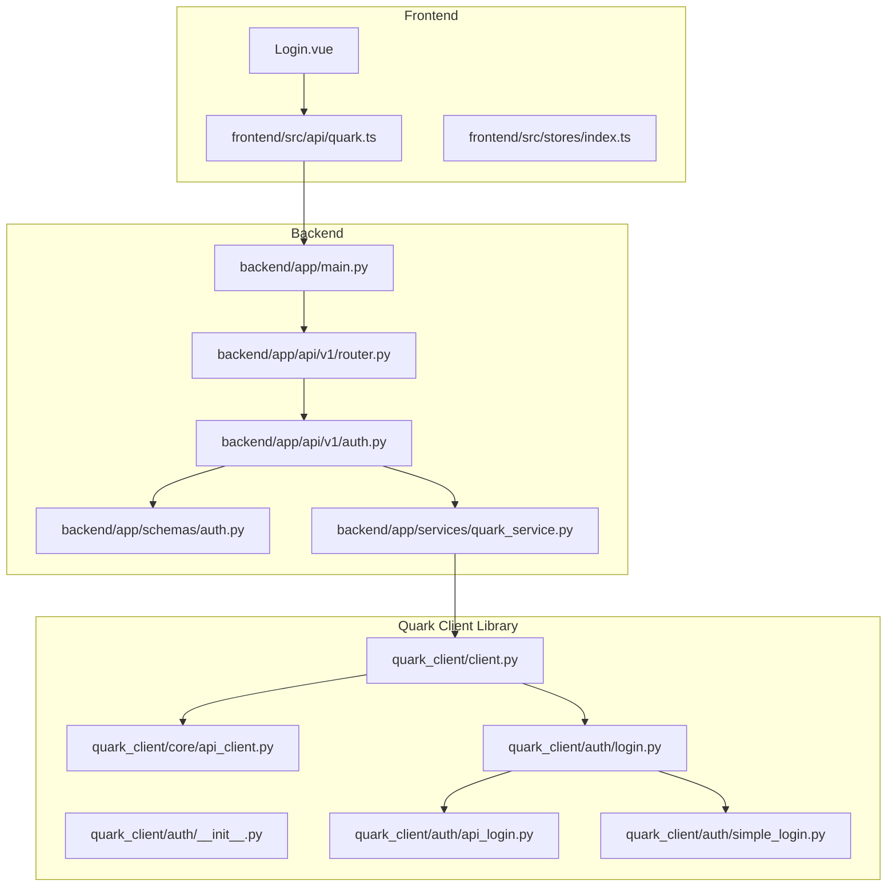
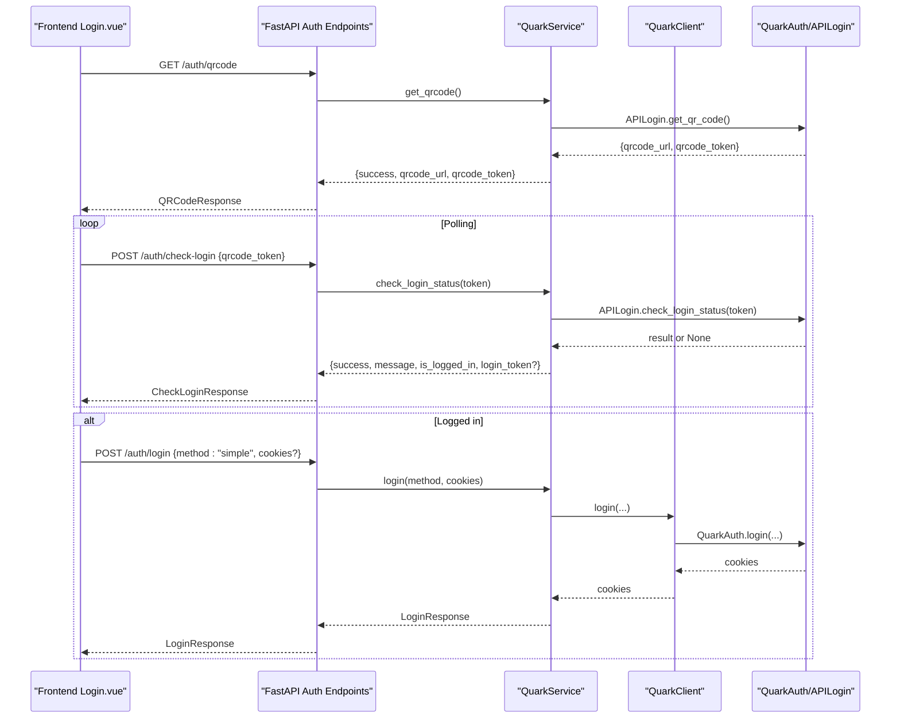
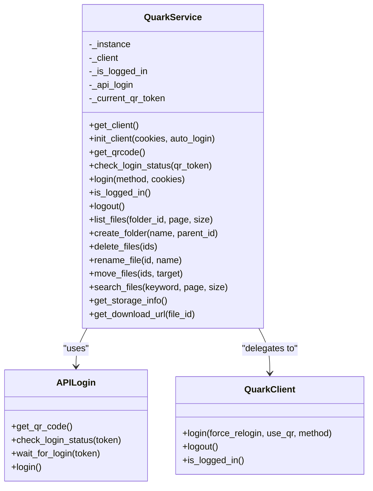
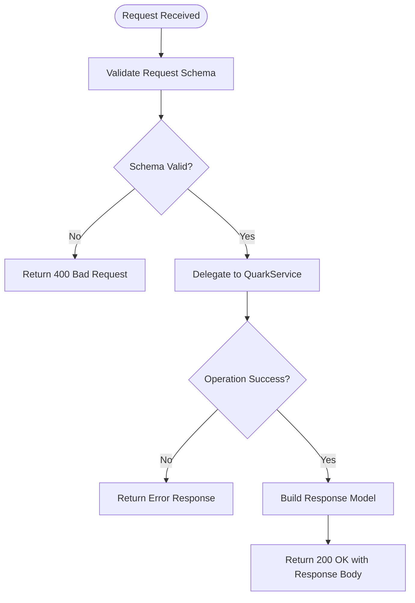
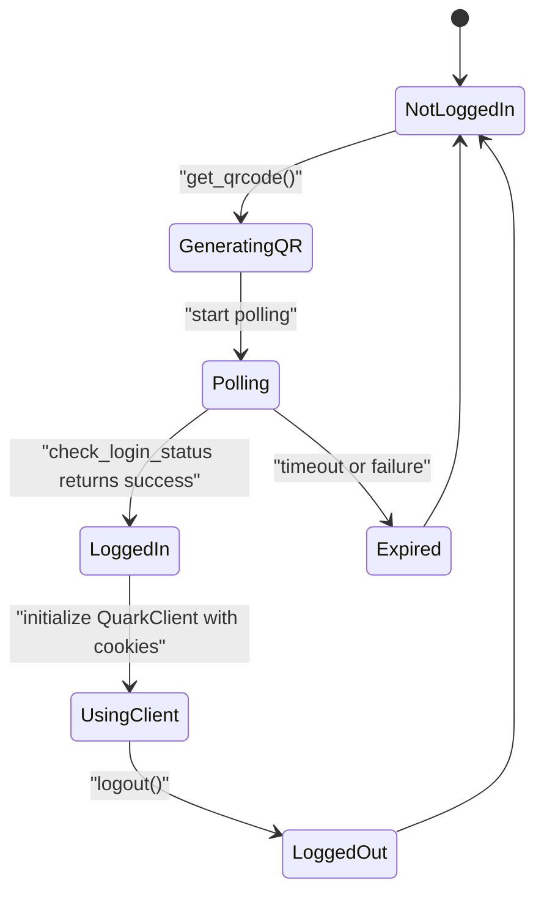
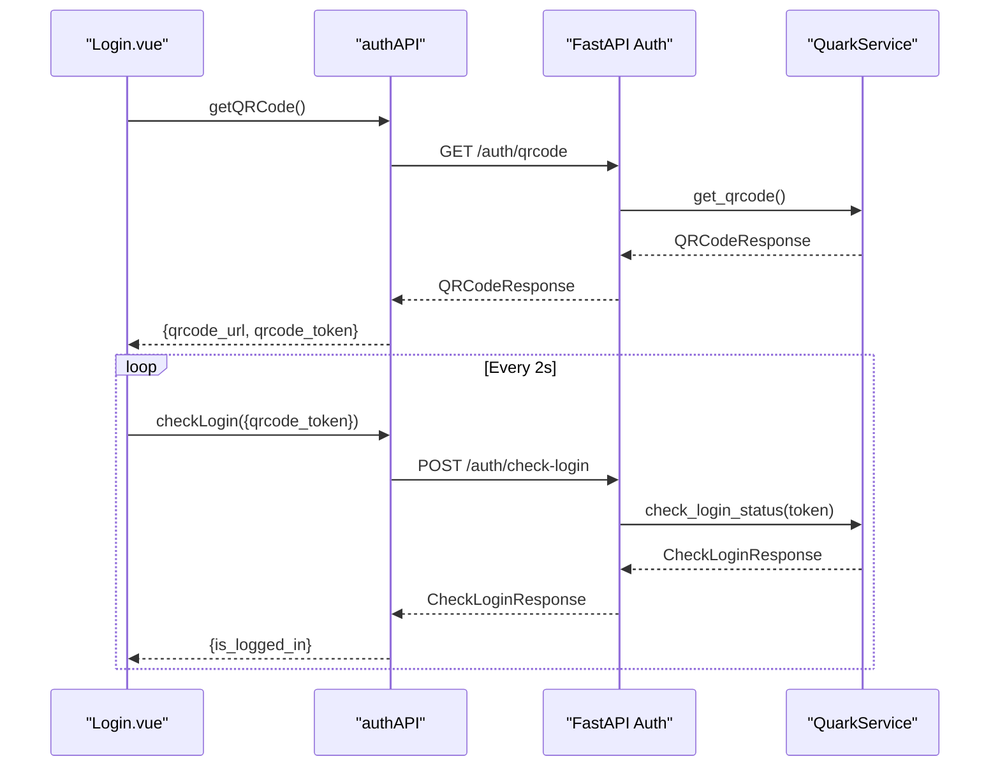
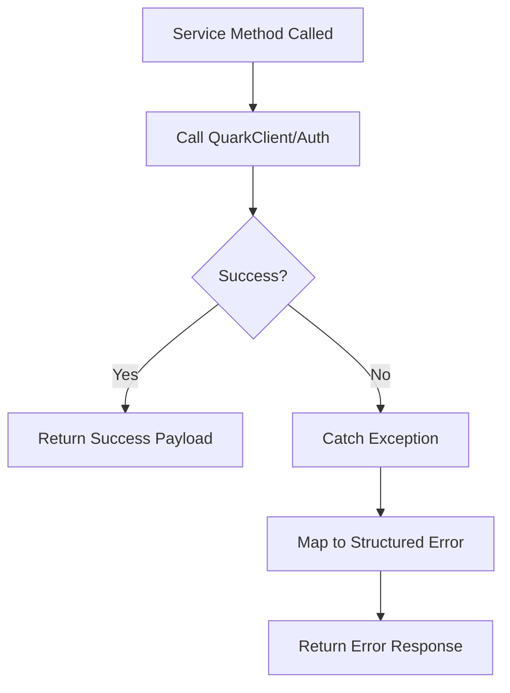
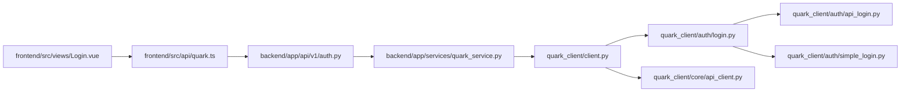

# Authentication Service Layer

<cite>
**Referenced Files in This Document**
- [backend/app/services/quark_service.py](file://backend/app/services/quark_service.py)
- [backend/app/api/v1/auth.py](file://backend/app/api/v1/auth.py)
- [backend/app/schemas/auth.py](file://backend/app/schemas/auth.py)
- [backend/app/api/v1/router.py](file://backend/app/api/v1/router.py)
- [backend/app/main.py](file://backend/app/main.py)
- [backend/app/core/config.py](file://backend/app/core/config.py)
- [quark_client/client.py](file://quark_client/client.py)
- [quark_client/core/api_client.py](file://quark_client/core/api_client.py)
- [quark_client/auth/__init__.py](file://quark_client/auth/__init__.py)
- [quark_client/auth/api_login.py](file://quark_client/auth/api_login.py)
- [quark_client/auth/login.py](file://quark_client/auth/login.py)
- [quark_client/auth/simple_login.py](file://quark_client/auth/simple_login.py)
- [frontend/src/api/quark.ts](file://frontend/src/api/quark.ts)
- [frontend/src/views/Login.vue](file://frontend/src/views/Login.vue)
- [frontend/src/stores/index.ts](file://frontend/src/stores/index.ts)
</cite>

## Table of Contents
1. [Introduction](#introduction)
2. [Project Structure](#project-structure)
3. [Core Components](#core-components)
4. [Architecture Overview](#architecture-overview)
5. [Detailed Component Analysis](#detailed-component-analysis)
6. [Dependency Analysis](#dependency-analysis)
7. [Performance Considerations](#performance-considerations)
8. [Troubleshooting Guide](#troubleshooting-guide)
9. [Conclusion](#conclusion)
10. [Appendices](#appendices)

## Introduction
This document describes the authentication service layer implementation for the QuarkManager application. It focuses on the centralized authentication logic centered around the QuarkService class, which orchestrates authentication operations, token and session management, and delegates to QuarkClient components. It also documents the service layer architecture pattern, authentication state management, request/response schema validation, practical integration examples, error handling patterns, and authentication flow coordination between the frontend and backend. Finally, it addresses performance considerations such as authentication caching, session timeout handling, and concurrent authentication request management.

## Project Structure
The authentication service layer spans three layers:
- Backend API layer: FastAPI routes expose authentication endpoints and delegate to the service layer.
- Service layer: QuarkService encapsulates authentication logic and interacts with the QuarkClient.
- Quark client library: Provides reusable authentication and API client components.

**Diagram sources**
- [backend/app/main.py:12-29](file://backend/app/main.py#L12-L29)
- [backend/app/api/v1/router.py:6-24](file://backend/app/api/v1/router.py#L6-L24)
- [backend/app/api/v1/auth.py:15-107](file://backend/app/api/v1/auth.py#L15-L107)
- [backend/app/services/quark_service.py:23-388](file://backend/app/services/quark_service.py#L23-L388)
- [quark_client/client.py:18-74](file://quark_client/client.py#L18-L74)
- [quark_client/core/api_client.py:16-209](file://quark_client/core/api_client.py#L16-L209)
- [quark_client/auth/__init__.py:1-28](file://quark_client/auth/__init__.py#L1-L28)
- [quark_client/auth/api_login.py:20-521](file://quark_client/auth/api_login.py#L20-L521)
- [quark_client/auth/login.py:15-301](file://quark_client/auth/login.py#L15-L301)
- [quark_client/auth/simple_login.py:16-249](file://quark_client/auth/simple_login.py#L16-L249)
- [frontend/src/api/quark.ts:55-75](file://frontend/src/api/quark.ts#L55-L75)
- [frontend/src/views/Login.vue:84-184](file://frontend/src/views/Login.vue#L84-L184)
- [frontend/src/stores/index.ts:4-22](file://frontend/src/stores/index.ts#L4-L22)

**Section sources**
- [backend/app/main.py:12-29](file://backend/app/main.py#L12-L29)
- [backend/app/api/v1/router.py:6-24](file://backend/app/api/v1/router.py#L6-L24)
- [backend/app/api/v1/auth.py:15-107](file://backend/app/api/v1/auth.py#L15-L107)
- [backend/app/services/quark_service.py:23-388](file://backend/app/services/quark_service.py#L23-L388)
- [quark_client/client.py:18-74](file://quark_client/client.py#L18-L74)
- [quark_client/core/api_client.py:16-209](file://quark_client/core/api_client.py#L16-L209)
- [quark_client/auth/__init__.py:1-28](file://quark_client/auth/__init__.py#L1-L28)
- [quark_client/auth/api_login.py:20-521](file://quark_client/auth/api_login.py#L20-L521)
- [quark_client/auth/login.py:15-301](file://quark_client/auth/login.py#L15-L301)
- [quark_client/auth/simple_login.py:16-249](file://quark_client/auth/simple_login.py#L16-L249)
- [frontend/src/api/quark.ts:55-75](file://frontend/src/api/quark.ts#L55-L75)
- [frontend/src/views/Login.vue:84-184](file://frontend/src/views/Login.vue#L84-L184)
- [frontend/src/stores/index.ts:4-22](file://frontend/src/stores/index.ts#L4-L22)

## Core Components
- QuarkService: Centralized singleton managing authentication state, delegating to QuarkClient components for login, logout, and status checks. It handles QR code generation, login polling, and session initialization.
- QuarkClient: High-level client wrapping QuarkAPIClient and QuarkAuth, exposing convenience methods for login, logout, and status checks.
- QuarkAuth/APILogin/SimpleLogin: Authentication managers that handle cookie persistence, login flow selection, and QR-based or cookie-based login.
- FastAPI Auth Endpoints: Expose /auth/qrcode, /auth/check-login, /auth/login, /auth/status, and /auth/logout with Pydantic schema validation.
- Frontend Integration: Vue components and Pinia store coordinate QR generation, polling, and login state updates.

Key responsibilities:
- Authentication orchestration and state management
- Session persistence via cookies and local storage
- Request/response schema validation
- Error propagation and user feedback
- Delegation to QuarkClient for actual API interactions

**Section sources**
- [backend/app/services/quark_service.py:23-388](file://backend/app/services/quark_service.py#L23-L388)
- [quark_client/client.py:18-74](file://quark_client/client.py#L18-L74)
- [quark_client/auth/login.py:15-301](file://quark_client/auth/login.py#L15-L301)
- [quark_client/auth/api_login.py:20-521](file://quark_client/auth/api_login.py#L20-L521)
- [quark_client/auth/simple_login.py:16-249](file://quark_client/auth/simple_login.py#L16-L249)
- [backend/app/api/v1/auth.py:18-107](file://backend/app/api/v1/auth.py#L18-L107)
- [backend/app/schemas/auth.py:5-50](file://backend/app/schemas/auth.py#L5-L50)
- [frontend/src/views/Login.vue:84-184](file://frontend/src/views/Login.vue#L84-L184)
- [frontend/src/stores/index.ts:4-22](file://frontend/src/stores/index.ts#L4-L22)

## Architecture Overview
The authentication architecture follows a layered service pattern:
- Presentation layer: Vue components and API clients
- API layer: FastAPI endpoints validating requests and responses
- Service layer: QuarkService coordinating authentication operations
- Client layer: QuarkClient and QuarkAuth handling low-level authentication and HTTP requests

**Diagram sources**
- [frontend/src/views/Login.vue:84-184](file://frontend/src/views/Login.vue#L84-L184)
- [backend/app/api/v1/auth.py:18-75](file://backend/app/api/v1/auth.py#L18-L75)
- [backend/app/services/quark_service.py:54-160](file://backend/app/services/quark_service.py#L54-L160)
- [quark_client/auth/api_login.py:94-308](file://quark_client/auth/api_login.py#L94-L308)
- [quark_client/auth/login.py:107-260](file://quark_client/auth/login.py#L107-L260)
- [quark_client/client.py:50-74](file://quark_client/client.py#L50-L74)

## Detailed Component Analysis

### QuarkService: Centralized Authentication Logic
QuarkService is a singleton that manages:
- Client lifecycle and initialization
- QR code generation and login polling
- Login via API or simple cookie mode
- Logout and login status checks
- Delegation to QuarkClient for authenticated operations

Key methods and behaviors:
- get_client/init_client: Lazily initialize QuarkClient with optional cookies and auto_login flags.
- get_qrcode: Uses APILogin to fetch QR code and token; returns structured success/error payload.
- check_login_status: Polls APILogin for login result; on success, extracts cookies, initializes QuarkClient, and sets logged-in state.
- login: Supports "api" and "simple" modes; for simple mode, injects cookies into the client; for API mode, delegates to QuarkClient.login.
- is_logged_in: Delegates to QuarkClient.is_logged_in.
- logout: Clears client and logged-in state.
- File operations: list_files, create_folder, delete_files, rename_file, move_files, search_files, get_storage_info, get_download_url; guarded by logged-in checks and simulate when client unavailable.

**Diagram sources**
- [backend/app/services/quark_service.py:23-388](file://backend/app/services/quark_service.py#L23-L388)
- [quark_client/auth/api_login.py:20-521](file://quark_client/auth/api_login.py#L20-L521)
- [quark_client/client.py:18-74](file://quark_client/client.py#L18-L74)

**Section sources**
- [backend/app/services/quark_service.py:23-388](file://backend/app/services/quark_service.py#L23-L388)

### Authentication Endpoints and Schema Validation
FastAPI endpoints provide:
- GET /auth/qrcode: Returns QRCodeResponse with qrcode_url and qrcode_token.
- POST /auth/check-login: Accepts CheckLoginRequest and returns CheckLoginResponse with is_logged_in and optional login_token.
- POST /auth/login: Accepts LoginRequest and returns LoginResponse; supports method "api" or "simple".
- GET /auth/status: Returns AuthStatusResponse indicating login status and optional user info.
- POST /auth/logout: Returns LogoutResponse.

Pydantic models enforce request/response schemas:
- LoginRequest: method, cookies
- LoginResponse: success, message, qrcode_url, login_token
- QRCodeResponse: success, message, qrcode_url, qrcode_token
- CheckLoginRequest: qrcode_token
- CheckLoginResponse: success, message, is_logged_in, login_token
- AuthStatusResponse: is_logged_in, user_info
- LogoutResponse: success, message

**Diagram sources**
- [backend/app/api/v1/auth.py:18-107](file://backend/app/api/v1/auth.py#L18-L107)
- [backend/app/schemas/auth.py:5-50](file://backend/app/schemas/auth.py#L5-L50)

**Section sources**
- [backend/app/api/v1/auth.py:18-107](file://backend/app/api/v1/auth.py#L18-L107)
- [backend/app/schemas/auth.py:5-50](file://backend/app/schemas/auth.py#L5-L50)

### Authentication State Management
State management covers:
- Login status checking: QuarkService.is_logged_in delegates to QuarkClient.is_logged_in.
- Session persistence: QuarkAuth persists cookies locally and validates expiration; QuarkService caches initialized client and login state.
- User information retrieval: On successful login, cookies are extracted and used to initialize QuarkClient; user info can be derived from storage info.

**Diagram sources**
- [backend/app/services/quark_service.py:54-160](file://backend/app/services/quark_service.py#L54-L160)
- [quark_client/auth/login.py:270-294](file://quark_client/auth/login.py#L270-L294)
- [quark_client/auth/api_login.py:255-406](file://quark_client/auth/api_login.py#L255-L406)

**Section sources**
- [backend/app/services/quark_service.py:199-224](file://backend/app/services/quark_service.py#L199-L224)
- [quark_client/auth/login.py:270-294](file://quark_client/auth/login.py#L270-L294)
- [quark_client/auth/api_login.py:255-406](file://quark_client/auth/api_login.py#L255-L406)

### Service Layer Integration Examples
- QR-based login flow:
  - Frontend calls GET /auth/qrcode and renders QR code.
  - Frontend polls POST /auth/check-login every 2 seconds until is_logged_in is true.
  - On success, navigate to files view.
- Cookie-based login:
  - Frontend submits POST /auth/login with method "simple" and cookies.
  - Backend returns LoginResponse and navigates to files view.

**Diagram sources**
- [frontend/src/views/Login.vue:84-184](file://frontend/src/views/Login.vue#L84-L184)
- [frontend/src/api/quark.ts:55-75](file://frontend/src/api/quark.ts#L55-L75)
- [backend/app/api/v1/auth.py:18-52](file://backend/app/api/v1/auth.py#L18-L52)
- [backend/app/services/quark_service.py:54-160](file://backend/app/services/quark_service.py#L54-L160)

**Section sources**
- [frontend/src/views/Login.vue:84-184](file://frontend/src/views/Login.vue#L84-L184)
- [frontend/src/api/quark.ts:55-75](file://frontend/src/api/quark.ts#L55-L75)
- [backend/app/api/v1/auth.py:18-52](file://backend/app/api/v1/auth.py#L18-L52)
- [backend/app/services/quark_service.py:54-160](file://backend/app/services/quark_service.py#L54-L160)

### Error Handling Patterns
- Backend:
  - Endpoints raise HTTPException with 400 on service failures.
  - QuarkService wraps exceptions and returns structured error payloads.
- Frontend:
  - Handles HTTP errors, displays messages, and stops polling on QR expiry.
- Client library:
  - QuarkAPIClient raises typed exceptions (AuthenticationError, APIError, NetworkError) based on HTTP status and response content.

**Diagram sources**
- [backend/app/api/v1/auth.py:27-28](file://backend/app/api/v1/auth.py#L27-L28)
- [backend/app/services/quark_service.py:79-83](file://backend/app/services/quark_service.py#L79-L83)
- [quark_client/core/api_client.py:146-182](file://quark_client/core/api_client.py#L146-L182)

**Section sources**
- [backend/app/api/v1/auth.py:27-28](file://backend/app/api/v1/auth.py#L27-L28)
- [backend/app/services/quark_service.py:79-83](file://backend/app/services/quark_service.py#L79-L83)
- [quark_client/core/api_client.py:146-182](file://quark_client/core/api_client.py#L146-L182)

## Dependency Analysis
The authentication stack depends on:
- FastAPI for routing and schema validation
- Pydantic for request/response models
- QuarkClient for HTTP operations and authentication
- QuarkAuth/APILogin/SimpleLogin for login strategies and cookie persistence
- Frontend for UI and state management

**Diagram sources**
- [frontend/src/views/Login.vue:84-184](file://frontend/src/views/Login.vue#L84-L184)
- [frontend/src/api/quark.ts:55-75](file://frontend/src/api/quark.ts#L55-L75)
- [backend/app/api/v1/auth.py:18-107](file://backend/app/api/v1/auth.py#L18-L107)
- [backend/app/services/quark_service.py:23-388](file://backend/app/services/quark_service.py#L23-L388)
- [quark_client/client.py:18-74](file://quark_client/client.py#L18-L74)
- [quark_client/auth/login.py:15-301](file://quark_client/auth/login.py#L15-L301)
- [quark_client/auth/api_login.py:20-521](file://quark_client/auth/api_login.py#L20-L521)
- [quark_client/auth/simple_login.py:16-249](file://quark_client/auth/simple_login.py#L16-L249)
- [quark_client/core/api_client.py:16-209](file://quark_client/core/api_client.py#L16-L209)

**Section sources**
- [backend/app/api/v1/auth.py:18-107](file://backend/app/api/v1/auth.py#L18-L107)
- [backend/app/services/quark_service.py:23-388](file://backend/app/services/quark_service.py#L23-L388)
- [quark_client/client.py:18-74](file://quark_client/client.py#L18-L74)
- [quark_client/auth/login.py:15-301](file://quark_client/auth/login.py#L15-L301)
- [quark_client/auth/api_login.py:20-521](file://quark_client/auth/api_login.py#L20-L521)
- [quark_client/auth/simple_login.py:16-249](file://quark_client/auth/simple_login.py#L16-L249)
- [quark_client/core/api_client.py:16-209](file://quark_client/core/api_client.py#L16-L209)

## Performance Considerations
- Authentication caching:
  - QuarkAuth persists cookies locally and validates expiration; reuse existing cookies to avoid repeated login flows.
- Session timeout handling:
  - APILogin enforces a configurable timeout for QR login; polling stops after expiry to prevent wasted requests.
- Concurrent authentication requests:
  - Use a single QuarkService instance (singleton) to serialize operations and avoid race conditions.
  - Frontend should cancel previous polling timers before starting new ones to prevent concurrent checks.
- Network efficiency:
  - Reuse QuarkAPIClient sessions and avoid frequent client recreation.
  - Minimize polling frequency to balance responsiveness and server load.

[No sources needed since this section provides general guidance]

## Troubleshooting Guide
Common issues and resolutions:
- QR code generation fails:
  - Verify backend can reach external APIs; inspect returned error message and logs.
- Login polling never completes:
  - Ensure qrcode_token is passed correctly; check for timeouts and expired tokens.
- Cookie login fails:
  - Validate cookie format and required fields; confirm domain and expiration.
- Unauthorized or forbidden responses:
  - Refresh or re-authenticate; check cookie validity and network connectivity.
- Frontend does not update state:
  - Confirm Pinia store updates and route navigation after successful login.

**Section sources**
- [backend/app/services/quark_service.py:79-83](file://backend/app/services/quark_service.py#L79-L83)
- [quark_client/auth/api_login.py:347-406](file://quark_client/auth/api_login.py#L347-L406)
- [quark_client/auth/login.py:261-269](file://quark_client/auth/login.py#L261-L269)
- [quark_client/core/api_client.py:146-182](file://quark_client/core/api_client.py#L146-L182)
- [frontend/src/views/Login.vue:142-184](file://frontend/src/views/Login.vue#L142-L184)

## Conclusion
The authentication service layer centers on QuarkService, which coordinates QR-based and cookie-based login flows, manages session state, and delegates authenticated operations to QuarkClient. FastAPI endpoints enforce schema validation and propagate errors consistently. The frontend integrates seamlessly with these endpoints to provide a responsive login experience. Adhering to the outlined patterns ensures robust, maintainable authentication handling with clear separation of concerns across layers.

[No sources needed since this section summarizes without analyzing specific files]

## Appendices

### API Endpoint Reference
- GET /api/v1/auth/qrcode: Returns QRCodeResponse with qrcode_url and qrcode_token.
- POST /api/v1/auth/check-login: Accepts CheckLoginRequest and returns CheckLoginResponse.
- POST /api/v1/auth/login: Accepts LoginRequest and returns LoginResponse.
- GET /api/v1/auth/status: Returns AuthStatusResponse.
- POST /api/v1/auth/logout: Returns LogoutResponse.

**Section sources**
- [backend/app/api/v1/auth.py:18-107](file://backend/app/api/v1/auth.py#L18-L107)