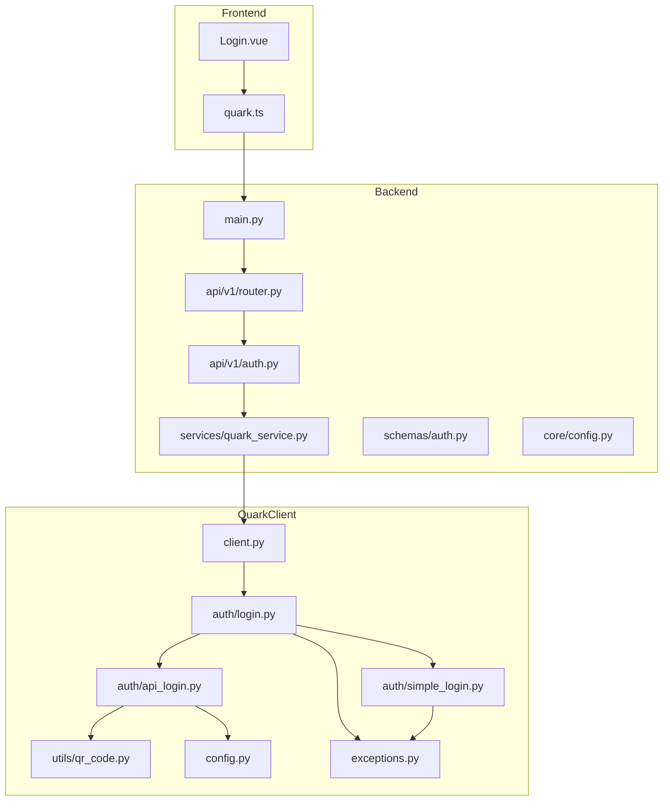
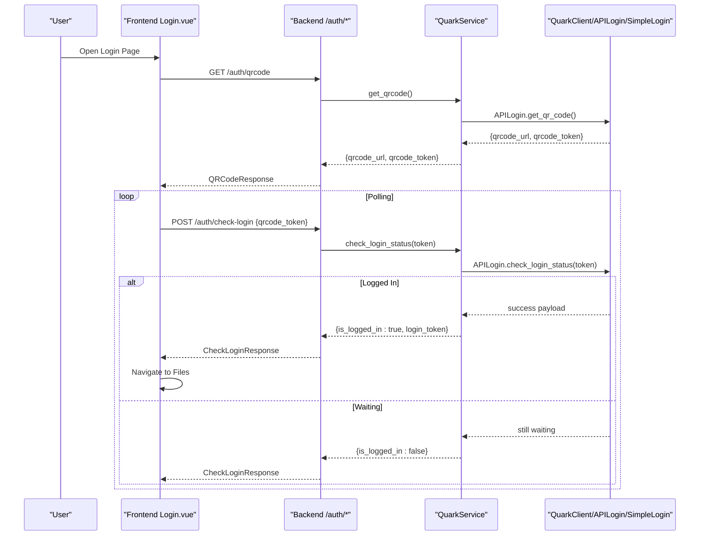
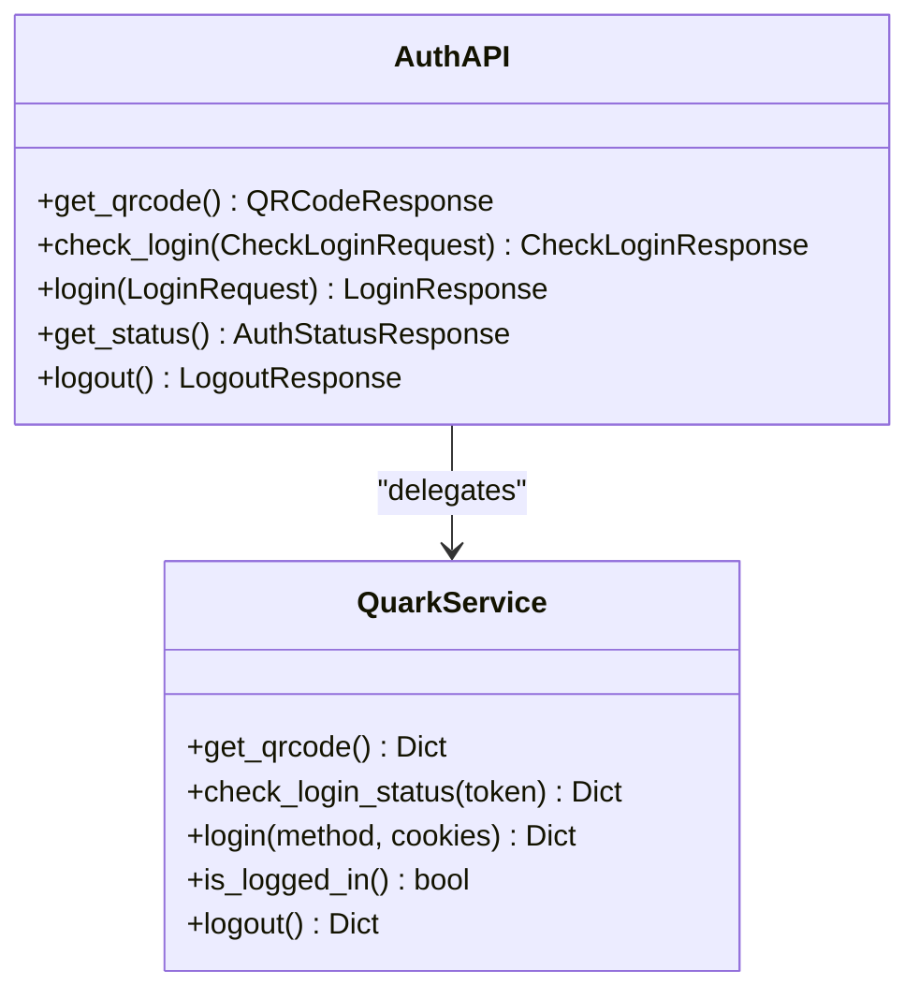
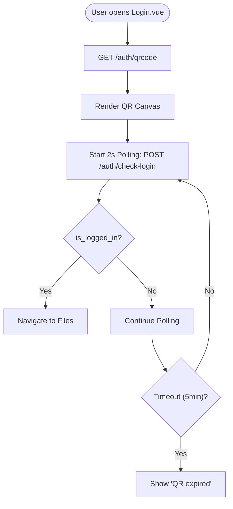
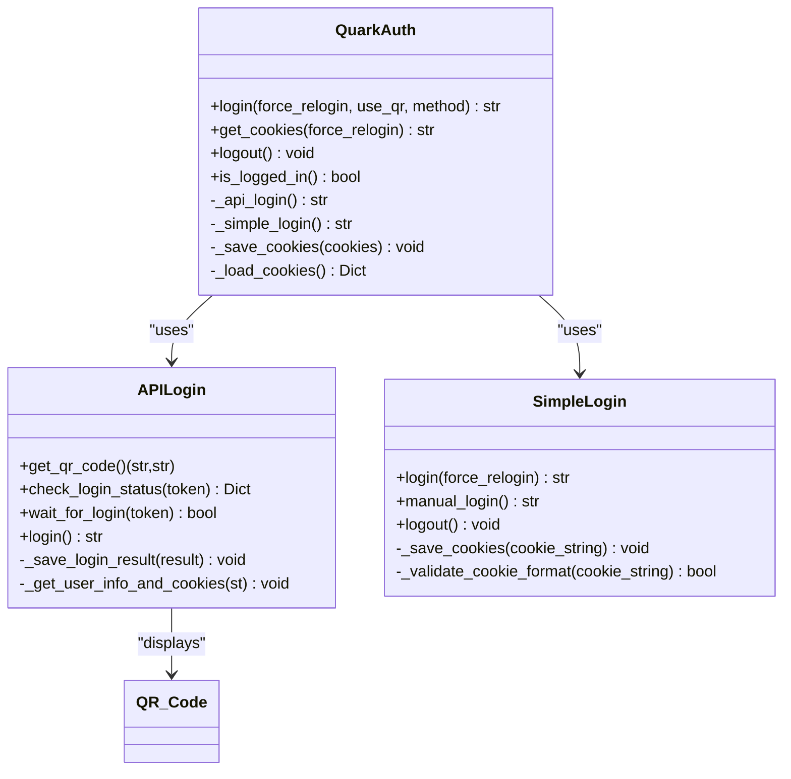
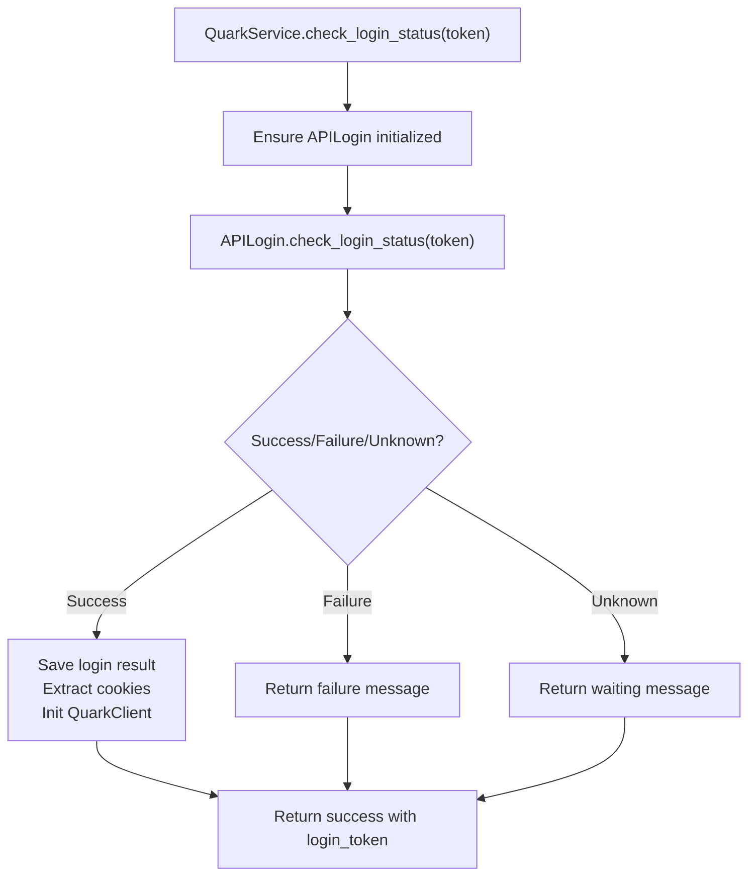
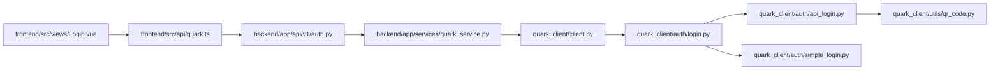

# Authentication System

<cite>
**Referenced Files in This Document**
- [backend/app/api/v1/auth.py](file://backend/app/api/v1/auth.py)
- [backend/app/api/v1/router.py](file://backend/app/api/v1/router.py)
- [backend/app/main.py](file://backend/app/main.py)
- [backend/app/core/config.py](file://backend/app/core/config.py)
- [backend/app/schemas/auth.py](file://backend/app/schemas/auth.py)
- [backend/app/services/quark_service.py](file://backend/app/services/quark_service.py)
- [frontend/src/views/Login.vue](file://frontend/src/views/Login.vue)
- [frontend/src/api/quark.ts](file://frontend/src/api/quark.ts)
- [quark_client/auth/login.py](file://quark_client/auth/login.py)
- [quark_client/auth/api_login.py](file://quark_client/auth/api_login.py)
- [quark_client/auth/simple_login.py](file://quark_client/auth/simple_login.py)
- [quark_client/utils/qr_code.py](file://quark_client/utils/qr_code.py)
- [quark_client/client.py](file://quark_client/client.py)
- [quark_client/config.py](file://quark_client/config.py)
- [quark_client/exceptions.py](file://quark_client/exceptions.py)
</cite>

## Table of Contents
1. [Introduction](#introduction)
2. [Project Structure](#project-structure)
3. [Core Components](#core-components)
4. [Architecture Overview](#architecture-overview)
5. [Detailed Component Analysis](#detailed-component-analysis)
6. [Dependency Analysis](#dependency-analysis)
7. [Performance Considerations](#performance-considerations)
8. [Security Considerations](#security-considerations)
9. [Troubleshooting Guide](#troubleshooting-guide)
10. [Practical Examples](#practical-examples)
11. [Conclusion](#conclusion)

## Introduction
This document provides comprehensive authentication system documentation for QuarkManager. It covers the complete authentication workflow, including QR code login, cookie-based authentication, backend service layer implementation, frontend authentication interface, and QuarkClient utilities. It also details security considerations, troubleshooting, and integration patterns between frontend, backend, and QuarkClient components.

## Project Structure
The authentication system spans three layers:
- Backend API: exposes authentication endpoints and delegates to the service layer.
- Frontend: provides user interfaces for QR code and cookie-based login, and manages polling and feedback.
- QuarkClient: encapsulates authentication utilities, token management, and session handling.

**Diagram sources**
- [backend/app/main.py:12-29](file://backend/app/main.py#L12-L29)
- [backend/app/api/v1/router.py:1-24](file://backend/app/api/v1/router.py#L1-L24)
- [backend/app/api/v1/auth.py:15-107](file://backend/app/api/v1/auth.py#L15-L107)
- [backend/app/services/quark_service.py:23-388](file://backend/app/services/quark_service.py#L23-L388)
- [frontend/src/views/Login.vue:1-290](file://frontend/src/views/Login.vue#L1-L290)
- [frontend/src/api/quark.ts:55-75](file://frontend/src/api/quark.ts#L55-L75)
- [quark_client/client.py:18-74](file://quark_client/client.py#L18-L74)
- [quark_client/auth/login.py:15-301](file://quark_client/auth/login.py#L15-L301)
- [quark_client/auth/api_login.py:20-521](file://quark_client/auth/api_login.py#L20-L521)
- [quark_client/auth/simple_login.py:16-249](file://quark_client/auth/simple_login.py#L16-L249)
- [quark_client/utils/qr_code.py:7-46](file://quark_client/utils/qr_code.py#L7-L46)
- [quark_client/config.py:10-63](file://quark_client/config.py#L10-L63)
- [quark_client/exceptions.py:8-50](file://quark_client/exceptions.py#L8-L50)

**Section sources**
- [backend/app/main.py:12-29](file://backend/app/main.py#L12-L29)
- [backend/app/api/v1/router.py:1-24](file://backend/app/api/v1/router.py#L1-L24)
- [frontend/src/views/Login.vue:1-290](file://frontend/src/views/Login.vue#L1-L290)
- [quark_client/client.py:18-74](file://quark_client/client.py#L18-L74)

## Core Components
- Backend authentication endpoints:
  - GET /auth/qrcode: returns QR code URL and token for non-blocking QR login.
  - POST /auth/check-login: checks login status using the QR token.
  - POST /auth/login: supports both QR and cookie-based login methods.
  - GET /auth/status: returns current authentication status and user info.
  - POST /auth/logout: logs out the current session.
- Frontend authentication interface:
  - QR code tab: generates QR code, polls backend for login status, and navigates on success.
  - Cookie tab: accepts raw cookie input and performs direct login via backend.
- QuarkClient authentication utilities:
  - QuarkAuth: manages cookie persistence, validation, and multi-method login (API, simple).
  - APILogin: handles QR generation, polling, and cookie extraction.
  - SimpleLogin: guides manual cookie acquisition and persistence.
  - QR utilities: ASCII QR rendering for terminal environments.

**Section sources**
- [backend/app/api/v1/auth.py:18-107](file://backend/app/api/v1/auth.py#L18-L107)
- [frontend/src/views/Login.vue:84-215](file://frontend/src/views/Login.vue#L84-L215)
- [quark_client/auth/login.py:107-301](file://quark_client/auth/login.py#L107-L301)
- [quark_client/auth/api_login.py:94-521](file://quark_client/auth/api_login.py#L94-L521)
- [quark_client/auth/simple_login.py:28-249](file://quark_client/auth/simple_login.py#L28-L249)

## Architecture Overview
The authentication flow integrates frontend, backend, and QuarkClient components. The backend acts as a facade delegating to QuarkClient for actual authentication operations.

**Diagram sources**
- [frontend/src/views/Login.vue:84-176](file://frontend/src/views/Login.vue#L84-L176)
- [frontend/src/api/quark.ts:55-75](file://frontend/src/api/quark.ts#L55-L75)
- [backend/app/api/v1/auth.py:18-52](file://backend/app/api/v1/auth.py#L18-L52)
- [backend/app/services/quark_service.py:54-159](file://backend/app/services/quark_service.py#L54-L159)
- [quark_client/auth/api_login.py:255-406](file://quark_client/auth/api_login.py#L255-L406)

## Detailed Component Analysis

### Backend Authentication Endpoints
- Endpoint definitions and responsibilities:
  - GET /auth/qrcode: returns QR code URL and token; frontend polls /auth/check-login.
  - POST /auth/check-login: checks login status using qrcode_token; returns is_logged_in and optional login_token.
  - POST /auth/login: supports method selection ("api" or "simple") and cookie input; returns qrcode_url or cookies.
  - GET /auth/status: checks current login state and fetches user info via QuarkClient.
  - POST /auth/logout: clears session and QuarkClient state.
- Request/response models:
  - LoginRequest/LoginResponse, QRCodeResponse, CheckLoginRequest/CheckLoginResponse, AuthStatusResponse, LogoutResponse.

**Diagram sources**
- [backend/app/api/v1/auth.py:18-107](file://backend/app/api/v1/auth.py#L18-L107)
- [backend/app/services/quark_service.py:54-224](file://backend/app/services/quark_service.py#L54-L224)

**Section sources**
- [backend/app/api/v1/auth.py:18-107](file://backend/app/api/v1/auth.py#L18-L107)
- [backend/app/schemas/auth.py:5-50](file://backend/app/schemas/auth.py#L5-L50)

### Frontend Authentication Interface
- QR code login:
  - Generates QR code via backend, renders canvas, starts polling every 2 seconds, and stops on success or expiry.
  - Displays loading, error, and status messages; navigates to files on success.
- Cookie login:
  - Accepts raw cookie input and posts to backend for direct authentication.
- API bindings:
  - Provides typed wrappers for auth endpoints.

**Diagram sources**
- [frontend/src/views/Login.vue:84-176](file://frontend/src/views/Login.vue#L84-L176)
- [frontend/src/api/quark.ts:55-75](file://frontend/src/api/quark.ts#L55-L75)

**Section sources**
- [frontend/src/views/Login.vue:84-215](file://frontend/src/views/Login.vue#L84-L215)
- [frontend/src/api/quark.ts:55-75](file://frontend/src/api/quark.ts#L55-L75)

### QuarkClient Authentication Utilities
- QuarkAuth:
  - Manages cookie persistence, expiration, and validation.
  - Supports multi-method login: auto (API → simple), API, simple.
  - Converts cookie strings to lists/dicts and validates presence of required keys.
- APILogin:
  - Generates QR token and URL, displays QR, waits for login, extracts cookies, and saves results.
  - Implements polling with countdown timer and timeout handling.
- SimpleLogin:
  - Guides manual cookie acquisition and persistence with validation and help prompts.
- QR utilities:
  - Renders ASCII QR from URL for terminal environments.

**Diagram sources**
- [quark_client/auth/login.py:15-301](file://quark_client/auth/login.py#L15-L301)
- [quark_client/auth/api_login.py:20-521](file://quark_client/auth/api_login.py#L20-L521)
- [quark_client/auth/simple_login.py:16-249](file://quark_client/auth/simple_login.py#L16-L249)
- [quark_client/utils/qr_code.py:40-46](file://quark_client/utils/qr_code.py#L40-L46)

**Section sources**
- [quark_client/auth/login.py:107-301](file://quark_client/auth/login.py#L107-L301)
- [quark_client/auth/api_login.py:94-521](file://quark_client/auth/api_login.py#L94-L521)
- [quark_client/auth/simple_login.py:28-249](file://quark_client/auth/simple_login.py#L28-L249)
- [quark_client/utils/qr_code.py:7-46](file://quark_client/utils/qr_code.py#L7-L46)

### Backend Service Layer Implementation
- QuarkService orchestrates authentication:
  - get_qrcode(): initializes APILogin and returns QR code URL and token.
  - check_login_status(): polls APILogin, handles success/failure/unknown states, and initializes QuarkClient with extracted cookies.
  - login(): supports "simple" method by setting cookies on the API client and "api" method by invoking QuarkClient login.
  - is_logged_in()/logout(): delegate to QuarkClient.
- Error handling and simulation:
  - Graceful fallback when QuarkClient is unavailable (simulation mode).
  - Structured error responses for frontend consumption.

**Diagram sources**
- [backend/app/services/quark_service.py:85-159](file://backend/app/services/quark_service.py#L85-L159)
- [quark_client/auth/api_login.py:255-406](file://quark_client/auth/api_login.py#L255-L406)

**Section sources**
- [backend/app/services/quark_service.py:54-224](file://backend/app/services/quark_service.py#L54-L224)

## Dependency Analysis
- Frontend depends on backend endpoints via typed API wrappers.
- Backend depends on QuarkClient for authentication operations.
- QuarkClient encapsulates APILogin and SimpleLogin, with QR utilities and configuration.

**Diagram sources**
- [frontend/src/views/Login.vue:68-70](file://frontend/src/views/Login.vue#L68-L70)
- [frontend/src/api/quark.ts:55-75](file://frontend/src/api/quark.ts#L55-L75)
- [backend/app/api/v1/auth.py:13](file://backend/app/api/v1/auth.py#L13)
- [backend/app/services/quark_service.py:12-21](file://backend/app/services/quark_service.py#L12-L21)
- [quark_client/client.py:18-48](file://quark_client/client.py#L18-L48)
- [quark_client/auth/login.py:15-32](file://quark_client/auth/login.py#L15-L32)
- [quark_client/auth/api_login.py:20-56](file://quark_client/auth/api_login.py#L20-L56)
- [quark_client/auth/simple_login.py:16-27](file://quark_client/auth/simple_login.py#L16-L27)
- [quark_client/utils/qr_code.py:7-17](file://quark_client/utils/qr_code.py#L7-L17)

**Section sources**
- [backend/app/api/v1/router.py:3-4](file://backend/app/api/v1/router.py#L3-L4)
- [backend/app/main.py:18-25](file://backend/app/main.py#L18-L25)

## Performance Considerations
- Polling interval: frontend polls every 2 seconds; adjust based on UX needs and server load.
- Timeout handling: QR code expiry after 5 minutes; ensure frontend stops polling and informs the user.
- Cookie persistence: QuarkAuth caches cookies locally to avoid repeated login; validate freshness and required keys.
- Backend initialization: QuarkService lazily initializes APILogin and QuarkClient to minimize startup overhead.

[No sources needed since this section provides general guidance]

## Security Considerations
- Token expiration and refresh:
  - QR codes expire after 5 minutes; implement frontend timeout and prompt regeneration.
  - Cookies are validated for required keys and timestamp; consider rotating tokens and short-lived sessions.
- Secure storage:
  - Cookies are stored locally; ensure filesystem permissions restrict access.
  - Avoid logging sensitive data; sanitize outputs in development mode.
- Transport security:
  - Use HTTPS endpoints; configure CORS appropriately.
  - Backend settings define allowed origins; keep production origins restrictive.
- Error handling:
  - Catch and log errors without exposing internal details; return structured error responses.

**Section sources**
- [frontend/src/views/Login.vue:168-176](file://frontend/src/views/Login.vue#L168-L176)
- [quark_client/auth/login.py:45-93](file://quark_client/auth/login.py#L45-L93)
- [backend/app/core/config.py:22-25](file://backend/app/core/config.py#L22-L25)

## Troubleshooting Guide
- QR code generation fails:
  - Verify backend connectivity to external APIs; check APILogin error logs.
  - Confirm network access and DNS resolution for QR endpoints.
- Polling returns "QR expired":
  - Trigger a new QR generation; ensure frontend stops previous timers.
- Login succeeds but navigation does not occur:
  - Confirm frontend routing and successful response handling.
- Cookie login fails:
  - Validate cookie format and required keys; ensure domain matches.
  - Clear cached cookies and retry login.
- Backend unavailable:
  - Check health endpoints and service logs; fallback behavior is simulated when QuarkClient is not available.

**Section sources**
- [quark_client/auth/api_login.py:138-142](file://quark_client/auth/api_login.py#L138-L142)
- [frontend/src/views/Login.vue:157-166](file://frontend/src/views/Login.vue#L157-L166)
- [backend/app/services/quark_service.py:57-84](file://backend/app/services/quark_service.py#L57-L84)

## Practical Examples
- Setup QR code login:
  - Frontend calls GET /auth/qrcode, renders QR, starts 2s polling to POST /auth/check-login, and navigates on success.
- Setup cookie login:
  - Frontend submits raw cookie string to POST /auth/login with method "simple".
- Extending authentication methods:
  - Add new login method in QuarkAuth and update APILogin/SimpleLogin accordingly.
  - Expose new endpoint in backend auth router and integrate with QuarkService.

**Section sources**
- [frontend/src/views/Login.vue:84-176](file://frontend/src/views/Login.vue#L84-L176)
- [frontend/src/api/quark.ts:55-75](file://frontend/src/api/quark.ts#L55-L75)
- [backend/app/api/v1/auth.py:55-76](file://backend/app/api/v1/auth.py#L55-L76)
- [quark_client/auth/login.py:139-162](file://quark_client/auth/login.py#L139-L162)

## Conclusion
QuarkManager’s authentication system combines a robust backend API, a responsive frontend interface, and a flexible QuarkClient authentication layer. The QR code flow leverages non-blocking generation and polling, while cookie-based login offers a direct path. Security and performance are addressed through token timeouts, cookie validation, and efficient polling intervals. The modular design enables straightforward extension and maintenance.