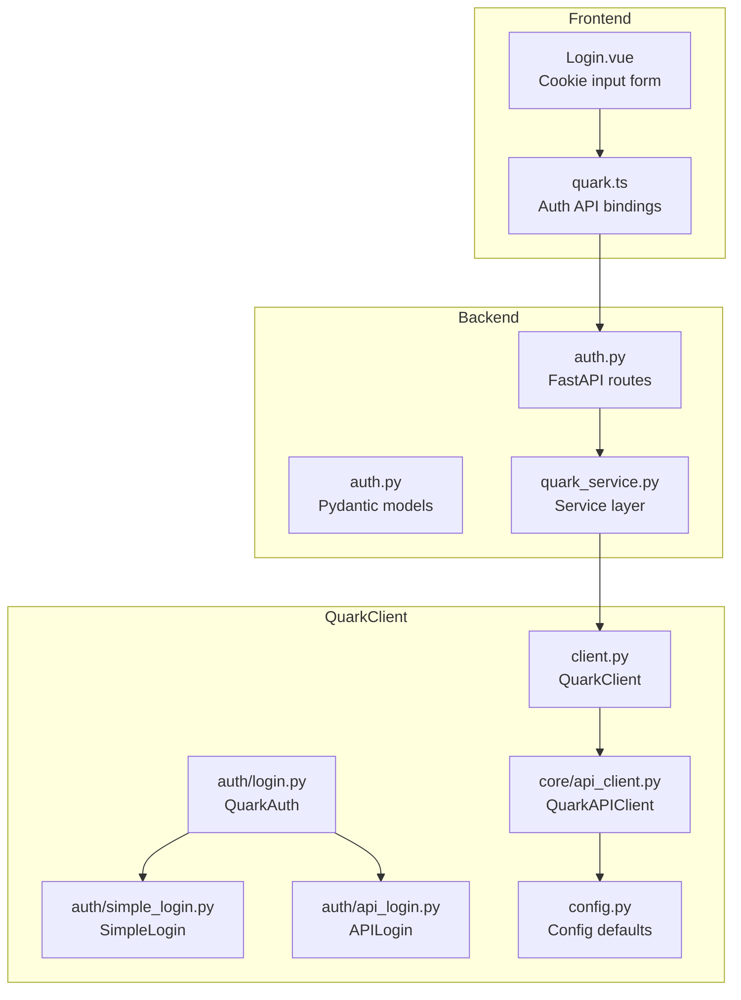
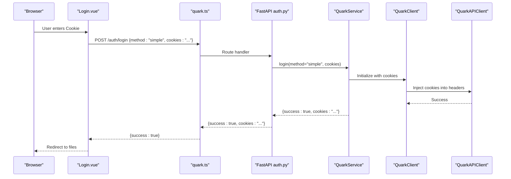
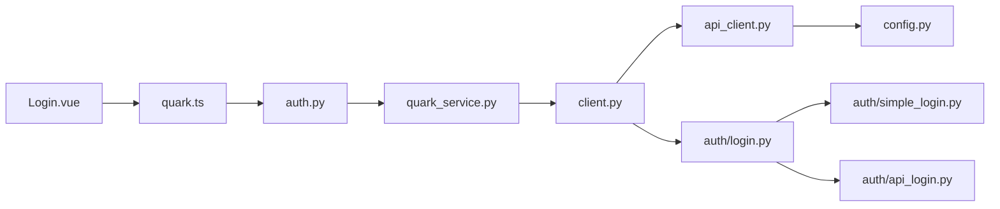

# Cookie Authentication

<cite>
**Referenced Files in This Document**
- [auth.py](file://backend/app/api/v1/auth.py)
- [auth.py](file://backend/app/schemas/auth.py)
- [quark_service.py](file://backend/app/services/quark_service.py)
- [simple_login.py](file://quark_client/auth/simple_login.py)
- [login.py](file://quark_client/auth/login.py)
- [api_login.py](file://quark_client/auth/api_login.py)
- [api_client.py](file://quark_client/core/api_client.py)
- [client.py](file://quark_client/client.py)
- [config.py](file://quark_client/config.py)
- [Login.vue](file://frontend/src/views/Login.vue)
- [quark.ts](file://frontend/src/api/quark.ts)
</cite>

## Table of Contents
1. [Introduction](#introduction)
2. [Project Structure](#project-structure)
3. [Core Components](#core-components)
4. [Architecture Overview](#architecture-overview)
5. [Detailed Component Analysis](#detailed-component-analysis)
6. [Dependency Analysis](#dependency-analysis)
7. [Performance Considerations](#performance-considerations)
8. [Troubleshooting Guide](#troubleshooting-guide)
9. [Security Considerations](#security-considerations)
10. [Practical Examples](#practical-examples)
11. [Conclusion](#conclusion)

## Introduction
This document provides comprehensive coverage of cookie-based authentication implementation for the Quark Manager project. It explains the direct cookie login method via the `/auth/login` endpoint with `method=simple`, cookie string validation, session establishment, and the backend service layer handling for cookie-based authentication. It also documents the QuarkClient authentication utilities for cookie-based login, including cookie format validation, authentication header construction, and session token management. Practical examples and troubleshooting guidance are included for extracting cookies from browser developer tools, formatting requirements, and common issues.

## Project Structure
The cookie authentication implementation spans three layers:
- Backend FastAPI endpoints and service layer
- QuarkClient authentication utilities and HTTP client
- Frontend Vue components and API bindings

**Diagram sources**
- [auth.py:15-107](file://backend/app/api/v1/auth.py#L15-L107)
- [auth.py:1-50](file://backend/app/schemas/auth.py#L1-L50)
- [quark_service.py:23-388](file://backend/app/services/quark_service.py#L23-L388)
- [login.py:15-301](file://quark_client/auth/login.py#L15-L301)
- [simple_login.py:16-249](file://quark_client/auth/simple_login.py#L16-L249)
- [api_login.py:20-521](file://quark_client/auth/api_login.py#L20-L521)
- [client.py:18-405](file://quark_client/client.py#L18-L405)
- [api_client.py:16-209](file://quark_client/core/api_client.py#L16-L209)
- [config.py:10-63](file://quark_client/config.py#L10-L63)
- [Login.vue:186-207](file://frontend/src/views/Login.vue#L186-L207)
- [quark.ts:55-75](file://frontend/src/api/quark.ts#L55-L75)

**Section sources**
- [auth.py:15-107](file://backend/app/api/v1/auth.py#L15-L107)
- [quark_service.py:23-388](file://backend/app/services/quark_service.py#L23-L388)
- [login.py:15-301](file://quark_client/auth/login.py#L15-L301)
- [simple_login.py:16-249](file://quark_client/auth/simple_login.py#L16-L249)
- [api_login.py:20-521](file://quark_client/auth/api_login.py#L20-L521)
- [client.py:18-405](file://quark_client/client.py#L18-L405)
- [api_client.py:16-209](file://quark_client/core/api_client.py#L16-L209)
- [config.py:10-63](file://quark_client/config.py#L10-L63)
- [Login.vue:186-207](file://frontend/src/views/Login.vue#L186-L207)
- [quark.ts:55-75](file://frontend/src/api/quark.ts#L55-L75)

## Core Components
- Backend FastAPI routes for authentication:
  - `/auth/qrcode`: Non-blocking QR code generation
  - `/auth/check-login`: Polling endpoint to check login status
  - `/auth/login`: Main login endpoint supporting method selection
  - `/auth/status`: Current authentication status
  - `/auth/logout`: Logout endpoint
- Backend service layer:
  - QuarkService orchestrates login methods and manages session state
- QuarkClient authentication utilities:
  - QuarkAuth: Multi-method login manager with cookie persistence
  - SimpleLogin: Manual cookie input and validation
  - APILogin: QR code-based login flow
  - QuarkAPIClient: HTTP client with cookie injection and error handling
- Frontend:
  - Login.vue: Cookie input form and submission
  - quark.ts: API bindings for auth endpoints

Key cookie-related logic:
- Cookie string validation and parsing
- Session establishment via cookie injection into HTTP requests
- Local cookie storage and expiration checks
- Logout clearing of stored credentials

**Section sources**
- [auth.py:18-107](file://backend/app/api/v1/auth.py#L18-L107)
- [auth.py:5-50](file://backend/app/schemas/auth.py#L5-L50)
- [quark_service.py:161-224](file://backend/app/services/quark_service.py#L161-L224)
- [login.py:107-260](file://quark_client/auth/login.py#L107-L260)
- [simple_login.py:133-204](file://quark_client/auth/simple_login.py#L133-L204)
- [api_client.py:68-183](file://quark_client/core/api_client.py#L68-L183)
- [Login.vue:186-207](file://frontend/src/views/Login.vue#L186-L207)
- [quark.ts:64-74](file://frontend/src/api/quark.ts#L64-L74)

## Architecture Overview
The cookie-based authentication flow integrates frontend, backend, and client libraries:

**Diagram sources**
- [auth.py:55-75](file://backend/app/api/v1/auth.py#L55-L75)
- [quark_service.py:161-197](file://backend/app/services/quark_service.py#L161-L197)
- [client.py:50-64](file://quark_client/client.py#L50-L64)
- [api_client.py:68-78](file://quark_client/core/api_client.py#L68-L78)
- [Login.vue:186-207](file://frontend/src/views/Login.vue#L186-L207)
- [quark.ts:64-74](file://frontend/src/api/quark.ts#L64-L74)

## Detailed Component Analysis

### Backend Authentication Endpoints
- `/auth/login`:
  - Accepts method and cookies
  - Delegates to service layer
  - Returns success status and cookies on success
- `/auth/status`:
  - Checks current login state and user info
- `/auth/logout`:
  - Clears session state

Validation and error handling:
- HTTP 400 responses for invalid requests
- Pydantic models enforce request/response shapes

**Section sources**
- [auth.py:55-107](file://backend/app/api/v1/auth.py#L55-L107)
- [auth.py:5-50](file://backend/app/schemas/auth.py#L5-L50)

### Backend Service Layer (QuarkService)
Responsibilities:
- Initialize QuarkClient with provided cookies
- Manage login state and session persistence
- Expose convenience methods for file operations

Cookie-based login flow:
- When method="simple" and cookies provided, inject cookies into client
- Return success without additional login steps

Session management:
- Tracks login state internally
- Provides is_logged_in and logout helpers

**Section sources**
- [quark_service.py:161-197](file://backend/app/services/quark_service.py#L161-L197)
- [quark_service.py:199-224](file://backend/app/services/quark_service.py#L199-L224)

### QuarkClient Authentication Utilities
- QuarkAuth:
  - Multi-method login manager
  - Persists cookies locally with expiration checks
  - Converts between cookie list and string formats
  - Validates cookies presence and required fields
- SimpleLogin:
  - Guides manual cookie input
  - Validates cookie format and required keys
  - Saves cookies to local file
  - Loads and validates saved cookies with expiry

Cookie parsing and validation:
- Parses cookie string into structured format
- Validates presence of required cookie keys
- Ensures cookie string format compliance

**Section sources**
- [login.py:107-260](file://quark_client/auth/login.py#L107-L260)
- [simple_login.py:133-204](file://quark_client/auth/simple_login.py#L133-L204)

### HTTP Client and Header Construction
- QuarkAPIClient:
  - Builds request headers with cookie injection
  - Handles authentication errors and HTTP status codes
  - Manages timeouts and retries via configuration

Header construction:
- Adds cookie header when cookies are present
- Uses default headers from configuration

Error handling:
- Distinguishes authentication failures vs. network/API errors
- Raises typed exceptions for downstream handling

**Section sources**
- [api_client.py:68-183](file://quark_client/core/api_client.py#L68-L183)
- [config.py:21-31](file://quark_client/config.py#L21-L31)

### Frontend Integration
- Login.vue:
  - Provides textarea for cookie input
  - Submits to backend with method=simple
  - Redirects on success
- quark.ts:
  - Defines request/response interfaces
  - Exposes authAPI methods for QR code, login, status, and logout

**Section sources**
- [Login.vue:186-207](file://frontend/src/views/Login.vue#L186-L207)
- [quark.ts:3-41](file://frontend/src/api/quark.ts#L3-L41)
- [quark.ts:55-75](file://frontend/src/api/quark.ts#L55-L75)

## Dependency Analysis
High-level dependencies:
- Frontend depends on backend auth endpoints
- Backend depends on QuarkClient for session management
- QuarkClient depends on HTTP client and authentication utilities
- Authentication utilities depend on configuration and local storage

**Diagram sources**
- [Login.vue](file://frontend/src/views/Login.vue#L68)
- [quark.ts:55-75](file://frontend/src/api/quark.ts#L55-L75)
- [auth.py:15-107](file://backend/app/api/v1/auth.py#L15-L107)
- [quark_service.py:23-388](file://backend/app/services/quark_service.py#L23-L388)
- [client.py:18-405](file://quark_client/client.py#L18-L405)
- [api_client.py:16-209](file://quark_client/core/api_client.py#L16-L209)
- [login.py:15-301](file://quark_client/auth/login.py#L15-L301)
- [simple_login.py:16-249](file://quark_client/auth/simple_login.py#L16-L249)
- [api_login.py:20-521](file://quark_client/auth/api_login.py#L20-L521)
- [config.py:10-63](file://quark_client/config.py#L10-L63)

**Section sources**
- [auth.py:15-107](file://backend/app/api/v1/auth.py#L15-L107)
- [quark_service.py:23-388](file://backend/app/services/quark_service.py#L23-L388)
- [client.py:18-405](file://quark_client/client.py#L18-L405)
- [api_client.py:16-209](file://quark_client/core/api_client.py#L16-L209)
- [login.py:15-301](file://quark_client/auth/login.py#L15-L301)
- [simple_login.py:16-249](file://quark_client/auth/simple_login.py#L16-L249)
- [api_login.py:20-521](file://quark_client/auth/api_login.py#L20-L521)
- [config.py:10-63](file://quark_client/config.py#L10-L63)
- [Login.vue](file://frontend/src/views/Login.vue#L68)
- [quark.ts:55-75](file://frontend/src/api/quark.ts#L55-L75)

## Performance Considerations
- Cookie validation occurs on the client side before sending to backend, reducing unnecessary network calls.
- Backend service layer initializes QuarkClient only when needed, avoiding redundant initialization.
- HTTP client uses connection reuse and follows redirects to minimize overhead.
- Frontend polling interval for QR code login is tuned to balance responsiveness and server load.

## Troubleshooting Guide
Common issues and resolutions:
- Invalid cookie format:
  - Ensure cookie string contains required keys and proper delimiter
  - Verify cookie originates from the correct domain
- Authentication failures:
  - Check cookie expiration and regenerate if expired
  - Confirm cookie injection into HTTP headers
- Network/API errors:
  - Review HTTP status codes and error messages
  - Validate backend connectivity and endpoint availability
- Frontend login failures:
  - Verify form submission payload includes method and cookies
  - Check console for API error responses

**Section sources**
- [simple_login.py:133-150](file://quark_client/auth/simple_login.py#L133-L150)
- [api_client.py:146-183](file://quark_client/core/api_client.py#L146-L183)
- [Login.vue:186-207](file://frontend/src/views/Login.vue#L186-L207)

## Security Considerations
- Cookie storage:
  - Store cookies locally with expiration checks
  - Clear stored cookies on logout
- Transmission security:
  - Use HTTPS for all endpoints
  - Avoid exposing cookies in logs or error messages
- Session management:
  - Validate cookie presence and required fields
  - Implement logout to invalidate session tokens
- Cleanup:
  - Remove local cookie files upon logout
  - Ensure sensitive data is not persisted longer than necessary

**Section sources**
- [login.py:261-269](file://quark_client/auth/login.py#L261-L269)
- [simple_login.py:225-235](file://quark_client/auth/simple_login.py#L225-L235)
- [quark_service.py:208-224](file://backend/app/services/quark_service.py#L208-L224)

## Practical Examples
- Extracting cookies from browser developer tools:
  - Open Developer Tools (Network tab)
  - Refresh page and copy Cookie header from any request
  - Alternatively, copy as cURL and extract the cookie value
- Cookie string formatting requirements:
  - Must include required keys (e.g., __kps, __uid)
  - Proper delimiter and spacing between pairs
- Using the cookie login flow:
  - Enter cookie string in the Cookie login tab
  - Submit to `/auth/login` with method=simple
  - On success, redirect to file listing

**Section sources**
- [simple_login.py:47-131](file://quark_client/auth/simple_login.py#L47-L131)
- [Login.vue:186-207](file://frontend/src/views/Login.vue#L186-L207)
- [quark.ts:64-74](file://frontend/src/api/quark.ts#L64-L74)

## Conclusion
The cookie-based authentication implementation provides a streamlined login path via direct cookie submission. The backend FastAPI endpoints delegate to a robust service layer that initializes the QuarkClient with provided cookies, while the QuarkClient authentication utilities handle cookie validation, parsing, persistence, and HTTP header construction. The frontend integrates seamlessly with these components to deliver a user-friendly cookie login experience. Proper validation, secure storage, and logout procedures ensure a reliable and secure authentication flow.